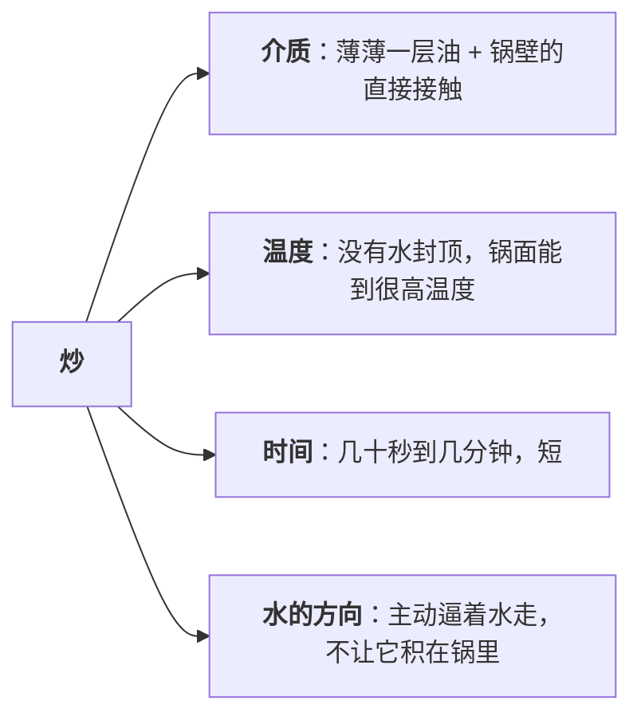
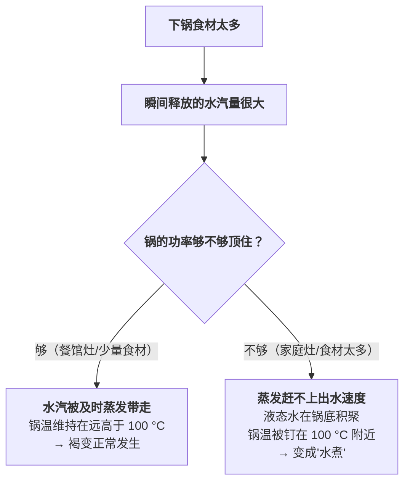
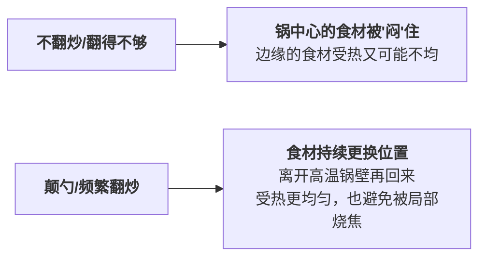

# 第 23 章 炒：短时间、高温、少水

> **本章目标**：解释一个几乎每个在家做饭的人都遇到过的挫败——
> "为什么我炒出来的菜总是一摊水，饭店炒的却是干爽的、带着焦香"。
>
> 答案不在手艺，在**一道算术题**：**你的灶能给多少功率，
> 和你下了多少食材，这两个数字的比例**。
>
> 这一章回答四个问题：
>
> 1. **"炒"在物理上到底是什么？**（和"水煮"的边界在哪）
> 2. **家庭灶炒菜失败的第一原因是什么？**（几乎总是同一个）
> 3. **颠勺/翻炒到底在干什么？**（不是为了好看）
> 4. **油在"炒"里扮演什么角色？**（不只是防粘）

## 23.1 炒是什么：用少量油做介质的短时高温干热

把"炒"放进第一部分的框架里看，它的位置很清楚：

第 2 章已经讲过换热系数的量级：**锅面接触**的换热系数（约 200 W/(m²·K)量级）
比**静止空气**（约 8）高一个数量级以上。这就是"炒"比"烤"更快的物理原因——
食材几乎直接贴着一个高温金属表面。

第 7 章又讲过一条更关键的规律：**只要表面还有液态水，温度就被钉在
约 100 °C 附近**，褐变反应起不来。所以"炒"这个动作的核心任务，
从来不是"让食材变熟"（那件事很容易），而是：

> **在食材本身出水的同时，想办法让水比它出来的速度更快地离开锅**，
> 这样锅面温度才能一直维持在远高于 100 °C 的水平，褐变反应才有机会发生。

这就是为什么"炒"和"水煮"的边界，本质上是**一道关于水的赛跑**，
而不是"锅里有没有放油"这么简单。

## 23.2 失败的第一原因：功率不够，食材太多

第 7 章已经核到一组很关键的数字：

| | 典型功率 | 一次能褐变的肉量级 |
|---|---------|------------------|
| **家用灶** | 通常最高约 **2.5 kW** | 约 **800 g** |
| **餐馆灶** | 常可达 **8 kW** | 约 **2.5 kg** |

家用灶和餐馆灶的功率差距在**3 倍以上**——这不是哪家餐馆的秘方，
是客观的硬件差距。而且这还只是"炉头能给多少热量"，
没算上专业大功率燃气灶**还配着更大的锅、更强的排风**，
能让蒸发掉的水汽更快离开烹饪区域。

> ## 第一条可迁移规则
>
> **家庭灶炒菜，第一个要问的问题永远是："这一锅的量，我的灶顶得住吗？"**
>
> 具体的操作判据：**一次下锅的食材量，要让锅子还有足够的"功率富余"
> 去蒸发掉它释放的水**——按第 7 章的量级，家用灶大约能稳定地让
> **800 g 左右**的肉类食材发生明显褐变；超过这个量，**先分批炒**，
> 而不是加大火或者延长时间硬扛（延长时间只会让先下锅的部分过火，
> 后出水的部分还在被"水煮"）。

**这条规则同样解释了一个常见误解**：很多人以为"菜谱翻倍失败"
是因为自己手艺不够，其实往往只是**按比例放大食材之后，功率没有
跟着放大**——这是第 7 章已经明确提醒过的一条陷阱。

## 23.3 颠勺与翻炒：真正在解决的是"均匀受热"

厨房里经常把"镬气"[^1]和"颠勺"[^2]神化成一种玄学手艺。拆开看，
它解决的是一个很具体的物理问题。

一项用高速摄像记录专业厨师颠勺动作的研究，把这个动作拆成了两个分量：

> **平移**（把食材沿锅底推送）+ **旋转**（把食材抛向空中），
> 整个周期约 **0.3 秒**；厨师很少把锅完全端离炉火，
> 而是让锅的一点**始终贴着炉台或锅架做类似杠杆的摆动**。

> ## 第二条可迁移规则
>
> **翻炒的核心功能是"让食材不断离开最热的那个点再回来"**——
> 这样既能利用锅壁的局部高温完成褐变，又不会让某一块食材
> 一直贴着锅壁被烧焦。在家里做不到专业颠勺的幅度，
> **用铲子勤翻、保持食材持续流动**是功能上完全等效的替代方案。

⚠️ **诚实说明**：这项研究在摘要与引言里还给出了"食材经历约 1200 °C
高温而不烧焦""镬气只在锅面约 1000 °C 时才出现"这两个温度数字，
**本书核查后决定不采信**。原因有两条：①这组数字发表后在
有实际操作经验的读者群体中引发了可信的质疑——钢材在约 1200 °C
会呈亮黄色、接近铸铁的熔点，这和家庭及专业炒锅的实际观感明显不符；
②该论文正文**没有展示独立的测温方法**来支撑这两个数字。
本书只采用这项研究**关于颠勺运动学（平移+旋转分解、周期、均匀
受热这个功能性目的）**的部分，不引用它的温度主张——
这正是第 1.1 节查证纪律里"核到一个数字不等于可以采信"的一次示范：
一篇发表在同行评议期刊上的论文，不自动等于它的每一个具体数字都可信。

## 23.4 油在"炒"里的三个角色

油不只是"防止粘锅"，它同时在做三件事：

| 角色 | 机制 |
|------|------|
| **传热介质** | 油能均匀地把锅壁的热量传递到食材表面，比食材直接接触金属更均匀（避免局部过热烧焦） |
| **把温度顶在 100 °C 以上** | 这是第 18 章已经核到的"过油"原理在炒菜里的体现——只要还是水做介质，温度就上不去，而油本身可以远高于 100 °C |
| **风味载体** | 很多呈味与香气物质是脂溶性的，油能把它们带到食材表面并帮助均匀分布（第 13 章已讲过香气跨模态增强的机制） |

### 烟点：一个真实但有局限的判据

油受热到一定温度会开始冒烟，这个温度叫**烟点**。一项针对特级初榨
橄榄油烟点预测模型的研究给出了几条值得记住的结论：

> **烟点的定义**是油开始持续冒出一缕烟的最低温度；
> **游离脂肪酸含量是决定烟点的最主要变量**（含量越高、烟点越低），
> 而**饱和脂肪酸含量与氧化稳定性则会提高烟点**；
> 烟点"仍依赖主观目视判断、重现性欠佳"，但仍被广泛用于
> 评估煎炸油的热稳定性，一般建议用于高温煎炸的油烟点高于约 200 °C。

该研究同时特别提醒：**烟点不等于氧化稳定性**——这是两个相关但
独立的指标（例如特级初榨橄榄油烟点相对低，但氧化稳定性可能
比一些烟点更高的油更好）。

> ⚠️ **本书不列具体油种的烟点数字表**。市面上流传的"花生油 232 °C、
> 橄榄油 190 °C"这类对照表，**本书没有核到统一可靠的一手同行评议
> 数据来源**——不同品牌、不同精炼程度、不同检测方法给出的数字
> 差异很大。能确定的只有方向：**精炼程度越高、游离脂肪酸含量越低，
> 烟点通常越高**，这解释了"精炼花生油/菜籽油适合爆炒、
> 特级初榨橄榄油更适合低温或凉拌"这条经验的机制基础。

> ## 第三条可迁移规则
>
> **油开始冒烟，是油在分解的信号，不是"够热了"的信号。**
> 第 2 章已经辨析过"热锅冷油"这个惯例本身缺乏直接实验证据，
> 但从烟点这个角度看，**"锅烧到冒烟再倒油"确实有被质疑的理由**——
> 更稳妥的判据是"锅充分预热但油还没到冒烟"，而不是追求"冒烟"
> 这个视觉效果本身。

## 23.5 蔬菜炒和肉炒：同一套物理，两种失败模式

第 20 章已经专门讲过蔬菜的四种失败，这里把它和"炒"这个技法对上：

| | 瘦肉类 | 蔬菜类 |
|---|-------|-------|
| **炒失败的典型表现** | 变柴、发硬（第 4 章"悬崖"） | 出水、变软烂、发黄（第 20 章） |
| **背后的机制** | 蛋白质在约 62~72 °C 区间大量失水 | 细胞膜高于约 40 °C 即破裂、膨压丧失 |
| **"炒"这个技法对它的意义** | 短时高温能让表面褐变、同时让中心尽快越过或停在合适温度区间 | 短时高温能让水分来不及大量渗出就被蒸发带走 |

> **这解释了为什么"炒"对这两类食材都有效，但原因不是同一个**：
> 对肉，炒的价值是**缩短停留在危险温度区间的时间**；
> 对蔬菜，炒的价值是**缩短总的受热时间，让发黄和出水都来不及充分发生**
> （第 20 章"发黄跟总时间走，不跟火力走"的直接应用）。
> 两者殊途同归地指向同一个操作结论：**快**。

## 23.6 本章的可迁移规则

> ## 炒菜失败，先按这个顺序排查
>
> 1. **这一锅的量，灶顶得住吗？**（23.2 节：家用灶约 800 g 肉的量级上限）
> 2. **表面是不是太湿？**（下锅前食材有没有擦干、腌料有没有带太多水分，
>    呼应第 7 章"褐变前先把水弄干"）
> 3. **翻得够不够勤？**（23.3 节：避免局部过久贴着锅壁）
> 4. **油是不是已经开始冒烟？**（23.4 节：冒烟是分解信号，不是"够热"信号）
>
> **这四条里，第 1 条解释的失败案例最多，也最常被忽略**——
> 大多数人下意识归咎于"火不够大""锅不够好"，
> 但**真正的瓶颈往往是那道"功率 ÷ 食材量"的算术题**。

## 23.7 常见说法辨析

按本书约定标注**证据强度**：✅ 有共识 / ⚠️ 有争议 / ❌ 明确错误 / 缺乏证据。
来源见[出处登记](../../standards.md)。

| 说法 | 判定 | 说明 |
|------|------|------|
| "炒菜出水是因为手艺不够" | ❌ **主要是功率问题** | 家用灶（通常最高约 2.5 kW）一次约只能让 800 g 左右肉类明显褐变，餐馆灶（约 8 kW）约能处理 2.5 kg——差距在 3 倍以上。一次下太多食材，锅的功率顶不住骤增的蒸发量，锅温被钉在 100 °C 附近，和手艺无关 |
| "颠勺是为了好看，没有实际作用" | ❌ **有明确的功能** | 一项颠勺物理学研究表明，这个动作由平移与旋转组成，核心作用是让食材**不断离开最热的锅壁再回来**，兼顾褐变与避免局部烧焦；在家用铲子勤翻可以起到功能上的等效替代 |
| "颠勺能让食材瞬间经历上千度高温" | ❌ **本书明确不采信** | 这个数字出自一篇物理学论文的摘要，但发表后即被有实操经验的读者质疑（钢材在约 1200 °C 会呈亮黄色、接近铸铁熔点），论文本身也未展示独立测温方法支撑该数字。本书只采用该研究关于颠勺运动学的部分 |
| "锅烧到冒烟再倒油最好" | ⚠️ **值得重新考虑** | 冒烟是油**开始分解**的信号（游离脂肪酸含量越高，烟点越低、越容易冒烟），不是"达到合适温度"的信号。更稳妥的判据是锅已经充分预热、但油还没到冒烟的状态 |
| "特级初榨橄榄油不适合高温爆炒" | ⚠️ **方向有一定道理，但"烟点低=不好"不是全部故事** | 特级初榨橄榄油的烟点相对较低，但一项研究同时指出**烟点不等于氧化稳定性**——橄榄油烟点低，氧化稳定性未必比一些烟点更高的油差。本书不对"哪种油最好"下绝对结论，只给"烟点"和"氧化稳定性"是两个独立指标这条认知 |
| "菜谱翻倍做，味道应该一样" | ❌ **功率不会跟着翻倍** | 食材量翻倍、锅的功率没变，蒸发和褐变所需的"功率/食材量"比例被破坏，这是第 7 章已经明确提醒过的陷阱，本章延续并应用到"炒"这个具体技法上 |

## 23.8 思考题

1. 为什么说"炒"的核心任务是"让水走得比出得快"而不是"让食材变熟"？
2. 家用灶和餐馆灶的功率差距大致是多少？这个差距怎么解释"菜谱翻倍失败"？
3. 颠勺的两个动作分量分别是什么？它解决的核心问题是什么？
4. 为什么说"锅烧到冒烟"这个判据值得重新考虑？请用烟点的机制解释。
5. **【案例】** 你打算用家里的燃气灶（普通功率）炒一盘 600 g 的瘦肉丝，
   配菜是切好的青椒丝和木耳。
   （a）按本章的量级判据，这个量家用灶大致能不能顶住？
   （b）如果担心顶不住，你会怎么调整下锅的顺序和批次？
   （c）肉丝和蔬菜在这盘菜里各自最可能出现哪种失败？分别对应第 4 章
   还是第 20 章的哪条机制？
   （d）油什么时候倒、倒多少，你会按本章哪条规律来判断？
6. **【案例】** 一位朋友说"我家灶火力特别大，炒什么都特别香，
   一定是镬气的功劳，锅肯定烧到了一千多度"。
   （a）请用本章的内容评估这句话里哪部分可信、哪部分不可信；
   （b）如果他的菜确实比你做得香，更可能的原因是什么（提示：
   结合 23.2、23.3 节重新考虑）？
7. **【辨析】** "颠勺能让食材经历极端高温，这是镬气的科学原理"——
   判断证据强度，并说明本书为什么拒绝采信这个数字。
8. **【辨析】** "只要油开始冒烟，说明锅已经够热了，可以下菜了"——
   判断证据强度，并说明正确的操作判据应该是什么。

> 📖 **参考答案**（想清楚再看）：[Q1](../../qa/23-stir-fry-qa.md#q1) ·
> [Q2](../../qa/23-stir-fry-qa.md#q2) · [Q3](../../qa/23-stir-fry-qa.md#q3) ·
> [Q4](../../qa/23-stir-fry-qa.md#q4) · [Q5](../../qa/23-stir-fry-qa.md#q5) ·
> [Q6](../../qa/23-stir-fry-qa.md#q6) · [Q7](../../qa/23-stir-fry-qa.md#q7) ·
> [Q8](../../qa/23-stir-fry-qa.md#q8)

## 23.9 本章实操

### 🅐 零成本版 · 任务一：给自己家的灶估一个"安全下锅量"

不用开火。找到家里燃气灶的铭牌或说明书，看能不能找到额定功率
（单位通常是 W 或 kW）。

| 我家灶的额定功率 | 和本章"约 2.5 kW"相比 | 我估计的安全单次下锅量（肉类） |
|----------------|-------------------|------------------------|
| | | |

如果找不到铭牌信息，用本章给出的"家用灶通常最高约 2.5 kW"作为
默认估计。做完回答：**以前炒菜出水严重的那几次，是不是食材量
明显超过了这个估计值？**

### 🅐 零成本版 · 任务二：把一份炒菜菜谱标注"功率检查"

拿一份写明食材分量的炒菜菜谱：

| 菜谱里的食材总量 | 按本章的量级，家用灶能不能一次顶住 | 如果顶不住，你会怎么分批 |
|---------------|------------------------------|---------------------|
| | | |

### 🅑 开火版 · 任务三：同一份食材，一次下 vs 分批下（有灶台时做）

**需要**：切好的瘦肉丝或蔬菜丝 400~500 g（分成两等份）、同一口锅、
同样的火力、计时器。

| 组 | 处理 | 锅里积水多少 | 颜色（有没有明显褐变/焦香） | 口感 |
|----|------|------------|------------------------|------|
| ① | **一次全下** | | | |
| ② | **分两批下**（第一批炒好盛出，再炒第二批，最后混合） | | | |

做完回答：

1. 哪一组积水更少、颜色更好？这和本章 23.2 节的方向一致吗？
2. 分批炒多花的时间，换来的差别你觉得值不值？
3. ⚠️ 这是单次、无重复的家庭观察，不能当成"分批一定更好"的严格结论，
   只能当成你自己这次灶具/食材下的一个参考点。

### 🅑 开火版 · 任务四：翻炒频率的对照

**需要**：同一种食材分两份、同一口锅、同样的火力和下锅量。

**唯一变量**：翻炒频率（例如一份每隔几秒翻一次，另一份放置较长时间
才翻一次）。

| 组 | 翻炒频率 | 有没有局部烧焦/发黑 | 整体颜色是否均匀 | 口感 |
|----|---------|------------------|----------------|------|
| ① 勤翻 | | | | |
| ② 少翻 | | | | |

做完回答：

1. 哪一组更容易出现局部烧焦？这对应本章哪条机制？
2. 哪一组整体受热看起来更均匀？

> ⚠️ **安全提醒**：热油飞溅会造成严重烫伤，下料时食材贴近锅面轻放，
> 锅柄朝内，油温较高时不要用湿手或湿食材直接下锅。
> 生熟分开，处理生肉后的砧板、刀具需清洗后再处理熟食或蔬菜（交叉污染）。
> 炒好的菜按美国 FDA 的指引应在**烹调后 2 小时内**冷藏
> （环境温度高于 90 °F 时缩短到 1 小时）。**各国口径不同，
> 以自己所在地现行发布为准。**

## 23.10 🔎 下次做菜时的用处

1. **炒菜出水先别怪自己手艺**，先问这一锅的量，灶顶不顶得住。
2. **超过安全量就分批**，分批多花的时间远小于重新补救一锅"水煮菜"的成本。
3. **锅别等到冒烟才倒油**——冒烟是油在分解，不是"够热了"。
4. **没有颠勺的本事就勤翻铲子**——目的是均匀受热，不是为了耍帅。
5. **肉炒老了先想"是不是超过了那段危险温度区间"**（第 4 章），
   **蔬菜炒蔫了先想"是不是炒的时间太长"**（第 20 章）——
   同样是炒，两类食材失败的机制不一样。
6. **不同油适合不同用途，不用追求一瓶油包打天下**——
   精炼程度高、游离脂肪酸低的油通常烟点更高，更适合爆炒；
   风味突出、烟点相对低的油更适合低温或凉拌。

## 23.11 本章依据

本章引用的来源与核对状态详见[参考书目与出处登记](../../standards.md)，具体对应如下：

| 本章用到的内容 | 依据 |
|--------------|------|
| 家用灶功率通常最高约 2.5 kW、一次约能褐变 800 g 肉；餐馆灶约 8 kW、约 2.5 kg；菜谱放大可能失败；爆炒时食材平均表面温度低于 100 °C | 第 2、7 章已登记（一篇关于分子美食学的综述，*Chemical Reviews*，2010，PMC2855180），✅，本章复用 |
| 换热系数量级：锅接触约 200 W/(m²·K)、静止空气约 8 W/(m²·K) | 第 2 章已登记（PMC12615324），✅，本章复用 |
| 颠勺动作由平移与旋转两个分量组成，周期约 0.3 秒（频率 2.7±0.3 Hz）；厨师很少把锅完全端离炉火；锅宽约 39 cm、深约 13 cm；一份炒饭约 0.3 kg；颠勺与厨师肩部疼痛相关（64.5% 反馈） | 一项用高速摄像与理论建模研究颠勺物理的论文，*Journal of the Royal Society Interface*，2020（PMC7061713），✅ 开放获取全文（运动学部分）。⚠️ **该论文"锅面约 1000~1200 °C"的温度主张本书明确不采信**，详见正文 23.3 节说明 |
| 烟点定义为油开始持续冒出一缕烟的最低温度；游离脂肪酸含量是决定烟点的主要变量；饱和脂肪酸含量与氧化稳定性提高烟点；烟点依赖主观目视判断、重现性欠佳；烟点不等于氧化稳定性 | 一项关于特级初榨橄榄油烟点复杂性与预测模型的研究，*Foods*，2025（PMC12692607），✅ 开放获取全文。⚠️ 样本为特级初榨橄榄油，结论向其他油种推广的程度未经本研究验证 |
| 蛋白质在约 62~72 °C 区间大量失水；细胞膜高于约 40 °C 破裂、膨压丧失；发黄跟总受热时间走、不跟火力走 | 第 4、20 章已登记，✅，本章复用对照"肉炒老"与"菜炒蔫"两种失败机制 |
| 过油（用油代替水做预处理）能让温度高于 100 °C、不会把可溶物泡走 | 第 18 章已登记，✅，本章复用解释油在炒菜中"顶温度"的角色 |
| 热锅冷油缺乏直接实验证据 | 第 2 章已登记为缺口，✅，本章延续该立场并补充"烟点"这个角度的质疑理由 |
| 熟食 2 小时冷藏规则 | 美国 FDA「Safe Food Handling」，✅（第 4 章已登记）。⚠️ 各国口径不同 |
| "镬气锅面温度""家用油种精确烟点对照表""分批下料改善幅度的家庭尺度定量" | ⚠️ **均未核到可靠一手数据**，已登记在[出处登记](../../standards.md)的缺口清单，正文分别标为"不采信""不列表""只给方向" |

[^1]: [镬气](../../glossary.md#huoqi)（wok hei）。
[^2]: [颠勺 / 翻炒](../../glossary.md#wok-tossing)（wok tossing）。

---

**下一章**：第 24 章 煎——接触传热与"粘锅"的物理。
炒解决的是"水往哪走"，煎要解决的是一个更具体的问题：
**粘锅到底是什么在粘住什么，而它是不是像传说中那样不可预测。**
