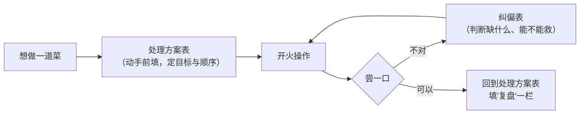

# 记录表

> 这些表是**可复用**的：各章实操与实战项目都链到这里，不在章节里复制粘贴。
> 直接抄到笔记软件、手机备忘录或纸上都行——它们是**普通 Markdown 表格**，没有专有语法。

## 为什么要填表

做菜最容易丢的不是手艺，是**证据**。
同一道菜你做过五次，如果没记录，第六次仍然是从零开始猜；
有记录的话，你会发现失败往往重复在同一个点上（通常是水太多，或者火太小）。

> **一句话**：填表的目的不是留档，是**让下一次比这一次多知道一件事**。

## 有哪些表

| 表 | 什么时候用 | 它逼你想清楚的事 |
|----|-----------|----------------|
| [一道菜的处理方案表](dish-plan.md) | **动手之前**（这是全书的核心工具） | 我要把什么变成什么？哪条线是主要手段？顺序为什么这么排？ |
| [尝味纠偏表](tasting-fix.md) | **做的过程中尝到不对时** | 现在到底缺什么 / 多了什么？能救的是哪一项？ |

两张表的分工很简单：

## 怎么用（三条建议）

1. **第一次用先只填三格**：目标质地、主要手段、下锅顺序。填满一整张表会让人放弃。
2. **复盘那一栏最值钱**：哪怕只写一句"下次番茄再多炒 1 分钟出汁"，
   也比整张表填得漂亮有用。
3. **表是给自己看的，不是给别人看的**。写"锅太小，分两次炒"这种大白话最好。

> ⚠️ **安全提醒**：这些表里出现的任何温度、时间都是**你自己记录的观察**，
> 不能替代食品安全的官方指引。涉及生肉、生禽、生蛋的中心温度与放置时间，
> 请以自己所在地现行官方发布为准（本书用到的来源见[出处登记](../standards.md)）。
