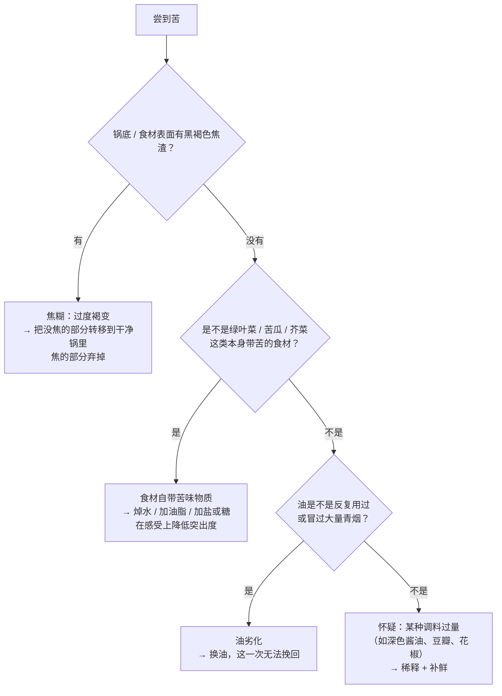

# 尝味纠偏表

> 做到一半尝一口，发现不对——**这时候该干什么？**
> 这张表按"现象"查：太咸 / 太淡 / 发苦 / 发腥 / 太油 / 没味道。
>
> 使用前先记住三条原则，它们比任何补救手段都重要。

## 三条原则

1. **先判断是"多了"还是"少了"**。
   *多了*（太咸、太苦、太油）只能靠**稀释、去除、或在感受上盖住**，很难撤回；
   *少了*（太淡、没味道）好办得多——所以**宁可先少放，尝过再补**。
2. **在接近成品的状态下尝**。汤还没收、汁还没挂、菜还没熟时尝到的咸淡都不准：
   水一收，浓度就变了。
3. **一次只改一个**。加了盐又加糖又加醋，你不知道是哪个起了作用，
   也就没法沉淀成下次的经验。

> ⚠️ **本表的证据强度**：物理层面的补救（稀释、撇油、换掉苦源）是**确定有效**的；
> 感受层面的补救（"加糖压酸""加酸解腻"）属于**味味相互作用**，
> 而混合味可能出现增强、抑制或没影响三种结果——所以这类手段一律标 ⚠️，
> 要求你**小量试、尝过再决定**，不要当定律用。

## 太咸

| 做法 | 原理 | 证据强度 | 注意 |
|------|------|---------|------|
| 加**无味的载体**（水、高汤、豆腐、土豆、米饭、面） | 降低整体盐浓度——真正有效的只有这一类 | ✅ 确定（纯稀释） | 加水会同时稀释掉鲜与香，通常要再补一点鲜味来源 |
| 分出一部分，另做一份不加盐的合并 | 同上，稀释 | ✅ 确定 | 最可控的办法 |
| 加糖或加酸"压一压" | 混合味相互作用：可能降低咸的突出感 | ⚠️ 有争议 | **不会**降低钠含量；小量试 |
| 放一块土豆"吸盐" | 土豆吸走的是**含盐的汤水**，不是盐 | ❌ 机制不成立（效果等于少量稀释） | 想稀释就直接加水/加料 |

## 太淡

| 做法 | 原理 | 证据强度 | 注意 |
|------|------|---------|------|
| **分次**加盐，每次搅匀再尝 | 味觉是有阈值的——常常再一点点就"忽然有味了" | ✅ | 每次只加很少；尤其汤类 |
| 先确认"淡"是不是"缺鲜"而不是缺盐 | 鲜味物质能增强咸味的感知（有实验支持） | ✅ 有支持 | 见下面「没味道」一节的分诊 |
| 收汁 | 水少了浓度就上来了，同时让汁挂住食材 | ✅ | 时间和火力要够，注意不要过头变咸 |
| 等到接近食用温度再定咸淡 | 温度会影响味觉强度的感知 | ⚠️ 经验做法（本书尚未核到一手数据） | 至少要"在同一温度下前后对比" |

## 发苦

苦是**最难救**的一类，因为它通常来自一个**具体的苦源**，稀释和掩盖都只是权宜。
所以第一步是**找苦源**：

| 做法 | 原理 | 证据强度 |
|------|------|---------|
| 把没焦的部分**换到干净的锅**里继续做 | 苦味物质留在焦渣和旧锅里，不再继续溶进来 | ✅ |
| 加糖或加脂肪 | 混合味相互作用 / 脂肪影响苦味物质的释放 | ⚠️ 有争议，小量试 |
| 加水稀释 | 降低浓度 | ✅（但会连带稀释别的味道） |
| 只靠"多加盐盖住" | 混合味可能增强也可能抑制 | ⚠️ 不可靠，容易变成"又苦又咸" |

## 发腥

| 做法 | 原理（机制推理，见注） | 证据强度 |
|------|-------------------|---------|
| 前置处理：冲洗、去血水、去内脏残留、去黑膜 | 腥味物质大量集中在血水与残留物里 | ✅ 惯例上一致，机制清楚 |
| 加**酸**（醋、柠檬、番茄、山楂） | 鱼腥味的代表物质（三甲胺等胺类）偏碱性，酸能与之反应、降低其挥发 | ⚠️ 机制常见于科普与教材，本书**尚未核到一手实验**，标为机制推理 |
| 加**酒**（料酒、黄酒、白酒）并让它蒸发掉 | 乙醇能带走部分挥发性物质、也能与酸形成香气物质；**关键是要让它跑掉**，所以要在加热阶段加、锅不盖严 | ⚠️ 同上，机制推理 |
| 加葱姜蒜、花椒、香料 | 用强香气**掩盖**（不是去除） | ⚠️ 掩盖有效，但不解决来源 |
| 提高温度、敞开锅盖一段时间 | 让挥发性腥味物质挥发出去 | ⚠️ 机制推理 |

> **注**：去腥这一块，本书在写作时**没有检索到可靠的一手实验文献**，
> 所以上表只给机制与惯例，不给任何数字。第 19 章开写前会专门补查（见[出处登记](../standards.md)的已知缺口）。

## 太油

| 做法 | 原理 | 证据强度 |
|------|------|---------|
| 撇油 / 用纸吸 / 用勺贴着汤面舀 | 物理去除——最有效 | ✅ |
| 冷藏让油凝固后揭掉（炖菜、汤适用） | 油脂凝固点高于汤水 | ✅ |
| 加酸（醋、柠檬）或加辣 | 在感受上降低"腻" | ⚠️ 有争议，属味觉与口感的相互作用 |
| 配搭清爽的东西一起吃（蔬菜、汤、茶） | 改变整餐的感受，不改变这道菜 | ⚠️ 惯例 |
| 下次少放油 | 这是唯一的根治 | ✅ |

## 没味道（最常见，也最容易误诊）

"没味道"几乎从来不是"再加点盐"那么简单。先分诊：

| 你感觉到的 | 可能缺的是 | 怎么补 |
|-----------|-----------|-------|
| 一口下去**什么都很淡** | **盐**（还没过阈值） | 分次加盐，每次很少，搅匀再尝 |
| 咸是有的，但**寡、空、不"厚"** | **鲜**（谷氨酸/核苷酸类来源不足） | 加酱油、蚝油、味精/鸡精、香菇水、干贝、番茄、肉汤；有实验显示鲜味物质还能**增强咸味**的感知 |
| 有味道但**发闷、不清爽** | **酸** | 一点醋或柠檬，小量试 |
| 闻起来没有香气 | **香**（挥发性物质不足或已挥发） | 关火后补香油/葱花/香菜；下次把爆香和收尾分开 |
| 颜色浅、没有"炒过的味道" | **褐变**（锅不够热、食材太湿、一次下太多） | 下次分批下锅、表面擦干、锅先充分预热 |
| 每样都有但**互相分离** | **时间**（还没融合） | 再给一点时间；汤汁略收一收 |

> **这张分诊表就是第二部分的缩影**：调味不是"加调料"，
> 而是**判断缺的是哪一类**，再选对应的来源。
> 完整原理见第 9~15 章；动手前的方案见[一道菜的处理方案表](dish-plan.md)。

## 记录一次纠偏（建议每次都记一行）

| 日期 | 菜 | 尝到的问题 | 我判断缺/多了什么 | 做了什么 | 结果 | 下次怎么改 |
|------|----|-----------|----------------|---------|------|-----------|
| | | | | | | |
| | | | | | | |
