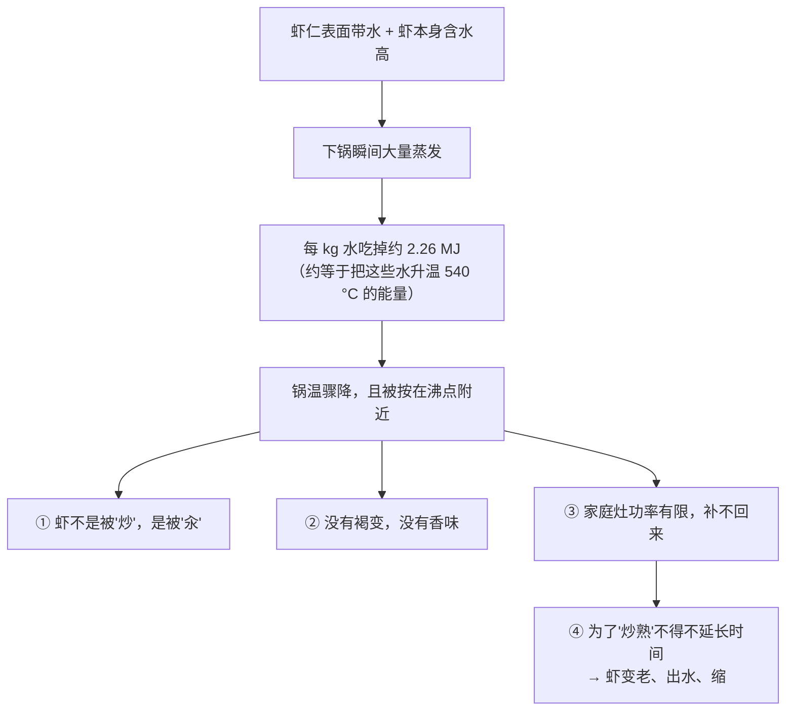

# 第 2 章 思考题参考答案

> 只记「问题 + 正确答案」。案例题给**完整推理链**——
> 重点是"目标是什么 → 瓶颈在哪 → 动哪个旋钮 → 顺序怎么排 → 怎么验证"。
>
> 涉及数字的地方，来源见[参考书目与出处登记](../standards.md)。

## Q1

**问**：第一段和第二段的瓶颈分别怎么判断？各举一个厨房现象，说明它属于哪一段、该动哪个旋钮。

**答**：

**判断方法很简单，看表面在不在"起反应"**：

| 你看到的 | 瓶颈在 | 为什么 | 该动的旋钮 |
|---------|-------|-------|-----------|
| 下锅半天**没声音、不上色、渗出水**，锅里像在炖 | **第一段**（热送不到表面） | 介质温度不够、锅没预热够、一次下太多、表面太湿——**热量都被蒸发吃掉了** | ①换介质 ②提高温差 ③**改表面状态**（擦干、分批、沥干） |
| 表面**已经焦了**，切开里面还是生的 | **第二段**（热进不到中心） | 内部只能靠导热，而特征时间大致按**厚度的平方**增长 | ④**改厚度**（切薄、拍扁、改刀）；当下的救法是**降温 + 加盖 + 延时** |

**两个具体现象**：

- **第一段的例子**：一次把一整袋洗过的青菜倒进锅里，结果盘底一汪水、菜发黄。
  机制：大量表面水 + 菜本身高含水 → 蒸发量骤增 → 每 kg 水要吃掉约 2.26 × 10⁶ J →
  锅温被按住 → "大火快炒"变成"中火水煮"。**动旋钮③**：沥干、分批。
- **第二段的例子**：整只鸡腿下锅煎，皮焦了骨头边还是红的。
  机制：厚度大 → 导热时间按平方增长。**动旋钮④**：改刀（顺骨划开）或改分段（先煎后焖）。

> **要带走的判断**：**"不够快"不是一个问题，是两个问题。**
> 弄错了段，你的动作（开大火）只会让另一段更糟。

## Q2

**问**：用本章的数据解释，为什么"表面擦干"能明显加快上色？

**答**：

**关键是两个数字的比值**：

- 水的**汽化潜热**约 **2.26 × 10⁶ J/kg**；
- 水的**比热容**约 **4.1~4.2 kJ/(kg·K)**。

两者相除约等于 **540**。也就是说：

> **把 1 kg 水蒸发掉，所需能量相当于把这 1 kg 水升温约 540 °C——
> 是把它从 0 °C 烧到 100 °C 所需能量的 5 倍还多。**

**所以表面湿的时候，能量分配是这样的**：

介质送来的热量 → 绝大部分被"蒸发"这一项吃掉 → 剩下能用来**升温**的所剩无几 →
表面温度被按在沸点附近 → **褐变需要的"高于水沸点的干燥表面"这个条件根本没出现**。

建模文献把它写成一个很直白的关系：**净进入食材的热量 = 介质送来的热量 − 蒸发拿走的热量**。

**擦干，就是把"蒸发"这一项的初始值直接砍掉一块**。少蒸发一克水，
就多出一克水蒸发所需的那份能量可以用来升温。

> **要带走的判断**：擦干不是"讲究"，是**在和一个大 500 多倍的能量项抢资源**。
> 同理，"别一次下太多""洗完要沥干""收汁之后才上色"，全是同一件事。

## Q3

**问**：为什么"炸得外脆里嫩"在物理上是可能的？复炸为什么有用？

**答**：

**因为炸的时候，食材被分成了两个物理性质完全不同的区域**：

| 区域 | 状态 | 温度 | 在发生什么 |
|------|------|------|-----------|
| **外层（薄）** | 已经脱水 | 可以**远超**水的沸点 | 干燥 → 结壳 → [美拉德反应](../glossary.md#maillard)与焦糖化 → 脆与香 |
| **内部** | 仍含自由水 | 被锁在**沸点附近** | 蛋白质变性、淀粉糊化——但**不会被"炸"到 180 °C** |

**两个独立来源支持"内部上不去"这件事**：

1. 一项煎汉堡的实验研究：锅面设定 215 °C 时，距接触面 **2 mm** 处的实测温度
   **接近 100 °C 但不超过**；作者的解释是脱水层下方形成了一个蒸发区，
   它的潜热需求给向内的热流设了硬上限，而脱水层厚度**不到 2 mm**。
2. 一项关于结壳条件的建模研究：**"油炸时，产品温度迅速达到沸点"**。

**所以"外脆里嫩"的条件可以写成一句话**：

> **让外层足够干、足够薄地脱水结壳，同时不给内部足够的时间把水全跑光。**
> 这就要求：**高温 + 短时**。温度低了，外层来不及干就已经把内部煮过头了。

**复炸为什么有用**：

把炸拆成两个阶段，各自解决一个问题：

| 阶段 | 温度/时间 | 它在解决什么 |
|------|---------|------------|
| 第一次 | 相对低、相对久 | 主要在**赶走外层的水**，并把内部做熟。此时表面还在大量蒸发，温度上不去，所以**颜色浅、不太脆** |
| （中间停一下） | 离油 | 让内部残余的水分**往外迁移到表层**（这也是为什么放久了会回软） |
| 第二次 | 高温、很短 | 表层已经比较干了 → 蒸发这一项小 → 热量终于能用来**升温** → 迅速结壳、上色、变脆，而内部来不及失水 |

> **要带走的判断**：复炸不是"炸两遍更熟"，而是**把"脱水"和"结壳"两件互相冲突的事分开做**。
> 这是本书反复出现的模式：**打架的两条线，用分段来解决。**

## Q4

**问**：【案例】4 cm 厚的带骨猪排，只有平底锅和盖子，没有烤箱和温度计。

**答**：这题考的是**先判断瓶颈、再排顺序**。

**（a）按平方律的时间估算**

厚度从 2 cm 变到 4 cm 是 2 倍，特征时间大致按厚度的**平方**增长 → 大约 **4 倍**。

⚠️ 必须加上限制：平方律是导热方程的标度关系，假设了均匀固体和固定的表面温度。
真实的猪排有骨头（导热性质不同）、有蒸发、有汁水流动，
**所以这是量级估算，不是"乘以 4 就能算出分钟数"**。

**（b）全程用能上色的火力会怎样**

会得到教科书式的失败：

> 表面持续接受高温 → 外层迅速脱水、褐变、继续下去就是焦苦；
> 而中心的热量还在按平方律慢慢爬 → **等中心熟时，外面已经过火很久**。

更糟的是第二层：外层脱水收缩、汁水被挤出，
于是**外面干柴、里面夹生**——两头都不讨好。

**（c）分段方案**

| 段 | 做什么 | 动的是哪个旋钮 | 目的 |
|----|-------|--------------|------|
| ① **改厚度（能改就先改）** | 如果允许，沿骨改刀、把厚的部分片开或拍薄一点 | **旋钮④** | 直接缩短第二段的路程——**最有效的一步** |
| ② **擦干 + 充分预热 + 高温短煎** | 表面吸干水，锅烧热，两面各煎到上色就停 | 旋钮③ + 旋钮② | 只做**褐变**这一件事。此时不要试图把里面弄熟 |
| ③ **降温 + 加盖 + 延时** | 火调小，盖上盖子，慢慢焖到中心熟 | 旋钮② + 旋钮①（加盖后靠水蒸气对流） | 让第二段有时间走完，同时**降低表面温度**避免过火 |
| ④ **离火静置** | 关火后让它待一会儿 | — | 利用[余温加热](../glossary.md#carryover)把中心再推一点 |

注意②和③的顺序：**褐变必须在表面还干的时候做**，一旦加盖，
锅里充满水蒸气、表面重新变湿，就**再也上不了色**了（第 1 章的"四条线打架"）。

**（d）现象判据，以及它的风险**

没有温度计时，家庭里常用的现象判据是：按压回弹变硬、扎下去流出的汁**清亮不带血色**、
骨头附近的肉不再是粉红。

> ⚠️ **但必须诚实说明这个判据的风险**：美国 CDC 的表述是——
> **除海鲜外，不能通过颜色和质地判断食物是否安全熟透，温度计是唯一可靠的方法。**
> 所以这些现象判据只能用于判断**口感**是否到位，**不能**用于判断安全。
> 猪肉的安全中心温度各国口径不同（例如美国给整块猪肉 145 °F 约 63 °C + 静置 3 分钟，
> 加拿大给 71 °C），请以所在地现行发布为准。
>
> **这题真正的答案其实是：厚肉 + 没有温度计 = 应该去买一支温度计。**
> 一支探针温度计是本书唯一会反复建议购买的器具。

> **要带走的判断**：**厚度是唯一能动第二段的旋钮，所以它应该是你最先考虑的，而不是最后。**
> 很多"技术难题"在刀板上就已经解决了。

## Q5

**问**：【案例】"锅烧至冒烟，倒油，下**刚洗好的**虾仁，大火翻炒 30 秒至变色，盛出备用。"

**答**：

**（a）哪个环节让前提失效**

**"刚洗好的"**。

这份菜谱的整个设计（锅烧到冒烟、大火、30 秒）都建立在一个前提上：
**锅能在这 30 秒里保持很高的温度**。而"刚洗好、带着水"的虾仁直接破坏了这个前提。

**（b）用能量流向解释后果**

结果就是：盘底一层水、虾发白发柴、完全没有"锅气"。

**（c）怎么改**

| 改动 | 动的是哪个旋钮 | 理由 |
|------|--------------|------|
| 虾仁洗后**充分沥干 + 厨房纸吸干表面** | ③ 表面状态 | 把"蒸发"这一项砍到最小，这是**收益最大的一步** |
| **分批下锅**，或换一口更大的锅 | ③ 表面状态（单位面积的蒸发量） | 一次下太多等于同时引入大量水，锅温照样掉 |
| "锅烧至冒烟"改成**充分预热但不到冒烟**的现象判据 | ② 温差 | 冒烟意味着油已接近或超过它的烟点，是**油在分解**的信号，不是"够热了"的信号。⚠️ 具体烟点数值随油种与精炼程度差别很大，本书未核到可靠的一手汇编，所以只给方向 |
| "30 秒"改成**现象判据**：虾身蜷成 C 形、颜色转为不透明的橙红 | — | 时间不可移植（锅、火力、虾的大小都不同），现象可移植 |
| 如果虾比较大、比较厚，**先改刀开背** | ④ 厚度 | 缩短第二段，让"高温短时"真的能把中心做到 |

> **要带走的判断**：菜谱里最危险的不是错的步骤，而是**被省略的前提**。
> "大火快炒"的前提是锅能保持高温，而"带水的食材"恰好把这个前提拆了——
> 两句话单独看都对，放在一起就矛盾。

## Q6

**问**：【辨析】"微波炉是从里往外加热的"——证据强度？官方怎么写的？为什么会流传？

**答**：

**判定：❌ 明确错误。**

**官方来源怎么写的**：美国 FDA 的微波炉页面明确表述——

- 微波**让食物里的水分子振动**，分子间的摩擦产生热量，
  所以**含水多的食物（如新鲜蔬菜）热得更快**；
- 微波炉**"不是从里往外"做熟食物**。对较厚的食物，微波加热的是**外层**，
  而**内部主要是靠热量从热的外层导进去**的。

**也就是说：换成微波，第二段（表面 → 中心）仍然只能靠导热。**
本章的整个框架在微波这里照样成立。

**为什么会流传**：三个原因叠加，而且**第一个原因其实有一部分是对的**。

1. **它确实"进得更深一点"**。微波不像热空气那样只作用在最外表面，
   而是能在一定厚度内直接让水分子发热。**"比表面加热更深"被夸张成了"从里往外"**——
   这是厨房传说的典型生成方式：**把一个相对差别说成了绝对差别**；
2. **观察上"像是真的"**：微波加热常出现"馅烫、皮温"的情况（因为馅含水多、含盐多，吸收更强），
   于是人们直观地以为热是从中间产生的；
3. **它给了一个简单的故事**，比"介电加热的穿透深度有限，之后仍靠导热"好讲得多。

**这个错误会导致什么实际后果**：以为"从里往外"，就会**不翻动、不搅拌、不静置、大块整个放进去**，
结果是外面过热、里面还凉——而这恰恰是微波加热最常见的失败，也是加热剩菜时的食品安全风险点。

**正确的操作因此是**：**切小、摊薄、摊开成环形、中途翻动或搅拌、加热后加盖静置一会儿**，
给导热留出时间。

> ⚠️ 微波频率：家用微波炉常见工作频率为 2450 MHz。这个数字本书是在一项
> 对照固态微波（912~913 MHz）与传统微波（2450 MHz）烹饪牛肉的研究里核到的；
> **FDA 那个页面本身没有给频率**——这也是本书的习惯：**说清楚每个数字是从哪来的。**

> **要带走的判断**：一个说法"有一部分是对的"，是它流传的最强动力。
> 辨析的价值不在于把它打成假，而在于**找出它对到哪、从哪一步开始过度推广**。

## Q7

**问**：【辨析】"水开了要大火才熟得快"——证据强度？怎么在家检验？

**答**：

**判定：❌ 明确错误。**

**理由（物理上很干净）**：常压下，水一旦沸腾，**继续加大火力不会提高水温**——
多输入的能量全部转成了更快的蒸发（每 kg 水约 2.26 × 10⁶ J）。
食材感受到的介质温度没变，**所以熟的速度不会变快**。

大火只带来三个后果：**更快烧干、更费燃气/电、厨房更多水汽**。

**为什么流传**：因为"火大 = 快"在**没有液态水**的场合（煎、炒、烤、炸）**确实成立**——
那里温度没有上限，火大真的意味着更高的介质温度。
**这个在干燥场合成立的经验，被整体搬到了水里。**

**在家怎么检验**：

| 步骤 | 做法 |
|------|------|
| 1 | 两口尽量一样的锅，各装**同样体积**的水，同时烧开 |
| 2 | 水开后，一口保持**刚好维持沸腾的最小火**，另一口开到**最大火** |
| 3 | 同时放入**尽量一样**的食材（建议用大小一致的土豆块或鸡蛋，方便判断） |
| 4 | 计时，比较"熟到同样程度"所需的时间 |

**怎么解读结果**：如果说法成立，大火那组应该**明显更快**。按物理预期，你更可能看到
**两组时间接近**，差别在实验误差范围内。

**这个检验能证明什么、不能证明什么**（这一问比结果更重要）：

- **能**：让你对"大火煮得快"这个说法失去信心，并且亲眼看到大火那锅水**掉得快得多**；
- **不能**：证明"两者完全相同"。样本量是 1、食材不可能完全一样、
  "熟到同样程度"的判断带主观性、大火会让水更剧烈翻滚从而**略微改善对流**
  （这是一个真实存在但很小的效应）。

> ⚠️ 补充一个例外，免得走到另一个极端：**如果锅里的水还没开**，那么火大确实升温更快；
> **如果是收汁、蒸发为目的**，火大也确实更快。
> 被否定的只有一句话：**"水已经开了，靠加大火力提高加热温度"**——这一条不成立。

> **要带走的判断**：**说法有边界。** 检验一个说法之前，先把它的适用条件写清楚，
> 否则你会做出一个既不能证实也不能证伪的实验。

## Q8

**问**：本章的换热系数（8 / 100 / 200 W/(m²·K)）为什么只能当量级看？
拿它们算"油炸比烤箱快多少倍"错在哪？

**答**：

**为什么只能当量级看——三条理由**：

1. **它们是模型取值，不是实测汇编**。这三个数来自两篇食品工程建模论文，
   是作者为了让模拟结果吻合自己的实验而**选定或拟合**的参数，
   服务于各自特定的几何形状、设备和食材；
2. **不同研究拟合出的数值差得很远**。例如另一篇同类论文对"锅—肉接触"拟合出的热导
   只有 40 W/(m²·K) 量级，因为它把接触面上那层水汽也算进了同一个系数里。
   **同一个物理场景，定义不同、数值就差 5 倍**；
3. **它们本来就不是常数**。换热系数随流速、温差、表面粗糙度、
   有没有沸腾与蒸发而变化——尤其在厨房里，表面几乎总在蒸发。

**拿它们算"快多少倍"错在哪——至少四层**：

| 错在哪 | 说明 |
|-------|------|
| ① **忽略了温差** | 送进去的热量正比于 h × 温差。烤箱 200 °C 和油 180 °C 的温差不同，不能只比 h |
| ② **忽略了蒸发这一项** | 净热流 = 送来的 − 蒸发拿走的。表面湿的时候，第二项可能把第一项吃掉大半——**h 大不等于食材升温快** |
| ③ **忽略了第二段** | 就算表面升温快 10 倍，中心还是只能靠导热爬进去。**对厚食材，瓶颈根本不在 h 上** |
| ④ **把"模型参数"当"物性常数"** | 这是最根本的一条：这些数字没有"标准值"，它们依赖于是谁、在什么设备上、为了拟合什么而定的 |

**那本章为什么还要给这三个数？** 因为**量级本身是可靠的结论**：

> 静止空气 ≈ 10¹ → 强制热风 ≈ 10² → 接触/液体 ≈ 10²。
> **换介质带来的差别是"数量级"级别的，而调火力带来的差别是"百分比"级别的。**
> 这个结论足以支撑本章最重要的操作建议：**选介质比调火力重要。**

> **要带走的判断**：**一个数字的可靠程度，取决于它是怎么被产生的。**
> 实测值、拟合值、模型取值、二手转引，是四种不同的东西。
> 本书会尽量标明每个数字属于哪一种——你读别的资料时也可以用同样的标准问一句：
> **"这个数是测出来的，还是凑出来的？"**
