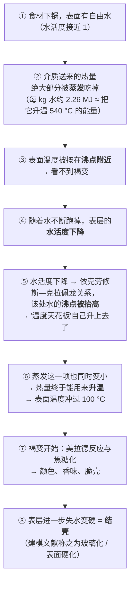

# 第 3 章 思考题参考答案

> 只记「问题 + 正确答案」。案例题给**完整推理链**。
> 涉及数字的地方，来源见[参考书目与出处登记](../standards.md)。

## Q1

**问**："含水量"和"水活度"分别是什么？为什么果酱能放很久而新鲜水果不能？
FDA 给的 0.85 是什么性质的数字？

**答**：

**两个概念的差别**：

| | 含水量 | [水活度](../glossary.md#water-activity)（a_w） |
|---|-------|--------------|
| 它说的是 | 一份食物里**有多少水** | 这些水**有多自由** |
| 怎么定义 | 质量比例（如每 100 g 里 92 g 水） | 食物的蒸汽压 ÷ 同条件下纯水的蒸汽压；也等于平衡相对湿度 ÷ 100 |
| 取值 | 0%~100% | 0~1 |
| 决定什么 | 口感的起点、下锅会不会大量出水 | **微生物能不能长、表面能不能上色** |
| 会被什么改变 | 加水、脱水 | 加盐、加糖、脱水、冷冻——**不加不减水也能改变它** |

⚠️ 补一条 FDA 明确写出的性质：**水活度随温度升高而升高**，
所以测量时样品与上方空气的温度必须稳定（该文件指出 1 °C 的温差就可能让读数偏移约 0.05）。

**为什么果酱比新鲜水果耐放**：

> 果酱的**含水量并不低**，但里面溶了大量的糖。糖分子把水拉住，
> 让这些水**不再自由**——蒸汽压降低、水活度降低，微生物可用的水就少了。
>
> 这就是"**不加不减水也能改变水活度**"的意思。盐渍、糖渍、腌腊走的都是这条路；
> 晒干、风干、冷冻走的是另一条路（把水拿走，或让它变成冰）。

**0.85 是什么性质的数字**：

**它是法规分界，不是安全保证。** FDA 的原话是：成品水活度控制在 **0.85 或以下**时，
**就不受**美国 21 CFR 第 108、113、114 部分（低酸罐头与酸化食品）的管辖。
同一份文件另外给出一个生物学阈值：**肉毒梭菌生长的最低水活度约 0.93**，
而且**视产品特性可高到 0.96**。

> 所以正确的读法是：0.85 是一条**监管上的线**，它建立在"低于这个值，
> 相关致病微生物的风险已经足够低"的判断上；它**不意味着** 0.85 以下的食物永远安全。
> ⚠️ 这是**美国口径**，各国规定不同且会修订。**本书不据此给任何家庭保存期限的建议。**

> **要带走的判断**：厨房里真正起作用的往往不是"有多少"，而是"有多少**可用**"。
> 这个模式还会再出现——味道也是这样（第 9 章：不是"放了多少盐"，是"越没越过阈值"）。

## Q2

**问**："收汁"同时在动哪几条通道、解决哪几个问题？

**答**：

收汁动的是**蒸发**这一条通道（食材/汤汁 → 空气），但它**同时解决三个不同的问题**，
分属三条线：

| 它解决的问题 | 属于哪条线 | 机制 |
|------------|-----------|------|
| ① **浓缩味道** | 味 | 水少了，溶在里面的盐、糖、鲜味物质、氨基酸的**浓度上升** |
| ② **让汁能挂住食材** | 味 + 水 | 黏度上升，汁不再从食材表面滑走。**挂得住，味道在嘴里待的时间才长**——所以这是调味手段，不只是外观手段 |
| ③ **把"温度的看门人"赶走** | 水 + 热 | 只要锅里还有大量液态水，热量就优先被用于蒸发它（每 kg 约 2.26 × 10⁶ J），表面温度被按在沸点附近。**水少到一定程度，表面温度才有机会冲过沸点** |

**第 ③ 条解释了一个常被当成玄学的现象**：红烧、干烧类菜品在**最后几十秒**，
颜色和香味会突然变好。那不是"火候的直觉"，是**水少到不足以再压住温度的那一刻**——
从这一刻起，褐变才真正开始。

**由此推出两条操作判断**：

1. **想要最后那一下焦香，就必须真的把汁收到少**，半湿不干是拿不到的；
2. **收汁必须盯着**，因为③一旦开始，温度是**加速上升**的——
   从"刚好"到"糊了"的窗口比前面任何阶段都短。

**什么时候停**：用**现象判据**而不是时间——汁能挂住勺背、
用铲子划开锅底时汁不立刻合拢、气泡从"大而稀"变成"小而密"。

> **要带走的判断**：一个动作解决三个问题时，它就有三个"停止条件"，
> 而你要的那个通常是**最早到达的那个**。

## Q3

**问**：为什么"多汁不是加水加出来的"？用温度—得率数据支持，并说明这些数字不能被怎样使用。

**答**：

**核心论证只有两步**：

**第一步：起点已经定了。** 生肉本身就有 65%~78% 是水（美国农业部数据：
牛肉糜 67.1、鸡肉糜 73.2 g/100 g；另一独立来源给骨骼肌平均约 75% 水）。
**你从头到尾做的所有事，都只会让它变少。**
外加的汤汁能挂在表面、能进到间隙，但它**进不到已经收缩的肌纤维内部**去补回损失。

**第二步：损失几乎完全由温度决定。** 一篇低温慢煮综述汇总的牛肉得率：

| 温度 | 得率 | 意味着丢了多少 |
|------|------|--------------|
| 50 °C | 91.7% / 89.2% | 约 8%~11% |
| 55 °C | 84.3% / 77.3% / 74.4% | 约 16%~26% |
| 60 °C | 81% | 约 19% |
| 约 100 °C，2 小时 | 64.2% | 约 36% |
| 75 °C，36 小时 | 61.1% | 约 39% |

同一综述还给出机制侧的印证：**蒸煮损失在 60 → 70 °C 之间显著上升，
而在 70 → 80 °C 之间变化不明显**——因为到那时水已经跑得差不多了。

注意最后两行：**约 100 °C 做 2 小时，和 75 °C 做 36 小时，得率是同一个量级**。
也就是说在这个区间里，**把时间拉长 18 倍带来的额外损失，远小于把温度提高带来的损失**。

> **所以结论是**：**决定"多不多汁"的主要旋钮是温度，不是时间。**
> "炖三小时炖柴了"和"煮十分钟也柴"并不矛盾——两者都是温度太高。

**这些数字不能被怎样使用**（这一问和结论一样重要）：

| 不能这样用 | 为什么 |
|-----------|-------|
| **不能横向直接比较**（比如"55 °C 比 60 °C 损失更大"） | 这些行来自**不同研究**，肌肉部位、尺寸、时间、包装方式、是否腌制全都不同。综述把它们汇总在一张表里，是为了看趋势，不是为了排名 |
| **不能当成自家厨房的预期值** | 低温慢煮是**真空袋 + 恒温水浴**，汁水跑不远也不蒸发；家里的锅是敞开的、温度是波动的 |
| **不能倒推"那我就 50 °C 做"** | 得率高不等于可以吃。**安全需要中心温度与保持时间的组合**（英国 FSA 的等效表、美国 FDA 与加拿大卫生部的最低中心温度，各国口径不同），而家用灶台很难稳定控温 |
| **不能推广到别的食材** | 这些是肉的数据。蔬菜、蛋、豆制品的持水机制完全不同 |

> **要带走的判断**：**"起点决定上限"**。
> 做菜里有一类问题是根本没法在后面补救的，只能在前面少损失——
> 水就是最典型的一个。

## Q4

**问**：【案例】清炒杏鲍菇，目标是"边缘微焦、有香味、盘底不积水"。

**答**：

**（a）水这条线的目标**

**赶走**，而且要**快**。

推理：目标里的"边缘微焦"和"有香味"都指向**褐变**，
而褐变的必要条件是"表面足够干 + 温度高于水的沸点"（第 2 章）。
蘑菇含水量在 92% 上下，所以这道菜的全部难点就是——
**在菇把自己的水吐满锅之前，先让表面干起来并升温**。

这是一场**竞速**：表面变干的速度 vs 内部的水往外渗的速度。

**（b）五个决定**

| 环节 | 怎么定 | 理由（哪条线） |
|------|-------|--------------|
| **切法** | **切厚片或撕成条，不要切薄切碎** | 反直觉但关键。切得越碎，**暴露的表面积越大、出水越快**，而且薄片会在出水前就熟透变软。厚片让"外表面"和"内部的水"之间隔得远一点，给褐变争取时间 |
| **锅具** | **越大越好，最好是蓄热好的锅** | 热：单位面积上的蒸发负担越小，锅温掉得越少 |
| **下锅量** | **一次只铺一层，不重叠；宁可分两三批** | 水：一次下太多 = 蒸发量骤增 = 锅温被按住 = 直接变成煮（第 2 章的能量流向） |
| **火力** | **先中大火，下锅后前 1~2 分钟不要翻动** | 热 + 水：让贴锅那一面有机会真正干燥升温。**频繁翻动会让每一面都处在"半湿"状态，谁也干不了** |
| **盖盖子** | **不盖。全程敞开** | 水：盖盖子留住蒸汽 = 表面重新变湿 = 彻底放弃褐变。**这道菜的目标和盖盖子直接冲突** |

补充两条顺序上的判断：

- **盐最后放**。早放盐会加速出水（渗透），和"要快点变干"的目标冲突。
  这正是第 1 章说的"盐有两个身份"——这里它会变成"对水的错误命令"。
- **如果要加蒜、辣椒等容易焦的配料，放在最后**，因为前段火大、时间也够长。

**（c）已经积水了还能救吗**

**能救一部分，但要认清代价。**

| 救法 | 怎么做 | 代价 |
|------|-------|------|
| ① **把水赶走**（首选） | **加大火力、把菇摊开、绝不盖盖**，先把那层水烧掉，然后才可能开始上色 | 这段时间里菇一直在继续失水，最终口感会比一次做对更软、更缩 |
| ② **倒掉多余的汁，重新起锅** | 把菇捞出、锅擦干、重新烧热、再下锅煎 | 麻烦；而且倒掉的汁里有味道 |
| ③ **改目标**（最诚实的一条） | 承认今天做不成"微焦有香"，改成**"出汁的菇"**：勾个薄芡、加点酱油，做成挂汁的版本 | 放弃了褐变，但得到一道自洽的菜 |

> ⚠️ **不要做的一件事**：**盖上盖子想"焖一下快点好"**。
> 那会把仅剩的可能性也堵死——盖上之后表面永远是湿的。

> **要带走的判断**：**高含水食材做"焦香"，本质是和出水赛跑。**
> 你能用的所有手段（大锅、少量、不翻动、不盖盖、晚放盐）都是在**给自己争取时间**。
> 而这场赛跑的胜负，在你切菜和决定下多少的时候就已经定了一半。

## Q5

**问**：【案例】"排骨冷水下锅，焯水 5 分钟，捞出用冷水冲洗干净，另起锅加热水炖 1 小时。"

**答**：

**（a）冷水下锅 vs 热水下锅**

这两者在"水"这条线上的差别，是**给溶出留了多少时间**：

| | 冷水下锅 | 热水下锅 |
|---|---------|---------|
| 食材经历的过程 | 和水**一起慢慢升温** | 表面**瞬间**遇到高温 |
| 表面蛋白质 | 慢慢变性凝固 | **迅速**变性凝固 |
| 溶出的机会 | **多**——在表面"封起来"之前有一段较长的窗口 | **少**——表面很快就不那么通透了 |
| 适合的目的 | **要溶出**：焯排骨去血水浮沫、煲汤 | **不要溶出**：汆烫绿叶菜、汆肉片、保住鲜味 |

**这里为什么用冷水**：因为焯排骨的**目的就是溶出**——
要把血水、可溶的异味物质从骨肉里带出来，然后连水一起倒掉。
热水下锅会让表面很快凝固，反而把这些东西**关在里面**。

> ⚠️ **诚实标注**：这条"冷水要溶出 / 热水要锁住"的对应关系，
> 在机制上与本书已核的两条事实一致（①水溶性成分会随时间和温度浸出到水里；
> ②蛋白质在受热时变性凝聚），**但本书没有核到直接比较两种下锅方式的一手对照实验**。
> 所以它在本书里的身份是：**机制推理 + 行业惯例**，不是实验结论。

**（b）"焯完用冷水冲"在解决什么问题，代价是什么**

它在解决两个问题：

1. **物理清除**：焯出来的浮沫、凝固的血沫会粘在排骨表面，冲掉是为了汤清、味正；
2. **停止加热**：冲凉让它不再继续受热（虽然接着还要炖，但这一步避免了"焯着焯着就煮过头"）。

**代价有两条**：

- **又一次溶出**：冲洗时表面的可溶物（包括呈味物质）还会再走一批。
  第 1 章引的机制在这里同样适用——**溶出是不挑食的**；
- **温度掉到底**：接下来要重新把它加热上去，等于**多经历一次升温过程**。

所以更讲究的做法是**用温水或热水冲**，只冲掉浮沫、不让它彻底凉透。

**（c）为什么"另起锅加热水"**

两条线各给一个理由：

| 线 | 理由 |
|----|------|
| **热** | 用热水，锅里的温度**几乎不掉**，很快就能回到微沸状态。用冷水则要重新走一遍完整的升温过程，**总的加热时长被拉长**，而拉长的这段时间里，瘦肉部分一直在失水 |
| **水** | 这一步的目的已经从"溶出"切换到了"炖烂 + 出味"。**你不希望再来一次大规模的溶出**——而慢慢升温恰恰会再制造一个溶出窗口 |

⚠️ 关于流传很广的第三条理由——"**加冷水会让肉猛地收缩、变柴**"——
本书**没有核到支持它的一手证据**，因此**不作为理由使用**。
本书能确认的是上面那两条，它们已经足够支撑"用热水"这个做法。

> **要带走的判断**：同一份菜谱的不同步骤，"水"这条线的目标可能**完全相反**——
> 焯水那一步要的是**溶出**，炖那一步要的是**不再溶出**。
> **看懂了目标切换，你才知道哪一步该用冷水、哪一步该用热水。**

## Q6

**问**：【辨析】"焯水加盐能保住蔬菜的颜色和味道"——证据强度？怎么在家做对照？

**答**：

**判定：缺乏证据，而且现有证据的方向是相反的。**

**本书查到了什么**：

- **没有**核到支持"焯水加盐能保色 / 保味"的一手证据；
- 一篇 2024 年关于热处理对果蔬成分影响的综述明确指出（转引一项 2022 年的研究）：
  **加盐会造成渗透失衡，导致水分流失更多、水溶性成分损失更大**。

**为什么它流传得这么广**：三个可能的原因，每个都"有一点道理"。

1. **加盐后蔬菜的确"看起来"不一样**：盐让细胞失水，菜会显得更挺、更亮一点，
   这被读成了"保住了"；
2. **加盐后吃起来确实有味**——但那是**表面附着了盐**，
   和"保住了菜本身的味道"是两回事，容易混淆；
3. **它和另一个可能有效的做法被混在了一起**：焯水时"水要多、火要大、时间要短、
   焯完立刻冲凉"这一整套，在机制上确实有利于减少损失（缩短高温暴露、快速停止加热）。
   **加盐搭了这一套的便车。**

**在家怎么做对照**（关键是想清楚"你到底在测什么"）：

| 步骤 | 做法 |
|------|------|
| 1 | 同一批菜，随机分成两份，**各自称重**记下 |
| 2 | 两锅同样体积的水，同时烧开。一锅加盐（记下克数），一锅不加 |
| 3 | 同时下锅，**同样时间**捞出，同样方式沥干 |
| 4 | 各自**称重**，算失重比例；拍照对比颜色；分别尝味 |
| 5 | **关键的第五步**：把两锅焯菜水分别留下，对比颜色深浅——**跑掉的东西在水里** |

**你能测到什么、不能测到什么**：

- **能测**：失重比例的差别（这是"水分流失"的直接指标）、
  焯菜水的颜色差别（这是"溶出"的间接指标）；
- **不能测**：维生素含量、"营养保住了没有"——家里没有这个手段，
  **不要用肉眼去下这类结论**；
- **必须承认的局限**：加了盐的那组你**尝起来一定更有味**，
  这会严重干扰你对"味道保住了没有"的主观判断。所以**尝味这一项基本不可信**，
  真正有信息量的是**称重**和**焯菜水的颜色**。

> **要带走的判断**：设计对照实验时，**先问"我能测的指标是什么"**。
> 测不到的东西就不要下结论——这比"实验做得对不对"更重要。

## Q7

**问**：【辨析】"解冻出来的红水是血"——判断它，并说明本书是**怎么**得到判断的。

**答**：

**判定：这个说法是错的。** 流出的液体主要是**水 + 溶在其中的肌浆蛋白（包括肌红蛋白）**，
不是血液。

**本书的推理链（只有两条已核事实 + 一次合并）**：

| 步骤 | 内容 | 来源状态 |
|------|------|---------|
| 事实① | 肌肉在储存期间，**肌纤维横向收缩，把细胞内的水挤到细胞外空隙**，随后这些水从肌肉的**切面**被排出 | ✅ 已核（一篇肌肉结构与肉品质的综述） |
| 事实② | **肌红蛋白**是肌浆（肌纤维的胞浆）里的色素蛋白，负责携氧，是肌肉呈红色的原因 | ✅ 已核（同一篇综述） |
| 合并 | 从切面流出的液体来自**细胞内**，而细胞内的红色来自肌红蛋白 → 因此这些液体是"水 + 肌浆蛋白"，红色来自肌红蛋白 | **本书的推理**，非直接引用 |

**为什么要专门说明"怎么得到的"——这一问才是重点**：

因为**结论的可靠程度，取决于它是怎么产生的**。这里存在三种不同的情形：

| 情形 | 可靠度 | 本例属于哪种 |
|------|-------|------------|
| 直接引用一篇检测渗出液成分的论文 | 最高 | ❌ 本书**没有**核到这样的文献 |
| 由两条已核事实合并推出 | 较高，但**留有空隙** | ✅ **本例** |
| 凭印象或凭"大家都这么说" | 不可用 | — |

**留了什么空隙**：本书没有直接证据说明渗出液中**完全不含**血液成分。
屠宰过程会放血，但残留血液是否会混入渗出液、混入多少，
本书**没有核到定量数据**。所以严格的表述应该是：
**渗出液的主体是细胞内水与肌浆蛋白，红色主要来自肌红蛋白，把它整体称为"血"是不准确的。**

**这个区别为什么重要**：因为本书的全部价值就建立在"**每个结论都能说出它是怎么来的**"上。
如果把推理结论包装成引用结论，读者就失去了判断它有多硬的能力——
**而那正是本书想教给读者的能力本身**。

> **要带走的判断**：写下一个结论时，问自己一句：
> **"这是我查到的，还是我推出来的？"**
> 两者都可以用，但**必须分开标注**。第 1 章 Q8 说的"数字要追到一手"，
> 在这里变成了它的姊妹条：**推理要标明是推理。**

## Q8

**问**：把"表面必须先干才能上色"和"水活度下降会抬高沸点"连成一条完整的因果链，解释结壳。

**答**：

**完整的链条有六步**，每一步都能对应到前两章的某个结论：

**这条链里最值得记住的是第 ④ ⑤ 步**：

> **"干"不只是"没有水在表面妨碍"这么被动的一件事。**
> 干本身会**改变这块食材的物理性质**——它把那一层的沸点抬高了，
> 于是"温度上限"这个天花板**自己往上移了**。
>
> 换句话说：**不是先有高温才有干，而是先有干才有高温。**

**这条链一口气解释了六个厨房现象**：

| 现象 | 它卡在链条的哪一步 |
|------|-----------------|
| 带水下锅永远不上色 | 卡在②③：蒸发一直在吃热量 |
| 一次下太多永远不上色 | 同上，只是蒸发的总量更大 |
| 复炸有用 | 第一次走完①~④（脱水），第二次直接从⑤⑥开始（升温结壳） |
| 裹粉裹糊能炸脆 | 用外来的淀粉层充当"被牺牲掉水的那一层"，保护内部不必走完④ |
| 盖上盖子就没有壳 | 锅里充满水蒸气 → 表面重新变湿 → 链条被打回① |
| 收汁到最后颜色突然变好 | 整锅终于走到了④⑤⑥ |

**而链条的另一端也给了一个重要的限制**：

> 只要食材内部还有自由水，**内部就永远停在②③那一步**——被锁在沸点附近。
> （实测：锅面 215 °C 时，距接触面 2 mm 处的温度接近 100 °C 但不超过。）
>
> **所以"外脆里嫩"不是手艺，是物理：外层走完了整条链，内部还停在第③步。**
> 你要做的只是**别给内部足够的时间也走完它**。

> **要带走的判断**：本书前三章其实只讲了一件事——
> **水在哪里，温度上限就在哪里。**
> 后面所有的技法（第四部分）都只是这句话在不同场合的具体做法。
