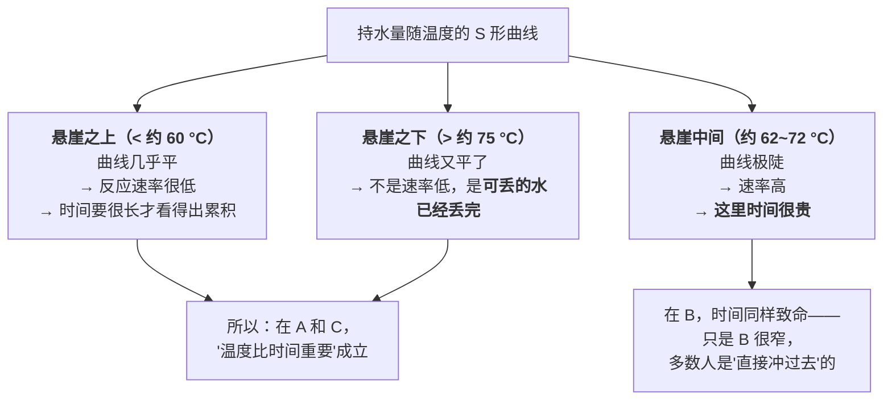

# 第 4 章 思考题参考答案

> 只记「问题 + 正确答案」。案例题给**完整推理链**。
> 涉及数字的地方，来源见[参考书目与出处登记](../standards.md)。
>
> ⚠️ 本章的温度全部是**质地**的温度。安全的温度是另一套，一律以所在地官方指引为准。

## Q1

**问**：用三个阶段解释为什么"嫩"是一个**窗口**而不是一个点。这个窗口对应哪两个事件之间？

**答**：

**三个阶段的顺序是固定的**：

> **变性（折叠散开）→ 凝聚成网（互相缠结）→ 收缩挤水（网收紧，把水挤出去）**

"嫩"之所以是窗口，是因为**你想要第二步，不想要第三步**，而**它们之间隔着一段温度**：

| 边界 | 是什么事件 | 在它之前 | 在它之后 |
|------|-----------|---------|---------|
| **窗口的下沿** | 蛋白质已经变性凝聚，肉**不再是生的**、有了熟的质地 | 口感是生的、软塌的 | ✅ **窗口内：熟了，但水还基本在** |
| **窗口的上沿** | 肌纤维开始**纵向收缩**，保水与结合水能力下降 | ✅ 窗口内 | ❌ 水被大量挤出 → 柴 |

在肉里，这两个事件大致对应文献给出的两个区间：

- **下沿**：肌原纤维蛋白展开与成网发生在 30~50 °C 这一段（展开 30~32 °C、
  交联 36~40 °C、成胶 45~50 °C）；
- **上沿**：**60~65 °C 起纵向收缩，保水与结合水能力下降**。
  更定量的说法见 Q2：持水量的悬崖大致在 62~72 °C，中点在 67 °C 附近。

> 也就是说：**"变紧"发生在前，"失水"发生在后**——中间那段就是窗口。
> **所以"嫩"不是运气，是你有没有停在那段里。**

⚠️ 三条必须同时记住的限制：

1. 这些是**区间不是开关**——变性是有速率的过程，低于区间也在缓慢发生；
2. 它们**随体系漂移**（pH、盐、部位、升温速率）；
3. 本书引的综述**内部就有矛盾**（肌动蛋白变性一处写 40~50 °C、一处写 70~80 °C），
   所以只能用**顺序**，不能用单点。

> **要带走的判断**：凡是"刚刚好"的东西，背后一定是**两个事件之间的一段距离**。
> 找到这两个事件，你就知道该往哪个方向留余量。

## Q2

**问**：关于持水量曲线的三问。

**答**：

**（a）为什么"悬崖之上和之下，时间都相对便宜"**

先看数值（由一项煎肉建模研究的持水力拟合函数算出，单位 kg 水/kg 干物质）：

| 温度 | 40 | 55 | 60 | 63 | 约 67 | 70 | 75 | 85 |
|------|----|----|----|----|------|----|----|----|
| 持水量 | 2.99 | 2.99 | 2.98 | 2.86 | 1.90 | 1.36 | 1.30 | 1.30 |

形状是一条 **S 形的下坡**，而坡几乎全部集中在 **62~72 °C** 这十度左右：

- **悬崖之上（低于约 60 °C）**：曲线**几乎是平的**（2.99 → 2.98）。
  在这里多待半小时，持水量掉不了多少——**所以时间便宜**；
- **悬崖之下（高于约 75 °C）**：曲线**也已经平了**（1.30 → 1.30）。
  能丢的水已经丢完了，再煮也丢不了更多——**所以时间也便宜**；
- **悬崖中间**：每一度都很贵。

> **这就解释了一个看似矛盾的现实**：低温慢煮做 24 小时不柴，
> 而红烧肉炖三小时也不会"越来越柴"（它早就过了悬崖）。
> **最糟糕的做法是慢慢地停在悬崖中间磨**——比如"小火慢慢煎一块厚牛排"。

**（b）和哪条独立结论互相印证**

和低温慢煮综述汇总的实验结论：**蒸煮损失在 60 → 70 °C 之间显著上升，
而在 70 → 80 °C 之间变化不明显**。

这是**两个独立来源、两套不同方法**（一个是建模拟合的持水力函数，
一个是对多项实验的汇总）**给出了位置一致的结论**——
所以本书敢把"悬崖"这个说法写进正文。

**（c）这条曲线不能被怎样使用**

| 不能这样用 | 为什么 |
|-----------|-------|
| **不能当成普适常数** | 它是**某项研究为拟合自己的实验而选定的函数**，不是物性手册里的数据 |
| **不能精确到度** | 不同部位、pH、是否腌制、动物年龄都会让悬崖平移。"67 °C"是这条特定曲线的中点，不是所有肉的中点 |
| **不能用来判断安全** | 这是**质地**的曲线。安全要看中心温度与保持时间的官方组合，各国口径不同 |
| **不能推广到别的食材** | 蛋、鱼、豆制品、蔬菜的持水机制完全不同 |
| **不能倒推"那就控制在 60 °C"** | 家用灶台很难稳定控温；而且低温需要配合足够的时间才能满足安全要求 |

> **要带走的判断**：一条曲线的价值常常在它的**形状**而不是它的**数值**。
> 这条曲线真正教给你的是"**存在一个悬崖，而且它很窄**"——
> 这个认识就算数值差几度也照样有用。

## Q3

**问**：为什么"蛋白质在 X °C 凝固"这个问法本身不成立？

**答**：

**两个原因，本章各给了一组数字。**

**原因一：它依赖体系，同一种蛋白质能测出差很远的两个数。**

| 测的是什么 | 温度 | 出处性质 |
|-----------|------|---------|
| 纯**卵白蛋白**在水中（5% 浓度、升温 5 °C/min）的 DSC 变性温度 | **80.22 °C** | 实验室测的是"分子层面完全展开" |
| **全蛋液**在真实体系里的宏观变化 | 55~64 °C 乳化性无显著变化，**67 °C 显著下降**；67 °C 后储能模量**急剧上升** | 测的是"看得见的变稠成胶" |

**两个数都对，因为它们测的不是同一件事**——
一个是分子展开，一个是宏观成胶；一个在稀溶液里，一个在浓稠的全蛋液里。
浓度、盐、pH、升温速率都会移动这个温度。

**原因二：凝固不是一个开关，是一个有速率的过程。**

第 1 章的"时间"线在这里同样成立：**温度决定速率，时间决定累积量**。
所以正确的问法不是"到了几度会凝固"，而是"**在这个温度下待这么久，会凝固到什么程度**"。

一个现成的证据就在本章：同样的时间下，全蛋液的溶解度损失
从 55 °C 的 **17.94%** 升到 67 °C 的 **41.29%**——
**这是一个连续变化的量，不是"凝固了/没凝固"的二值。**

**那正确的说法是什么**：

> **"全蛋液在 60 多 °C 这个量级开始出现明显的成胶，而这个位置会随浓度、盐、pH、
> 升温速率漂移。"**
>
> 这个写法的好处：它**可操作**（告诉你窗口在哪、要提前离火），
> 而且**不假装精确**。

> **要带走的判断**：看到一个"某物在 X °C 发生 Y"的说法，先问两句：
> **"在什么体系里测的？""它是开关还是速率？"**
> 厨房里被广泛传抄的温度数字，大多在这两问之下就站不住了。

## Q4

**问**：【案例】滑蛋虾仁，普通灶台、不粘锅、没有温度计。

**答**：

**（a）分类与窗口宽度**

| 食材 | 属于哪一类 | 窗口 |
|------|-----------|------|
| **蛋** | 窄窗口凝固型 | **最窄**。全蛋液在十几度的区间里就从"基本是液体"走到"明显成胶"（55~64 °C 乳化性无显著变化，67 °C 显著下降、储能模量急剧上升） |
| **虾** | 窄窗口凝固型（肌原纤维为主，但纤维短、块小） | 也很窄，但**比蛋宽一点**；而且虾有一个非常好的**外部现象判据**（见 c） |

> **所以这道菜的难点很清楚：两个窄窗口食材，而且它们的窗口不在同一个位置。**
> 这类问题只有一个通用解法——**分开做，最后合并**。

**（b）顺序与火力**

| 步 | 做什么 | 在控制什么 |
|---|-------|-----------|
| ① **虾仁充分吸干表面水** | 厨房纸吸干 | **水**：表面带水 → 蒸发吃掉热量 → 锅温掉 → 虾从"炒"变成"汆"，只能靠延长时间来熟，于是必然过头（第 2、3 章） |
| ② **锅充分预热，中大火，虾仁下锅** | 一层铺开，不重叠 | **热**：一次下太多同样会把锅温压下去 |
| ③ **虾一变色蜷起就立刻盛出** | 宁可略欠 | **时间**：虾在这一步只需要做到"刚熟"，因为**它后面还要回锅** |
| ④ **锅稍降温**（必要时离火几秒、补一点油） | 关键的一步 | **热**：蛋的窗口比虾更窄，需要**更低的介质温度**。用刚才炒虾的高温下蛋液，必然老 |
| ⑤ **中小火下蛋液，用铲子缓慢推**（不要快速搅散） | 让它成大片而不是碎末 | **热 + 时间**：低温 = 更长的"可反应时间" |
| ⑥ **蛋液还有约三分之一看着"没好"时，倒回虾仁，关火，拌匀** | 见（c） | **余温**：剩下的凝固由锅的余热完成 |

**（c）现象判据，以及为什么要早关火**

**现象判据**：

- **虾**：由半透明的灰白转为**不透明的橙红**，并**蜷成 C 形**。
  ⚠️ 如果已经蜷成紧紧的 **O 形**，通常意味着过了。
- **蛋**：锅里**还能看到约三分之一的流动蛋液**，其余已成软块——**这时就该关火**。

**为什么要早于"看起来刚好"**：因为[余温加热](../glossary.md#carryover)。
离火之后锅体、油、已经凝固的部分都还是热的，热量会继续往未凝固的部分传。
**你在锅里看到的"刚好"，装盘之后会变成"过了"。**

而且这个提前量在**窄窗口食材上特别大**——因为它们从"刚好"到"过了"只隔着很小的一段。

**（d）晚十分钟吃饭怎么办**

**正确答案是：别做。等到要吃之前再做。**

这道菜**没有保温方案**——保温就是继续加热，而蛋和虾都经不起。
可行的安排是：

| 时间点 | 做什么 |
|-------|-------|
| 现在 | 完成**所有不怕等的准备**：虾吸干、腌好、蛋打散、葱切好、调料量好放在旁边 |
| 开饭前 3 分钟 | 才开火，按上面 6 步做完 |

> **这道题真正考的是"排期"**：
> **窄窗口食材必须排在整顿饭的最后**。
> 这是第 33 章"一顿多菜的时间表"的核心原则，本章先把它的物理原因交代清楚：
> **它们没有保温余量。**

> **要带走的判断**：两个窄窗口食材同锅时，不要试图"找一个都合适的火力"——
> **分开做、最后合并**，永远是更可靠的解法。

## Q5

**问**：【案例】"鸡胸肉切片，加盐、料酒、蛋清、淀粉抓匀腌 15 分钟，热锅凉油滑散至变色盛出；
另起锅炒配菜，最后倒回鸡肉大火翻炒 2 分钟收汁。"

**答**：

**（a）盐、蛋清、淀粉各在做什么，哪些有证据**

| 成分 | 它在解决什么 | 本书的证据状态 |
|------|------------|--------------|
| **盐** | 两件事：①**给味道**（味的物质层面，需要时间渗入）；②**对水下命令**（渗透，影响保水） | ⚠️ 第①件有共识（第 1 章）。第②件——"盐能改善肉的保水"——本书**尚未核到一手定量文献**，留到第 11、17 章。**所以这里只能说方向** |
| **蛋清** | 在肉片外面裹一层会先凝固的蛋白质，形成"外套" | ⚠️ **惯例 + 机制推理**。机制上说得通（蛋白质受热成网，挡住热冲击与水分流失），但本书**没有核到**给出"能减少多少失水"的一手实验 |
| **淀粉** | 同样是"外套"，靠**淀粉糊化**形成黏层，包住肉片 | ⚠️ 机制清楚（糊化需要水和热，第 6 章），但同样**未核到定量对照** |
| **料酒** | 去腥 | ⚠️ 去腥机理本书**尚未核到一手文献**，留到第 19 章。**本书目前不为它的效果背书** |

> **诚实的总结**：这四样里，**只有"盐给味道"这一条是本书有把握的**，
> 其余三条都是**惯例 + 机制推理**。[上浆挂糊](../glossary.md#velveting)整体的有效性
> 在厨师实践里几乎是共识，但"共识"和"有一手实验证据"是两件事——
> 本书把它们分开标注，留到第 17 章专门补查。

**（b）为什么要"盛出"**

因为**鸡胸和配菜的窗口完全不同**。

鸡胸是典型的**瘦肉型**：脂肪少、结缔组织少，一旦越过持水量的悬崖就直接变柴，
而且**没有脂肪来掩饰**。配菜（比如青椒、芹菜、蘑菇）需要的时间往往更长，
而且很多会大量出水。

> 如果不盛出，就等于让鸡胸陪着配菜一起在锅里待完全程——
> **它必然会被做过头。**
> 盛出的本质是：**给两种食材各自的窗口，而不是找一个折中的窗口。**

这条规则是可迁移的，和第 1 章"先炒蛋"是同一条：
**窄窗口的先做好、拿出来、最后合并。**

**（c）最后"倒回去大火翻炒 2 分钟"的风险，以及怎么改**

**风险很直接**：鸡胸已经在第一步熟了。再回锅**大火 2 分钟**，
就是让它第二次经历高温——而这次没有蛋清淀粉外套能挡住的量级，
足以把它推过悬崖。**结果就是"外面裹着芡、里面是柴的"。**

**怎么改**：

| 改动 | 理由 |
|------|------|
| **先把配菜炒到位、把汁收好、调好味**，**最后**才倒回鸡肉 | 让鸡肉在锅里的第二段时间尽可能短 |
| "大火翻炒 2 分钟"改成"**倒回、翻拌均匀、立刻出锅**"（十几秒量级） | 鸡肉只需要**被汁裹住**，不需要再被加热 |
| 如果一定要收汁，**在鸡肉倒回之前收完** | 收汁是高温阶段（第 3 章），不该让鸡肉参与 |
| 尝味补盐也**在倒回之前**做 | 定味要在接近成品的浓度下做，但不该为此让鸡肉多待 |

> **要带走的判断**：**"回锅"是家常菜里最容易被忽视的过头来源。**
> 很多菜谱写"最后倒回去炒匀"，但没说"炒匀"应该是多少秒。
> 记住：**已经熟了的东西回锅，目的只有"混合"，不是"加热"。**

## Q6

**问**：【辨析】"肉出锅要静置，肉汁会回到肉里"——证据强度？能确认什么？怎么检验？

**答**：

**判定：缺乏证据。**（注意：判定的是**这个解释**，不是"静置"这个做法。）

**本书能确认的**：

- **离火之后，中心温度还会继续上升**——这是[余温加热](../glossary.md#carryover)，
  机制清楚（外层比中心热，热量继续往里传；第 2 章的"第二段"）。
  **所以静置确实会让肉更熟一点**，这本身就是安排时间时必须考虑的事；
- **保水力的下降是温度造成的、且不可逆**（本章的悬崖曲线）。

**本书不能确认的**：

- **"汁会回到肉里"**。本书**没有核到**支持这一说法的一手实验。
  从机制上看，蛋白质的收缩是不可逆的，"水回到已经收缩的纤维内部"需要一个解释，
  而本书没有找到这个解释的实验支持；
- 常见的另一个版本是"静置后切开流出的汁更少"。
  **这个观察即使为真，也可能有别的解释**——例如温度下降后汁的黏度升高、
  或者本来就有一部分汁在静置期间蒸发/渗到了盘子里。
  **"流出的少"不等于"回到肉里去了"。**

> 这是本书反复强调的模式：**"做法有效"和"这个解释是对的"是两件独立的事**
> （第 1 章 Q6 的煎封锁汁也是同一个模式）。

**在家怎么检验（需要一台厨房秤）**：

| 步骤 | 做法 |
|------|------|
| 1 | 取**两块尽量一样**的肉（同一块切两半最好），各自称重记下 |
| 2 | 用**同样的方式**做到**同样的中心温度**（这是关键控制条件，需要温度计） |
| 3 | 组①出锅后**立刻**切开；组②出锅后静置 N 分钟再切 |
| 4 | 分别称量：**出锅重量**、**切开后流出的汁的重量**（用盘子接、盘子先称皮重） |

**怎么解读**：

- 如果"汁回到肉里"成立，静置组应该**流出更少**，而且**出锅重量不应该更低**；
- 如果静置组"流出更少但总重量也更低"，那更可能的解释是——
  **那些汁在静置期间蒸发或渗走了，而不是回到了肉里**。

**这个检验的局限（必须自己说出来）**：样本量 1 对；两块肉不可能完全一样；
"流出的汁"很难收集干净；家用秤精度有限；静置期间的蒸发无法与"回流"区分开
——**最后这一条是根本性的，家庭条件下基本无法排除**。

> **要带走的判断**：**一个做法可以保留，同时它的流行解释可以被搁置。**
> 静置是值得做的（至少因为余温和方便切割），
> 但你不必为了一个没有证据的理由去决定静置多久。

## Q7

**问**：【辨析】"打蛋加点牛奶会更嫩"——证据强度？为什么本书拒绝给比例？

**答**：

**判定：缺乏证据（方向上可以部分解释）。**

**能说的机制**（注意这些都是**推理**，不是实验结论）：

1. **稀释**：加水或加奶降低了蛋液中蛋白质的浓度，
   而浓度是影响凝胶行为的因素之一——本章已经用"纯卵白蛋白 80.22 °C vs 全蛋液 60 多 °C"
   说明过**体系浓度会移动温度**；
2. **热容与传热**：加了液体，同样的火力下升温可能更慢，于是"可反应时间"变长；
3. **口感层面**：牛奶带来脂肪，脂肪在口感上有润滑作用。

**为什么本书拒绝给比例——三条理由**：

| 理由 | 说明 |
|------|------|
| ① **没有一手对照实验** | 本书**没有核到**任何给出"加多少、嫩多少"的实验。网上流传的比例（"一个蛋加一勺奶"）追不到出处 |
| ② **比例本身不可移植** | 它依赖于你的锅、火力、蛋的大小、想要的成品形态（滑蛋 / 蒸蛋 / 厚蛋烧）。**同一个比例在蒸蛋和炒蛋里的含义完全不同** |
| ③ **给比例会掩盖真正的变量** | 就算某个比例有效，**更重要的变量是火力和离火时机**（见本章实操任务四、五）。给出一个精确的比例，会让读者以为问题解决了，从而不去改那个真正决定成败的旋钮 |

**那读者该怎么办**：

> **自己标定**。本章的实操任务四（同一个蛋、三种火力）就是标定的模板：
> 固定其他所有条件，只改一个变量，记录"可反应时间"和成品。
> 把"加不加奶"当作那个唯一变量做一次，**你就有了属于你家厨房的答案**——
> 而这个答案比任何流传的比例都可靠。

⚠️ 补一句：这不等于说"加奶没用"。**本书的判定是"缺乏证据"，不是"❌ 明确错误"。**
两者的区别很重要：前者意味着"可能有用，但没人给我看数据"，
后者意味着"有证据表明它不成立"。

> **要带走的判断**：**"缺乏证据"是一个诚实的位置，不是一个懒惰的位置。**
> 它允许你继续这么做，只是不允许你拿它当原理去推广到新情况。

## Q8

**问**：第 3 章说"决定多不多汁的主要是温度不是时间"，本章说"变性是有速率的过程，
时间决定累积量"。矛盾吗？

**答**：

**不矛盾。它们说的是同一条曲线的不同部分。**

**先把两句话各自的适用范围写清楚**：

| 说法 | 它在描述什么 | 适用范围 |
|------|------------|---------|
| "变性是有速率的过程，温度决定速率、时间决定累积量" | **普遍的物理图像**（第 1 章的时间线） | **总是成立** |
| "决定多不多汁的主要是温度不是时间" | 一个**经验观察**：在肉的常见加热区间里，温度的影响**远大于**时间 | 在悬崖之上和之下成立；在悬崖中间**不成立** |

**怎么调和——关键在于那条 S 形曲线的形状**：

**两个关键补充**：

1. **A 段和 C 段"时间便宜"的原因是不同的**。
   - A 段是**速率低**（反应在慢慢进行，所以低温慢煮 24 小时确实会有变化——
     文献里 55 °C 的得率就从 84.3% 一路降到 74.4%，**时间并非完全没影响**）；
   - C 段是**没得可丢了**（不是速率低，是底已经到了）。
2. **所以第 3 章那句话的严格版本应该是**：
   > **在肉的常见加热区间里，温度的影响大于时间的影响；
   > 但时间从来不是零——它在低温区以更慢的速度做着同一件事。**

**这个调和给出的实际操作判断**：

| 你在哪一段 | 时间的代价 | 你该怎么做 |
|-----------|-----------|-----------|
| A（低温长时） | 小但不为零 | 可以用时间换嫩（这就是低温慢煮），但**别以为时间完全免费** |
| B（悬崖中间） | **极大** | **别在这里停留**——要么停在上面，要么快速穿过 |
| C（高温久炖） | 对瘦肉几乎为零 | 时间可以放心给出去——**这正是"炖"能成立的原因**（第 5 章） |

> **要带走的判断**：两条看起来矛盾的规律，**通常是同一条曲线在不同区段的投影**。
> 遇到矛盾时，先问"它们各自是在哪一段观察到的"，
> 而不是急着判断谁错了。
> **这本书里几乎所有的"分情况"，追到底都是这个形状。**
