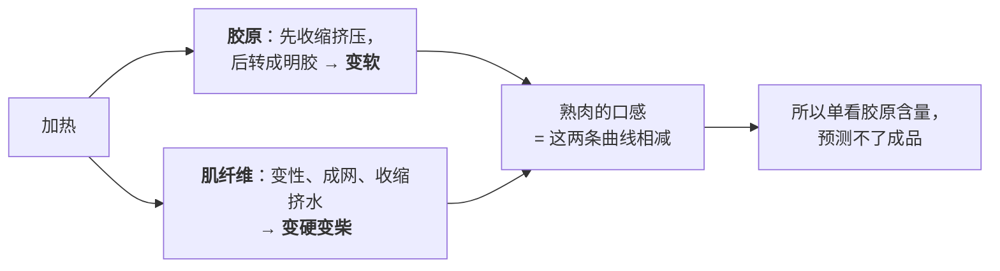
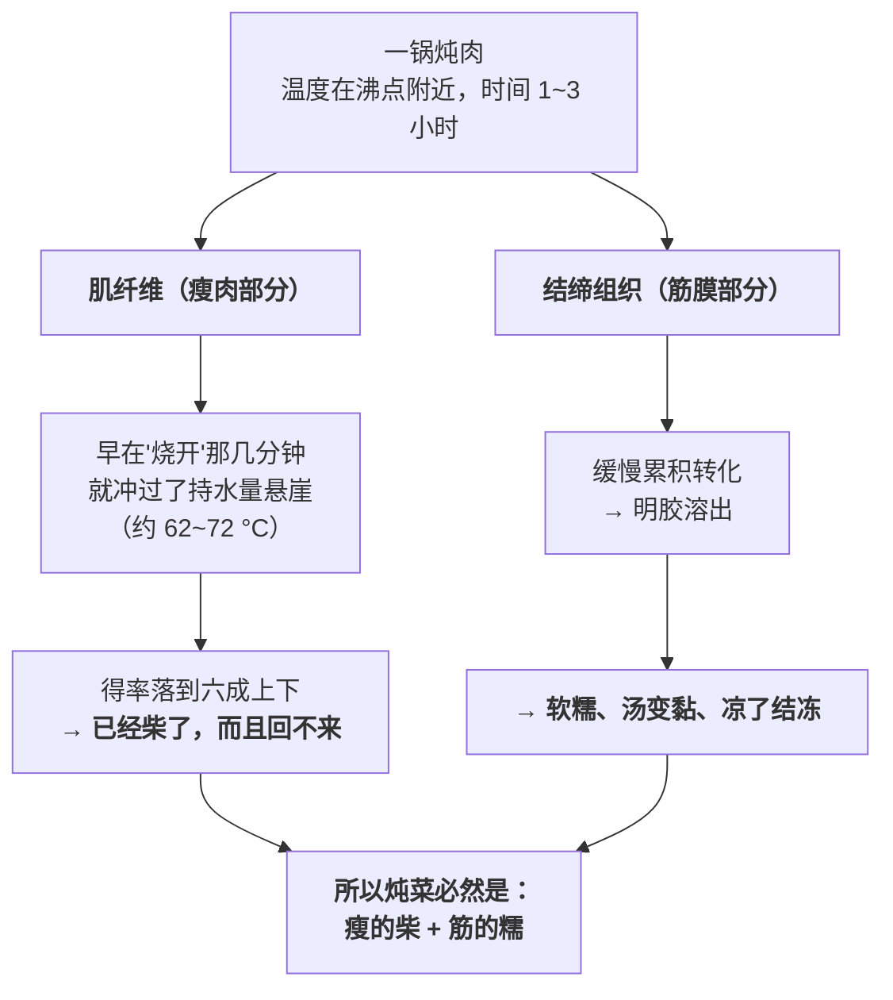

# 第 5 章 思考题参考答案

> 只记「问题 + 正确答案」。案例题给**完整推理链**。
> 涉及数字的地方，来源见[参考书目与出处登记](../standards.md)。

## Q1

**问**：结缔组织的三层套筒分别叫什么、对应厨房里的什么？哪一层能用刀，哪一层只能靠加热？

**答**：

| 层 | 名称 | 它包住什么 | 厨房里是什么 | 能用刀吗 |
|----|------|-----------|------------|---------|
| 最外 | **肌外膜**（epimysium） | 整块肌肉 | 那层能**整片撕/片下来**的"筋皮"、银皮 | ✅ **能**。整理牛排、里脊时"去筋膜"去的就是它 |
| 中间 | **肌束膜**（perimysium） | 一束一束的肌纤维 | 肉的**纹理**、肉眼可见的白色纹路；它的粗细决定了"肉的粗细" | ⚠️ **部分能**。粗的可以挑出来，但均匀分布的只能靠加热；**逆纹切**是在替牙齿把它们切短 |
| 最内 | **肌内膜**（endomysium） | **每一根**肌纤维 | 看不见、摸不着，但无处不在 | ❌ **不能**。只能靠加热改造 |

被包在最里面的是**肌纤维**，直径约 10~100 μm，
长度从鱼的几毫米到陆生动物的几厘米。

**这个结构给出的三条操作判断**：

1. **看得见的筋 → 用刀**。花几分钟去掉肌外膜，比之后花一小时炖有用得多；
2. **看得见纹理 → 逆纹切**。你没法去掉肌束膜，但可以**缩短它的长度**；
3. **看不见的那层 → 只能给时间**。这就是"炖"存在的全部理由。

> **顺带解释一个现象**：鱼为什么一蒸就散？
> 因为鱼的肌纤维只有毫米量级，而且是按"肌节"一片一片排列的——
> 片与片之间一受热就分开。**所以清蒸鱼的目标从来不是"炖烂"，而是"刚好还连着"。**

> **要带走的判断**：**"筋"不是一样东西，是三样。**
> 分清楚哪一层，你才知道该拿刀、该换切法，还是该给时间。

## Q2

**问**：为什么"炖到一半最难吃"是可以预期的？

**答**：

**因为胶原在加热时做了两件方向相反的事，而它们的时间尺度完全不同。**

| | 第一件事 | 第二件事 |
|---|---------|---------|
| 是什么 | **变性收缩** | **转成明胶** |
| 大致温度 | 胶原变性约 **53~63 °C** | 胶原纤维在 **60~70 °C** 成胶，更高温度 + **足够长的时间** → 明胶 |
| 需要什么 | 只需要**温度到了** | 需要温度**和大量时间** |
| 后果 | 胶原纤维收缩，**挤压肌纤维**，把水挤出来 → 肉**更硬、更干** | 韧的结构溶解 → **软糯**；溶进汤里 → 汤变黏 |
| 快慢 | **快** | **慢** |

> **所以时间轴上必然出现这样一段**：
> **收缩已经完成（肉变硬变干了），而转化还远远没完成（软糯还没来）。**
> 这就是"炖到一半最难吃"。**它是机制的必然结果，不是你做错了。**

文献里那句关键的话是：**加热时胶原纤维会收缩并对肌纤维施加压力，
压力大小取决于胶原的交联程度以及肌内膜与肌束膜的组织方式。**

也就是说——**交联越多、越"老"的肉，这个中间的难吃阶段越明显、越长**。

**为什么两件事的时间尺度不同**：

- **收缩**是一个构象变化，温度一到就发生，是"快"的过程；
- **转化成明胶**是把交联的三维网络逐步拆解、溶出，
  它需要**累积**（第 1 章的时间线：温度决定速率，时间决定累积量）。
  这就是为什么低温慢煮要 24~48 小时、家庭炖菜要 1~3 小时。

**实际操作上该怎么办**：

| 做法 | 对不对 |
|------|-------|
| 继续炖，保持温度别掉 | ✅ **正确**。转化还在进行，只是你还没到 |
| 加大火力想"快点软" | ❌ **错误**。更高的温度主要加快的是**瘦肉失水**，转化靠的是时间 |
| 认为失败了，提前出锅 | ❌ 这正是"炖了一小时反而更硬"这类抱怨的来源 |
| 用一个**反馈信号**确认进度 | ✅ 用筷子/叉子试插筋的部分；或看**汤放凉会不会凝**（明胶出来了没有） |

> **要带走的判断**：**过程中的"变差"不一定意味着方向错了。**
> 当一个操作同时驱动两个速度不同的过程时，
> **中间必然有一个阶段是坏结果已到、好结果未到。**
> 知道这一点，你就不会在最需要坚持的时刻放弃。

## Q3

**问**："胶原能解释生肉硬不硬，但不能单独解释熟肉嫩不嫩"——文献依据是什么？意味着什么？

**答**：

**文献依据（两条，来自同一篇综述）**：

1. **生肉**的剪切力**与胶原含量高度相关**；
2. 但在**熟肉**里，胶原的**含量、热溶解度或交联水平**与剪切力之间的相关性
   **并不清楚，而且随肌肉类型与烹饪条件变化**。

另一篇综述补上了第三条：**在 70~80 °C 时，肌内结缔组织对肌肉剪切力的贡献
小于肌原纤维部分。**

**为什么会这样——一句话解释**：

> **加热同时改变了两套系统。**
> 胶原在被"拆掉"（变软），肌纤维却在被"收紧"（变硬）。
> **熟肉的口感是这两条曲线相减的结果**，所以单看其中一条当然预测不了。

**对"选肉"意味着什么**：

胶原含量仍然是**极其有用的选购依据**——因为它决定了**这块肉需要哪条路线**：

| 生肉看到的 | 说明 | 该走哪条路 |
|-----------|------|-----------|
| 筋多、紧实、深红 | 胶原多、交联可能也多 | **给时间**（炖/焖/卤/低温长时） |
| 筋少、软、颜色浅 | 胶原少 | **控温短时**，绝不能炖 |

**对"做菜"意味着什么——三条**：

1. **不能只盯着胶原**。你把胶原化完了，如果肌纤维已经柴透了，成品照样不好吃。
   所以炖菜要选**带肥带皮**的部位：脂肪提供润滑，补偿瘦肉部分的失水；
2. **"嫩"和"软糯"是两个不同的目标**。
   "嫩"= 肌纤维没被过度收缩（第 4 章，靠控温）；
   "软糯"= 胶原转成了明胶（本章，靠时间）。
   **一块又瘦又老的肉，两个目标是互斥的**；
3. **烹饪条件本身是变量**。文献明确说了相关性"随烹饪条件变化"——
   所以**同一块肉用不同做法会得到不同的嫩度排序**，
   这也是为什么"哪个部位最嫩"这种问题没有唯一答案。

> **要带走的判断**：**一个指标能预测原料，不等于它能预测成品。**
> 中间隔着你的操作——而你的操作正好在改变这个指标本身。

## Q4

**问**：【案例】两块不知部位的牛肉，A 深红多筋紧实、B 偏浅少筋软；只有一个半小时和一口汤锅。

**答**：

**（a）分类与依据**

| | A 块 | B 块 |
|---|------|------|
| **判断** | **结缔组织型**（干活的部位） | **瘦肉型**（不怎么动的部位） |
| 依据① 颜色 | **深红** → 肌红蛋白多 → 氧化型（红肌）纤维比例高 → 通常是**耐疲劳、经常使用**的肌肉 | 偏浅 → 糖酵解型（白肌）比例高 → 爆发型、不常用 |
| 依据② 筋络 | **明显可见的白色筋络交错** → 肌束膜发达 | 几乎看不到 |
| 依据③ 手感 | **紧实** → 结缔组织支撑强 | 软 |
| 机制背书 | 文献：胶原的比例与交联程度取决于肌肉类型、年龄、**运动量**；同一头牛不同肌肉的总胶原能从肌肉干重的 1% 跨到 15% | 同上，反向 |

**（b）分别怎么做**

| | 怎么做 | 为什么 |
|---|-------|-------|
| **A 块** | **炖 / 焖**。先擦干、煎上色，再加热水没过，保持微沸，炖满一个半小时（能更久更好） | 它的问题是**结缔组织**，而结缔组织只认**累积时间**。⚠️ 煎上色必须在加水之前——加水后温度封顶在沸点附近，褐变窗口就关闭了（第 2、3 章） |
| **B 块** | **逆纹切薄片，快炒**；或整块高温短时（煎），控制中心不要越过持水量的悬崖 | 它没什么结缔组织可拆，炖它只会走第 4 章那条路：**越久越柴**，而且它没有脂肪来掩饰 |

**（c）必须在一个半小时内把 A 做得能入口——三条路**

| 办法 | 怎么做 | 代价 |
|------|-------|------|
| ① **改切法**（最容易） | **逆着纹理切成薄片**，把"需要拆开的纤维长度"直接变短；然后快炒或涮 | 得不到"炖烂出胶"的口感；切得不够逆、不够薄就会失败 |
| ② **改设备** | 压力锅：提高沸点 → 提高加热温度 → 缩短所需时间 | 瘦肉部分失水更多（温度更高）；⚠️ "高压锅炖的不如砂锅香"这个说法本书**没有核到证据**，所以不作为理由 |
| ③ **切小块** | 切成 2~3 cm 的小块，缩短第二段导热距离（第 2 章的厚度平方律），同时增加受热面积 | 更多的表面 = 更多的溶出；成品形态变了 |
| ④ **改目标**（最诚实） | 承认今天炖不烂，做成"酱牛肉片""水煮牛肉"这类**依赖切法而不依赖炖烂**的菜 | 不是原来想做的那道菜 |

⚠️ **不建议的做法**：**开大火想"加速炖烂"**。
胶原转化靠的是累积时间，而更高的温度主要加快的是**瘦肉失水**——
结果是"筋还没软，瘦的已经柴透了"。

**（d）搞反了会怎样**

| 搞反的方式 | 结果 | 机制 |
|-----------|------|------|
| **A 块拿去快炒** | **又老又嚼不动**。表面已经过火，而筋膜连变性收缩那一步都刚开始——它还在**挤压肌纤维**的阶段，只会更硬 | 胶原的转化需要时间，几分钟给不了 |
| **B 块拿去炖** | **柴、散、没味道**。持水量在约 62~72 °C 之间掉掉一半以上，久炖之后得率会落到六成上下；而它没有结缔组织可以转化成明胶来补偿，也没有脂肪来润滑 | 第 4 章的悬崖 + 本章"炖是针对结缔组织的手段" |

> **要带走的判断**：**判断依据是"看到什么"，不是"叫什么"。**
> 颜色、筋络、手感这三样，在任何一个肉柜前都能用，
> 而且**对猪、羊、禽同样适用**——这就是"可迁移"的意思。

## Q5

**问**：【案例】红烧肉菜谱的四段分析。

**答**：

**（a）炒糖色 + 翻炒上色为什么必须在加水之前**

因为**加水的那一刻，褐变窗口就关闭了**。

推理链（第 2、3 章）：

> 锅里一旦有大量液态水 → 热量优先被用于蒸发（每 kg 约 2.26 × 10⁶ J）→
> 表面温度被按在沸点附近 → **温度再也上不到褐变需要的水平** →
> 颜色和香味的机会没有了。

而糖色（焦糖化）和肉表面的褐变（[美拉德反应](../glossary.md#maillard)）
**都需要高于水沸点的干燥表面**。

> **所以任何一份炖/烧类菜谱，"加水"那一行都是一条分界线**：
> **所有需要高温和干燥的操作，必须全部安排在它前面。**
> （这正是本章实操任务三要你画的那条线。）

⚠️ 唯一的例外是**最后收汁**——那时水少到不足以压住温度，褐变窗口会**重新打开**。
这也是为什么红烧类菜品最后几十秒颜色会突然变好。

**（b）"小火"实际控制在什么范围？和 55 °C 是一回事吗**

**不是一回事，差得很远。**

> **只要锅里的水在沸腾，温度就在水的沸点附近（常压下约 100 °C）。**
> "小火"改变的是**沸腾的剧烈程度**，不是温度。

所以这里的"小火炖 1 小时"实际上是在 **100 °C 附近**做的，
而低温慢煮的 55 °C **低了 40 多 °C**——两者在第 4 章的持水量曲线上处在**完全相反的两端**：

| | 红烧肉的"小火" | 低温慢煮 |
|---|-------------|---------|
| 实际温度 | 沸点附近（约 100 °C） | 55 °C |
| 在持水量曲线上 | **悬崖之下**（水已经丢完） | **悬崖之上**（几乎没丢） |
| 得率量级 | 约六成 | 八成以上 |
| 要的是什么 | **胶原转化 + 脂肪软化** | **瘦肉保水** |

**"小火 ≠ 低温"是一个非常常见的误解**，它会导致两类错误：
以为自己在做"低温慢煮"（其实在 100 °C），
或者以为"把火调小就能让瘦肉不柴"（沸腾着就不可能）。

**（c）"大火收汁"同时在动哪几条线？为什么必须最后**

同时动**三条线、解决三个问题**（第 3 章）：

| 它在做什么 | 哪条线 |
|-----------|-------|
| ① 浓缩味道（溶质浓度上升） | 味 |
| ② 提高黏度，让汁**挂住**肉 | 味 + 水 |
| ③ 把压住温度的水赶走 → 表面温度终于能冲过沸点 → **重新开始褐变**，出现光泽与焦香 | 水 + 热 |

**为什么必须最后**：

1. **③ 只有在水足够少时才会发生**——放在前面根本做不到；
2. **② 需要明胶已经溶出来了**（黏度的一部分来自胶原转化出的明胶），
   所以必须等炖完；
3. **① 属于"定味"**，必须在接近成品的浓度下判断（第 1 章的"盐的两个身份"）。

**（d）两条规律分别发生在什么时候？为什么能容忍失水**

| 事件 | 什么时候发生 |
|------|------------|
| **持水量悬崖**（第 4 章，约 62~72 °C） | 在"大火烧开"的那几分钟里就**已经冲过去了**。此后肉一直待在悬崖之下，**水已经丢完，再炖也丢不了多少** |
| **胶原转化**（本章） | 在随后的那 1 小时里**缓慢累积** |

**为什么这道菜能容忍瘦肉失水——三条理由**：

1. **主角不是瘦肉**。五花肉好吃的是**转化出的胶质 + 软化的脂肪**，
   瘦的那几条本来就不是重点；
2. **汤汁补回了口感**。收好的汁包裹在外面，提供了润滑和味道——
   这就是为什么炖菜**必须有汁**，以及为什么收汁的浓度那么关键；
3. **脂肪在填补**。脂肪受热软化后提供的润滑感，能掩盖瘦肉部分的干。
   **这也解释了为什么纯瘦的部位炖出来"柴而不香"**——它没有这三条补偿。

> **要带走的判断**：**一道菜的设计，就是一串"接受什么、换取什么"的决定。**
> 红烧肉的设计是：**接受瘦肉失水，换取胶原转化与脂肪软化**，
> 再用汤汁和脂肪把失水的代价补回来。
> **看懂这个交换，你就能判断哪些食材适合塞进这道菜，哪些不适合。**

## Q6

**问**：【辨析】"大火滚不如小火咕嘟"——哪部分有支持、哪部分没有？"小火 = 低温"错在哪？

**答**：

**判定：⚠️ 主要理由成立，次要理由缺乏证据。**

**分层列出证据状态**：

| 环节 | 证据状态 | 依据 |
|------|---------|------|
| 胶原转化**需要累积时间**，而不是更高的温度 | ✅ **有支持** | 低温慢煮的整条路线就是证据：50~58 °C / 24~48 小时可显著嫩化瘦而硬的牛肉；软化从约 51.5 °C 开始 |
| 瘦肉失水**由温度决定**，60~70 °C 之间急剧上升 | ✅ **两个独立来源** | 持水量拟合曲线（悬崖约 62~72 °C）+ 蒸煮损失汇总（60→70 °C 显著上升、70→80 °C 不明显） |
| 因此**在能完成转化的前提下，温度越低，瘦肉保留越多** | ✅ **由上两条直接推出** | — |
| "大滚的**机械撕扯**会把肉冲散、把汤冲浑" | ⚠️ **缺乏证据** | 合理的机制推理 + 行业惯例，本书**未核到**一手对照实验 |
| 家用锅里"大滚"与"微沸"的**实际温差有多大** | ⚠️ **未核到任何测量数据** | 这是一个本书想知道却没查到的数字 |

**所以本书的表述是**：

> **"咕嘟"比"大滚"更可取，主要是因为温度更低；
> 而"大滚会把肉冲散"是一条合理但未经本书核实的惯例。**

**"小火 = 低温"错在哪——三层**：

1. **只要水在沸腾，温度就在沸点附近**。小火减少的是单位时间输入的能量，
   表现为**沸腾不那么剧烈**、蒸发慢一些，**不是水变凉了**。
   这和第 2 章辨析过的"水开了要大火才熟得快"是同一条物理规律的两面：
   **沸腾状态下，火力不改变温度。**
2. **因此"把火调小"救不了瘦肉**。想让瘦肉不柴，需要的是**让水不沸腾**
   （表面只有零星小泡、几乎不动），而这在家用灶上很难稳定维持——
   火稍大就滚、稍小就灭。
3. **真正的"低温"需要设备**。恒温水浴、低温慢煮机、或者用烤箱的低温档隔水加热。
   **认清这一点比纠结火力大小有用**：家用灶上炖肉，你其实**没有温度这个旋钮**，
   只有"沸腾"和"不沸腾"两档。

> **"大滚"真正的两个可确认代价**（不依赖那条未核实的惯例）：
>
> 1. **水跑得快**——需要中途加水，而加水会让温度掉、把浓度稀释；
> 2. **更费能源**——多输入的能量全变成了水蒸气。

> **要带走的判断**：一条流传很广的经验，往往是**一个对的理由 + 几个说不清的理由**捆在一起。
> 辨析的价值是**把它们拆开**——这样你就知道这条经验**在什么条件下会失效**
> （比如：如果你有恒温设备，"小火大火"这个问题根本不存在）。

## Q7

**问**：【辨析】"胶原含量高的肉做熟了一定更韧"——证据强度？文献怎么区分生肉和熟肉？

**答**：

**判定：❌ 明确错误**（更准确地说：**文献明确否定了这个简单对应**）。

**文献是怎么区分的**——原话的意思是两句并列：

| | 结论 |
|---|------|
| **生肉** | 剪切力与胶原含量**高度相关** |
| **熟肉** | 胶原的**含量、热溶解度或交联水平**与剪切力之间的相关性**并不清楚，
而且随**肌肉类型与烹饪条件**变化 |

另有一条补充：在 **70~80 °C** 时，**肌内结缔组织对剪切力的贡献小于肌原纤维部分**。

**为什么会断开——机制解释**：

因为**加热同时改变了两套系统，而且方向相反**：

而且"烹饪条件"本身就是变量——**同一块肉，55 °C 做 24 小时和 100 °C 做 2 小时，
胶原走到的位置完全不同**（一项研究发现更高温度下胶原含量下降但**溶解度上升**）。

**这个辨析的实际意义——两条**：

1. **别用"胶原含量"给熟肉排名**。"这块肉胶原多所以做出来一定更硬"是错的：
   如果你给了它足够的时间，胶原多反而是**优势**（出胶、软糯、汤浓）；
2. **但选肉时胶原含量仍然极其有用**——它告诉你的不是"成品有多韧"，
   而是"**这块肉需要哪条路线**"（Q3 已展开）。

**为什么这个错误说法会流传**：

因为**在"生"的状态下它是对的**（剪切力与胶原含量高度相关），
而人们在市场上摸到的、切到的就是生肉。
**一个在原料阶段成立的相关性，被直接外推到了成品阶段**——
这和第 2 章"微波从里往外"的流传机制一模一样：
**把一个有限范围内成立的结论，推到了它的适用范围之外。**

> **要带走的判断**：本书反复出现的一个模式——
> **"原料的性质"和"成品的性质"之间隔着你的操作**，
> 而操作往往正好在改变那个性质本身。
> 所以任何"X 高所以成品一定 Y"的说法，都要先问一句：
> **"这中间的加工过程，会不会把 X 本身改掉？"**

## Q8

**问**：第 4 章"温度越高留下的水越少"和本章"硬肉需要长时间高温"，怎么同时成立？
厨师是用什么办法接受这个冲突的？

**答**：

**它们同时成立，因为它们说的是同一块肉里的两套不同组织。**

**所以"冲突"其实是一个误解**——两条规律根本不针对同一个对象：

| | 第 4 章的规律 | 第 5 章的规律 |
|---|------------|------------|
| 针对谁 | **肌纤维**（瘦肉） | **结缔组织**（筋膜） |
| 说了什么 | 温度越高，留下的水越少 | 转化需要**累积时间** |
| 在炖菜里 | 早就已经"输"了 | 正在慢慢"赢" |

**厨师是用什么办法接受这个冲突的——四招**：

| 招 | 做法 | 在补偿什么 |
|---|------|-----------|
| ① **选对部位** | 炖菜只选**带筋、带皮、带肥**的部位（牛腩、猪蹄、五花、肘子、鸡爪），**不选纯瘦** | 让"赢的那一方"占比够大，"输的那一方"占比够小 |
| ② **用脂肪补润滑** | 这些部位天然带脂肪，受热软化后提供润滑 | 直接补偿瘦肉部分的"干" |
| ③ **用汤汁补水分与味道** | 炖菜**必须有汁**，而且收到能挂住的浓度 | 从外部补回失去的"多汁"感受 |
| ④ **用明胶补口感** | 转化出的明胶让汤"挂嘴"、让肉"糯" | 把失水造成的"散"变成"黏" |

> **这四招合起来，就是"炖"这个技法的完整设计**：
> **不是避免失水，而是接受失水并从别处补回来。**

**反过来也就解释了两类常见失败**：

| 失败 | 原因 |
|------|------|
| **纯瘦肉炖出来柴而无味** | 四招全用不上：没筋可转化、没脂肪润滑、汤也出不了胶 |
| **炖好了但汤收干了** | 招 ③ ④ 失效——失水的代价没有被补回来，只剩下"柴" |

> **要带走的判断**：本书到这里已经出现了第三次同一个模式——
> **两条打架的规律，解法不是找折中，而是"选一边赢、给另一边补偿"。**
>
> - 第 1 章：想上色又想嫩 → **分段**（先高温上色，后低温控中心）；
> - 第 2 章：外脆里嫩 → **分区**（外层走完整条链，内部停在第三步）；
> - 第 5 章：筋要久、瘦怕久 → **选边 + 补偿**（选带肥带筋的部位，用脂肪和汤汁补）。
>
> **认出这个模式，你就有了处理"两难"的通用套路。**
