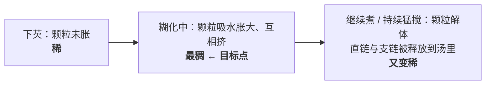

# 第 6 章 思考题参考答案

> 只记「问题 + 正确答案」。案例题给**完整推理链**。
> 涉及数字的地方，来源见[参考书目与出处登记](../standards.md)。

## Q1

**问**：直链淀粉和支链淀粉在厨房里各负责什么？为什么说"糯米黏是成分问题不是含量问题"？

**答**：

| 分子 | 形状 | 行为 | 厨房里的表现 |
|------|------|------|------------|
| **直链淀粉**（amylose） | 基本是直的长链 | 容易溶出、**容易重新排队结晶**（几分钟到几小时） | 负责**凝**：汤汁放凉能成冻、凉粉能切、冷饭会变硬 |
| **支链淀粉**（amylopectin） | 树枝状的大分子 | 不易溶、重新排队**很慢**（几小时到几天） | 负责**黏**：拉丝、糯、放凉也不容易返硬 |

**"成分问题不是含量问题"的依据**：普通淀粉颗粒里直链占 **15%~30%**，
而**糯性（waxy）淀粉的直链不到 1%**。也就是说糯米并不是"淀粉更多"，
而是**几乎只有支链**。

**这对选粉的直接指导**：

- 要**热着吃、追求亮和黏**（很多中式芡汁）→ 偏支链的淀粉（糯性、木薯类）表现更好；
- 要**放凉能定形**（凉粉、冻类）→ 需要直链；
- **最怕的错配**是：用高直链的淀粉勾一份要放凉后再吃的芡，结果第二天又硬又析水。

## Q2

**问**：为什么"水淀粉必须用冷水化开"？为什么面粉比纯淀粉更容易结块？

**答**：

综述给出的机理**不在淀粉本身，而在颗粒表面的蛋白质**：

1. 冷水**几乎进不去**直链与支链（天然淀粉不溶于冷水）；
2. 但冷水**会被颗粒表面的蛋白质吸走**；
3. 如果颗粒外围蛋白质够多、吸够了水，**它们会把一颗颗淀粉粒粘在一起**；
4. 一旦粘成团，**团块中心的颗粒就再也接触不到水、胀不开了**——
   于是外面糊化成壳、里面还是生粉，这就是**疙瘩**。

**所以"冷水化开"的目的不是"溶解"（它本来就不溶），而是"让颗粒彼此分开"**。
由此推出的四个操作，其实都是同一件事：

| 操作 | 它在解决什么 |
|------|------------|
| 用**冷**水（不用热水） | 热水会让接触面立刻糊化，把内部封死 |
| 下锅前**再搅一次** | 淀粉早就沉底了，不搅倒进去的多半是清水 |
| **边倒边搅** | 不让局部浓度过高而抱团 |
| 西餐的**油面糊**（先用油炒面粉） | 用油把面粉颗粒**先隔开**，同一个思路的另一种实现 |

**面粉更容易结块**，正是因为面粉里的蛋白质（面筋蛋白等）比纯淀粉多得多——
按上面的机理，可供"粘住颗粒"的蛋白质越多，抱团越容易。

## Q3

**问**：勾芡过程中黏度怎么变？目标点在哪里？过了会怎样？

**答**：

**文献依据**：综述明确表述——勾芡是让淀粉颗粒糊化到**一个最佳的膨胀状态**；
**煮过头会导致颗粒完全解体**，把直链和支链释放到溶液中，
后果是"**酱汁被不希望地变稀**"。

**判据**：稠度到位的那一刻，汤汁会变亮、能挂在勺背上、锅底划开会短暂留痕。
看到这个状态就**翻匀出锅**。

**过了以后的正确处理**：不是再补一次芡（会发糊发粉、味道变闷），
而是记住这次的时间点，下次把勾芡挪到更后面。

## Q4

**问**：为什么"米饭夹生"通常是水的问题而不是火的问题？

**答**：

关键是综述里那句话：**结晶区的熔化温度随含水量下降而升高**。

推理链：

1. 淀粉要糊化，**必须同时有水和热**；
2. 米粒**中心**的水来自吸收，需要时间渗进去；
3. 如果中心的水不够，那一部分淀粉的糊化"门槛温度"就被**抬高**了；
4. 于是即使锅里已经在沸腾（约 100 °C），中心那部分也可能**没有达到它自己的门槛**——
   表现为硬芯、白芯、"夹生"。

**为什么加大火反而更糟**：锅里的自由水在沸腾时温度被封顶在沸点附近（第 3 章），
**加大火并不会让水更热，只会让水跑得更快**。水跑得越快，中心越没机会吸到水。

**正确动作**：补少量热水 → 盖盖 → **小火焖**（给时间让水渗到中心）。
"焖"这一步的作用就是**用时间换渗透**，它属于四条线里的"时间"。

## Q5

**问**（案例）：糖醋里脊菜谱——"调糖醋汁（糖、醋、番茄酱、水淀粉混合），
炸好里脊后倒入糖醋汁，大火烧开后转中火熬 3 分钟收浓，再放回里脊翻匀。"
（a）两处让芡变稀的因素是什么？（b）"熬 3 分钟"有什么风险？
（c）怎么改顺序？（d）还是不够稠怎么排查？

**答**：

**（a）两处削弱勾芡的因素**：

| 因素 | 机理 | 文献依据 |
|------|------|---------|
| **糖**（糖醋汁里糖量很大） | 糖与淀粉争水、并与淀粉形成氢键，**限制颗粒膨胀** | 同一体系中 35% 蔗糖使峰值糊化温度**升高约 11~12 °C** |
| **酸**（醋 + 番茄的酸） | 酸优先水解淀粉颗粒的**无定形区**，把长链切短 | pH 约 3 时峰值黏度与最终黏度**下降**（该研究本身的结果 + 转引的两项研究） |

**注意一个容易搞错的细节**：该研究**没有**观察到柠檬酸降低糊化**温度**，
它降低的是**黏度**。所以"糖把门槛抬高、酸把成品削弱"，两者作用的环节不同。

**（b）"熬 3 分钟"的风险**：这正好落在第 6.3 节说的"煮过头"区间——
颗粒可能被彻底煮散，黏度**先升后降**。本来糖和酸已经削弱了它，再熬三分钟是雪上加霜。

**（c）改法（一种可行的顺序）**：

1. **糖醋汁先不放淀粉**：糖、醋、番茄酱、水先下锅，**熬到味道浓度合适**
   （这一步走的是"收汁"，属于第 3 章）；
2. **临出锅前**再把水淀粉（冷水化开、下锅前再搅）**边倒边搅**地淋进去；
3. 看到汤汁变亮、挂勺就**立刻**倒回里脊翻匀、出锅。

> 这样改的本质是：**把"要时间的事"和"怕时间的事"分开**。
> 熬味道需要时间，勾芡怕时间——把它们放在同一步里，必然有一个要让步。

**（d）不稠的排查顺序**（从最常见到最少见）：

| 顺序 | 检查什么 | 怎么修 |
|------|---------|-------|
| ① | 锅里**在冒泡吗**？温度到糊化区间了吗 | 先把火给足，让它真的沸起来 |
| ② | 是不是**熬过头了** | 下次把芡挪到最后；这次接受它 |
| ③ | **糖太多**（门槛被抬高） | 让温度再上去一点，而不是补粉 |
| ④ | **酸太多** | 下次把醋分两次：一部分早放做底味，一部分**勾芡之后**补香 |
| ⑤ | 淀粉**确实不够** | 这时才补芡，且**少量、化开、边倒边搅** |

## Q6

**问**（案例）：粥放凉结皮、冷藏后碗边有一圈水、粥体变硬。
分别对应什么过程？再加热能解决哪些？

**答**：

| 现象 | 对应过程 | 文献里的表述 |
|------|---------|------------|
| **表面结皮** | 回生的一种表现 | 综述列出的回生后果里就有"**热糊表面形成不溶的皮**" |
| **碗边一圈水** | **析水**（syneresis） | 回生时分子重新排队成更致密的结构，**把水挤出来** |
| **粥体变硬** | 直链（快）+ 支链（慢）重新结晶 | 直链**分钟到小时**级、支链**小时到天**级 |

**再加热能解决哪些**：

- **能部分解决"硬"**：回生形成的晶体靠热可以熔化，所以冷饭上锅蒸、隔夜面包回炉会变软。
  ⚠️ 但本书**没有核到**"能恢复到几成"的定量对照，只标为**机制推理 + 家庭惯例**。
- **不能"收回"已经析出的水**：水的位置变了，搅匀只是把它重新混进去，
  并不是回到原来的结构里。
- **不能阻止再次回生**：放凉之后同样的过程会再来一次
  （综述还提到回生后的凝胶会变得**更致密、更耐热**）。

**顺带回答一个常被问的问题**："冷藏会不会让它更快变硬？"
可确认的是：**低温有利于成核与晶体生长**，所以低温下回生更容易发生。
⚠️ 但本书引用的那项研究比较的是 4 °C 与更低的冷冻温度，
**没有室温对照**，所以"冷藏比室温快多少"本书不给数字。

## Q7

**问**（辨析）："冷饭变硬是因为水分蒸发掉了"——判断证据强度并设计验证方法。

**答**：**❌ 主要机制不是失水。**

**文献表述**：综述在讲面包老化时明确写道——陈面包**给人又干又硬的感觉，
尽管这不一定意味着水分的损失**。硬来自**分子重新排队（回生）**。
而且回生本身还会**把水挤出来**（析水）——水往往还在食物里，只是**不在原来的位置**。

**它为什么流传**：因为"干"和"硬"在日常语言里几乎是同义词，
而且暴露在空气里的冷饭确实也会失一点水——**两件事同时发生，于是被归成一件**。

**在家怎么验证（两种做法）**：

| 方法 | 怎么做 | 期待看到什么 |
|------|-------|------------|
| **密封法** | 同一锅饭分两份：一份敞口、一份**密封**（保鲜盒 + 保鲜膜贴面），同时冷藏 | 如果"变硬 = 失水"成立，密封那份应该几乎不变硬。实际上**密封那份同样会变硬**——因为水没跑，是分子排队了 |
| **称重法** | 把两份都称重，第二天再称 | 比较"重量掉了多少"和"硬了多少"。若重量几乎没变而硬度明显上升，就说明硬不是失水造成的 |

> **这个实验的价值不在结论，而在方法**：
> 它教你**把两个纠缠在一起的变量分开**（失水 / 结构变化）——
> 这正是本书反复强调的"知道自己的实验在回答什么"。

## Q8

**问**（辨析）："面包放冰箱能保鲜"——判断证据强度，分别说明微生物层面与口感层面。

**答**：**⚠️ 要分两层说，两层的结论方向相反。**

| 层面 | 判定 | 依据 |
|------|------|------|
| **微生物 / 保存期** | 低温延缓微生物生长，这一点方向清楚 | 各国食品安全机构都把冷藏作为延缓腐败的手段；美国 CDC 给出的危险温度带约 4~60 °C，冷藏就是让食物离开这个区间。⚠️ 具体到面包该不该冷藏，各国指引并无统一说法，本书不下结论 |
| **口感 / 变硬速度** | 方向相反：**低温更容易回生** | 一项研究的表述是"**更低的温度有利于成核与晶体生长，因而回生更快**" |

**所以准确的说法是**：
"放冰箱"用**变硬更快**换**发霉更慢**。它不是"保鲜"或"不保鲜"的问题，
而是**你在换哪一个**。

**本书为什么只给方向不给数字**：可核到的那项研究比较的是 4 °C 与 −20/−40/−80 °C，
**没有"室温对照组"**；本书也**没有核到**家庭条件下"冷藏 vs 室温"的定量对照。
按本书纪律（查不到就不写死数字），这里只能写方向。

**顺带一提常见的折中做法**：吃不完的面包**分装冷冻**、吃之前复热。
其机制方向与上面的文献一致（很低的温度下分子活动受限），
⚠️ 但"冷冻优于冷藏"在本书里同样属于**方向合理、定量未核**。

## Q9

**问**：第 3 章说"有自由水的地方温度上不去"，本章说"没有水就糊化不了"。
举一个两条同时起作用的例子，并说明厨师靠什么顺序兼顾。

**答**：

**一个最典型的例子：焖饭 / 煲仔饭（或任何"先煮后收"的米饭做法）。**

| 阶段 | 哪条规律在起作用 | 现象 |
|------|---------------|------|
| **前段：水多、在沸腾** | 第 3 章：只要有自由水，锅内温度就被封顶在沸点附近 | 米粒在吸水、淀粉在糊化。**这一段绝不可能上色**——温度上不去 |
| **中段：水快收干** | 本章：中心还需要水才能糊化完 | 如果这时水已经没了，中心就会夹生。**所以要盖盖、关小火、焖** |
| **后段：水基本没了** | 第 3 章反过来生效：没有自由水之后，接触面温度可以冲过 100 °C | 锅底开始出现锅巴——这时候**褐变才有可能发生**（第 7 章） |

**厨师靠什么顺序兼顾**：

> **先用"水多"完成需要水的事（糊化），再用"赶水"完成需要干的事（上色）。**
>
> 这个顺序**不能颠倒**，因为：
> - 水在的时候，温度上不去，**上色这件事根本没有机会发生**；
> - 水没了之后，糊化就停了，**夹生的部分再也补不回来**（除非再加水重来）。

**同类的例子还有**：

- **红烧肉**：先煎上色（干、高温）→ 加水炖（糊化/胶原转化，温度被封顶）→ 收汁（重新赶水，让表面能再次上色、汤汁能挂住）；
- **炒饭**：用**已经糊化完成**的冷饭（水的事已经在昨天做完了），
  整个炒的过程只做"赶水 + 加热表面"这一件事。

> **这就是四条线的用法**：
> 当"热"和"水"的要求互相矛盾时，**厨师不是找折中，而是排顺序**——
> 把它们放到时间轴的不同段上。
