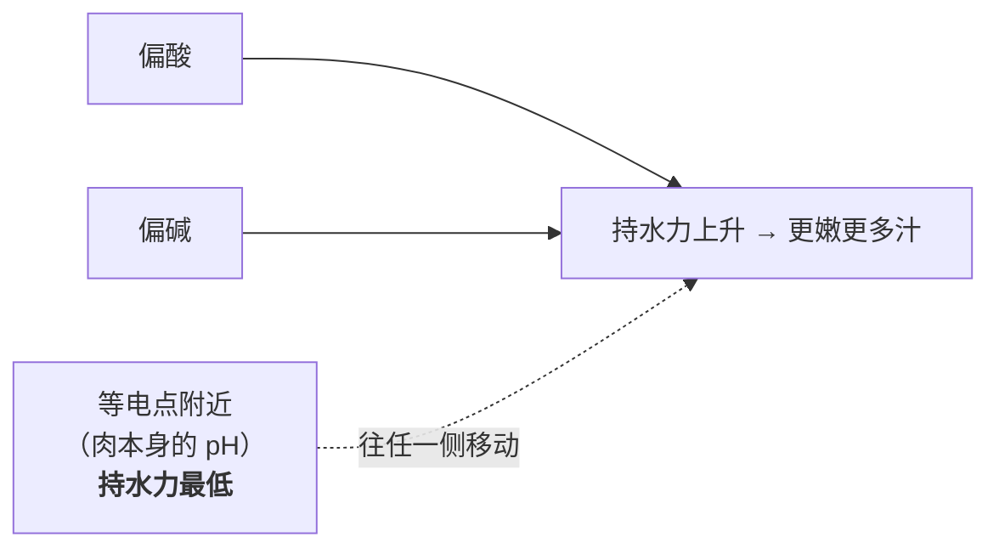
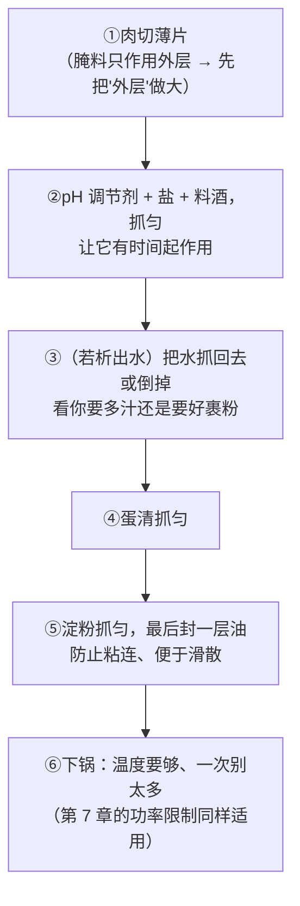

# 第 8 章 思考题参考答案

> 只记「问题 + 正确答案」。案例题给**完整推理链**。
> 涉及数字的地方，来源见[参考书目与出处登记](../standards.md)。

## Q1

**问**：为什么"酸腌"和"碱腌"在原理上是同一件事？两者各自的副作用是什么？

**答**：

**同一件事的依据**（综述的表述）：

> **pH 值对肌肉的膨胀能力、进而对持水力很重要**；
> 腌制后肌肉 pH **无论偏低还是偏高，对质地都有正面作用**；
> **pH 离等电点越远，持水力越高**——因为蛋白上能结合水的负电荷变多了；
> **既然在等电点两侧持水力都会上升，碱性溶液同样具有嫩化作用。**

**"等电点"是关键概念**：蛋白质有一个**净电荷为零**的 pH，叫等电点。
在这一点上，蛋白分子之间互相靠得最紧，**留住水的能力最差**。
往两边走（加酸或加碱），同种电荷之间互相排斥，**结构撑开、能容纳更多水**。

**两侧各自的副作用**：

| | 酸腌 | 碱腌 |
|---|------|------|
| 副作用 | 综述指出会**影响风味、带来不受欢迎的酸味** | 一项对比研究观察到样品**纤维之间出现充气孔隙、外观异常**（推测与加热时产生的二氧化碳有关）；过量还会有碱味/皂味 |
| 额外收益 | 机理上还涉及**蛋白水解增强**与**胶原向明胶转化增加** | 效果**与盐、磷酸盐相当**（在剪切力与蒸煮损失上） |

⚠️ **本书不给用量**：上述研究用的都是特定浓度的溶液或注射处理，
**家庭"一斤肉放几克"的定量证据本书没有核到**，已登记为缺口。

## Q2

**问**："腌料只作用于外层"意味着什么？三种比"延长时间"更有效的做法是什么？

**答**：

**文献原意**：综述指出腌制存在一个特别的问题——
**腌料渗入肉的速度非常慢，因此它只作用于外层**；工业上有时用**注射**来解决。

**这意味着**：

1. **对大块肉，"腌一整夜"对内部几乎没有意义**——你腌的始终是那一层；
2. **"入味"这件事，在家庭厨房里主要靠"改变形状"而不是"延长时间"**；
3. 这也解释了为什么**中式炒菜的腌制往往只要十几分钟就有效**——
   因为肉已经被切成了片或丝，"外层"几乎就是全部。

**三种更有效的做法**：

| 做法 | 为什么有效 |
|------|-----------|
| **切薄、切丝、切丁** | 直接提高"外层 ÷ 总量"的比例。这是最根本、也最省时间的一条 |
| **划刀、扎孔、断筋** | 人为增加表面积和渗透通道，等价于给腌料开路 |
| **抓拌 / 摔打 / 揉捏** | 机械作用破坏部分结构，并让腌料与表面充分接触；同时把表面的水挤出、让腌料换进去 |

**反过来，两个常见的无效努力**：

- **延长时间**：渗透很慢，回报递减；且长时间在室温下放置还有安全问题
  （美国 FDA 的指引是易腐食品应在 2 小时内冷藏，环境高于 90 °F 时 1 小时；各国口径不同）。
  **要腌久请放冰箱。**
- **加更多腌料**：外层浓度上升，但**渗透深度并不会同比例增加**，
  结果往往是外面过咸/过酸，里面还是原味。

## Q3

**问**：β-消除是什么？为什么"加碱煮豆更快"和"早放番茄煮不烂"是同一条规律的两面？

**答**：

**文献表述**：

> **β-消除反应是果胶降解的主要原因**，它切断果胶中的糖苷键，
> **发生在非酸性环境中，由氢氧根离子催化**，
> 速率取决于**温度、pH 与果胶的酯化程度**。

**为什么它决定"烂不烂"**：植物细胞之间靠**果胶**粘在一起（中间层）。
果胶降解 → 中间层溶解 → **细胞彼此分开** → 组织变软。
所以"煮烂"在微观上就是"把细胞之间的胶水拆掉"。

**同一条规律的两面**：

| 你做了什么 | 对 β-消除 | 结果 |
|-----------|----------|------|
| **加碱**（一小撮小苏打） | 氢氧根多了，反应**被催化、加快** | 豆子/蔬菜**更快烂** |
| **加酸**（番茄、醋、柠檬） | 环境变酸，反应**需要的非酸性条件被破坏** | 果胶不降解 → **怎么煮都硬** |

**所以它们不是两条经验，是同一个机理的正反两读。**

**由此得到的顺序规则**：

> **"要烂的事先做完，酸永远是后来者。"**
>
> - 番茄炖牛腩 → 肉先炖软，番茄后放（或分两次）；
> - 醋溜土豆丝 → 要脆，所以醋可以早放；
> - 煮红豆沙 → 要烂，糖和任何酸性配料都放在最后。

## Q4

**问**：青菜发黄的三条路径？为什么"加碱保绿"是次选？

**答**：

**机制根源**：叶绿素在**酸催化**下失去卟啉环中配位的**镁离子**，
变成橄榄褐色的**脱镁叶绿素**。另一篇综述补充：
加热使蛋白质凝固时，**叶绿素会暴露在植物组织自身含有的酸中**。

**三条路径**：

| 路径 | 机理 | 对策 | 证据状态 |
|------|------|------|---------|
| **时间太长** | 组织自身的酸有更多时间起作用 | **缩短加热时间**（焯烫要短、炒要快、出锅要及时） | ✅ 机制清楚 |
| **盖着盖子** | 受热释放的挥发性酸被困在锅里 | **敞开锅** | ⚠️ 机制方向一致，但本书**未核到**直接对照实验 |
| **体系里有酸** | 直接提供酸 | 醋/柠檬/番茄**最后放** | ✅ 机制清楚 |

**为什么"加碱"只能是次选**：

综述确实写了"可以通过用略带碱性的水（例如加小苏打）煮绿色蔬菜来避免这种颜色变化"，
所以它**有效**。但要付三笔账：

1. **质地**：碱会**加速果胶的 β-消除**（第 8.2 节）——菜更容易烂；
2. **味道**：过量的碱带来皂味/涩味（综述在讲膨松剂时明确提到碳酸根离子造成皂味）；
3. **其他成分**：本书未核到家庭剂量下对营养成分影响的可靠数据，所以不予评价。

> **本书的排序**：
> **①缩短时间 → ②敞开锅、出锅快 → ③酸最后放 → ④（真的需要时）极少量碱。**
> 因为前三条**没有代价**，第四条**有代价**。

## Q5

**问**（案例）：番茄炖牛腩菜谱——"牛腩焯水，下锅翻炒，加番茄块炒出汁，加水没过，
炖 1.5 小时，加盐调味。"（a）顺序风险是什么？（b）怎么改？味道怎么补？
（c）不改顺序的话怎么补偿？

**答**：

**（a）风险：番茄放得太早。**

机理链：

1. 番茄带来酸；
2. 酸抑制**β-消除**（它需要非酸性环境）；
3. 于是**结缔组织周围的植物性组织**以及**同锅的根茎类配菜**更难软；
4. 更重要的是：牛腩的软化靠的是**胶原转明胶**（第 5 章），
   这需要**足够高的温度持续足够长的时间**；而一大锅偏酸的汤对整体质地的影响，
   ⚠️ 本书**没有核到**直接的对照实验——
   **所以这里必须诚实**："酸会让肉炖不烂"这条在本书里**只有机理方向、没有一手证据**；
   有一手机理支持的是**"酸让植物组织（果胶）不容易烂"**。

> **所以准确的说法是**：
> 这份菜谱确定会遇到的问题是——**番茄本身在长时间酸性环境里会化得很碎，
> 而同锅的土豆/胡萝卜类配菜会变得难软**；
> 至于"牛腩会不会因此变难炖"，本书标为**未核**。

**（b）改法（分两次放番茄）**：

| 步骤 | 做什么 | 为什么 |
|------|-------|-------|
| 1 | 牛腩焯水、下锅**煸炒上色** | 褐变窗口只有这一次（第 7 章） |
| 2 | 放**一半番茄**炒出沙，加水炖 | 这一半负责"味"：长时间炖煮让它化进汤里 |
| 3 | 炖到肉接近软 | 让需要时间的事先完成 |
| 4 | 放**另一半番茄**，再炖 15~20 分钟 | 这一半负责"形和香"：保留果肉感与新鲜酸香 |
| 5 | 最后加盐调味 | 见第 11 章（盐）；这一步位置本身没问题 |

**味道会不会损失**：不会，反而通常更好——
**因为酸和香气是两种东西**：不挥发的酸在长时间炖煮后仍留在汤里（管"味"），
而挥发性的新鲜香气一煮就跑（管"香"）。**分两次放，两样都拿到。**

**（c）如果坚持原顺序（想要番茄完全融进汤里）**：

| 补偿动作 | 理由 |
|---------|------|
| **延长炖煮时间**，或**用压力锅** | 用时间/温度去抵消酸对软化的抑制 |
| **配菜后放**（土豆、胡萝卜等根茎类不要一开始就下） | 这些才是酸影响最确定的对象 |
| **出锅前补一点新鲜番茄或一点点醋/柠檬** | 补回被煮掉的香气 |
| **接受"番茄化没了"** | 这本来就是这种做法想要的效果（番茄作为汤底而非配料） |

## Q6

**问**（案例）：做滑嫩炒肉片，手里有小苏打、白醋、淀粉、蛋清、料酒、盐。
（a）各自解决什么问题？（b）怎么组合与排序？（c）哪样最易过量？
（d）哪些有文献支持、哪些是惯例？

**答**：

**（a）各自在做什么**（跨章）：

| 材料 | 属于哪条线 | 它在解决什么 | 对应章节 |
|------|----------|------------|---------|
| **小苏打** | 味/质地（pH） | 把 pH 推离等电点 → **提高持水力、降低剪切力** | 第 8 章 |
| **白醋** | 味/质地（pH） | 同上，走**另一侧**；还带酸味与香气 | 第 8 章 |
| **淀粉** | 热/水 | 受热糊化，形成一层**外套**，挡住热冲击与失水 | 第 6 章 |
| **蛋清** | 热/水 | 受热凝固成膜，作用类似；同时帮助淀粉附着 | 第 4、6 章 |
| **料酒** | 味 | 主要是去腥与增香（机理见第 19 章，⚠️ 本书尚未核到一手文献） | 第 19 章 |
| **盐** | 味/水 | 给味道 + 对水下命令（渗透、溶解肌原纤维蛋白） | 第 3、11 章 |

**（b）一种符合原理的顺序**：

**为什么是这个顺序**：**先让小分子（pH 调节剂、盐）接触肉，再上"外套"**。
反过来先裹淀粉，后面的东西就进不去了。

**（c）最容易过量的是小苏打。**

过量的表现：**碱味/涩味**、口感"滑得发假"（像橡皮）、
以及文献记录的**纤维间充气孔隙、外观异常**。
⚠️ 白醋过量的表现是明显的酸味（综述也提到酸腌"带来不受欢迎的酸味"）。

**（d）证据分层**（这是本题真正的考点）：

| 环节 | 证据状态 |
|------|---------|
| pH 离等电点越远 → 持水力越高 | ✅ **有文献** |
| 碱性腌制是中式常用嫩化法、碳酸氢钠降低剪切力与蒸煮损失 | ✅ **有文献**（含多项转引研究） |
| 酸性腌制改善嫩度与多汁感 | ✅ **有文献** |
| 腌料只作用外层 → 要切薄 | ✅ **有文献** |
| 淀粉受热糊化形成保护层 | ✅ 机理有文献（第 6 章），但**"上浆减少失水多少"的定量本书未核到** |
| **具体用量、顺序、静置时间** | ⚠️ **全部是行业与家庭惯例**，本书未核到一手对照 |
| 料酒去腥的机理 | ⚠️ **未核到**（已登记为缺口，第 19 章开写前需专门补查） |

## Q7

**问**（辨析）："柠檬汁能把鱼腌熟"——质地/外观层面与安全层面分别是什么情况？
为什么本书拒绝给安全建议？

**答**：

**质地/外观层面：⚠️ 说它"变性"是准确的，说它"熟了"是误用。**

- 第 4 章讲过，蛋白质变性**不只由热触发**，酸和盐同样能让蛋白质展开并凝聚；
- 所以酸处理的鱼**确实**会变白、变紧、变得不透明——
  这些正是我们平时用来判断"熟了"的外观特征；
- **但"熟"在食品安全语境里指的是"经过了足够的热处理"**，这是两件事。

**安全层面：本书不给建议，理由有三条**：

| 理由 | 依据 |
|------|------|
| ① **外观判据本身就不可靠** | 美国 CDC 明确指出：**除海鲜外，不能靠颜色和质地判断食物是否熟透**，只有温度计可靠。而"变白"恰恰是颜色与质地判据 |
| ② **各国官方对鱼给的是加热口径** | 美国 FDA：有鳍鱼类 145 °F（约 63 °C）或"肉质不透明、可用叉轻易分开"；加拿大卫生部：70 °C。**没有一条是"用酸处理多久"** |
| ③ **本书没有核到任何"酸处理等效于加热"的官方指引** | 按本书纪律，食品安全的数字与结论**必须引官方来源**；查不到就不写 |

**本书的立场表述**：
**生食水产涉及本地专门的官方指引（通常包括对冷冻处理的要求），
请遵循自己所在地的现行发布。本书只说明酸在物理上做了什么，不对生腌做法的安全性背书。**

> **顺带说清一个容易混淆的点**：法规里**确实**用酸度做分界
> （美国 FDA：最终平衡 pH >4.6 且水活度 >0.85 属低酸罐头食品；加酸后 pH ≤4.6 属酸化食品），
> 但那是**针对密封罐藏食品的分类与备案要求**，**不能**被读成"加酸就安全"。

## Q8

**问**（辨析）："焯青菜加一点小苏打保持翠绿"——收益、代价、不加碱的替代方案。

**答**：**⚠️ 有效，但代价常被忽略，本书把它列为次选。**

**收益（有文献）**：综述明确表述——叶绿素的失镁褪色
"**在厨房里可以通过使用略带碱性的水来煮绿色蔬菜而避免，例如加入小苏打**"。
机理：碱中和了促成失镁的酸性条件。

**代价（也有文献）**：

| 代价 | 依据 |
|------|------|
| **质地变软甚至过烂** | 碱**催化果胶的 β-消除**（氢氧根催化、非酸性环境下发生）——你在保颜色的同时在拆细胞之间的胶水 |
| **皂味 / 碱味** | 综述在讲膨松剂时指出，工业上使用膨松酸正是为了**防止 pH 升高与碳酸根离子带来的皂味** |
| **难以控制** | 家庭里没有称量到 0.1 g 的习惯，很容易过量；而过量是不可逆的 |

**不加碱的替代方案（本书首选）**：

| 动作 | 为什么有效 |
|------|-----------|
| **水要多、火要大、时间要短** | 减少叶绿素与组织自身酸的接触时间；水多可以让下锅后水温回升快 |
| **锅敞开** | 让挥发性酸跑掉（⚠️ 机制方向一致，本书未核到直接对照） |
| **焯完立刻摊开降温**（有条件可过冷水） | 停止余温加热（第 2 章的余温加热），避免出锅后继续变色 |
| **酸性配料最后放** | 醋、柠檬、番茄一律出锅前才加 |
| **不提前焯好放着** | 放置时间越长，颜色越差 |

## Q9

**问**：举一个"质地、颜色、气味三者冲突"的例子，说明你优先保哪一样。

**答**：

**一个标准例子：做一道"蒜蓉炒西兰花"，你想让它又绿又脆又香。**

| 你可能做的动作 | 质地 | 颜色 | 气味/味道 |
|--------------|------|------|----------|
| **焯水时加小苏打** | ❌ 更容易软烂（β-消除被催化） | ✅ 更绿 | ❌ 过量会有皂味 |
| **焯水时加醋** | ✅ 更脆（β-消除被抑制） | ❌ 变橄榄褐（叶绿素失镁） | ⚠️ 带来酸味，可能不是你要的 |
| **焯烫时间拉长** | ❌ 变软 | ❌ 变黄 | ⚠️ 水溶性风味物质溶出（第 3 章） |
| **完全不焯，直接爆炒** | ✅ 脆 | ✅ 保绿（时间短） | ✅ 有锅气 |

**冲突点很清楚**：**碱保颜色但毁质地，酸保质地但毁颜色。**

**本书建议的优先级与理由**：

> **第一优先：用"时间"解决，而不是用"pH"解决。**
>
> 因为**缩短时间对三样都有利**——它同时保住了颜色（酸接触时间短）、
> 质地（β-消除累积少）和味道（溶出少）。
> **凡是有"对三条线都有利"的手段，就不要去用那些"拆东墙补西墙"的手段。**
>
> 具体到这道菜：**大火、少量、快炒、及时出锅**；
> 需要焯就**短焯 + 立刻摊开降温**；蒜香靠**出锅前补一次生蒜蓉**（挥发性香气最后放）。
>
> **只有当"时间"这个手段已经用尽，才轮到考虑 pH——**
> 这时你必须明确回答一个问题：**今天这道菜，我更在乎颜色还是口感？**
> 两个都要的做法通常不存在。

**这道题的通用结论**：

> **当几条线互相冲突时，先找"共赢的旋钮"（通常是时间、火力、分批、切法）；
> 找不到才去做取舍，而取舍要说得出你放弃了什么。**
