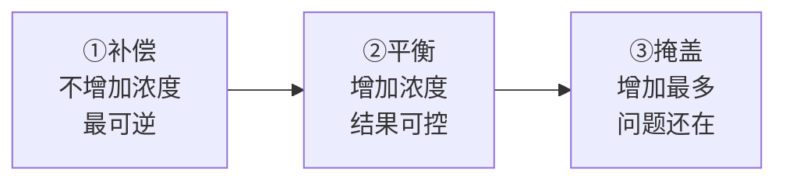

# 第 10 章 思考题参考答案

> 只记「问题 + 正确答案」。案例题给**完整推理链**。
> 涉及数字的地方，来源见[参考书目与出处登记](../standards.md)。

## Q1

**问**：为什么本书说"抑制是默认、增强是例外"？这个默认值对"往锅里加东西"这个动作意味着什么？

**答**：

**依据**：感官研究的基本观察是——**每一种味觉属性在两成分混合物中，通常都被感知为比单独品尝时更弱**
（见于 2024 年那篇研究氯化钠与苦味受体的论文的引言复述）。
而"增强"需要条件：**多见于低到中等浓度**，且往往需要特定的配对。

**它对操作的三个含义**：

| 含义 | 说明 |
|------|------|
| **加东西有隐性成本** | 你加进去的每一样，最可能的结果是**同时把已有的味道压下去一点** |
| **"越调越平"是可预期的** | 加得越杂，越接近"谁也不突出"的状态——这不是你手艺的问题，是混合抑制的默认行为 |
| **要增强，得刻意设计** | 增强不会自己发生。它需要：**主味处在低到中等水平** + **配对是有证据的那几对** + **香气要"对得上"** |

**一句话**：**做菜时"减一样"往往比"加一样"更容易让某个味道突出。**

## Q2

**问**：为什么同一对味在低浓度和高浓度下结论可能相反？请举出本章给的**一条一手证据**。

**答**：

**机制层面（已核到的表述）**：减钠综述转引 Keast 与 Breslin 的总结——
混合味之间可能出现增强、抑制或没有影响三种结果，且**增强效应在低到中等浓度下更明显**。
高浓度时，抑制往往占主导。

**一手证据**：2025 年那项水煮鸡研究（158 名未受训练消费者）设了**两个盐档**：

| 盐档 | 加入香精后的咸味增强效应 |
|------|--------------------|
| **常规档**（6.5 mmol Na⁺/100 g 熟鸡） | 各香精的增强效应**与零无显著差别** |
| **低盐档**（4.1 mmol Na⁺/100 g） | 烟熏培根 + 盘中撒盐这一组**显著大于零**（p = 0.02） |

**另一条同方向的一手证据**：用近红外光谱那项研究发现，
**味精对咸味"持续时间"的作用只限于低与中等浓度的盐溶液**
（而酱油气味的作用在所有浓度下都存在）。

**厨房推论**：**"用别的东西来补"这个策略有一个适用窗口——主味必须"不足但接近"。**
已经足量的时候，相互作用基本帮不上忙。

## Q3

**问**："糖压酸"成立吗？请给出**两个独立来源**的数据，并说明它**双向**的那一面是什么。

**答**：**成立，而且是本章证据最强的一对。**

**来源一（强度层面，一手实测）**——中丹跨文化消费者研究
（中国 120 人、丹麦 139 人，水溶液，2.50% 蔗糖 / 0.140% 柠檬酸 / 0.114% 酒石酸）：

| 样品 | 甜度评分 | 酸度评分 |
|------|---------|---------|
| 只有糖 | **6.32** | 1.51 |
| 只有柠檬酸 | 1.90 | **6.42** |
| 糖 + 柠檬酸 | **4.53** | **4.79** |

**两边都掉了约四分之一到三成**，且 p < 0.001；换成酒石酸结果几乎一样。

**来源二（阈值层面，独立研究）**——一项用 Weber–Fechner 框架建模的研究发现：
**柠檬酸的背景浓度越高，蔗糖的绝对阈值越高**，也就是要放更多糖才尝得出甜。

**双向的那一面（关键）**：

> **你压住酸的同时，这些糖的甜也正在被酸压着。**

所以：

1. **糖醋味不是"糖 + 酸"，而是"两个都被削弱之后剩下的新平衡"**；
2. 这解释了一个厨房现象：**糖醋类菜要放的糖，比你凭"甜度"估计出来的多得多**——
   因为其中很大一部分糖的甜味根本没被你尝到，它被酸吃掉了；
3. 反过来也成立：**想让一道菜"酸得明显"，减糖往往比加酸更有效**
   （加酸会同时压掉更多甜，但也会把总浓度推高）。

**⚠️ 别忘了个体差异**：同一项研究的聚类分析里，**有一群人几乎不被压**
（某聚类的甜度只从 6.62 降到 6.28）。**你和你家人对同一份糖醋汁的判断可能天然不同。**

## Q4

**问**："盐抑制苦"的证据处在什么层次？为什么本书说这种抑制"可能主要发生在中枢"？

**答**：

**证据分三层**：

| 层次 | 内容 | 本书的核对状态 |
|------|------|------------|
| **感官层（现象）** | 人类感官研究中反复观察到钠抑制多种苦味物质。最有名的出处是 1997 年《Nature》上一篇**标题即为结论**的短文（直译："盐通过抑制苦味来增强风味"） | ⚠️ 本书**只核到书目信息与标题**，全文非开放获取 |
| **复述层** | 2024 年一项受体研究在引言中复述："此前的人类感官研究中观察到了钠对苦味的抑制" | ✅ 开放获取全文 |
| **受体层（机制）** | 同一项研究用功能表达实验测了四个人类苦味受体（约 25 个中的四个），发现**只有 TAS2R16 的信号在氯化钠存在下下降**，其他受体—苦味物质配对**不受钠浓度变化影响** | ✅ 一手 |

**为什么推断"主要在中枢"**：

如果抑制发生在舌头上（外周），那么受体层面应该普遍能测到信号下降。
但实验里**大部分配对没有变化**，而感官上人们对**很多种**苦味物质都报告了抑制。
**这两件事对不上**，所以作者的结论是：对多数苦味物质而言，
**抑制更可能发生在大脑整合味觉信号的阶段**，而不是受体阶段。

**厨房推论**：

1. **加盐去苦是有效的现象**，苦瓜、某些青菜、咖啡里加一点盐是有道理的；
2. 但它是**掩盖**，不是去除——**苦味物质还在那里**，浓度没变；
3. **对不同的苦，效果可能不一样**（受体层面就已经是"挑对象"的）——
   所以它在某些菜上明显、某些菜上无效，**这是可预期的，不是你的错觉**。

## Q5

**问**：什么是"气味引起的味觉增强"？它的**两个限制条件**分别是什么？

**答**：

**定义**：**气味引起的味觉增强**（odor-induced taste enhancement）指
**闻到的气味改变了你尝到的味觉强度**——气味本身不提供咸味，却让同样的盐尝起来更咸。

**本书核到的四条一手证据**：

| 体系 | 结果 |
|------|------|
| 0.3% 盐水 + 中式豆豉的 5 种气味物质（含两种吡嗪、二甲基三硫醚、两种含硫化合物） | 显著增强咸味 |
| 氯化钠溶液 + 酱油气味 | 时间—强度法测得咸味增强 |
| 低盐奶酪 + 沙丁鱼香气 / 黄油香气 | 沙丁鱼香气显著增强咸味，黄油香气增强较小 |
| 水煮鸡 + 烟熏大蒜风味 | **可少放 33% 的盐**而不影响"刚刚好"的评价 |

**限制条件一：一致性（congruency）。**

> 减钠综述的表述是：**只有一致且熟悉的风味组合才能有效产生这种增强。**

也就是说，**这个香气必须"闻起来本来就该是咸的"**：酱油、豆豉、腊味、鱼干、烟熏——
它们在你的经验里一直和咸味一起出现。而甜香（草莓、香草）增强的是**甜**。
**乱配香气不会增强，只会让菜变怪。**

**限制条件二：必须走鼻后通路。**

> 减钠综述给出的对比：**鼻后嗅觉**的相互作用能实现**高达 75%** 的减钠
> （香辛料组合用于人造黄油那项研究），而**鼻前**（隔着空气闻）最高只到约 **13.60%**。

**另外还有一条隐含的第三个限制**（见 Q2）：**主味要处在低浓度**。

## Q6

**问**：鼻前嗅觉和鼻后嗅觉在减钠效果上差多少？这对"香油什么时候放"意味着什么？

**答**：

| 通路 | 是什么 | 报告的最大减钠幅度 |
|------|-------|--------------|
| **鼻前**（orthonasal） | 隔着空气闻到的，食物还没进嘴 | 约 **13.60%**（培根气味那项研究） |
| **鼻后**（retronasal） | 食物在嘴里时，挥发物从口腔后部上行进入鼻腔 | **高达 75%**（香辛料组合用于人造黄油） |

**差了大约五倍。**

**对"香油什么时候放"的三个推论**：

1. **香气要留到进嘴的时候还在**——所以挥发性的香（香油、香菜、葱花、鲜柠檬汁、白胡椒）
   **出锅前或出锅后放**，让它跟着食物一起进嘴，而不是在锅里就跑光；
2. **"厨房里很香"不等于"吃起来很香"**——满屋子香味意味着香气**已经离开食物了**；
3. **盖盖子端上桌、趁热吃**是有道理的：香气分子在食物里待得越久，鼻后能收到的就越多。

⚠️ 注意：这不意味着所有香料都该最后放。**要靠加热才能产生的香**
（爆香的葱姜蒜、炒香的花椒、褐变生成的香）必须先受热——见第 13 章。

## Q7

**问**（案例）：番茄牛腩尝起来"又酸又寡淡，还有点苦"，已放番茄、盐、少量酱油，炖了 90 分钟。

**答**：

**第一步：把"一个抱怨"拆成三个独立问题。**

"又酸又寡淡还有点苦"其实是**三个方向相反的问题同时存在**：酸**过量**、主味**不足**、苦**过量**。
这三个必须分开处理，因为救法互相矛盾。

**（a）按五问顺序排查**

| 顺序 | 问题 | 这道菜的答案 |
|------|------|----------|
| ① | 要某样更强还是更弱？ | **都有**：咸/鲜要更强，酸和苦要更弱 |
| ② | 主味现在什么量级？ | 既然"寡淡"，咸大概率**不足但接近** → **相互作用能用上** |
| ③ | 有没有不加味觉物质的办法？ | 有：番茄 + 牛肉本身就是"谷氨酸侧 + 核苷酸侧"的经典配对（第 9 章），可以先补**香**；另外这道菜炖了 90 分钟，**很可能缺褐变**（第 7 章） |
| ④ | 我加的会顺带压掉什么？ | 加糖会压酸，**但也会压掉一部分本来就不多的咸与鲜**；加盐会压苦，但不可逆 |
| ⑤ | 等一下再尝了吗？ | 炖菜尤其要等——盐和糖需要时间扩散进肉块 |

**（b）酸与苦分别怎么处理，属于哪个动作**

| 问题 | 手段 | 属于 | 理由 |
|------|------|------|------|
| **酸过量** | 加糖 | **平衡** | 糖与酸互相抑制，有两个独立来源支持 |
| **酸过量（更优先）** | **先确认它是不是"番茄放早了"造成的** | — | 长时间炖煮的番茄酸味会被浓缩；下次可以先把番茄炒出沙、或后放一部分 |
| **苦** | 一点盐 | **掩盖** | 钠抑制苦有共识；且这道菜本来就缺盐，一举两得 |
| **寡淡** | 一点一致的香（胡椒、少量酱油、出锅前的葱） | **补偿** | 代价最小，不增加任何味的浓度 |

**顺序**：**先补偿（香）→ 再补盐（同时解决淡与苦）→ 最后才考虑糖。**
理由还是那条：先做可逆的、代价小的。

**（c）加糖的代价**

1. **甜和酸是互相抑制的**——糖压住酸的同时，酸也在压糖，所以**你需要的糖比预期多**；
2. **中高浓度的甜通常抑制其他味觉**——这道菜本来就"寡淡"，
   **加糖有让它更寡淡的风险**；
3. **总浓度只增不减**——糖加进去就取不出来，下一步的空间变小了。

**所以正确做法是：先把盐和香补上，让主味立起来，再决定要不要加糖。**

**（d）加香能解决什么、不能解决什么**

| 能 | 不能 |
|----|------|
| 让"寡淡"明显改善（香气占"味道"的大部分维度） | **不能降低酸度**（酸是味觉，不受香气的方向性影响） |
| 在低盐状态下**顶上一部分咸度** | **不能补褐变**——如果这锅从头到尾泡在水里，缺的是第 7 章的东西，出锅前撒香菜救不了 |
| 增强"厚度"与"持续感" | 不能让苦消失（那要靠盐或稀释） |

**怎么验证是不是缺褐变**：看牛腩下锅前有没有**煎上色**。
如果是直接冷水下锅炖，那这锅汤的"香"从一开始就没被造出来——**这是下次的事，不是今天能补的**。

## Q8

**问**（案例）：勾芡前尝着刚好，勾完芡端上桌大家说淡。

**答**：

**（a）本章能解释的原因**

一项 2025 年的研究把增稠剂加进糖、酸、盐三种模型体系（56 名健康受试者），结果是
**咸（β = −4.16）、酸（β = −3.29）、甜（β = −3.43）三种味觉强度都显著下降**（p < 0.001），
且下降幅度随味觉种类差别很大。

**也就是说：变稠这件事本身，就会让你尝到的味道变淡。**

**（b）为什么本书说"机理待定"**

因为同一项研究做了一件很诚实的事：他们把**黏度**当作解释变量放进模型，
结果发现**黏度并不能很好地解释这个下降**（模型的解释力反而更低）。

**所以现在的状态是：现象确实存在，但"为什么"还没搞清楚。**
常见的猜测（增稠剂阻碍味觉物质扩散到受体）**本书没有核到足够的证据**，因此不写。

> **这正是第二部分导读里说的那件事**：感官领域的结论比物理结论"软"，
> **现象成立 ≠ 机理清楚**。而**操作结论并不依赖于机理**。

**（c）下次把"尝味"放在流程的哪一步**

| 时机 | 该不该定味 |
|------|---------|
| 勾芡**前** | ❌ 只能做粗调，**不能定最终味** |
| 勾芡**后、关火前** | ✅ **这才是定味的时刻** |
| 关火后 | ✅ 还要再确认一次，因为温度会降（第 9 章：低温下敏感度下降） |

**一条更通用的规则**：**任何会改变体系的操作之后都要重新尝**——
勾芡、收汁、加油、加水、静置，都算。
**顺序是：所有结构性操作做完 → 最后一次调味 → 出锅。**

## Q9

**问**（辨析）："最后撒的盐比拌进去的更咸"——判断证据强度。

**答**：⚠️ **分体系，本书不把它当通则。**

**支持它的证据（来自哪种体系）**：

一篇 2026 年的减糖综述指出：**甜味强度不仅取决于绝对浓度，还取决于时间与空间上的递送方式**；
在**凝胶体系**中，做成有浓度梯度的分层结构，可以**比均匀配方少用约 20% 的糖**而不损失风味。
机理被归因于受体刺激的动态差异、断裂行为与不均匀释放。

⚠️ 注意：这是**糖**、在**凝胶**里、用**分层结构**做的。

**反对它的一手实验（怎么做的）**：

2025 年那项水煮鸡研究**正是抱着这个假设去做的**。作者明确写出他们的预期：
"盐撒在盘中会让盐晶体留在肉的表面，形成更不均匀的分布，从而提升咸味感受"。

实验设计：鸡胸在标准家常汤里煮，**盐要么在煮之前加进汤里，要么在出锅后撒在盘中**，
两个盐档、158 名未受训练的消费者。

结果：**两种加盐方式的咸度感受没有显著差异**（p > 0.2，两个盐档都不显著）。
**作者的假设没有被证实。**

**该在什么菜上相信它 / 不相信它**

| 相信它 | 不相信它 |
|-------|--------|
| **干的、表面能保住颗粒的**：烤肉、炸物、烤蔬菜、拌面、煎蛋、凉拌 | **带汤的**：汤、炖菜、煮的东西——**盐迟早会均匀分布，你撒在表面的也会跟汤一起进嘴** |
| **能一口吃到"不均匀"的**：撒在表面的粗盐粒、分层的东西 | **会被搅匀的**：回锅翻炒、勾芡、闷煮 |
| **入口即化、盐直接接触舌头的** | **需要咀嚼很久、盐早就被唾液稀释均匀的** |

**一句话总结**：**这条规律的成立条件是"不均匀能保持到入口"。**
保持不住的时候，它就退化成"总量相同"。

## Q10

**问**（辨析）："西瓜撒点盐更甜"——本轮查证有没有改变第 9 章的判定？为什么没有？

**答**：**没有改变。本书维持 ⚠️ 证据不足的判定。**

**本轮的新发现**：在一篇 2022 年研究蔗糖—柠檬酸相互作用的论文的**引言**里，
作者汇总前人研究时写到：**"低浓度的咸味物质可以增强甜味，并在中等浓度下被甜味抑制"**
（并给出了 Stevens 与 Keast 两个实验室的引用）。

**方向上，这确实是在支持"盐提甜"。**

**那为什么不升级判定？** 三个理由：

| 理由 | 说明 |
|------|------|
| **它是转引，不是一手** | 这句话出现在**引言的文献汇总**里，本书**没有打开原始论文**核对它的浓度、方法、受试人数与效应量 |
| **本书的纪律要求两个独立来源** | 关键结论要至少两个独立来源一致才写。现在只有一条转引 |
| **"低浓度"这个条件很关键，而它没有数值** | 转引里没有给出"低浓度"到底是多少。**一个没有边界的条件，在厨房里没法用** |

**这体现了本书的哪条纪律**：

> **查不到就别写死；查到了但只有二手，也不能升级成结论。**
>
> 更重要的是那条隐含的纪律：**不能因为一条新证据"符合我原本想说的话"就放松标准。**
> "西瓜撒盐更甜"是一句非常流行、非常有画面感的说法——
> 正因为它讨人喜欢，才更需要按同样的尺子量。

**⚠️ 同时要说清楚本书不是在说它"错"**：本书说的是**"本书没有把它核实到能写进正文的程度"**。
这两件事不一样。**它可能是对的，只是还没被本书核到。**

## Q11

**问**：掩盖、平衡、补偿三个动作的代价分别是什么？为什么建议的顺序是"补偿 → 平衡 → 掩盖"？

**答**：

| 动作 | 在做什么 | 典型例子 | 代价 |
|------|---------|---------|------|
| **补偿** | 换一条**不增加味觉物质浓度**的通路去顶 | 盐不够 → 补一致的香 / 补鲜 / 加一点麻 | **只在主味"不足但接近"时有效**；香要对得上；⚠️ 幅度有限 |
| **平衡** | 调整几种味的**相对量** | 太酸 → 加糖 | **双向的**：压住酸的同时甜也被压；**总浓度上升** |
| **掩盖** | 用一种味去**压住**另一种不想要的味 | 太苦 → 加盐 | **问题物质原封不动还在**；总浓度上升最多；**下一次出问题时更难救** |

**为什么是这个顺序**：

三条理由：

1. **可逆性递减**：补偿几乎不改变体系（多一点香，散掉就散掉了）；
   平衡与掩盖都是**往里加物质**，加了取不出来；
2. **剩余空间递减**：每加一样，锅里的"总浓度预算"就少一点。
   **先用不花预算的手段，把预算留给真正需要的地方**；
3. **掩盖会累积成陷阱**：苦味物质还在，只是被盐压住了。
   下次这道菜再出问题（比如又需要加点什么），
   你会发现**盐已经到顶了，而苦还在下面等着**。

**这与第 9 章"先做可逆的事，再做不可逆的事"是同一条方法论**，
也和第 5、7 章"把不可挽回的决定尽量往后推"一致。
