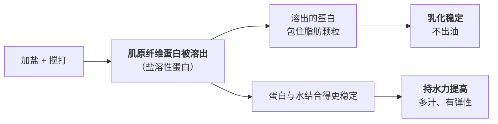

# 第 11 章 思考题参考答案

> 只记「问题 + 正确答案」。案例题给**完整推理链**。
> 涉及数字的地方，来源见[参考书目与出处登记](../standards.md)。

## Q1

**问**：盐同时在做哪四件事？为什么说"盐什么时候放"这个问题没有统一答案？

**答**：

| # | 盐在做的事 | 作用对象 | 需要的时机 |
|---|-----------|---------|-----------|
| ① | **提供咸味，并抑制苦味、改变其他味的感受** | 你的味觉系统 | **晚**——味觉是最后才需要定的 |
| ② | **渗透与水活度**：把细胞里的水拉出来 / 把水拴住 | 食材里的水 | **早**（要出水）或**最后**（不要出水） |
| ③ | **溶解肌原纤维蛋白**，改变持水力与质地 | 蛋白质 | **必须早**——溶解需要时间与接触 |
| ④ | **抑制微生物** | 微生物 | 按官方保藏指引；家常菜里基本用不上这个量级 |

**为什么没有统一答案**：因为这四件事**需要的时机互相冲突**。

- 你为了"不出水"把盐留到最后，就**放弃了**让盐改善蛋白持水力的机会；
- 你为了"上劲"早早加盐搅打，就**放弃了**出锅前再微调咸度的余地；
- 菜谱只能告诉你**它那道菜**的取舍，告诉不了你**你这道菜**的取舍。

**所以本书把问题换了一个问法**：

> **不是"什么时候放盐"，而是"我这次放盐，是为了哪一件事"。**

**兜底做法**：**能分两次就分两次**——早的那次干物理活（水、蛋白质），
晚的那次干味觉活（定味）。

## Q2

**问**：为什么本书说咸味"基本没有替代品"？请给出一个能说明问题的侧证。

**答**：

**逐味比较**：

| 味 | 替代品情况 |
|----|----------|
| 甜 | 很多。仅美国 FDA 就已批准 7 种人工甜味剂与 2 种天然来源甜味剂用于食品，中国另有自己的清单 |
| 酸 | 很多。乙酸、柠檬酸、酒石酸、乳酸，以及番茄、酸奶等天然来源 |
| 鲜 | 很多。谷氨酸侧、核苷酸侧、多种鲜味肽（第 13 章） |
| 苦 | 通常不追求，厨房里更多是想去掉它 |
| **咸** | **基本没有干净的替身**。钾盐等替代物存在，但会带来自己的味道问题 |

**侧证（本书认为最有说服力的那个）**：

> **"减钠"本身就是一个持续几十年、至今仍在产出论文的研究领域。**

本章与第 10 章引用的一系列研究——减钠感官综述、低钠肉制品技术综述、
豆豉气味物质增强咸味、低盐奶酪加香气、水煮鸡的烟熏大蒜——
**它们全都不是在找"盐的替代分子"，而是在找"怎么用别的感觉去顶掉一部分盐"**：
用香气顶、用麻辣顶、用鲜味顶、用空间分布顶。

**如果存在一个能直接替代氯化钠的东西，这些研究就没有存在的必要。**

**对做菜的含义**：**甜可以少、酸可以换、鲜可以补，只有盐是必须面对的那一个。**
这也是本书把盐单独立成一章的原因。

## Q3

**问**：盐在味觉上做了哪"两件"事？为什么本书说第二件往往比第一件更重要？

**答**：

| # | 盐做了什么 | 你能不能察觉 |
|---|-----------|------------|
| ① | **加上**咸味 | 能，直接尝到 |
| ② | **删掉**一部分苦、涩、生味 | **通常察觉不到**——你只觉得"这道菜变干净了、变协调了" |

**第二件的依据**：盐抑制苦味这一结论最有名的出处是 1997 年《Nature》上一篇
标题直译为"盐通过抑制苦味来增强风味"的短文（⚠️ 本书只核到书目信息与标题）；
2024 年一项受体层面的研究复述了这一感官观察。

**为什么第二件往往更重要**：

1. **它解释了"不成比例的改善"**。加一点点盐，整道菜的改善幅度往往远大于
   "多了一点咸味"能解释的程度——因为同时有一批你不想要的味道被压下去了；
2. **它解释了"加盐让别的味道更清楚"**。当苦和涩被压低，
   甜、鲜、香就相对突出了——这是**背景噪声降低**，不是信号增强；
3. **它解释了很多"为什么这里要放盐"的困惑**：
   甜品里的那一撮盐、咖啡里的那一点盐、苦瓜焯水时的盐——
   **它们的目的从来就不是"让它咸"。**

**⚠️ 但要记住它是掩盖不是去除**：苦味物质的浓度一点没变，只是你尝不到了。

## Q4

**问**：为什么"咸得发苦"不是错觉？这对"能不能救回来"意味着什么？

**答**：

**依据**：减钠综述提到——**高钠（高于 150 mM）的溶液可以激活 II 型细胞上的苦味受体**，
触发细胞内钙信号与神经递质释放。

也就是说：

> **同一种物质，低浓度时压住苦味，高浓度时自己变成苦味来源。**

这与第 9 章那条"同一种物质在不同浓度下的作用可能相反"完全一致
（那里的例子是焦谷氨酰肽：阈下增鲜、阈上发苦）。

**对"能不能救"的含义**：

| 状态 | 还有什么办法 |
|------|------------|
| **偏咸但不苦** | 还在"盐味"的范围内——可以靠加酸、加糖、加鲜做平衡，或者加一点无味的主料摊薄 |
| **咸到发苦** | **已经跨过一条线**。这时候再"平衡"是没用的，因为问题不是比例，是**绝对浓度太高** |

**咸到发苦时能做的只有两件**：

1. **稀释**——加水、加汤、加没味道的主料（土豆、豆腐、面、米饭）；
2. **增量**——再做一份不加盐的，两份合并。

**做不到的是**："加点糖压一压"。糖压不掉高浓度钠激活苦味受体这件事，
而且中高浓度的甜通常还会**抑制**其他味道，让菜更乱（第 10 章）。

**预防才是唯一划算的办法**：**少量多次，每次等 10 秒以上再判断。**

## Q5

**问**：那项水煮鸡实验是怎么设计的？结论是什么？为什么本书说它"适用范围很窄"，却仍然值得写进来？

**答**：

**设计**：

| 项目 | 内容 |
|------|------|
| 菜品 | 水煮鸡胸（在标准家常汤里煮 6 分钟），南非常见家常做法 |
| 变量 | 盐**在煮之前加进汤里** vs **出锅后撒在盘中** |
| 盐量 | 常规档 6.5 mmol 钠/100 g 熟鸡；低盐档 4.1 mmol 钠/100 g（相差 33%） |
| 受试 | 158 名**未受训练**的消费者 |
| 测量 | 咸、甜、酸、苦、整体香气的强度评分 + "刚刚好"（JAR）量表 |
| **作者的假设** | **盘中撒的盐会留在肉表面，形成更不均匀的分布，因而尝起来更咸** |

**结论**：

1. **两种加盐方式的咸度感受没有显著差异**（p > 0.2，两个盐档都不显著）——
   **作者的假设没有被证实**；
2. 香精带来的咸味增强**只在低盐档显著**（烟熏培根 + 盘中撒盐，p = 0.02）；
3. **烟熏大蒜风味让盐减少 33% 仍被判为"刚刚好"**。

**为什么适用范围很窄**：**一种菜（水煮鸡胸）、一种做法（带汤煮）、一个国家的消费者**。
它不能推广成"盐什么时候放都一样"——因为它只测了**味觉**这一条线，
没有测出水（渗透）和上劲（蛋白溶出）这两条。

**为什么仍然值得写进来**：三个理由。

1. **它推翻了一个通则式的说法**。"最后放盐更咸"经常被当成普遍规律讲，
   而这里有一个**专门为检验它而设计的实验**说：在带汤的菜里，没有；
2. **它是一个"作者的假设被自己的数据推翻"的例子**。
   这种研究比"证实了预期"的研究更值得信任，也更值得读者学习——
   **本书希望你在自己的厨房里也这样做**；
3. **它顺带给了两条正面结论**（低盐时香气才起作用、烟熏大蒜减盐 33%），
   而这两条的实用价值很高。

## Q6

**问**：盐让肉糜"上劲"的机理是什么？为什么这一步的盐必须早加？本书为什么不给家庭配比？

**答**：

**机理**（来自低钠肉制品综述）：

**为什么必须早加**：

1. **溶解需要时间和接触**——这不是"撒上去就生效"的反应；
2. **溶出来的蛋白还要形成网络**——搅打就是在帮这个过程；
3. **一旦下锅受热，蛋白就变性凝固了**（第 4 章），再加盐已经来不及溶解它。

**所以中式厨房里"打上劲"这个动作，物理上就是"用盐把蛋白溶出来再织成网"**——
它不是调味步骤，是**结构步骤**。

**本书为什么不给家庭配比**：

| 理由 | 说明 |
|------|------|
| **来源的语境不对** | 综述引的"至少 2% 氯化钠"来自**宰后早期腌制**的工业研究；它给的商品盐含量范围是香肠约 1.1 g/100 g 到萨拉米约 4.6 g/100 g——**这些是工业肉糜/重组制品，不是你家的肉丸** |
| **家庭尺度的对照本书未核到** | "家里打肉丸要放多少盐、搅多久"没有可靠的公开实验数据（已登记为缺口） |
| **本书的纪律** | 查不到就不写死数字；宁可只给机理方向，让读者自己做梯度试验 |

**本书能给的**：**这一步的盐必须早、必须搅、必须给时间**——
具体多少，用你自己的基准（项目 P2）去标定。

## Q7

**问**（案例）：清炒菠菜 / 手打猪肉丸汤 / 凉拌黄瓜，盐分别什么时候放、为什么？

**答**：

| 菜 | 盐走的是哪条线 | 什么时候放 | 为什么 |
|----|------------|---------|-------|
| **① 清炒菠菜** | **水（渗透）** + 味觉 | **出锅前一刻**，甚至出锅后拌 | 菠菜含水量高、细胞壁薄，早放盐会把水拉出来 → 锅里积水 → 温度上不去（第 3 章）→ 变成"煮菠菜"。**这里的盐要躲开渗透这条线** |
| **② 手打猪肉丸汤** | **蛋白质（溶出）**，然后才是味觉 | **馅里的盐最早放**，加盐后充分搅打；**汤的盐最后放** | 肉丸的弹性来自盐溶出肌原纤维蛋白并形成网络，这需要时间与搅打。而汤的咸度是味觉问题，最后定就行。**这道菜天然就该分两次放盐** |
| **③ 凉拌黄瓜** | **水（渗透）——但这次是想要它** | **最早放**，撒盐后静置出水再倒掉 | 这里**故意**用渗透把水拉出来（"杀水"），目的是让黄瓜更脆、味道不被稀释。⚠️ 注意：杀水会带走一部分盐，所以**倒掉水之后要重新尝、重新定味**——这是第二次放盐 |

**三道菜合起来说明的事**：

> **同一撮盐、同一条渗透原理，在三道菜里被用成了三个方向**：
> ①**躲开**它、②**不涉及**它（走蛋白质那条线）、③**主动使用**它。
>
> **这就是"按目的放盐"和"按菜谱放盐"的区别。**

**两道菜都需要"分两次"**：②（馅 / 汤）和 ③（杀水 / 定味）。

## Q8

**问**（案例）：排骨汤"不够咸"。

**答**：

**（a）按三问顺序处理**

| 顺序 | 问题 | 这锅汤的答案 |
|------|------|----------|
| ① | 我要盐做哪件事？ | **味觉**。汤已经炖好了，水和蛋白质那两条线都已成定局 |
| ② | 主味是"不足但接近"还是"已经足够"？ | 既然只是"不够咸"而不是"完全没味"，多半是**不足但接近** → **相互作用能用上** |
| ③ | 这一步之后还有什么会改变味道？ | **有**：汤会凉（低温下感受变淡）、可能还要再炖一会儿（收汁会变浓）。**先别一次定死** |

**先做的动作**：**别急着加盐，先补一条不增加咸度上限的东西。**

**（b）三条有数据的路**

| 路 | 报告的减钠幅度 | 这锅汤能怎么用 | 限制 |
|----|------------|------------|------|
| **一致的香气**（鼻后） | 高达 **75%**，多项超过 48% | 一点白胡椒、出锅前的葱、少量酱油、几粒虾皮 | **香必须"对得上"**——要咸香型，不能是甜香型 |
| **麻 / 辣** | 最高约 **39.06%**，典型超过 30% | 一点白胡椒或花椒 | 会改变菜的风格；清汤未必适合 |
| **鲜** | 最佳约 **24.25%** | 排骨已经是核苷酸侧，**补谷氨酸侧**（一点酱油、一点海带、几片香菇）——第 9 章的协同 | 在低—中盐时最有效 |

**⚠️ 三条共同的前提**：盐必须**本来就不足**。
一手证据：那项水煮鸡实验里，香精的增强效应**只在低盐档显著**，常规盐档与零无差别。

**（c）咸了而且发苦，还有救吗**

**部分有救，但不是靠"平衡"。**

- **原因**：高钠（>150 mM）溶液可以**激活苦味受体**——
  这不是比例问题，是**绝对浓度跨线**了；
- **不能做的**：加糖、加酸去"压一压"。这些手段解决的是比例，解决不了浓度；
  而且中高浓度的甜通常还会抑制其他味觉，让汤更乱（第 10 章）；
- **能做的只有两件**：
  1. **稀释**：加水或加没味道的主料（白萝卜、冬瓜、土豆、豆腐）吸走一部分；
  2. **增量**：再炖一份不加盐的，两份合并。

**教训**：加盐后**等 10 秒以上再判断**。
盐来不及溶解扩散时你尝到的是"还没发生的结果"，**连着加两次是过咸最常见的原因**。

## Q9

**问**（辨析）："最后撒的盐更咸，所以能少放"——判断证据强度。

**答**：⚠️ **分体系，不是通则。**（与第 10 章 Q9 是同一条，这里从"盐"的角度再看一遍。）

| 立场 | 证据 | 来自什么体系 |
|------|------|----------|
| **支持** | 甜味强度不只取决于浓度，也取决于**时间与空间上的递送方式**；凝胶体系里的梯度分层结构可**少用约 20% 的糖** | **糖**、**凝胶**、**人为分层结构** |
| **反对** | 水煮鸡实验中，汤里放盐 vs 盘中撒盐，**同等钠含量下咸度感受无显著差异**（p > 0.2）；**作者原本正是抱着"表面盐更咸"的假设去做的** | **盐**、**带汤的菜**、**158 名消费者** |

**判定的关键在一句话**：

> **这条规律的成立条件是"不均匀能保持到入口"。**

| 会采用它的菜 | 不会采用它的菜 |
|------------|------------|
| 烤肉、炸物、烤蔬菜出炉后撒的那一撮 | 汤、炖菜、煮的东西 |
| 拌面、凉拌菜表面的粗盐粒 | 勾了芡、回锅翻匀的菜 |
| 煎蛋、煎豆腐表面 | 需要长时间咀嚼、唾液早就拌匀了的 |

**一条实操层面的小结**：在**能保住表面颗粒**的菜上，出锅后撒盐**值得一试**；
在**带汤的菜**上，就按总量算，别指望时机能帮你省盐。

## Q10

**问**（辨析）："在家少放盐，钠摄入就下来了"——复述机构表述，并说明本书为什么不给摄入量建议、也不把美国数据搬到中国。

**答**：

**机构表述（只复述，不评价）**：

| 机构 | 内容 |
|------|------|
| **WHO**（盐减量专题页） | 成人建议**每天少于 2000 mg 钠**（相当于少于 5 g 盐）；换算 **1 g 盐 ≈ 400 mg 钠**、**5 g 盐 = 2000 mg 钠**；2021 年成人平均摄入估计 **4278 mg 钠/天**（约 11 g 盐），为上限两倍以上；建议包括做菜少放或不放盐、把盐罐从餐桌拿走、用香草与香辛料代替盐 |
| **美国 FDA**（膳食中的钠） | 营养标签每日值为**每天少于 2300 mg 钠**，"大约等于 1 茶匙食盐"；美国人平均约 **3400 mg/天**；**超过 70% 的膳食钠来自包装食品与在外就餐的食物**；CDC 数据显示约 **40%** 的钠来自一小串食品类别（三明治、披萨、卷饼与塔可、汤、咸味零食、禽肉、意面类菜肴、汉堡、蛋类菜品） |

**为什么本书不给摄入量建议**：

这是本书写在 CLAUDE.md 里的第 4 条纪律——**不做医疗 / 营养治疗建议**。
营养相关**只讲证据等级、只复述机构结论的原话与适用范围**，
**不给摄入量建议、不做疗效或风险承诺**。

理由不是怕担责，而是：**摄入量建议必须结合个人情况**，
而一本讲做菜原理的书**没有能力也没有立场**替读者做这件事。
读者应以**自己所在地现行官方发布**为准。

**为什么不把美国数据搬到中国**：

"超过 70% 的钠来自包装食品与外食"这个数字**反映的是美国的膳食结构**：
面包、加工肉、披萨、汤罐头这些高钠工业食品占比很高。

**中国的膳食结构不同**：烹调用盐、酱油、豆瓣、咸菜等调味品在总钠中的占比
很可能显著不同。而**本书没有核到中国官方的相应统计与口径**（已登记为缺口）。

> **本书在这里唯一想说的话是**：
> **"我做菜少放点盐"和"我摄入的钠少了多少"之间，隔着一个你必须自己去查的数据。**
>
> 这也是本书处理所有营养类问题的统一姿态：
> **把"机构说了什么"和"这对你意味着什么"严格分开，只做前一半。**

## Q11

**问**：为什么"想让味道进到肉里，靠切薄划刀而不是延长腌制时间"？这和第 8 章的哪条结论是同一件事？

**答**：

**依据**：分子美食学综述明确指出——**腌料渗入很慢，主要只作用于外层**，
工业上要靠**注射**来解决这个问题。

**为什么延长时间的收益很小**：扩散是一个随距离迅速变慢的过程。
把时间翻倍，**渗入深度远不会翻倍**。而延长腌制还会带来别的代价
（表面过咸、质地变化、需要冷藏占地方、安全窗口变长）。

**为什么切薄划刀有效**：

| 做法 | 改变了什么 |
|------|----------|
| **切薄** | 让"外层"就是"全部"——不再有进不去的内部 |
| **划刀 / 打花刀** | 增加表面积，同时**缩短从表面到中心的最大距离** |
| **改刀成小块** | 同上 |
| **搅打成馅** | 极端情况：每一点都是"表面" |

> **一句话**：**扩散的问题要用几何来解，不要用时间来解。**

**和第 8 章的哪条结论是同一件事**：

第 8 章讲酸腌与碱腌时给出了完全相同的结论——
**"腌料渗入很慢、只作用于外层"，因此酸腌"必须配合切薄/划刀"**。

**它们是同一条机理的两个应用**：无论你腌进去的是**盐**、**酸**还是**碱**，
**限制因素都是扩散，而不是腌料的种类或用量**。

**这条还能往前推一步**（第 14、17 章会用到）：
既然腌料只作用于外层，那么"表面的味道"就是一道腌菜能给你的**大部分味道**——
所以**上浆、挂糊、裹粉、蘸料**这类"只处理表面"的做法，
在效率上并不比"腌一夜"差多少，而且**更可控**。
