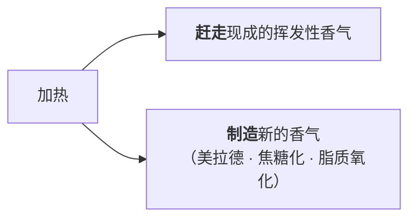
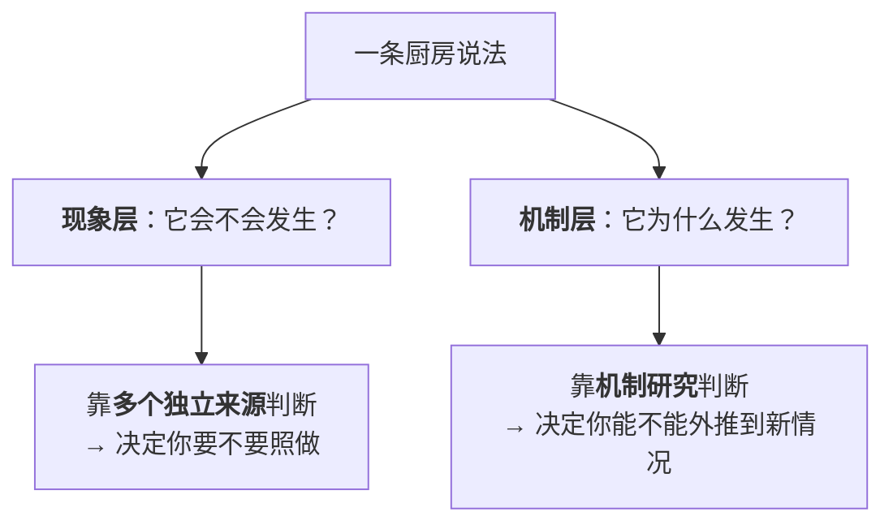

# 第 13 章 思考题参考答案

> 只记「问题 + 正确答案」。案例题给**完整推理链**。
> 涉及数字的地方，来源见[参考书目与出处登记](../standards.md)。

## Q1

**问**：什么是"厚味"？它的三个描述词是什么？它和"鲜"的关键区别在哪里？

**答**：

**定义**：**厚味**（kokumi）指一类物质带来的口腔感受——
这类物质**在起作用的浓度下本身不产生任何味道**，
却能**增强鲜、甜、咸以及脂肪感的强度**。

**三个描述词**：**厚度（thickness）、满口感（mouthfulness）、持续感（continuity）**。

**与"鲜"的关键区别**：

| | 鲜（umami） | 厚味（kokumi） |
|---|-----------|-------------|
| **是不是一种味道** | **是**。第五种基本味，有自己的受体（T1R1 + T1R3） | **不是**。它是一个**调制器**——本身无味 |
| **受体** | T1R1 + T1R3 | 主要是**钙敏感受体（CaSR）**（鸟氨酸另经 GPRC6A） |
| **单独存在时** | 你能尝到"鲜" | 你**什么也尝不到** |
| **作用方式** | 提供一个味觉信号 | **放大已有的信号**，并改变它的时间与空间特征 |

> **一个比喻（本书自拟）**：**鲜是音符，厚味是混响。**
> 没有音符，混响没东西可混；没有混响，音符听着"干"。

**⚠️ 一条必须标注的事**：本书采用的这套解释框架来自一篇 2023 年的文章，
作者自己明确写明"直接的受体层面相互作用仍有待阐明"——
**它是一个有说服力的框架，不是已经定论的机制。**

## Q2

**问**：厚味物质最早是从什么食材里发现的？哪些常见中式食材被综述列为厚味来源？

**答**：

**最早的发现**：**无臭的大蒜提取物**。

研究者从中分离出一种**本身没有气味也没有质地**的物质，
把它加进 **0.05% 味精 + 0.05% IMP** 的鲜味溶液后，
那杯溶液变得"更厚、更满口、更持久"。后来确认其中最典型的是**谷胱甘肽**。

**综述汇总的来源（挑与中式厨房相关的）**：

| 类别 | 具体例子 |
|------|---------|
| **葱蒜类** | 大蒜（谷胱甘肽）、洋葱的含硫成分 |
| **豆类与豆制品** | 菜豆的 γ-谷氨酰肽；大豆的 γ-Glu-Tyr、γ-Glu-Phe；**酱油**中的 γ-谷氨酰肽与多种肽 |
| **发酵食品** | **泡菜**（N-乳酰氨基酸、N-琥珀酰氨基酸）、发酵可可豆、泰国发酵淡水鱼、酵母提取物 |
| **奶酪** | 陈年高达奶酪的肽带来持久的满口感 |
| **长时间烹煮** | 综述提到**蜂蜜、陈年奶酪与"炖透的菜"**都具有这类复杂口腔感受 |

一项被引的研究还发现：**韩国酱油中 500~10000 Da 的肽组分同时增强了咸味与鲜味**。

> ## 这张表对中式厨房的意义
>
> **葱姜蒜爆锅、放酱油、放豆瓣豆豉、久炖——这四件事各自都在往"厚"这条线上加东西。**
>
> 它们过去被分别解释成"去腥""增香""提色""入味"，
> 而这里给出了一个**统一的解释**：它们在**搭一个能被增强的底**。
>
> ⚠️ **但要诚实**：这些研究多在**模型体系**里进行，
> "家常菜里放几瓣蒜能贡献多少厚味物质"本书**没有核到**，
> 所以这条只能用来**指导方向**，不能用来算量。

**利益冲突提示**：其中一篇综述的三位作者在研究进行时为味之素公司雇员、
研究由该公司资助（论文自行披露）。**本书照录这一披露，读者可据此调整对它的权重。**

## Q3

**问**：为什么本书说"味精不是万能增味剂"？这条结论的证据强度如何？为什么要标注它？

**答**：

**结论**：一篇 2023 年的文章提出——

> **在只有基本味的水溶液里加味精，不会增强也不会抑制任何味道，
> 因为溶液里根本没有厚味物质；
> 只有把味精加进复杂的食材体系里，已有的味道才会被增强。**

**厨房含义**：

| 场景 | 结果 |
|------|------|
| 一锅**白水**里放味精 | 得到"一杯有鲜味的水"——味精提供了自己的鲜，但没有东西被它增强 |
| 一锅**有葱蒜、有酱油、炖了很久**的菜里放一点 | 已有的味道被**整体抬起来**，出现"厚度与持续感" |

**证据强度**：⚠️ **这是作者提出的解释框架，不是已定论的机制。**

支持它的间接证据包括：厚味物质的存在与受体（CaSR）已被反复研究；
动物实验显示厚味物质能提高对鲜、甜、咸、脂肪的偏好；
一项实验显示某种蔬菜汤在加入 CaSR 拮抗剂后受偏好程度下降。

但作者自己写明：**除了甲硫基丙醛这一条之外，
味精与厚味物质之间、厚味物质与其他基本味受体之间的直接相互作用
"在味蕾的受体与细胞层面仍未被充分阐明"。**

**为什么要标注**：三个理由。

1. **本书的纪律**：区分事实 / 官方规定 / 惯例 / 传说四层，
   "作者提出的框架"属于**尚未定论**，必须标明；
2. **这条结论太好用，反而危险**。它一句话就解释了"味精要配着菜用"和"炖透的菜更厚"
   两件长期分开讲的事——**越是优雅的解释，越容易被当成定论传播**；
3. **标注不影响操作**。即使这个机制将来被修正，
   "往白水里加味精不会变成高汤"这个**操作层面的判断**仍然成立。

## Q4

**问**："香气一加热就跑"错在哪里？请给出本章的一手数据，以及这条数据的**两个限制**。

**答**：

**错在哪里**：它只描述了**一半**。加热同时在做两件事——

**一手数据**：一项 2025 年的研究测了同一体系在不同温度下顶空中的挥发物浓度：

> 加水后的模型体系里，**只有 3 种挥发物的浓度随温度升高而下降，
> 22 种随温度升高而上升**。

上升的那批包括**醛类**（3-甲基丁醛、辛醛、壬醛、己醛、苯甲醛）与**醇类**，
论文把它们归因于加热过程中的**脂质与蛋白质氧化**以及**美拉德反应**。

**两个限制**：

| # | 限制 | 为什么重要 |
|---|------|----------|
| ① | **测的是顶空浓度（释放量），不是总量** | 升温本身就会提高挥发物的释放。所以"浓度上升"里既有"新造出来的"，也有"本来就在、只是跑出来了"——**该研究没有把这两者分开** |
| ② | **只覆盖一个体系（酵母蛋白）** | 不能直接推广到所有食材。香菜和牛肉在加热时的行为不会一样 |

**正确的判据**：

> **不要问"这个香料怕不怕热"，要问"这股香是现成的还是要造出来的"。**

现成的（香菜、香油、葱花、鲜柠檬、现磨胡椒）→ 最后放；
造出来的（爆香的葱姜蒜、炒香的花椒、褐变香）→ 最早放并给温度；
**两者都要 → 放两次。**

## Q5

**问**：判断香料时机的正确问题是什么？请给出"现成的"和"造出来的"各三个中式例子。

**答**：

**正确的问题**：**"这股香是现成的（食材自带、挥发性），还是要靠加热造出来的？"**

**而不是**"这是不是香料""它耐不耐煮"。

| | 现成的 | 造出来的 |
|---|-------|---------|
| 例 1 | **香菜 / 葱花**——切开就有，一煮就没 | **爆香的葱姜蒜**——生的时候是辛辣冲味，受热后变成甜香焦香 |
| 例 2 | **香油 / 花椒油 / 辣椒油**——已经萃取好了 | **炒香的花椒、干辣椒、八角桂皮**——需要油与温度把成分带出来 |
| 例 3 | **现磨白胡椒 / 鲜柠檬汁 / 料酒的酒香** | **炒糖色、煎出的焦褐外壳**（第 7 章的美拉德与焦糖化） |

**"两者都有"的那一类（要放两次）**：

| 东西 | 早放那次 | 晚放那次 |
|------|---------|---------|
| **蒜** | 爆香（造出甜香） | 出锅撒生蒜末（现成的辛香） |
| **醋** | 给味（不挥发的酸留得住） | 给香（挥发性的醋香） |
| **花椒** | 整粒下油（造出麻与香） | 出锅撒花椒粉（现成的香） |
| **酱油** | 给味与上色 | 沿锅边淋或出锅点（给香）⚠️ 这条本书**未核到对照实验**，标为惯例 + 机制推理 |

> **"放两次"是本书第二部分最值钱的一个操作**——
> 它用一个动作同时拿到了"造出来的香"和"留下来的香"。

## Q6

**问**：油在香气这件事上扮演了哪两个角色？请分别说明机理。

**答**：

| 角色 | 机理 | 操作含义 |
|------|------|---------|
| **① 萃取剂（溶剂）** | **大多数香气分子在脂里比在水里更易溶** | **爆香就是把香气从食材里萃取到油里**。所以"干锅炒香料"和"用油爆香"在物理上不是一回事 |
| **② 缓释器（仓库）** | 在乳液里，**疏水性香气分子的释放量随脂肪含量增加而减少**——脂肪把它们"扣住"，释放变慢 | **有油的菜香得慢但久，清汤香得快但短**。这也是"香油最后淋"的第二重理由：它既给香，又兜住其他香 |

**一条被引的实验细节**：模型乳液的脂肪含量降低时，
**疏水化合物（庚-2-酮、丁酸乙酯）的释放减少**，
而**亲水化合物（丁二酮、短链醇）基本不受影响**。

> **这说明脂肪管的是"疏水那一半"香气**——水溶性的香气不归它管。

**顺带一条与第 6 章的连接**：同一篇研究还提到
**蛋白质会结合并"扣住"香气分子**，**直链淀粉的螺旋可以通过疏水作用形成香气包合物**。

> **所以勾了芡的汤，香气也会被扣掉一部分**——
> 这和第 10 章"增稠会让味觉强度下降"是两件不同的事，但方向一致：
> **芡打完之后，味和香都要重新确认。**

⚠️ **限制**：这些机理证据来自**乳液模型体系**，不是中式炒锅。
本书**只用方向，不给比例**。

## Q7

**问**（案例）：做一锅"香菇鸡汤"，希望它又鲜又香。

**答**：

**（a）按五问顺序排出加入顺序表**

先过一遍五问：

| 问题 | 这锅汤的答案 |
|------|----------|
| ① 有没有可被增强的底？ | **有**（鸡 + 香菇 + 久炖），所以鲜味调料会有效 |
| ② 鲜的两侧都有吗？ | **都有**：鸡（核苷酸侧）+ 干香菇（核苷酸侧）……⚠️ 等等——**两样都偏核苷酸侧**，**缺谷氨酸侧** |
| ③ 香是现成的还是造出来的？ | **两种都要**：炖出来的肉香 + 出锅时的葱香胡椒香 |
| ④ 有油吗？ | 鸡本身带油；如果用去皮鸡胸，**香会留不住** |
| ⑤ 后面还有什么吃掉香气？ | **长时间炖煮**——所以现成的香必须留到最后 |

**加入顺序表**：

| 阶段 | 加什么 | 属于哪条线 | 为什么这个时机 |
|------|-------|----------|------------|
| **备料** | 干香菇**提前泡发**，泡菇水留着 | 鲜（核苷酸侧）+ 溶出 | 呈味物质要有时间溶出（第 3 章） |
| **起锅（可选）** | 鸡块**先煎/炒上色**，姜片一起下油 | 造出来的香（第 7 章褐变）+ 爆香 | 这是唯一能造肉香的窗口，炖煮阶段造不出来 |
| **炖煮初** | 加水（含泡菇水）、香菇、葱段、姜 | 鲜 + 溶出 | 需要时间 |
| **炖煮中** | **补谷氨酸侧**：一小片海带，或少量酱油 | 鲜（协同的另一侧） | 弥补②发现的缺口；第 9 章的倒 U 形协同 |
| **出锅前** | 盐（定味）；如需鲜味调料，此时加 | 味觉 | 盐最后定（第 11 章）；味精怕酸碱、且需要底 |
| **出锅后** | 葱花、白胡椒粉、几滴香油 | 现成的香 | 极易挥发，必须最后 |

**（b）哪些东西要"放两次"**

| 东西 | 早的一次 | 晚的一次 | 为什么 |
|------|---------|---------|-------|
| **葱** | 葱段随炖（给味、去腥） | 葱花出锅撒（给香） | 一个现成、一个造出来/溶出 |
| **姜** | 姜片随炖 | （可选）出锅前姜丝 | 同上 |
| **胡椒** | （可选）整粒随炖 | 现磨粉出锅撒 | 磨过的粉挥发极快 |

**（c）不加盐让它更"够味"的几条路（第 10、11 章）**

| 路 | 具体做法 | 报告的量级 | 限制 |
|----|---------|---------|------|
| **一致的香气（鼻后）** | 出锅的葱花、白胡椒、香油；或一点酱油/虾皮 | 鼻后可达 **75%** 减钠（鼻前只到约 **13.60%**） | 香要"对得上"——咸香型 |
| **补鲜（换一类）** | 补**谷氨酸侧**：海带、少量酱油 | 鲜味最佳约 **24.25%** | 低—中盐时才有效 |
| **补厚味** | 蒜、洋葱；或延长炖煮时间 | ⚠️ 无量化数据 | 机理方向为主 |
| **一点酸** | 出锅前极少量醋或柠檬 | 柠檬酸使咸味察觉阈下降约 **56%** | 会压甜、压鲜——**别多** |

⚠️ **共同前提**：这一套只在**盐本来就不足**时管用（第 10 章第二条规则）。

**（d）勾薄芡会不会改变方案**

**会，改两处**：

1. **芡要在调味之前打完，然后重新尝**——
   增稠会让咸、酸、甜三种味觉强度**都显著下降**（第 10 章），
   而且**淀粉的直链螺旋还会扣住一部分香气分子**（本章 13.3）；
2. **现成的香要放在芡之后**——否则香气刚放进去就被芡"兜"住一部分。

**修订后的末段顺序**：**打芡 → 重新尝 → 定盐 → 关火 → 撒葱花胡椒淋香油。**

## Q8

**问**（案例）：爆炒菜出锅时厨房很香，端上桌吃却觉得"没什么香味"。

**答**：

**（a）至少两个可能的原因**

| # | 原因 | 判据 |
|---|------|------|
| ① | **现成的香放得太早，在锅里就跑光了** | 回想一下：香油、胡椒、香菜、蒜末是什么时候放的？如果是中途放的，那"厨房里的香"正是它们离开食物的证据 |
| ② | **这道菜的香气几乎全是"鼻前"的，鼻后没剩多少** | 做**捏鼻测试**（第 9 章）：捏鼻和松鼻差别小 = 食物里确实没剩多少挥发物 |
| ③ | **没有油来兜住香** | 减油的菜、或者用水汆/水煮为主的做法，疏水性香气留不住 |
| ④ | **菜放凉了** | 温度下降会降低挥发物的释放，同时第 9 章：低温下整体风味感受下降 |

**（b）分别对应的对策**

| 原因 | 对策 |
|------|------|
| ① 放太早 | **改成放两次**：早的那次给"造出来的香"，晚的那次给"现成的香" |
| ② 鼻后没剩 | **出锅后补一次**：香油、现磨胡椒、葱花、香菜——让它跟着食物进嘴 |
| ③ 没有油 | 出锅时淋一点香油/花椒油；它既是香气来源又是缓释载体 |
| ④ 凉了 | 趁热上桌；凉菜要调得更浓（第 9 章） |

**（c）哪条数据能解释"厨房里香 ≠ 吃起来香"**

减钠综述给出的对比最直接：

> **鼻后嗅觉**的相互作用能实现**高达 75%** 的减钠，
> 而**鼻前嗅觉**（隔着空气闻）最高只到约 **13.60%**。

**差了大约五倍。**

> **本质**：**"厨房里很香"意味着香气分子已经离开食物、进了空气。**
> 你闻到的那些，正是**你吃不到的那些**。
>
> **香气在食物里的时候才算数。**

## Q9

**问**（辨析）："肉香分子能直接增强鲜味"——判断证据强度。

**答**：⚠️ **现象有初步证据（两个来源同向），机制待确认。**

**几个来源、各是什么类型**：

| 来源 | 类型 | 内容 |
|------|------|------|
| **来源一**（2025 年，*Foods*） | **感官实验 + 分子动力学模拟** | 五种化合物（甲硫基丙醛、二甲基硫醚、D-柠檬烯、2,3-二甲基吡嗪、二甲基三硫醚）显著增强味精鲜味；**戴鼻夹（阻断鼻前通路）时增强依然存在**；模拟提示为对 T1R1/T1R3 的变构调节 |
| **来源二**（2023 年，*npj Science of Food*） | **综述中的复述** | **甲硫基丙醛**（常见于番茄与奶酪）**通过与人鲜味受体 T1R1 的跨膜结构域相互作用**显著增强对味精的响应 |

**两个来源在"甲硫基丙醛增强鲜味"这一点上同向**，所以现象这一层可以写。

**为什么把"现象"和"机制"分开标注**：

| 层次 | 状态 | 理由 |
|------|------|------|
| **现象**：这些化合物增强味精的鲜味 | ⚠️ **有初步证据** | 两个来源同向；但都不是大规模重复验证 |
| **机制**：它是"直接作用于受体"而非"跨模态整合" | **待确认** | ① 关键支持来自**分子动力学模拟**——模拟是假说生成工具，不是验证；② "鼻夹下仍存在"目前只有**单一研究**；③ 鼻夹只阻断鼻前，**鼻后通路仍然开着**，所以"排除跨模态"这个推论本身还需要更强的设计 |

> **本书为什么要这样拆**：因为这两层在厨房里的价值完全不同。
>
> - **现象层能直接用**：番茄 + 肉、酱油 + 香菇、豆豉 + 肉、土豆 + 炖肉
>   这些搭配同时满足"谷氨酸侧 + 核苷酸侧协同"与"含硫/吡嗪香气 + 鲜味物质"；
> - **机制层暂时不影响任何操作**——你不需要知道它是在受体上还是在大脑里发生的。
>
> **把没定论的东西说成定论，不会让你的菜更好吃，只会让你更难纠错。**

## Q10

**问**（辨析）："不吃味精就没吃过谷氨酸钠"——判断证据强度，并说明为什么强调"土耳其市场样本"。

**答**：❌ **这句话不成立——多数调味品里都有。**

**核到的检测数据**（一项对土耳其本地市场的检测研究）：

| 样品类别 | 谷氨酸钠含量 |
|---------|-----------|
| 调味料（seasonings） | **0.08 ~ 102.88 g/kg** |
| 酱汁（sauces） | **0.20 ~ 11.06 g/kg** |
| 风味料（flavors） | 0.37 ~ 3.81 g/kg |
| 被引研究中的鸡汤/牛肉汤块 | **7.2 ~ 14.6 g/kg** |

该研究还发现：**19 个样品在未标注含谷氨酸钠的情况下被检出**。

**另一条来自第 9 章的官方表述**：美国 FDA 指出
**含天然游离谷氨酸配料的产品不得标注"无味精"**——
因为**味精里的谷氨酸与食物蛋白消化产生的游离谷氨酸化学上相同**。

**为什么要强调"土耳其市场样本"**：

| 理由 | 说明 |
|------|------|
| **法规语境不同** | 该研究的判定基准是**土耳其食品法典**（上限 10 g/kg）。中国有自己的添加剂标准与标注要求，**判定口径不同** |
| **产品构成不同** | 土耳其市场上的调味料、酱汁类型与中国厨房里的酱油、豆瓣、蚝油、鸡精不是同一批东西 |
| **本书的纪律** | 引用数据必须写明**它是在什么条件下、对什么样本测的**。**把某国市场的检测结果说成"调味品普遍含多少"，就是把样本当总体** |

**所以本书只用它说明一件事**：

> **谷氨酸钠在工业调味品中普遍存在，而且可能不出现在配料表上。**

**不用它说明**：中国的产品含多少、你每天摄入多少、这对健康意味着什么——
**这些本书都没有核到，也不做评价（第 4 条纪律：不做医疗/营养治疗建议）。**

**本书的立场（重申）**：**用不用味精是口味与偏好问题，不是"天然 vs 化学"的问题。**

## Q11

**问**：本章写了一条阴性结果（口香糖暴露实验没做出联结学习效应）。本书为什么要写它？它改变了什么、没改变什么？

**答**：

**那项研究**：60 人，连续 5 天嚼含有特定气味的口香糖
（一种气味与蔗糖共同出现，另一种单独出现），每天三次，
用来分离"联结学习"与"单纯暴露"的效应。**结果：没有发现联结学习带来的效应。**

**本书为什么要写它**：

| 理由 | 说明 |
|------|------|
| **防止制造虚假的确定感** | 本章与第 10 章一共列了六七条"气味改变味觉"的阳性证据。**只挑阳性结果讲，读者会以为这是一个已经解决的问题** |
| **阴性结果在这个领域很少被看见** | 做不出结果的研究更难发表、更难被引用。**一本要求正确的书，有责任把它捞出来** |
| **本书的纪律** | 区分事实 / 官方规定 / 惯例 / 传说四层，而"科学界尚有争议"属于必须标出来的一层（第 9 章也这样处理过咸味受体与酸味受体） |

**它改变了什么**：

> **它改变的是"为什么"那一层**——
> 气味获得味觉特性的**形成机制**（先天？联结学习？受体层面的直接作用？）
> **目前没有定论**。至少在那项实验的设计下，联结学习没有被验证出来。

**它没有改变什么**：

> **它没有动摇"现象"那一层。**
>
> 气味增强味觉这个现象本身有多条**独立的一手证据**：
> 豆豉气味在 0.3% 盐水中增强咸味、酱油气味增强咸味、
> 沙丁鱼香气增强低盐奶酪的咸味、烟熏大蒜让水煮鸡少放 33% 盐。
> **这些是不同实验室、不同体系、不同测法做出来的。**

**一条通用的读文献方法（本书希望读者带走的）**：

> **现象层确定 + 机制层不确定 = 可以照做，但不要随便外推。**
>
> 具体到本章：**你可以放心用"一致的香气去补咸"**（现象层扎实），
> 但**不要据此推断"任何气味搭配都能训练出来"**（机制层没定论）。
