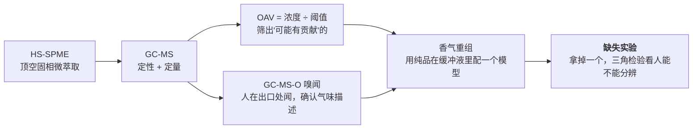

# 第 19 章 思考题参考答案 · 去腥增香的机理

> 只记「问题 + 正确答案」。案例题给完整推理链。
> 数值与出处见[参考书目与出处登记](../standards.md)与第 19 章的「本章依据」。

## Q1 · "腥"的三个来源分别是什么？为什么对策互不通用？

| 来源 | 典型分子 | 它是怎么进来的 |
|------|---------|-------------|
| **①环境富集** | **土臭素、2-甲基异莰醇（2-MIB）** | 水里的放线菌与蓝藻代谢产生，**经鳃与皮肤进入鱼体、富集在肉里** |
| **②脂质氧化** | 己醛、壬醛、(E,Z)-2,6-壬二烯醛、(E,E)-2,4-癸二烯醛、**1-辛烯-3-醇** | 不饱和脂肪酸被金属离子、血红素、光、氧、脂氧合酶引发的**自由基链式反应**降解 |
| **③含氮物降解** | **三甲胺**、二甲胺、甲胺 | 氧化三甲胺（TMAO）分解，**主要发生在腐败过程中** |

**对策不通用的原因**：

- **①在肉里**，既不在表面也不是反应产物——**洗不掉、泡不掉、抗氧化也没用**，
  只能靠**掩盖与增香**（或者干脆换做法、换食材）；
- **②是一个正在进行的反应**——所以对策是**从源头拦**（新鲜、低温、少暴露、抗氧化、别复热），
  而不是事后补救；
- **③是新鲜度的指示**——它出现意味着**食物的状态本身有问题**，
  这时候要判断的是"还能不能吃"，**不是"怎么盖住"**。

**一句话**：三种腥分别对应"**它本来就在里面**""**它正在生成**""**它已经坏了**"，
这是三种完全不同的处境。

## Q2 · 一手研究用什么方法确认"关键腥味物"？为什么缺失实验更有说服力？

**方法链条**（分子感官科学的标准路子）：

**为什么缺失实验更有说服力**：

1. **"检出了什么"只说明它在**——不说明人闻不闻得到它；
2. **OAV 高也只是"可能重要"**——OAV 是浓度除以阈值，
   它假设各成分**互不影响**，而现实中气味之间会互相增强与掩盖；
3. **缺失实验是唯一一个直接问"人"的环节**：
   把某个成分从重组模型里**拿掉**，如果评价员**分辨不出来**，
   那它就不是关键成分；**分辨得出来**，它才是。

**这项研究里缺失实验带来的两条具体收获**：

- 拿掉 (E,Z)-2,6-壬二烯醛与壬醛，**腥味强度极显著下降**（p < 0.01）——它们是主力；
- 拿掉 1-辛烯-3-醇，**下降的是"蘑菇味"和"土味"**，不是"腥味"——
  说明它的贡献在另一个维度；
- 而在黄鳍鲷里**拿掉 1-辛烯-3-醇没有显著影响**——**同一个分子在不同鱼里地位不同**。

**对本书的意义**：这套方法是"**厨房传说该怎么被检验**"的一个范例。
下次看到"某某成分是腥味的元凶"，可以问一句：**做过缺失实验吗？**

## Q3 · 为什么"腥 = 三甲胺"在新鲜鱼上不成立？这如何改变处理顺序？

**两层证据**：

1. **它没进名单**——在那项用缺失实验验证过的研究里，
   鲫鱼与黄鳍鲷的关键腥味物**全部是脂质氧化产物**
   （(E,Z)-2,6-壬二烯醛 OAV 267、壬醛 85、1-辛烯-3-醇 43、2,4-癸二烯醛 42、己醛 41、癸醛 14），
   **三甲胺不在其中**——它在实验里的身份是**训练评价员时"腥"这个描述词的参照标准**；
2. **它的时间点不对**——同篇引言写明：TMAO 分解出的三甲胺等胺类，
   是"**腐败**水产品中令人不快的鱼腥味的主要来源"。

**改变处理顺序的地方**：

| 旧顺序（把腥当成一件事） | 新顺序（先分诊） |
|---------------------|---------------|
| 闻到腥 → 加料酒、姜、葱 | 闻到腥 → **先判断是哪一类** |
| | **冲鼻/氨味** → ⚠️ 新鲜度问题，**先判断能不能吃**，不要想着盖 |
| | **蘑菇/青草/油耗味** → 脂质氧化 → 抗氧化、短时酸腌或酒腌、用油做、别复热 |
| | **土霉味** → 环境富集 → **洗不掉**，改用重口味做法 |

**最实际的一条**：这条结论把"去腥"的主战场**从锅里挪到了冰箱与市场**——
因为②是"正在生成"的，越早干预越有效；而①和③根本不是调料能解决的。

⚠️ **限制**：这是**一项研究、两种鱼、新鲜状态**。
所以本书写的是"**在新鲜鱼上，主力是脂质氧化产物**"，
**不写死**"三甲胺不重要"。

## Q4 · 为什么"去腥的第一战场在冰箱里"？三条依据

1. **腥味主力是"正在生成"的氧化产物**——
   脂质氧化是自由基介导的**链式反应**，由金属离子（铜、铁）、血红素蛋白、光、氧、
   内源脂氧合酶引发。**只要食材存在，它就在进行**；
2. **加热会加剧，复热更加剧**——
   鸭肉在 90 °C / 100 °C / 105 °C 处理以及**复热**后脂质氧化程度上升，
   积累壬醛、(E)-2-辛烯醛、己醛等；牛肉复热后同样积累醛类。
   这就是第 18 章的**回热异味（WOF）**；
3. **冷却速度本身就是一个变量**——
   宰后 **−35 °C 快速冷却**的羊肉，比 4 °C 或 −20 °C 冷却的**1-辛烯-3-醇更低**
   （作者归因为延缓 ATP 水解、减慢蛋白降解与脂肪氧化）。⚠️ 这条是**转引**。

**推论**：等到下锅才想"放多少料酒"，你处理的是**已经生成的分子**；
而买新鲜的、尽快降温、减少暴露、不反复加热，处理的是**生成速率**。
**后者的杠杆大得多。**

## Q5 · 酒的三条路径，哪两条核到了一手？为什么第三条不写成结论？

| 路径 | 内容 | 证据 |
|------|------|------|
| **①抑制氧化** | 黄酒**抑制不饱和脂肪酸的过度氧化**，减少 1-辛烯-3-醇、辛醛等异味物；文中**异味物含量与不饱和脂肪酸含量显著负相关** | ✅ **一手**（红烧肉风味组学） |
| **③直接添香** | 黄酒直接贡献**苯乙醇、香茅醛**等花果香 | ✅ **一手**（同上） |
| **②溶解并挥发带走** | 乙醇溶解异味成分并随挥发带走 | ⚠️ **未核到一手实验** |

**为什么②不写成结论**：

- 红烧肉研究里的这句话是**研究者提出的机制解释**，不是被单独验证的对象；
- 稻花鱼研究讨论里那句"乙醇可以溶解并去除三甲胺与挥发性硫化物"，
  **是转引**，本书**没有核到它的原始实验**；
- 按本书纪律（关键结论要两个独立来源 + 一手优先），
  **一条机制解释 + 一条转引 ≠ 结论**。

**但酒有一手对照支持它"有效"**（只是机理不明）：
稻花鲤用 **5% 料酒水溶液浸泡 30 分钟**后，
电子鼻的**硫化物、甲基、醇醛酮与氮氧化物四个传感器响应显著下降**，鲜味增强。

⚠️ **两条限制必须记住**：

1. 那是**浸泡 30 分钟**，不是"炒菜时沿锅边淋一勺"——后者本书未核到任何对照；
2. 同一研究观察到**去腥处理后挥发性物质总量反而更高**——
   所以它更像"**减少几类 + 加进另几类**"，**不是纯粹的带走**。

## Q6 · 柑橘汁腌鱼：酸做了哪两件事？代价的数字是什么？

**做的两件事**（GC-IMS，26 种挥发物）：

1. **把醛压下去**——己醛、3-甲基丁醛、丙醛、2-甲基丙醛等的信号在柑橘组**下降**，
   ⚠️ 而**纯水对照组反而上升**；
2. **加进好闻的**——**果香酯**（丁酸乙酯等，西柚组明显）与
   **柑橘萜烯**（柠檬烯、γ-萜品烯、β-蒎烯，柠檬组明显）。

**所以酸是"减少 + 添香"，不是"中和"。**

**代价的具体数字**（4 °C 腌 1 小时，柠檬 10% / 橙 15% / 西柚 15%）：

| 组 | pH | 持水力 | 亮度 L\* / ΔE | 感官总分 |
|----|----|-------|-------------|---------|
| 鲜样 F | <7 | **76.83%** | — | — |
| 纯水 C | 7.21 | 70.71% | — | 与 F 无明显差别 |
| 橙 O | 6.94 | — | 温和 | **70.5** |
| 西柚 G | 6.79 | 72.69% | 温和 | **70.0** |
| **柠檬 L** | **6.63** | **67.73%** | **58.30 / 10.47** | **66.5** |

外加电子舌：柠檬组**酸、涩、苦上升，咸度下降**。

**机制**：pH 靠近肌原纤维蛋白的**等电点**，净电荷与静电排斥下降，结合的水变少
——这正是第 8、17 章那条 U 形曲线的左半边。

**可迁移规则**：**酸要"够到把醛压下去"，但不要"够到把肉泡白"。**
**发白就是明确的停止信号。**

## Q7 · 【案例】冷冻巴沙鱼柳，"纸板味 + 淡淡土味"，想清蒸

**（a）两股味各自最可能是什么**：

| 味 | 归类 | 来源 |
|----|------|------|
| **纸板味 / 油耗味** | **②脂质氧化产物** | 冻藏期间不饱和脂肪酸持续氧化（冷冻减慢但不停止）；解冻与复热还会推一步。这就是**回热异味**那一类的醛 |
| **淡淡土味** | **①环境富集**（巴沙鱼是淡水养殖） | 土臭素 / 2-甲基异莰醇，经鳃与皮肤富集在肉里 |

⚠️ **没有冲鼻氨味 = 暂时不是③胺类/新鲜度问题**。这一条是**先判断的**，因为它决定"还做不做"。

**（b）清蒸对这两股味是有利还是不利？**

**都不利，而且是本章里最不宽容的做法**：

| 路径 | 清蒸能用上吗 |
|------|-----------|
| ①掩盖 | ⚠️ 只能靠葱姜与最后那勺豉油——**量很小** |
| ②热挥发 / 热溶解 | ⚠️ **几乎用不上**：蒸没有液态水把异味物带走（第 18 章：蒸没有液态水、不允许浸出），温度也只到 100 °C |
| ③酸碱盐 | ⚠️ 传统清蒸不腌酸 |
| ④抗氧化 | ⚠️ 用不上 |
| ⑤酒 | ✅ 可以用（但通常只是铺几片姜、淋点酒） |
| ⑥美拉德 | ❌ **完全用不上**——清蒸不上色，没有褐变香气 |

> **一句话**：**清蒸是"把食材本身暴露出来"的做法**，
> 它靠的是食材足够好，而不是靠技法去救。

**（c）如果坚持清蒸，加什么、什么时候加、证据等级**：

| 做法 | 走哪条路径 | 时机 | 证据等级 |
|------|----------|------|---------|
| **蒸前用少量料酒 + 姜片腌 15~30 分钟（冷藏）** | ⑤酒 | 蒸之前 | ✅ 有一手对照（5% 料酒水溶液 30 分钟，电子鼻硫化物与氮氧化物响应显著下降）。⚠️ 体系是鲤鱼浸泡，非巴沙鱼 |
| **蒸前用很淡的柑橘汁或番茄汁短腌** | ③酸 | 蒸之前，**短时** | ✅ 有一手对照（醛类信号下降）。⚠️ **别用柠檬直接泡**——一手数据里最酸那组分数最低、还发白 |
| **蒸好后倒掉盘里的水，再淋热油与豉油** | ②热挥发 + ①掩盖 | 蒸之后 | ⚠️ 惯例 + 机制推理（盘里的水含溶出物；热油带香——第 13 章"香要放两次"） |
| **葱丝香菜最后放** | ①掩盖 + 现成的香 | **最后** | ✅ 机理已核（第 13 章：现成的香遇热就跑） |
| ❌ 多放盐或糖 | — | — | ❌ **味觉盖不住嗅觉**（第 10、15 章） |

**（d）如果允许换做法，换成什么？**

**换成红烧、干烧、香煎或豆瓣味型。** 理由是它们**同时打开了另外三条路径**：

1. **②热挥发/热溶解**——煎与炸能有效降低鱼腥（综述转引），红烧的汤汁也带走一部分；
2. **⑥美拉德**——褐变产生的杂环化合物**掩盖异味并提供肉香**（第 7 章 + 本章）；
3. **①掩盖**——豆瓣、香辛料的量级比清蒸大得多
   （第 14 章的一手缺项实验：去掉郫县豆瓣后鲜味与可接受度只有 4.25）。

> **这道题的核心**：**做法的选择本身就是去腥手段**。
> "什么鱼配什么做法"不是习俗，是**你手上有几条路径可用**的问题。
> **好鱼才有资格清蒸。**

## Q8 · 【案例】"淋两勺料酒"的爆炒腰花还是很腥

**（a）至少四个可能原因**：

| 可能原因 | 对应本章哪一节 |
|---------|-------------|
| **腰花本身的异味以胺类与硫化物为主，而且量大**——内脏的异味强度远高于肌肉 | 19.1 分诊；19.4 路径③（一手转引用的正是**牛肝**与内脏） |
| **没有经过浸泡这一步**——已核到的内脏脱腥证据是**1.0% 盐水泡 60 分钟**，不是"炒的时候淋酒" | 19.7 "泡的是溶质" |
| **"淋料酒"这个操作本身没有对照证据**——已核到的料酒研究都是**浸泡 30 分钟**；"沿锅边淋"自第 14 章起就是缺口 | 19.5 的限制说明 |
| **爆炒时间太短，热挥发路径没走完**——高温促挥发需要时间与接触；同时爆炒时食材**平均表面温度低于 100 °C**（第 7 章已核） | 19.4 路径② |
| **掩盖的量不够**——综述自陈"调味掩盖效果有限，需与其他技术结合" | 19.4 路径① |
| **原料新鲜度本来就不够** | 19.2、19.3 |

**（b）哪几个不是料酒能解决的？**

- **新鲜度**——料酒解决不了，这是③胺类，属于"还能不能吃"的问题；
- **内脏本身的异味基数大**——单靠一个手段量级不够，综述明说要**组合**；
- **操作方式不对**（淋 vs 泡）——这不是"料酒有没有用"的问题，
  是"**你没有给它起作用的条件**"（浓度、接触时间、温度）。

**（c）先改哪一步，为什么？**

**先改"加一步浸泡"，因为它是唯一有一手证据、且零风险的改动。**

具体：

1. **改成下锅前浸泡**（冷藏），而不是炒的时候淋——
   已核到的两条对照（**1.0% 盐水 60 分钟**泡内脏、**5% 料酒水溶液 30 分钟**泡鱼）
   都是浸泡；
2. **一次只改一个**（第 15 章纪律）。先改这一步，下次再考虑加酸或换味型；
3. 如果浸泡之后仍然腥，**再往上加路径**：换成重口味做法（⑥美拉德 + ①掩盖）
   或增加抗氧化型香辛料。

⚠️ **必须说清楚的两点**：

- 上面那两条浓度与时长是**文献里的实验条件**（牛肝、鲤鱼），
  **本书不把它们当成家庭配方**，只用它们说明"**浸泡这条路径是有证据的**"；
- **泡过生内脏的水一律倒掉**，不要当酱汁用（美国 FDA 口径）。

## Q9 · 【辨析】"加醋能中和腥味"——两件不同的事

**必须区分的两句话**：

| 说法 | 作用时间点 | 本书核到了什么 | 判定 |
|------|----------|-------------|------|
| **"酸抑制三甲胺的生成"** | **在它产生之前** | 综述转引：乳酸、过氧乙酸、山梨酸等有机酸通过**抑制微生物活性**或**螯合金属离子**，抑制三甲胺的生成（乳酸处理鸡腿肉显著降低气味强度） | ✅ 有转引支持 |
| **"酸中和已经存在的三甲胺（成盐 → 不挥发）"** | **在它产生之后** | ⚠️ **本书未核到任何一手食品科学实验** | ⚠️ 缺口，不写成结论 |

**为什么这个区分对家庭厨房有实际后果**：

1. **如果起作用的是"抑制生成"**，那么加酸的正确时机是**早**——
   比如买回来就处理、腌着放冰箱。但在家庭尺度上，
   **你下锅前十分钟加的醋，来不及去抑制三天前就发生的腐败**——
   **这条路径对家庭的意义有限**；
2. **如果"中和已存在的"成立**（未核到），那么**临下锅加也有用**；
3. **而已核到的那条一手对照**（柑橘汁腌鱼）**给了第三种解释**：
   醛类信号下降 + 果香酯与萜烯增加——即"**减少 + 添香**"，
   与"中和胺类"完全不是一回事（对付的甚至不是同一类分子）。

**所以正确的表述是**：

> **"加酸对新鲜食材的腥味有一手证据支持，但它对付的主要是醛类，而且伴随添香；
> '中和三甲胺'这条具体机理本书没有核到。"**

**并且要带上代价**：酸过头时持水力最低（67.73% vs 鲜样 76.83%）、
发白（ΔE 10.47）、酸涩苦上升，**感官总分反而最低**。

## Q10 · 【辨析】"料酒能把腥味带走"——为什么只写一半？怎么验证另一半？

**本书写的那一半**（已核到一手）：

1. 黄酒**抑制不饱和脂肪酸的过度氧化**，从而**减少**了 1-辛烯-3-醇、辛醛等异味物
   （异味物含量与不饱和脂肪酸含量**显著负相关**）；
2. 黄酒**直接贡献**苯乙醇、香茅醛等花果香；
3. 一手对照里，**5% 料酒水溶液浸泡 30 分钟**确实让电子鼻的
   硫化物、甲基、醇醛酮、氮氧化物四个传感器响应**显著下降**。

**本书不写的那一半**："乙醇溶解腥味物质并随挥发把它们一起带走"。
理由：这句话在已核到的两处分别是**研究者的机制解释**与**转引**，
**没有核到任何直接验证它的实验**。按纪律不升级为结论。

**还有一条反向线索**：同一项料酒研究观察到
**去腥处理后挥发性物质总量反而升高**——
如果"带走"是主机制，总量应该下降才对。
这提示实际发生的更像是"**减少几类 + 加进另几类 + 重新分配**"。

**要验证它需要什么样的实验设计**（把缺失实验的思路套过来）：

| 设计要点 | 为什么需要 |
|---------|----------|
| **分离"乙醇"与"酒里其他成分"** | 料酒里有糖、氨基酸、酯、香气物。至少要有**等浓度纯乙醇水溶液组**与**去乙醇的料酒组** |
| **同时测"食材里剩下多少"与"跑到空气里多少"** | "带走"意味着**食材里减少 + 气相里增加**。只测顶空**证明不了转移** |
| **设不加热的对照** | 区分"溶解到液体里被倒掉"与"随乙醇挥发带走" |
| **固定接触时间、温度、液固比** | 已核到的有效条件是浸泡 30 分钟；"淋一勺"的接触时间是秒级 |
| **感官端做缺失/三角检验** | 仪器测出来的差别，**人不一定分辨得出**——这是本章 Q2 的教训 |
| **重复与盲测** | 单次单人的厨房观察不算验证 |

**顺带回答一个常见反问**："那我以后还放不放料酒？"
**放**——它有两条已核到的作用。但**别把'带走'当原理去推新情况**
（比如别据此推出"酒放得越多带走越多"）。

## Q11 · 为什么说"葱姜蒜是在盖，不是在去"？盖有什么用、什么时候盖不住？

**"盖"的定位**：综述把它列为**物理去腥里的"调味掩盖"**，
并明确写：**这是最传统最简单的方式，但效果有限**，
需要与其他技术结合才能达到更好的效果。

**已核到的"盖"确实有效的证据**：

- 多种香辛料提取物（姜、蒜、白芷、茴香、迷迭香、肉豆蔻、豆蔻、桂皮、八角、香叶）
  **都能显著降低鲢鱼的异味强度**，其中**迷迭香提取物效果最好**，归因于**多酚**；
- **0.2% 八角**炖鸭腿显著降低己醛、庚醛、1-辛烯-3-醇、2-戊基呋喃，并带来花香草本气息。

**注意这里有个微妙之处**：上面这些"掩盖剂"里的多酚，
**同时也在走路径④抗氧化**（清除自由基、螯合金属离子，从源头减少醛的生成）。
所以**"盖"和"减少"在同一把香辛料里是混在一起的**——
这也是为什么单纯问"葱姜蒜有没有用"会问不出答案。

**"盖不住"的三种情况**：

| 情况 | 为什么盖不住 |
|------|-----------|
| **食材已经变质**（冲鼻、氨味） | 这是**安全问题**，不是风味问题。⚠️ **掩盖在这里是危险的**——它让你吃下本不该吃的东西 |
| **环境富集的土腥味很重** | 2-MIB 与土臭素的阈值极低，而且**在肉里**；已核到己醛与 1-辛烯-3-醇还会**增强**它的土味 |
| **异味物浓度远高于香辛料能提供的对冲** | 综述自陈"效果有限"；内脏、老禽、久放的水产都属于这一类 |

**还有一条来自第 10、13 章的限制**：

> **气味改写感知有两个前提：一致（congruency）与鼻后（retronasal）。**
> 厨房里闻着很香 ≠ 吃起来盖住了。
> 所以"闻着不腥了"不能作为"盖住了"的判据——**要吃一口才算**。

**正确的用法**：把"盖"当成**组合拳里的一拳**，
配合②热挥发、④抗氧化、⑥美拉德一起用；
**不要指望它单独解决问题，更不要用它来对付变质。**
