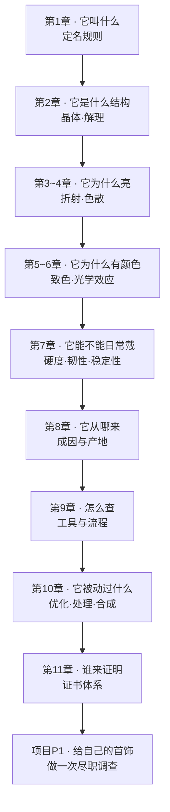

# 第一部分 · 宝石学地基

> **这一部分要建立的能力**：一块石头摆在你面前，你知道**该问什么问题**、
> **用什么手段回答**、以及**什么时候必须交给实验室**。

## 为什么从"地基"开始，而不是直接讲钻石

因为珠宝市场上真正让人吃亏的，很少是"4C 没挑好"这种细节，而是几个**结构性**的错误：

- 把**合成**的当天然的买了（价格差可以是两个数量级）；
- 把**处理过**的当未处理的买了（翡翠 B 货、铅玻璃充填红宝石、染色玛瑙）；
- 把**另一种便宜品种**当贵品种买了（石英岩当翡翠、锆石当钻石、蛇纹石当和田玉）；
- 被**产地**故事溢价（"南非钻石"——国标根本不允许这样定名）；
- 以为**有证书就等于没问题**（证书只对送检那一件、只对做了的检测项负责）。

这五类问题，全部属于宝石学的基础层面，和 4C 无关。也就是说：**先把地基打好，
就能挡住绝大多数系统性的坑**；4C 之类的细节，是在你已经确定"这是什么东西"之后才谈的优化问题。

## 这一部分的知识链条

顺序不是随意排的：**先有名称与分类的框架**（第 1 章），才知道后面每一项性质是用来
回答哪个问题的；**先懂性质**（第 2~8 章），才理解鉴定手段为什么有效、为什么有局限
（第 9 章）；**懂了鉴定**，才看得懂处理与合成的识别逻辑（第 10 章）
和证书上每一行字的分量（第 11 章）。

## 读这一部分的方式

每章都是「**概念 → 思考题 → 实操**」，并且每章都有一个 🔎 **柜台前的用处** 小节
——把刚学的原理压缩成一句可执行的判断。如果你时间有限，至少把每章的 🔎 小节读完。

**实操分两档**，因为你手上不一定有石头和工具：

- **🅐 无器具版**：看电商详情页、翻自己的首饰盒、逛店只用眼和手、查权威图库——随时能做；
- **🅑 有器具版**：需要 10 倍放大镜、强光手电、电子秤等。

> **第一部分需要的器具清单（可选，总价不高）**：10 倍宝石放大镜（三片式消色差）、
> 小型强光手电（白光、可聚光）、0.01 g 精度电子秤、镊子、白色和黑色底衬、
> 一副偏光片（拆废旧眼镜或买片状）。查尔斯滤色镜和二色镜属于进阶，第 9 章再说要不要买。
> **完全不买也能读完这一部分**——所有实操都有 🅐 档。

## 本部分章节

| 章 | 主题 | 状态 |
|----|------|------|
| 1 | [什么是宝石：定义、分类与国标定名规则](01-what-is-gemstone.md) | ✅ |
| 2 | [晶体与结构：晶系、解理、断口、双晶](02-crystal-structure.md) | ✅ |
| 3 | [光学 ①：折射率、全内反射与临界角](03-optics-refraction.md) | ✅ |
| 4 | [光学 ②：双折射、色散与多色性](04-optics-birefringence.md) | ✅ |
| 5 | [颜色的成因：自色、他色与色心](05-color-origin.md) | ✅ |
| 6 | [特殊光学效应：星光、猫眼、变彩、晕彩、变色](06-optical-phenomena.md) | ✅ |
| 7 | [耐久性：硬度、韧性与稳定性](07-durability.md) | ✅ |
| 8 | [成因与产地](08-origin.md) | ✅ |
| 9 | [鉴定工具与流程](09-instruments.md) | ✅ |
| 10 | [优化、处理与合成](10-treatment-synthetic.md) | ✅ |
| 11 | [证书体系](11-certificates.md) | ✅ |
| P1 | 🛠 [项目：给自己的一件首饰做尽职调查](project-P1-due-diligence.md) | ✅ |
| — | 📋 [第一部分小结（速查）](summary.md) | ✅ |
