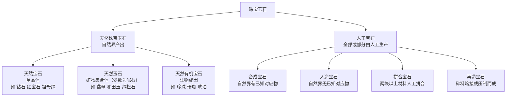
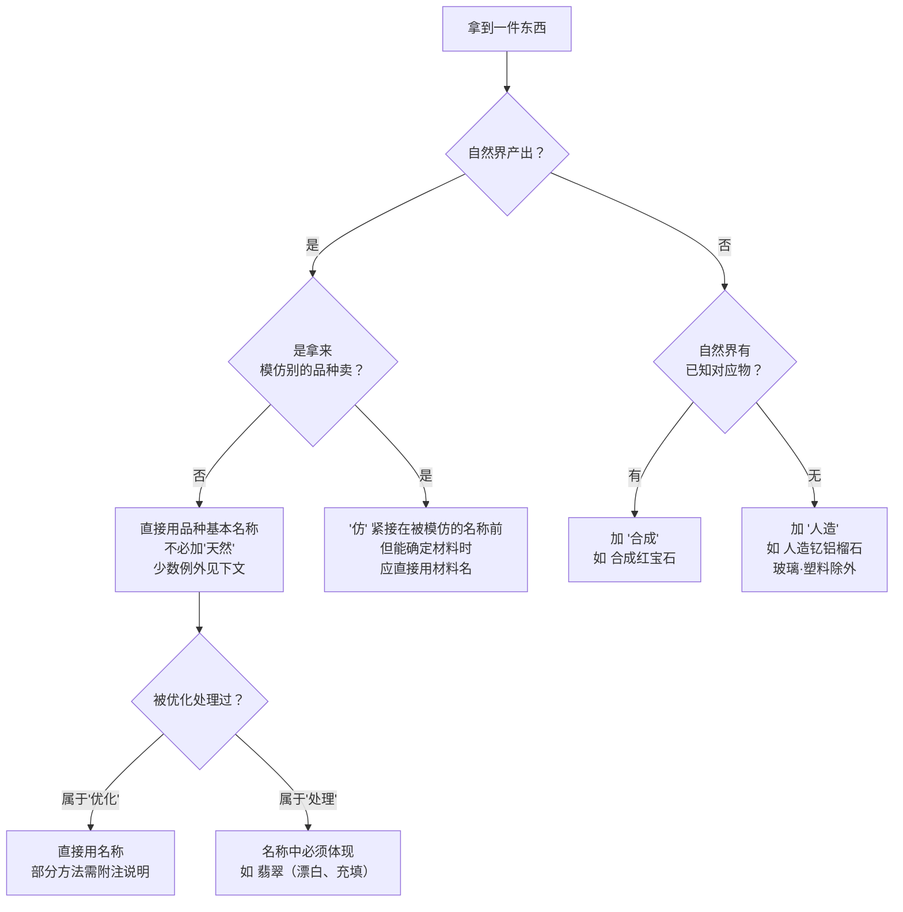

# 第 1 章 什么是宝石：定义、分类与国标定名规则

> **本章目标**：读懂一个名称能告诉你多少信息。学完这一章，
> 看到 `合成蓝宝石`、`翡翠（漂白、充填）`、`再造琥珀`、`仿钻石`、`石英岩玉（染色）`
> 这几种写法，你能立刻说出它们分别是什么东西、大致处于哪个价值档位。
>
> 这是全书**性价比最高**的一章：不需要任何工具，也不需要眼力，
> 只需要认字——但它挡住的坑，比后面所有技术章节加起来还多。

## 1.1 为什么第一章讲名字

先看一组真实存在的商品名称，它们经常出现在同一个柜台里：

| 标签写的 | 实际是什么 | 价值量级 |
|---------|-----------|---------|
| 蓝宝石 | 天然刚玉，可能经过热处理（这是被接受的优化） | 高 |
| 合成蓝宝石 | 实验室长出来的刚玉，成分结构与天然**相同** | 极低（材料成本级） |
| 蓝宝石（扩散处理） | 天然刚玉，但颜色是人工渗进去的 | 低 |
| 仿蓝宝石 | 只是**看起来像**，材料可能是玻璃 | 几乎为零 |

四个名称，字面上都带"蓝宝石"三个字，价格可以差两个数量级。

而这里有个关键事实：**名称是这条链上唯一受法律约束的信息**。

销售的口头介绍、宣传册的形容词、包装上的品牌故事，都可以模糊；
但商品的**定名**必须遵守国家标准 GB/T 16552《珠宝玉石 名称》[^1]——
它规定了每一类珠宝玉石该怎么叫、哪些叫法明令禁止。
不合规的定名不是"表述不严谨"，而是不合标准。

> **所以柜台前最有效的一个动作**：不要问"这是什么"（回答可以随口说），
> 而是**要求看标签和证书上的完整名称，逐字读**。名称里每一个字——
> "合成""处理""仿""再造"、乃至括号——都是法定信息，都值钱。

[^1]: GB/T 16552《珠宝玉石 名称》，现行版本与要点见[标准与文献索引](../../reference/standards.md)。本章引用的条款号（如 §5.1.2.1）以正式文本为准。

## 1.2 宝石凭什么值钱

在讲分类之前，先回答一个更朴素的问题：一块石头凭什么比另一块贵一万倍？

传统宝石学给出三个要素，我加上第四个：

| 要素 | 含义 | 反例（说明它为什么必要） |
|------|------|------------------------|
| **美观** | 颜色、透明度、光泽、特殊光学效应 | 再稀有的矿物，长得不好看也进不了首饰 |
| **耐久** | 硬度、韧性、化学稳定性（见第 7 章） | 有些矿物很美，但一碰就碎、见光就褪色，只能进标本柜 |
| **稀少** | 供给稀缺 | 石英很美也够耐久，但太多了 |
| **需求** | 有人愿意为它付钱 | 坦桑石储量极小、颜色出色，但价格远低于蓝宝石 |

前三个是**物质属性**，第四个是**社会属性**——而且它常常是决定性的。

> **诚实说明（本书会反复出现的态度）**：宝石的价格里，物质属性只解释了一部分。
> 钻石的定价史、翡翠在中国市场的地位、"帕拉伊巴"这个名字的溢价，
> 背后都有强大的营销与文化建构。本书会在第 12 章（钻石神话）、
> 第 26 章（帕拉伊巴命名之争）、第 41 章（渠道价差）里把这层讲透。
> 现在只需记住：**"贵"不等于"稀有"，"稀有"不等于"好"**。

顺便厘清一个常被误用的词：

> **"半宝石"不是行业术语，而是国标明确禁止的定名**（GB/T 16552 §5.1.2.1 列举的
> "易混淆或含混不清的名称"里就有它）。市场上说"半宝石"，通常想表达"除钻石红蓝宝祖母绿以外的彩宝"
> ——这个分类既没有标准依据，也没有价格依据（顶级尖晶石比普通蓝宝石贵得多）。
> 听到这个词，它更多说明**卖家的专业程度**，而不是石头的档位。

## 1.3 国标怎么分类

GB/T 16552 把所有珠宝玉石[^2]分成两大支：**天然**的与**人工**的。

这个划分不是学术洁癖，它对应着完全不同的**价值逻辑**：

- **天然宝石**[^3]是单晶体，评价看颜色/净度/切工/重量（第二、三部分）；
- **天然玉石**[^4]是矿物集合体，所以有"种、水"这类**集合体特有**的概念
  （单晶体宝石不会讲"水头"，第四部分）；
- **天然有机宝石**[^5]含有机成分，所以硬度低、怕酸怕干、有寿命问题（珍珠会老化）；
- **人工宝石**[^6]的价值基本等于材料成本 + 加工费，**没有稀缺性溢价**——
  这就是为什么它必须被标明：不标明就构成了对价格的欺骗。

还有一个横跨两支的概念：**仿宝石**[^7]。它不是一个材料类别，而是一种**用途描述**
——"用来模仿另一种珠宝玉石"。所以玻璃可以是仿宝石，天然的红色石榴石当红宝石卖也是仿宝石。

[^2]: [珠宝玉石](../../glossary.md#gem-materials)（gem materials）——注意"珠宝玉石""宝石""玉""玉石"这四个词本身**不能**用来给一件商品定名。
[^3]: [天然宝石](../../glossary.md#natural-gemstone)（natural gemstone）。
[^4]: [天然玉石](../../glossary.md#natural-jade)（natural jade / ornamental stone）。
[^5]: [天然有机宝石](../../glossary.md#natural-organic-gem)（natural organic gem material）。
[^6]: [人工宝石](../../glossary.md#artificial-product)（artificial product）——是四个子类的总称。
[^7]: [仿宝石](../../glossary.md#imitation)（imitation）。

## 1.4 定名的四个关键词

定名规则条文不少，但你在柜台前真正要认的只有**四个关键词**。
它们出现或不出现，决定了这件东西属于哪一格：

### 关键词 ①「合成」：它是真宝石，但不是天然的

**合成宝石**[^8]的化学成分、晶体结构、物理性质与天然对应物**基本相同**。
合成红宝石就是刚玉，硬度一样是 9，折射率一样是 1.762~1.770
（见[常数表](../../reference/constants.md)）。

所以"合成宝石是假的"这句话是不准确的——**它是真的宝石，只是不是天然形成的**。
问题从来不在于它假，而在于：它的**稀缺性溢价为零**，
所以不标明"合成"就等于把材料成本的东西按天然价格卖。

国标对合成宝石的定名有几条禁令（§5.1.3.1），都是针对市场上的规避手法：

| 不允许 | 例子 | 为什么禁 |
|--------|------|---------|
| 用厂商名代替"合成" | `查塔姆祖母绿`（Chatham 是合成祖母绿的著名生产商） | 消费者看不出这是合成 |
| 用合成方法代替"合成" | 用工艺名（如水热法、助熔剂法）直接当名称 | 同上，工艺名对消费者无意义 |
| 用含混名称 | `鲁宾石`、`红刚玉`、`合成品` | 刻意回避"合成红宝石"四个字 |

> **培育钻石**[^9]是这条规则最重要的当代应用。国标术语是"**合成钻石**"，
> GB/T 16552 的第 1 号修改单明确注明"合成钻石"又称"培育钻石"。
> 两个名字都合法，但**都必须出现**——只写"钻石"是不行的。第 18 章会讲它的技术与定价。

### 关键词 ②「人造」：自然界压根没有这东西

**人造宝石**[^10]指自然界**无已知对应物**的人工材料，如合成立方氧化锆（CZ）、
人造钇铝榴石（YAG）。定名要加"人造"，但 `玻璃`、`塑料` 两个词本身已经足够清楚，不必加。

同样禁止用含混或暗示天然的名称——国标举的例子是 `奥地利钻石`
（市场上把奥地利产的水晶玻璃/CZ 制品叫"奥地利钻""水钻"）。

**"合成"与"人造"的区别，一句话记住**：自然界**有**对应物的叫合成（合成红宝石），
**没有**对应物的叫人造（人造钇铝榴石）。这不是文字游戏——它决定了这块材料
能不能被拿来冒充天然品种。

### 关键词 ③「再造」「拼合」：不是整块

- **再造宝石**[^11]：碎料熔接/压制成整块，如 `再造琥珀`（压制琥珀）、`再造绿松石`。
  定名加"再造"二字。
- **拼合宝石**[^12]：两块以上材料粘在一起，从台面看不出来。
  定名要**逐层写出各层材料**，最后加"拼合石"三字。
  经典手法是"薄薄一片真的 + 下面一大块便宜的"——从正面看颜色完美。

### 关键词 ④「仿」：只保证像，不保证是什么

**仿宝石**[^13]的定名规则有三条要记住：

1. "仿"字必须**紧接**在被模仿的名称前（`仿钻石`，而不是"钻石（仿）"）；
2. `仿宝石` 三个字**不能单独**作为名称使用；
3. **能确定具体材料时，应当直接用材料名定名**——能写 `合成立方氧化锆` 就不该写 `仿钻石`。

第 3 条是这套规则的精神所在：**"仿"是一个信息量很低的词**，它只告诉你"不是真的"，
却不告诉你"到底是什么"。所以看到"仿"，正确的反应是继续追问：**那它是什么材料？**

[^8]: [合成宝石](../../glossary.md#synthetic)（synthetic gemstone）。
[^9]: [培育钻石](../../glossary.md#lgd)（laboratory-grown diamond, LGD）。
[^10]: [人造宝石](../../glossary.md#artificial-gemstone)（artificial gemstone）。
[^11]: [再造宝石](../../glossary.md#reconstructed)（reconstructed stone）。
[^12]: [拼合宝石](../../glossary.md#composite)（composite / assembled stone）。
[^13]: 同前，[仿宝石](../../glossary.md#imitation)。

## 1.5 「优化」与「处理」：国标画的那条线

除切磨抛光之外，一切改善外观、耐久性或可用性的手段，统称**优化处理**[^14]。
国标把它劈成两半，而这条线**直接对应价格**：

| | **优化**[^15] | **处理**[^16] |
|---|---|---|
| 定义 | 传统的、**已被广泛接受**的方法 | 非传统的、**尚未被广泛接受**的方法 |
| 定名 | **直接用宝石名称**，名称里看不出来 | **必须在名称中体现出来** |
| 附注 | 部分方法国标要求在质量文件里附注说明 | 可进一步附注具体方法与程度 |
| 典型例子 | 红蓝宝石的热处理 | 翡翠的漂白充填、蓝宝石的扩散处理、染色、辐照改色 |
| 对价格 | 基本不折价（已是行业常态） | **大幅折价**，价值体系完全不同 |

处理的表示方法（§5.4.2.2）在市场上你会看到几种等效形态：

- 名称后括号注明**具体方法**：`翡翠（漂白、充填）`、`蓝宝石（扩散处理）`
- 名称后括号注明**"处理"**二字：`翡翠（处理）`
- 名称前直接写方法：`染色石英岩玉`、`扩散处理蓝宝石`

> **柜台前最关键的一眼**：看名称里有没有**括号**、有没有"处理"字样、
> 有没有"染色/充填/漂白/扩散/辐照"这类动词。
> 有，就是"处理"档；没有，才是常规档。
>
> ⚠️ **但反过来不成立**：名称干净不等于没被动过手脚——它只说明
> "没有被检出属于'处理'类的手段"。可能做过属于"优化"的处理（如热处理），
> 也可能是**送检项目里没包含**这一项（第 11 章）。

这条线本身也有争议，需要诚实说明：

> **"优化 vs 处理"的边界是**约定**，不是物理事实**。它随行业共识变化：
> 一种手段用得久了、稳定了、被普遍接受了，就可能从"处理"移到"优化"。
> 而且**中国国标的划法与国际实验室的表述并不完全一致**——国际报告一般直接列出
> "检测到的处理"（indications of treatment），不做"优化/处理"的二分。
> 所以同一颗石头，国内证书和国外报告的措辞可能不同，**这不必然意味着某一方错**。
> 第 10、11 章会详细对比。

[^14]: [优化处理](../../glossary.md#enhancement-treatment)（enhancement and treatment）——总称。
[^15]: [优化](../../glossary.md#enhancement)（enhancement）。
[^16]: [处理](../../glossary.md#treatment)（treatment）。

## 1.6 国标明令禁止的名称（这张表值得背）

下面每一条都是 GB/T 16552 明确列举的**不允许**的定名。
它们不是随便挑的——每一条都对应一种真实存在的市场手法。

| 不允许的写法 | 为什么禁 | 合规的写法 |
|-------------|---------|-----------|
| `南非钻石`、`缅甸蓝宝石` | **产地不参与定名**（§5.1.2.1、§5.1.2.3） | `钻石`、`蓝宝石`；产地若经检测可另行说明 |
| `半宝石`、`蓝晶`、`绿宝石` | 易混淆、含混不清 | 用确定的品种名，如 `海蓝宝石`、`碧玺` |
| `红宝石尖晶石`、`变石蓝宝石` | 不得用两种及以上天然宝石名组合定名（`变石猫眼` 是唯一例外） | 是哪个就写哪个 |
| `鲁宾石`、`红刚玉`、`合成品` | 合成宝石不得用含混名称回避"合成" | `合成红宝石` |
| `查塔姆祖母绿` | 合成宝石不得用生产厂/制造商名定名 | `合成祖母绿` |
| `奥地利钻石`、`水钻` | 人造宝石不得用易混淆名称 | `玻璃`、`合成立方氧化锆` |
| `玉观音`（作为鉴定名称） | 天然玉石**不得用雕琢形状定名**（§5.1.2.2） | `翡翠` + 饰品名称（依 QB/T 1689） |
| `马来玉`、`澳洲玉`（单独使用） | 商贸名称不得单独使用 | `石英岩玉（染色）`；商贸名可作附注 |
| 只写 `钻石` 卖培育钻 | 合成必须标明 | `合成钻石` / `培育钻石` |

有两条**反直觉**的规则，特别容易被市场利用：

> **① 带地名的玉石名称，不代表产地。**
> 国标附录 A 里的天然玉石基本名称中，带地名的那些（如 `和田玉`、`独山玉`、`岫玉`）
> **不具有产地含义**——它们是**品种名/矿物名**。所以一块俄罗斯产的透闪石玉，
> 定名为"和田玉"是**合规的**，不是造假。第 32 章会专门讲这个坑。
>
> **② 市面上合法叫"珍珠"的，绝大多数是养殖珍珠。**
> 国标规定"养殖珍珠"**可简称"珍珠"**；而真正的天然珍珠必须写成
> `天然珍珠`、`天然海水珍珠`、`天然淡水珍珠`。
> 也就是说——**看到"珍珠"要理解为养殖，看到"天然珍珠"才是天然的**。
> 这跟其他品种"不必加天然"的规则正好相反，因为在珍珠这里，
> "天然/养殖"是价格的主导因素。第 34 章展开。

## 1.7 商贸名称与"二名法"

市场上大量流行叫法（"泰山玉""藏银""水晶钻"）既不是矿物名也不是国标名称。
现行国标的处理方式是：**商贸名称**[^17]**不得单独使用**，
但允许在质量文件中以"商贸名称：×××"的形式**附注**——业内称为"二名法"。

举例：山东产的蛇纹石玉，正名应是 `蛇纹石玉`，可在证书上附注"商贸名称：泰山玉"。

这条规则给你一个**很好用的判据**：

> 如果一件商品**只**给得出商贸名称，给不出国标名称，那么它大概率
> ①属于低价材料，或②被处理过，或③卖家自己也不清楚。
> 这时候正确的问题是：**"证书上的名称怎么写？"**——而不是继续讨论那个商贸名。

[^17]: [商贸名称](../../glossary.md#trade-name)（trade name）。

## 1.8 常见说法辨析

按本书约定，标注**证据强度**：有共识 / 有争议 / 缺乏证据 / 明确错误。

| 说法 | 判定 | 说明 |
|------|------|------|
| "合成宝石就是假宝石" | **明确错误** | 成分与结构和天然品相同，是真宝石。问题在于必须标明、且无稀缺性溢价 |
| "培育钻石不算钻石" | **明确错误** | 材料上就是钻石；国标称"合成钻石"，第 1 号修改单注明又称"培育钻石"。价值差异是市场问题，不是材料问题 |
| "半宝石是个专业分类" | **明确错误** | 国标明令禁止的含混名称，也无价格依据（顶级尖晶石远贵于普通蓝宝石） |
| "南非钻石质量更好" | **缺乏证据 + 定名违规** | 产地不参与钻石定名；钻石的品质由 4C 决定，与产地无关 |
| "俄料和田玉是假和田玉" | **明确错误** | "和田玉"是品种名不具产地含义，俄料透闪石玉定名和田玉合规。**产地与品质是两个独立问题**（第 32 章） |
| "有证书就不会有问题" | **明确错误** | 证书只对送检那一件、只对做了的检测项负责，且不证明价格合理（第 11 章、[证书核对清单](../../forms/certificate-checklist.md)） |
| "热处理的红宝石是次品" | **有争议但接近有共识** | 热处理属"优化"、是行业常态，绝大多数市售红蓝宝都经过；**未经热处理（"无烧"）会有显著溢价**，但那是稀缺性溢价，不等于"有烧就是次品"（第 22 章） |
| "名称干净就说明没动过手脚" | **明确错误** | 只说明未检出"处理"类手段；可能有"优化"，也可能是未检测该项目 |

## 1.9 🔎 柜台前的用处

把这一章压缩成 5 个动作，任何柜台前都能用：

1. **要求看完整名称**（标签 + 证书），**逐字读**，不要听口头介绍；
2. **扫四个关键词**：`合成`、`人造`、`再造`/`拼合`、`仿`——出现任何一个，价值逻辑立刻改变；
3. **看有没有括号或"处理"字样**，以及"染色/充填/漂白/扩散/辐照"这类动词；
4. **听到商贸名称就追问国标名称**（"证书上写的是什么？"）；
5. **听到产地当卖点时，先分清**：这是检测结论（可能另附说明），
   还是被写进了名称里（那就不合规）。

> 这五个动作全部**不需要任何工具、不需要眼力**，却能挡掉市场上最常见的一批系统性问题。
> 后面十章讲的是"当名称没问题时，怎么进一步判断"。

## 1.10 思考题

1. 一枚戒指标签写着 `蓝宝石（处理）`，另一枚写着 `合成蓝宝石`。
   两者的**材料**分别是什么？如果只考虑材料的稀缺性，哪一枚更可能贵一些？为什么这个比较其实不好下结论？
2. 为什么国标要求"合成宝石"不能用生产厂商的名字定名（如 `查塔姆祖母绿`）？
   这条禁令针对的是哪一种具体的市场行为？
3. "自然界有已知对应物"这个判据，为什么能把**合成**与**人造**分开？
   请解释：为什么这个区分对消费者是有实际意义的，而不只是术语洁癖。
4. 国标规定"养殖珍珠可简称珍珠"，而其他品种"不必加天然"。
   这两条规则合在一起，会导致同一个词"珍珠"和"蓝宝石"的默认含义完全不同。
   请说明：看到 `珍珠` 和看到 `蓝宝石` 时，你各自应该默认它是什么？
5. **【案例】** 直播间一条链接写着：
   *"缅甸天然A货翡翠手镯，冰种飘花，证书齐全，商贸名马来玉，特价 388 元包邮"*。
   请指出这段描述里**至少四处**与定名规则或常识矛盾的地方，并说明你会怎么追问。
6. **【案例】** 朋友花 8000 元买了一枚戒指，证书上名称为 `红宝石`，
   备注写着"经热处理"。他觉得被骗了，因为"热处理就是造假"。
   请判断：这张证书的写法是否合规？他是否被骗了？你会怎么向他解释？
7. **【辨识】** 去[权威图库索引](../../reference/gallery.md)里的 GIA Gem Encyclopedia，
   分别找到蓝宝石（sapphire）与坦桑石（tanzanite）的图片与描述。
   在**不看名称**的情况下，试着说出你能观察到的差异；然后读描述，
   看看哪些差异是真实的品种差异、哪些只是拍摄与个体差异。这个练习的目的是让你亲身体会：
   **靠图片辨识品种的可靠性有多低**。

> 📖 **参考答案**（想清楚再看）：[Q1](../../qa/01-what-is-gemstone-qa.md#q1) ·
> [Q2](../../qa/01-what-is-gemstone-qa.md#q2) · [Q3](../../qa/01-what-is-gemstone-qa.md#q3) ·
> [Q4](../../qa/01-what-is-gemstone-qa.md#q4) · [Q5](../../qa/01-what-is-gemstone-qa.md#q5) ·
> [Q6](../../qa/01-what-is-gemstone-qa.md#q6) · [Q7](../../qa/01-what-is-gemstone-qa.md#q7)

## 1.11 本章实操

本章的实操**不需要任何工具**，所以 🅐 档就是主菜。

### 🅐 无器具版 · 任务一：审自己的首饰盒

把家里所有首饰的**标签、发票、证书**找出来（很多人会发现根本找不到），逐件填写
[宝石观察记录表](../../forms/stone-observation.md)的"基本信息"部分，重点抄下**完整名称**。

然后回答三个问题：

| 问题 | 你的答案 |
|------|---------|
| 有几件你根本不知道它的国标名称？ | |
| 有几件名称里出现了本章的四个关键词（合成/人造/再造·拼合/仿）？ | |
| 有几件的名称里有括号或"处理"字样？ | |

> 这个练习最常见的结果是：**大部分人的大部分首饰，都说不出国标名称**。
> 这不丢人——它说明我们过去买东西时，从没把注意力放在唯一受约束的那条信息上。

### 🅐 无器具版 · 任务二：抓 10 条不合规的商品描述

去任意电商平台或直播间，搜"翡翠""蓝宝石""和田玉""琥珀"，
按本章 §1.6 的表找出 **10 条**不合规或可疑的名称，填进下表：

| # | 平台上的原文（照抄） | 违反了哪条 | 合规写法应该是 | 我会怎么追问 |
|---|-------------------|-----------|--------------|------------|
| 1 | | | | |
| 2 | | | | |
| … | | | | |

> **提示**：最容易抓到的四类是——把产地写进名称、只给商贸名称、
> 用形状/雕工代替品种名、以及**把"处理"字样藏在详情页最下方的小字里**
> （这种情况名称本身可能合规，但展示方式在规避——记下来，这是第 42 章"话术识别"的素材）。

### 🅐 无器具版 · 任务三：读一张真证书

找一张自己或家人手上的珠宝证书（没有的话，用电商详情页里展示的证书照片），
按[证书核对清单](../../forms/certificate-checklist.md)走完**第一步和第二步**，
特别注意第 6 项"名称怎么写的"。

> 如果是电商详情页的证书照片：试着去出具方官网输编号核验。
> **很多时候你会发现编号查不到、或者查到的参数与图片不一致**——那本身就是最重要的发现。

### 🅑 有器具版 · 任务四：一次"名称—实物"对照

如果你手上正好有一件带证书的首饰，以及一支 10 倍放大镜：
先只看证书名称，写下"根据名称，我**预期**在放大镜下看到什么"
（例如名称含"充填"，就应能看到充填痕迹或异常光泽差），然后再看实物，记录是否吻合。

| 证书名称 | 由名称推出的**预期特征** | 实际观察到的 | 是否吻合 |
|---------|----------------------|------------|---------|
| | | | |

> **注意措辞纪律**：这个练习的目的是训练"从名称推预期"的能力，
> **不是让你自己下鉴定结论**。观察与名称不吻合时，正确的动作是送检，不是断言。

---

**下一章**：第 2 章 晶体与结构——为什么钻石能被劈开、为什么有些宝石不能超声波清洗。
名称解决了"它是什么"，接下来要回答"它为什么是这样"。
