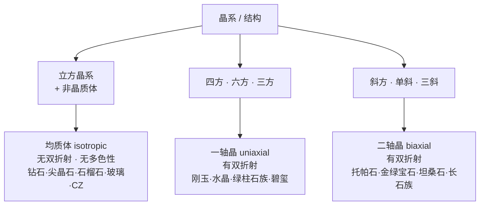
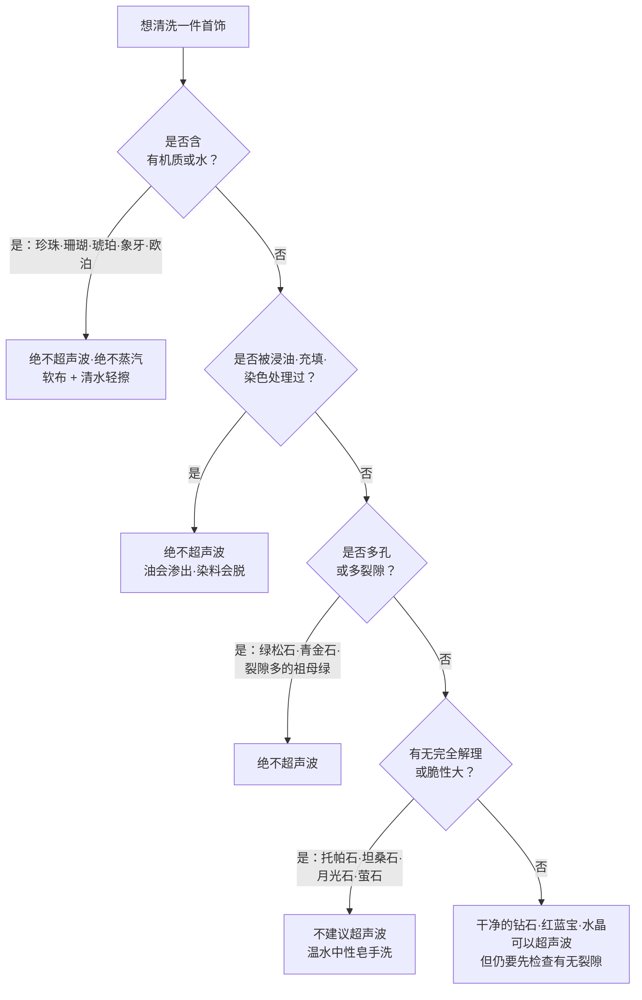

# 第 2 章 晶体与结构：晶系、解理、断口、双晶

> **本章目标**：理解宝石的**内部结构**如何决定它的行为——为什么硬度 10 的钻石能被一榔头敲开、
> 为什么托帕石绝不能进超声波清洗机、为什么祖母绿总被切成那个方方正正的样子。
>
> 这一章是全书的**结构层地基**：第 3~4 章的光学（有没有双折射、有没有多色性）、
> 第 7 章的耐久性、第五部分的镶嵌与保养，全部要回到本章的晶系与解理。

## 2.1 三个实际问题

先摆三个真实会遇到的问题。它们的答案都在"内部结构"里，而不在硬度表里：

1. 朋友的钻戒磕到门框，**钻石掉了一小块**。钻石不是最硬的吗？
2. 同一台超声波清洗机，洗钻戒没事，洗**托帕石**戒指却让石头裂了。为什么？
3. 为什么**祖母绿**几乎总是长方形带切角（就叫"祖母绿型切割"），
   而钻石那么多形状里最经典的是圆形？

这三个问题分别对应本章的三个概念：**解理**、**解理 + 稳定性**、**晶形与出成率**。

## 2.2 晶体是什么，以及哪些宝石不是晶体

**晶体**是内部原子/离子按三维**周期性规则排列**的固体。这种规则排列（格子构造）
带来了宝石学关心的一切：固定的化学成分范围、固定的物理常数、
**方向性**（同一块材料在不同方向上性质不同）。

与之相对的是**非晶质体**[^1]：原子排列无规则。珠宝里的非晶质体不多但都很常见——
**欧泊、琥珀、玻璃、天然玻璃**。它们有一个共同特点：

> **非晶质体没有解理、没有双折射、没有多色性**——因为这三样都需要"方向"，
> 而非晶质体内部各个方向都一样。这条规则在鉴定里非常好用：
> 如果一颗号称是"某种晶体宝石"的石头完全没有双折射，要么它是均质体（立方晶系），
> 要么它根本不是晶体（玻璃）。

还要接上第 1 章的分类：**单晶体**（天然宝石，如一颗刚玉）与**矿物集合体**
（天然玉石，如翡翠由无数硬玉小晶体交织而成）在结构上是两回事。这个差别决定了：

| | 单晶体（如刚玉） | 集合体（如翡翠） |
|---|---|---|
| 有没有整体的解理方向 | **有**（整块沿同一方向裂） | **没有**（无数小晶体方向各异，裂纹走不远） |
| 韧性 | 相对低 | **高**（这是翡翠能做成薄手镯的原因） |
| 评价语言 | 颜色/净度/切工/重量 | 种、水、色、工（集合体特有） |

> **这解释了一个反直觉现象**：翡翠的硬度（6.5~7）明显低于红宝石（9），
> 但翡翠的**韧性**在珠宝材料里名列前茅。硬度和韧性是两个独立的性质，第 7 章展开。

[^1]: [非晶质体](../../glossary.md#amorphous)（amorphous）。

## 2.3 七大晶系与光性：一张表管到第 4 章

晶系[^2]按对称性划分。宝石学常用七个（有些晶体学体系把三方并入六方，只分六个——
**这不是矛盾，只是分类粒度不同**）。

真正要记住的是：**晶系决定光性**[^3]，而光性决定了这颗石头有没有双折射、能不能有多色性。

展开成表（**这张表建议记住，后面反复用**）：

| 晶系 | 光性 | 代表宝石 | 结构带来的实际后果 |
|------|------|---------|------------------|
| 立方 | 均质体 | 钻石、尖晶石、石榴石族、萤石 | 无双折射（放大镜看不到棱线重影）；钻石与萤石都有八面体解理 |
| 四方 | 一轴晶 | 锆石 | 双折射率 0.059 极大，棱线重影明显 |
| 六方 | 一轴晶 | 绿柱石族（祖母绿、海蓝宝）、磷灰石 | 六方柱状晶形 → 决定了祖母绿的切割方式（§2.6） |
| 三方 | 一轴晶 | 刚玉（红蓝宝）、水晶、碧玺、方解石 | 刚玉**无解理**但有裂开；碧玺柱面常见纵纹 |
| 斜方 | 二轴晶 | 托帕石、金绿宝石、坦桑石、橄榄石 | 托帕石一组完全解理 → 超声波禁忌 |
| 单斜 | 二轴晶 | 翡翠（硬玉）、透闪石（和田玉）、月光石 | 前两者以集合体形式产出，所以韧性好 |
| 三斜 | 二轴晶 | 拉长石、绿松石、蓝晶石 | 长石族两组解理，月光石较脆 |

> **怎么用这张表**：它把"品种"和"能不能测出双折射"连起来了。
> 比如有人卖你一颗"祖母绿"，绿柱石族属六方晶系、一轴晶、**必然有双折射**
> （0.005~0.009，虽小但存在）；如果实测完全没有双折射，那它可能是**玻璃**
> 或**立方晶系的绿色石榴石**——问题立刻定位到具体几个可能性上。

[^2]: [晶系](../../glossary.md#crystal-system)（crystal system）。
[^3]: [光性](../../glossary.md#optic-character)（optic character）——均质体 / 一轴晶 / 二轴晶。

## 2.4 解理：结构自带的弱面（不是瑕疵）

**解理**[^4]是晶体沿特定结晶方向**规则**裂开的性质。关键在于理解它的成因：

晶格里不同方向上的化学键强度不同。某些平面上的键特别弱，
外力一来就沿着这个面整齐地"劈开"——像木头顺着纹理裂，而不是随机碎。

**所以解理是结构的固有属性，不是这颗石头的缺陷**。所有钻石都有八面体解理，
不存在"没有解理的钻石"。

| 宝石 | 解理情况 | 实际后果 |
|------|---------|---------|
| 钻石 | **四组八面体解理** | 硬度 10，但方向不对的一击就能崩边；镶嵌要保护腰棱与尖端 |
| 托帕石 | **一组完全的底面解理** | 最经典的"怕超声波"宝石；受热与震动都可能沿解理面裂开 |
| 萤石 | 四组完全解理 | 硬度只有 4，极脆，基本只做标本与雕件 |
| 长石族（月光石） | 两组解理 | 较脆，不适合做经常磕碰的戒面 |
| 刚玉（红蓝宝） | **无解理**，但有**裂开** | 见 §2.5——"无解理"不等于"不怕磕" |
| 翡翠 | 集合体，**无整体解理方向** | 韧性极好，可做薄手镯 |

> **柜台前的一个真实场景**：销售说"钻石是最硬的，你随便戴不用担心"。
> 这句话前半句对、后半句错。**硬度 = 抗刻划**（钻石确实划不花），
> **韧性 = 抗破裂**（钻石因为解理，韧性只算中等）。
> 正确的建议是：日常戴没问题，但**别磕硬物、别在做重活时戴**，
> 而且**尖端多的切工**（如公主方、马眼）比圆钻更需要保护角部（第 17 章）。

### 解理 vs 断口：怎么现场分辨

**断口**[^5]是**不沿**结晶方向的不规则破裂。最常见的是**贝壳状断口**——
像玻璃碎裂时那种弧形波纹。

| | 解理面 | 断口 |
|---|---|---|
| 形态 | **平整、光亮**，像镜面或台阶 | **弯曲粗糙**，常见弧形波纹 |
| 方向 | 固定（与晶格相关） | 随机 |
| 在放大镜下 | 可见反光的平面，有时有阶梯状痕 | 无固定取向的雾状/丝状面 |

> **这个区分有实用价值**：在一颗石头上看到**平整反光的破裂面**，
> 说明它有解理——这缩小了品种范围，也提示这颗石头在这个方向上很脆弱。
> 看到贝壳状断口，则更可能是玻璃、欧泊、或无解理的品种。

[^4]: [解理](../../glossary.md#cleavage)（cleavage）。
[^5]: [断口](../../glossary.md#fracture)（fracture）。

## 2.5 裂开与双晶：红宝石的特殊情况

刚玉（红宝石与蓝宝石）**没有解理**——这常被市场简化成"红蓝宝很结实，不怕磕"。
但刚玉有**裂开**[^6]：沿**双晶面**[^7]或包裹体密集面的规则破裂。

成因不同（生长缺陷，不是晶格固有弱面），但**后果相似**：有一个方向特别容易裂。

**聚片双晶**（多层平行连生）在刚玉里很常见，它有双重意义：

1. 它是**天然的证据之一**——某些合成工艺不会产生这种双晶结构（第 10 章）；
2. 它同时是**裂开的来源**——所以"无解理"不等于"随便磕"。

> **诚实说明**：这类"看起来矛盾"的知识点在宝石学里很多。
> 处理方式是回到成因：**解理**由晶格决定、每颗都有；
> **裂开**由生长历史决定、因个体而异。
> 所以对刚玉，正确的说法是"**这颗**有没有明显双晶/裂开"，而不是"刚玉怕不怕磕"。

[^6]: [裂开](../../glossary.md#parting)（parting）。
[^7]: [双晶](../../glossary.md#twinning)（twinning）。

## 2.6 晶形怎么决定切工与价格

回答 §2.1 的第三个问题。宝石长成什么形状，直接决定了切磨师能怎么下刀，
而这最终体现在**出成率**（原石重量转化为成品的比例）和**价格**上。

| 品种 | 典型晶形 | 常见切工 | 因果关系 |
|------|---------|---------|---------|
| 绿柱石（祖母绿） | **六方柱状**（长条形） | **祖母绿型**（阶梯式长方形带切角） | 长条晶形切长方形出成率最高；祖母绿脆且多裂，**切角是为了保护尖端**（尖角最容易崩） |
| 金刚石（钻石） | **八面体**（两个金字塔底对底） | 圆钻型 | 一颗八面体沿腰部分开，**正好能出两颗圆钻**，出成率高 |
| 坦桑石 | 柱状 | 多种，但方向受限 | 多色性极强，切磨师必须选**颜色最好的方向朝上**——为此常牺牲重量（第 4 章） |
| 碧玺 | 长柱状，常有纵纹 | 长方形、椭圆 | 长条形状 + 双色/多色分区，决定了它常做成长条切割 |

> **由此得出一个选购判断**：当某个品种出现**不常见的形状**时，
> 往往意味着"原石被迫这样切"——可能为了避开裂隙、可能为了保重量、
> 可能为了绕开颜色不均。这本身不是问题，但**它是一个值得追问的信号**：
> "为什么这颗切成这样？"答案常常在净度或颜色分布上。

## 2.7 清洗与保养：本章最实用的产出

现在可以回答 §2.1 的第二个问题，并给出一张可直接用的表。

超声波清洗机的原理是**液体中的高频振动产生微气泡冲击**。这个过程会：

- 让**已有的裂隙、解理面扩展**（振动的机械作用）；
- 使**充填物、浸油松动或渗出**（第 10 章讲的处理宝石全都怕这个）；
- 配合加热时，让**含水/含有机质的材料失水开裂**。

整理成清单。**下面这份清单以 GIA 的公开指引为基准**（见[标准与文献索引](../../reference/standards.md)
的"网络权威资料"一节），比多数店铺的口头建议严格：

| 档位 | 品种 | 原因 |
|------|------|------|
| **绝对禁止**超声波与蒸汽 | 珍珠、珊瑚、琥珀、象牙、砗磲、欧泊、绿松石、青金石、孔雀石 | 含有机质/含水/多孔——失水开裂、吸入污液、表面损伤 |
| **绝对禁止**（因为被处理过） | 浸油/充填的祖母绿、翡翠 B 货、任何染色件、裂隙充填的钻石与红宝石 | 振动与热使充填物渗出、染料脱色——**清洗直接毁掉商品价值** |
| **GIA 明确列为不应超声波** | 坦桑石、长石类（月光石、日光石）、萤石、堇青石、紫锂辉石、青金石、孔雀石、欧泊、**托帕石**、绿松石、**锆石** | 对**热与温度变化**敏感，或解理发育、脆性大——**无论是否经过处理都不应洗** |
| **同样不应超声波**（易被忽略） | **星光红宝石、星光蓝宝石**；**任何经热处理增色**的宝石 | 星光宝石内部有大量定向针状包裹体（第 6 章），是天然的应力集中面；热处理增色件对温度变化敏感 |
| **可以，但先检查有无裂隙** | 干净的钻石、未充填的透明红蓝宝、水晶类（紫水晶/烟晶/玛瑙）、石榴石、**A 货翡翠**、虎眼石 | 这几类在行业清单里属"一般安全"；但**有明显裂隙或大内含物时，振动仍可能让它扩展**，透明红蓝宝也要留意 |

> **GIA 给的一条兜底原则值得照抄**：**不确定这颗石头有没有被处理过时，就假设它被处理过**，
> 用最温和的方式洗。这条原则在珠宝保养里几乎永远是对的。

> **一条容易被忽略的风险**：很多店铺提供"免费超声波清洗"服务。
> 如果你的祖母绿是浸油的（**这是行业常态**，属于"优化"）、
> 或者翡翠是 B 货、或者钻石做过裂隙充填，一次免费清洗就可能让外观明显变差。
> **正确做法是主动告知材质，或者干脆拒绝**——第 43 章还会细讲保养。

## 2.8 常见说法辨析

| 说法 | 判定 | 说明 |
|------|------|------|
| "钻石最硬，所以打不碎" | **明确错误** | 硬度是抗刻划，解理是抗破裂的弱面。钻石有四组八面体解理，方向对了一击即崩 |
| "有解理说明这颗石头有瑕疵" | **明确错误** | 解理是**品种的结构属性**，每颗都有。有瑕疵的是"已经沿解理裂开了"这件事 |
| "红蓝宝没有解理，所以随便戴" | **半对** | 无解理是事实，但刚玉常有聚片双晶导致的**裂开**；要看**这一颗**的具体情况 |
| "超声波洗首饰都安全，店里都这么洗" | **明确错误** | 见 §2.7。店里也经常洗坏东西，只是不会告诉你 |
| "石头上有裂就是假的" | **明确错误** | 天然宝石有裂隙非常正常（祖母绿几乎必然有）。合成宝石反而常常**干净得可疑** |
| "祖母绿切成那样是为了好看" | **不完整** | 主要是**结构与经济原因**：六方柱状晶形 + 脆性大 + 保护尖角 + 出成率 |
| "硬度越高越保值" | **缺乏依据** | 价格由稀缺性与需求决定。硬度 8 的尖晶石顶级品远贵于硬度 9 的普通蓝宝石 |

## 2.9 🔎 柜台前的用处

1. **听到"最硬所以不用担心"就警惕**——问的应该是"这个品种有解理吗？这颗有裂隙吗？"；
2. **看到平整反光的破裂面**（解理面）而不是弧形粗糙面（断口），说明这颗在该方向很脆弱，
   要考虑镶嵌是否保护到位；
3. **买带尖角的切工**（公主方、马眼、梨形）时，重点看**尖角有没有被爪或包边保护**（第 17、39 章）；
4. **成交前问一句"这件怎么清洗"**——如果销售说"超声波随便洗"，
   而这是祖母绿/翡翠/珍珠/欧泊，那么他对自己卖的东西并不了解；
5. **看到不常见的切割形状**，追问"为什么这颗切成这样"——答案常在净度或颜色分布里。

## 2.10 思考题

1. 为什么"非晶质体没有双折射、没有多色性、没有解理"这三件事其实是**同一个原因**？
   请用一句话说清这个共同原因。
2. 一颗号称"祖母绿"的石头，实测**完全没有双折射**。
   根据 §2.3 的表，可以排除什么？还剩哪些可能性？下一步该测什么？
3. 钻石的硬度是 10（莫氏最高），但它的韧性只算中等。
   请解释这两个性质为什么可以"不一致"，并说明它们分别对应日常佩戴中的什么风险。
4. 翡翠的硬度（6.5~7）低于红宝石（9），但翡翠能做成很薄的手镯，红宝石不能。
   请从**结构**（而不是硬度）解释原因。
5. **【案例】** 你在店里看中一枚托帕石戒指，销售说：
   *"托帕石硬度 8，比水晶还硬，很结实，平时用超声波清洗机洗就行，我们店免费帮您洗。"*
   请指出这段话里的**两处**问题，并说明你会怎么回应。
6. **【案例】** 朋友的祖母绿戒指在某品牌店做了一次免费超声波清洗，
   取回后发现石头"看起来发白、不如以前透亮"。店家说"清洗不会损坏宝石，是您自己看错了"。
   请解释最可能发生了什么，以及这件事的责任该怎么看。
7. **【辨识】** 去[权威图库索引](../../reference/gallery.md)里的 Mindat，
   分别检索 `diamond`（金刚石）与 `beryl`（绿柱石）的**原石晶体**照片。
   观察它们的晶形，然后回答：为什么钻石的经典切工是圆形、而祖母绿是长方形？
   这个练习的目的是把"晶形 → 切工"的因果**看见**，而不是记住结论。

> 📖 **参考答案**（想清楚再看）：[Q1](../../qa/02-crystal-structure-qa.md#q1) ·
> [Q2](../../qa/02-crystal-structure-qa.md#q2) · [Q3](../../qa/02-crystal-structure-qa.md#q3) ·
> [Q4](../../qa/02-crystal-structure-qa.md#q4) · [Q5](../../qa/02-crystal-structure-qa.md#q5) ·
> [Q6](../../qa/02-crystal-structure-qa.md#q6) · [Q7](../../qa/02-crystal-structure-qa.md#q7)

## 2.11 本章实操

### 🅐 无器具版 · 任务一：给自己的首饰做一张"清洗禁忌表"

把家里的首饰列出来，按 §2.7 的决策树给每一件定档。这张表填完就是一份**永久有用的保养指南**：

| 首饰 | 主石品种 | 是否可能被处理过（浸油/充填/染色） | 清洗档位（禁止/不建议/可以） | 正确清洗方法 |
|------|---------|------------------------------|------------------------|------------|
| | | | | |

> **不确定品种或有没有被处理时，一律按最保守的档位处理**——温水 + 中性皂 + 软布，
> 这对所有珠宝都安全。这是"不知道就选保守"的典型场景。

### 🅐 无器具版 · 任务二：检索三个品种的晶形

在 Mindat 上分别看 `corundum`（刚玉）、`topaz`（托帕石）、`jadeite`（硬玉）的晶体照片，
填表：

| 品种 | 你看到的晶形描述 | 它属于哪个晶系（查 §2.3 表） | 由此推测：常见切工 / 解理风险 |
|------|---------------|------------------------|--------------------------|
| 刚玉 | | | |
| 托帕石 | | | |
| 硬玉 | | | |

> 硬玉这一项会给你一个惊喜：你**很难找到**漂亮的单晶体照片，
> 因为它在珠宝里几乎总以**集合体**形式出现。这个"找不到"本身就是知识（§2.2）。

### 🅑 有器具版 · 任务三：找解理面与断口

需要 10 倍放大镜。找一件**有磕碰痕迹**的旧首饰（或者店里的样品、二手件），
在放大镜下检查破损处：

| 观察点 | 记录 |
|--------|------|
| 破裂面是平整反光，还是弯曲粗糙？ | |
| 如果平整：有几个方向？是否成台阶状？ | |
| 由此判断：这是解理面还是断口？ | |
| 与该品种的已知解理情况（§2.4 表）是否吻合？ | |

### 🅑 有器具版 · 任务四：用棱线重影初判双折射

需要 10 倍放大镜。透过宝石台面，聚焦**对侧的底部棱线**，看棱线是否成"双影"：

| 宝石（写明品种与来源） | 是否见棱线重影 | 该品种应有的光性（§2.3） | 是否吻合 | 不吻合时的怀疑方向 |
|---------------------|-------------|---------------------|---------|-----------------|
| | | | | |

> ⚠️ **第 4 章对这个方法做了重要修正，务必一起读**：
> "透过台面正视"只能算半个方法。**每种非均质宝石都有一个光轴方向，沿它看不出重影**，
> 而台面通常就切成垂直于 c 轴（为了减小双折射带来的模糊感）。
> **莫桑石的光轴正好穿过台面——直着看永远看不到重影**。
> 正确做法是把石头**倾斜约 45°**，透过冠部的风筝面/星小面去看亭部棱线交界。
> 详见[第 4 章 §4.2](04-optics-birefringence.md)。

> **这个方法的局限必须说清**：双折射率**小**的品种（如绿柱石 0.005~0.009）
> 在 10 倍下**基本看不出重影**——看不到重影**不能**证明它是均质体。
> 能被这个方法抓住的是双折射率大的：锆石（0.059）、莫桑石（0.043）、碧玺（0.018~0.020）、
> 橄榄石（0.035~0.038）。所以它最实用的场景恰好是第 19 章的**莫桑石 vs 钻石**。

---

**下一章**：第 3 章 光学 ①——折射率、全内反射与临界角。
本章讲了结构决定"怎么裂"，下一章讲结构决定"怎么亮"：为什么亭角差一度，
一颗钻石就会从明亮变成"漏光的玻璃感"。
