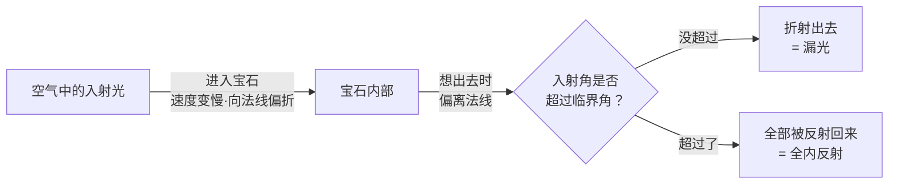
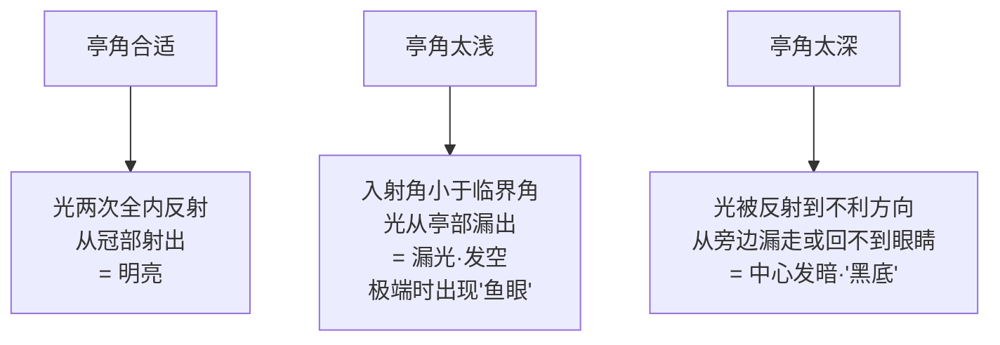

# 第 3 章 光学 ①：折射率、全内反射与临界角

> **本章目标**：搞清楚"亮"是怎么来的。学完你能解释：为什么钻石比玻璃亮得多、
> 为什么亭部角度差一两度就会让一颗钻石"发闷"或"漏光"、
> 为什么彩色宝石的切工规则和钻石完全不同。
>
> 这一章是**第 16 章（4C 切工）的物理基础**。切工是 4C 里唯一完全由人决定的一项，
> 也是最容易用知识省钱的一项——但前提是理解它在物理上做了什么。

## 3.1 一个问题：钻石和玻璃差在哪

拿一颗钻石和一颗切得一样的玻璃仿品放在一起，任何人都能看出钻石"更亮"。
差异不在颜色、不在净度，而在**光进出这块材料时的行为**。

具体说，差在**两个物理量**上：

| 物理量 | 钻石 | 玻璃 | 后果 |
|--------|------|------|------|
| **折射率** RI | 2.417 | 约 1.50 | 决定光被"折弯"的程度，也决定**光泽**强弱 |
| **色散** | 0.044 | 约 0.008~0.03（随成分） | 决定**火彩**（白光分解成彩色）——第 4 章细讲 |

本章讲第一个。而折射率真正厉害的地方，不是它让光拐弯，而是它决定了一个叫**临界角**的东西
——那才是"亮"的关键。

## 3.2 折射：光进入宝石会减速

光在真空里最快。进入透明介质后**速度变慢**，同时（若斜着入射）**方向改变**——这就是折射。

**折射率**[^1]的定义就是这个减速比：

```
n = 光在真空中的速度 / 光在该介质中的速度
```

钻石 n = 2.417，意思是光在钻石里的速度只有真空中的约 41%。

光的方向怎么变，由**斯涅尔定律**（Snell's law）决定：

```
n₁ · sin θ₁ = n₂ · sin θ₂
```

θ 是光线与界面法线（垂线）的夹角。你不需要会算，只要记住结论：
**从光疏介质（空气）进入光密介质（宝石）时，光线向法线偏折；反过来则偏离法线。**
后半句是本章的关键——因为宝石内部的光要出来，走的正是"从光密到光疏"这条路。



[^1]: [折射率](../../glossary.md#ri)（refractive index, RI）。

## 3.3 折射率怎么测，以及为什么有些宝石"测不出来"

**宝石折射仪**的原理正是全内反射：把宝石台面贴在高折射率的棱镜上，
中间用一滴**接触液**耦合，读出临界角对应的刻度，直接换算成 RI。

这带来一个**必须知道的限制**：

> 标准宝石折射仪配二碘甲烷类接触液，**量程上限约 1.78~1.81**。
> 超过这个值的宝石**读不出数**——钻石（2.417）、高型锆石（约 1.95）、
> 莫桑石（约 2.65）、CZ（约 2.16）全都超量程。
>
> ⚠️ 但"读不出"本身就是信息：它把范围一下缩小到"高 RI 的那几种"，
> 接下来用比重、双折射、导热性等就能区分（第 9、19 章）。

这也解释了一个常见误解：**折射仪不是万能鉴定仪**。它对 1.4~1.8 这个区间的宝石极其好用
（大部分彩宝都在这个区间），对高 RI 的贵重品种反而无能为力。

## 3.4 临界角：本章的核心

当光从宝石内部射向表面时，如果入射角**大于某个角度**，它就**完全无法射出**，
而是被界面**全部反射回宝石内部**——这叫**全内反射**（total internal reflection），
那个角度叫**临界角**。

临界角只取决于折射率，公式极简单：

```
sin θc = 1 / n        （宝石对空气）
```

我把常见材料的临界角算出来了（你可以用计算器验算，`θc = arcsin(1/n)`）：

| 材料 | 折射率 n | **临界角 θc** | 含义 |
|------|---------|-------------|------|
| 莫桑石 | 约 2.65 | **22.2°** | 锁光能力比钻石还强 |
| 钻石 | 2.417 | **24.4°** | 权威资料给的正是 24.4°，与公式一致 |
| CZ | 约 2.16 | **27.6°** | |
| 高型锆石 | 约 1.95 | **30.9°** | |
| 刚玉（红蓝宝） | 1.766 | **34.5°** | |
| 尖晶石 | 1.718 | **35.6°** | |
| 翡翠 | 约 1.66 | **37.0°** | |
| 祖母绿 | 约 1.58 | **39.3°** | |
| 水晶 | 约 1.548 | **40.2°** | |
| 玻璃 | 约 1.50 | **41.8°** | |
| 欧泊 | 约 1.45 | **43.6°** | |

**怎么读这张表（本章最重要的一段）**：

临界角**越小**，意味着"能被反射回去的角度范围**越大**"——
因为只要入射角超过 θc 就全反射，θc 小则超过它的机会多。

- 钻石 θc = 24.4°：入射角在 24.4°~90° 这一大片范围里的光**全都被关在石头里**，
  经过亭部两次反射后从冠部射出，进到你眼睛里 → **亮**。
- 玻璃 θc = 41.8°：只有 41.8°~90° 的光被反射，**41.8° 以下的光直接漏出底部** → **发闷、发空**。

> **所以"钻石亮"的物理原因是**：高折射率 → 小临界角 → 更容易把光锁在内部并送回观察者眼中。
> 这跟"钻石硬"没有任何关系——把这两件事联系起来是最常见的直觉错误。

## 3.5 切工怎么利用临界角

现在能回答"亭角差一度会怎样"了。刻面宝石的亭部就是**一组内部反射镜**：
光从冠部进来，打到亭部小面上，如果入射角**超过临界角**就被反射，
经过第二次反射后从冠部射出。

**亭角决定了光打在亭部小面上的入射角**。所以亭角只有落在一个**窗口**内，
两次反射才都能成功：



一百多年前就有人把这件事算清楚了：

> **1919 年**，19 岁的 Marcel Tolkowsky 在《Diamond Design》里用光路追踪算出圆钻的最优比例：
> **亭角 40.75°、冠角 34.5°、台宽比 53%、全深比 59.3%、底尖 1~2%**。
> 这套参数被业界逐步采纳，成为现代明亮式切工的基准。

现代实践把它放宽成**区间**（因为"最优"要在亮度、火彩、保重之间权衡）：

| 参数 | Tolkowsky（1919） | 现代常见的"理想"区间 |
|------|------------------|-------------------|
| 冠角 | 34.5° | 约 33.7°~35.8° |
| 亭角 | 40.75° | 约 40.2°~41.25° |

> **诚实说明（很重要）**：Tolkowsky 的计算假设了一颗**理想的、无瑕的**钻石，
> 而且只是一种权衡取向。后续研究表明，**参数落在"理想区间"外的钻石也可能同样漂亮甚至更美**，
> 反之落在区间内也不保证好看。所以：
>
> - **不要把切工当成"对表打分"**——参数是筛选工具，不是最终判据；
> - 真正的判据是**实际光学表现**（第 16 章讲 ASET / IdealScope 怎么看），以及你自己的眼睛。

注意亭角区间的宽度：**大约 1 度**。这就是"亭角差一度会怎样"的答案——
在这个量级上，差 1 度确实能把一颗钻石从"极亮"推到"可见漏光"。

## 3.6 为什么彩宝的切工规则完全不同

把 §3.4 的表和彩宝放在一起看，一个结论立刻出现：

**彩宝的折射率普遍低（1.5~1.8），临界角大（34°~42°），所以亭部的"有效窗口"比钻石窄得多。**

这带来两个后果：

1. **彩宝更容易漏光**。切得浅一点就能从台面**透过石头看到背后的东西**
   ——行业叫**窗口效应**（window）。有窗口的石头，颜色会被"冲淡"，看起来发空。
2. **彩宝的切工目标不是火彩，而是颜色**。彩色宝石的价值 80% 在颜色（第 21 章），
   所以切磨师优先考虑的是"**这个深度能不能把颜色浓度做对**"：
   - 颜色浅的原石 → 切**深**一些，让光在石头里走更长的路，颜色更浓；
   - 颜色过深的原石 → 切**浅**一些，避免发黑。

> **柜台前的直接用法**：把一颗彩宝台面朝上放在**有字的纸**上。
> 如果透过石头能读出字，说明亭部漏光（有窗口）——这颗的切工在牺牲颜色表现。
> 这个测试不需要任何工具，是本章最实用的一招。

## 3.7 光泽：折射率的另一个产物

**光泽**（luster）是宝石**表面**反射光的质感。它由两个因素决定：
**折射率**（越高反射越强）和**抛光质量**（越细腻反射越纯净）。

宝石学的光泽分类（术语以英文为准，因为证书与文献多用英文）：

| 光泽 | 英文 | 特征 | 代表 |
|------|------|------|------|
| 金刚光泽 | adamantine | 最强，像钻石那样"硬冷的亮" | 钻石 |
| 亚金刚光泽 | sub-adamantine | 高 RI 但不及钻石 | 锆石、榍石、闪锌矿 |
| 玻璃光泽 | vitreous | 中等 RI，多数透明宝石都是这一档 | 红宝石、祖母绿、尖晶石、水晶 |
| 树脂光泽 | resinous | 低 RI 的软质材料 | 琥珀、部分欧泊 |
| 蜡状光泽 | waxy | 近乎哑光 | 绿松石、部分翡翠 |
| 丝绢光泽 | silky | 纤维状结构造成 | 石膏、孔雀石、某些纤维状集合体 |
| 珍珠光泽 | pearly | 层状结构的柔和晕光 | 珍珠、月光石 |
| 金属光泽 | metallic | 金属那种反射 | 金、银、抛光赤铁矿 |

> **一个术语差异要注意**：中国教材（如《系统宝石学》）常用**油脂光泽**描述和田玉那种
> "像羊脂"的质感，而英文体系的分类里没有完全对应的一档（多归入 vitreous 与 waxy 之间）。
> 遇到中英资料对不上时，**不是谁错了，而是术语体系不同**——第 32 章讲和田玉时会再提。

**两条诚实说明**：

1. **光泽与硬度不直接挂钩**。闪锌矿 RI 高达 2.39、光泽接近金刚光泽，但硬度只有 3.5。
   不过两者**间接相关**：硬度限制了能抛到多细的光，所以最好的光泽通常出现在
   "高 RI + 能抛好光"的宝石上。
2. **光泽是判断"这块料好不好"的现场线索**。同种宝石，光泽发闷通常意味着
   抛光差、表面有磨损、或经过覆膜/充填处理（第 10 章）。

## 3.8 常见说法辨析

| 说法 | 判定 | 说明 |
|------|------|------|
| "钻石亮是因为它硬" | **明确错误** | 亮来自高折射率 → 小临界角。硬只是让它**能长期保持**锐利的棱面与好抛光（间接有关） |
| "折射率越高越值钱" | **明确错误** | 莫桑石（2.65）、CZ（2.16）折射率都高于蓝宝石（1.766），价格却低得多。价值由稀缺性与需求决定 |
| "切工好就是对着参数表打分" | **不完整** | 参数是筛选工具。Tolkowsky 自己的模型也基于理想化假设；区间外也可能很美，要看实际光学表现（第 16 章） |
| "彩宝切得深是为了省料/骗重量" | **有争议** | 有时确实是保重（异形彩宝尤其），但**颜色浅的料切深是正确工艺**——目的是把颜色做浓。要看颜色效果，不能一概而论 |
| "从台面能看到背后的字说明是假的" | **明确错误** | 那是**窗口效应**（亭部太浅漏光），是切工问题，与真假无关。真宝石照样可以切出窗口 |
| "折射仪测不出来的就是假货" | **明确错误** | 恰恰相反：钻石、锆石、莫桑石都超出标准折射仪量程。测不出来只说明 RI 高于约 1.81 |

## 3.9 🔎 柜台前的用处

1. **"透字测试"**：彩宝台面朝上放在有字的纸上，能读出字 → 亭部漏光有窗口，颜色表现被牺牲；
2. **看光泽是否发闷**：同种宝石里光泽明显差的那颗，怀疑抛光差、磨损、或表面处理（第 10 章）；
3. **问切工参数，但别只看参数**：圆钻可以问冠角/亭角/台宽比，
   落在 §3.5 区间内是**及格线**，好不好还要看实际光学表现；
4. **听到"折射率高所以值钱"就警惕**——这是把物理参数当价值指标的典型话术；
5. **理解"测不出 RI"的含义**：这不是坏消息，是把可能性缩小到高 RI 那几种的**有用信息**。

## 3.10 思考题

1. 用公式 `sin θc = 1/n` 解释：为什么折射率**越高**，临界角**越小**，
   而临界角越小反而**越亮**？（这一串因果里最容易绕错的是最后一步，请说清楚。）
2. 一颗玻璃仿品和一颗钻石切成完全相同的比例，为什么玻璃那颗一定会明显漏光？
   请用两者的临界角数值回答。
3. 为什么标准宝石折射仪测不出钻石的折射率？这个"测不出"对鉴定是**有用信息**还是**无用**？
   为什么？
4. 彩色宝石的切工为什么不能照搬钻石的"理想比例"？请从**临界角**和**价值来源**两个角度回答。
5. **【案例】** 网店详情页写：
   *"天然蓝宝石戒面，折射率高达 1.77，比水晶（1.54）高出很多，所以火彩极其璀璨，媲美钻石。"*
   请指出这段话里的**两处**概念错误，并说明蓝宝石的火彩实际上如何（提示：查
   [常数表](../../reference/constants.md)的色散一节）。
6. **【案例】** 你在两家店看到参数几乎相同的圆钻（同重量、同色级、同净度、切工评级都是最高档），
   但价格差 15%。销售 A 说"我们的亭角是 40.8°，正好是理想值"；销售 B 说"我们的经过 ASET 检测，
   光学表现更好"。请分析：**这两句话哪一句提供了更强的证据**？你还需要问什么？
7. **【辨识】** 去 [GIA 4C 教育页](../../reference/gallery.md)看切工（Cut）部分的图示，
   找出"过浅（too shallow）"与"过深（too deep）"的示意图与实拍对比。
   然后回答：过浅和过深在**视觉上**分别表现为什么？哪一种更容易被误认为"石头很大"？

> 📖 **参考答案**（想清楚再看）：[Q1](../../qa/03-optics-refraction-qa.md#q1) ·
> [Q2](../../qa/03-optics-refraction-qa.md#q2) · [Q3](../../qa/03-optics-refraction-qa.md#q3) ·
> [Q4](../../qa/03-optics-refraction-qa.md#q4) · [Q5](../../qa/03-optics-refraction-qa.md#q5) ·
> [Q6](../../qa/03-optics-refraction-qa.md#q6) · [Q7](../../qa/03-optics-refraction-qa.md#q7)

## 3.11 本章实操

### 🅐 无器具版 · 任务一：透字测试（可以在店里做）

找一张有小字的纸（名片、说明书）。把任何一颗**刻面彩宝**台面朝上放上去，正视观察：

| 宝石（品种 / 来源） | 能否透过石头看到字 | 有无"发空/颜色被冲淡"的感觉 | 判断（窗口效应？） |
|-------------------|-----------------|------------------------|-----------------|
| | | | |

> **对照实验**：如果手边有钻石或高 RI 的仿钻（莫桑石、CZ），同样测一次。
> 你会发现它们**几乎不可能透出字**——这正是临界角小、锁光能力强的直接体现。

### 🅐 无器具版 · 任务二：算一遍临界角

用手机计算器（要有 arcsin 或 sin⁻¹ 功能）验算 §3.4 的表：

| 材料 | RI | 你算出的 θc | 与表中是否一致 |
|------|----|-----------|--------------|
| 钻石 | 2.417 | | |
| 刚玉 | 1.766 | | |
| 玻璃 | 1.50 | | |

> 算这一遍的意义不是练计算，而是让你确信**这些数字是可以自己推出来的**，
> 不需要相信任何人的说法。本书所有能验算的地方都会告诉你怎么验算。

### 🅐 无器具版 · 任务三：在视频里找漏光

在电商平台找钻石或彩宝的**转动视频**（现在大多数详情页都有），观察：

| 观察点 | 记录 |
|--------|------|
| 转动时中心是否始终发暗（可能亭角过深） | |
| 转动时是否出现大片"透亮无火"的区域（可能过浅/有窗口） | |
| 亮暗对比是否分明（闪烁感）还是灰蒙蒙一片 | |

> **诚实提醒**：视频受打光影响极大，卖家会用强聚光灯让任何石头都显得闪。
> 所以这个练习的目标是**学会怀疑**，不是靠视频下结论。

### 🅑 有器具版 · 任务四：用手电看光路与抛光

需要小型强光手电 + 10 倍放大镜。

| 观察 | 方法 | 记录 |
|------|------|------|
| 亭部漏光 | 手电从冠部斜照，观察底部是否有明显光斑透出 | |
| 抛光质量 | 10 倍镜下看小面表面，是否有细密平行的抛光痕 | |
| 棱线锐利度 | 看小面交界的棱线是否锐利（软材料易磨圆钝） | |
| 光泽档位 | 与 §3.7 的表对照，判断属于哪一档 | |

> **一个有意思的对照**：CZ 由于硬度低（约 8），棱线容易磨圆钝、
> 而且抛光痕常呈**同方向平行**分布；钻石棱线锐利、抛光方向在不同小面上不一致。
> 这是第 19 章分辨仿钻的经典细节，现在就可以开始练眼睛。

---

**下一章**：第 4 章 光学 ②——双折射、色散（火彩）、多色性、光泽的进阶。
本章讲了光"能不能出来"，下一章讲光出来时**发生了什么变化**：
为什么有的宝石在放大镜下棱线成双、为什么坦桑石转个方向颜色就变。
