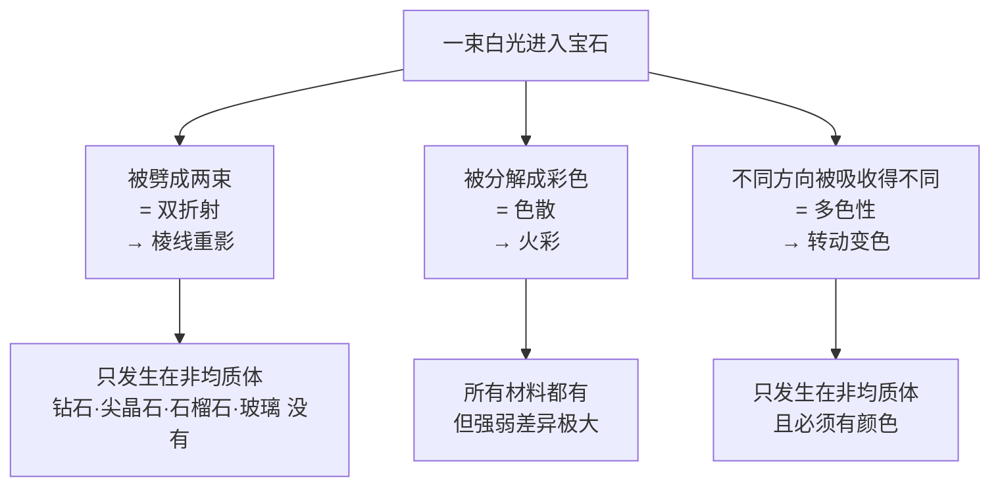
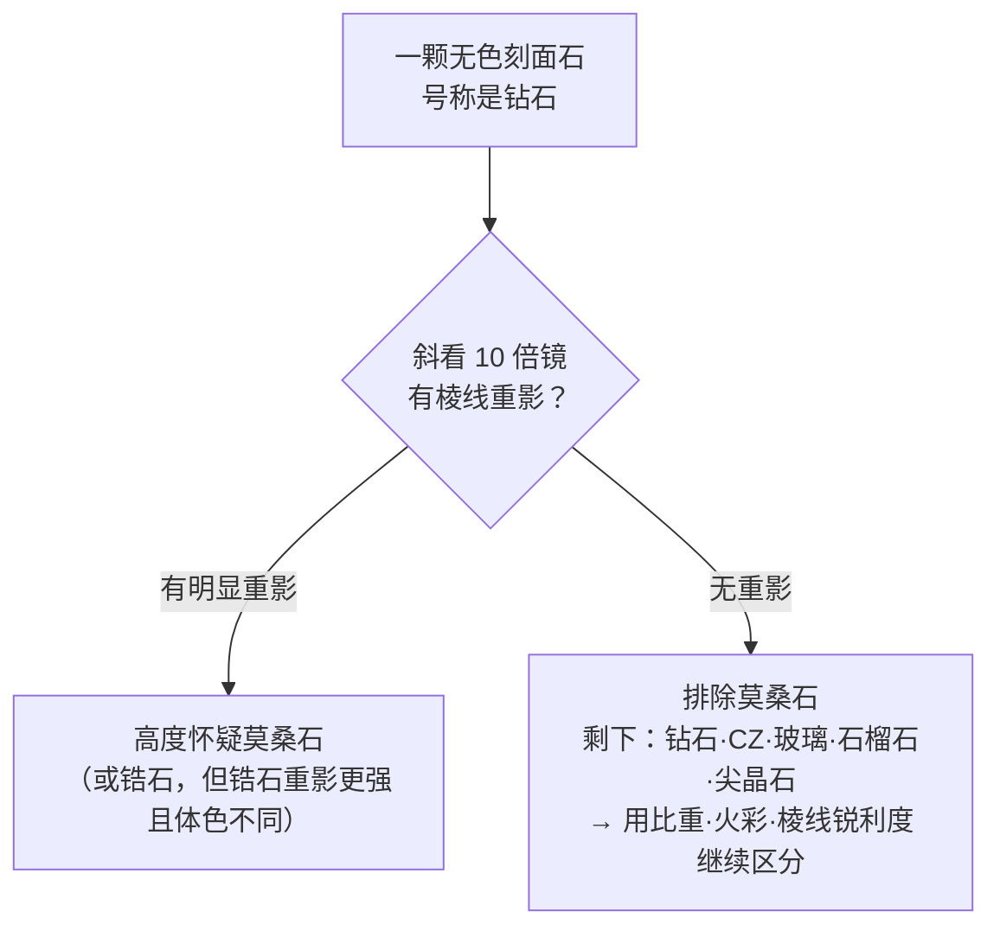

# 第 4 章 光学 ②：双折射、色散与多色性

> **本章目标**：搞清楚光进入宝石后**发生了什么变化**。学完你能：
> 用一只 10 倍放大镜把莫桑石从钻石里挑出来（并且知道**必须斜着看**，
> 直着看会失效）、说清"火彩"是什么物理量、
> 理解为什么坦桑石转个方向颜色就变、以及为什么这件事让切磨师损失重量。
>
> 第 3 章讲的是光**能不能出来**；本章讲光在里面**被改变成了什么**。

## 4.1 光进入宝石后可能发生的三件事

一束白光进入宝石，除了第 3 章讲的"折弯与反射"，还可能遭遇三种变化：

注意 A 和 C 都只发生在**非均质体**（第 2 章的一轴晶、二轴晶）——所以这两件事
同时也是"这颗石头属于哪个晶系"的探针。这就是为什么第 2 章那张晶系表是本章的地基。

## 4.2 双折射：把一束光劈成两束

### 原理与数值

非均质体内部，光沿不同振动方向传播的速度不同，于是一束入射光被劈成**两束**，
各自有自己的折射率。两者之差就是**双折射率**[^1]（birefringence，常记作 DR）。

**已核实的双折射率数值**（来源见[标准与文献索引](../../reference/standards.md)）：

| 材料 | 双折射率 | 10 倍镜下重影 |
|------|---------|-------------|
| 方解石 | **0.172** | 夸张到肉眼可见 |
| 锆石（正常/高型） | **0.059**（非蜕晶质时约 0.055） | 强 |
| 橄榄石 | 0.035~0.038 | 明显 |
| 莫桑石 | 约 **0.036~0.043**[^2] | 中等，呈"毛毛的"重影 |
| 碧玺 | 0.018~0.020 | 临界，需仔细看 |
| 刚玉（红蓝宝） | 0.008~0.010 | 基本看不到 |
| 水晶 | 0.009 | 极小 |
| 绿柱石（祖母绿/海蓝宝） | 0.005~0.009 | 极小 |
| 钻石、尖晶石、石榴石、玻璃、CZ | **无**（均质体） | 无 |

> **一条可操作的阈值**：双折射率**大于约 0.020** 时，
> 在 10 倍放大镜下能看到对侧棱线"分成两条"（像并排的铁轨）。
> 所以这个方法真正管用的对象是：**锆石、榍石、橄榄石、莫桑石、碧玺（临界）**。
> 刚玉、水晶、绿柱石的双折射太小——**看不到重影不能证明它是均质体**。

### 必须斜着看（一个能让方法失效的细节）

这是本章最实用、也最容易被漏掉的一点：

> **每一种非均质宝石都存在一个"光轴"方向，沿这个方向看，它表现得像均质体（不出现重影）。**
> 而刻面宝石的**台面通常被切成垂直于 c 轴**——恰恰就是为了**减小**双折射带来的模糊感。
>
> **对莫桑石来说，光轴方向正好穿过台面**。所以：
> **直着透过台面看，莫桑石不出现重影**——这个方法会给你一个假的"阴性"结果。
>
> **正确做法**：把石头**倾斜约 45°**，透过**冠部的其他小面**（风筝面/星小面）
> 去看亭部小面的交界棱线。这时莫桑石的重影会非常明显。

我在第 2 章的实操里给的方法是"透过台面看对侧棱线"——**对莫桑石这是错的方法**，
本章予以修正（第 2 章已补注）。这也是个好例子：**一个操作步骤的细节，能决定测试有效还是无效**。

### 三个会让你误判的例外

| 例外 | 现象 | 后果 |
|------|------|------|
| **蜕晶质（metamict）低型锆石** | 长期受自身放射性元素辐射损伤，结晶度下降，双折射**显著降低** | 看不到重影**不能排除锆石** |
| **小碎石（melee）** | 光在石头里走的路径太短 | 双折射中等也可能看不到重影 |
| **观察方向不对** | 见上一节 | 假阴性 |

### 为什么这个方法对分辨仿钻是决定性的

因为**钻石的常见仿品几乎全是均质体**：玻璃、CZ、石榴石、尖晶石——它们和钻石一样没有双折射。
**莫桑石是唯一的例外**，它是六方晶系、有明显双折射。

> **诚实说明**：有资料主张"一只 10 倍放大镜就足以识别莫桑石"，理由是电子测试笔不可靠
> （莫桑石导热性接近钻石，**热导仪会把莫桑石判成钻石**——这是真实存在的坑）。
> 但这个说法有前提：**只有当莫桑石仍被生产为双折射材料时才成立**，
> 而且要求观察方向正确、石头够大、观察者有经验。
> 所以本书的表述是：**重影是强线索，不是终局结论**；贵重交易仍要送检（第 11、19 章）。

[^1]: [双折射率](../../glossary.md#birefringence)（birefringence, DR）。
[^2]: 莫桑石双折射率的来源分歧较大（宝石学资料常见 0.043，也有给 0.036；某些晶体学数据按 6H 碳化硅的 nω/nε 计算得到 0.3 量级）。差异可能来自多型（4H/6H）与测量波长不同。本书取 **0.036~0.043** 这个区间，并注明分歧——详见[常数表](../../reference/constants.md)。对实用结论无影响：这个量级都足以在 10 倍镜下看到重影。

## 4.3 色散：火彩的物理量

**色散**[^3]（dispersion）= 宝石对**红光**（686.7 nm）与**紫光**（430.8 nm）折射率之差，无单位。
它衡量白光被分解成光谱色的能力，也就是俗称的**火彩**[^4]（fire）。

**已核实的色散值**（其余品种待核实后补入，本书不写没有出处的数字）：

| 材料 | 色散值 | 相对钻石 |
|------|-------|---------|
| 金红石 | 0.28 | 约 6.4 倍（彩光夸张到不自然） |
| 铌酸锂 | 0.13 | 约 3 倍 |
| **莫桑石** | **0.104** | 约 **2.4 倍** |
| CZ | 0.058~0.066 | 约 1.3~1.5 倍 |
| 白铅矿 | 0.055 | 约 1.25 倍 |
| **钻石** | **0.044** | 基准 |

**三条必须一起理解的结论**：

1. **色散值高只代表"潜力"，不代表一定好看。** 莫桑石与金红石的彩光常被形容为
   "过艳、发假"——人眼对彩光过量是有审美阈值的。这一点反而成了**识别特征**：
   一颗"火彩比钻石还花"的无色石头，首先该怀疑莫桑石或 CZ（第 19 章）。
2. **切工决定色散能否表现出来。** 同一材料切得好火彩四射，切得差几乎看不到；
   **原石和素面（蛋面）几乎不显火彩**——因为没有刻面把光路折来折去。
   所以"火彩"是**材料 × 切工**的结果。
3. **色散与折射率是两个独立的量。** 蓝宝石折射率 1.766 明显高于水晶 1.548，
   但刚玉属低色散材料、火彩很弱——**它的美不在火彩，而在颜色**。
   把"折射率高"说成"火彩璀璨"是常见话术（第 3 章 §3.8 已辨析）。

[^3]: [色散](../../glossary.md#dispersion)（dispersion）。
[^4]: [火彩](../../glossary.md#fire)（fire）。

## 4.4 亮度、火彩、闪烁：GIA 的三分量框架

讲到这里，可以引入一套后面反复要用的框架。GIA 在评价圆钻的正面外观时，
把"好看"拆成三个**基于外观**的分量：

| 分量 | GIA 的定义 | 通俗说 | 本书哪一章细讲 |
|------|-----------|--------|--------------|
| **亮度**[^5]（brightness） | 白光的内部与外部反射总和 | "白亮" | 第 3 章（临界角）、第 16 章 |
| **火彩**（fire） | 光被色散成光谱色 | "彩光" | 本章 §4.3 |
| **闪烁**[^6]（scintillation） | **明暗区域的图案**，以及移动时的闪光 | "一闪一闪、有层次" | 第 16 章 |

三个分量之外，切工分级还要看**设计与工艺**（design & craftsmanship）：
对称性（小面是否对齐）与抛光（小面表面是否光滑）。

**闪烁里藏着一个反直觉的点**：它不只是"亮"，而是**明暗对比的图案**。
一颗全是亮光、没有暗区的石头看起来会**平板**；正是明暗交替才让人觉得"在闪"。
所以**适度的暗区是好切工的一部分**，不是缺陷。

第 3 章讲过的三种病，成因在 GIA 的框架里也很清楚：

| 现象 | 成因 |
|------|------|
| 鱼眼（fish-eye） | 亭部**过浅** |
| 中心发暗（dark center） | 亭部**过深** |
| 暗色主刻面延伸到边缘（dark mains） | **冠高与亭深不匹配** |

**两条重要的诚实说明**（都来自 GIA 自己的表述）：

> 1. **术语本身是模糊的**。GIA 明确指出，"亮度/亮光/火彩/闪烁"这些词
>    被不同机构用不同方式定义，有的清晰有的含糊；而且**这些外观属性与切工参数的相关性
>    相当宽泛**——尽管市场上常有人为很窄的参数区间（尤其"Ideal"切工）宣称更好的外观。
>    这与第 3 章的结论一致：**参数是筛选工具，不是判据**。
> 2. **GIA 的切工分级只给标准圆钻**。因为圆钻是唯一有标准化小面结构的切型；
>    其余形状（椭圆、马眼、祖母绿型、梨形、心形等）统称**花式切工**（fancy shapes），
>    **证书上没有 cut grade**。这解释了第 17 章的一个核心难题：
>    **异形钻为什么难比价**——因为最关键的那一项没有标准分。

[^5]: [亮度](../../glossary.md#brightness)（brightness / brilliance）。
[^6]: [闪烁](../../glossary.md#scintillation)（scintillation）。

## 4.5 多色性：转个方向，颜色变了

**多色性**[^7]（pleochroism）指同一颗宝石**从不同方向看颜色不同**。
成因是：双折射把光劈成两束后，两束光在晶体里被吸收的波长不同，出来时残余颜色就不同。

**它与晶系严格对应**：

| 光性 | 多色性 | 说明 | 例子 |
|------|--------|------|------|
| 均质体（立方晶系 + 非晶质） | **没有** | 各方向等价，只有一种颜色 | 钻石、石榴石、尖晶石、玻璃、琥珀 |
| 一轴晶（四方/六方/三方） | **二色性**（最多两色） | 一个光轴、两个折射率 | 蓝宝石、祖母绿、碧玺 |
| 二轴晶（斜方/单斜/三斜） | **三色性**（最多三色） | 两个光轴、三个折射率 | 坦桑石、堇青石、红柱石 |

**已核实的具体颜色**（来自 IGS，见[标准与文献索引](../../reference/standards.md)）：

| 宝石 | 各方向的颜色 |
|------|------------|
| 红柱石（andalusite） | 绿、红、褐——一颗切得好的能在小面反射里**同时看到三色** |
| 坦桑石（晶体） | 正面**淡紫**、侧面**灰蓝**、沿垂直轴**红褐** |
| 堇青石（iolite） | 一个方向蓝、一个方向蓝黄混合、一个方向黄/褐 |
| 绿帘石（epidote） | "根汁汽水"色与深橄榄绿（需强背光才看出） |
| 橄榄石、海蓝宝 | 有多色性但**很微弱** |

### 三件事必须分清（极易混淆）

| 现象 | 本质 | 怎么区分 |
|------|------|---------|
| **多色性** | 同一光源下，**换观察方向**颜色变 | 转动石头（或用二色镜）看 |
| **变色效应** | **换光源**（日光/白炽灯/荧光灯）颜色变 | 换灯看，方向不变 |
| **色带分区** | 生长期间化学成分变化造成的**不同区域**颜色不同 | 颜色分界是**空间上的**，与方向无关 |

> 亚历山大变石（变石）**同时具有变色效应和多色性**——这也是它难切、难评价的原因之一（第 27 章）。
>
> ⚠️ **一个反例要记住**：均质体"永远不显多色性"，但钻石与石榴石可能出现
> **异常双折射**[^8]（anomalous birefringence，多因晶体内部应变），
> 在偏光镜下模仿出类似效果。所以偏光镜下看到反应，不能立刻断定它是非均质体。

### 多色性怎么让切磨师损失重量

这是多色性最有商业意义的后果：

> 强多色性的宝石，**必须把颜色最好的方向朝上**（朝台面）来切。
> 而原石的形状不会照顾这个要求——于是切磨师常常要**放弃更省料的方向**，
> 多切掉一部分材料，只为让正面颜色最漂亮。

结果是：**强多色性品种的出成率更低，同等品质单价更高**。坦桑石是最典型的例子
（它甚至有"选蓝还是选紫"的取向决策），堇青石、红柱石同理。第 28 章会展开。

### 怎么观察

- **二色镜**[^9]（dichroscope）：把两个方向的颜色**并排**呈现在同一视场里，
  最直观，也是宝石学的标准工具；
- **偏光镜**：判断光性（均质/一轴/二轴）；
- **一片线性偏光片**：旋转着看，业余条件下也能看出强多色性；
- **强背光**：颜色深的石头（如绿帘石）必须强背光才看得出来。

[^7]: [多色性](../../glossary.md#pleochroism)（pleochroism）——两色叫二色性（dichroism），三色叫三色性（trichroism）。
[^8]: [异常双折射](../../glossary.md#anomalous-birefringence)（anomalous birefringence）。
[^9]: [二色镜](../../glossary.md#dichroscope)（dichroscope）。

## 4.6 常见说法辨析

| 说法 | 判定 | 说明 |
|------|------|------|
| "用放大镜看不到重影，所以不是莫桑石" | **明确错误** | 莫桑石的光轴穿过台面——**直着看本来就看不到**。必须倾斜约 45° 透过冠部小面看 |
| "热导笔测过是钻石，肯定没问题" | **明确错误** | 莫桑石导热性接近钻石，**热导仪会把它判成钻石**。要用电导测试或看重影（第 19 章） |
| "双折射让石头看起来发糊，是缺点" | **不完整** | 沿光轴方向不出现双折射，且台面通常就切在这个方向上以减小影响。所以"发糊"要看切割取向 |
| "火彩越强越好" | **有争议** | 莫桑石色散 0.104（钻石的 2.4 倍）常被认为"过艳发假"。火彩要与亮度平衡，这正是切工要权衡的 |
| "证书上切工是 Excellent，所以形状不重要" | **明确错误** | **GIA 的切工分级只给标准圆钻**；花式切工证书上根本没有 cut grade（第 17 章） |
| "转动时颜色变了，说明是变色宝石（如变石）" | **明确错误** | 转动变色是**多色性**；变色效应是**换光源**才变。两者机制完全不同 |
| "钻石在偏光镜下有反应，所以是假的" | **明确错误** | 那多半是**异常双折射**（内部应变），钻石与石榴石都可能出现 |
| "小碎钻看不到重影，所以都是真钻" | **明确错误** | 光程太短，**小碎石本来就难看出重影**——这个方法在 melee 上不可靠 |

## 4.7 🔎 柜台前的用处

1. **看无色石头，先斜着看重影**：倾斜约 45°、透过冠部小面看亭部棱线；
   有明显重影 → 高度怀疑莫桑石（或锆石）。**别只透过台面看**；
2. **不要相信热导笔**：它把莫桑石判成钻石是**已知的系统性问题**；
3. **看到"火彩比钻石还花"要警惕**：过量彩光是莫桑石/CZ 的特征，不是优点；
4. **看彩宝时转着看**：颜色随方向变 = 多色性（正常现象，也是天然的线索之一）；
   随光源变 = 变色效应（另一种、更贵的现象）；
5. **买异形钻时记住**：证书上**没有**切工等级，
   所以"切工很好"这句话在异形上缺少标准依据——必须自己看光学表现（第 17 章）。

## 4.8 思考题

1. 为什么"看不到棱线重影"**不能**证明一颗石头是均质体？请给出**三个**不同的原因。
2. 为什么刻面宝石的台面通常切成垂直于 c 轴？这个工艺习惯如何**反过来**破坏了
   "透过台面看重影"这个测试？
3. 色散和折射率都是折射率相关的量，为什么它们决定的是**两种不同**的视觉效果？
   请分别说出对应的效果名称。
4. 为什么"适度的暗区"是好切工的一部分，而不是缺陷？（提示：GIA 三分量里的第三项。）
5. 强多色性为什么会导致**同等品质的单价更高**？请把因果链写完整。
6. **【案例】** 朋友在直播间买了一枚"1 克拉钻戒"，主播当场用测钻笔演示"仪器显示 Diamond"，
   还说"放大镜看棱线没有双影，绝对是真钻"。请指出这两个"证据"各自的问题，
   并说明你会建议朋友做什么。
7. **【案例】** 某网店卖一颗"坦桑石"，详情页写：
   *"顶级蓝紫双色，转动能看到蓝色和紫色变化，是罕见的变色宝石，媲美亚历山大变石。"*
   请判断这段描述里哪一部分是**真实的正常现象**、哪一部分是**概念偷换**，
   并说明这种偷换想让消费者产生什么误解。
8. **【辨识】** 去[权威图库索引](../../reference/gallery.md)里的 GIA 4Cs 切工页面，
   找到 fish-eye（鱼眼）与 dark center（中心发暗）的示意或实拍。
   然后回答：这两种现象分别由什么参数问题引起？在照片上你靠什么特征区分它们？

> 📖 **参考答案**（想清楚再看）：[Q1](../../qa/04-optics-birefringence-qa.md#q1) ·
> [Q2](../../qa/04-optics-birefringence-qa.md#q2) · [Q3](../../qa/04-optics-birefringence-qa.md#q3) ·
> [Q4](../../qa/04-optics-birefringence-qa.md#q4) · [Q5](../../qa/04-optics-birefringence-qa.md#q5) ·
> [Q6](../../qa/04-optics-birefringence-qa.md#q6) · [Q7](../../qa/04-optics-birefringence-qa.md#q7) ·
> [Q8](../../qa/04-optics-birefringence-qa.md#q8)

## 4.9 本章实操

### 🅐 无器具版 · 任务一：区分"转动变色"与"换灯变色"

找任意一颗有颜色的刻面宝石（自己的、店里的、或电商视频里的）：

| 观察 | 方法 | 记录 |
|------|------|------|
| 转动变色？ | **同一光源**下，把石头转动、换角度看 | |
| 换灯变色？ | **不动石头**，在日光 / 白炽灯 / 手机手电下分别看 | |
| 颜色分区？ | 看颜色差异是否固定在**某个区域**（与角度无关） | |
| 结论 | 多色性 / 变色效应 / 色带分区 / 都没有 | |

> 这三者混为一谈是市场话术的高发区——"转动有变化"被说成"变色宝石"，
> 而真正的变色效应（如变石）价格要高一个量级。

### 🅐 无器具版 · 任务二：给三颗宝石预测多色性

不看资料，用第 2 章的晶系表 + 本章 §4.5 的对应关系，**先推测再核对**：

| 宝石 | 晶系（查第 2 章表） | 应属均质/一轴/二轴 | 推测：无多色性/二色性/三色性 | 查证结果 |
|------|-----------------|----------------|------------------------|---------|
| 石榴石 | | | | |
| 蓝宝石 | | | | |
| 坦桑石 | | | | |

> 这个练习的价值在于：**多色性不是需要背的清单，而是能从晶系推出来的**。

### 🅑 有器具版 · 任务三：正确地找棱线重影（含对照）

需要 10 倍放大镜。**关键是观察方向**：

| 步骤 | 做法 |
|------|------|
| 1 | 先**直着透过台面**看对侧亭部棱线，记录是否有重影 |
| 2 | 再把石头**倾斜约 45°**，透过冠部的风筝面/星小面看亭部棱线交界，记录是否有重影 |
| 3 | 对比两次结果 |

| 宝石（品种/来源） | 台面直看 | 倾斜 45° 斜看 | 该品种应有的双折射（§4.2 表） | 是否吻合 |
|-----------------|---------|-------------|------------------------|---------|
| | | | | |
| | | | | |

> **最有教学价值的对照**：如果你能同时拿到钻石（或 CZ）与莫桑石，
> 你会看到"直看两者都没重影、斜看只有莫桑石有"——
> 这一步之差就是"测得准"和"测错了"的分界。
>
> **诚实提醒**：小碎石、镶嵌紧密看不到亭部、或观察方向不对，都会给出假阴性。
> 这个方法只能产生**怀疑**，不能下结论。

### 🅑 有器具版 · 任务四：用偏光片看多色性（低成本替代二色镜）

从废旧偏光太阳镜上剪一片偏光片（或买片状偏光膜）。把宝石放在白色背景上，
透过偏光片看，缓慢旋转偏光片：

| 宝石 | 旋转偏光片时颜色/明暗是否变化 | 推测光性 | 与品种应有的光性是否吻合 |
|------|---------------------------|---------|---------------------|
| | | | |

> **局限必须说清**：偏光片能看出"有反应/无反应"，但**不能替代二色镜与偏光镜**
> 判定一轴还是二轴。而且钻石、石榴石可能因**异常双折射**给出反应——
> 所以"有反应"不等于"非均质体"。

---

**下一章**：第 5 章 颜色的成因——为什么同一种矿物能有十几种颜色、
哪些颜色会褪、以及"致色元素"如何决定一颗宝石值多少钱。
本章讲了颜色**怎么被改变**，下一章讲颜色**从哪里来**。
