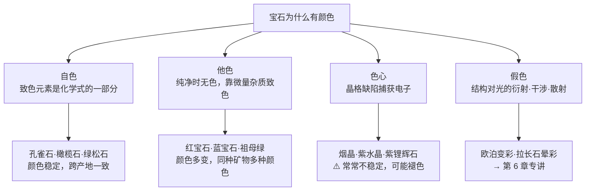

# 第 5 章 颜色的成因：自色、他色与色心

> **本章目标**：回答一个基础但极少被讲清的问题——**宝石的颜色到底从哪来**。
> 学完你能解释：为什么红宝石和蓝宝石是**同一种矿物**、
> 为什么蓝宝石只需万分之一的杂质就能蓝得那么浓、
> 以及**哪些颜色会褪、哪些永远不会**——这一条直接决定你该不该买某些宝石。
>
> 彩色宝石的价值 80% 在颜色（第 21 章）。而颜色的**成因**决定了它的**稳定性**，
> 稳定性决定了它值不值这个价。

## 5.1 一个问题：红宝石和蓝宝石是同一种矿物

这是宝石学里最好的教学案例：

| | 红宝石 | 蓝宝石 |
|---|---|---|
| 矿物 | **刚玉** Al₂O₃ | **刚玉** Al₂O₃ |
| 折射率、硬度、比重 | 完全相同（1.762~1.770 / 9 / 4.00） | 完全相同 |
| 吸收了什么光 | 吸收**蓝绿**，透出红 | 吸收**橙红**，透出蓝 |
| 差别的来源 | 微量 **Cr³⁺** | 微量 **Fe** 与 **Ti** |

同一种化合物，因为掺进了**不同的百万分之几的杂质**，成了两种价格体系完全不同的宝石。

这告诉我们两件事：

1. **颜色不是矿物的固有属性**——大多数宝石的颜色来自杂质或缺陷，而不是主成分；
2. 因此**颜色是最容易被人为改变的性质**——第 10 章讲的所有改色手段
   （热处理、辐照、扩散、染色）都在动本章讲的这几个机制。

## 5.2 颜色的本质：你看到的是"剩下的光"

一个必须先建立的直觉：**宝石不会"发出"颜色，它只是吸收掉一部分白光**。

白光里包含全部可见波长。宝石内部的某种机制**选择性吸收**了某些波长，
剩下没被吸收的透射出来进入你的眼睛——那就是你看到的颜色。

```
白光进入 → 吸收掉蓝绿波段 → 剩下红色透出 → 你看到"红宝石"
白光进入 → 吸收掉橙红波段 → 剩下蓝色透出 → 你看到"蓝宝石"
```

所以讨论颜色成因，本质上是讨论：**什么东西在吸收光，以及为什么吸收这个波段**。

## 5.3 四种致色机制

宝石学把致色机制分成几类。**不同资料的分类边界略有不同**（本章 §5.6 会说明这个分歧），
本书采用最常见的四分法：



### 自色与他色：一个粉末就能分辨的判据

| | **自色**[^1]（idiochromatic） | **他色**[^2]（allochromatic） |
|---|---|---|
| 致色元素 | **是化学式的一部分** | 不属于理想化学成分，只是微量杂质 |
| 纯净状态 | 本身就有色 | **无色** |
| **判据** | **碾成粉末，粉末也有颜色** | 碾成粉末，粉末**趋于白色** |
| 颜色多样性 | 跨产地基本一致（成分决定） | **极其多样**（杂质随地质环境变化） |
| 例子 | 孔雀石 Cu₂CO₃(OH)₂ 里的铜、橄榄石里的铁、绿松石里的铜 | 刚玉族、绿柱石族、水晶、尖晶石、钻石 |

> **这个区分有实际价值**：他色宝石的颜色**随微量元素变化**，所以同一种矿物能有十几种颜色
> ——绿柱石就是最好的例子（祖母绿绿、海蓝宝蓝、摩根石粉、金绿柱石黄），
> 它们是同一种矿物的不同颜色变种。
> 也正因为如此，**他色宝石的颜色也更容易被人工手段改变**。

[^1]: [自色](../../glossary.md#idiochromatic)（idiochromatic）。
[^2]: [他色](../../glossary.md#allochromatic)（allochromatic）。

## 5.4 他色的两条路径：晶体场与电荷转移

这一节解释了本章开头那个问题的**深层原因**。

### 路径 A：晶体场（d-d 跃迁）

**致色元素**[^3]主要是**过渡金属**——铬、铁、钒、钛、锰、钴、镍、铜。
它们有部分填充的 d 轨道，当它们替代晶格里的主要离子时，
d 轨道能级会因**周围原子的排布**（晶体场）而分裂，电子在分裂后的能级间跃迁就吸收特定波长。

**关键推论：同一个离子在不同主晶里给出不同颜色。**

| 致色离子 | 在什么矿物里 | 颜色 | 为什么不同 |
|---------|------------|------|-----------|
| **Cr³⁺** | 刚玉（替代 Al³⁺） | **红**（红宝石） | 刚玉中 Al 的八面体配位造成的晶体场分裂，使吸收落在蓝紫与黄绿 |
| **Cr³⁺** | 绿柱石 | **绿**（祖母绿） | 同一个离子，但主晶不同 → 晶体场分裂略有差异 → 吸收波段变了 |
| Cu | 赤铜矿 | 红 | 主晶与价态不同 |
| Cu | 绿松石 | 蓝 | 同上 |

还有一条同样重要的规律——**同一元素的不同价态给出不同颜色**：

> **Fe²⁺**（亚铁）通常给蓝或绿；**Fe³⁺**（三价铁）通常给黄或褐。
> 这解释了为什么"含铁"这个说法本身信息量很低：要看它是什么价态、在什么位置。

祖母绿还有一个细节：**钒（V）也能在绿柱石里产生同样的绿色**。
这带来一个真实的行业争议——"钒致色的绿色绿柱石算不算祖母绿"，
不同市场与实验室的口径并不完全一致（第 24 章展开）。

### 路径 B：电荷转移（效率高得多）

蓝宝石的蓝**不是** d-d 跃迁，而是**金属间电荷转移**[^4]（IVCT）：

> 当 **Fe²⁺** 与 **Ti⁴⁺** 同时替代 Al³⁺ 并占据**相邻的**八面体位置时，
> 一个电子可以从 Fe²⁺ 跳到 Ti⁴⁺（两者价态同时改变）。
> 这个过程吸收能量，形成一条以约 **588 nm** 为中心的宽吸收带（橙红区）——
> 于是透出**蓝色**。

电荷转移有一个惊人的特性：**效率极高**。

| | 晶体场（d-d） | 电荷转移（IVCT） |
|---|---|---|
| 需要多少杂质才显色 | 较多（有资料称刚玉中需约 1% 铬才呈深红色[^5]） | **仅约 0.01% 的铁与钛就能显出蓝色** |
| 吸收强度 | 较弱（跃迁受量子选择规则限制） | **强得多**（涉及更大的偶极矩变化） |

**两条实用推论**：

1. **蓝宝石的蓝"很容易出现"**——万分之一量级的铁钛就够了，
   这也是蓝色刚玉远比红色刚玉常见的原因之一；
2. **铁越多，蓝越深**——深到一定程度就"发黑发闷"。
   所以蓝宝石的评价里，"**够蓝但不发黑**"是核心矛盾（第 23 章）。

> **顺带一个鉴定原理**：电荷转移的强度取决于**原子间距**，
> 所以升温会拉长键长、减弱电荷转移吸收。这类"改变温度/压力看光谱变化"的方法，
> 正是实验室区分"这条吸收带是晶体场还是电荷转移造成的"的手段之一（第 9 章）。

[^3]: [致色元素](../../glossary.md#chromophore)（chromophore）。
[^4]: [电荷转移](../../glossary.md#charge-transfer)（charge transfer；金属间电荷转移记作 IVCT）。
[^5]: 这个"约 1%"的量级**仅见于一处资料**，本书按查证纪律标注为单一来源、未交叉验证。可靠的是**相对关系**：d-d 跃迁需要的致色元素浓度远高于电荷转移。

## 5.5 带隙致色：钻石的颜色是另一套机制

钻石不适用上面两条路径，因为它是**共价键的半导体材料**，颜色由**带隙**[^6]决定。

纯钻石里，每个碳原子的 4 个价电子都与相邻碳原子成键，**价带填满、导带空着**，
带隙很宽，可见光无法被吸收 → **纯钻石无色**。

掺入杂质就等于**掺杂半导体**：

| 掺入 | 价电子数 | 效果 | 颜色 |
|------|---------|------|------|
| **氮 N** | 5（比碳多一个） | 多余电子在带隙中形成新能级（**N 型**）；氮成对或成簇时吸收蓝光 | **黄** |
| **硼 B** | 3（比碳少一个） | 形成空穴（**P 型**）；吸收红、黄、绿波段 | **蓝**（希望钻石即属此类） |

> 这套机制对**培育钻石**（第 18 章）尤其重要：CVD 与 HPHT 生长时的气氛与掺杂控制，
> 直接决定成品是无色、黄色还是蓝色。所谓"钻石调色"，调的就是本节的东西。

[^6]: [带隙致色](../../glossary.md#band-gap-color)（band gap）。

## 5.6 色心：最不稳定的一类颜色

**色心**[^7]（color center）指晶格中的**结构缺陷**——空位、间隙离子、电子/空穴陷阱——
捕获电子后吸收特定波长。它的特别之处在于：**不需要任何致色杂质**。

最典型的例子是**烟晶**：辐射在石英晶格里造成缺陷，产生褐色，**没有微量元素参与**。
其他常见的还有紫水晶、蓝色石盐、紫锂辉石。

色心的来源通常是**天然辐射**或**热事件**——这就带来了它最重要的性质：

> **色心常常在热学上不稳定。** 缺陷可以被热或光"抹平"，颜色随之消失。

紫水晶给出了一个有精确数据的例子（来自同行评议研究，见
[标准与文献索引](../../reference/standards.md)）：

| 加热温度 | 结果 |
|---------|------|
| 低于约 420 °C | 仍是**紫水晶** |
| 约 420~440 °C | 变为**绿水晶**（prasiolite）——**色心在这个区间最不稳定** |
| 高于约 440 °C | 变为**黄水晶**（citrine） |

> 这解释了市场上一个常见现象：**大量"黄水晶"其实是紫水晶加热来的**。
> 由于加热属于国标里的"优化"，定名可以直接写 `黄水晶`（第 1 章）——
> 这是合规的，但你应该知道它意味着什么。

**一个分类上的诚实说明**：色心该归入哪一类，资料之间**存在分歧**——
有的把辐射产生的电子-空穴对视为矿物结构固有的，归入自色；
有的把晶格缺陷与微量杂质一起归入他色；
而多数标准宝石学教材**把色心当作独立的一种机制**（本书采用后者）。
这类分歧不影响事实，但会影响你读不同资料时的困惑——**知道有分歧本身就能省下困惑**。

[^7]: [色心](../../glossary.md#color-center)（color center）。

## 5.7 哪些颜色会褪（本章最实用的一节）

颜色的成因决定稳定性。这一节直接影响买不买、怎么戴、怎么存。

| 稳定性 | 宝石 | 机制与说明 |
|--------|------|-----------|
| ⚠️ **明确的光敏品种** | **紫锂辉石**（kunzite） | 颜色来自 **Mn + 辐射色心**。阳光尤其**紫外**会让色心逐渐衰变，褪向浅色甚至近无色。业内称它"**晚宴石**"（evening stone），意思是适合晚间佩戴 |
| ⚠️ **褪得较快** | **maxixe 型绿柱石** | 深蓝色来自**天然辐照产生的不稳定色心**，阳光或热可在**较短时间内**使其褪成浅蓝或无色。⚠️ 注意与海蓝宝区分——海蓝宝靠**铁**致色，是稳定的 |
| ⚠️ **极敏感** | **萤石** | 有资料称其褪色可能比紫锂辉石更快，浅绿与紫色尤甚 |
| ⚠️ 部分个体 | 部分**紫水晶**、部分**辐照蓝托帕石**、部分**摩根石/海蓝宝** | 视具体成因与是否经过辐照而定；部分个体在强光下会褪或变 |
| ✅ **很稳定** | **刚玉（红宝石、蓝宝石）** | 有资料指出红宝石可整天承受强紫外照射而不褪色 |

**四条必须一起理解的结论**：

1. **褪色不能证明"被人工辐照过"。** 这是最容易被误用的推理。
   maxixe 绿柱石与部分紫水晶**天然就不稳定**；反之，
   经过辐照的蓝托帕石在正常佩戴条件下通常表现稳定。
   ⚠️ 区分天然辐照与实验室辐照的色心（有研究指出前者关联 NO₃、后者关联 CO₃ 型色心）
   **需要高级仪器**，不是肉眼或普通工具能做的事。
2. **并非所有个体都褪。** 有报道称加州某矿产出的紫锂辉石晶体在博物馆灯光下
   展出近百年仍保持颜色——**品种的光敏性是概率，不是每一颗的判决**。
3. **紫外是主因，累积曝光比短暂暴露更关键。** 有实验提到：
   数周的钨丝灯照射才能复现晒窗台一两天的效果，而晒窗台又达不到室外日光的效果。
   所以真正要防的是**长时间户外强光**。
4. **色心褪色有时可逆。** 有资料记载：褪色的紫锂辉石经伽马/X 射线照射可恢复
   （会先转绿），再用可见光或加热把绿转回粉。这是实验室行为，**不是消费者该尝试的事**。

**保养建议**（对光敏品种）：出门去海边、徒步、长途驾驶前**取下来**；
存放用**深色内衬**的盒子；展示柜避开直射窗光。

## 5.8 常见说法辨析

| 说法 | 判定 | 说明 |
|------|------|------|
| "红宝石和蓝宝石是两种不同的宝石" | **不准确** | 同一种矿物（刚玉），只是致色元素不同。国标定名把红色刚玉叫红宝石、其余颜色叫蓝宝石（含"黄色蓝宝石"这种听着矛盾的合规名称） |
| "含铁的宝石就发蓝" | **明确错误** | 要看**价态与位置**：Fe²⁺ 常给蓝绿，Fe³⁺ 常给黄褐。而蓝宝石的蓝还需要 Ti 配合（Fe²⁺→Ti⁴⁺ 电荷转移） |
| "颜色越浓越好" | **有争议** | 蓝宝石铁多则蓝深，深过头就发黑发闷。"够浓但不发黑"才是好——这是第 23 章的核心 |
| "宝石褪色说明是人工处理的假货" | **明确错误** | 见 §5.7 第 1 条。天然不稳定的色心（maxixe、部分紫水晶、紫锂辉石）本来就会褪；褪色与真假无关 |
| "紫锂辉石一定会褪成白的" | **不准确** | 是显著风险但非必然；有百年不褪的记录。购买前应知情，并按光敏品种保养 |
| "黄水晶都是紫水晶烤出来的" | **不完整** | 市场上确有大量加热而来的黄水晶，但天然黄水晶也存在。加热属"优化"，定名可直接写 `黄水晶`（第 1 章），所以**名称上区分不出来** |
| "钻石的颜色也是微量金属造成的" | **明确错误** | 钻石走的是**带隙掺杂**路径：氮致黄、硼致蓝，两者都是**非金属**，与过渡金属致色机制不同 |
| "颜色是矿物的固有属性" | **明确错误** | 大多数宝石是**他色**的——纯净时无色，颜色来自杂质或缺陷。这正是改色处理有效的前提 |

## 5.9 🔎 柜台前的用处

1. **买光敏品种前先问自己"我会怎么戴"**：紫锂辉石、maxixe 绿柱石、萤石
   适合偶尔佩戴与室内场合，不适合当日常通勤款；
2. **听到"褪色说明是假的"要纠正**——它说明的是**致色机制不稳定**，与真假无关；
3. **看到"黄水晶"不必纠结天然还是加热**——加热属优化、定名合规，
   要纠结的是价格是否按加热品定的（第 10、28 章）；
4. **蓝宝石看"够蓝而不发黑"**，别只追求深；同理红宝石别只追求浓；
5. **理解为什么改色处理这么普遍**：因为大多数宝石是他色/色心致色的，
   颜色本来就是"可以被动的那一层"——这为第 10 章打底。

## 5.10 思考题

1. 红宝石与蓝宝石既然是同一种矿物，为什么它们的折射率、硬度、比重完全相同，
   而颜色完全不同？请用"宝石只是吸收掉一部分白光"这个视角回答。
2. 自色与他色的**粉末判据**是什么？为什么这个判据成立？
3. Cr³⁺ 在刚玉里给出红色、在绿柱石里给出绿色。请解释这个差异的原因，
   并说明它对"同一种矿物能有多种颜色"这件事意味着什么。
4. 为什么蓝宝石只需约 0.01% 的铁与钛就能显出浓蓝，而晶体场致色通常需要高得多的浓度？
   这个效率差异带来了什么实际后果（提示：蓝色刚玉与红色刚玉哪个更常见）？
5. 为什么色心致色的宝石特别容易褪色？请结合紫水晶的加热三阶段（420 °C / 440 °C）说明。
6. **【案例】** 你在店里看中一枚**紫锂辉石**吊坠，销售说：
   *"这是天然的，绝对不会褪色，褪色的都是人工辐照的假货。"*
   请指出这句话里的**两处**错误，并写出你会向他确认的问题、以及如果买下要怎么保养。
7. **【案例】** 网店卖"天然黄水晶手串"，另一家卖"天然紫水晶手串"，两者价格接近。
   买家问客服"你家黄水晶是不是烤的"，客服答"我们是天然的，有证书，证书上写着黄水晶"。
   请分析：这个回答**能否**证明它未经加热？为什么证书上写 `黄水晶` 是合规的？
   买家真正该关心的是什么？
8. **【辨识】** 去[权威图库索引](../../reference/gallery.md)里的 GIA Gem Encyclopedia，
   查看**绿柱石族**的各个颜色变种（emerald / aquamarine / morganite / heliodor）。
   然后回答：它们是同一种矿物吗？分别由什么致色？
   这个练习想让你亲眼确认的是——**"品种名"有时描述的只是颜色，不是矿物**。

> 📖 **参考答案**（想清楚再看）：[Q1](../../qa/05-color-origin-qa.md#q1) ·
> [Q2](../../qa/05-color-origin-qa.md#q2) · [Q3](../../qa/05-color-origin-qa.md#q3) ·
> [Q4](../../qa/05-color-origin-qa.md#q4) · [Q5](../../qa/05-color-origin-qa.md#q5) ·
> [Q6](../../qa/05-color-origin-qa.md#q6) · [Q7](../../qa/05-color-origin-qa.md#q7) ·
> [Q8](../../qa/05-color-origin-qa.md#q8)

## 5.11 本章实操

### 🅐 无器具版 · 任务一：给自己的宝石建一张"稳定性档案"

按 §5.7 给手上（或想买的）每件宝石定级：

| 宝石 | 致色机制（他色/自色/色心/不确定） | 光敏风险档 | 我的佩戴场景 | 是否匹配 | 保养措施 |
|------|--------------------------------|-----------|-----------|---------|---------|
| | | | | | |

> **判断不出机制时怎么办**：查 GIA Gem Encyclopedia 的该品种页面，
> 看它是否提到 light sensitivity / fade。查不到就按**保守处理**：避免长时间强光。

### 🅐 无器具版 · 任务二：找一个"同矿物不同颜色"的家族

在 GIA Gem Encyclopedia 里挑一个族（绿柱石族、刚玉族、石榴石族、碧玺族任选），
把它的颜色变种列出来：

| 品种名（商业名） | 颜色 | 是同一种矿物吗 | 致色元素（若资料给出） |
|----------------|------|-------------|-------------------|
| | | | |
| | | | |

> 这个练习会打掉一个常见误解：**很多"不同的宝石"其实是同一种矿物的不同颜色**。
> 理解这一点后，你在店里听到陌生的宝石名时，第一反应会变成
> "**它属于哪个矿物族**"——这是专业思维的起点。

### 🅐 无器具版 · 任务三：换光源看颜色（为第 6 章预热）

同一颗有色宝石，在三种光源下拍照或记录：

| 光源 | 你看到的颜色（色调/饱和度/明度） |
|------|------------------------------|
| 日光（窗边，非直射） | |
| 白炽灯 / 暖光 LED | |
| 手机手电（冷白光） | |

> 大多数宝石会有**轻微**的色感变化（光源色温不同），这是正常的；
> 只有明显、可复现的颜色转变才叫**变色效应**（第 6 章）。
> 这个练习的目的是建立"正常波动"的基线，以后才不会把正常现象当成稀有特性。

### 🅑 有器具版 · 任务四：用强光手电看颜色分布

需要强光手电。从宝石侧面/底部打光，观察颜色在内部的分布：

| 观察点 | 记录 |
|--------|------|
| 颜色是否均匀，还是有**色带/色块** | |
| 色带是**直线状**还是**弯曲**的 | |
| 颜色是否只集中在**表层**（透光时表面有色、内部近无色） | |

> **两个重要线索**（第 10 章会详讲，这里先建立习惯）：
> **弯曲色带**是焰熔法合成的经典特征；
> **颜色只在表层**要怀疑**扩散处理**或**覆膜**。
> 现在你不需要能下结论，只需要**学会记录这两件事**。

---

**下一章**：第 6 章 特殊光学效应——星光、猫眼、变彩、晕彩、变色。
本章讲的是"颜色从哪来"，下一章讲的是**结构**如何制造出颜色以外的视觉现象
（也就是 §5.3 里那个留白的"假色"）。
