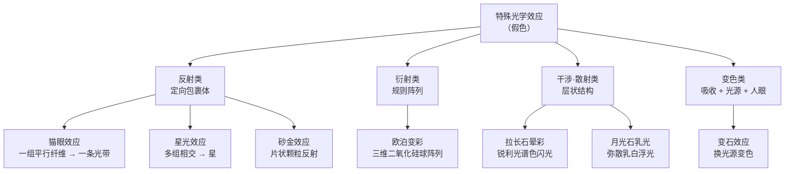

# 第 6 章 特殊光学效应：星光、猫眼、变彩、晕彩、变色

> **本章目标**：讲清第 5 章留白的那一类颜色——**假色**[^1]，即不来自吸收、
> 而来自**结构**的光学现象。学完你能：说出星光为什么是六条而不是五条、
> 理解欧泊为什么红色最贵（这是个纯物理的价格逻辑）、
> 知道**星光蓝宝石为什么基本上都是"无烧"的**、
> 以及为什么"星线太完美"反而是危险信号。
>
> 这一章也是全书**最能用眼睛验证**的一章：所有效应都靠肉眼可见，不需要仪器。

## 6.1 假色：颜色不一定来自吸收

第 5 章讲的三种机制（自色、他色、色心）都是**选择性吸收**：宝石吃掉一部分波长，
剩下的透出来。但还有一整类现象与吸收无关：

> **假色**（pseudochromatic）：光与宝石**内部结构**相互作用——
> 反射、衍射、干涉、散射——产生的视觉现象。

关键区别在于：**假色现象随观察角度变化**（因为几何关系变了），
而吸收造成的体色**不随角度变**（多色性除外，那是双折射的事）。

注意最后一类（变色效应）严格说不属于假色——它仍然基于吸收，
但因为它是"现象类"宝石的重要成员，且极易与多色性混淆，所以放在本章一起讲。

[^1]: [假色](../../glossary.md#pseudochromatic)（pseudochromatic）。

## 6.2 猫眼与星光：同一个机制，不同的几何

这两个效应常被当成两回事，其实**物理机制完全相同**：
**定向排列的包裹体或纤维对光的反射**。区别只在于**有几组方向**：

| | **猫眼效应**[^2]（chatoyancy） | **星光效应**[^3]（asterism） |
|---|---|---|
| 包裹体方向 | **一组**平行 | **两组或更多**相交 |
| 视觉结果 | **一条**光带横过弧面 | 多条光带交叉成**星** |
| 代表 | 金绿宝石猫眼（最负盛名） | 星光红宝石/蓝宝石 |

### 为什么刚玉的星光是六条

因为**射线数由主晶的对称性决定**——包裹体只能沿晶体结构允许的方向生长。

刚玉是三方/六方结构，其中的**金红石针**（TiO₂，宝石学称之为"**丝**"[^4]，silk）
沿**三个方向**排列、彼此相交 **60°**。光打在密集排列的针上，
会沿**垂直于针**的方向反射成一条亮线——三组针给出三条亮线，
交叉后就是**六条射线的星**。

> **一处术语差异要提醒**：有资料说"三组针相交 60°"，也有资料说"射线呈 120° 交角"。
> **两者描述的是同一个几何**，只是测量约定不同（三个方向按 60° 间隔排列，
> 相邻射线的夹角按怎么数可以是 60° 或 120°）。遇到这类"数字对不上"，
> 先想想是不是量的不是同一个角。

其他品种因对称性不同，射线数可以是 **4、6、8 甚至 12** 条：
铁铝榴石（4 或 6 射，金红石针）、顽辉石、尖晶石、月光石（定向的钠长石片）、
芙蓉石（两个主方向的金红石纤维）等。

### "丝"的一个重大后果：星光宝石基本都是"无烧"的

这是本章最有商业价值的一条知识：

> 金红石丝是刚玉在**缓慢冷却**过程中从晶格里**析出**（exsolution）形成的。
> 反过来——**加热到约 1400 °C 以上，丝会重新溶回刚玉晶格**。
>
> 对**刻面**蓝宝石来说，这是**想要的**：溶掉丝能提高透明度与净度（第 10 章的热处理）。
> 但对**星光**宝石，这是**毁灭性**的：丝溶了，星就没了。
>
> **所以星光刚玉在实践中基本上是未经高温热处理的**——
> 这与刻面刚玉"绝大多数都经过热处理"的情况正好相反。

顺带解释了第 2 章那条清洗禁忌：**星光宝石不应超声波清洗**——
因为它内部本来就密布大量定向针状包裹体，是天然的应力集中面。

还有一个细节：多数蓝色、粉色、紫色的星光靠**白色的金红石丝**；
而**黑色星光蓝宝石**（常见于泰国）往往含**赤铁矿**丝。

### 怎么评价，以及怎么识破造假

**评价星光/猫眼的四个维度**（市场惯例，非标准）：

| 维度 | 好的表现 |
|------|---------|
| 星线/眼线**锐利度** | 线条清晰、不发散 |
| **居中与完整** | 星心在弧面正中、六条腿等长完整（缺腿明显减分） |
| **移动感** | 转动或移动光源时，星/眼**顺畅地随之移动** |
| **体色与透明度** | 底色好、不过于浑浊（但效应类宝石通常不追求高透明） |

**造假与仿制的识别**（来自 GIA 实验室与专业资料）：

> ⚠️ **对效应类宝石，"完美"本身就是危险信号。**

| 手法 | 特征 |
|------|------|
| **合成星光刚玉**（如历史上著名的 Linde Star，1947 年起产、1974 年停产） | 星光"完美"得不自然——**过于锐利、像画在表面上**，体色过于均匀，星的移动不如天然流畅 |
| **刻线仿星** | 合成刚玉或合成尖晶石**背面刻出三组细线**，反射到顶部形成星。识别：上下部分之间有**明显的分界线** |
| **镜面/箔背**（foilback） | 蓝色镜面或箔片贴在星光芙蓉石背面，强化星光并伪造蓝色。识别：**从侧面看几乎无色** |
| **玻璃仿猫眼** | GIA 曾报告一例送检的"猫眼金绿宝石"实为**人造玻璃**——玻璃能模拟几乎任何体色、透明度与现象 |

[^2]: [猫眼效应](../../glossary.md#chatoyancy)（chatoyancy）。
[^3]: [星光效应](../../glossary.md#asterism)（asterism）。
[^4]: [丝](../../glossary.md#silk)（silk）——宝石学对刚玉中金红石针状包裹体的俗称。

## 6.3 欧泊变彩：一个纯物理的价格逻辑

**变彩**[^5]（play-of-color）是本章机制最漂亮的一个。

### 结构：天然的三维衍射光栅

电子显微镜显示，贵欧泊由**大小均匀的非晶质含水二氧化硅小球**
组成**规则的三维阵列**，球与球之间是微小空隙。
球与空隙的**折射率不同**，于是整个结构成为一个**三维衍射光栅**：
白光被分解成光谱色，各色光波再互相**干涉**（有的加强、有的抵消）——
这就是变彩。

因为它遵循类似布拉格衍射的规律，**每次转动宝石就改变入射角 θ，看到的颜色随之改变**
——这正是变彩"活"的原因。

### 球径决定颜色，稀有度决定价格

| 二氧化硅球直径 | 衍射出的颜色 |
|--------------|------------|
| 最小 | 只衍射紫外（看不见） |
| 约 138 nm | 紫（可见光最短波） |
| 约 150~200 nm | 蓝、紫 |
| 约 200~250 nm | 黄、绿 |
| 约 250~300 nm | 红、橙 |
| 大于约 333 nm | 只在红外衍射 → **无变彩** |

> **典型球径区间各资料略有差异**（常见表述为约 150~300 nm，也有延伸到约 400 nm 的说法），
> 但**规律一致**：球越大，衍射波长越长。

**于是价格逻辑直接从物理推出来**：

> **小球在自然结晶过程中更容易形成 → 蓝色最常见；
> 大球稀少 → 红色最稀有、最贵。**
>
> 所以欧泊的变彩颜色价值序通常是：**红 > 橙 > 绿 > 蓝**（市场惯例，与稀有度一致）。

这是全书少见的"**价格完全由物理稀有度解释**"的例子——没有营销成分。

### 变彩 ≠ 乳光

普通欧泊（业内称 potch）里，二氧化硅球**大小不一、排列混乱**，
没有规则阵列，光被**随机散射**，产生的是**乳光**[^6]（opalescence）——
一种乳白色、珍珠般的朦胧感，**没有清晰的彩色斑块**。

> ⚠️ **术语陷阱**：中文与英文里都常把"opalescence"用来泛指欧泊的光泽，
> 但严格说**乳光与变彩是两个不同现象**。
> 商品描述里说"有欧泊光泽"而不说"有变彩"，通常意味着它是普通欧泊。

### 拼合欧泊：二层石与三层石

因为优质欧泊薄而脆，市场上大量使用**拼合石**（第 1 章的定名规则在此适用）：

| 类型 | 结构 | 识别 |
|------|------|------|
| **二层石**（doublet） | 薄片欧泊 + 深色底衬（如缟玛瑙）粘合，衬底让变彩更醒目 | **除非被包镶挡住，侧面能看到明显的分界线** |
| **三层石**（triplet） | 二层石之上再加一个**无色圆顶盖**（水晶、合成无色尖晶石或合成无色蓝宝石） | 更耐用，但**通常缺少优质二层石的自然感**；侧面看层次 |

> **注意这不是造假**——拼合石是合法商品，但**必须按国标逐层定名并加"拼合石"三字**（第 1 章）。
> 问题永远出在"没说"，而不是"拼合"本身。

[^5]: [变彩](../../glossary.md#play-of-color)（play-of-color）。
[^6]: [乳光](../../glossary.md#opalescence)（opalescence）。

## 6.4 晕彩与乳光：两种长石效应的区别

长石族给出两种极易混淆的效应，英文都归入"**schiller**"这个大词下：

| | **晕彩**[^7]（labradorescence，拉长石） | **月光效应/乳光**[^8]（adularescence，月光石） |
|---|---|---|
| 视觉 | **锐利的光谱色闪光**（蓝、绿、金、紫） | **弥散的乳白或蓝白"浮光"**，像光在石头里飘 |
| 结构 | 层状出溶结构，层厚接近光波长，层常沿**解理面**排列 → 闪光有**方向性** | 正长石与钠长石**交替层**（缓慢冷却时出溶） |
| 主导机制 | **薄膜干涉**（折射率差足够大 → 强相干干涉） | **散射**为主：层较厚（常大于约 200 nm）且间距不规则 → 漫散射；蓝白色调主要来自**瑞利散射**（短波蓝光散射更强） |
| 层厚数据 | — | 最好的蓝色乳光（斯里兰卡正长石月光石）钠长石层约 **100 nm**；也有资料给出隐纹长石中层厚约 0.5 μm 的表述 |

> **为什么一个"闪"一个"发光"**：折射率差与层的规则程度决定了是**相干干涉**（锐利彩闪）
> 还是**漫散射**（柔和辉光）。拉长石折射率差够大且层排列规整 → 闪；
> 月光石折射率差较小、层较厚且不规则 → 弥散。

**一个市场必知的混淆**：

> ⚠️ **"彩虹月光石"实际上是拉长石**（斜长石族），**不是**正长石月光石。
> 它显示的是**晕彩**而非典型的月光效应。
> 这类"名字借用"在市场上非常普遍——回到矿物名就能拆穿（第 1 章的思路）。

**砂金效应**[^9]（aventurescence）机制又不同：日光石里的**薄片状赤铁矿或铜片**
对光的**反射**——是离散颗粒的反射，而不是出溶层的干涉。

[^7]: [晕彩](../../glossary.md#labradorescence)（labradorescence）。
[^8]: [月光效应](../../glossary.md#adularescence)（adularescence，也译乳光）。
[^9]: [砂金效应](../../glossary.md#aventurescence)（aventurescence）。

## 6.5 变色效应：需要人眼参与的现象

**变色效应**[^10]最有名的载体是**变石**（亚历山大变石，金绿宝石的变色变种）：
**日光下呈蓝绿，白炽灯或烛光下呈紫红**。这个现象因它得名——"**变石效应**"（alexandrite effect）。

### 物理层面

变色来自 **Cr³⁺** 在 BeAl₂O₄ 结构中的强吸收，**吸收中心落在黄光波段**。
关键条件是：**存在两个低吸收的谱区（透射窗口）+ 至少一个影响中间波长的高吸收区**。

于是：

- **日光**里蓝绿成分相对多 → 透过蓝绿窗口的光多 → 看起来**蓝绿**；
- **白炽灯/烛光**里红光成分多得多 → 透过红色窗口的光占优 → 看起来**紫红**。

（同一个 Cr³⁺ 还带来另一个效果：**红色荧光**——吸收紫外后以红光发射。）

### 一个反直觉的补充：光谱不够，还要算上人眼

这是我在查证时发现的、非常值得写进书里的一点。

> **仅用"不同光源下反射比例不同"并不足以解释变石效应**——
> 因为**任何**有色物体在换光源时反射比例都会变，但它们并不"变色"。
>
> 2020 年《Scientific Reports》的一篇研究提出：变石效应要用
> **von Kries 色恒常模型**（人类视觉自动校正光源色温的机制）才能完整解释。
> 计入视锥细胞的响应后可以看到：**变石的"绿刺激/红刺激"比值在不同光源下的变化，
> 远大于普通宽吸收带有色物体**——所以我们的色恒常机制"纠正"不过来，
> 于是感知到了颜色的跳变。

**这意味着变色效应是"物理 + 生理"共同产生的现象**。
也解释了一个常见困惑：**为什么不同人、不同灯下对"变色明显不明显"的判断差别很大**
——因为它本来就与观察条件和视觉适应状态有关。

### 三个必须分清的现象（第 4 章讲过，这里合成一张表）

| 现象 | 触发条件 | 机制 | 稀有度与溢价 |
|------|---------|------|------------|
| **变色效应** | **换光源** | 吸收 + 两个透射窗口 + 人眼色恒常 | 罕见，**显著溢价** |
| **多色性** | **换观察方向** | 双折射的两束光吸收不同 | 常见，本身不构成溢价 |
| **色带分区** | 都不变（颜色固定在某区域） | 生长期化学成分变化 | 通常是减分项 |

> **柜台前一句话拆穿话术**：**"我不动石头，只换灯光，颜色会变吗？"**
> 变色效应答"会"，多色性答"不会"。

[^10]: [变色效应](../../glossary.md#color-change)（color change / alexandrite effect）。

## 6.6 效应类宝石的共同规律

把本章串起来，会发现效应类宝石有三条共同规律：

1. **切工必须服务于效应**。星光与猫眼**必须切成弧面（蛋面）**，
   而且**底面要平行于包裹体所在的平面**，否则星心偏斜、眼线不居中。
   变彩欧泊也切弧面。**这就是为什么效应类宝石几乎不做刻面**。
2. **效应的品质压倒其他所有参数**。星线不锐利的星光蓝宝，即使体色再好也卖不上价；
   反之效应极佳的中等体色反而更贵。**评价体系与刻面宝石完全不同**。
3. **效应可以被伪造，而且伪造得"更完美"**。因为效应是几何现象，
   人工手段（刻线、贴镜、合成）容易做出**过于规整**的效果。
   所以对效应类宝石，**"太完美"是最重要的警示信号**。

## 6.7 常见说法辨析

| 说法 | 判定 | 说明 |
|------|------|------|
| "星光和猫眼是两种不同的原理" | **明确错误** | 同一机制（定向包裹体反射），区别只是**有几组方向**：一组→猫眼，多组→星光 |
| "星光蓝宝石也经过热处理提纯净度" | **明确错误** | 约 1400 °C 以上金红石丝会溶回晶格，**星就没了**。所以星光刚玉在实践中基本是无烧的 |
| "星线越锐利越好，越像画上去的越值钱" | **明确错误** | 恰恰相反——**过于锐利、像画在表面上**是合成星光（如 Linde Star）与刻线仿星的典型特征 |
| "欧泊红色最贵是因为红色好看/中国人喜欢红" | **不完整** | 主要是**物理稀有度**：红色需要大球（约 250~300 nm），而自然结晶中小球更易形成，所以蓝色最常见、红色最稀有 |
| "有欧泊光泽就是变彩" | **明确错误** | 乳光（opalescence，球体混乱→随机散射）与变彩（play-of-color，规则阵列→衍射）是两个现象。普通欧泊只有乳光 |
| "彩虹月光石是最好的月光石" | **明确错误** | "彩虹月光石"实为**拉长石**（斜长石），显示的是**晕彩**，与正长石月光石的月光效应机制不同——它不是"更好的月光石"，而是**另一种矿物** |
| "拼合欧泊是假货" | **明确错误** | 拼合石是合法商品，但**必须逐层定名并加"拼合石"三字**（第 1 章）。问题在于未如实告知，而非拼合本身 |
| "变石在任何灯下都会变色" | **不准确** | 需要光源的光谱差异足够大（典型是日光 vs 白炽灯/烛光）。而且变色明显程度还与**观察者的视觉适应**有关（§6.5） |
| "转动时颜色变化就是变色效应" | **明确错误** | 那是**多色性**。变色效应必须**换光源**才触发 |

## 6.8 🔎 柜台前的用处

1. **看效应类宝石，先转动它**：星/眼是否**顺畅移动**、星心是否居中、腿是否完整——
   这三项比体色更决定价格；
2. **警惕"太完美"**：星线锐利到像画上去、体色过于均匀 → 怀疑合成或刻线仿星；
   **看侧面**是识破刻线/箔背/拼合的关键动作；
3. **买星光刚玉时可以主动问"有没有烧"**——正常答案是"没有"（烧了就没星了），
   如果销售说"烧过提纯净度"，说明他不懂自己卖的东西；
4. **欧泊看变彩颜色**：红/橙比蓝/绿稀有得多；同时确认是**整块欧泊**还是**二层/三层石**
   （看侧面、看是否被包镶完全挡住）；
5. **听到"彩虹月光石"就换个问法**："证书上写的矿物名是月光石（正长石）还是拉长石？"；
6. **测变色效应只需两盏灯**：不动石头，日光 ↔ 白炽灯。会变才是变色效应。

## 6.9 思考题

1. 为什么猫眼与星光被认为是**同一个机制**？决定"一条线还是一颗星"的是什么？
2. 刚玉的星光为什么是**六条**射线？如果某种宝石的星光是四条，说明了什么？
3. 为什么"星光蓝宝石基本都是无烧的"？请把这个结论的因果链写完整
   （提示：从金红石丝的成因与约 1400 °C 说起）。
4. 欧泊的红色变彩为什么比蓝色贵得多？请用二氧化硅球径与自然结晶的难易度回答。
   这个价格逻辑与钻石的"稀有性溢价"相比，哪一个更"纯物理"？
5. 拉长石的晕彩与月光石的乳光都来自层状结构，为什么一个表现为**锐利的彩色闪光**、
   另一个表现为**弥散的乳白辉光**？请至少给出两个造成差异的因素。
6. 为什么说变石效应"需要人眼参与"？如果只考虑宝石的吸收光谱和光源光谱，
   会漏掉什么？
7. **【案例】** 你在旅游景点看到一枚"天然星光蓝宝石"戒指，特点是：
   **星线极其锐利完整、六条腿等长、体色均匀的中蓝色、价格 800 元**，
   销售说"我们的星比那些贵的还清楚"。请指出这里的**三处**可疑点，
   并写出你会做的两个观察动作。
8. **【案例】** 网店卖"澳洲欧泊吊坠，红光满版，火彩极强，特价 300 元"，
   图片显示背面被金属托完全包住。请分析：
   ①"红光满版"与这个价格是否匹配？为什么？
   ②"背面被完全包住"这个细节为什么值得警惕？
   ③你会要求卖家提供什么信息？
9. **【辨识】** 去[权威图库索引](../../reference/gallery.md)里的 GIA Gem Encyclopedia，
   找到 opal（欧泊）与 labradorite / moonstone（拉长石 / 月光石）的图片。
   对比观察：欧泊的**变彩**、拉长石的**晕彩**、月光石的**乳光**在视觉上分别是什么样的？
   试着用"斑块 / 闪光 / 辉光"三个词把它们对应上，并说明你的判据。

> 📖 **参考答案**（想清楚再看）：[Q1](../../qa/06-optical-phenomena-qa.md#q1) ·
> [Q2](../../qa/06-optical-phenomena-qa.md#q2) · [Q3](../../qa/06-optical-phenomena-qa.md#q3) ·
> [Q4](../../qa/06-optical-phenomena-qa.md#q4) · [Q5](../../qa/06-optical-phenomena-qa.md#q5) ·
> [Q6](../../qa/06-optical-phenomena-qa.md#q6) · [Q7](../../qa/06-optical-phenomena-qa.md#q7) ·
> [Q8](../../qa/06-optical-phenomena-qa.md#q8) · [Q9](../../qa/06-optical-phenomena-qa.md#q9)

## 6.10 本章实操

### 🅐 无器具版 · 任务一：用一盏灯测三种"变色"

这个练习把第 4~6 章的三个易混现象一次分清。任选一颗有色宝石：

| 测试 | 怎么做 | 结果 | 说明什么 |
|------|--------|------|---------|
| 换**方向** | 同一光源下转动石头 | | 变了 → **多色性** |
| 换**光源** | 石头不动，日光 ↔ 白炽灯 | | 明显变了 → **变色效应** |
| 换**角度看闪光** | 转动看是否有游动的彩色斑块/闪光 | | 有 → **变彩/晕彩**类效应 |
| 找**固定分区** | 看颜色是否固定在某个区域 | | 是 → **色带分区** |

> 大多数宝石在换光源时会有**轻微**色感变化（光源色温不同），这是正常的。
> 只有**明显、可复现**的颜色转变才算变色效应。

### 🅐 无器具版 · 任务二：给效应类宝石打分（用电商图或店里样品）

| 观察项 | 记录 |
|--------|------|
| 效应类型（星光/猫眼/变彩/晕彩/乳光/砂金） | |
| 星线/眼线是否**锐利**、是否**居中**、腿是否**完整** | |
| 转动/移动光源时效应是否**顺畅移动** | |
| 是否"完美得可疑"（锐利如画、体色过匀） | |
| 变彩主色（若是欧泊）：红/橙/绿/蓝 | |
| 侧面能否看到**分层**（拼合石线索） | |

> **提醒**：电商图与视频常用强聚光灯打出效应，**静态图几乎无法判断"移动感"**。
> 所以这个练习在店里做才有效；线上只能做"是否可疑"的初筛。

### 🅐 无器具版 · 任务三：查一次矿物名

针对市场上这些商业名，去 GIA Gem Encyclopedia 或权威资料查它的**矿物名**：

| 商业名 | 矿物名是什么 | 显示的是哪种效应 | 与你原本的理解是否一致 |
|--------|------------|---------------|-------------------|
| 彩虹月光石 | | | |
| 月光石 | | | |
| 日光石 | | | |
| 猫眼石（若卖家只说"猫眼"） | | | |

> "猫眼"这一项特别值得做：**"猫眼"是效应名，不是品种名**。
> 有猫眼效应的宝石有十几种（金绿宝石、碧玺、月光石、石英…），
> 价格差很大。销售只说"猫眼"时，你必须问**是什么矿物的猫眼**。

### 🅑 有器具版 · 任务四：用强光手电和放大镜看"丝"与分层

需要强光手电 + 10 倍放大镜。

| 观察 | 方法 | 记录 |
|------|------|------|
| 定向包裹体（丝） | 手电侧照星光/猫眼宝石，看内部是否有**密集定向的针状物** | |
| 星的来源 | 星是**从内部浮起**的，还是**贴在表面/像刻在背面** | |
| 背面刻线 | 若能看到背面，检查有无**规则刻线** | |
| 分层界线 | 从**侧面**看，有无粘合面（拼合石） | |
| 箔背 | 从**侧面**看，体色是否几乎消失（箔背石的典型表现） | |

> **最关键的动作是"看侧面"**。刻线仿星、箔背石、拼合石这三种手法，
> 从正面看都很像真的，**从侧面看几乎都会露馅**——
> 这也是为什么这类商品常用**完全包边的镶嵌**把侧面挡住。
> **看到"底部被金属完全封死"的效应类宝石，要提高警惕**（不必然有问题，但值得追问）。

---

**下一章**：第 7 章 耐久性——硬度、韧性、稳定性。
第 2 章讲了结构决定"怎么裂"，本章讲了结构决定"怎么闪"，
下一章把这些汇总成一个最实际的问题：**这件首饰能不能天天戴**。
