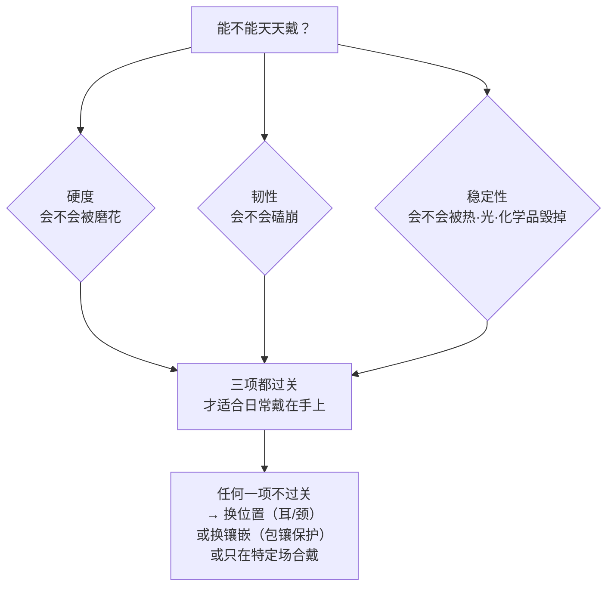

# 第 7 章 耐久性：硬度、韧性与稳定性

> **本章目标**：回答全书最实际的一个问题——**这件首饰能不能天天戴**。
> 学完你能：解释为什么莫氏硬度被严重误读、
> 为什么祖母绿"硬度 7.5~8"却要像绿松石那样小心、
> 为什么把欧泊锁进保险柜反而可能毁了它，
> 以及拿到任何一件首饰时，如何用三个问题判断它该戴在手上还是耳朵上。
>
> 这一章把第 2 章（解理）、第 5 章（光敏性）、第 6 章（效应类宝石）汇总成一套佩戴决策。

## 7.1 三个独立的性质，任何一项短板都能毁掉一件首饰

**耐久性**[^1]（durability）在 GIA 的框架里由**三个独立的性质**构成：

| 性质 | 抵抗什么 | 由什么决定 |
|------|---------|-----------|
| **硬度**[^2]（hardness） | **刻划、磨损** | 晶格中原子间键的强度 |
| **韧性**[^3]（toughness） | **破裂、崩口** | 原子成键的**方式**与结构（有无弱面） |
| **稳定性**[^4]（stability） | **热、光、化学、湿度变化** | 化学与结构的敏感性 |

**关键在于三者互相独立**——一颗宝石可以硬而脆、也可以软而韧：



> **这就是为什么"硬度 10"不等于"随便戴"**，
> 也是为什么翡翠这种硬度只有 6.5~7 的材料能做成薄手镯。

[^1]: [耐久性](../../glossary.md#durability)（durability）。
[^2]: [莫氏硬度](../../glossary.md#mohs)（Mohs hardness）。
[^3]: [韧性](../../glossary.md#toughness)（toughness）。
[^4]: [稳定性](../../glossary.md#stability)（stability）。

## 7.2 硬度：一个被严重误读的标尺

### 莫氏标尺是"排序"，不是"刻度"

莫氏硬度（1812 年由 Friedrich Mohs 提出）的定义是**能不能互相刻划**：
硬的能刻软的，软的刻不动硬的。所以它是**序数标尺（ordinal）**，**不是线性刻度**。

这带来一个几乎所有人都会犯的误读：

> ❌ **错误直觉**："托帕石 8 → 刚玉 9 → 钻石 10，每一级差不多。"
>
> ✅ **事实**：**刚玉（9）到钻石（10）这一级的绝对硬度差，
> 大于滑石（1）一路到刚玉（9）的全程差距。**

**具体差多少？各资料给出的数字差异很大**，这里诚实并列：

| 说法 | 出处类型 |
|------|---------|
| 钻石的绝对硬度约为刚玉的 **4 倍** | 见于多处科普资料，引现代绝对硬度测量 |
| 按 Rosiwal 绝对硬度标尺，这一级的差距**超过一百倍** | 另一处资料 |
| **GIA 的表述最谨慎**：只说"钻石比刚玉**硬很多倍**（many times harder）"，不给具体倍数 | GIA 教育页 |

> **本书的处理**：采用 GIA 的谨慎口径——**"跨度极大"是共识，具体倍数取决于用哪套测量标尺
> （Vickers、Knoop、Rosiwal 各不相同），所以不写死数字**。
> 想要客观数值时，要看的是 **Vickers 或 Knoop 硬度**，而不是莫氏数。

### 硬度的实际意义：灰尘就是砂纸

这是硬度最有用、也最少被讲清的一点：

> **家居灰尘里含有细微的石英颗粒，硬度约 7~7.5。**
>
> 这意味着：**任何硬度低于约 7 的宝石，仅靠日常佩戴与擦拭就会逐渐产生细微划痕。**

所以硬度的实际含义不是"能不能划玻璃"，而是"**几年后它还亮不亮**"：

| 硬度 | 日常磨损表现 |
|------|------------|
| 钻石（10） | 几乎不受灰尘磨损，戴几十年台面依然锐利 |
| 刚玉（9） | 极耐磨，日常佩戴主力 |
| 石英类（7） | 临界——长期会有细微磨痕 |
| 欧泊（5~6.5）、绿松石（5~6）、和田玉（6~6.5）、珍珠（2.5~4.5） | **明显**积累划痕，光泽变钝 |

**两条直接可用的推论**：

1. **擦拭方式**：硬度低于 7 的宝石**先冲水再用软布**，不能干擦
   ——干擦等于拿混着石英的灰尘去磨它；
2. **分开存放**：把蓝宝石戒指和欧泊随意放在一起，
   **蓝宝石会慢慢刮花欧泊**。首饰盒要分格或用软袋。

## 7.3 韧性：和硬度完全是两件事

**韧性**是抵抗**破裂与崩口**的能力。科学上用**断裂韧性**衡量——
把晶体沿某个结晶面分开所需的功。

我查到一组断裂韧性的相对数值，很有说明力，但需要标注清楚：

| 材料 | 断裂韧性（某标尺相对值）[^5] |
|------|------------------------|
| **软玉（nephrite）** | 225,000 |
| **硬玉（翡翠，jadeite）** | 120,000 |
| **钻石** | 5,000（沿解理面）~ 8,000 以上 |
| **刚玉（红蓝宝）** | 600 |

> ⚠️ **本书对这组数字的三点诚实说明**：
>
> 1. 它**只见于一处资料**，且**单位与标尺未明确**，所以只能读**相对关系**，不能当绝对值用；
> 2. 它与 GIA 体系的**定性分级并不完全一致**——在很多宝石学资料里，
>    刚玉的韧性被评为"优良"（毕竟无解理、极耐日常佩戴），
>    而这组数值把它排在钻石之下；差异可能来自测量方式（沿哪个晶面、用什么方法）；
> 3. **共识部分是可靠的**：**玉石类韧性极高 ≫ 钻石中等（有解理）**，
>    这一点各家资料一致。

**三个必须理解的案例**：

| 宝石 | 硬度 | 韧性 | 为什么 |
|------|------|------|--------|
| **钻石** | 10（最硬） | **中等** | 有**四组八面体解理**——原子间距最大的方向就是最弱的方向，重击可沿解理裂开。**"最硬"与"打不碎"是两件事** |
| **软玉/翡翠** | 6~6.5 / 6.5~7（不算硬） | **极高** | **纤维交织结构**把冲击分散开，裂纹从一个小晶体走到边界就被迫转向（第 2 章）。有资料称软玉锤击不碎 |
| **祖母绿** | 7.5~8（挺硬） | **差** | 硬度不低，但内部**大量内含物与裂隙**（生长环境动荡），加上绿柱石本身有解理 → 极易崩裂。**所以它需要像绿松石那样小心** |

> **祖母绿这个案例值得记住**：它是"硬度高 ≠ 耐用"的最佳反例。
> 有资料直接指出：**祖母绿相当硬但不太韧，所需的呵护接近软得多的绿松石**。

[^5]: 断裂韧性定义为"把晶体沿某一结晶面分开两个表面所需的功"。上表数值仅见于一处资料且未标明单位与标尺，本书按查证纪律标注为**单一来源、仅供理解相对关系**。

## 7.4 稳定性：最容易被忽略，也最容易毁东西

稳定性是**抵抗光、热、化学侵蚀与湿度变化**的能力。它常被忽略，
因为它的破坏往往是**渐进的、不可逆的**，而且往往由"清洗"或"存放"这种善意行为造成。

**先给一个重要的平衡说明**（避免读者过度焦虑）：

> **大多数重要宝石非常稳定**——有资料指出，多数主流宝石甚至能抵抗浓酸而不失色。
> **有问题的品种是一个明确的少数派。** 下面讲的就是这个少数派。

### 四类风险与对应品种

| 风险 | 机制 | 高风险品种 |
|------|------|-----------|
| **湿度/脱水** | 失水导致不可逆开裂 | **欧泊**：含水约 **3~21%**，脱水会产生**龟裂**[^6]（crazing）——蛛网状裂纹会散射掉变彩 |
| **热** | 热膨胀、充填物渗出、有机质软化 | **琥珀**（约 100 °C 软化）、**坦桑石**（对热与振动敏感）、**充填祖母绿**（树脂遇珠宝喷灯的热会渗出）、二层/三层石（热水或蒸汽可能**分层**） |
| **光** | 色心衰变（第 5 章） | **紫锂辉石**、**maxixe 绿柱石**、**萤石**；黄水晶、紫水晶、托帕石长期光照也可能变化 |
| **化学** | 溶解、腐蚀、溶剂溶解处理物 | **珍珠**（**弱酸即可溶解**）、**珊瑚**、**橄榄石**（怕酸，连汗液都算）、**充填/浸油宝石**（酒精、丙酮、氨水会溶解处理物）、**多孔宝石**吸收液体 |

**多孔宝石清单**（易吸收液体、香水、化妆品）：
绿松石、珍珠、欧泊、琥珀、青金石、缟玛瑙、玛瑙与玉髓类。

[^6]: [龟裂](../../glossary.md#crazing)（crazing）——欧泊因脱水产生的蛛网状裂纹，**不可逆**。

### 三个反直觉的具体后果

这三条是本章最实用的部分：

> **① 把欧泊锁进保险柜可能毁了它。**
> 保险柜与银行保管箱内部**湿度通常极低**，长期存放会让欧泊脱水龟裂。
> 有个耐人寻味的观察：**古董欧泊戒指反而常常保有完好的变彩**——
> 因为当年的主人把它当晚装首饰偶尔佩戴，平时放在（湿度正常的）首饰盒里。
>
> **② 珍珠应该"最后戴上、最先取下"。**
> 香水、发胶、化妆品、汗液都会侵蚀珍珠层（nacre）；
> 盐水、氯水（游泳池）、家用清洁剂同样削弱它；金属会刮伤它（硬度仅 2.5~4.5）。
> 还有个细节：**孔眼积水会导致变色**，所以接触水后必须彻底干燥，
> 也不要把珍珠整串泡在皂水里。
> （有意思的是，有资料认为**适度佩戴对珍珠有益**——皮肤油脂能滋养珍珠层。
> 所以珍珠怕的是化学品与积水，不是"戴"。）
>
> **③ 给祖母绿"抛光翻新"或用溶剂清洗可能是灾难。**
> 大多数祖母绿有充填（第 1 章：无色油浸属"优化"，名称上看不出来），
> 而溶剂会溶解充填物、热会让它渗出——结果就是第 2 章那个案例里的"越洗越发白"。

## 7.5 从三要素到佩戴决策

现在可以给出本章的核心产出。

**第一步：认识受力等级。** 同一颗宝石戴在不同位置，遭遇的风险完全不同：

```
戒指  ≫  手链  >  胸针  >  项链/吊坠  >  耳环
（磕碰+化学品+磨损）              （几乎只有偶发磕碰）
```

戒指承受磕碰、护手霜、洗手液、清洁剂；而**耳环、吊坠、胸针远离撞击与磨损**。

**第二步：按三要素给品种定位。** 下面这张表整合了本章与前几章的结论
（"建议镶嵌/位置"部分属**市场与工艺惯例**，不是标准）：

| 品种 | 硬度 | 韧性 | 稳定性风险 | 建议 |
|------|------|------|-----------|------|
| 钻石 | 10 | 中等（解理） | 低 | 日常戒指首选；**保护尖角**（第 17、39 章） |
| 红蓝宝（刻面） | 9 | 好 | 低 | 日常戒指首选 |
| **星光刚玉** | 9 | 好 | 内部密布定向包裹体 | 可日常，但**不可超声波**（第 2、6 章） |
| 尖晶石 | 8 | 好 | 低 | 日常可戴 |
| 托帕石 | 8 | **有一组完全解理** | 怕热与温度变化 | 避免戒指受力位置；**不可超声波** |
| 翡翠/和田玉 | 6.5~7 / 6~6.5 | **极高** | A 货稳定；**B 货怕溶剂与热** | 手镯、雕件的理想材料 |
| 祖母绿 | 7.5~8 | **差** | 充填物怕热怕溶剂 | **包镶等保护性镶嵌**；不可超声波/蒸汽 |
| 坦桑石 | 6.5~7 | 较脆 | 怕热、怕振动 | 保护性镶嵌，优先耳饰/吊坠 |
| 月光石 | 6~6.5 | 有解理、较脆 | — | 保护性镶嵌 |
| 碧玺、橄榄石 | 7~7.5 / 6.5~7 | 中等 | 橄榄石怕酸（含汗液） | 保护性镶嵌 |
| 欧泊 | 5~6.5 | 低 | **怕脱水（龟裂）、怕热** | **包镶**；避免干燥环境长期存放；绝不超声波 |
| 绿松石、青金石 | 5~6 | — | **多孔**，吸收液体与油脂 | 避免开放式戒指镶嵌 |
| 珍珠、珊瑚、琥珀 | 2.5~4.5 / 3~4 / 2~2.5 | — | 怕酸、怕化学品、怕热 | **最后戴、最先取**；珍珠除保护性镶嵌外不宜做戒指 |
| **紫锂辉石、萤石、磷灰石** | — | 脆 | **光敏（紫锂辉石）**、极脆 | 有资料建议**最好不做戒指** |

## 7.6 常见说法辨析

| 说法 | 判定 | 说明 |
|------|------|------|
| "钻石硬度 10，最耐用" | **不完整** | 硬度确实第一，但**韧性只算中等**（四组八面体解理），重击可崩。耐用 = 硬度 + 韧性 + 稳定性 |
| "莫氏硬度 9 和 10 只差一级，差不多" | **明确错误** | 莫氏是**序数标尺**。刚玉→钻石这一级的绝对差，大于滑石→刚玉的全程差 |
| "钻石比刚玉硬 4 倍" | **有争议** | 不同标尺给出的倍数差异极大（有说约 4 倍、有说百倍以上）。GIA 只说"硬很多倍"。**本书不写死倍数** |
| "祖母绿硬度 7.5~8，比水晶硬，所以结实" | **明确错误** | 韧性差（内含物、裂隙、解理）。有资料称它所需呵护接近**绿松石**这种软得多的宝石 |
| "硬度够高就不用担心划痕" | **不完整** | 关键阈值是**约 7**（家居灰尘里的石英硬度 7~7.5）。低于 7 的宝石**光靠日常擦拭就会磨花** |
| "宝石放保险柜最安全" | **明确错误**（对欧泊等） | 保险柜湿度极低，**欧泊会脱水龟裂**。含水/有机质宝石需要正常湿度环境 |
| "珍珠戴多了会坏，要收起来" | **有争议** | 怕的是香水、汗液、氯水、清洁剂与积水，**不是佩戴本身**——有资料认为适度佩戴时皮肤油脂对珍珠层有益。要点是"最后戴、最先取"并擦干 |
| "翡翠硬度不高，容易坏" | **明确错误** | 硬度 6.5~7 但**韧性极高**（纤维交织结构），这正是它能做薄手镯的原因。它怕的是**重击时的整体断裂**与 B 货的溶剂/热 |
| "所有宝石都怕酸怕化学品" | **不准确** | 多数主流宝石相当稳定，有资料称甚至能抵抗浓酸不失色。**问题品种是明确的少数**（珍珠、珊瑚、橄榄石、多孔宝石、充填件） |

## 7.7 🔎 柜台前的用处

1. **成交前问三个问题**，而不是只问硬度：
   **"这个品种有解理吗？""怕不怕热和溶剂？""日常戴在手上合适吗？"**；
2. **看镶嵌是否与品种匹配**：祖母绿、欧泊、坦桑石、月光石**用开放式爪镶做戒指**
   是个警示信号——说明设计方没考虑耐久性（第 39 章）；
3. **低于硬度 7 的宝石，问清清洗方式**，并明确告知店家"不可超声波"（第 2 章）；
4. **买欧泊时问存放建议**：如果销售说"放保险柜最安全"，他不懂欧泊；
5. **买珍珠时确认"最后戴最先取"**，并问接触水后怎么处理（孔眼积水会变色）；
6. **同一颗宝石，换个位置就可能合适**：不适合做戒指的品种，
   做成耳环或吊坠往往完全没问题——**这是最省钱的解决方案**。

## 7.8 思考题

1. 耐久性的三个要素分别抵抗什么？为什么说它们**互相独立**？
   请各举一个"某项优秀但另一项糟糕"的宝石例子。
2. 为什么莫氏硬度 9 到 10 的"一级"比 1 到 9 的"八级"跨度还大？
   如果你需要一个**客观可比**的硬度数值，应该去看什么？
3. 家居灰尘里的石英硬度约 7~7.5。请由此推出**两条**具体的日常保养规则，
   并解释为什么"干擦"对低硬度宝石是有害的。
4. 祖母绿的硬度（7.5~8）高于翡翠（6.5~7），为什么它的实际耐用性反而差得多？
   请从韧性的成因回答。
5. 为什么把欧泊长期锁在保险柜里可能毁掉它？为什么古董欧泊戒指反而常常保存完好？
6. **【案例】** 你在店里看到一枚**开放式四爪镶的祖母绿戒指**，
   销售说："祖母绿硬度 8，比水晶还硬，日常戴完全没问题，我们还提供免费超声波清洗。"
   请指出这段话里的**三处**问题，并说明如果你确实想买这枚戒指，
   应该向店家提出哪两个要求。
7. **【案例】** 朋友买了一串珍珠项链，为了"保养得好"，她的做法是：
   ①每次戴完用湿纸巾擦一遍；②平时锁在银行保管箱；③游泳时也戴着（"珍珠喜欢水"）；
   ④和钻石手链放在同一个首饰袋里。
   请逐条指出问题，并给出正确做法。
8. **【辨识】** 去[权威图库索引](../../reference/gallery.md)里的 GIA 4Cs 或 GIA
   Gem Encyclopedia，搜索 opal 的 **crazing**（龟裂）图片，以及 pearl 的
   **nacre damage / worn nacre**（珠层磨损）图片。
   然后回答：这两种损伤在外观上分别表现为什么？它们是可逆的还是不可逆的？
   这个练习想让你确认的是——**稳定性问题造成的损伤，通常没有"修复"选项**。

> 📖 **参考答案**（想清楚再看）：[Q1](../../qa/07-durability-qa.md#q1) ·
> [Q2](../../qa/07-durability-qa.md#q2) · [Q3](../../qa/07-durability-qa.md#q3) ·
> [Q4](../../qa/07-durability-qa.md#q4) · [Q5](../../qa/07-durability-qa.md#q5) ·
> [Q6](../../qa/07-durability-qa.md#q6) · [Q7](../../qa/07-durability-qa.md#q7) ·
> [Q8](../../qa/07-durability-qa.md#q8)

## 7.9 本章实操

### 🅐 无器具版 · 任务一：给每件首饰做"耐久性三问"

这张表填完，你就有了一份属于自己的佩戴与保养手册：

| 首饰 | 主石 | 硬度 | 有无解理/是否脆 | 稳定性风险（热/光/化学/湿度） | 现在戴在哪 | **应该**戴在哪 | 清洗方式 |
|------|------|------|--------------|------------------------|----------|-------------|---------|
| | | | | | | | |

> **查不到资料时的保守规则**：按"硬度低于 7 + 可能被处理过"处理——
> 温水、中性皂、软布，绝不超声波与蒸汽。

### 🅐 无器具版 · 任务二：检查你的存放方式

| 检查项 | 现状 | 是否有问题 | 改进 |
|--------|------|----------|------|
| 不同硬度的首饰是否分格/分袋存放 | | | |
| 有没有含水/有机质宝石（欧泊、珍珠、琥珀）放在**保险柜或极干燥处** | | | |
| 有没有光敏宝石（紫锂辉石、萤石）放在**能见到日光的位置** | | | |
| 珍珠是否与硬宝石直接接触 | | | |
| 有没有首饰长期堆在一起互相摩擦 | | | |

> 大多数人做完这一项会发现至少一处问题。**存放造成的损伤比佩戴造成的更常见**，
> 因为它是长期、无感的。

### 🅐 无器具版 · 任务三：审一次镶嵌与品种的匹配度

去电商或店里找**三枚彩宝戒指**，判断镶嵌是否与品种的耐久性匹配：

| 商品 | 品种 | 韧性/稳定性弱点 | 镶嵌方式（爪镶/包镶/半包） | 是否匹配 | 我的判断 |
|------|------|--------------|----------------------|---------|---------|
| | | | | | |

> **重点看**：祖母绿、坦桑石、欧泊、月光石这类"需要保护"的品种，
> 有没有用**包镶或半包镶**、宝石是否**凸出于金属之上**（凸得越多越易磕）。
> 这个练习会让你发现：**大量商品的设计并不考虑耐久性**，尤其是低价快消款。

### 🅑 有器具版 · 任务四：找磨损痕迹

需要 10 倍放大镜。找一件**戴了多年**的旧首饰：

| 观察点 | 记录 |
|--------|------|
| 宝石**棱线**是否磨圆钝（硬度不足或长期磨损的证据） | |
| 台面是否有细密划痕（灰尘磨损的痕迹） | |
| 腰棱、尖角处有无**崩口**（韧性问题的证据） | |
| 金属爪是否磨薄、变形、松动（第 39 章） | |
| 低硬度宝石表面光泽是否变钝 | |

> **一个有价值的对照**：如果家里有同样戴了多年的**钻石**和**低硬度宝石**（如和田玉、欧泊），
> 对比两者的表面状态——你会直观看到"硬度 10"与"硬度 6"在几年时间尺度上的真实差别。
> 这比任何表格都有说服力。

---

**下一章**：第 8 章 成因与产地——宝石从哪里来、
以及"产地论"里哪部分是真的价值、哪部分是炒作。
前七章讲的都是宝石**本身**的性质，下一章开始讲它的**身世**。
