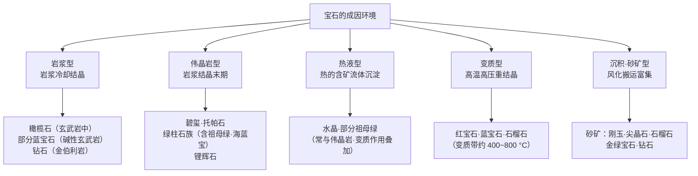
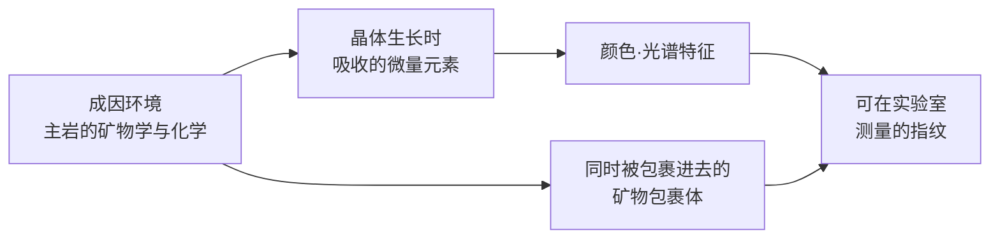

# 第 8 章 成因与产地

> **本章目标**：讲清宝石**从哪里来**，以及"产地论"里哪一部分是真价值、哪一部分是故事。
> 学完你能：解释为什么祖母绿天生多裂隙（这是成因决定的）、
> 知道产地判定**是怎么做的**以及它**什么时候做不了**、
> 看懂"克什米尔溢价 10 倍"这类说法里被悄悄打包进去的东西，
> 以及理解为什么国标**禁止**把产地写进名称。
>
> 前七章讲宝石**本身**的性质，本章开始讲它的**身世**——
> 而身世恰恰是彩宝市场上溢价最高、也最容易被讲故事的部分。

## 8.1 一个问题：产地凭什么值钱

先看两组真实的市场事实：

- 一颗优质**无烧克什米尔蓝宝石**（配可信产地证书），拍卖价可达每克拉 **5 万~20 万美元**；
- 2015 年 5 月，25.59 克拉的缅甸"鸽血红"红宝石"**日出红宝**"（Sunrise Ruby）
  在苏富比日内瓦以 **3042 万美元**成交（约每克拉 119 万美元），
  创下红宝石及除钻石以外所有彩色宝石的拍卖纪录。

同时看一条**国标规定**（第 1 章讲过）：

> **产地不应参与定名**（GB/T 16552）——"南非钻石""缅甸蓝宝石"这类定名是不允许的。

这两件事同时成立，说明产地在市场上**极其值钱**，但在标准体系里**不是宝石的身份**。
本章要解决的就是这个张力：**产地的价值有多少来自物理稀缺，有多少来自故事**。

## 8.2 宝石从哪里来：五类成因

几个值得记住的具体事实：

| 事实 | 说明 |
|------|------|
| **钻石形成于地下 150 公里以上的深处** | 只有地幔那样的极端压力才能生成金刚石；**金伯利岩**是把它们带到地表的"电梯"，也是全球主要的钻石原生矿 |
| **变质带温度约 400~800 °C** | 火成岩体周围的变质带在这个区间形成红宝石、蓝宝石、石榴石 |
| **伟晶岩是"巨晶工厂"** | 岩浆结晶的**末期阶段**，富水热液富集了不相容元素，常形成孤立的囊状或脉状空间——这就是碧玺、托帕石、绿柱石族大晶体的来源 |

### 祖母绿的成因：一个能解释很多事的案例

GIA 把祖母绿矿床按环境分类：**Type I（构造-岩浆相关）**与 **Type II（构造-变质相关）**。
其中 **Type IA**（赋存于镁铁质-超镁铁质岩中）约占**全球产量的 70%**（巴西、赞比亚、俄罗斯），
特征是**伟晶岩或石英脉侵入 + 大规模热液循环与交代作用**，形成去硅化伟晶岩与黑云母片岩。

赞比亚的例子很能说明这种环境有多"局部"：

> 矿体赋存于富铬的滑石-绿泥石±阳起石±磁铁矿变基性岩（被认定为变质科马提岩）中，
> 而**有经济价值的祖母绿几乎完全局限在石英-电气石脉与变基性岩之间的
> "金云母反应带"内——这个带通常只有 0.5~3 米宽**。

**这个成因环境解释了第 7 章的一个结论**：祖母绿之所以韧性差、几乎必然含大量裂隙，
正是因为它生长在**构造活动剧烈、流体反复穿插**的环境里——
它是在"地质动荡"中长出来的。**成因决定了它的物理宿命。**

### 砂矿：为什么很多宝石来自河床

**砂矿**[^1]（placer / alluvial deposit）是原生矿经**风化、侵蚀、搬运**后在河床、
冲积层中富集形成的次生矿床。它在宝石业里极其重要，
一个常被提到的原因是：**原生矿往往不经济或难以到达**，而砂矿开采门槛低得多。

砂矿还有一个隐含的"筛选效应"值得注意：

> 宝石在河流中被反复搬运碰撞，**脆弱的、裂隙多的颗粒会在途中碎掉**，
> 能完整抵达下游的往往是**相对致密耐久**的那些。
> （这是从搬运过程推出的合理推论；**本书未查到直接的量化研究**，
> 所以只作为理解框架，不作为品质判据。）

[^1]: [砂矿](../../glossary.md#placer)（placer / alluvial deposit）。

## 8.3 成因如何变成"可测的指纹"

这是产地判定的**物理基础**，一条完整的因果链：

用一句话概括产地判定的前提：

> **结晶环境（尤其是主岩的矿物学与化学成分）与宝石可在实验室研究的性质之间，
> 存在密切关系。**

这就是为什么产地判定不是玄学——它测的是真实的化学与矿物学差异。
但也正因为它依赖"环境差异"，**当两个产地的地质环境相似时，判定就会失效**（§8.5）。

## 8.4 产地判定怎么做

### 一段简史

| 时间 | 事件 |
|------|------|
| **1940 年 3 月 18 日** | Eduard Gübelin 博士出具**第一份宝石实验室产地报告**——对象是一颗 1.53 克拉的缅甸刻面蓝宝石 |
| 1950 年代 | Gübelin 与 SSEF（均在瑞士）开始系统开展彩色宝石产地判定 |
| 1977 年 | AGL（纽约）加入 |
| 1990 年代末起 | **LA-ICP-MS** 重塑了整个领域 |

### 三类证据

| 证据 | 手段 | 特点 |
|------|------|------|
| **包裹体** | 显微观察 | 直观、无损，但**常常不具诊断性**（见 §8.5） |
| **微量元素化学** | **LA-ICP-MS**[^2]：用紫外激光（典型 193 nm 准分子或 213 nm Nd:YAG）在**30~50 μm** 的微小光斑上剥蚀，再用质谱定量。许多元素检出限可达 **ppb 级** | 目前最有力的手段 |
| **光谱** | UV-Vis、FTIR、拉曼等 | 反映致色机制与结构特征（第 9 章细讲） |

**GIA 对刚玉的做法**叫**选择性作图**（selective plotting）：
用**钒（V）作为第三个维度**，把原本"镁-镓"的二维数据扩展成三维，从而提高分辨力。
有意思的是——**这个方法对玄武岩相关蓝宝石的效果明显好于变质型蓝宝石**，
因为前者的包裹体用处小，微量元素化学承担了更大权重。

### Gübelin 的"整体论"方法

因为单个特征常与其他产地重叠，Gübelin 实验室的策略是**不找单一诊断特征**，
而是**把一颗石头的全部特征（包裹体图景、化学指纹、光谱指纹）合起来同时评估**。

一个教科书级的案例：

> **克什米尔蓝宝石**与某些**斯里兰卡、马达加斯加**的蓝宝石共享大量性质——
> 都有尘状带、片状包裹体、非常相似的光谱与化学特征。
> **但只有克什米尔蓝宝石含韭闪石（pargasite）包裹体。**
>
> SSEF 还指出过更细微的判别点：马达加斯加蓝宝石的云状物周围会发育小金红石针，
> 而克什米尔的没有。

**这就是"整体论"的意义**：单看任何一条都不够，合起来才可能唯一。

[^2]: [LA-ICP-MS](../../glossary.md#la-icp-ms)（激光剥蚀电感耦合等离子体质谱）。

## 8.5 产地判定的能力边界（本章最重要的一节）

市场上很少有人告诉你这一节的内容，但它决定了你该给产地证书多少权重。

### ① 重叠几乎总是存在

> "与大多数地理产地判定一样，**几乎总会有重叠**，
> 而且在很多情况下微量元素化学的证据是**含糊的**。"

对玄武岩相关蓝宝石，含糊的数据通常导致报告写 **"inconclusive"（结论不确定）**[^3]。
**这不是实验室无能，而是科学上诚实的答案。**

### ② 包裹体常常不具诊断性

许多显微特征在**很多产地**的刚玉里都常见——外延生长的金红石、双晶、
勃姆石交叉管等等都是全球普遍现象。所以：

> 包裹体特征必须**极其谨慎**地使用，包括**知道什么时候它们太含糊而不可用**。

### ③ 一个尖锐的矛盾：越干净的石头越难判

这一点特别值得记住：

> **高净度的材料**（例如大理岩型红宝石）**高于定量限的元素更少**，
> 这限制了低丰度元素在当前 LA-ICP-MS 灵敏度下的作用。
>
> 而问题在于——**产地判定的目标恰恰就是高品质宝石**。
> 越是值得判产地的石头，越干净，能测到的元素越少，判定越难。

### ④ 实验室之间会分歧，而且分歧真金白银

这不是理论风险，是有记录的事实：

| 案例 | 结果 |
|------|------|
| 同一颗石头 | **AGL 判马达加斯加、SSEF 判锡兰、AGTA 判缅甸**——三家三个答案 |
| 一颗 8.64 克拉蓝宝石 | **Gübelin 判克什米尔、SSEF 判锡兰**。2017 年苏富比香港成交价 **每克拉 22,000 美元**——**远低于典型克什米尔价格** |

第二个案例把问题量化了：**当两家顶级实验室意见不一致时，市场按"低的那个"定价**。

**这也解释了行业里一个惯例**：一颗**同时持有两家顶级实验室报告且结论一致**的石头，
比只有一份报告的更容易出手、卖得更好。

Gübelin 自己的表述最坦诚：

> 即使对精心采集的分析数据做了娴熟的评估，产地判定**"并非对每一颗石头都可行"**。

[^3]: [结论不确定](../../glossary.md#inconclusive)（inconclusive）——实验室在证据不足时给出的正式结论，是科学诚实的表达，不是缺陷。

### ⑤ 不同品种的可判定程度差别很大

| 品种 | 现状 |
|------|------|
| 祖母绿 | LA-ICP-MS 可较有把握地判定**大多数**产地；但单靠 XRF 只能区分哥伦比亚（低铁）与赞比亚 Kafubu（高铁高铯），其余显著重叠 |
| 变石 | 颜色与包裹体**重叠太多**，标准宝石学测试不够；需 LA-ICP-MS 测 Mg、Fe、Ga、Ge、Sn、B、V、Cr（其中 B 与 Mg 除极高浓度外 XRF 测不到） |
| 帕拉伊巴碧玺 | XRF 的二维散点图即可区分**大部分**巴西、莫桑比克、尼日利亚样品 |
| 刚玉 | 最成熟但也最复杂，见上文 |

> **一个额外收获**：LA-ICP-MS 不只用于产地。**铍扩散处理**的蓝宝石会留下
> 特征化学信号，该技术能高置信度检出——这正是 2000 年代初"铍扩散蓝宝石危机"时
> 行业应对的核心手段（第 10、23 章）。

## 8.6 产地溢价：多少是真的

### 数据本身就很分裂

我查到的产地溢价估计**跨越一个数量级以上**，这个分裂本身就是最重要的信息：

| 说法 | 溢价幅度 |
|------|---------|
| 保守/行业口径 | 克什米尔比同等锡兰或缅甸材料溢价 **30~50% 或更多** |
| 中间口径 | 显赫产地对**视觉特征完全相同**的石头可溢价 **50%~150%** |
| 倍数口径 | 克什米尔比锡兰高 **300%**；无烧缅甸与斯里兰卡 **2~5 倍**；缅甸蓝宝比同等锡兰 **1.5~3 倍** |
| 高端口径 | 克什米尔可达同等外观马达加斯加石头的 **10~15 倍** |

### 三条必须一起理解的结论

> **① 产地是品质的乘数，不是替代品。**
> 产地溢价**只在石头本身已经足够好**时才启动。
> 有资料说得很直接：**产地证书是有价值的文件，但它不会让一颗暗淡、切工糟糕的石头变漂亮。**
> 颜色始终是最重要的变量——一颗 2 克拉的浓艳红宝石，每克拉价格高于一颗 5 克拉的淡色红宝石。
>
> **② 处理状态的影响常常大于产地。**
> 有资料给出的对比：同尺寸同颜色，**处理过的石头可能只值未处理石头的 10~20%**
> ——例如 3 克拉加热蓝宝石每克拉 1,000 美元，而可比的无烧石头每克拉 8,000 美元，
> **单靠"有烧/无烧"就是 5~8 倍的差距**，与许多产地溢价相当甚至更大。
>
> **③ "10~15 倍"这类说法通常把别的东西打包进了"产地"里。**
> 这是本节最关键的洞察：published 数字之所以差这么多，
> **主要取决于比较时有没有把品质与处理状态固定住**。
> 多数"10~15 倍"的说法**隐含地把"无烧溢价"和"顶级颜色的稀有性"算进了产地头上**。

**一个可辩护的工作区间**（本书采纳的口径）：

| 情形 | 合理溢价 |
|------|---------|
| 好但不顶级的石头 + 有文件的显赫产地 | **约 50%~150%** |
| **矿源枯竭**的材料（尤其克什米尔）**且未处理且顶级颜色** | **约 3~15 倍** |

### 溢价的供给端根源（这部分是真的）

克什米尔的溢价有硬邦邦的地质与历史原因：

> 克什米尔原始矿床于**19 世纪末**发现，**仅在 1880 年代被短暂集中开采**，
> 此后产量极为有限。所以优质克什米尔蓝宝石属于世界上最稀有的宝石之列。

缅甸则是另一种约束：地缘政治使开采与出口复杂化，**限制了未来供给**，
所以已经出证的存量材料会随新石头难以获得而升值。

**这类溢价追得到物理与制度上的稀缺**，与第 6 章欧泊红色的逻辑同类——是真的。

### 捕获溢价的四个前置条件

| 条件 | 说明 |
|------|------|
| **必须有文件** | **口头声称的"克什米尔""缅甸"在转手时一文不值**。产地必须由 GIA、Gübelin、SSEF 这类权威实验室出证才在定价上有分量 |
| 拍卖纪录**不是基准** | 纪录价是"极品材料 + 竞价氛围 + 特定时点"三者叠加的结果，**是异常值**。而且顶级拍品往往还叠加了**收藏传承溢价**（王室、名人旧藏、签名珠宝）——那不是地理产地的钱 |
| **流动性差** | 高品质未处理宝石保值能力强，但**变现慢**：需要时间、专业拍卖渠道，还要付不小的交易费用 |
| **尺寸放大一切** | 每克拉单价随尺寸**指数级**上升——同品质 5 克拉红宝石的每克拉价格可能是 1 克拉的十倍 |

> **对买家（而非投资者）而言，真正的风险是**：
> **为一个故事付钱，而不是为一颗石头付钱。**

## 8.7 常见说法辨析

| 说法 | 判定 | 说明 |
|------|------|------|
| "缅甸红宝石就是比莫桑比克的好" | **不准确** | 产地是**品质的乘数**而非替代。一颗颜色一般的缅甸石不如一颗顶色的莫桑比克石。要先比品质，再谈产地 |
| "证书上写了产地就一定可靠" | **不准确** | 实验室**会分歧**（有三家给出三个不同产地的记录）。高价件的行业做法是取**两家顶级实验室结论一致**的报告 |
| "实验室写 inconclusive 说明技术不行" | **明确错误** | 产地间**重叠几乎总是存在**，"结论不确定"是**科学上诚实**的答案。Gübelin 自己承认产地判定并非对每颗石头都可行 |
| "越干净的石头越容易测产地" | **明确错误** | 恰恰相反：高净度材料高于定量限的元素更少，**更难判**。这是该领域一个尖锐的矛盾 |
| "克什米尔蓝宝石贵 10 倍是纯粹的产地溢价" | **不完整** | 这类数字通常**打包了"无烧"与"顶级颜色"的稀有性**。把品质与处理固定住之后，有文件的产地溢价更接近 50%~150% |
| "国标不让写产地，说明产地不重要" | **明确错误** | 两回事：国标管的是**定名**（避免用产地误导消费者、且产地判定本身有不确定性），市场管的是**定价**。产地经检测后可以另行说明 |
| "店家说是缅甸的，价格合理就行" | **风险很高** | **口头产地在转手时价值为零**。如果你为产地付了溢价，就必须拿到权威实验室的产地报告 |
| "砂矿出的宝石品质更差（'二手货'）" | **缺乏依据** | 砂矿只是产出方式。反而有一个合理推论：搬运过程会淘汰脆弱颗粒。品质要看石头本身，不看它是原生矿还是砂矿 |

## 8.8 🔎 柜台前的用处

1. **先看品质，再谈产地**——产地是乘数，乘在一个小数上仍然是小数；
2. **为产地付溢价 = 必须要产地报告**，而且要认出证方（GIA / Gübelin / SSEF / AGL 等）；
   **口头产地不值钱**；
3. **问"有烧无烧"往往比问产地更重要**——处理状态的价差可达 5~8 倍，
   常常大于产地溢价（第 10、22 章）；
4. **看到 inconclusive 不要慌**：那是诚实的结论；
   但它意味着**你不该按产地溢价付款**；
5. **听到"10 倍溢价"就追问三件事**：比较的两颗**品质是否相同**、
   **处理状态是否相同**、**尺寸是否相同**——把这三项固定住，溢价通常回落到 50%~150%；
6. **别把拍卖纪录当行情**：那是极品 + 竞价 + 收藏传承的合成结果。

## 8.9 思考题

1. 为什么"结晶环境与宝石可测性质之间存在密切关系"是产地判定成立的前提？
   这个前提在什么情况下会**失效**？
2. 祖母绿为什么天生多裂隙、韧性差？请从它的成因环境回答，
   并说明这如何印证了第 7 章"结构比成分更决定耐用性"的结论。
3. 为什么说"越干净的石头越难判产地"？这个矛盾为什么对市场特别不利？
4. 实验室 A 判克什米尔、实验室 B 判锡兰，市场会怎么给这颗石头定价？为什么？
   由此推出：如果你要买一颗按产地溢价定价的高价宝石，应该要求什么？
5. 有人说"克什米尔蓝宝石比同外观的马达加斯加贵 10~15 倍"。
   请指出这个数字里可能被**打包进来**的两个非产地因素，
   并说明把它们固定住之后溢价大概回落到什么区间。
6. 为什么国标禁止把产地写进名称，而市场又愿意为产地付巨额溢价？
   这两件事矛盾吗？
7. **【案例】** 店家给你看一颗 2 克拉红宝石，说：
   *"缅甸抹谷的鸽血红，虽然没有产地证书，但我们做了二十年，一眼就能看出来。
   这个价格比拍卖行便宜多了——日出红宝一克拉都上百万美元呢。"*
   请指出这段话里的**四处**问题，并说明你会怎么回应。
8. **【案例】** 两颗 3 克拉蓝宝石，外观几乎一样：
   A 有 SSEF 报告写"斯里兰卡、无加热"，报价每克拉 8,000 美元；
   B 有某本地实验室报告写"克什米尔"，未提处理情况，报价每克拉 3,000 美元。
   请分析：哪一颗更值得买？为什么 B 的"克什米尔"反而应该让你更警惕？
9. **【辨识】** 去[权威图库索引](../../reference/gallery.md)，
   在 GIA *Gems & Gemology* 检索 `geographic origin determination sapphire`
   或 `origin determination inclusions`，找一篇产地判定的研究文章，
   浏览其中的包裹体显微照片与微量元素散点图。
   然后回答：①散点图上不同产地的数据点是**完全分开**还是**部分重叠**？
   ②这对"产地证书的确定性"意味着什么？

> 📖 **参考答案**（想清楚再看）：[Q1](../../qa/08-origin-qa.md#q1) ·
> [Q2](../../qa/08-origin-qa.md#q2) · [Q3](../../qa/08-origin-qa.md#q3) ·
> [Q4](../../qa/08-origin-qa.md#q4) · [Q5](../../qa/08-origin-qa.md#q5) ·
> [Q6](../../qa/08-origin-qa.md#q6) · [Q7](../../qa/08-origin-qa.md#q7) ·
> [Q8](../../qa/08-origin-qa.md#q8) · [Q9](../../qa/08-origin-qa.md#q9)

## 8.10 本章实操

### 🅐 无器具版 · 任务一：抓十条"产地话术"

去电商、直播间或店里，收集 **10 条**涉及产地的描述，逐条分析：

| # | 原文（照抄） | 产地是否写进了**名称**（违反 GB/T 16552） | 有无产地**报告**及出证方 | 是否同时说明**处理状态** | 我的判断 |
|---|------------|----------------------------------|-------------------|-------------------|---------|
| 1 | | | | | |

> **最值得注意的一类**：只强调产地、**不提处理状态**的描述。
> 因为处理状态的价差（可达 5~8 倍）常常大于产地溢价——
> 只说产地不说处理，往往是在用一个溢价掩盖另一个折价。

### 🅐 无器具版 · 任务二：做一次"三项固定"的比价

找两颗同品种、报价差异明显的彩宝（电商上很容易找到），试着把三项固定住：

| 项目 | 宝石 A | 宝石 B | 是否可比 |
|------|-------|-------|---------|
| 重量（克拉） | | | |
| 颜色描述（色调/饱和度/明度） | | | |
| **处理状态**（有烧/无烧/充填/未说明） | | | |
| 产地及**出证方** | | | |
| 报价（每克拉） | | | |
| **把前三项固定后，产地溢价还剩多少？** | | | |

> 大多数人做完会发现：**根本无法固定**——因为卖家不提供处理状态，
> 或颜色只有形容词没有分级。**"无法比较"本身就是结论**：
> 在这种信息条件下，任何产地溢价都是不可验证的。

### 🅐 无器具版 · 任务三：读一份真实的产地报告

在 Gübelin、SSEF 或 GIA 官网找**产地报告的样本**（多数实验室会公开样张），
观察它怎么表述产地：

| 观察点 | 记录 |
|--------|------|
| 产地是写成**结论**还是**意见**（opinion）？ | |
| 有没有关于**不确定性**的声明？ | |
| 处理状态是**单独一项**吗？ | |
| 有没有出现 **inconclusive** 这类表述？ | |

> **一个重要认知**：多数实验室把产地表述为"**意见**"（origin opinion）而非事实结论
> ——这与它们对成分、处理的判定在语气上有明确区别。
> 读懂这个语气差异，比背下哪个产地贵更有用。

### 🅑 有器具版 · 任务四：看包裹体，但只做记录

需要 10 倍放大镜（有显微镜更好）。观察任意刻面彩宝的内含物：

| 观察 | 记录 |
|------|------|
| 包裹体形态（针状/片状/晶体状/云雾状/指纹状/气液两相） | |
| 是否有**定向排列** | |
| 是否有**色带**及其形状（直的/弯曲的） | |
| 我能否据此推测产地？ | |

> **最后一栏的正确答案几乎总是"不能"**——这正是本练习的目的。
> 许多显微特征（外延金红石、双晶、勃姆石管）在**很多产地**的刚玉里都常见；
> 而克什米尔与斯里兰卡、马达加斯加的区分要靠**韭闪石包裹体**这类
> 需要专业训练与设备才能识别的细节。
>
> 但记录本身有价值：**弯曲色带**（合成线索，第 10 章）、
> **规则圆气泡**（玻璃线索）这类特征是你**真的能用**的——
> 分清"我能判断什么"与"我只能记录什么"，是本书反复训练的核心能力。

---

**下一章**：第 9 章 鉴定工具与流程——从 10 倍放大镜到拉曼光谱，
每种手段**能解决什么、不能解决什么**。
本章反复出现"这需要实验室"，下一章就来讲实验室到底在做什么。
