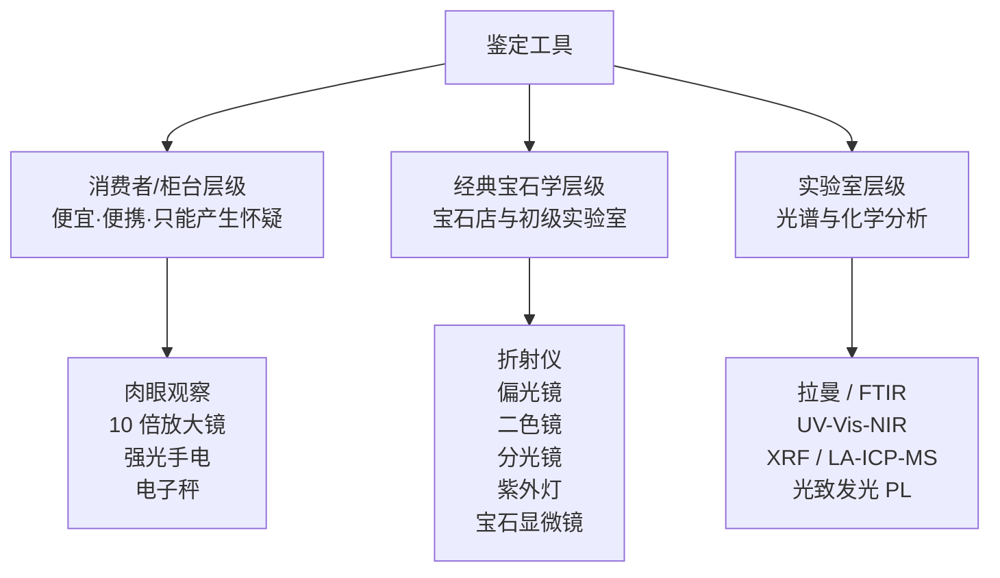
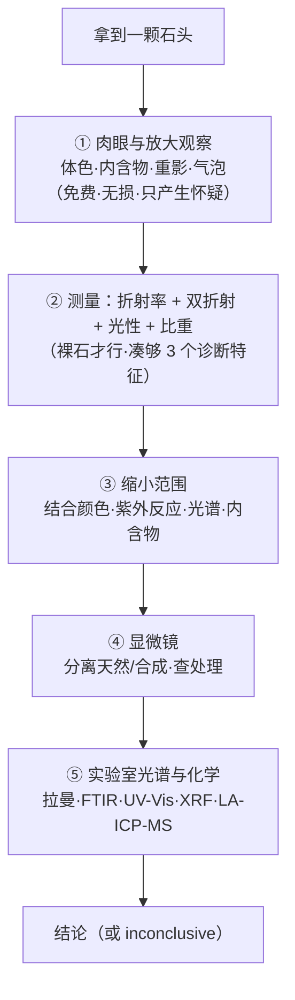

# 第 9 章 鉴定工具与流程

> **本章目标**：把前八章反复出现的那句"这需要实验室"落实成具体的：
> 每种工具**能解决什么、不能解决什么**，以及一套从便宜到贵的鉴定顺序。
> 学完你能：解释为什么**镶嵌之后大部分测试就做不了了**、
> 知道查尔斯滤色镜为什么是**被误用最严重**的工具、
> 以及理解为什么专业鉴定师"第一次测试就得到答案"之后**还要再测三项**。
>
> 这一章也是第 11 章（证书体系）的技术底座：**看懂证书上写了什么检测项，
> 前提是知道每种检测能回答什么问题**。

## 9.1 一个原则：鉴定是排除，不是认出

前面几章已经反复演示过这个逻辑，这里把它明确成本章的第一原则：

> **宝石鉴定的实际过程是"逐步排除可能性"，而不是"一眼认出是什么"。**

一句从专业实践里来的话很能说明纪律的严格程度：

> 即使一颗红色石头**第一次测试就显示出红宝石的光谱**，
> 只依赖这一个诊断特征也属于"平庸的研究、有风险"。
> 规范做法是：**在两个刻面（一个冠部、一个亭部）上取 8 次折射率读数**，
> 再测比重——凑够**三个**诊断特征，然后才上显微镜去分离天然与合成、检查处理。

这条纪律的价值在于：**它把"我觉得是"变成了"数据只允许它是"**。

## 9.2 工具的两个层级

**一个贯穿本章的重要认识**（来自 GIA 的表述）：
**光谱仪是"补充"而不是"取代"经典宝石学——即使有了先进仪器，显微镜仍然是关键。**

## 9.3 第一层：眼、放大镜、手电

这三样最便宜，但能产生的**怀疑**最多。前面几章已经给过具体判据，这里汇总：

| 工具 | 能发现 | 对应章节 |
|------|--------|---------|
| **肉眼 + 换光源** | 体色、多色性 vs 变色效应 vs 色带、效应类宝石的移动感 | 第 4、5、6 章 |
| **10 倍放大镜** | 棱线重影（**必须斜看**）、内含物形态、气泡群、生长纹、弯曲色带、拼合石界线、抛光痕、棱线锐利度 | 第 2、4、6 章 |
| **强光手电** | 内部结构、裂隙、充填痕迹、颜色分布（是否只在表层）、定向包裹体 | 第 5、6 章 |
| **电子秤（0.01 g）** | 静水称重法测比重（**仅裸石**） | §9.5 |

> **这一层的定位必须说清**：它们**只能产生怀疑，不能下结论**。
> 有资料说得很准确：技师用放大镜的观察是**线索，不是确定性测试**。

## 9.4 第二层：经典宝石学四件套

### 折射仪：最有力，但门槛也最硬

第 3 章讲过原理（读临界角）与量程上限（约 1.78~1.81）。这里补两个关键限制：

| 限制 | 说明 |
|------|------|
| **必须裸石** | 折射仪需要宝石与玻璃半球通过**接触液**形成**完美光学接触**。**镶嵌的石头做不到这种接触，因此得不到确定的 RI 读数** |
| 超量程只能"指示" | RI 超过约 1.81 时改用 Gemmeter、Duotester 或钻石笔一类仪器，但这些结果**只能作为指示性**，不构成结论 |

> **所以 RI 是"第一步测试"是有前提的**：它快、结论性强，**但只对裸石成立**。
> 这也解释了一个常见困惑：为什么送检往往要求**脱镶**（第 11 章）。

### 偏光镜：判光性，但有一个不对称的陷阱

**偏光镜**[^1]用于判定单折射 / 双折射、光性符号，还能显示**应变**与**双晶**
（后者偶尔有助于区分天然与合成）。它在显微镜之后是分离天然与合成紫水晶的首选手段
（但新一代合成品让这件事变难了）。

**必须记住的一个不对称**：

> **"单折射"的结果可以放心接受；但"双折射"的反应要更谨慎对待。**

原因就是第 4 章讲过的**异常双折射**（ADR）——钻石、石榴石因内部应变可以在偏光镜下
产生反应，冒充非均质体。所以阳性（双折射）需要复核，阴性（单折射）反而更可靠。

### 二色镜：小而准，专治一类混乱

**二色镜**[^2]是口袋工具，只用于**透明有色**宝石。

| 能做 | 不能做 |
|------|--------|
| 确认双折射（**有多色性就证明是双折射**） | **测不了无色宝石**（没有颜色就没有多色性） |
| 判定一轴晶还是二轴晶——**这一点其他仪器不一定能分** | **单独鉴定不了任何宝石**，只能排除可能性 |
| **解决红色/紫色宝石里 ADR 造成的混乱**：受应力的红石榴石会给出双折射反应，而二色镜能把石榴石与红宝石、合成红宝石、变石（后三者强多色性）分开 | |

> **一个器材选择建议**：**方解石型二色镜优于偏光片型**——
> 方解石型把两种颜色**并排**呈现在同一视场，而偏光片一次只显示一种颜色，
> 细微色差就难以辨认。第 4 章实操里让你用偏光片做替代，
> 现在你知道它的局限在哪了。

### 分光镜：看吸收，是"严肃鉴定"的入口

**分光镜**[^3]通过观察**吸收光谱**做鉴定——这是把第 5 章的致色机制变成可观测证据的工具。
衍射光栅型与棱镜型都可用，带校准 nm 刻度更便于识别特征吸收线（棱镜型刻度更展开）。

> **一个容易踩的坑**：**参考图必须匹配你的仪器类型**，
> 否则棱镜型的谱图与光栅型的谱图对不上，比较起来会一片混乱。

[^1]: [偏光镜](../../glossary.md#polariscope)（polariscope）。
[^2]: [二色镜](../../glossary.md#dichroscope)（dichroscope）。
[^3]: [分光镜](../../glossary.md#spectroscope)（spectroscope）。

## 9.5 比重与紫外荧光

### 比重：高度诊断，但同样怕镶嵌

静水称重法测**比重**在裸石上**高度诊断**——例如它能轻易分开红宝石（约 4.00）
与红石榴石（约 3.80）。

**但镶嵌之后同样不可用**：金属托贡献了自己的质量与体积，结果失去意义。

### 紫外荧光：有用，但不能单独定案

标准做法用**长波 365 nm** 与**短波 254 nm** 两种紫外灯。几个有价值的诊断例：

| 观察 | 含义 |
|------|------|
| 多数**天然祖母绿**在长波紫外下**惰性**，而**助熔剂法合成祖母绿**常显**强红色荧光** | 曾是重要判据 |
| **经加热的天然蓝宝石**在**短波**紫外下发**白垩状的蓝到绿色**荧光 | 热处理线索（第 10 章） |
| 祖母绿的**净度充填物**在长波紫外下可发**亮黄到蓝色**荧光 | **能显示充填的位置**——尤其适用于**无法完整显微观察的镶嵌石** |

> ⚠️ **但荧光不是独立的分离手段**：有资料明确指出，
> **用荧光区分天然与合成祖母绿已不再可靠**——因为两者都会出现各种反应。
> 荧光的正确定位是**提示与定位**（比如找出充填在哪），而不是定性。

## 9.6 查尔斯滤色镜：被误用最严重的工具

这一节单列，因为它是市场上**误用最系统**的一件工具。

### 它到底在做什么

**查尔斯滤色镜**[^4]（Chelsea Colour Filter, CCF）透过两个窄窗
（约 **570~580 nm** 黄绿 + **620~700 nm** 红），吸收中间的波长。
于是含铬的宝石（吸收黄绿、透过红）看起来**发粉或发红**，
而铁主导的宝石显**绿色或无反应**。

**一个来自滤色镜制造方的坦白值得原样记住**：

> 它**并不是对铬起反应**——它做的只是**透过大量红光和一条微弱的黄光窄带**。
> 正因如此，**含铁而不含铬的铁铝榴石也一样显红**。

### 核心误用：它不能区分天然与合成

> **CCF 无法区分天然与合成。** 一颗以铬为主要致色元素的**合成品**，
> 与同样致色的**天然石**反应**完全相同**。

历史上确实有过一个"看起来管用"的阶段：合成祖母绿刚出现时，
因为它们**仅由铬致色且铬含量高**（而天然祖母绿含铬量少），
所以合成品在滤色镜下常显出**"交通灯红"**那样鲜艳的红。

**但这个"强度线索"不可靠**：

> 一些现代合成祖母绿只显**暗红**，而一些**天然**祖母绿**完全不显红**。
> 有宝石学家直接表示："更红"这种说法是主观断言，
> 他**不会拿职业声誉去为它打赌**。

### 假阳性与假阴性一览

| 类型 | 情形 |
|------|------|
| **假阳性**（不是祖母绿也显红） | 红宝石、翡翠、变石等**含铬宝石**都显亮红；含**钴**的蓝色**合成尖晶石**在白光下发红色荧光，同样显红 |
| **假阴性**（是祖母绿却不显红） | **钒（V³⁺）致色**的祖母绿（包括许多巴西祖母绿与某些水热法合成）反应弱或无——因为 V³⁺ 的吸收带与透射窗不匹配；**富铁的赞比亚祖母绿**可能只显弱红甚至无反应。有资料直言：该测试**对非洲与印度祖母绿没有帮助** |
| **操作错误** | **必须用强白炽灯或手电，不能用 LED**——所有公开的反应对照表都假定白炽照明 |

### 它的正确定位

> **"滤色镜不鉴定任何东西。"** 它是一个**早期预警**工具；
> **出现异常结果时，必须立刻用第二种仪器去调查。**

顺带说明配套工具的正确用法：Hanneman-Hodgkinson **合成祖母绿滤色镜**是
CCF 的**后续**而非替代——先用其他方法（如折射仪、比重、分光镜）**确定这是祖母绿**，
再依次过 CCF 与祖母绿滤色镜；**两者都红**才指示合成
（业内的顺口溜是 "red red, drop dead!"）。

[^4]: [查尔斯滤色镜](../../glossary.md#chelsea-filter)（Chelsea Colour Filter, CCF）。

## 9.7 第三层：实验室级仪器各管什么

这一层你不会自己买，但**必须知道每种能回答什么问题**——
因为第 11 章你要读的证书，就是这些仪器的输出。

| 仪器 | 主要回答的问题 | 典型用途与例子 |
|------|--------------|--------------|
| **拉曼光谱**[^5] | **这是什么？包裹体是什么？**（种属/物相鉴定） | 用激光照射、记录晶格振动的散射谱，与参考库比对。**最有力的用途在包裹体**——包裹体既能指示天然还是实验室生长，也能指示产地（GIA 曾报告与**云母**一致的包裹体拉曼谱，常见于**莫桑比克红宝石**）。也用于识别淡水珍珠中的多烯色素 |
| **FTIR（红外光谱）**[^6] | **有没有充填/浸渍？有没有热处理？** 部分天然 vs 实验室生长 | 常规用于刚玉、金绿宝石、玉、石英。一个具体判据：三个方向的 FTIR 谱因**缺少 3232 cm⁻¹ 峰**而判定"无处理指示"。也用于识别天然与实验室钻石、揭示钻石类型、氮聚集态与晶格缺陷 |
| **UV-Vis-NIR**[^7] | **它为什么是这个颜色？** | 原理与手持分光镜相同，但应用最广——颜色是彩宝的核心价值因素。也参与产地判定（如指示高铁产地），并区分商业类别：**高钴的蓝尖晶石**与**高铁的灰蓝尖晶石**可据此分开，前者更值钱 |
| **XRF（EDXRF）** | **快速、完全无损的元素化学** | 速度快、不损伤，但**测不了轻元素**——这是它与 LA-ICP-MS 的关键分工 |
| **LA-ICP-MS** | **微量元素指纹 → 产地、扩散处理、天然 vs 实验室** | 第 8 章详述。灵敏度可测到 ppm 以下；还能测**暴露在表面的包裹体**的元素含量 |
| **光致发光 PL** | **钻石的主力**：检测处理与合成钻石 | 也用于彩色宝石（如**尖晶石处理**的检测） |

**两条关于这一层的诚实说明**：

1. **UV-Vis-NIR 的解释不能自动化**。有资料指出：拉曼在很大程度上可以自动化，
   而 **UV-Vis-NIR 谱的解释远没有那么直截了当**；而且尺寸、形状、透明度差异大，
   镶嵌首饰、不透明材料、液氮低温测量都需要专门配置。
   **这意味着同一台仪器在不同实验室、不同人手里的产出未必等价**——
   这也是第 8 章"实验室会分歧"的一部分原因。
2. **可靠性靠计量学**：GIA 靠系统性的仪器校准、可追溯标准的验证、
   以及训练有素人员的持续监控，来维持全球实验室之间的一致性。
   **这正是"品牌实验室"值钱的地方**——不是仪器更贵，而是校准与流程可追溯。

[^5]: [拉曼光谱](../../glossary.md#raman)（Raman spectroscopy）。
[^6]: [FTIR](../../glossary.md#ftir)（傅里叶变换红外光谱）。
[^7]: [UV-Vis-NIR](../../glossary.md#uv-vis-nir)（紫外-可见-近红外光谱）。

## 9.8 镶嵌石的困境

把前面的限制汇总起来，会得到一个对消费者非常重要的结论：

> **一旦宝石被镶嵌，大部分经典鉴定手段就失效了。**

| 手段 | 镶嵌后 |
|------|--------|
| 折射仪 | ❌ 无法形成完美光学接触，得不到确定读数 |
| 静水称重比重 | ❌ 金属贡献质量与体积 |
| 完整显微观察 | ⚠️ 亭部与腰棱常被遮挡 |
| 紫外荧光 | ✅ 仍可用（能显示充填位置） |
| 放大镜看重影/内含物 | ⚠️ 部分可用，属"线索非结论" |
| 拉曼、FTIR、UV-Vis-NIR | ⚠️ 需专门配置，部分可做 |

**弥补手段**：暗域照明、光纤照明、（安全可行时的）浸液法，
以及视觉线索——例如**棱线重影**指示莫桑石这类双折射材料。
但要记住：**这些是线索，不是确定性测试。**

> **由此得到两条实际建议**：
>
> 1. **贵重裸石在镶嵌前送检**——那时能做的测试最多、结论最强；
> 2. **买镶嵌成品时，证书的价值更高**（因为你自己几乎测不了），
>    所以更要核验证书本身（第 11 章）。

## 9.9 标准流程：先便宜、先无损

把本章串成一条可执行的顺序：

**这条顺序背后有两个原则**：

1. **先无损、先便宜**：能用眼睛和放大镜排除的，不必上仪器；
2. **让数据驱动结论，而不是让外观驱动**。有资料把经典流程总结为
   **"measure → filter → test"（测量 → 筛选 → 检验）**：
   折射率、比重、双折射**驱动**鉴定，靠的是仪器读数而不是外观。

## 9.10 常见说法辨析

| 说法 | 判定 | 说明 |
|------|------|------|
| "有查尔斯滤色镜就能看出祖母绿真假" | **明确错误** | CCF **不能区分天然与合成**；红宝石、翡翠、变石、含钴合成尖晶石都会显红；钒致色与富铁的祖母绿可能不显红。它只是**早期预警**工具 |
| "滤色镜下变红就是天然祖母绿" | **明确错误** | 见上。而且**合成祖母绿常常更红**（历史上因铬含量高而显"交通灯红"），方向恰好相反 |
| "滤色镜下不变红就不是祖母绿" | **明确错误** | 钒致色（许多巴西料）与富铁（赞比亚料）可能弱反应或无反应；该测试对非洲与印度祖母绿没有帮助 |
| "偏光镜下有反应就是双折射宝石" | **不准确** | 要谨慎：钻石、石榴石因应变可产生**异常双折射**。规则是"**单折射结果可放心接受，双折射反应要谨慎**" |
| "紫外灯下发红光就是合成祖母绿" | **不准确** | 助熔剂法合成常见强红荧光是真的，但**用荧光区分天然与合成祖母绿已不再可靠**——两者都会出现各种反应 |
| "戒指上的石头也能测折射率" | **明确错误** | 折射仪需要**完美光学接触**，镶嵌石做不到。比重也同样不可用（金属贡献质量与体积） |
| "热导笔能测出是不是钻石" | **明确错误** | 莫桑石导热接近钻石，会被判成 Diamond（第 4 章）。要测**电导**或看重影 |
| "有了先进光谱仪，显微镜就没用了" | **明确错误** | GIA 明确表述：光谱仪是**补充而非取代**经典宝石学，**显微镜仍是关键** |
| "第一次测试对上了就可以下结论" | **明确错误** | 专业纪律要求凑够**三个诊断特征**（如 8 次 RI 读数 + 比重），再上显微镜。单一特征属"有风险的平庸研究" |
| "实验室都用同样的仪器，结果应该一样" | **不准确** | UV-Vis-NIR 这类谱图的**解释不能自动化**，且镶嵌件/不透明件需专门配置。一致性靠**校准、可追溯标准与人员训练**来维持——这正是顶级实验室的价值所在 |

## 9.11 🔎 柜台前的用处

1. **贵重裸石在镶嵌前送检**——镶嵌之后折射率与比重都测不了，能做的测试大幅减少；
2. **买镶嵌成品时，证书权重更高**，因为你自己几乎无法验证（第 11 章）；
3. **看到店家用滤色镜"验祖母绿"，可以判断其专业度**——
   正确说法是"这是初筛"，说"变红就是天然"的是外行；
4. **问送检是否需要脱镶**：需要脱镶说明要做的是硬指标（RI/比重/完整显微），
   这通常是好事；
5. **要求证书写明"检测项目"**：只做了名称鉴定，就不能拿它证明处理或产地（第 11 章）；
6. **自己只做记录，不下结论**：本书 🅑 实操的所有观察，
   定位都是"产生怀疑 + 决定是否送检"。

## 9.12 思考题

1. 为什么说"鉴定是排除，不是认出"？请用一颗"超出折射仪量程"的无色石头为例，
   说明排除法是怎么一步步收紧的。
2. 为什么专业鉴定即使第一次测试就对上了，仍要凑够三个诊断特征？
3. 折射仪与静水称重比重，为什么在**镶嵌**之后都不可用？各自的物理原因是什么？
4. 偏光镜的"单折射结果可放心接受、双折射反应要谨慎"这个不对称，
   根源是什么？（提示：第 4 章的一个术语。）
5. 查尔斯滤色镜的两个透射窗（约 570~580 nm 与 620~700 nm）如何解释：
   ①含铬宝石为什么显红；②为什么**含铁无铬**的铁铝榴石也显红；
   ③为什么它**不能**区分天然与合成祖母绿？
6. 为什么"用紫外荧光区分天然与合成祖母绿"已不再可靠，但紫外灯在祖母绿上**仍然有用**？
7. **【案例】** 某珠宝店的橱窗里摆着一块牌子：
   *"本店配备专业查尔斯滤色镜，现场免费鉴定祖母绿真假，变红即为天然，绝不含糊。"*
   请指出这块牌子里的**三处**专业错误，并说明如果你真想确认一颗祖母绿，
   正确的检测顺序应该是什么。
8. **【案例】** 你想买一颗 3 克拉的裸装蓝宝石，卖家说"你先付款，我们镶好了给你，
   顺便帮你送检出证书"。请从本章的技术事实出发，说明这个流程为什么对你不利，
   以及你应该提出什么替代方案。
9. **【辨识】** 去[权威图库索引](../../reference/gallery.md)，
   在 GIA *Gems & Gemology* 检索 2024 年冬季的仪器专题（关键词
   `Raman spectroscopy gemstone` 或 `UV-Vis-NIR gemology`），
   浏览其中一篇的图表。然后回答：①这台仪器的输出是**图谱**还是**结论**？
   ②从图谱到结论之间，需要什么才能完成这一步？
   （这个练习想让你理解：**仪器不产生结论，人产生结论**。）

> 📖 **参考答案**（想清楚再看）：[Q1](../../qa/09-instruments-qa.md#q1) ·
> [Q2](../../qa/09-instruments-qa.md#q2) · [Q3](../../qa/09-instruments-qa.md#q3) ·
> [Q4](../../qa/09-instruments-qa.md#q4) · [Q5](../../qa/09-instruments-qa.md#q5) ·
> [Q6](../../qa/09-instruments-qa.md#q6) · [Q7](../../qa/09-instruments-qa.md#q7) ·
> [Q8](../../qa/09-instruments-qa.md#q8) · [Q9](../../qa/09-instruments-qa.md#q9)

## 9.13 本章实操

### 🅐 无器具版 · 任务一：判断"这个测试能回答我的问题吗"

给下面每个问题，写出**最低需要什么手段**（用本章的层级）：

| 我想知道 | 最低需要的手段 | 能不能在店里做 |
|---------|-------------|-------------|
| 这是玻璃还是天然宝石 | | |
| 这颗祖母绿是天然还是合成 | | |
| 这颗蓝宝石有没有加热 | | |
| 这颗祖母绿有没有充填 | | |
| 这颗红宝石是不是缅甸产 | | |
| 这颗无色石是钻石还是莫桑石 | | |

> 做完你会发现：**只有第一项和最后一项**能在柜台前得到较强的线索，
> 其余全都需要实验室。**这就是证书存在的理由**——
> 也是为什么第 11 章要专门讲怎么读证书。

### 🅐 无器具版 · 任务二：读一份检测报告的"检测项目"

找一份珠宝检测证书（自己的、或电商展示的），只看**检测项目**那一栏：

| 观察点 | 记录 |
|--------|------|
| 列出了哪些检测项目 | |
| 有没有"处理状态"这一项 | |
| 有没有"产地"这一项 | |
| 有没有写明**使用的方法**（如红外光谱、显微观察） | |
| 有没有"未做检测"的声明 | |

> **关键认知**：证书**只对做了的项目负责**。
> 名称鉴定 ≠ 处理检测 ≠ 产地判定，三者需要**不同的仪器**，也往往**分开计费**。

### 🅑 有器具版 · 任务三：把手电和放大镜用出上限

需要 10 倍放大镜 + 强光手电。对同一颗石头做完整观察，按本章顺序记录：

| 步骤 | 观察内容 | 记录 |
|------|---------|------|
| 1 | 肉眼：体色、颜色均匀性、换光源变化 | |
| 2 | 放大镜（**斜看**）：棱线重影 | |
| 3 | 放大镜：内含物形态（针状/片状/气泡/指纹状/云雾状） | |
| 4 | 放大镜：有无**弯曲色带**（合成线索） | |
| 5 | 手电侧照：颜色是否**只在表层**（扩散/覆膜线索） | |
| 6 | 手电：裂隙内有无异常光泽（充填线索） | |
| 7 | 侧面：有无拼合界线 | |
| **结论** | **我怀疑什么？还缺什么证据？下一步做什么？** | |

> **最后一行是本练习的全部意义**。前六行是"记录"，最后一行是"判断"，
> 而正确的判断格式永远是：**怀疑 + 缺口 + 下一步**，
> 而不是"这是真的/假的"。

### 🅑 有器具版 · 任务四（可选）：静水称重测比重

需要 0.01 g 电子秤、细线、水杯。**仅裸石可做**。

比重 = 空气中重量 ÷（空气中重量 − 水中重量）

| 宝石 | 空气中重量 | 水中重量 | 算得比重 | 该品种应有比重（查[常数表](../../reference/constants.md)） | 是否吻合 |
|------|----------|---------|---------|--------------------------------|---------|
| | | | | | |

> **误差来源要知道**：气泡附着、水温、线的浮力、宝石有裂隙或充填物都会让结果偏移。
> 所以自测比重的定位仍然是**缩小范围**——它能轻松分开红宝石（约 4.00）
> 与红石榴石（约 3.80）这种量级差异，但分不开相近的品种。

---

**下一章**：第 10 章 优化、处理与合成——本章讲了"用什么看"，
下一章讲"要看出什么"：主要的处理手段与合成方法各自的原理、识别要点，
以及国标那条"优化 vs 处理"的界线到底划在哪。
