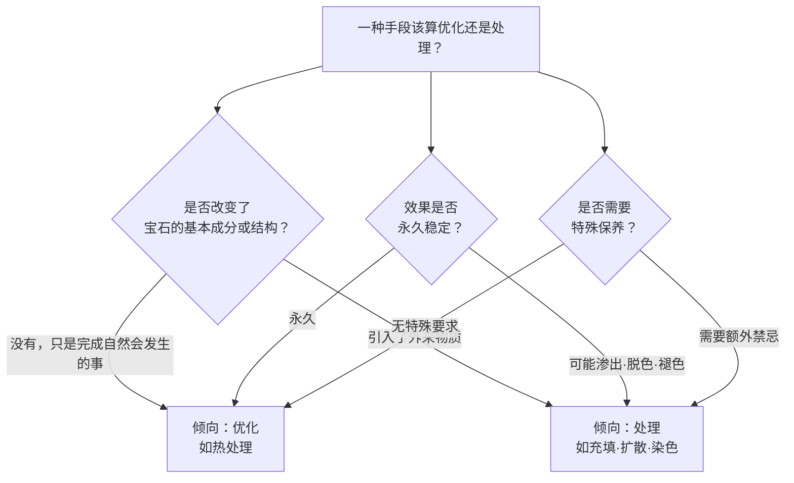
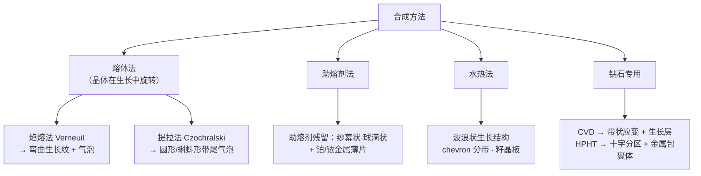

# 第 10 章 优化、处理与合成

> **本章目标**：第一部分最实战的一章。学完你能：说清主要处理手段各自**动了什么**、
> 留下什么痕迹、以及**对耐久性意味着什么**；知道合成宝石的几种生长方式各自的
> 识别特征；并理解一条贯穿全章的规律——**判据的有效性会随技术演进而衰减**。
>
> 这一章是第 1 章（定名规则）的技术展开：第 1 章告诉你名称里出现"处理""合成"意味着什么，
> 本章告诉你**这些字背后到底发生了什么**。

## 10.1 先回到那条界线

第 1 章讲过，国标把"除切磨抛光之外的一切改善手段"统称**优化处理**，并劈成两半：

| | **优化** | **处理** |
|---|---|---|
| 定义 | 传统的、**已被广泛接受** | 非传统的、**尚未被广泛接受** |
| 定名 | 直接用宝石名称，名称里看不出来 | **必须在名称中体现** |
| 典型 | 刚玉的热处理、祖母绿的无色油浸 | 扩散、铅玻璃充填、染色、辐照改色、翡翠漂白充填 |

**本章要补上第 1 章没讲的那一层**：这条线不是随意划的，
它大致对应三个可以验证的判据：

> **一个帮助记忆的角度**：热处理做的事，本质上是**加速了自然界本来在做的事**
> （地质过程中的加热），不引入外来物质，效果永久；
> 而充填、扩散、染色都**引入了本不属于这块宝石的东西**。
> 这也解释了为什么"优化"不需要在名称里体现，而"处理"必须体现。

⚠️ **但仍要记住第 1 章的诚实说明**：这条界线是**约定**而非物理事实，
会随行业共识变化；而且**国标的二分法与国际实验室的表述并不完全一致**——
国际报告一般直接列出"检测到的处理"，不做优化/处理的二分。

## 10.2 处理手段：动了什么、留下什么、要注意什么

### 热处理（刚玉）——最普遍的一种

**原理**（这是第 5、6 章原理的直接应用）：

> 加热使**金红石丝溶解**，钛因此进入刚玉晶格 → **净度提高**；
> 同时**钛与铁的相互作用**（第 5 章的 Fe²⁺→Ti⁴⁺ 电荷转移）可以**改善蓝色**。
>
> 温度范围大致在 **800~1900 °C**；而**低于约 1000~1100 °C 时倾向于让蓝色变浅**。

**识别特征**（显微观察）：

| 特征 | 说明 |
|------|------|
| **金红石丝溶解或部分熔融** | 从锐利的针状变成**羽毛状或点状**；丝原本的彩虹色会褪去 |
| **盘状裂隙**（discoid fractures）**伴张力晕** | 包裹体受热膨胀在周围造成的圆盘状裂隙——**蓝宝石经过加热的有力证据** |
| **包裹体爆裂** | 并有放射状应力裂隙 |
| 矿物包裹体变圆 | 呈"**棉球/雪球**"状外观 |
| 部分愈合的裂隙含**熔融残留** | |
| **指纹状包裹体**特征改变 | 愈合裂隙中的流体包裹体在受热后形态变化 |

> **与第 6 章的呼应**：加热会溶解产生星光的丝——
> 所以**星光刚玉在实践中基本是无烧的**，而刻面刚玉绝大多数经过热处理。
> 同一个物理过程，对两类商品一个是增值、一个是毁灭。

### 扩散处理——把颜色"渗"进去

经典的扩散处理只影响**表层**，所以重新抛磨可能改变颜色。但**铍扩散**不同：

> **铍扩散**（Be-diffusion）从外部引入**铍**，**根本改变了致色机制**。
> 石头被加热到**接近熔点**，让致色元素扩散进去。
>
> ⚠️ **铍能扩散得很深、影响整颗石头**，因此**缺少经典扩散处理的表层特征**
> ——通常仍能看到高温处理的证据，但**扩散本身肉眼无法检测，需要 LA-ICP-MS**。

这就是第 8 章提到的"2000 年代初铍扩散蓝宝石危机"的技术背景：
一种**看不出来、只能靠化学分析检出**的处理，一度让整个市场措手不及。

### 铅玻璃充填（红宝石）——最需要警惕的一种

**工艺**通常两步：

> 先在 **900~1400 °C** 加热去除裂隙中的杂质，
> 再在 **900~1000 °C** 用**铅玻璃混合物**填充裂隙。

**识别特征**：

| 特征 | 说明 |
|------|------|
| **闪光效应**（flash effect） | 最经典的判据，指示裂隙被**高折射率材料**愈合。GIA 的一个案例记录：**明域照明下呈蓝绿色闪光、暗域下呈橙红色闪光、漫射光下有清晰轮廓** |
| 典型闪光颜色 | **蓝色与橙色**的闪光 |
| **扁平气泡** | 充填玻璃中的气泡常被压扁 |
| 大的玻璃充填**空洞** | |
| 表面线索 | 莫桑比克玻璃充填红宝石可通过**低角度观察裂隙中的虹彩**，以及**宽裂隙与表面相交处的光泽变化**来识别 |
| 化学确认 | **EDXRF 可检出铅（Pb）**。一个 GIA 案例中，某激光点测得 **156 ppmw 铍 + 23,300 ppmw 铅**——同一颗石头同时经过铍扩散与铅玻璃充填 |

**⚠️ 耐久性后果非常严重，这是本节最该记住的部分**：

> 玻璃充填/裂隙充填的红宝石**极其脆弱**：
> **许多在珠宝维修、常规清洗或重新抛光过程中被毁掉**；
> 它们还会**被弱酸甚至家用清洁剂损坏**。

把这条与第 7 章连起来：这类商品**不是"打折的红宝石"，而是另一类物品**
——它的稳定性风险远超普通红宝石，而稳定性损伤基本不可逆。

**还有一个变种**：颜色浅、裂隙多的刚玉可能用**钴掺杂玻璃**充填。
识别：漫射透射光下**颜色集中在裂隙中**、**查尔斯滤色镜下显红**（第 9 章的假阳性之一）、
可能显示钴的光谱。

### 翡翠 B 货（漂白 + 聚合物浸渍）

**原理**（两步）：

> ① "**漂白**"——用化学方法去除褐色或灰色成分（很可能是充填在裂隙中的铁化合物）；
> ② **酸洗使结构变得多孔而脆**，因此再用**聚合物树脂浸渍**，恢复透明度与稳定性。

**识别**：

| 手段 | 判据 |
|------|------|
| **FTIR（决定性）** | GIA 1992 年的经典结论至今成立：**红外光谱是迄今唯一能在所有情况下给出结论性证据的方法**。B 货在 **2800~3100 cm⁻¹** 区出现 A 货没有的吸收带，具体为 **C-H 伸缩峰约 2856、2873、2928、2958 cm⁻¹** |
| 拉曼（互补） | 树脂在约 **3000 cm⁻¹** 与 **1610 cm⁻¹** 附近有峰；未处理 A 货在 1100 cm⁻¹ 以上**基本没有拉曼峰**。拉曼更快、无需接触，适合初筛；FTIR 对聚合物检测更可靠 |
| XRD | 物相鉴定最确定的方法（区分硬玉、透闪石、绿辉石等） |
| 显微线索 | 聚合物中被困的**气泡与棉绒**（少数样品可见）、**酸蚀的表面纹理** |

**两个值得知道的事实**：

> 这项处理**最初曾未被一些宝石学实验室检出**，据报导致日本的翡翠销售
> 在三个月内下降 **50%**——这是"判据失效"造成市场信心崩塌的经典案例。
>
> 而 **B+C 货**（浸渍 + 染色）按 SSEF 的说法，
> 与同色的未处理翡翠相比**几乎没有商业价值**。

### 其他常见处理（简表）

| 处理 | 原理 | 识别要点 | 稳定性 |
|------|------|---------|--------|
| **染色** | 染料渗入裂隙与孔隙 | 放大观察：**颜色在裂隙/晶界处浓集**；紫外反应异常 | 可能褪色、遇溶剂脱色 |
| **辐照改色** | 产生色心（第 5 章） | 常需实验室；部分品种有特征光谱 | 视品种：蓝托帕石通常稳定；maxixe 型不稳定 |
| **浸油/树脂充填（祖母绿）** | 填入裂隙、使其"隐形" | 紫外下充填物可发**亮黄到蓝**荧光（能定位）；FTIR 定性 | **怕热怕溶剂**，禁超声波（第 2、7 章） |
| **覆膜** | 表面镀有色薄膜 | 表面光泽异常、边棱处膜层磨损或剥落 | 会磨损脱落 |
| **HPHT 改色（钻石）** | 高温高压改变晶格缺陷 | 需实验室（PL 等） | 效果通常稳定，但**必须披露** |

## 10.3 合成方法：每种生长方式留下不同的"胎记"

**核心逻辑**：合成宝石与天然宝石**成分结构相同**（第 1 章），
所以折射率、比重、硬度都一样——**区分只能靠生长特征**。
而不同的生长工艺，会留下**不同的**痕迹。

### 焰熔法（Verneuil）——最便宜、最好认

**原理**：粉末原料经高温火焰熔化，落在**旋转**的基座上结晶，
形成细长的圆柱状晶体（称 **boule / 梨晶**），再切成多颗成品。

**识别**：

| 特征 | 说明 |
|------|------|
| **弯曲生长纹**（curved striae） | **最具诊断性**。弯曲正是生长时旋转造成的；纹路会**跨过刻面交界处延续** |
| **气泡** | 微小气泡常**沿弯曲纹排列**；气泡串有时**像断裂的丝** |
| 荧光 | 长波短波下都强，**短波下反应最好**，通常**强于天然红宝石** |

**⚠️ 三个观察陷阱（很实用）**：

1. **刻面上的抛光痕可能被误认为生长纹**。正确做法：把显微镜**聚焦到宝石内部的一点**，
   并确认纹路**跨越几个刻面继续延伸**；
2. **垂直于光轴方向观察时，弯曲纹可能显得是直的**——要换角度看；
3. 可能需要**点光源、暗域照明或漫射光**配合**旋转石头**才能看到。

**天然的对照**：天然刚玉是三方晶系，生长面与结构对称一致，
所以**色带与内部分带沿"直的、有角度的"（六方或菱面体）平面**，**而不是曲线**。

**专业上的置信阈值**（值得记住这种"够不够格下结论"的思路）：

> 弯曲纹被视为**接近结论性**的条件是：纹路**明显弯曲**而非直/有角、
> **整颗石头一致地遵循共同的曲率中心**、且**没有冲突的天然包裹体**
> （指纹状包裹体、丝、晶体包裹体、直的有角分带）。

### 助熔剂法（flux）

| 特征 | 说明 |
|------|------|
| **助熔剂残留** | 通常白色、高突起，也可近无色/白/褐/黄橙。形态多样：**两相薄纱状幕**（会**模仿天然的指纹状包裹体**）、粗大球滴状（滴落状、管状、棒状、冰柱状）、虚线状、微粒云 |
| **金属包裹体** | **锐边的三角形或六边形薄片**，或粗短针状的金属（通常是**铂**，来自坩埚）——**强烈指示合成** |
| 也可出现 | 弯曲或 **V 形（chevron）**的助熔剂残留与纱幕——但其**性质**与 Verneuil 干净规则的弯曲纹不同 |

> ⚠️ **一个欺骗性设计**：某些助熔剂法使用**大的天然籽晶**，
> 所以石头里可能有看起来很"天然"的粗丝。
> 破解方法：**高倍检查籽晶周围**——那里会出现典型的纱幕状包裹体。

### 水热法（hydrothermal）

| 特征 | 说明 |
|------|------|
| 总体印象 | **通常很干净** |
| **最具诊断性** | **波浪状生长结构** |
| 刚玉 | 可显示 **chevron（V 形）生长分带**；虽与 Verneuil 纹不同，但需谨慎解释 |
| 常见 | **籽晶痕迹**；类似合成祖母绿的羽状物 |
| **合成祖母绿** | **生长管**与**钉头状针晶**（nail-head spicules）——快速生长与被困流体通道造成；高压釜内衬来的**微小金属薄片** |
| 籽晶线索 | **平坦清晰的内部籽晶板边界**提示水热（但助熔剂法也可有籽晶相关平面） |

**天然祖母绿的对照**：常有不规则的"**花园**"（jardin）、有角度的晶体包裹体，
以及经典的**三相包裹体**（液体 + 气泡 + 微小晶体，气泡常可移动）
——**实验室生长的石头很少有令人信服的三相包裹体**。

### 提拉法（Czochralski）

与助熔剂法、水热法一样，**不显示 Verneuil 那样的弯曲带**。
但由于它同样是**熔体法且晶体旋转**，也可出现弯曲纹与点状气泡；
其典型标志是**圆形或"蝌蚪形"带弯曲尾巴的气泡**。

### 培育钻石：CVD 与 HPHT 的分野

| | **CVD** | **HPHT** |
|---|---|---|
| **应变（正交偏光）** | **弱的、低级的带状异常双折射**——这是最易获得的初筛线索之一 | 应变**极低** |
| **包裹体** | **无金属包裹体**，常含**暗色石墨**或其他矿物包裹体（**无金属光泽**） | 常有**助熔剂金属**包裹体：透射光下黑色不透明、**反射光下有金属光泽** |
| **磁性** | — | **有些含足够的镍铁助熔剂而被磁铁吸引**（一项 2012 年研究中，过半受测 HPHT 钻石有可检测的磁响应） |
| **荧光图案** | DiamondView 下显示清晰的**生长层与线状生长条纹**；绿色荧光 + 弱蓝绿磷光 | **十字形生长扇区结构** → 颜色分布、荧光分区与纹理呈**十字/沙漏图案** |
| **PL 特征** | **硅空位双峰 736.5 与 736.9 nm**（SiV⁻） | 含**催化剂金属**（Ni、Co、Fe 等）的缺陷——用 PL 检出可**正面确认 HPHT 合成** |

**一个进阶细节**（说明"处理会掩盖生长特征"）：

> 经 **HPHT 后处理的 CVD** 钻石，其 PL 谱会显示强 SiV⁻ 双峰、强 NV⁰/⁻ 与强 H3 中心，
> 但**缺少 596/597 nm 中心**——后者在**原生 CVD** 中常见，**会被 HPHT 后处理去除**。
>
> 也就是说：**处理会改写合成的痕迹**，让判定变成多层问题。

**⚠️ 一条实用警示**：

> **II 型钻石**（紫外透过、或 FTIR 检测不到氮的钻石）**应始终送实验室检测**。
> 而实验室需要**完整配置**：DiamondView、FTIR，以及配多种激光的 PL 光谱仪。

## 10.4 一条贯穿全章的规律：判据会衰减

这是本章最重要的元认知：

> **今天有效的识别判据，明天可能失效——因为合成与处理技术在持续演进。**

本书已经积累了三个实例：

| 判据 | 曾经有效 | 现在 |
|------|---------|------|
| 用**紫外荧光**区分天然与合成祖母绿 | 天然多惰性、助熔剂法合成常强红荧光 | **已不再可靠**——两者都会出现各种反应（第 9 章） |
| 用**查尔斯滤色镜**的"红得程度"区分天然与合成祖母绿 | 早期合成铬含量高、显"交通灯红" | **不可靠**——现代合成可能只显暗红，部分天然完全不显红（第 9 章） |
| 用**偏光镜**分离天然与合成紫水晶 | 曾是显微镜之后的首选手段 | **新一代合成品让这件事变难了**（第 9 章） |
| 用**显微特征**识别翡翠 B 货 | — | 该处理**最初曾未被一些实验室检出**，如今**FTIR 才是决定性方法** |

**三条推论**：

1. **老经验会过期**。听到"我做了二十年，一眼就能看出来"时，要问的是
   "**你依据的判据是哪一年的**"；
2. **化学分析越来越不可替代**。铍扩散肉眼不可见、只能靠 LA-ICP-MS；
   翡翠 B 货只有 FTIR 能给出所有情况下的结论——**这类处理把鉴定从"看"推向了"测"**；
3. **这正是权威实验室的价值**：它们要持续更新判据、维护参考数据库、校准仪器
   （第 9 章）。你买证书买的是**持续更新的判断力**，不是一次性的结论。

## 10.5 常见说法辨析

| 说法 | 判定 | 说明 |
|------|------|------|
| "热处理是造假" | **明确错误** | 属国标"优化"，是行业常态、效果永久、不引入外来物质。它加速的是自然界本来在做的事 |
| "红宝石只要是天然的就行，充填不充填不重要" | **明确错误** | 铅玻璃充填红宝石**极其脆弱**：常在**维修、常规清洗、重新抛光时被毁**，**弱酸甚至家用清洁剂**都能损坏它。这是另一类物品，不是"打折的红宝石" |
| "铅玻璃充填能用放大镜看出来，所以不怕" | **不完整** | 闪光效应确实可见（明域蓝绿、暗域橙红），但**同一颗石头可能同时经过铍扩散**（肉眼不可见，需 LA-ICP-MS）。看到一种处理不等于只有一种处理 |
| "翡翠 B 货用手电一照就看出来" | **不准确** | 显微线索（气泡棉绒、酸蚀纹理）只在**部分**样品可见。**FTIR 是唯一在所有情况下都能给出结论性证据的方法**（2800~3100 cm⁻¹ 的 C-H 峰） |
| "合成宝石成分和天然一样，所以测不出来" | **明确错误** | 常数确实相同，但**生长特征不同**：弯曲纹、气泡、助熔剂残留、铂片、波浪状结构、籽晶板——鉴定靠的正是这些 |
| "弯曲生长纹就一定是焰熔法合成" | **不准确** | 需满足置信阈值：明显弯曲、整颗一致遵循共同曲率中心、且无冲突的天然包裹体。而且**抛光痕会伪装成生长纹**，**垂直光轴看弯曲纹会显得是直的** |
| "培育钻石都能用磁铁测出来" | **明确错误** | 只有部分 **HPHT** 钻石含足够镍铁助熔剂而有磁响应（一项 2012 年研究中过半）；**CVD 根本没有金属包裹体** |
| "老师傅经验丰富，比仪器可靠" | **明确错误** | 判据会随技术演进衰减：荧光区分祖母绿、滤色镜看红度、偏光镜分紫水晶都已不可靠；铍扩散与翡翠 B 货**必须靠仪器** |
| "II 型钻石很稀有，是好事" | **不完整** | II 型（FTIR 检不到氮）确实特殊，但**它同时是培育钻石的常见类型**——所以 II 型钻石**应始终送实验室检测** |

## 10.6 🔎 柜台前的用处

1. **红宝石先问"有没有充填"**——这一项的耐久性风险远大于价格折扣本身，
   而且**买了之后不能超声波、不能送去随便抛光**（第 7 章）；
2. **翡翠只认 FTIR 结论**：证书上要能看到红外光谱检测的结论；
   店里的手电、灯光、"敲一敲听声音"都不构成结论；
3. **蓝宝石问"有没有做过扩散"**——铍扩散**肉眼不可见**，必须靠证书；
   而"有没有加热"是另一个独立问题（前者是处理、后者是优化）；
4. **听到"一眼就能看出来"时，问依据的是什么判据**——
   多个经典判据已经失效；
5. **看到"II 型钻石"或无氮描述**，一律送检；
6. **同一颗石头可能有多重处理**（铍扩散 + 铅玻璃充填的案例是真实存在的），
   所以"检出一种"不等于"只有一种"。

## 10.7 思考题

1. 国标把热处理归为"优化"、把充填归为"处理"，请用本章 §10.1 的三个判据
   （是否引入外来物质 / 是否永久稳定 / 是否需要特殊保养）解释这个划分。
2. 为什么加热能同时**提高净度**又**改善蓝色**？请用第 5、6 章的机制回答。
   并说明为什么同样的加热对**星光**蓝宝石是毁灭性的。
3. 为什么"铍扩散"比经典的表层扩散更难识别？它对鉴定手段提出了什么要求？
4. 铅玻璃充填红宝石的"闪光效应"在明域与暗域下分别是什么颜色？
   为什么这类商品的**耐久性风险**比价格折扣更值得关注？
5. 为什么说 FTIR 对翡翠 B 货是"决定性"的？它看的是什么波数区间的什么峰？
6. 合成宝石与天然宝石的折射率、比重、硬度都相同，那么鉴定靠什么？
   请分别说出焰熔法、助熔剂法、水热法各自最具诊断性的特征。
7. 观察弯曲生长纹时有哪三个陷阱？专业上认为弯曲纹"接近结论性"需要满足哪三个条件？
8. **【案例】** 你在市场上看到一枚"天然红宝石"戒指，特点是：
   **颜色浓艳均匀、净度极好（几乎看不到内含物）、价格只有同尺寸普通红宝石的三分之一**，
   店家说"缅甸货，就是裂多点补了一下，不影响"。
   请指出这里最可能是什么情况、你会做哪两个观察动作、
   以及**即使价格便宜也应该慎买**的理由是什么。
9. **【案例】** 朋友买了一件"A 货翡翠"手镯，卖家提供了证书，
   但证书上的检测项目只写了"名称：翡翠"，方法栏写"常规宝石学测试、放大观察"。
   请分析：这份证书能否证明它是 A 货？为什么？你会建议朋友怎么做？
10. **【辨识】** 去[权威图库索引](../../reference/gallery.md)，
    在 GIA *Gems & Gemology* 检索 `curved striae synthetic corundum`、
    `flux inclusions synthetic ruby` 或 `flash effect lead glass filled ruby`，
    找到相应的显微照片。然后回答：
    ①弯曲生长纹与天然刚玉的**直的、有角度的**色带在视觉上如何区别？
    ②助熔剂残留的"纱幕状"外观与天然的"指纹状包裹体"为什么容易混淆？

> 📖 **参考答案**（想清楚再看）：[Q1](../../qa/10-treatment-synthetic-qa.md#q1) ·
> [Q2](../../qa/10-treatment-synthetic-qa.md#q2) · [Q3](../../qa/10-treatment-synthetic-qa.md#q3) ·
> [Q4](../../qa/10-treatment-synthetic-qa.md#q4) · [Q5](../../qa/10-treatment-synthetic-qa.md#q5) ·
> [Q6](../../qa/10-treatment-synthetic-qa.md#q6) · [Q7](../../qa/10-treatment-synthetic-qa.md#q7) ·
> [Q8](../../qa/10-treatment-synthetic-qa.md#q8) · [Q9](../../qa/10-treatment-synthetic-qa.md#q9) ·
> [Q10](../../qa/10-treatment-synthetic-qa.md#q10)

## 10.8 本章实操

### 🅐 无器具版 · 任务一：把处理与保养禁忌对应起来

这张表把第 7 章的保养与本章的处理连起来——**它是你以后送洗送修时的依据**：

| 我的首饰 | 可能/已知的处理 | 由此产生的禁忌 | 送修送洗时必须告知的话 |
|---------|--------------|------------|------------------|
| | | | |

> **填表提示**：祖母绿→假设浸油（禁超声波/蒸汽/溶剂）；红宝石→问是否充填；
> 翡翠→确认 A 货且看是否有 FTIR 结论；蓝色托帕石→多为辐照改色（通常稳定但避免高温）；
> **不确定的一律按最保守处理**。

### 🅐 无器具版 · 任务二：读五份证书的"处理"栏

找五份证书（自己的或电商展示的），只看处理相关信息：

| # | 名称怎么写的 | 有无括号/处理字样 | 备注栏写了什么 | 检测方法写了吗 | 我的解读 |
|---|------------|----------------|-------------|------------|---------|
| 1 | | | | | |

> **重点看两处**：①**名称里有没有括号**（第 1 章：处理必须在名称中体现）；
> ②**备注栏**——"优化"类的方法（如热处理）常常只出现在这里，容易被跳过。

### 🅐 无器具版 · 任务三：查一次"这个品种通常有什么处理"

选三个你感兴趣的品种，去 GIA Gem Encyclopedia 查它的 treatment 部分：

| 品种 | 常见处理 | 属"优化"还是"处理"（按国标） | 名称上能否看出 | 我该问什么 |
|------|---------|------------------------|-------------|----------|
| | | | | |

> 做完你会发现一个规律：**几乎每个品种都有其"标准处理"**。
> 所以正确的心态不是"我要买完全没处理的"，
> 而是"**我要知道它做了什么、价格是否对应、以后怎么保养**"。

### 🅑 有器具版 · 任务四：找处理与合成的痕迹（只做记录）

需要 10 倍放大镜 + 强光手电。按本章的判据逐项检查：

| 观察项 | 看什么 | 记录 |
|--------|--------|------|
| **弯曲生长纹** | 聚焦到宝石**内部**，看纹路是否**跨刻面延续**且明显弯曲（注意：抛光痕会伪装、垂直光轴看会显直） | |
| **气泡** | 圆形/蝌蚪形带尾巴的气泡；是否沿弯曲纹排列 | |
| **纱幕状/球滴状包裹体** | 助熔剂残留（可能模仿天然指纹状包裹体） | |
| **金属薄片** | 锐边三角形/六边形薄片（铂）——强烈指示合成 | |
| **闪光效应** | 明域看是否有蓝绿闪光、暗域看是否有橙红闪光（铅玻璃充填线索） | |
| **裂隙中的虹彩** | 低角度观察 | |
| **颜色浓集处** | 颜色是否集中在裂隙/晶界（染色线索）或只在表层（扩散/覆膜线索） | |
| **盘状裂隙** | 包裹体周围的圆盘状裂隙 + 张力晕（热处理线索） | |
| **结论** | **我怀疑什么？缺什么证据？下一步做什么？** | |

> **本练习的纪律**（与第 9 章一致）：前八行是**记录**，最后一行是**判断**，
> 而判断的正确格式永远是"**怀疑 + 缺口 + 下一步**"。
> 尤其记住：**铍扩散肉眼不可见、翡翠 B 货需 FTIR**——
> 有些东西无论你多努力看都看不出来，**知道这一点本身就是专业**。

---

**下一章**：第 11 章 证书体系——本章讲了实验室要检出什么，
下一章讲这些结论如何变成一张纸，以及那张纸**能证明什么、不能证明什么**。
之后就是第一部分的实战项目 P1。
