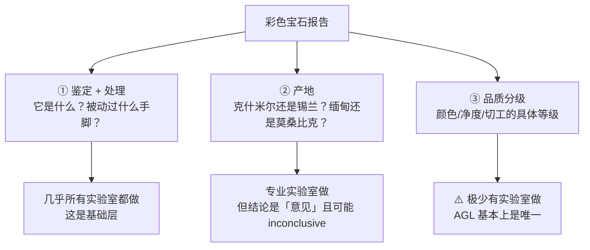
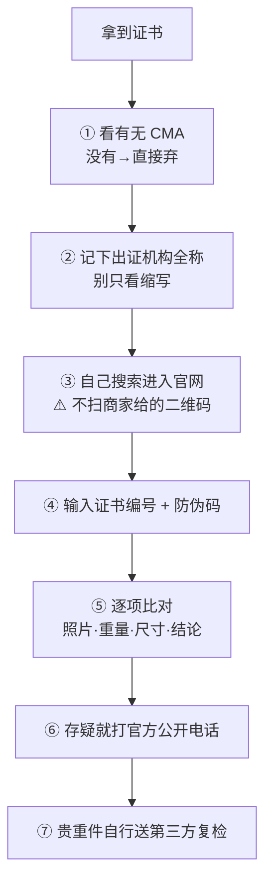

# 第 11 章 证书体系

> **本章目标**：把前十章的技术内容变成一张纸上的字，并教你**怎么读它**。
> 学完你能：说清彩宝的三类报告分别回答什么问题、
> 知道**为什么 GIA 不给彩宝品质分级而 AGL 给**、
> 理解同一颗钻石在不同实验室为什么会差一个等级（**而这不是欺诈**）、
> 认得中国证书上 CMA / CAL / CNAS 三个标志的分量，
> 以及掌握核验证书的正确动作。
>
> 这是第一部分的最后一章。之后的 P1 项目会把 1~11 章串成一套可执行流程。

## 11.1 最根本的一句话：报告是"意见"，不是"保证"

先把整章的地基放好：

> **没有任何实验室提供"保证"或"证书"（certificate）——
> 报告是一位受过训练的工作人员经过审慎判断后给出的"意见"（opinion）。**

这句话解释了本书前面反复出现的现象：为什么两家顶级实验室会对同一颗石头
给出不同的产地结论（第 8 章）、为什么同一颗钻石在不同实验室差一个色级、
为什么第 9 章说"仪器不产生结论，人产生结论"。

**所以中文里习惯说的"证书"其实是个不准确的翻译**——英文正式名称是
**report（报告）**。这个词的差别不是文字游戏：

| 词 | 含义 |
|---|---|
| **证书 / certificate** | 听起来像"担保"，像一种权威背书 |
| **报告 / report** | 一份**专业意见**：谁做的、用什么方法做的、结论是什么、以及**没做什么** |

**读证书的正确姿势因此是**：先看它**做了什么检测**，再看结论——很多人的顺序恰好相反。

## 11.2 彩宝：三类问题，三类报告

彩色宝石的报告按功能分三层，**而大多数实验室只覆盖前两层**：

> **这是理解"该送哪家"的关键结构事实**：
> **AGL 基本上是唯一提供真正彩色宝石品质分级报告的实验室。**

### AGL 的分级体系值得单独了解

AGL（美国宝石实验室，1977 年成立）的报告分层：

| 报告类型 | 内容 |
|---------|------|
| Prestige Standard | 仅**鉴定 + 优化处理** |
| Prestige Origin | 加上**产地** |
| Prestige Grading | 产地 + 鉴定 + 处理 + **品质分级** |

它的分级有两个**反直觉**的地方，看报告时容易读错：

1. **净度用自己的十档体系**，不用钻石那套术语：
   FI（无内含物）/ LI1-2（轻微）/ MI1-2（中等）/ HI1-2（较多）/ EI1-3（极多），
   在 **2.5 倍放大**下判定，综合考虑内含物的大小、性质、数量、位置及**对耐久性的影响**；
2. **颜色分级是"数值越低越好"**：等级基于**主色的纯度**——
   祖母绿越绿、红宝石越红、蓝宝石越蓝，**数值越低**。
   历史上 **3.5** 实际上是宝石能拿到的最好色级，大致相当于钻石的 D 色；
   新的 Prestige 体系放开了 1.00 与 2.00 这样的更高档位。

此外还有 **TQIR**（Total Quality Integration Rating，总体品质综合评级），
用一句话式的文字描述传达整体品质。

## 11.3 主要实验室的分工

**核心认识：它们的差别主要是"专长"而不是"高低"。**

| 实验室 | 定位与专长 |
|--------|-----------|
| **GIA** | 全球普遍接受、**刻意保守**。其彩宝报告聚焦**鉴定与产地**，**有意不给品质分级**——因为品质数字带有主观性、且会随市场潮流波动。所有主要拍卖行都毫不犹豫地接受 GIA 报告 |
| **SSEF**（瑞士宝石研究院） | **刚玉产地的权威**，尤其克什米尔/缅甸/锡兰蓝宝石的产地研究"无与伦比"；也是确认"无烧"的参考机构；欧洲拍卖级材料的标准选择。还开创了用微量元素做**年代测定**的方法 |
| **Gübelin**（1923 年创立于卢塞恩） | **包裹体解读的开创者**，其"有据可查矿区样品"的**参考藏品**是世界上最完整的之一；**祖母绿产地**（哥伦比亚 vs 赞比亚，靠三相包裹体）的研究是行业基准 |
| **AGL**（1977 年） | 美国市场标准，**唯一提供真正品质分级**的（见 §11.2） |
| **GRS** | 主打亚洲市场，以**愿意使用商贸颜色名**著称——"**鸽血红**""**皇家蓝**"。这些名称在亚洲市场能值真金白银 |
| **NGTC**（国检） | 国家级珠宝玉石质检机构，中国市场证书的主要出具方 |
| **IGI** | 商业量大；在**培育钻石**领域是公认的行业标准 |
| **HRD**（安特卫普） | 欧洲市场常见 |

**三个必须知道的细节**：

> **① GRS 的商贸色名是"颜色判定"，不是完整的品质分级。**
> "鸽血红"回答的是颜色属于哪一档描述，不等于对净度、切工的综合评价。
>
> **② 关于 GIA 在彩宝产地上的分量，业内存在真实分歧。**
> 一种说法认为 GIA 不常规提供彩宝产地判定、其彩宝处理分析在贸易中的分量
> 不及 SSEF / Gübelin / AGL；另一种说法则认为 GIA 确实做产地判定且到处受尊重。
> ⚠️ **本书的提醒**：**较严厉的评论往往来自带有商业角度的经销商博客**——
> 读这类比较时要看说话人的立场。
>
> **③ 重要石头会"叠加报告"。**
> 当缅甸红宝石或克什米尔蓝宝石在佳士得、苏富比上拍时，
> 报告通常来自 Gübelin、SSEF 或 GRS，而且**一颗重要石头带两三份报告是常态**。
> **原因是专业分工，而不是谁比谁强**（也呼应第 8 章：两份一致的报告更容易出手）。

**别过度买报告**：对于产地已经很明显的普通石头，额外的产地费**往往不值**。

## 11.4 钻石报告：格式差异 vs 校准差异

这一节要分清两件**完全不同**的事。

### 格式差异（同一家实验室内部）

以 GIA 为例：

| | Diamond Dossier | 完整 Diamond Grading Report |
|---|---|---|
| 净度素描图（plot） | **没有**（改为列出内含物性质） | **有** |
| 详细比例图 | 没有 | 有 |
| 腰部激光刻字编号 | **有** | 视情况 |
| 适用重量 | **0.15~1.99 ct** | 不限 |
| **分级标准** | **完全相同** | 完全相同 |

> **关键**：Dossier 与完整报告的差别是**文件详略**，**不是分级严格程度**。
> 它存在的原因是**成本**——对要给成百上千颗石头出证的切割商来说，价差很可观。
> 好处是：如今大量半克拉以下的钻石也有了 GIA 报告（全是 dossier），
> **这比没有报告好得多**。

⚠️ **一个对两种格式都适用的局限**：GIA 报告上测量值的**四舍五入**，
使它**不足以满足追求"super ideal"圆钻的需求**——想抠到极致的比例分析，需要额外数据。

### 校准差异（不同实验室之间）

**这一项才真正影响一个等级字母的含义**：

| 观察 | 内容 |
|------|------|
| 总体印象 | **GIA 最严格、最保守、最一致**，这正是它在市场上享有溢价的原因 |
| GIA vs IGI 的典型偏移 | 同一颗石头通常差**约 1 个色级和 1 个净度级**，**IGI 更宽松**。例如 GIA 的 G/VS2 在 IGI 可能是 F/VS1；IGI 的 H SI1 在 GIA 可能是 I SI1 甚至 I SI2 |
| **这不是欺诈** | 不同实验室只是**校准尺度不同** |
| HRD 的位置 | 通常认为 GIA 最严、HRD 紧随其后、IGI 略宽松。**但有一次对照测试给出更严厉的结果**：Rapaport 交易网络把**同样 10 颗钻石送 6 家实验室**（GIA、IGI、HRD、EGL USA、EGL 以色列、EGL 香港），发现 GIA 最严，而 **HRD 只排第四严**，仅高于 EGL 以色列与 EGL 香港 |
| IGI 的一致性 | 历史上**因分支机构而异**；其香港实验室的结果被认为与 GIA 相当 |
| 术语差异 | HRD 增设了 "Loupe Clean" 等级；GIA 用 Excellent–Poor，**IGI 在 Excellent 之上还加了 "Ideal"** |
| 市场分工 | GIA 主导天然钻市场，**IGI 主导培育钻**（在培育钻领域 IGI 是公认标准） |

> **由此得到一条硬规则**：
> **绝对不能跨实验室直接比"每一级的价格"**。
> 一颗"IGI F/VS1"与一颗"GIA F/VS1"很可能不是同一档货色——
> 但它们会被摆在一起比价，而这正是价差的常见来源之一（第 8 章 Q4 也是同一逻辑）。

## 11.5 中国证书：CMA / CAL / CNAS 三个标志

中国市场的证书上通常印着这三个标志之一或多个，它们**性质完全不同**：

| 标志 | 全称与性质 | 谁必须有 | 效力 |
|------|-----------|---------|------|
| **CMA** | 中国计量认证（China Metrology Accreditation），由省级以上计量行政部门认证，**强制性、法定** | **所有对社会出具公证性检测报告的机构都必须有，否则违法** | **国内法律效力** |
| **CAL** | 质量监督检验机构授权认可，带**执法性** | 只有**承担政府委托任务**的检测机构需要（以政府部门或国家隶属单位为主）。**前提是先有 CMA** | 法定产品质量检验资格 |
| **CNAS** | 中国合格评定国家认可委员会，**自愿性** | 任何具备相应检测能力的实验室都可申请（含第一方、第二方、第三方） | **国际互认**（已签署 APLAC-MRA） |

**三条实用要点**：

1. **CMA 是底线**：**证书上一个标志都没有，基本可以判定有问题**；
   标志下方还会标注该实验室通过认证的编号；
2. **CNAL 是历史标志**：CNAS 由原 CNAB 与原 CNAL 合并而来，
   所以**老证书上出现 "CNAL" 是正常的**，不是造假；
3. **三个标志性质不同不是"级别高低"**：CMA 强制（国内法律效力）、
   CNAS 自愿（国际互认）。很多机构三个都有，可理解为"三保险"。

⚠️ **一个容易被利用的混淆**：除 NGTC 外，**GIC**（中国地质大学·武汉宝石学院）、
**NGSTC** 等机构也常被笼统称作"国检证书"，**三者缩写相近**——
购买时务必看清**机构全称**，避免被"相似缩写"误导。

## 11.6 证书能证明什么、不能证明什么

这是本章最该记住的一张表（[证书核对清单](../../forms/certificate-checklist.md)是它的可打印版）：

| 证书**能**证明 | 证书**不能**证明 |
|---------------|----------------|
| **送检的那一件**是什么品种 | ❌ 同款、同批、店里其他货是什么 |
| **做了的检测项目**的结论 | ❌ **没做的项目**——名称鉴定 ≠ 处理检测 ≠ 产地判定，三者需要**不同仪器**、往往**分开计费** |
| 依据的方法与标准 | ❌ **价格是否合理**——证书上根本没有"值多少钱"这一项 |
| 出证机构愿意为之承担的信誉 | ❌ **工艺与耐久性**——镶嵌牢不牢、会不会掉钻，证书不管（第 39 章） |
| （若做了）处理状态与产地**意见** | ❌ 未来的价值、是否升值 |

**三个具体推论**：

> **① "名称干净"不等于"没被动过"**（第 1、10 章）：
> 属于"优化"的手段（如热处理、无色油浸）**在名称中不体现**；
> 而"未检出处理"取决于**用了什么方法**——用一套检不出聚合物的方法，
> 自然检不出翡翠 B 货（第 10 章 Q9）。
>
> **② 分级报告 ≠ 估价报告**。GIA 明确区分"分级报告"与"评估（appraisal）"：
> 前者说这颗石头的品质参数，后者才涉及价值。
>
> **③ 产地与品质分级往往需要额外付费的独立项目**——
> 看到"有证书"三个字时，要问的是"**这份证书里有哪几项**"。

## 11.7 核验：正确的动作与假证书的形态

### 假证书最常见的不是伪造版式

**是"真编号 + 改过参数"的复印件**，或者引导你去**仿冒的查询网站**。
所以核验的关键动作是：

**几个具体细节**：

| 细节 | 说明 |
|------|------|
| **重量是最好用的验证项** | 款式雷同时照片难以区分，**精确重量**是另一个有效验证数据；玉器的糖色、手镯的手寸等特色外观也可核对 |
| 查询系统只显示数据 | NGTC 的系统**仅显示证书数据、不显示证书样式**；输入编号要注意**大小写**，编号中若带 "-" 必须输入 |
| ⚠️ **查不到未必是假** | NGTC 官网标注"**仅提供 2026 年 5 月 1 日起出具的检测报告查询**"——**旧证书查不到不代表是假证**，可致电官方热线人工核实 |
| **识别仿冒查询网站** | 看网站的人工咨询电话在工作时间**能否打通**、内容是否**经常更新**；**如果网站只有查询功能而其他内容过于简单，要谨慎** |
| 钻石还要多一步 | **核对腰棱激光刻字与报告编号是否一致** |
| 国际报告也会被伪造 | **伪造的 SSEF 与 Gübelin 报告确实存在**——**汇款前先在实验室官网核验编号** |

## 11.8 为什么实验室之间会分歧

把第 8、9 章的结论汇总到这里，作为"怎么看待证书"的收尾：

| 层次 | 原因 |
|------|------|
| **结论的性质** | 报告是**意见**，不是保证（§11.1） |
| **数据到结论要靠人** | 仪器输出的是图谱，解释依赖参考数据库、判据权重与经验；**UV-Vis-NIR 的解释不能自动化**（第 9 章） |
| **产地本身有重叠** | 不同产地的成分区间**几乎总有重叠**，故有 `inconclusive` 这个诚实结论（第 8 章） |
| **校准尺度不同** | 钻石分级上，GIA 与 IGI 通常差约 1 个色级与 1 个净度级——**不是欺诈** |
| **判据会衰减** | 合成与处理技术在演进，旧判据会失效（第 10 章） |

**所以正确的态度不是"证书不可信"，而是**：

> **知道这份证书的结论是"谁、用什么方法、在什么确定性水平上"给出的。**
> 越贵重的东西，越要看**出证方**、**检测项目**与**方法**，
> 而不是只看结论那一行字。

## 11.9 常见说法辨析

| 说法 | 判定 | 说明 |
|------|------|------|
| "有证书就是真的、就没问题" | **明确错误** | 证书只对**送检的那一件**、只对**做了的项目**负责；且**不证明价格合理、不证明工艺**。假证书的常见形态是"真编号 + 改过的参数" |
| "证书是权威机构的担保" | **不准确** | **没有实验室提供保证**；报告是受过训练的人员给出的**审慎意见**。英文叫 report 而不是 certificate |
| "IGI 的 F 色和 GIA 的 F 色一样" | **明确错误** | 同一颗石头两家通常差**约 1 个色级与 1 个净度级**，IGI 更宽松。**跨实验室不能直接比价** |
| "IGI 不如 GIA，所以培育钻也要买 GIA 证" | **不准确** | 校准确实更宽松，但**在培育钻领域 IGI 是公认的行业标准**。要看用途选实验室 |
| "GIA 的 Dossier 是简化版，分级也更松" | **明确错误** | Dossier 与完整报告**分级标准完全相同**，差别只是有没有净度素描图与详细比例图（以及适用 0.15~1.99 ct） |
| "GIA 什么都测，彩宝也给品质等级" | **明确错误** | GIA **有意不给彩宝品质分级**（避免主观、随市场波动的数字）。**AGL 基本是唯一提供真正品质分级的实验室** |
| "GRS 写了鸽血红，就是最高品质" | **不准确** | 商贸色名是**颜色判定**，不等于对净度、切工的综合评价。它在亚洲市场确实值钱，但那是**颜色档位**的钱 |
| "证书查不到就是假证" | **不准确** | 例如 NGTC 官网标注仅提供**2026 年 5 月 1 日起**出具的报告查询——**旧证书查不到可致电人工核实** |
| "只有 CMA 没有 CNAS，说明机构不行" | **明确错误** | **CMA 是强制的法定要求**（没有才有问题），CNAS 是**自愿**的国际互认。性质不同，不是级别高低 |
| "老证书上写 CNAL，肯定是假的" | **明确错误** | CNAS 由原 CNAB 与原 **CNAL** 合并而来，老证书上出现 CNAL 是**正常的历史标志** |
| "扫证书上的二维码查最方便" | **风险很高** | 二维码可以指向任何网站。正确做法是**自己搜索进入官网**，并留意仿冒查询网站的特征（电话打不通、内容简陋、只有查询功能） |

## 11.10 🔎 柜台前的用处

1. **先看检测项目，再看结论**——"有证书"是没有信息量的话，要问"**这份证书里有哪几项**"；
2. **自己上官网核验，不扫商家二维码**；逐项比对**照片、重量、尺寸、结论**四项；
3. **中国证书先找 CMA**——没有任何资质标志的直接弃；同时看清**机构全称**
   （NGTC / GIC / NGSTC 缩写相近）；
4. **钻石核对腰棱刻字**与报告编号；**不要跨实验室比价**（GIA 与 IGI 通常差约一级）；
5. **彩宝按需求选实验室**：要品质分级找 AGL；刚玉产地与无烧看 SSEF；
   祖母绿产地看 Gübelin；要亚洲市场认的商贸色名看 GRS；要普遍接受看 GIA；
6. **贵重件自己送第三方复检**，并注意国际报告也存在伪造——**汇款前先核验编号**。

## 11.11 思考题

1. 为什么说宝石"证书"更准确的叫法是"报告"？这个区别如何解释
   "两家顶级实验室对同一颗石头给出不同产地结论"这件事？
2. 彩色宝石报告的三个功能层次分别是什么？为什么说"**AGL 基本是唯一**"这句话
   决定了你该把石头送到哪家？
3. GIA 为什么**有意不给**彩色宝石品质分级？请给出它的理由，
   并说明这个选择的代价是什么。
4. GIA 的 Dossier 与完整报告的差别是什么？**不是**什么？
   （请特别说明分级标准是否相同、以及它为什么存在。）
5. 同一颗钻石在 GIA 是 G/VS2、在 IGI 是 F/VS1，这说明有人造假吗？
   由此推出一条关于比价的硬规则。
6. CMA、CAL、CNAS 三个标志的**性质**分别是什么？
   为什么"只有 CMA 没有 CNAS"不能说明机构水平低？
7. 假证书最常见的形态是什么？为什么"扫证书上的二维码去查"是有风险的做法？
8. **【案例】** 你在直播间看到一枚戒指，主播举着证书说：
   *"国检证书，扫码可查，绝对天然，假一赔十。"*
   证书上机构名称是"××省 NGSTC 珠宝检测中心"，标志栏只印了一个 CNAS。
   请指出这里的**四处**可疑点，并写出你会依次做的三个动作。
9. **【案例】** 朋友要买一颗 2 克拉蓝宝石，卖家提供了一份 GRS 报告，
   上面写着"Royal Blue（皇家蓝）"、未提及加热情况，报价按"顶级品质"计。
   请分析：①这份报告证明了什么？②**没有**证明什么？
   ③在成交前你会建议朋友补哪两项信息，为什么这两项可能比"皇家蓝"更影响价格？
10. **【辨识】** 去[权威图库索引](../../reference/gallery.md)，
    打开 GIA 的报告核验入口（Report Check）与 NGTC 官网，
    对比两者的查询界面。然后回答：①各自需要输入什么信息？
    ②查询结果显示的是"证书样式"还是"证书数据"？③这对核验方式意味着什么？

> 📖 **参考答案**（想清楚再看）：[Q1](../../qa/11-certificates-qa.md#q1) ·
> [Q2](../../qa/11-certificates-qa.md#q2) · [Q3](../../qa/11-certificates-qa.md#q3) ·
> [Q4](../../qa/11-certificates-qa.md#q4) · [Q5](../../qa/11-certificates-qa.md#q5) ·
> [Q6](../../qa/11-certificates-qa.md#q6) · [Q7](../../qa/11-certificates-qa.md#q7) ·
> [Q8](../../qa/11-certificates-qa.md#q8) · [Q9](../../qa/11-certificates-qa.md#q9) ·
> [Q10](../../qa/11-certificates-qa.md#q10)

## 11.12 本章实操

### 🅐 无器具版 · 任务一：完整核验一份证书

用[证书核对清单](../../forms/certificate-checklist.md)走完三步，并补充本章的新内容：

| 检查项 | 记录 |
|--------|------|
| 出证机构**全称**（不是缩写） | |
| 资质标志：有无 **CMA** / CAL / CNAS（或历史标志 CNAL） | |
| **检测项目**都有哪些（名称？处理？产地？分级？） | |
| 使用的**方法**（红外光谱？显微观察？化学分析？） | |
| 官网核验：编号 + 防伪码，结果是否一致 | |
| 逐项比对：**照片 / 重量 / 尺寸 / 结论** | |
| 这份证书**没有**覆盖的关键问题 | |

> **最后一行最重要**。绝大多数纠纷不是因为证书造假，
> 而是因为**买家以为证书回答了它根本没回答的问题**。

### 🅐 无器具版 · 任务二：做一次"跨实验室比价陷阱"练习

在电商上找**两颗参数看起来相同、但出证实验室不同**的钻石：

| | 钻石 A | 钻石 B |
|---|-------|-------|
| 出证实验室 | | |
| 重量 / 色级 / 净度 / 切工 | | |
| 报价 | | |
| 若按"GIA 比 IGI 严约 1 个色级与 1 个净度级"折算，两者还可比吗？ | | |
| 我的结论 | | |

> 这个练习会让你亲眼看到：**很多"便宜得不合理"的钻石，
> 差价其实在出证实验室上**，而不是卖家更实惠。

### 🅐 无器具版 · 任务三：为三种需求各选一家实验室

假设你要买下面三样东西，各该送/认哪家实验室的报告？为什么？

| 需求 | 我选的实验室 | 理由 |
|------|------------|------|
| 一颗声称"无烧克什米尔"的蓝宝石 | | |
| 一颗要在亚洲市场转手的"鸽血红"红宝石 | | |
| 一颗想知道**品质等级**（颜色/净度/切工）的祖母绿 | | |
| 一颗培育钻石 | | |

> 做完对照 §11.3。**"选对实验室"本身就是省钱**——
> 送错了要么拿不到你要的信息，要么为不需要的项目付费。

### 🅑 有器具版 · 任务四：证书与实物一一比对

需要电子秤（0.01 g）与卡尺（或直尺）。

| 比对项 | 证书上写的 | 实测 | 是否一致 |
|--------|----------|------|---------|
| 总重量 | | | |
| 主石尺寸 | | | |
| 形状 / 切工 | | | |
| 颜色描述 | | | |
| 金属材质与印记 | | | |
| 照片与实物外观特征（糖色、纹理、手寸等） | | | |

> **重量是最有效的验证项**：款式雷同时照片难以区分，
> 而**精确重量**几乎是唯一能把"这一件"与"同款另一件"分开的数据。
> ⚠️ 注意：证书上的重量若是**总重**（含金属），就不能直接与主石重量比。

---

**第一部分到此结束。** 接下来是实战项目 **P1**：
把第 1~11 章串成一套可执行的流程，给你自己的一件首饰做一次完整的尽职调查。
