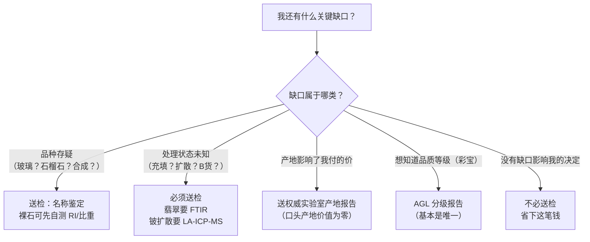

# 🛠 项目 P1：给自己的一件首饰做尽职调查

> **这是第一部分的实战项目**。目标不是"鉴定出真假"——那需要仪器与资质。
> 目标是把第 1~11 章串成一套**可执行的流程**，让你对手上任何一件首饰能回答三个问题：
>
> 1. **它是什么**（名称、处理状态、可能的产地）；
> 2. **我知道的与不知道的分别是什么**（哪些已确认、哪些是缺口）；
> 3. **下一步做什么**（继续持有 / 送检 / 改镶 / 调整保养 / 不买）。
>
> **交付物**：一份填完的调查表 + 一张决策清单。做完你会发现——
> 大部分首饰的问题不在"是不是假的"，而在"**我一直不知道它是什么**"。

## P1.0 准备

**挑一件首饰**。建议优先选：

- 有主石的（戒指/吊坠/耳饰都可以）；
- 最好带证书或发票（没有也能做，"没有"本身就是发现）；
- 你比较在意的那一件（这样后面的结论对你有用）。

**器具**（全部可选）：10 倍放大镜、强光手电、电子秤（0.01 g）、卡尺。
**🅐 档全程不需要器具**——它已经能完成这个项目 70% 的价值。

## P1.1 阶段一：读名称（依据第 1 章）

**名称是唯一受法律约束的信息**，所以从它开始，而且**逐字读**。

| 动作 | 档位 | 做什么 |
|------|------|--------|
| 抄下完整名称 | 🅐 | 从证书、标签、发票、或电商订单里**照抄**，不要概括 |
| 扫四个关键词 | 🅐 | `合成` / `人造` / `再造`·`拼合` / `仿`——出现任何一个，价值逻辑立刻改变 |
| 看括号与动词 | 🅐 | 有没有括号、"处理"字样，或"染色/充填/漂白/扩散/辐照"这类动词 |
| 查商贸名称 | 🅐 | 如果只有商贸名（"马来玉""藏银""彩虹月光石"），追问国标名称 |
| 检查产地是否入名 | 🅐 | "缅甸蓝宝石"这样的**定名**不合规（产地不参与定名） |

**⚠️ 这一步最重要的认知（第 1、10 章）**：

> **名称干净 ≠ 没被动过手脚。**
> 属于"**优化**"的手段（热处理、无色油浸）**在名称中不体现**；
> 而"未检出处理"还取决于**用了什么方法**。

## P1.2 阶段二：查证书（依据第 11 章）

用[证书核对清单](../../forms/certificate-checklist.md)走完整流程。这里只列关键动作：

| 动作 | 档位 | 要点 |
|------|------|------|
| 记下**机构全称** | 🅐 | 不是缩写。⚠️ NGTC / GIC / NGSTC 缩写相近 |
| 找 **CMA** | 🅐 | 中国证书的法定底线；一个资质标志都没有的直接质疑。CNAL 是 CNAS 的历史标志，正常 |
| **自己搜索进官网**核验 | 🅐 | ⚠️ **不扫商家二维码**（可指向任何网站）；留意仿冒站特征：电话打不通、内容简陋、只有查询功能 |
| **比对数据**（不是比对长相） | 🅐 | 查询系统通常只显示数据；逐项核对**照片 / 重量 / 尺寸 / 结论** |
| 看**检测项目与方法** | 🅐 | 名称鉴定 ≠ 处理检测 ≠ 产地判定，三者需要不同仪器、常分开计费 |
| 钻石加一步 | 🅐 | **核对腰棱激光刻字**与报告编号 |
| 列出证书**没覆盖**的问题 | 🅐 | **这一栏往往是全项目最有价值的产出** |

## P1.3 阶段三：肉眼与放大观察（依据第 2、4、5、6、9、10 章）

用[宝石观察记录表](../../forms/stone-observation.md)记录。**只做记录，不下结论**。

### 🅐 无器具能做的

| 观察 | 看什么 | 依据 |
|------|--------|------|
| 颜色三要素 | 色调 / 饱和度 / 明度；有无灰褐调 | 第 5 章 |
| 换光源 | 日光 ↔ 白炽灯：**颜色变不变**（变色效应 vs 多色性 vs 色带） | 第 4、6 章 |
| 转动看 | 同一光源下转动：颜色变（多色性）、有游动彩斑（变彩/晕彩） | 第 4、6 章 |
| **透字测试** | 台面朝上放在有字的纸上，能否读出字（→ 亭部漏光有窗口） | 第 3 章 |
| 光泽 | 金刚 / 玻璃 / 蜡状…；同种宝石里是否明显发闷 | 第 3 章 |
| 肉眼内含物 | 位置、是否影响观感（eye-clean？） | 第 15 章预备 |
| **看侧面** | 有无分层界线（拼合石）、体色是否从侧面消失（箔背） | 第 6 章 |
| 效应类宝石 | 星线/眼线是否锐利居中、转动时是否**顺畅移动**；是否"完美得可疑" | 第 6 章 |

### 🅑 有器具能做的

| 观察 | 方法 | 依据 |
|------|------|------|
| **棱线重影** | ⚠️ **倾斜约 45° 透过冠部小面看**，不要只透过台面（莫桑石光轴穿过台面） | 第 4 章 |
| 内含物形态 | 针状/片状/气泡/指纹状/纱幕状/云雾状 | 第 10 章 |
| **弯曲生长纹** | 聚焦石头**内部**，确认纹路**跨刻面延续**（⚠️ 抛光痕会伪装；垂直光轴看会显直） | 第 10 章 |
| **金属薄片** | 锐边三角形/六边形（铂）→ 强烈指示合成 | 第 10 章 |
| **闪光效应** | 明域看蓝绿闪光、暗域看橙红闪光（铅玻璃充填） | 第 10 章 |
| 颜色分布 | 手电侧照：颜色是否只在**表层**（扩散/覆膜）、是否集中在**裂隙**（染色） | 第 5、10 章 |
| **盘状裂隙** | 包裹体周围圆盘状裂隙 + 张力晕（热处理线索） | 第 10 章 |
| 比重 | 静水称重（**仅裸石**） | 第 9 章 |
| 抛光与棱线 | 抛光痕方向、棱线是否磨圆钝 | 第 3、7 章 |

## P1.4 阶段四：判断耐久性与保养（依据第 2、7 章）

这一步的产出是**一份属于这件首饰的保养规则**——它立刻就有用。

| 判断 | 问什么 | 依据 |
|------|--------|------|
| 硬度 | 是否低于约 7（家居灰尘含石英 7~7.5，低于它日常就会被磨） | 第 7 章 |
| 韧性 | 有解理吗？脆吗？（钻石有四组解理；祖母绿硬但脆） | 第 2、7 章 |
| 稳定性 | 怕热？怕光？怕化学品？怕干燥？ | 第 5、7 章 |
| **镶嵌是否匹配** | 需要保护的品种（祖母绿/坦桑石/欧泊/月光石）有没有用包镶或半包镶？宝石凸出多少？ | 第 7 章 |
| **佩戴位置是否合适** | 戒指 ≫ 手链 > 胸针 > 吊坠 > 耳环（受力递减） | 第 7 章 |
| **清洗禁忌** | 能不能超声波/蒸汽？（按第 2 章四档清单 + 处理状态） | 第 2、7、10 章 |
| **存放** | 是否与硬宝石同放（会被刮）？含水/有机质的是否放在过干处（欧泊会龟裂） | 第 7 章 |

## P1.5 阶段五：决定是否送检（依据第 9、10、11 章）

**核心判断：有些事无论多努力看都看不出来。** 知道这一点本身就是专业。

**必须送检的清单**（自己看不出来的）：

| 问题 | 为什么自己不行 |
|------|--------------|
| 翡翠是否 A 货 | **FTIR 是唯一在所有情况下给出结论性证据的方法**（第 10 章） |
| 蓝宝石是否**铍扩散** | **肉眼完全不可检测**，需 LA-ICP-MS（第 10 章） |
| 祖母绿的**充填程度** | 需 FTIR；紫外灯只能定位不能定性（第 9、10 章） |
| 天然还是**合成** | 常数完全相同，只能靠生长特征——且需显微镜与经验（第 10 章） |
| **产地** | 需微量元素分析，且结论是"意见"、可能 inconclusive（第 8 章） |
| **II 型钻石** | 应始终送实验室（也是培育钻的常见类型，第 10 章） |

**⚠️ 送检的时点很重要（第 9 章）**：**贵重裸石在镶嵌前送检**——
镶嵌后折射率与比重都测不了，显微观察也被遮挡。

## P1.6 阶段六：结论与决策

**措辞纪律（本项目的核心训练）**：

> ✅ **正确格式**："内部见网纹状痕迹与裂隙处光泽差异，**怀疑**充填，
> **缺口**是未做红外光谱，**下一步**送检确认，同时按不可超声波保养。"
>
> ❌ **错误格式**："这是 B 货。" / "这是假的。" / "这肯定是天然的。"

原因有三：①你没有仪器与资质；②这样写在纠纷里对你不利；
③**"怀疑 + 缺口 + 下一步"是可以行动的，而"真/假"不是**。

## P1.7 交付物模板

### 表 A：尽职调查表

| 项目 | 内容 |
|------|------|
| **首饰** | |
| 日期 / 来源 | |
| **完整名称（照抄）** | |
| 四关键词扫查（合成/人造/再造·拼合/仿） | |
| 括号与处理动词 | |
| 商贸名称？国标名称？ | |
| **证书**：机构全称 / 资质标志 / 编号 | |
| 官网核验结果（数据是否逐项一致） | |
| **检测项目与方法** | |
| **证书没覆盖的问题** | |
| 颜色（色调/饱和度/明度）+ 换光源变化 | |
| 透字测试 | |
| 侧面观察（分层？箔背？） | |
| 🅑 棱线重影（**斜看**） | |
| 🅑 内含物形态 / 弯曲纹 / 金属片 | |
| 🅑 闪光效应 / 颜色分布 / 盘状裂隙 | |
| 硬度 / 韧性 / 稳定性风险 | |
| 镶嵌与佩戴位置是否匹配 | |
| 清洗禁忌 | |
| 存放问题 | |

### 表 B：决策清单

| 决策 | 选择 | 理由（一句话） |
|------|------|--------------|
| 品种与处理是否已确认 | ☐ 已确认 ☐ 有缺口 | |
| **是否送检** | ☐ 不必 ☐ 送检（项目：____） | |
| **是否改镶** | ☐ 不必 ☐ 建议改（包镶/半包） | |
| **佩戴位置是否调整** | ☐ 不必 ☐ 从戒指改为吊坠/耳饰 | |
| **保养规则**（写成一句话贴在首饰盒上） | | |
| 若是待购件：**买 / 不买 / 谈条件** | | |
| 若要谈条件：具体条款 | | |

## P1.8 走完全程的示例

> **说明**：以下是一个**虚构但常见**的案例，用来演示记录与推理的方式。
> 它不是鉴定实例。

### 背景

一枚多年前买的祖母绿戒指，开放式四爪镶，有一张证书。想知道"它到底是什么、能不能天天戴"。

### 阶段一：读名称

| 项目 | 记录 |
|------|------|
| 完整名称 | `祖母绿` |
| 四关键词 | 均无（无合成/人造/再造/仿） |
| 括号与动词 | **无** |
| 初步解读 | 名称合规、无"处理"字样 |

**推理**：名称干净说明**未检出"处理"类手段**。
但第 1、10 章讲过——**无色油浸属于"优化"，在名称中不体现**。
所以"名称干净"**不能**排除浸油。**这是第一个缺口。**

### 阶段二：查证书

| 项目 | 记录 |
|------|------|
| 机构全称 | 某省级珠宝检测中心（全称已抄下） |
| 资质标志 | 有 **CMA**（编号已抄）、有 CNAS |
| 官网核验 | 编号可查，**重量、尺寸、结论与纸面一致** |
| **检测项目** | **仅"名称鉴定"** |
| **方法** | "常规宝石学测试、放大观察" |
| **未覆盖** | **未做红外光谱**；未做产地；未做品质分级 |

**推理**：证书本身可信（CMA + 官网数据一致）。
但它**只回答了"这是祖母绿"**。而祖母绿最关键的价格与保养变量是**充填程度**，
这需要 **FTIR**——**证书没做这一项**。**第一个缺口被证实为真实缺口。**

### 阶段三：观察

| 观察 | 记录 |
|------|------|
| 颜色 | 绿略带蓝，饱和度中上，明度中等；无明显灰调 |
| 换光源 | 白炽灯下略暖，**无明显颜色转变**（非变色效应） |
| 肉眼内含物 | 可见数条细裂隙延伸至表面 |
| 透字测试 | 不能读出字（亭部不漏光，切工深度合理） |
| 侧面 | 无分层界线（非拼合石） |
| 🅑 10 倍镜 | 裂隙处**光泽与主体略有差异**；部分裂隙呈**扁平的面状** |
| 🅑 手电侧照 | 裂隙可见，**未见颜色只在表层**（非扩散/覆膜） |
| 🅑 重影 | 无法测（已镶嵌，亭部被爪与托遮挡） |

**推理**：
① 有**裂隙延伸至表面**——这是祖母绿的常态（第 8 章：成因环境动荡）；
② 裂隙处**光泽差异**是**充填的可能线索**（第 10 章），但不构成结论；
③ 已排除拼合石与表层处理；
④ **镶嵌状态限制了观察**（第 9 章），亭部看不到。

### 阶段四：耐久性与保养

| 判断 | 结论 |
|------|------|
| 硬度 | 7.5~8（高于 7，日常磨损风险低） |
| **韧性** | **差**——单晶体 + 有解理 + 大量裂隙（第 7 章） |
| 稳定性 | 若有充填 → **怕热、怕溶剂**；即便无充填，裂隙本身也是弱点 |
| **镶嵌匹配度** | ❌ **不匹配**：开放式四爪镶让腰棱与尖角暴露，而祖母绿需要**包镶/半包镶** |
| 佩戴位置 | ❌ 戒指是受力最重的位置 |
| **清洗** | **绝对禁止超声波与蒸汽**（第 2 章）；温水 + 中性皂 + 软布 |
| 存放 | 单独存放，避免与硬宝石摩擦 |

### 阶段五：是否送检

**缺口清单**：①是否充填、充填程度如何；②（可选）产地。

**决定**：
- **送检做 FTIR** —— 因为它同时影响**价值认知**与**保养禁忌**，而且我自己永远看不出来；
- **不送产地** —— 我不打算按产地溢价交易，省下这笔钱（第 8 章：别过度买报告）。

### 阶段六：结论与决策

**结论（注意措辞）**：

> 这是一枚天然祖母绿戒指，证书机构具备 CMA 且官网数据一致，
> 但**证书仅做名称鉴定、未做红外光谱**，因此**充填状态未知**。
> 10 倍镜下裂隙处见光泽差异，**怀疑存在充填**（这在祖母绿中属常态），
> **缺口**是未做 FTIR，**下一步**送检确认。
> 无论检测结果如何，本件**按"有充填"保养**：禁超声波与蒸汽、避溶剂与高温。
> 另：**现有开放式四爪镶与祖母绿的韧性不匹配**，建议改为包镶或半包镶，
> 或改作吊坠佩戴。

**决策清单**：

| 决策 | 选择 |
|------|------|
| 品种与处理 | 品种已确认；**处理有缺口** |
| 送检 | ✅ 送检（项目：**红外光谱 / 充填程度**） |
| 改镶 | ✅ 建议改包镶或半包镶 |
| 佩戴位置 | ✅ 改为**非日常佩戴**，或改作吊坠 |
| 保养规则（贴首饰盒） | **"祖母绿：禁超声波/蒸汽，温水中性皂手洗，单独存放，做家务运动时取下。"** |

> **这个案例最典型的一点**：整个过程**没有任何"打假"情节**——
> 东西是真的、证书是真的、机构是合规的。
> 但项目仍然产出了三项实质价值：**发现了一个真实的信息缺口**、
> **纠正了一个不匹配的镶嵌**、**得到了一条永久有用的保养规则**。
>
> **这就是尽职调查的常态**：多数时候它不是抓假，而是**把"我不知道"变成"我知道"**。

## P1.9 做完之后

如果你完成了这个项目，请检查是否达成了三件事：

| 检查 | 达成？ |
|------|-------|
| 我能说出这件首饰的**国标名称**，以及名称**没告诉我**什么 | |
| 我能列出**至少一个真实的信息缺口**，并知道要用什么手段填补 | |
| 我有了一条可以**贴在首饰盒上**的保养规则 | |

**如果三项都有，第一部分的目标就达成了**——
你已经能对一块石头"知道该问什么问题、用什么手段回答、什么时候必须交给实验室"。

---

**下一步**：读[第一部分小结（速查）](summary.md)，然后进入**第二部分 · 钻石**。
