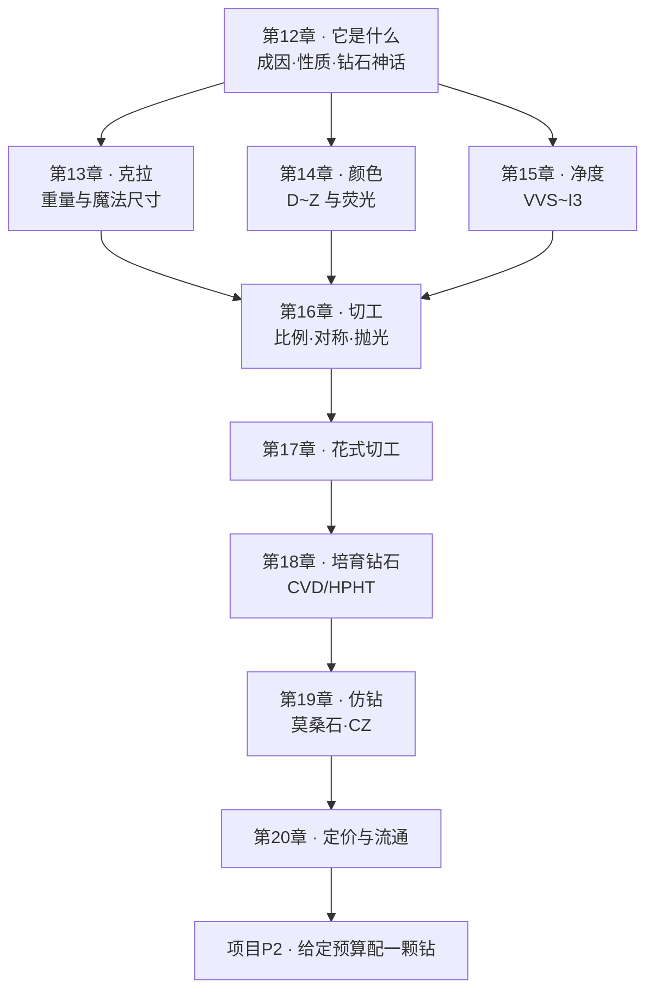

# 第二部分 · 钻石

> **这一部分要建立的能力**：吃透 4C 的**物理含义**与**定价含义**——
> 知道每一级差异在**眼睛里**值多少、在**价签上**值多少，两者常常不是一回事。

## 为什么先讲"钻石是什么"，而不是直接讲 4C

市场上几乎所有钻石教育都从 4C 讲起，直接告诉你"颜色要 D-F、净度要 VS 以上"。
但这样学会漏掉两件更底层的事：

1. **钻石的物理身份决定了它为什么能被分级、分级依据是什么**——
   不知道钻石的晶体结构、成因与化学纯度（第 12 章），就看不懂为什么颜色分级
   从氮讲起、净度分级本质是数内含物、GIA 为什么要分"钻石类型"；
2. **钻石的价格里，有多少是物理稀缺、有多少是商业史的产物**——
   这是本书"事实 / 标准规定 / 市场惯例 / 传说"四层纪律在钻石这个品类上最尖锐的应用。
   不把这一层讲透，后面每一章的"值不值"都会少一个维度。

所以第二部分从第 12 章开始：先讲钻石**物理上是什么、从哪来**，
再讲它身上**被叠加了什么商业与文化的历史**，然后才进入 4C 的具体分级（第 13~17 章）、
培育钻与仿钻（第 18~19 章），最后落到定价与流通的实操（第 20 章）与项目 P2。

## 这一部分的知识链条

## 读这一部分的方式

延续第一部分的格式：每章「**概念 → 思考题 → 实操**」，都有 🔎 **柜台前的用处**，
实操分 🅐 无器具版 / 🅑 有器具版两档。

**本部分额外的查证纪律**：钻石是全世界被研究、被营销得最充分的宝石，
正因如此也最容易混进"听起来权威但未经查证"的说法——
尤其是涉及历史（De Beers、"钻石恒久远"）与稀缺性的内容，**一律要求多来源交叉**，
单一来源（尤其是营销类或自媒体转述）只作为"市场上存在这种说法"的素材，不作为结论依据。

## 本部分章节

| 章 | 主题 | 状态 |
|----|------|------|
| 12 | [钻石是什么：成因、性质与"钻石神话"](12-what-is-diamond.md) | ✅ |
| 13 | [4C ①克拉：重量、直径与"魔法尺寸"](13-carat.md) | ✅ |
| 14 | [4C ②颜色：D~Z 分级与荧光](14-color.md) | ✅ |
| 15 | [4C ③净度：VVS~I3 与净度图](15-clarity.md) | ✅ |
| 16 | 4C ④切工：比例、对称、抛光 | ⬜ |
| 17 | 花式切工：各形状的要点与陷阱 | ⬜ |
| 18 | 培育钻石（CVD / HPHT） | ⬜ |
| 19 | 仿钻：莫桑石与合成立方锆石等 | ⬜ |
| 20 | 钻石定价与流通 | ⬜ |
| P2 | 🛠 项目：给定预算配一颗钻 | ⬜ |
