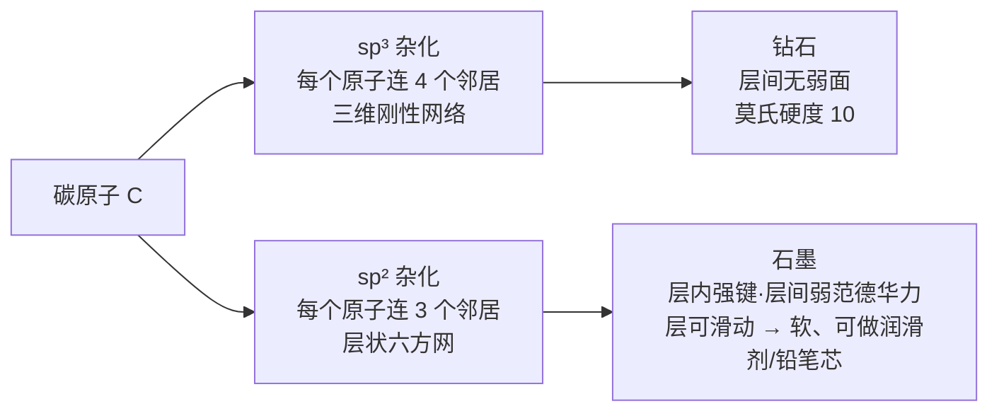
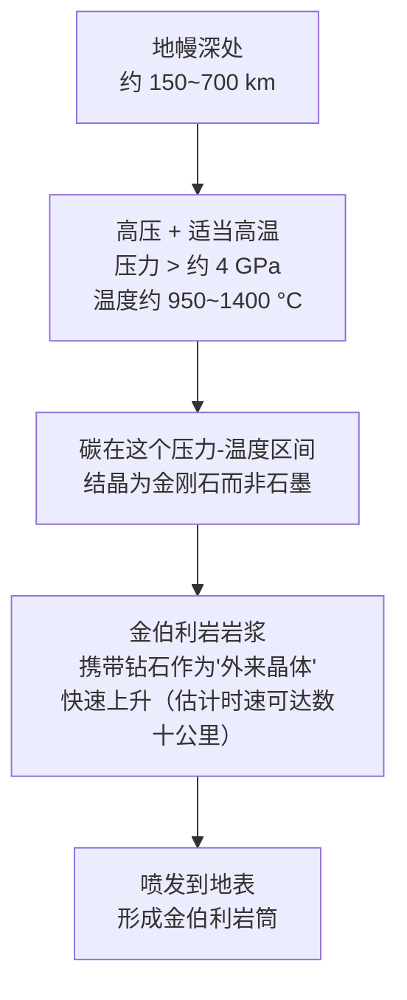

# 第 12 章 钻石是什么：成因、性质与"钻石神话"

> **本章目标**：在进入 4C 细节之前，先把两件事分清楚——**钻石物理上是什么、从哪来**，
> 以及**钻石的价格与文化地位里，哪些是物理与制度事实、哪些是一百年营销史的产物**。
> 学完你能：解释钻石为什么硬、为什么能"恒久"存在（以及这句话在物理上**到底是什么意思**）；
> 说清金伯利岩、钻石、钻石年龄三者的真实关系；看懂"钻石分型"这个后面几章反复出现的概念；
> 并且能**有根有据**地讨论"钻石稀不稀有""De Beers 做了什么""钻石保不保值"这类话题——
> 而不是用一句"都是营销骗局"或一句"钻石恒久远"把问题糊弄过去。
>
> ⚠️ **本章的查证提醒**：钻石的商业史（尤其 De Beers）是本书迄今涉及最多
> **二手转述、立场化叙事**的主题。本书对每条历史论点都标注了来源类型与可信度，
> 分不清"独立确认的事实"与"广为流传但仅见于少数转述"的说法时，会明确写出来，
> **不会用"听起来权威"替代"查得到出处"**。

## 12.1 钻石物理上是什么

### 成分与结构：极端性质从哪里来

钻石的化学成分极其简单——**纯碳（C）**，不含其他元素（微量氮、硼等杂质除外，见 §12.3）。
决定它一切极端性质的是**原子的排列方式**：

> 钻石中每个碳原子以 **sp³ 杂化**与四个相邻碳原子成键，键角 **109.5°**，
> 构成一个连续的三维刚性共价网络——这是自然界已知**最强的三维共价网络结构**之一。

这解释了一个经典问题："同是纯碳，为什么钻石和石墨天差地别？"

> **一句话记住**：硬不硬不取决于"是不是碳"，取决于**碳原子怎么连**。
> 这与第 2 章"晶系决定性质"是同一个逻辑在元素层面的体现。

### 性质速查

| 性质 | 数值 | 说明 |
|------|------|------|
| 莫氏硬度 | **10**（标准矿物本身） | 莫氏标尺**不是线性的**（第 7 章）：从刚玉（9）到钻石（10）的实际硬度跃升，远大于从方解石（3）到萤石（4）这类低段跃升——不同测量方法给出的倍数不同，但**方向一致**：这一级跨度异常大 |
| 热导率 | 约 **2000~2500 W/(m·K)**（天然 IIa 型，室温） | **远超**几乎所有仿钻材料（玻璃、CZ 等），是"热导笔"类检测仪的物理原理；⚠️ **莫桑石的热导率同样很高**，纯热导检测会把它**误判为钻石**（第 19 章） |
| 折射率 | 2.417 | 第 3 章已讲：高折射率 → 小临界角 → 亮 |
| 色散 | 0.044 | 第 4 章已讲：火彩的物理量基准线 |
| 比重 | 3.52 | — |
| 解理 | 四组八面体完全解理 | 第 2 章已讲：硬 ≠ 不会被敲裂 |

> 以上数值与第一部分已登记的常数一致，详见[常数表](../../reference/constants.md)。

### "恒久远"在物理上到底是什么意思

钻石的营销语"A Diamond is Forever"恰好撞上了一个真实但容易被误读的物理事实：

> **室温常压下，石墨才是碳的热力学稳定形态**，钻石理论上"应该"缓慢转变成石墨——
> 但两者标准生成焓之差很小（量级为每摩尔几个千焦），**真正决定钻石能不能"保持钻石"的
> 是一道极高的活化能垒**：要把钻石的三维网络拆开重组成石墨的层状结构，
> 代价几乎相当于打散重建整个晶格。这道能垒在常温下高到**转变速率可以忽略不计**，
> 钻石因此是**动力学亚稳定（metastable）**，而不是热力学最稳定。

**诚实的结论**：

> 钻石在人类可感知的时间尺度上确实"不会变"，这是**真实的物理现象**；
> 但它的机制是**动力学亚稳态**，不是"钻石就是永恒不灭的物质"这种更强的说法。
> **"恒久远"这句广告语踩在了一个真实的物理现象上，但它是营销语言，不是科学表述**
> ——这正是本章要反复practice的"分清楚事实与叙事"的一个小例子。

## 12.2 钻石从哪来：地质成因

### 形成的温度与压力

几个值得记住的具体数字（均来自 GIA *Gems & Gemology* 的地质学综述）：

| 事实 | 数值/说明 |
|------|---------|
| 形成深度 | **约 150~700 km**（地幔内，多数在大陆古老克拉通地幔根部一带） |
| 形成压力/温度 | **大于约 4 GPa（4 万大气压）、约 950~1400 °C** |
| 金伯利岩浆本身的起源深度 | 约 **200~300 km** |
| 金伯利岩上升速度 | 估计约**时速数十公里**（文献给出量级为每小时数十英里），这个"快"很关键（见下文） |

> **为什么必须"快"**：如果岩浆上升太慢，钻石在压力降低、温度仍高的途中会有足够时间
> 转变回石墨（这正是 §12.1 讲的亚稳态在反方向上的体现——
> 低压条件下石墨才稳定，给够时间钻石真的会"变质"）。
> **金伯利岩喷发的猛烈与迅速，本身就是钻石能完整保存下来的必要条件。**

### 金伯利岩是"电梯"，不是"工厂"

这是本章第一个容易被搞混的概念，必须单独强调：

> **金伯利岩不制造钻石，它只是把已经形成的钻石从地幔深处带到地表的运输工具。**
> 钻石在金伯利岩浆里是一种"外来晶体"（xenocryst）——**偶然搭车的乘客**，不是金伯利岩
> 结晶过程的产物。

证据非常直接——**年龄对不上**：

> 对南非金伯利地区钻石的研究发现，钻石本身的年龄为**约 10 亿到 30 多亿年**，
> 而携带它们上来的金伯利岩筒**只在约 8400 万年前**才喷发。
> 钻石比它的"运输工具"老了至少一个数量级。

这个年龄差也解释了为什么钻石研究要靠**包裹体定年**而不是靠金伯利岩本身的年龄——
钻石记录的是地幔深处几亿年前甚至更早的历史，金伯利岩只记录了"最后一班电梯什么时候开"。

### 两类"血统"：橄榄岩型与榴辉岩型

钻石内部偶尔会包裹同时结晶的矿物包裹体，按这些包裹体的矿物组合，
可以把钻石分成两大"成因组合"[^paragenesis]：

| 类型 | 典型包裹体矿物 | 地质背景 |
|------|-------------|---------|
| **橄榄岩型**（peridotitic） | 铬镁铝榴石（常显紫色）、顽火辉石、橄榄石、铬铁矿 | 与古老的大陆克拉通地幔有关，常为太古宙（>25 亿年） |
| **榴辉岩型**（eclogitic） | 铁铝-镁铝榴石（常显橙红）、绿辉石 | 与**俯冲洋壳的再循环**有关，年龄跨度更大 |

> 全球范围看橄榄岩型包裹体整体更常见，但**不同矿区比例差异很大**——
> 有的矿区榴辉岩型反而占多数。所以"钻石都是橄榄岩型"这类一概而论的说法不成立，
> 这是一个**因矿区而异**的统计问题，不是固定规律。

### 钻石分型：一个贯穿后面几章的概念

这是本章**对后续章节最重要的一节**。钻石按**氮、硼杂质**的有无与存在形式分类，
用红外光谱（FTIR）测定，称为**钻石分型**[^type]：

| 类型 | 杂质特征 | 天然钻石中占比（量级） | 对颜色的影响 | 与后续章节的关系 |
|------|---------|------------------|------------|---------------|
| **Ia**（IaA / IaB） | 氮以**聚合态**存在：A 心（两个氮原子相邻）、B 心（四个氮原子绕一个空位） | **绝大多数天然钻石**（常引用 95% 以上） | IaA 基本不影响颜色；IaB 偏多带**浅黄到棕色调** | 第 14 章：D-Z 色级的"自然色系列"主要在说这一型 |
| **Ib** | 氮以**孤立态**分散存在 | **约 0.1%**，天然中罕见 | 吸收更强，偏**黄到棕**（"金丝雀"彩钻、部分合成钻） | Ib 既见于天然也见于 HPHT 培育钻（第 18 章） |
| **IIa** | **检测不到氮** | **约 1~2%** | 通常近乎无色，但因晶格畸变也可能带粉/棕等色 | ⚠️ **CVD 法培育钻石大多属于这一型**——这种"自然界罕见、实验室常见"的错位是鉴定线索之一（第 18 章） |
| **IIb** | 检测不到氮，**含硼** | **约 0.1%**，最稀有之一 | 硼使其呈**浅蓝到灰蓝**色，且具半导体性（能导电） | HPHT 培育钻石也可做出 IIb 型；部分电性检测仪会因此把它**误判为莫桑石**（第 19 章） |

> **记住这张表的理由**：第 14 章讲颜色分级、第 18 章讲培育钻石鉴定，
> 都要回到"这颗钻石是哪个分型"这个起点——**分型不是额外的冷知识，
> 是后面两章判据成立的物理基础**。

[^paragenesis]: [钻石包裹体成因组合](../../glossary.md#diamond-paragenesis)（diamond paragenesis）。
[^type]: [钻石分型](../../glossary.md#diamond-type)（diamond type）。

## 12.3 "钻石神话"：一段被反复讲述、也容易被简化的商业史

> **先说清楚本节的态度**：本节要讲的历史**基本事实有扎实的多来源证据支持**
> （矿产发现时间、公司合并日期、反垄断判决、广告语的提出时间），
> **但围绕这段历史的"解读"——De Beers 到底有多邪恶、钻石到底"值不值"——
> 本身也是一个被反复传播、简化、甚至反向简化（"De Beers 一手编造了一切"）的话题。**
> 本书的做法是：**先把硬事实列清楚，再单独讨论哪些解读有充分证据、哪些没有。**

### 一段跨越三块大陆的产地转移史（硬事实）

在"南非钻石"这个印象形成之前，钻石的主产地换过两次：

| 时期 | 主产地 | 关键事实 |
|------|--------|---------|
| 约公元前 4 世纪起 ~ 1725 年 | **印度**（戈尔康达 Golconda 地区） | 全球**唯一**的钻石来源长达约两千年；16~18 世纪产量估计约 1000 万克拉；科依诺尔（Koh-i-Noor）、希望钻石（Hope Diamond）均出自这里 |
| 1725/1726 年起 | **巴西**（米纳斯吉拉斯州） | 淘金者在筛金时意外发现钻石；巴西最初的钻石一度被当作"劣质印度货"低价出售，商人甚至经果阿转运冒充"正宗戈尔康达货"；1730 年代起巴西产量已超过印度 |
| 1866~1871 年起 | **南非**（金伯利地区） | 1866 年发现"尤里卡"钻石（21.25 克拉）；1869 年发现"南非之星"（83.5 克拉）；1871 年金伯利矿与戴比尔斯矿相继被发现，引发"新淘金热"；印度古矿到 19 世纪末已基本枯竭 |

> **这条历史线索本身就值得记住的一点**：在南非大发现之前，钻石早已是"珍贵"的代名词，
> 但彼时的珍贵完全靠**天然的地理稀缺**（全世界就那么几条河床）；
> 南非的发现第一次让产量达到了**可能冲击"珍贵"这个定义本身**的规模——
> 这正是下一段商业史的起点。

### De Beers 的诞生与早期的供给管控

> **1871~1888 年**：塞西尔·罗德斯（Cecil Rhodes）在金伯利矿区起家，
> 与巴尼·巴纳托（Barney Barnato）的竞争对手公司于 **1888 年 3 月 12 日**合并，
> 成立 **De Beers Consolidated Mines Limited**，罗斯柴尔德家族（伦敦、巴黎两支）
> 是主要的资金方之一。

公司成立的**动机**在多个独立历史来源中被一致描述为：

> 早期投资者担心南非新矿大量投产会让钻石沦为"半贵重"的普通石头，
> 认为**唯一的办法是把各方利益合并成一个足够强大的实体，统一控制产量**，
> 从而维持钻石的稀缺印象与价格。

这个阶段还有一段**不应被略过的劳工史**：南非金伯利矿区在 1885 年之后普遍推行
**封闭式工棚制度**（closed compound system）——黑人矿工在合同期内被限制离开
由围墙与门禁管控的工棚，官方说法是"防盗"（钻石盗窃确实猖獗，据估计
19 世纪七八十年代有三分之一到一半的钻石经非法渠道流通），但学术研究也指出，
这套制度同时承担了**劳动力控制**的功能，且早期（1903 年改造之前）的卫生与死亡率
记录**并不优于**它后来在南部非洲其他矿区的效仿者。
⚠️ **本书只在这里提及这段历史作为背景事实，不展开评价**——
它不是本章要论证的重点，但略去不提会让这段商业史显得比实际更"干净"。

公司很快建立起**单一渠道销售体系**：

> 时任主席欧内斯特·奥本海默（Ernest Oppenheimer）的原话大意是——
> "只有限制投放市场的数量，并通过单一渠道销售，才能维持钻石贸易的稳定。"
> 这套体系后来定名为**中央销售组织**（Central Selling Organisation, CSO）。

De Beers 还在 1959 年与苏联达成**保密贸易协议**，以溢价收购苏联绝大部分
（约 95%）的毛坯钻石产量，防止其独立流入市场冲击价格——这项安排延续到
1990 年代，直到欧盟反垄断调查迫使其在 2009 年终止。

### "A Diamond is Forever"：一句广告语与一场文化改造

这是本章查证最仔细的一段，因为它最容易被简化成"De Beers 凭空发明了钻石求婚"
这种过度简化的说法——**事实比这更精确，也更有意思**。

**在 De Beers 广告之前，钻石订婚戒指并非没有先例**：

> 现存最早有记录的钻石订婚戒指，是 **1477 年**神圣罗马帝国的马克西米连大公
> （Archduke Maximilian）送给**勃艮第的玛丽**（Mary of Burgundy）的订婚礼物
> ——一枚嵌有钻石排成字母"M"的金戒指，现藏于维也纳。
> 此后几个世纪，钻石订婚戒指**仅限于王室与极富裕阶层**。

**De Beers 真正改变的是"钻石订婚戒指"从贵族特权变成大众习俗这件事**：

| 年份/阶段 | 事件 |
|---------|------|
| 1938 年 | 大萧条冲击下钻石销量低迷，De Beers 聘请费城广告公司 **N.W. Ayer** 开展营销 |
| 1947 年 | N.W. Ayer 文案员**弗朗西丝·杰拉蒂**（Frances Gerety）写下"**A Diamond is Forever**"（钻石恒久远） |
| 1948 年 | 该标语首次投放，此后**每一则 De Beers 订婚广告都沿用至今** |
| 1999 年 | 美国《广告时代》将其评为"20 世纪最佳广告语" |

**广告语配合的另一个关键动作，是制造一个"该花多少钱"的具体数字**：

> "两个月工资"这个说法**不是古老传统，而是 De Beers 广告史上逐步调高的营销锚点**：
> 1930 年代的广告建议"一个月工资"，到 1980 年代才被提高为"两个月工资"
> （部分广告甚至提到三个月）。它的作用是**价格锚定**——
> 给消费者一个具体数字，替代掉"我该花多少钱"这个开放式问题。

**广告的效果有统计数据支撑**（引用口径为 Bain & Company 2011 年报告整理的数据，
原始数字据称源自 De Beers 自身的市场研究）：

| 年份 | 美国新娘获得钻石订婚戒指的比例 |
|------|------------------------|
| 1939 年 | 约 **10%** |
| 1950 年 | 约 30% |
| 1960 年 | 约 50% |
| 1970 年 | 约 60% |
| 1980 年 | 约 67% |
| 1990 年 | 约 **80%** |

⚠️ **这组数字的可信度提醒**：这是本书在钻石营销史部分**流传最广、但一手原始数据
最难直接核实**的一组统计——多篇独立资料都指向同一组数字，并都将其归因于
Bain & Company 2011 年的报告整理（而该报告本身据称转引自 De Beers 的内部市场研究）。
本书因此把它列为"**多个独立转述来源一致，但本书未能拿到最初的一手调查原文**"，
按查证纪律标注，而不是当成无可置疑的精确统计。

**日本市场是另一个被反复引用、但更有据可查的案例**（因为有明确的多年度连续数字）：

> 1967 年 De Beers 开始在日本投放钻石订婚广告时，当地**不到 5%** 的订婚女性
> 收到钻石戒指（此前日本传统的"结纳"聘礼体系里没有钻戒这一项，
> 且日本政府直到 1959 年才允许钻石进口）；
> 到 **1972 年升至约 27%**，**1981 年约 60%**，**1989 年约 77%**。
> 一套延续约 1500 年的婚俗惯例，在约 20 年内被显著改写。
> 日本市场的"建议预算"锚点被设定为**三个月工资**（高于欧美的两个月）。

### 反垄断的另一面：这个体系后来怎么了

De Beers 的市场支配地位**没有一直维持下去**，这部分同样有扎实的记录：

| 年份 | 事件 |
|------|------|
| 1980 年代末 | De Beers 市场份额达到峰值，约 **80%~90%** |
| 1990 年代 | 失去部分俄罗斯供给；力拓（Rio Tinto）旗下澳大利亚阿盖尔矿、加拿大西北地区新矿先后脱离 De Beers 单一渠道，独立销售 |
| 1999 年 | 聘请贝恩咨询（Bain & Co）做战略重审，推动从"单一渠道垄断"转向**"优选供应商"**（Supplier of Choice）策略 |
| 2000 年 | 中央销售组织（CSO）更名为钻石交易公司（DTC） |
| 2004 年 | De Beers 市场份额跌破 **50%**；同年其子公司因 1990 年代操纵工业钻石价格，向美国司法部**认罪**并缴纳 1000 万美元刑事罚金 |
| 2008 年 | 美国消费者集体诉讼（Sullivan / Hopkins 案）和解，De Beers 支付 **2.95 亿美元**（不承认过错），并接受禁止垄断毛坯钻供给、禁止操纵成品钻价格的永久禁令 |
| 2021 年左右 | 据估计 De Beers 全球市场份额已降至约 **30%** 上下 |

> **这条时间线最该记住的一句话**：**今天的 De Beers 已经不是那个能单方面
> 决定全球钻石供给的公司**。把"De Beers 控制一切"当成对当前市场的描述，
> 是用几十年前的事实套在今天的市场上。

### 金伯利进程：解决了什么，没解决什么

2000 年"冲突钻石"（血钻）问题引发国际关注后，各国政府与行业在南非金伯利
召开会议，于 **2003 年**正式实施**金伯利进程认证制度**[^kp]（Kimberley Process
Certification Scheme, KPCS），要求成员国对出口的**毛坯钻石**认证，
证明其**不是反政府武装用以筹措战争经费的钻石**。

⚠️ **它的定义非常窄，这是本书必须提醒的部分**：

> 金伯利进程对"冲突钻石"的定义只覆盖**反政府武装对抗合法政府**这一种模式，
> **不覆盖国家军队或治安部队制造的暴力、强迫劳动、童工、环境破坏等问题**，
> 而且**只管毛坯钻，不管切磨抛光后的成品**。
> 津巴布韦马兰吉矿区的案例是常被引用的例子：当地军队被指控在开采行动中
> 涉及暴力与强迫劳动，但因为那是"合法政府"所为而非反政府武装，
> 按金伯利进程的技术定义**不构成"冲突钻石"**。

**它确实降低了某一类冲突钻石的比例**（该制度启动时估计冲突钻石约占全球毛坯钻贸易
的 15%，此后降到 1% 以下），**但"通过了金伯利进程认证"不等于"这颗钻石的开采过程
完全没有人权或环境问题"**——这是两件事，不能划等号。

[^kp]: [金伯利进程](../../glossary.md#kimberley-process)（Kimberley Process）。

## 12.4 钻石到底稀不稀有：把物理事实和商业叙事分开

这是本章要收尾的核心问题，也是最容易被两种极端简化的地方：
一种说法是"钻石很稀有所以贵得有道理"，另一种是"钻石一文不值全是骗局"。
**两种说法都把几件不同的事混在了一起。**

按本书"事实 / 标准规定 / 市场惯例 / 传说"的四层框架拆开看：

| 层次 | 具体内容 |
|------|---------|
| **事实（物理/化学，可验证）** | 碳在地壳中并不是稀有元素；但**宝石级、经济可采的金刚石**需要特定的深度-压力-温度条件 + 金伯利岩快速喷发这两个条件同时满足，这个组合**在地质上确实不常见**；全球毛坯钻石年产量量级约为**1~1.3 亿克拉**（据金伯利进程统计口径，年度间有波动），其中**相当一部分是工业级而非宝石级** |
| **标准规定/行业分级** | GIA 的 D-Z 色级体系是**1953 年才确立**的人为标准（第 14 章细讲），"D 最好"只是为了避免与旧的 A/B/C 体系混淆，**不是物理上有什么特殊之处** |
| **市场惯例（会变）** | 钻石零售加价率**行业内差异极大**（不同渠道、尺寸区间报出的加价率从不到 10% 到 300%+ 都有引用，且近年网售渠道显著压低了加价率）；二手钻石/钻戒的**转手回收价普遍只有零售价的 20%~60%**，部分渠道（典当）更低——**这是市场结构问题，不是物理稀缺问题** |
| **传说/营销叙事** | "钻石恒久远""两个月工资""钻石是最好的投资"——这三句话分别对应 §12.1 的物理亚稳态被挪用、§12.3 的人为价格锚点、以及下面要单独辨析的"保值"问题 |

> **本章想传达的态度不是"钻石毫无价值"，而是**：
> **把"这是地质事实"和"这是一百年来被反复讲述、强化的商业叙事"分开看待，
> 你才能对着一份报价单问出正确的问题——这正是第 20 章要具体展开的内容。**

## 12.5 常见说法辨析

| 说法 | 判定 | 说明 |
|------|------|------|
| "钻石地质上极其稀有" | **不准确** | 构成钻石的碳元素本身在地壳中并不稀少；稀缺的是"宝石级、经济可采"这个组合条件。年产量量级在 1~1.3 亿克拉，并不是一个"几乎不存在"的数量 |
| "钻石是金伯利岩'长出来'的" | **明确错误** | 金伯利岩只是运输工具，不生成钻石。钻石年龄（10 亿~30 多亿年）远老于携带它的金伯利岩筒（例如南非金伯利地区约 8400 万年前喷发），年龄差本身就是证据 |
| "钻石硬度 10，所以永远不会坏" | **明确错误**（第 2、7 章已讲） | 硬度只抗刻划，钻石有四组完全解理，一磕可能崩角 |
| "钻石恒久远是纯粹的营销话术，物理上毫无根据" | **不完整** | 它确实踩在一个真实的物理现象上——钻石相对石墨是**动力学亚稳态**，常温下转变速率可忽略；但"恒久不灭"是营销语言的夸张表述，不是对"亚稳态"这个概念的准确转译 |
| "De Beers 发明了钻石订婚戒指的传统" | **不准确** | 已知最早的记录可追溯到 1477 年马克西米连大公送给勃艮第的玛丽的钻戒，早于 De Beers 成立（1888）与其广告campaign（1938 起）几个世纪。De Beers 做的是把这个**贵族特权**改造成**大众习俗**，而非从零发明 |
| "'结婚要花两个月工资买戒指'自古有之" | **明确错误** | 这是 De Beers 广告史上的价格锚点，1930 年代起步是"一个月工资"，1980 年代才提高到"两个月"，日本市场的版本是"三个月"——是可追溯到具体广告活动的营销产物 |
| "De Beers 现在仍然垄断着全球钻石市场" | **明确错误** | 市场份额已从 1980 年代末约 80%~90% 的峰值降至近年约 30% 上下；2004、2008 年两次重大法律程序（认罪、集体诉讼和解）进一步削弱并约束了它的市场行为 |
| "买了金伯利进程认证的钻石，开采过程就绝对没问题" | **明确错误** | 金伯利进程的定义只覆盖"反政府武装冲突"这一种模式，不覆盖国家暴力、强迫劳动、环境问题，也只管毛坯钻不管成品 |
| "钻石是很好的保值/投资品" | **明确错误** | 多个行业资料显示二手钻石/钻戒的转手价普遍只有零售价的 20%~60%（部分估计更低），零售加价本身就是主要原因之一；这是市场结构问题，证书不解决这个问题（第 11 章已讲证书不涉及估价） |
| "De Beers 操纵钻石价格的说法都是阴谋论，没有法律依据" | **明确错误** | 2004 年 De Beers 子公司已就操纵工业钻石价格向美国司法部认罪并缴纳刑事罚金；2008 年又与美国消费者达成 2.95 亿美元的反垄断集体诉讼和解（虽不承认过错） |

## 12.6 🔎 柜台前的用处

1. **听到"钻石很稀有"时，追问"稀有的是什么"**——碳不稀有，宝石级金刚石的
   地质组合条件不常见，这是两个不同层级的说法；
2. **"恒久远"是广告语，不是鉴定依据**——真正决定"能不能传家"的是硬度、
   解理、保养，不是这句口号；
3. **报价单上的"保值"话术要警惕**——行业数据显示转手价普遍只有零售价的
   20%~60%，证书不能解决这个问题（第 11 章）；
4. **"金伯利进程认证"不等于"开采过程完全没问题"**——它只排除了一种特定类型的冲突钻；
5. **讨论钻石历史时分清"硬事实"与"转述"**——矿产发现年代、公司合并日期、
   反垄断判决这些是可核实的硬事实；市场份额的具体百分比、广告效果的具体统计
   多数来自行业报告的转述整理，引用时保留这层不确定性；
6. **记住钻石分型（Ia/Ib/IIa/IIb）**——第 14 章的颜色分级、第 18 章的培育钻鉴定
   都会用到这张表，不是本章用完就忘的冷知识。

## 12.7 思考题

1. 为什么说"金伯利岩不生产钻石，只是运输工具"？请用**年龄数据**作为证据回答。
2. 钻石为什么能在常温下"保持钻石"而不转变成石墨？请用**热力学稳定**与
   **动力学稳定（亚稳态）**的区别回答，并说明这跟"钻石恒久远"这句广告语是什么关系。
3. 请解释钻石的四种分型（Ia / Ib / IIa / IIb）分别是什么杂质特征决定的，
   并说明为什么"IIa 型在天然钻石中罕见、在 CVD 培育钻石中常见"这件事
   能被用作鉴定线索。
4. 请梳理钻石主产地从印度到巴西再到南非的转移过程，
   并说明南非的发现为什么会催生"统一控制产量"的想法。
5. "De Beers 发明了钻石订婚戒指的传统"这句话哪里不准确？
   De Beers 真正改变的是什么？
6. "两个月工资"这个说法是怎么来的？它和"自古以来的传统"有什么本质区别？
7. 金伯利进程解决了什么问题？它的定义有什么**明确的局限**？
   请举出一个这个局限导致的真实案例。
8. 为什么说"De Beers 现在仍垄断钻石市场"是过时的说法？
   请用市场份额与法律事件的时间线回答。
9. **【案例】** 你在某婚戒品牌的宣传页上看到这样一段话：
   *"钻石自古以来就是永恒爱情的象征，'一克拉的爱'需要两个月工资的诚意，
   而且钻石保值抗通胀，是传给下一代的最佳选择。"*
   请指出这段话里**三处**可以用本章内容反驳或需要加限定语的说法，
   并说明你会怎么改写它，使其既不否定钻石的情感价值，也不传播不准确的信息。
10. **【辨识】** 去[权威图库索引](../../reference/gallery.md)，
    在 GIA *Gems & Gemology* 检索 `kimberlite diamond geology` 或
    `diamond type classification`，找到一篇相关文章，浏览其中关于钻石年龄测定
    或红外分型谱图的说明。然后回答：①文章是如何用包裹体测定钻石年龄的？
    ②红外光谱如何区分 Ia 型与 II 型钻石？这对普通消费者意味着什么
    （提示：想想第 18 章会讲到的培育钻鉴定）。

> 📖 **参考答案**（想清楚再看）：[Q1](../../qa/12-what-is-diamond-qa.md#q1) ·
> [Q2](../../qa/12-what-is-diamond-qa.md#q2) · [Q3](../../qa/12-what-is-diamond-qa.md#q3) ·
> [Q4](../../qa/12-what-is-diamond-qa.md#q4) · [Q5](../../qa/12-what-is-diamond-qa.md#q5) ·
> [Q6](../../qa/12-what-is-diamond-qa.md#q6) · [Q7](../../qa/12-what-is-diamond-qa.md#q7) ·
> [Q8](../../qa/12-what-is-diamond-qa.md#q8) · [Q9](../../qa/12-what-is-diamond-qa.md#q9) ·
> [Q10](../../qa/12-what-is-diamond-qa.md#q10)

## 12.8 本章实操

### 🅐 无器具版 · 任务一：拆解一句钻石营销语

找一句你在广告、直播间或朋友圈见过的钻石营销语（例如"钻石恒久远，一颗永流传"
"钻石是女人最好的朋友"之类），按本章的四层框架拆解：

| 这句话 | 对应哪一层（事实/标准规定/市场惯例/传说） | 本章哪一节能验证或反驳它 | 我会怎么改写（如果要更准确） |
|--------|------------------------------|--------------------|-------------------|
| | | | |

> **填表提示**：大多数经典营销语会**混合**两层以上的内容——
> 比如"恒久远"混合了真实的物理亚稳态和夸张的营销修辞。
> 拆开看，你会发现"反驳一句营销语"往往不是"它全错"，而是"它把哪一层说过头了"。

### 🅐 无器具版 · 任务二：给一份"投资建议"做事实核查

找一篇网上声称"钻石保值/可投资"的文章或视频文案，列出它的具体论据，
逐条核对：

| 论据 | 本章/本书哪里能验证 | 结论（成立/不成立/部分成立） |
|------|------------------|----------------------|
| 例："钻石越来越稀有，产量逐年下降" | §12.4 产量数据 | |
| 例："克拉数越大越保值" | 第 8 章"尺寸放大一切"（但那是指宝石，钻石的类比要单独验证） | |
| 例："有证书的钻石肯定能原价卖出" | 第 11 章"分级报告 ≠ 估价报告" | |

> 做完这个练习，你会发现大多数"钻石投资"文案的论据**经不起逐条拆解**——
> 这正是本章想训练的能力：**不是情绪化地反对，而是一条一条地查证**。

### 🅐 无器具版 · 任务三：画一张自己的"钻石历史时间线"

把本章 §12.3 的时间线信息抄到一张表上，补充你认为还想了解的空白：

| 年份 | 事件 | 我还想知道什么 |
|------|------|-------------|
| 1477 | 马克西米连大公的订婚钻戒 | |
| 1888 | De Beers 成立 | |
| 1947 | "A Diamond is Forever" | |
| 2004 | De Beers 认罪并缴纳刑事罚金 | |
| 2008 | 2.95 亿美元消费者集体诉讼和解 | |

> **这个练习的目的**：历史细节容易记混，自己动手整理一遍时间线，
> 比被动读一遍更不容易把"De Beers 成立"和"钻石订婚戒指出现"这两件事的先后搞反。

### 🅑 有器具版 · 任务四（可选，需要已有的钻石证书或热导笔）

如果你手头有一份钻石的 GIA 或其他实验室证书，查一下证书上是否标注了**钻石分型**
（Type 一栏，部分证书会特别标注 Type IIa 等信息，尤其是大克拉或高色级钻石）：

| 观察项 | 记录 |
|--------|------|
| 证书上是否标注了钻石分型 | |
| 如果标注了，是哪一型 | |
| 结合 §12.2 的表格，这个分型对颜色/价值有什么含义 | |

> 大多数普通商业级钻石证书**不会特别标注分型**（因为绝大多数都是 Ia 型，
> 没有特殊说明的必要）——如果看到特别标注，往往说明这颗钻石在颜色或稀有度上
> 有值得单独说明的地方。

---

**下一章**：第 13 章 4C ①克拉——从"钻石是什么"进入"怎么称重、怎么定价"，
讲清楚克拉重量与视觉大小之间那条并不成正比的关系，以及"魔法尺寸"背后的定价逻辑。
