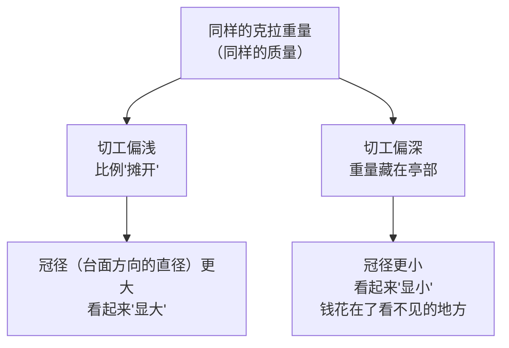

# 第 13 章 4C ①克拉：重量、直径与"魔法尺寸"

> **本章目标**：讲清 4C 里看起来最简单、实际上最容易被误读的一项。
> 学完你能：说清"克拉"这个单位到底在量什么（以及它**不**量什么）；
> 解释为什么两颗克拉数相同的钻石**看起来大小可以不一样**；
> 看懂"魔法尺寸"这个真实存在的定价现象，并知道它的**制度性根源**；
> 理解为什么钻石"越大越贵"不是线性关系；
> 以及在预算有限时，如何用"克拉重量"这一项省下一笔钱而**肉眼几乎看不出来**。

## 13.1 克拉是什么：一个重量单位，不是尺寸单位

### 定义与来历

**克拉**[^carat]（carat, ct）是宝石的**重量**单位：

> **1 克拉 = 200 毫克 = 0.2 克 = 100 分（point）**。
> 这个定义是 **1907 年**国际计量大会（第四届国际计量大会，巴黎）正式确立的"公制克拉"，
> 此后被世界各国陆续采用。

⚠️ **在此之前，"克拉"并不是一个统一的单位**：

> 克拉一词源自希腊语"角豆"（kerátion）——古代地中海商人用角豆种子作天平砝码，
> 因为相信它们重量均匀（后来的研究发现这其实是个误解：角豆种子的重量离散度
> 并不比其他种子小，只是**偏大偏小的个体更容易被挑出去**，便于人工筛选统一）。
> 1907 年之前，**不同国家的"克拉"在约 187~216 毫克之间互不相同**，
> 国际贸易中极易引发纠纷——这正是促成 1907 年统一定义的直接原因。

### 克拉重量怎么称、怎么写

GIA 的分级报告遵循一套具体规则，值得知道：

> 钻石称重**精确到千分位（0.001 ct）**，但报告上**只写到百分位（0.01 ct）**，
> 写法规则不是通常的四舍五入，而是——**只有千分位是 9 时才向上进位**：
> 1.769 ct 会写成 1.77 ct，而 1.768 ct 写成 1.76 ct。

这个规则本身**不需要死记**，但它说明一件事：**两颗都标注"1.00 ct"的钻石，
实际重量可能相差好几个千分位**——证书上的两位小数是经过规则处理的结果，
不是绝对精确的原始读数。

[^carat]: [克拉](../../glossary.md#carat)（carat, ct）。

## 13.2 克拉重量 ≠ 视觉大小：切工在中间做了什么

这是本章最容易被忽略、也最实用的一节。

### 肉眼看到的是"冠径"，不是重量

> 肉眼感知的"大小"，对应的物理量是**冠径/展开**[^spread]（spread）——
> 圆钻看**直径**，异形钻看**长宽平均值**。而克拉重量是**体积×密度**决定的质量，
> 体积可以在"铺宽"和"堆高"之间分配。**同样的重量，切工浅的铺得宽，切工深的堆得高**，
> 这就是为什么克拉数相同、看起来大小可以不同。

**一个可以用来估算（不是精确测量）的公式**，常用于已镶嵌、无法取下称重的钻石：

> **圆钻重量估算公式**[^formula]：平均直径² × 全深 × **0.0061** ≈ 估计克拉重量
> （常数 0.0061 由钻石比重 3.52 换算而来，GIA 举过一个例子：直径 6.42 mm、
> 深度 3.97 mm 的圆钻，算出来约 0.998 ct，与标称的约 1 克拉吻合）。
> ⚠️ **这只是估算**，实际重量会因切工比例细节、腰围厚薄而有偏差，
> 不能替代实际称重，只能在"镶嵌后测不了"（第 7、9 章已讲过的限制）时提供一个参考量级。

**反过来，这也是一个容易被利用的空子**：

> 切得**过深**（重量藏进亭部）会让一颗重量偏大的钻石看起来和轻一号的差不多大——
> GIA 的说法是：一颗切工不佳的 1.20 ct 钻石，视觉上可能和一颗切工良好的
> 1.00 ct 钻石差不多大。反过来，切得**过浅**则会让克拉数偏小的石头"显大"，
> 但代价是牺牲亮度与火彩（第 16 章细讲切工分级时会展开这条机制）。

> **这就是为什么买钻石不能只看克拉数**：报告上同时列出的
> **长×宽×深（毫米）**，比克拉数更直接地回答"它到底有多大"这个问题。

[^spread]: [冠径/展开](../../glossary.md#spread)（spread）。
[^formula]: [重量估算公式](../../glossary.md#weight-estimation-formula)（weight estimation formula）。

## 13.3 为什么越大越贵，而且不是线性的

### 稀缺性来自原石，而不是切磨本身

钻石价格按"每克拉价格"报价，但**每克拉价格本身会随克拉数上升而上升**——
这不是线性关系：

> 能长到大尺寸、且净度足够做成宝石级的**原石**，在地质上远比小颗粒**稀缺**；
> 切磨过程本身还会损耗（圆钻切磨通常会损失原石**五到六成**的重量），
> 这进一步压缩了大颗粒原石变成大颗粒成品的产出率。
> 结果是：同等品质下，**克拉数越大，每克拉单价越高**，且涨幅**比克拉数本身涨得更快**。

⚠️ **需要诚实说明的一点**：具体的倍数（例如"2 克拉是 1 克拉的几倍价格"）
**会随钻石品质组合（颜色、净度、切工）与市场行情大幅变化**，本书按纪律
**不写死某个具体倍数**；能确定且稳定的结论是**方向性**的——
"每克拉单价随克拉数上升而加速上升"这件事本身，在 Rapaport 价格表的分级结构里
（见 §13.4）是**制度性**的，不是某一年的市场巧合。

### 碎钻 vs 单颗大钻：总克拉重量相同，价格可以差很多

这条结论直接从上面的逻辑推出来，但很多消费者会被"总克拉重量"这个数字误导：

> **总克拉重量**[^tcw]（total carat weight, TCW）是一件首饰上**所有**钻石重量之和，
> 和单颗主石的克拉重量（ct）是**两个不同的数字**。
> 一枚用多颗碎钻（melee，通常指 0.2 ct 以下的小钻）拼出"总重 2.50 ct"的首饰，
> 可能比一枚单颗 2.50 ct 主石的素圈戒指**便宜很多**——原因正是上面那条规律的反面：
> **小颗粒钻石不那么稀缺，而且碎钻通常按"筛号"成批定价**（不逐颗称重分级），
> 单位克拉价格远低于稀缺的大颗粒钻石。

> **柜台前的推论**：看到"总克拉重量"这个说法时，**一定要追问"主石多重、
> 碎钻多重"**——这是一个常被用来让总数字看起来更唬人的包装方式。

[^tcw]: [总克拉重量](../../glossary.md#tcw)（total carat weight, TCW）。

## 13.4 魔法尺寸：一个真实存在、有制度性根源的定价现象

这是本章的核心内容，也是 GIA 官方教育材料里直接使用的术语，不是坊间传说。

### GIA 官方怎么说

> **"魔法尺寸"**[^magic]（magic sizes）是 GIA 自己使用的行业术语：
> "在某些重量门槛（称为'魔法尺寸'），每克拉单价会显著跳涨。"
> GIA 举出的门槛包括 **0.25 ct、0.50 ct、0.75 ct 和 1.00 ct**，
> 并特别强调**"一克拉"是最典型的一个**；行业资料里也常把 **1.50 ct、2.00 ct**
> 列入同一类门槛。

GIA 给出的理由**不是物理稀缺本身，而是需求集中**：

> "这些门槛恰好与受欢迎的重量重合，而受欢迎意味着更大的需求，
> 因此这些重量的价格更高。"——这是一种**叠加在物理稀缺性之上的心理/社会性溢价**：
> 整克拉数字对很多人**带有象征意义**，愿意为凑到这个数字多付钱。

### GIA 给出的具体案例（这是本章少数能找到精确数字的地方）

> 如果一颗钻石重 **0.96 ct**、另一颗重 **1.02 ct**，两者**0.06 ct 的重量差
> 几乎无法用肉眼分辨**；但如果两者颜色、净度、切工都相同（例如都是 D 色），
> 仅仅因为后者**跨过了"一克拉"这条心理门槛**，价格可能**高达约 20%**。

⚠️ **这个 20% 的数字来自 GIA 自己的教育材料**，属于本书认为可信的一手来源；
但它是 GIA 用来说明"现象存在且幅度可观"的**示例**，不是对所有颜色净度组合、
所有年份都成立的固定比例——**跳涨的具体幅度会随行情与具体品质组合变化**，
本书只确认"存在且方向一致"这件事。

### Rapaport 价格表：魔法尺寸的制度性根源

魔法尺寸不只是消费者心理，它在批发交易的**定价工具本身**里被结构化了：

> **Rapaport 价格表**[^rap] 是钻石批发行业最常用的参考基准价格表，每周更新，
> 按**克拉区间 × 颜色 × 净度**组成价格矩阵（单位"百美元/克拉"）。
> 关键在于——**它把克拉重量分成离散的区间**（例如 0.90~0.99 ct、1.00~1.49 ct、
> 1.50~1.99 ct、2.00~2.99 ct……），**同一区间内所有重量共用一个每克拉单价**。

这意味着：

> 一颗 0.99 ct 的钻石，查的是"0.90~0.99 ct"这一行的价格；
> 一颗 1.00 ct 的钻石，查的是"1.00~1.49 ct"这一**整整高出一档**的价格——
> **即使两者重量只差 0.01 ct**。这正是"跨过门槛、价格跳涨"的**制度性原因**：
> 不是卖家临时起意抬价，而是**整个批发定价体系就是按区间分级设计的**。

**行业分析里能查到的方向性数据**（来自 Rapaport 自家的市场分析文章，
⚠️ **具体百分比会随每周价格表与行情变化，这里给出的是该文发布时点的示例，
不是固定不变的行业常数**）：

| 区间跳变 | 该文发布时点观察到的涨幅量级 |
|---------|-------------------|
| 0.90~0.99 ct → 1.00~1.49 ct | 约 29%（同一来源三年前的数据约为 48%，说明这个幅度本身会随时间变化） |
| 1.00~1.49 ct → 1.50~1.99 ct | 约 65% |
| 2.00~2.99 ct → 3.00 ct 以上 | 约 52%~56% |

> **这张表怎么用**：不要记具体的百分比（它们会过时），要记**结构**——
> **跨门槛的跳涨幅度，经常远大于相邻克拉区间内部的自然涨幅**，
> 而且**越靠近整数关口、涨幅往往越陡**。这正是 Rapaport 文章用"一段建造很差的
> 楼梯而不是坡道"来形容这条价格曲线的原因。

### "压线"策略：买门槛下方一点点的石头

这是魔法尺寸现象最直接的消费者应用，也有专门的行业说法：

> 业内把恰好低于魔法尺寸的钻石称为**"shy"（差一点）**或**"off-size"（偏尺寸）**：
> 比如 0.97 ct 而不是 1.00 ct、1.45 ct 而不是 1.50 ct、1.95 ct 而不是 2.00 ct。
> **在镶嵌后、正常观看距离下，一颗切工良好的 0.97 ct 圆钻与一颗 1.00 ct 圆钻
> 几乎无法用肉眼区分**，但价格可能因为没有跨过门槛而明显更低。

> **GIA 也明确提到了这条策略的反面**：
> "如果你觉得魔法尺寸不重要，可以找一颗重量略低于门槛的钻石来省钱。"
> 换句话说，**整克拉数字的象征意义是真实的，但完全可以选择不为它付钱**。

[^magic]: [魔法尺寸](../../glossary.md#magic-size)（magic size）。
[^rap]: [Rapaport 价格表](../../glossary.md#rapaport)（Rapaport Price List）。

## 13.5 常见说法辨析

| 说法 | 判定 | 说明 |
|------|------|------|
| "克拉越大，钻石看起来就一定越大" | **不准确** | 肉眼看到的是冠径（直径），而克拉是重量。切工浅的石头冠径更大、切工深的更小，同样克拉数可以看起来大小不同 |
| "1 克拉和 0.96 克拉看起来差很多" | **明确错误** | 0.06 ct 的重量差在直径上几乎不可分辨（GIA 原话："几乎无法察觉"），但价格可能因为跨过整克拉门槛差出约 20% |
| "魔法尺寸是卖家编出来骗人多付钱的说法" | **不准确** | 这是 GIA 自己使用的官方行业术语，且有 Rapaport 价格表按克拉区间定价这样的制度性机制支撑，不是个别卖家的话术——但确实可以被卖家利用来引导消费者"凑整数" |
| "2 克拉就是 1 克拉价格的两倍" | **明确错误** | 每克拉单价随克拉数上升而**非线性**加速上升（大颗粒原石更稀缺、切磨损耗更大），具体倍数会随品质组合与行情变化，本书不给出固定倍数，但"不是简单翻倍"这个方向是确定的 |
| "总克拉重量（TCW）2 克拉，就等于一颗 2 克拉的钻石" | **明确错误** | 总克拉重量可能是多颗碎钻拼出来的，碎钻按筛号批量定价，单位克拉价格远低于单颗大钻。看到 TCW 一定要问主石和碎钻各多重 |
| "买压线尺寸（比如 0.97 ct）划算但是'差一点'，不够好" | **不完整** | 这是行业内公认的省钱策略（"shy"/"off-size"钻石），在正常观看距离下与门槛上方的石头几乎无法区分，差的只是"整数标签"带来的心理满足，不是实际可见的品质差异 |
| "证书上写 1.00 ct 就是精确的 1.00000 克拉" | **不准确** | GIA 的重量四舍五入规则是"千分位是 9 才进位"，标注 1.00 ct 的钻石实际重量在一个小范围内浮动，不是绝对精确值 |

## 13.6 🔎 柜台前的用处

1. **别只看克拉数，看毫米尺寸**——报告上的长×宽×深比克拉数更直接地告诉你
   "它到底有多大"；
2. **怀疑"显大"的钻石，问切工比例**——克拉数相同但显得特别大的石头，
   可能是切得偏浅，牺牲了亮度和火彩（第 16 章细讲）；
3. **预算紧张时，优先在"压线尺寸"里找**——0.90~0.99 ct、1.45~1.49 ct、
   1.95~1.99 ct 这类区间，肉眼几乎看不出和门槛上方的差别；
4. **看到"总克拉重量"一定追问主石与碎钻的构成**——同样的 TCW，
   单颗大钻和一堆碎钻的价格可能差很多；
5. **不要相信任何"克拉翻倍=价格翻倍"的简单说法**——询价时让对方给出
   具体品质组合（颜色/净度/切工都固定）下的实际报价，而不是套用倍数估算；
6. **知道"魔法尺寸"是真实存在的心理+制度现象，而不是阴谋论**——
   理解它之后，你可以选择"要不要为凑整数付这笔钱"，而不是被动接受。

## 13.7 思考题

1. 为什么说"克拉是重量单位，不是尺寸单位"？请用切工比例的例子说明
   两颗克拉数相同的钻石为什么可以看起来大小不同。
2. GIA 给出的重量估算公式是什么？它的局限性是什么？为什么不能用它代替实际称重？
3. 请解释"魔法尺寸"这个现象的**两层**成因：一层是心理/需求层面，
   一层是 Rapaport 价格表的制度性机制。两层分别是什么？
4. 为什么说"2 克拉是 1 克拉价格的 X 倍"这种说法本书不给出具体数字？
   但哪个**方向性**结论是确定的？
5. "总克拉重量"和"单颗主石克拉重量"有什么区别？为什么同样的总克拉重量，
   价格可能差很多？
6. 什么是"压线/偏尺寸"（shy/off-size）钻石？为什么它是一个合理的省钱策略，
   而不是"将就"？
7. **【案例】** 你在某网店看到两枚戒指报价：A 标注"1.00 ct，G 色，VS1 净度"，
   报价 5 万元；B 标注"0.97 ct，G 色，VS1 净度"，报价 3.9 万元。
   客服说："当然 A 贵啊，它整整一克拉，分量感不一样。"
   请分析：这两颗钻石在视觉大小上会有明显区别吗？价格差异主要来自哪里？
   如果你的预算有限，会怎么决策？
8. **【案例】** 一枚"总克拉重量 1.50 ct"的手镯，由 20 颗碎钻组成，报价 8000 元；
   同样"总克拉重量 1.50 ct"但是单颗主石的戒指报价 65000 元。
   客服说："都是 1.5 克拉，手镯性价比高多了。"
   请指出这句话的问题，并说明你会怎么向朋友解释这个价格差异的合理性。
9. **【辨识】** 去[权威图库索引](../../reference/gallery.md)，
   在 GIA 4Cs 教育页检索 "carat weight" 或 "magic sizes"，
   找到关于克拉重量与价格关系的说明页面。然后回答：
   ①GIA 列出的具体魔法尺寸门槛有哪些？②GIA 自己给出的例子里，
   多大的重量差对应多大的价格差？③这个信息对你挑选钻石有什么实际帮助？

> 📖 **参考答案**（想清楚再看）：[Q1](../../qa/13-carat-qa.md#q1) ·
> [Q2](../../qa/13-carat-qa.md#q2) · [Q3](../../qa/13-carat-qa.md#q3) ·
> [Q4](../../qa/13-carat-qa.md#q4) · [Q5](../../qa/13-carat-qa.md#q5) ·
> [Q6](../../qa/13-carat-qa.md#q6) · [Q7](../../qa/13-carat-qa.md#q7) ·
> [Q8](../../qa/13-carat-qa.md#q8) · [Q9](../../qa/13-carat-qa.md#q9)

## 13.8 本章实操

### 🅐 无器具版 · 任务一：找三组"压线"钻石做对比

在电商平台上，分别搜索一个魔法尺寸门槛**上方**和**下方**的钻石
（品质尽量固定：同色、同净度、同切工等级），记录下来：

| 门槛 | 门槛下方（如 0.97 ct） | 门槛上方（如 1.00 ct） | 价格差 | 价格差的百分比 |
|------|------------------|------------------|--------|-------------|
| 1.00 ct | | | | |
| 1.50 ct | | | | |
| 2.00 ct | | | | |

> **填表提示**：尽量保证两颗石头**除了克拉数以外**的 3C（颜色/净度/切工）相同或接近，
> 否则价格差异会混进其他变量。做完你会直观看到本章讲的"跳涨"现象。

### 🅐 无器具版 · 任务二：拆解一份"总克拉重量"报价

找一件标注"总克拉重量"的首饰（戒指、手链、吊坠均可），向客服或详情页追问：

| 追问的问题 | 答案 |
|-----------|------|
| 主石重量是多少 | |
| 配石（碎钻）总重量是多少 | |
| 配石是否单独分级（颜色/净度） | |
| 如果只看主石，单独报价是多少 | |

> 如果对方**答不出配石重量的拆分**，这本身就是一个信号——
> 说明这个"总克拉重量"更多是用来做一个好看的大数字，而不是透明的信息。

### 🅐 无器具版 · 任务三：用重量估算公式自己算一次

找一颗已知长宽深毫米数据的圆钻（可以用你自己证书上的数据，或网上一份示例证书），
套用公式自己算一遍：

| 数据 | 数值 |
|------|------|
| 平均直径（长+宽÷2，单位 mm） | |
| 全深（depth，单位 mm） | |
| 估算克拉重量 = 直径² × 深度 × 0.0061 | |
| 证书上标注的实际克拉重量 | |
| 两者差多少 | |

> 算完你会发现估算值和实际值通常很接近，但不完全相同——
> 这正说明这个公式**只能估算**，不能替代实际称重，差异来自切工比例的细节
> （比如腰围厚度没有被这个简化公式单独考虑）。

### 🅑 有器具版 · 任务四：用卡尺实测一颗钻石的"显大"程度（需要卡尺）

如果你手头有一颗已镶嵌的钻石和证书，用卡尺测量裸露部分的直径，
并与证书上的标注直径对比：

| 测量项 | 数值 |
|--------|------|
| 证书标注的平均直径（mm） | |
| 卡尺实测直径（mm，镶嵌后可能只能测台面方向的部分） | |
| 证书标注的克拉重量 | |
| 如果是别人的钻石，比较同重量下谁的直径更大 | |

> 如果条件允许，找两颗**克拉数相同但切工等级不同**的钻石做对比
> （比如一颗 Excellent 切工、一颗 Good 切工），测量并比较它们的直径——
> 这是本章"克拉≠大小"这条结论最直观的实地验证。

---

**下一章**：第 14 章 4C ②颜色——从"有多大"转向"有多白"，
讲清 D-Z 色级分级体系是怎么来的、荧光反应又是怎么回事。
