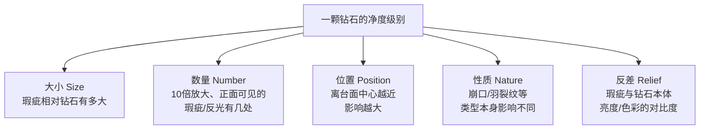

# 第 15 章 4C ③净度：VVS~I3 与净度图

> **本章目标**：讲清净度分级**量的到底是什么**（不是简单的"瑕疵多少个"），
> 以及为什么**内含物的类型和位置**比净度等级这个字母数字组合更重要。
> 学完你能：说出 FL 到 I3 这 11 个等级的官方定义；理解判定净度要看的
> **五个维度**，而不是单一标准；看懂净度图上红、绿、黑符号分别代表什么；
> 认识常见的内含物类型，并知道哪些类型、哪些位置会带来**真实的耐久性风险**；
> 理解"肉眼干净"（eye-clean）是一个**非官方、没有统一量化标准**的行业说法，
> 而不是一个可以套公式计算的精确边界。

## 15.1 净度分级体系：从哪来、量什么

### 建立历史

> 钻石净度分级体系[^clarity]由**理查德·利迪科特**（Richard T. Liddicoat）
> 于 **1953 年**在 GIA 建立——与第 14 章讲过的 D-Z 颜色分级**同一年推出**。
> 在此之前，行业里已经零散使用"VVS""很轻微瑕"之类的说法超过一个世纪，
> 但这些词**没有统一的定义边界**。利迪科特团队做的事，和建立颜色体系时
> 一样：**采用这些已经在市场上流通的缩写（VVS、VS、SI），但给它们订立
> 精确、一致的定义**。

### 等级体系的演变：从 9 档到 11 档

> 1953 年发布时，这套体系只有**九档**：
> Flawless、VVS1、VVS2、VS1、VS2、SI1、SI2、I1、I2
> （当时"I"代表"Imperfect"，不完美）。

⚠️ **今天熟悉的两个档位是后来加入的**：

> **1970 年代**，GIA 注意到一个问题：一些切磨商为了把表面瑕疵完全抛掉、
> 凑到接近 Flawless 的级别，不惜**过度切磨**、牺牲切工比例。
> 为了不鼓励这种本末倒置的做法，GIA 加入了**内无瑕（Internally Flawless,
> IF）**这一档——允许"内部没有内含物，但表面仍保留一些可以抛磨掉的
> 瑕疵"的钻石也拿到一个高等级，不必靠过度切磨去凑 Flawless。
> 同一时期，体系也加入了 **I3** 级，把"有瑕疵"这一大类从两档细分为三档。

### 今天的 11 个等级

| 等级 | 名称 | 官方描述（按 GIA 表述整理） |
|------|------|---------------------------|
| **FL** | 无瑕（Flawless） | 10 倍放大下看不到任何内含物，也看不到任何表面瑕疵 |
| **IF** | 内无瑕（Internally Flawless） | 10 倍放大下看不到内含物，但可能有轻微表面瑕疵 |
| **VVS1、VVS2** | 极轻微瑕（Very, Very Slightly Included） | 内含物在 10 倍放大下**极难**（VVS1）到**很难**（VVS2）看见，熟练分级师也要花功夫才能找到 |
| **VS1、VS2** | 轻微瑕（Very Slightly Included） | 内含物在 10 倍放大下**较难**（VS1）到**较易**（VS2）看见，可以描述为"轻微"的内含物 |
| **SI1、SI2** | 微瑕（Slightly Included） | 内含物在 10 倍放大下**明显可见** |
| **I1、I2、I3** | 有瑕（Included） | 内含物**明显**，可能影响透明度、亮度，严重时还可能影响耐久性 |

### 10 倍放大：既是行业标准，也是法定标准

> 所有净度分级都在**标准 10 倍放大镜**[^tenx]下进行——这不只是 GIA 的内部惯例，
> 也是美国**联邦贸易委员会（FTC）**对"flawless（无瑕）"一词的**法定使用条件**：
> 按《珠宝业贸易规范》（16 C.F.R. §23.13）的规定，只有在"**经校正的 10 倍
> 放大镜下、光照充足、由专业人员检验**"仍看不出瑕疵，才能合法地用
> "无瑕"描述一颗钻石。

⚠️ **10 倍不是"看不清楚就换更高倍数"这么简单的事**：

> 放大倍数越高，**景深与视野反而越小**，不利于综合判断整颗钻石。
> 分级师在**寻找**内含物的过程中，确实会借助更高倍数（20、30 倍甚至更高）
> 的双目显微镜去确认细节；但**最终定级，永远要回到标准 10 倍放大镜下**
> ——这是行业与监管两边都认可的统一基准，保证了"VVS1"这个词在全世界
> 任何一家实验室说的都是同一件事。

[^clarity]: [钻石净度分级体系](../../glossary.md#clarity-scale)（diamond clarity scale）。
[^tenx]: [10 倍放大标准](../../glossary.md#ten-power)（10× magnification standard）。

## 15.2 净度看的不是"有几个瑕疵"：五个维度

这是本章最容易被误解的一点。很多人以为净度分级就是"数瑕疵个数"，
但 GIA 官方给出的判定标准是**五个维度的综合权衡**[^five]：

| 维度 | 具体含义 |
|------|---------|
| **大小（size）** | 其他条件相同时，瑕疵相对钻石的**比例越大、越显眼**，净度级别越低 |
| **数量（number）** | 10 倍放大、正面观察时可见的瑕疵（或瑕疵的反射影像）**越多**，对级别的影响越大 |
| **位置（position）** | 瑕疵离**台面中心**越近，影响越大；如果瑕疵正好在台面正下方、且靠近亭部刻面，光线会让它在多个刻面间反复反射，这种位置的瑕疵被称为**"反光体"（reflector）**——一个小瑕疵因为位置不好，看起来像好几个 |
| **性质（nature）** | 瑕疵的**种类**本身有差别——比如崩口（chip）、延伸到表面的羽裂纹，对净度级别的影响通常比同样大小的内部点状包裹体更大 |
| **反差（relief）** | 瑕疵与钻石本体在**亮度、明暗或颜色**上的对比度，反差越大（比如一个深色的结晶包裹体），瑕疵越显眼 |

> **这五个维度合起来评估，才是"净度级别"真正衡量的东西**——
> 一颗"内含物只有一个但又大又显眼又在台面正中央"的钻石，
> 可能比"内含物有好几个但都很小、藏在边缘、反差很低"的钻石级别**更低**。
> **净度级别从来不是单纯"数瑕疵个数"的结果**。

[^five]: [净度五要素](../../glossary.md#clarity-five-factors)（size, number, position, nature, relief）。

## 15.3 常见内含物类型：认识它们比记级别数字更有用

净度图[^plot]上最常出现的几种内含物类型[^types]：

| 类型 | 是什么 | 对净度/耐久性的意义 |
|------|--------|-------------------|
| **结晶（crystal）** | 被包裹在钻石内部的矿物晶体 | 深色或体积较大的结晶对净度影响更大，纯粹是外观问题，一般不涉及结构风险 |
| **点状包裹体（pinpoint）** | 极小的点状结晶，**最常见**的内含物类型 | 单独存在时几乎不影响外观，大量聚集才有影响 |
| **云状物（cloud）** | 大量点状包裹体的聚集 | 少量常见且基本无害，**过多会让钻石显得发"雾"**，降低亮度 |
| **针状体（needle）** | 细长的针状晶体 | 单独存在通常不显眼，成簇出现会影响外观 |
| **羽裂纹（feather）** | 内部裂隙，因形似羽毛的纹理得名 | **需要特别关注的一类**——如果延伸到表面、且**靠近腰围或尖角**，会带来**真实的耐久性风险**（下一节详细讲）。深埋在钻石内部、远离边缘的羽裂纹风险要小得多 |
| **原始晶面（natural）** | 切磨时保留下来的、未经打磨的原石表面 | 本质是切磨商为了保留重量做的权衡，单独出现一般不影响结构 |
| **双晶纹（twinning wisp）** | 沿双晶面分布的点状/云状/针状混合特征 | 常见于**花式切工**（非圆形），是生长过程中结构暂停又恢复方向造成的 |

### 净度图怎么读

> 完整版 GIA 分级报告会附带**净度图**——冠部视图加亭部视图，
> 把决定净度级别的特征用符号标在对应位置。配色约定：

| 颜色 | 代表 |
|------|------|
| **红色** | **内含物**（internal characteristics），如结晶、点状包裹体、云状物、针状体、羽裂纹、瘤状物等 |
| **绿色** | **表面瑕疵**（blemish），如划痕、磕边、以及"原始晶面"这类生长痕迹 |
| **红绿同时出现** | 兼具内外两种特征的情况（如空洞、激光钻孔、凹陷的原始晶面） |
| **黑色** | **额外刻面**（extra facet） |

⚠️ **Dossier 简式报告没有净度图**（第 11 章讲过），只在备注栏用文字列出
瑕疵性质——这是 Dossier 与完整报告在"文件详略"上的差异之一，不影响
分级标准本身。

[^plot]: [净度图](../../glossary.md#clarity-plot)（clarity plot）。
[^types]: [常见内含物类型](../../glossary.md#inclusion-types)（clarity characteristics）。

## 15.4 哪些内含物真的会影响耐久性

这是本章要特别强调的实用结论——**绝大多数内含物只影响"好不好看"，
只有少数类型 + 少数位置的组合才涉及真正的结构风险**：

> 按 GIA 自己给出的消费者保养建议：**一记重击确实可能让钻石在腰围处断裂**，
> 而**较厚的腰围比薄腰围更难被磕崩**——腰围侧边或尖角处特别薄的位置
> 风险要高得多。

**具体到内含物类型与位置**：

| 风险情形 | 说明 |
|---------|------|
| **崩口（chip）** | 表面上的浅层缺口，常发生在刻面交界、腰围边缘或底尖处，**会直接削弱结构**，是公认风险最高的一类表面特征 |
| **羽裂纹延伸到表面、且靠近腰围或尖角** | 这是最需要留意的组合——深埋在内部、远离边缘的羽裂纹风险很小；但一条**连到表面、又恰好在腰围薄弱处或花式切工的尖角**（如公主方、梨形、马眼形、心形的尖角）的羽裂纹，确实构成真实的碰撞风险 |
| **花式切工的尖角** | 公主方、梨形、马眼形、心形这类带尖角的切工，**尖角本身**（不论有没有内含物）就比圆钻更容易磕崩，这是形状决定的固有脆弱点，与第 17 章要讲的"花式切工的陷阱"相呼应 |

> **GIA 在分级时已经把潜在的耐久性影响纳入了考量**——
> 如果一条延伸到表面的羽裂纹真的构成严重的结构风险，
> 它通常不会只被定为 SI2 这类相对温和的级别。但这**不意味着可以完全
> 放心**：净度级别主要回答"好不好看"，耐久性判断仍然需要**单独看
> 净度图上这个特征的具体位置**，尤其是**买花式切工、买 SI 及以下级别**
> 的钻石时，更值得多问一句"这个瑕疵具体在哪"。

## 15.5 "肉眼干净"：一个有用但不精确的行业说法

这是本章需要**最诚实**对待的一个概念。

> **"肉眼干净"（eye-clean）**[^eyeclean]是行业里常用的说法，
> 指裸眼（不借助放大镜）看不出内含物。**GIA 官方材料明确说明不使用
> 这个术语**——它不是一个官方分级名词，没有统一的、经权威机构认证的
> 量化标准。

⚠️ **本书的查证结论**：

> 多份消费者教育资料给出的"肉眼干净通常对应哪个净度级别"的经验说法，
> **方向上大体一致**——大意是"VS 级别以上通常肉眼干净，SI1 多数情况下
> 肉眼干净，SI2 是真正的分界地带（因内含物类型/位置而定），
> I1 及以下通常能看出内含物"。但这些资料给出的**具体百分比、具体观看
> 距离与视力假设互不相同**，本书**没有找到一个被广泛认可的权威一手数据源**
> 能给出精确的级别-肉眼可见概率对应表。**按本书的查证纪律，不采用
> 某一篇消费者教育文章给出的精确百分比作为结论**，只能确认这个**方向性**
> 的经验规律，以及它**没有统一量化标准**这件事本身。

**更重要的是，"肉眼干净"受很多变量影响，不是单看净度等级就能确定**：

| 影响因素 | 说明 |
|---------|------|
| **内含物的具体类型与位置** | 同是 SI2，位置好、类型温和（比如小的、藏在边缘的云状物）可能肉眼看不出来；位置差、类型显眼（比如正对台面中心的深色结晶）可能一眼就看见 |
| **切工形状** | 圆钻的多刻面结构更容易"藏住"内含物；阶梯形切工（如祖母绿型、亚瑟形）刻面大而平整，**反而更容易暴露内含物**，所以同样追求"肉眼干净"，阶梯形切工通常需要**更高**的净度级别才能达到 |
| **钻石尺寸** | 越大的钻石，内含物相对也越容易被看到 |
| **观察条件** | 光照、视力、观看距离都会影响结果，这正是"肉眼干净"没有统一标准的原因之一 |

> **柜台前的正确做法不是"记住某个级别=肉眼干净"的公式**，
> 而是**要求看净度图（或高清照片/视频），自己判断这个具体瑕疵的
> 位置和类型是否显眼**——这与第 9、11 章反复强调的"看具体证据，
> 不要套用笼统结论"是同一个思路。

[^eyeclean]: [肉眼干净](../../glossary.md#eye-clean)（eye-clean）。

## 15.6 常见说法辨析

| 说法 | 判定 | 说明 |
|------|------|------|
| "净度级别就是数瑕疵个数，瑕疵越少级别越高" | **不完整** | GIA 的判定标准是**大小、数量、位置、性质、反差**五个维度的综合权衡，不是单纯数数量。一个又大又显眼的瑕疵，可能比好几个小而隐蔽的瑕疵级别更低 |
| "IF 比 FL 差，因为它'内部有问题'" | **明确错误** | IF（内无瑕）指**内部**没有内含物，只是**表面**可能有轻微瑕疵；它是 1970 年代为了防止切磨商过度切磨而专门设立的级别，不代表内部有问题 |
| "SI 就是有明显瑕疵，不能要" | **不完整** | SI（微瑕）指瑕疵在 10 倍放大镜下明显可见，但这不等于肉眼也能看见。很多 SI1、部分 SI2 钻石实际上"肉眼干净"，具体要看瑕疵的类型和位置 |
| "肉眼干净对应确切的某个净度级别，比如 SI1 以上就肯定肉眼干净" | **不准确** | "肉眼干净"是非官方术语，没有统一量化标准；它受内含物类型、位置、切工形状、钻石尺寸、观察条件等多重因素影响，不能简单套用"某级别=肉眼干净"的公式 |
| "净度等级高的钻石耐久性一定更好" | **不完整** | 耐久性风险主要取决于内含物的**类型**（尤其羽裂纹、崩口）和**位置**（尤其腰围、尖角），而不是净度等级数字本身。一颗 VVS 但有一个延伸到薄腰围的羽裂纹（极罕见但理论上可能），风险未必低于一颗 SI2 但瑕疵都藏在内部安全位置的钻石 |
| "阶梯形切工（祖母绿型）和圆钻在相同净度级别下，肉眼观感一样" | **不准确** | 阶梯形切工刻面大而平整，更容易暴露内含物；圆钻的多刻面结构更善于"藏"内含物。同样追求肉眼干净，阶梯形切工通常需要更高的净度级别 |
| "净度图上标红的都是会降低钻石价值的大问题" | **不准确** | 红色只代表"内含物"这个**类别**（区别于绿色的表面瑕疵），不代表问题的严重程度。很多标红的点状包裹体、原始晶面在亭部的残留都非常细微，对外观和价值影响很小 |

## 15.7 🔎 柜台前的用处

1. **别只看净度级别的字母数字，要看净度图**——同一个级别下，
   瑕疵的位置和类型可能天差地别；
2. **花式切工和阶梯形切工更需要重视净度**——它们没有圆钻那么多刻面
   可以"藏"瑕疵，同样追求肉眼干净可能需要更高的净度级别；
3. **买 SI 及以下级别时，重点问"这个瑕疵具体在哪"**——
   尤其检查有没有羽裂纹延伸到腰围或尖角，这才是真正值得关心的耐久性问题；
4. **不要迷信"肉眼干净=某个固定级别"的说法**——这不是官方术语，
   没有统一标准，一定要看具体这颗钻石的净度图或实物/高清照片；
5. **知道 IF 不是"更干净的 FL"**——它是专门为"内部无瑕但表面有轻微瑕疵"
   设立的级别，不代表这颗钻石有什么隐藏问题；
6. **多数净度等级的差异是"钱花在哪"的问题，不是"好不好"的问题**——
   对日常佩戴的大多数消费者来说，"肉眼干净"往往比"字面上的高级别"
   更值得优先考虑（第 16 章讲切工时会继续这个"性价比优先级"的思路）。

## 15.8 思考题

1. 钻石净度分级体系是什么时候、由谁建立的？最初有几个等级？
   IF 级和 I3 级分别是什么时候加入的，原因是什么？
2. 为什么说"净度级别不是单纯数瑕疵个数"？请用五要素中的至少两个
   举例说明。
3. 什么是"反光体"（reflector）？它是五要素中哪一项的具体体现？
4. 净度图上红色、绿色、红绿同时出现、黑色分别代表什么？
5. 为什么说"肉眼干净"不是一个可以套公式计算的精确概念？列举至少
   三个会影响"肉眼干净"判断的因素。
6. 什么样的羽裂纹（feather）需要特别警惕？什么样的羽裂纹基本不用担心？
7. 为什么同样追求"肉眼干净"，阶梯形切工（如祖母绿型）通常比圆钻
   需要更高的净度级别？
8. **【案例】** 一枚公主方切工戒指，证书标注 SI2，净度图显示有一条
   羽裂纹正好延伸到一个尖角附近。销售说："SI2 很常见的级别，
   肉眼基本看不出瑕疵，完全没问题。"
   请分析：销售这句话回答的是哪个问题？遗漏了哪个更重要的问题？
   你会建议买家重点确认什么？
9. **【案例】** 朋友纠结要不要从 VS2 升级到 VVS2，销售说："VVS2 几乎
   找不到瑕疵，更保值。"证书显示两颗钻石的瑕疵都藏在亭部深处、
   远离边缘。请分析：这个"升级"对**肉眼观感**和**耐久性**分别有
   多大实际意义？钱更值得花在哪里？
10. **【辨识】** 去[权威图库索引](../../reference/gallery.md)，
    在 GIA 4Cs 教育页检索 "diamond clarity" 或 "VVS diamond versus VS
    diamond"，找到净度图或实例对比图。然后回答：①VVS2 和 VS1 的
    瑕疵在 10 倍放大镜下的可见难度分别是如何描述的？②两者在实际
    佩戴中，肉眼观感有可能完全无法区分吗？为什么？

> 📖 **参考答案**（想清楚再看）：[Q1](../../qa/15-clarity-qa.md#q1) ·
> [Q2](../../qa/15-clarity-qa.md#q2) · [Q3](../../qa/15-clarity-qa.md#q3) ·
> [Q4](../../qa/15-clarity-qa.md#q4) · [Q5](../../qa/15-clarity-qa.md#q5) ·
> [Q6](../../qa/15-clarity-qa.md#q6) · [Q7](../../qa/15-clarity-qa.md#q7) ·
> [Q8](../../qa/15-clarity-qa.md#q8) · [Q9](../../qa/15-clarity-qa.md#q9) ·
> [Q10](../../qa/15-clarity-qa.md#q10)

## 15.9 本章实操

### 🅐 无器具版 · 任务一：读一份证书的净度图

找一份带净度图的完整版 GIA 证书（自己的或电商展示的），记录：

| 观察项 | 记录 |
|--------|------|
| 净度级别 | |
| 净度图上标注的特征数量与颜色（红/绿/黑） | |
| 决定级别的主要特征是什么类型（结晶/羽裂纹/云状物等） | |
| 这个特征的位置（靠近台面中心？靠近腰围？深埋内部？） | |
| 按本章 §15.4 的标准，这个位置是否涉及耐久性风险 | |

> **重点练习**：不要只看级别字母，**练习读懂符号和位置**——
> 这是本章想训练的核心能力。

### 🅐 无器具版 · 任务二：找一对"同级别不同观感"的钻石

在电商平台上找两颗**净度级别相同**（比如都是 SI1）但净度图/描述明显不同的钻石
（一颗瑕疵集中在亭部边缘，一颗瑕疵更靠近台面中心），对比：

| | 钻石 A | 钻石 B |
|---|---|---|
| 净度级别 | | |
| 主要瑕疵类型与位置 | | |
| 商家描述或买家评价里是否提到"肉眼可见" | | |
| 报价 | | |

> 做完你会体会到：**同一个级别字母，实际观感可能差很多**——
> 这正是本章要传达的核心信息。

### 🅐 无器具版 · 任务三：对比圆钻与阶梯形切工在同净度下的观感

分别找一颗圆钻和一颗阶梯形切工（祖母绿型或亚瑟形），净度级别尽量接近
（比如都是 VS2），查看商家提供的实物图或视频：

| | 圆钻 | 阶梯形切工 |
|---|---|---|
| 净度级别 | | |
| 实物图/视频里能否看出内含物 | | |
| 我的判断：这个级别对这个形状来说是否"肉眼干净" | | |

> 对照 §15.5：阶梯形切工的刻面大而平整，更容易暴露内含物，
> 这个练习能让你直观体会"形状如何改变净度级别的实际意义"。

### 🅑 有器具版 · 任务四：用 10 倍放大镜观察自己的钻石（需要 10 倍放大镜）

如果你有一枚钻戒，用 10 倍放大镜仔细观察：

| 观察项 | 记录 |
|--------|------|
| 能否看到任何内含物（结晶/云状物/针状体/羽裂纹等） | |
| 内含物大致位置（台面中心？边缘？腰围附近？） | |
| 与证书净度图对照，是否能找到对应的特征 | |
| 裸眼（不用放大镜）能否看出同样的特征 | |

> **安全提示**：观察时注意光源角度，避免长时间强光直射眼睛。
> 这个练习能让你亲身体会"10 倍放大镜下明显"与"裸眼看不出"
> 之间真实存在的巨大差距——这正是"肉眼干净"这个概念的直观来源。

---

**下一章**：第 16 章 4C ④切工——4C 里对"好不好看"**唯一一个
由人为工艺决定**的参数，讲清比例、对称、抛光怎么共同决定亮度、
火彩与闪烁三大视觉效果。
