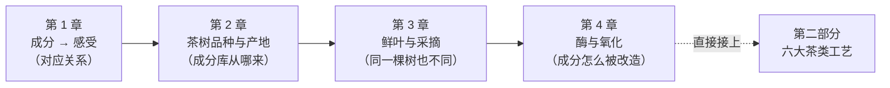

# 第一部分 · 茶的物质基础

> **这一部分要解决的问题**：为什么这杯茶是这个味道？
>
> 答案不在玄学里，在成分里。这一部分建立全书的地基——
> **成分 → 滋味 / 香气 / 汤色** 的对应关系。

## 为什么必须先学这个

很多人学茶是从"记名字"开始的：西湖龙井、正山小种、大红袍、老班章……
记了一堆名字，喝到嘴里还是只会说"好喝"和"不好喝"，遇到没听过的茶就完全失去判断。

这本书走另一条路：**先建立机理，再挂名字**。

因为茶叶所有的技术问题，展开都是同一个问题：

> **让哪些成分、以多少比例、进入茶汤。**

- 六大茶类的分野 → 工艺把成分**改造**到不同程度（第二部分）；
- 冲泡参数的作用 → 把成分**选择性溶出**（第四部分）；
- 感官审评的本质 → 从感受**反向读出**成分格局（第三部分）；
- 产区与品种的差异 → 成分库**本身**就不一样（本部分第 2、3 章）。

学完这一部分，你听到"鲜爽""苦涩""醇厚""回甘"这些词，脑子里应该能自动浮现出对应的分子；
看到"云南大叶种、夏茶"，能立刻推断它的滋味走向和适合做成哪一类茶。

## 本部分四章的逻辑链

| 章 | 一句话 |
|----|--------|
| [第 1 章 一片叶子里有什么](01-leaf-chemistry.md) | 三个主角（茶多酚/氨基酸/咖啡碱）与酚氨比，全书用得最多的一章 |
| 第 2 章 茶树：品种、产地与"山场" | 为什么大叶种适制红茶、高山茶为什么香 |
| 第 3 章 鲜叶与采摘 | 嫩度和"等级"的真实含义，明前贵在哪 |
| 第 4 章 酶与氧化 | 茶行业说的"发酵"根本不是微生物发酵（除了黑茶） |

## 读这一部分的方式

1. **不要背数字**。本书给的成分含量都是**典型区间**，跨度很大——因为茶叶本身变异就大。
   要带走的是**方向和比值**（比如"夏茶酚氨比更高"），而不是"茶多酚 25%"。
2. **每章的"常见说法辨析"要认真读**。茶圈流传的说法极多，这本书会逐条标注证据强度
   （有共识 / 有争议 / 缺乏证据 / 明确错误），这比多记几个名字有用得多。
3. **实操分两档**：🅐 是无器具版（现在就能做）、🅑 是有条件版（备齐茶具茶样后再做）。
   先把 🅐 做掉，🅑 攒着——等你真的开始喝，回来一次做完，效果比边看边泡好。

---

**开始**：[第 1 章 一片叶子里有什么：成分与滋味的对应](01-leaf-chemistry.md)
