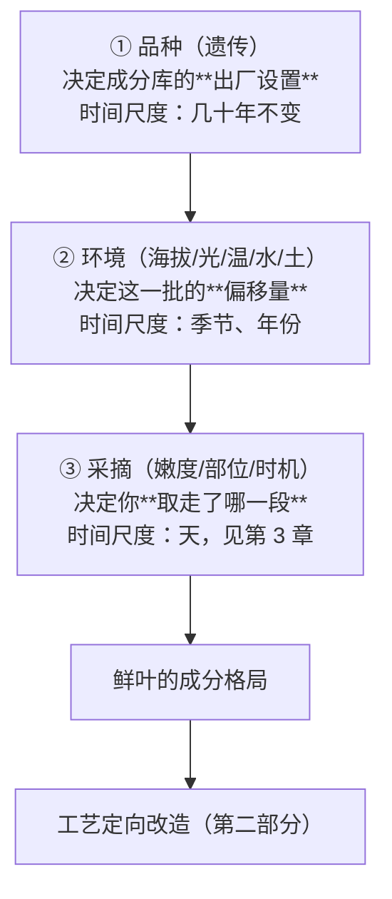

# 第 2 章 茶树：品种、产地与"山场"如何进入茶汤

> 本章目标：搞清楚第 1 章那个"成分库"是从哪来的。
> 品种给出**出厂设置**，环境决定**这一批的偏移**——两者都在动手之前就把这款茶的上限定下来了。
>
> 本章会拆掉一个流传极广的简化（"大叶种多酚高、小叶种氨基酸高"），
> 也会认真处理"山场""岩韵"这类听起来很玄的概念：它们**有实证部分**，也**有讲过头的部分**，
> 本章逐条分开。

## 2.1 先立一个框架

第 1 章说滋味由成分比例决定。那么成分比例由什么决定？三层，从慢到快：

**关键判断**：这三层是**乘法关系，不是加法**。好品种种错地方、或采错时候，成分格局照样跑偏；
反过来，顶级山场也救不回一个不适制的品种。所以行业里"品种—产地—工艺"三者要匹配，
不是营销话术，是有机理的。

## 2.2 茶树是什么：两个变种

栽培茶树的学名是 **Camellia sinensis**（山茶属），日常讨论主要涉及两个变种[^1]：

| | **中国变种** `var. sinensis` | **阿萨姆变种** `var. assamica` |
|---|---|---|
| 俗称 | 小叶种（China bush） | 大叶种（Assam bush） |
| 叶片 | 小而硬，叶色浓绿，叶尖较钝 | 大而柔软，叶色多带黄绿，叶尖较锐长 |
| 革质层 | **较厚** | 较薄 |
| 栅栏组织 | 可达 **3 层** | 一般只 **1 层** |
| 海绵组织 | 少而密 | 多而松 |
| 叶背气孔 | 多而密 | 大而稀 |
| 典型分布 | 江浙、闽北等 | 云南、印度阿萨姆等 |

**叶片大小的分级标准**（取新梢基部以上第二、三叶位的定型叶）：

| 叶面积 | 类型 |
|-------:|------|
| > 50 cm² | 特大叶 |
| 28~50 cm² | 大叶 |
| 14~28 cm² | 中叶 |
| < 14 cm² | 小叶 |

中国茶叶研究所还用**叶脉对数**辅助判断（10 对以上偏大叶）。

> **别把解剖结构当花絮**：栅栏组织层数与气孔密度直接关系到光合速率和水分代谢，
> 这是成分差异的**结构性成因**，不只是"长得不一样"。

## 2.3 "大叶种多酚高、小叶种氨基酸高"——对，但只对到统计层面

这是茶书里最常见的一句话。它的**方向是对的**，但被普遍讲成了个体判据，这就错了。

**传统表述**（教科书层面，方向可信）：

- 大叶种：茶多酚、咖啡碱、儿茶素（尤其酯型）较高，氨基酸较低 → 生成茶黄素的潜力大 →
  **适制发酵茶**，成茶醇厚浓爽、耐泡；
- 小叶种：氨基酸、茶氨酸、胡萝卜素、叶黄素较高，茶多酚较低 → 形成芳香物质的概率大 →
  **适制不发酵茶**，成茶高香清鲜。

**实测数据给出的修正**（这一段很重要）：一项测定 **403 份中国代表性茶树种质**儿茶素含量的研究显示：

| 项目 | 数值 |
|------|------|
| 全部种质儿茶素含量范围 | 56.6 ~ 231.9 mg/g（**相差 4 倍以上**） |
| 平均 | 154.5 ± 18.1 mg/g |
| `var. sinensis` 平均 | 152.9 ± 16.2 mg/g |
| `var. assamica` 平均 | 162.8 ± 22.3 mg/g |
| `var. pubilimba` 平均 | 165.1 ± 21.3 mg/g |

`sinensis` 确实**显著低于**其他两个变种（P < 0.05）——统计上成立。但请注意两个数字的对比：

> **变种之间的平均差异约 6%，而种质个体之间的差异超过 4 倍。**

结论：**"这片叶子大，所以茶多酚一定高"在个体层面经常是错的。**
变种只是一个很弱的先验，个体差异把它淹没了。

**遗传学上还有更根本的一条**：严格的"大叶种/小叶种"二分法在遗传上并不成立。
茶树高度杂合，`C. sinensis`、`C. assamica` 等分类单元可以**自由杂交**，
形成一个从极端中国种连续过渡到阿萨姆起源类型的**渐变群（cline）**，`C. sinensis` 之下还有上千个亚变种。
所以"大叶种/小叶种"更像一条连续光谱上的两端标签，不是两个抽屉。

> **一个具体的反例，值得记住**：组学研究发现，阿萨姆变种材料 'MYC' 因 **TCS1 表达缺陷**，
> **咖啡碱几乎不积累**；而酯型儿茶素反而在两个中国种材料中高丰度积累。
> 这与"大叶种咖啡碱、酯型儿茶素更高"的经典表述直接冲突。
> 说明什么？**说明品种层面的结论高度依赖具体材料，不能从变种名推断个体。**

## 2.4 品种怎么决定"适制性"

[适制性](../../glossary.md#suitability)不是品质高低，是**匹配**。品种通过三条路径决定它：

1. **酚氨比的基线**（第 1 章 1.5 节）——决定它天生偏鲜爽还是偏浓强；
2. **儿茶素的组成**——不只是总量。酯型/非酯型的比例决定苦涩的"质地"；
3. **香气前体的种类**——决定它能做出什么香型（品种香，第 16 章展开）。

第 3 条最容易被忽略，但它是"品种香"的物质基础：铁观音的音韵、水仙的兰花香、
祁门红茶的"祁门香"，都强烈依赖品种，换品种做同样工艺是做不出来的。

**一个前沿但很有说服力的证据**：对 114 份山茶属植物的研究发现，
三种 **O-甲基化儿茶素**可能适合用来判定**乌龙茶适制性**——
适制乌龙茶的品种，其 **EGCG3″Me 含量显著高于**适制红茶和绿茶的品种。
这说明适制性是可以从分子层面找到标记的，不全靠经验。

**但也别把品种当命运**：云南 6 份**大叶种**新材料做绿茶适制性研究，6 个材料都表现出明显的绿茶适制特征，
水浸出物最高达 48.0%。更有意思的是——

> 其中氨基酸含量最高（7.2%）、茶多酚含量最低（22.4%）的那份材料，
> **感官总分反而较低**（86.2 分）。

这又一次印证第 1 章的原则：**单项极值不等于品质，协调才是品质**。

## 2.5 海拔：为什么"高山云雾出好茶"

这句老话是有机理的，而且可以拆成几条独立的、都能站住的作用：

### ① 温度：海拔每升高 100 m，气温下降约 0.6 ℃

1000 m 的高山茶园平均气温比平原产区低约 6 ℃。低温 → 茶树生长**慢** → 单位时间积累的内含物更多，
而且**持嫩性好**（不容易木质化）。芽叶柔软、叶肉厚实、果胶质含量高。

### ② 昼夜温差大：白天多合成，夜里少消耗

白昼温度高、光合作用强 → 合成多；夜间温度低、呼吸作用弱 → 消耗少。净积累就高。
方向上表现为：**多酚类减少、苦涩降低，茶氨酸与可溶氮增加**。

### ③ 海拔与茶多酚的关系有个门槛

有资料给出的规律是：茶树**超过约 500 m 海拔后，茶多酚含量随海拔增加而降低**。
这与"高山茶涩味轻"是一致的。

### ④ "高山"的定义按茶类不同

这点很实用，买茶时会遇到：

| 茶类/产区 | 常说的"高山"门槛 |
|-----------|-----------------|
| 一般表述 | 800 m 以上 |
| 福鼎白茶 | 600 m 及以上 |
| 普洱、台湾茶 | 一般 1000 m 以上 |

中国农业科学院茶叶研究所的研究认为，**在一定海拔范围内**氨基酸含量随海拔升高而增加、
**产量随海拔升高而减少**，海拔 **800 m 左右**的山区在品质与产量之间较为平衡。

> **注意"在一定范围内"这个限定**。海拔不是越高越好——过高会遇到冻害、生长期过短、产量过低，
> 经济上和农艺上都不成立。**"越高越好"是营销叙事，不是农学结论。**

## 2.6 光：漫射光假说，以及一处必须诚实交代的分歧

茶树起源于中国西南部深山密林，长期形成了**适应漫射光**的习性。高山云雾多、湿度大，
茶树接受的光照强度和光谱都与平地不同 → 游离氨基酸与芳香物质含量高、纤维素少、持嫩性好。

**方向可信**。但一到"具体是什么光起作用"，通俗文献就打起来了：

| 说法 | 论证方式 |
|------|----------|
| **蓝紫短波光增强** | 云雾把长波光反射掉，穿透力强的蓝紫短波光作用于茶树；蓝光利于氮代谢与蛋白质形成，紫光还与氨基酸、维生素、芳香物质形成直接相关 |
| **红黄光增强** | 湿度与雾珠使可见光中的红黄光得到加强，而红黄光有利于提高叶绿素和氨基酸含量 |

> **⚠️ 证据强度：有争议（且两种说法在科普文献中并存）。**
> 这两个解释指向相反的光谱区间，**不可能都对**。本书的处理是：
> **接受"漫射光多、直射光少 → 有利于氮代谢产物积累"这个层面的结论**（这与遮阴实验的结果一致，
> 见第 1 章 1.5 节），但**不采信任何一个具体的"哪段光谱起作用"的通俗说法**——
> 那需要实测光谱 + 代谢组的研究支撑，而我没有找到能定论的一手证据。
>
> 顺便说：**遮阴实验是这套说法最硬的支撑**。人工遮阴能重复出"氨基酸升、多酚降"的效果，
> 这至少证明"减少直射光"这一步是真实有效的，不必依赖任何特定的光谱假说。

## 2.7 土壤与"山场"：武夷岩茶是最好的案例

"山场"是茶行业对"具体那一小块地"的说法，最典型的就是武夷岩茶的**正岩 / 半岩 / 洲茶**之分。
这个概念有**实打实的实测支撑**，值得认真讲。

### 土壤数据对得上

福建省茶科所的土壤调查（常被引用）给出的对照：

| 产区 | 土壤特征 | 岩韵表现 |
|------|----------|----------|
| **正岩**（三坑两涧等） | 含砂砾量 **24%~29%**，孔隙度约 **50%**，通透性好，土层厚，**钾、锰含量高**，酸度适中 | **岩韵显著** |
| **半岩**（青狮岩、碧石岩等） | 厚层岩红土，土层较薄，**铝高、钾特少**，酸度较高，质地黏重 | 岩韵微显 |
| **洲茶**（九曲溪畔、狮子口等） | 冲积土，钙含量高、土壤肥沃 | 茶韵不明显 |

**地形也参与其中**："三坑两涧"生长于幽谷之间，"V"字地形便于土层堆积沉淀 →
土层厚、矿物质含量高，而砂砾多又保证了通透性。同时岩壁**挡光**、日照时间短、空气湿度偏高 →
茶树生长慢 → 内含物积累多。

> 看出来了吗？**"山场"最终还是通过第 2.5、2.6 节那几条机理起作用的**：
> 挡光 = 漫射光多；谷地 = 湿度高、温差特殊；砾质土 = 保水又透气、根系发育好。
> 它不是一个独立的玄学变量，而是**多个已知变量在一小块地上的特定组合**。

### 学术研究也在做

《土壤学报》上一项研究以肉桂为对象，在**正岩区 41 个、半岩区 21 个、洲茶区 50 个**共 112 个茶园
取样（每园 10 个茶青样，共 1120 个样品），测定 12 种主要矿质元素，
系统比较三类茶区的矿质养分地域性差异。另有微量元素研究发现名岩区土壤微量元素平均含量
多低于丹岩区（Cu、Cr 分别约为丹岩区的 0.21 和 0.33 倍），并把原因归到成土母质类型、
理化性质、农耕强度以及降雨淋溶差异上。

### 但有三个坑必须提醒

1. **产区边界会漂移**。2002 年武夷岩茶成为国家地理标志产品，GB/T 18745 把武夷山市分为
   **名岩区**（传统正岩+半岩范围）与**丹岩区**。而市场语境里，
   **传统的半岩产区现在已经开始被归类为"正岩"**，"半岩"被扩大到景区外围的茶山。
   → **读不同年代的文献和商品描述时，"正岩/半岩"未必指同一块地。**
2. **农业类研究多测养分含量，不等于解释了风味**。目前这类研究能证明"不同山场的矿质元素确有差异"，
   但"某元素差异 → 某风味特征"的因果链条**还没有被完整建立**。
3. **元素含量高 ≠ 品质好**。微量元素研究发现名岩区多数微量元素含量反而**更低**。
   这提醒我们别落入"矿物质越多越好"的思维——茶树需要的是**协调**，不是堆料。

### 那"岩韵"到底能不能站住？

按证据强度分层，这是本书的判断：

| 层次 | 判定 |
|------|------|
| "不同山场的土壤、地形、小气候确有客观差异" | ✅ **有实测支撑** |
| "这些差异会影响茶树生长与内含物积累" | ✅ **机理清楚、方向一致** |
| "因此不同山场的茶在感官上可区分" | ⚠️ **多数从业者认可，且有审评实践支撑，但盲品可重复性的公开数据不足** |
| "岩韵 = 某种特定的矿物质味 / 能喝出岩石" | ❌ **缺乏证据**，属于把机理讲成了字面意思 |
| "只有某几条坑的茶才算好茶" | ❌ **稀缺性叙事**，与品质判断是两件事（第 34 章） |

> **本书的态度**：山场是真的，**山场溢价的幅度**是另一回事。
> 前者是农学，后者是市场——学茶的人要能把这两件事分开说。

## 2.8 常见说法辨析

| 说法 | 判定 | 说明 |
|------|------|------|
| "大叶种茶多酚一定比小叶种高" | **⚠️ 只在统计上成立** | 变种间平均差约 6%，个体间差 4 倍以上；且遗传上是连续渐变群，不是两个抽屉 |
| "海拔越高茶越好" | **❌ 过度外推** | 只在**一定范围内**成立；过高则冻害、生长期短、产量过低。研究给出的品质产量平衡点在 800 m 左右 |
| "高山茶好是因为紫外线/蓝紫光多" | **⚠️ 有争议** | "漫射光多、直射少 → 氮代谢产物积累"可信（遮阴实验支持）；但具体哪段光谱起作用，通俗文献自相矛盾（蓝紫光 vs 红黄光），本书不采信任一 |
| "岩韵来自土壤里的矿物质，喝的是岩石味" | **❌ 字面化的误解** | 山场差异真实存在且机理清楚（挡光、湿度、砾质土、生长慢），但"某元素 → 某风味"的因果链未建立；且名岩区微量元素含量反而更低 |
| "正岩茶就是核心产区的茶，标准很明确" | **⚠️ 边界会变** | 国标分名岩区/丹岩区；市场语境下"正岩/半岩"的范围近年已漂移，不同年代文献指的不是同一块地 |
| "古树茶因为树龄老所以内含物更丰富" | **⚠️ 缺乏充分证据** | 树龄与成分的关系远比"越老越好"复杂，且古树多同时占据特定生态位（海拔、遮荫、稀植），**混杂因素难以剥离**。本书在第 31 章单独处理 |
| "换个山头种同一个品种，做出来味道一样" | **❌ 错误** | 环境层的偏移是真实的（本章 2.5~2.7 节全部证据） |

## 2.9 思考题

1. "大叶种茶多酚高、小叶种氨基酸高"这句话，**在什么层面成立、在什么层面不成立**？
   用 403 份种质那组数据说明。
2. 为什么说品种、环境、采摘这三层是**乘法关系**而不是加法关系？举一个"某一层拖后腿导致全盘落空"的例子。
3. 一份大叶种材料，氨基酸含量最高（7.2%）、茶多酚含量最低（22.4%），但绿茶感官总分反而较低。
   这个结果说明了什么？它和第 1 章哪个结论是同一件事？
4. "高山云雾出好茶"里，**哪些机理是可靠的、哪些说法是有争议的**？如果只允许你保留一条最硬的证据，你保留哪条、为什么？
5. 武夷岩茶的"山场"通过哪些**已知变量**起作用？请把"正岩土壤含砂砾 24%~29%、孔隙度 50%"
   这条数据翻译成茶树生理层面的解释。
6. 名岩区土壤的多数微量元素含量反而**低于**丹岩区。这个反直觉的结果，对"矿物质越多茶越好"的想法意味着什么？
7. （进阶）有人拿"某山场茶叶的某矿质元素含量显著更高"来论证岩韵的物质基础。
   这个论证在逻辑上缺了哪一环？要补上需要什么样的研究？

> 📖 **参考答案**（想清楚再看）：[Q1](../../qa/02-cultivar-terroir-qa.md#q1) ·
> [Q2](../../qa/02-cultivar-terroir-qa.md#q2) · [Q3](../../qa/02-cultivar-terroir-qa.md#q3) ·
> [Q4](../../qa/02-cultivar-terroir-qa.md#q4) · [Q5](../../qa/02-cultivar-terroir-qa.md#q5) ·
> [Q6](../../qa/02-cultivar-terroir-qa.md#q6) · [Q7](../../qa/02-cultivar-terroir-qa.md#q7)

## 2.10 本章实操

### 🅐 无器具版：拆解三条产品描述里的"产地叙事"

找三款有明确产地叙事的茶（电商详情页最方便，越会讲故事的越好），填表：

| 项目 | 茶样 1 | 茶样 2 | 茶样 3 |
|------|--------|--------|--------|
| 品名 / 茶类 | | | |
| 宣称的产地 / 山场 / 海拔 | | | |
| 宣称的品种（有没有写？） | | | |
| 详情页给出的**可核查事实**（海拔、品种名、标准号、地理标志） | | | |
| 详情页给出的**不可核查叙事**（"高山云雾""核心产区""古树"） | | | |
| 👉 它宣称的产地效应，对应本章哪条机理？ | | | |
| 👉 有没有**只给叙事、不给事实**的地方？ | | | |
| 👉 如果你要验证它，你会问卖家哪三个问题？ | | | |

**这个练习训练的能力**：把"产地故事"翻译成"可核查的变量"。
及格线是——看到"高山云雾"能立刻反问：**多少米？哪个坡向？什么品种？采于哪一季？**

### 🅐 无器具版加餐：给"岩韵"做一次证据分层

不看 2.7 节最后那张表，自己给下面五句话判证据强度（✅有共识 / ⚠️有争议 / ❌缺乏证据），
然后对照：

1. 三坑两涧的土壤砂砾含量高于洲茶区。
2. 砂砾多让土壤透气性好，有利于根系发育。
3. 正岩茶与洲茶在感官上可以区分。
4. 岩韵是一种可以喝出来的矿物质味道。
5. 只有牛栏坑的肉桂才是好肉桂。

### 🅑 有条件版：同品种不同产地的平行对比（备齐后再做）

**所需**：**同一品种、同一茶类、不同产地（或不同海拔）**的两款茶，各 5 g；盖碗或两个同款杯；秤。

难点在于**选样**：必须锁定品种和工艺，只让产地变化。可行的组合举例——
同为福鼎大白茶做的白茶但海拔不同；同为肉桂但正岩 vs 外山；同为铁观音但不同乡镇。

| 变量 | 茶样 A | 茶样 B |
|------|--------|--------|
| 品种（必须相同） | | |
| 茶类/工艺（必须相同） | | |
| 产地 / 海拔（**唯一变量**） | | |
| 年份、季节（尽量相同） | | |

用[冲泡记录表](../../forms/brewing-log.md)记录，参数完全一致，重点比：

| 观察项 | A | B | 差异是否指向本章的机理？ |
|--------|---|---|--------------------------|
| 香气类型与高低 | | | |
| 鲜爽度 | | | |
| 苦 / 涩（分开记） | | | |
| 厚度 / 稠感 | | | |
| 耐泡度（到第几泡转淡） | | | |
| 叶底厚薄、柔软度 | | | |

> **诚实预期**：这个对比**很可能得不出干净的结论**——因为你几乎不可能真正只让产地一个变量变化
> （制茶师傅的手艺、当年天气、储存条件都会混进来）。**这本身就是本章最重要的一课**：
> 产地效应真实存在，但在单次品饮中**极难与工艺、批次效应分离**。
> 谁跟你说"一喝就知道是哪条坑"，你至少该问一句：盲品做过几次、对了几次。

## 2.11 本章主要参考

| 本章的哪个结论 | 来源 |
|----------------|------|
| 403 份种质儿茶素实测、变种间差异 | [Determination of Catechin Content in Representative Chinese Tea Germplasms, *J. Agric. Food Chem.*](https://pubs.acs.org/doi/10.1021/jf5024559) |
| 中国种 vs 阿萨姆种的代谢组/转录组差异、TCS1 与咖啡碱 | [Metabolomic and Transcriptomic Analyses… between *C. sinensis* var. *sinensis* and var. *assamica*](https://www.ncbi.nlm.nih.gov/pmc/articles/PMC9690216/) |
| O-甲基化儿茶素与乌龙茶适制性（114 份材料） | [The distribution of catechins… and tea-processing suitability](https://www.sciencedirect.com/science/article/pii/S2590157525003086) |
| 云南大叶种材料的绿茶/红茶适制性实证 | [云南省农业科学院机构知识库相关成果](https://yunnan.agriir.cn/resources/detail/1/8D7B19E1-BC99-45D8-9E0C-767B0B7C05EF.html?projectId=405d92be-2997-11e7-b5f5-3440b5b17484) |
| 叶面积分级、解剖结构差异 | 茶树形态与品种学通用教材内容（[汇总说明](https://zhuanlan.zhihu.com/p/213924600)，仅作"存在此表述"的线索，数值以教材为准） |
| 武夷岩茶正岩/半岩/洲茶矿质养分差异（112 茶园 1120 样） | [武夷岩茶中矿质养分的地域性差异及影响因素，《土壤学报》](http://pedologica.issas.ac.cn/html/trxb/2022/2/trxb202006290341.htm) |
| 名岩区/丹岩区土壤微量元素分布 | [武夷岩茶主产区土壤及茶叶微量元素分布特征](http://html.rhhz.net/slyhjxb/html/20160407.htm) |
| 海拔与温度、氨基酸、产量的关系 | 中国农业科学院茶叶研究所相关研究（经科普资料转述，见 [standards.md](../../standards.md) 说明） |

> **⚠️ 本章明确标注为存疑或不采信的内容**：
> ① 高山茶的具体"光谱假说"（蓝紫光 vs 红黄光两说并存，均未采信为定论）；
> ② "岩韵 = 矿物质味"的字面化解释；
> ③ 古树茶"树龄越老内含物越丰富"（混杂因素无法剥离，留待第 31 章）。
> 按[查证纪律](../../standards.md)，方向可信的部分照写，因果链未建立的部分明确说明。

---

[^1]: 茶树的植物学分类历史上多次变动，本书采用日常与农学文献最通用的
      `Camellia sinensis var. sinensis` / `var. assamica` 二变种表述，并在 2.3 节说明
      这个二分法在遗传上的局限。另有 `var. pubilimba` 等变种，本书不展开。
      国标定义茶叶原料时用的表述是 `Camellia sinensis (L.) O. Kuntze`。
