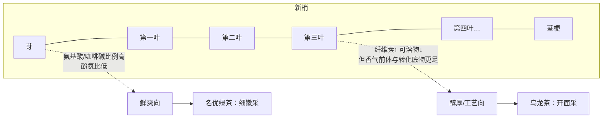
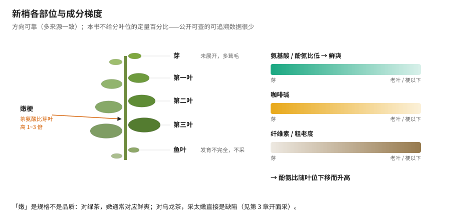
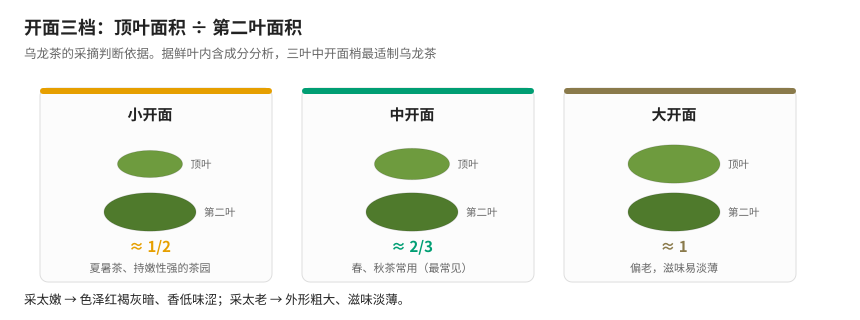
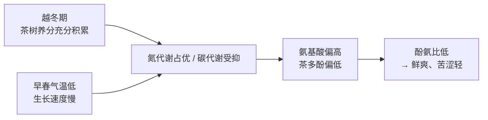

# 第 3 章 鲜叶与采摘：嫩度、采摘标准与"等级"的由来

> 本章目标：理解采摘这一步在干什么——它决定了你从那株茶树上**取走了哪一段**。
> 学完这章你会明白："嫩"不等于"好"，而"等级"很大程度上说的不是品质，是**规格**。
>
> 本章有一处我要坦白：**分叶位的定量成分数据，公开可查的很少**。
> 所以本章讲的是**方向和规律**，凡是我找不到可靠出处的具体数值，一律不写（见 3.3 节）。

## 3.1 采摘 = 在一个成分梯度上取样

第 2 章末尾那张图里，采摘是第三层。它和前两层有个本质区别：

> **品种和环境决定了"这株茶树上有什么"；采摘决定"你拿走其中的哪一部分"。**

因为**新梢上的成分不是均匀分布的**。从芽尖到老叶，是一条连续的梯度：
越靠芽尖，氮代谢产物（氨基酸、咖啡碱）比例越高；越往下，纤维素等结构物质越多。

所以采摘标准的实质，是**在这条梯度上划一条线**——线划在哪，取决于你要做什么茶。
这就是为什么名优绿茶采芽尖，而乌龙茶偏偏要等叶子长开：

## 3.2 先把名字统一：新梢各部位怎么叫

审评和采摘标准里全是这些词，先认清：

| 术语 | 是什么 |
|------|--------|
| **芽**（芽头、单芽） | 未展开的顶芽，包裹紧实，多有茸毛 |
| **一芽一叶 / 一芽二叶** | 芽 + 已展开的第 1（或第 1、2）片真叶 |
| **初展** | 叶片刚展开、还没完全平展（"一芽二叶初展"比"一芽二叶"更嫩） |
| **鱼叶** | 新梢基部第一片发育不完全的小叶，形似鱼鳞，**通常不采** |
| **对夹叶** | 顶芽停止生长后形成的两片对生叶，无正常芽——**是"这根梢停长了"的信号** |
| **嫩梗** | 芽叶之间的嫩茎，**含茶氨酸特别高**（见 3.3 节） |
| **开面** | 顶芽停止生长、顶叶展开的状态，乌龙茶采摘的判断依据 |

> **嫩梗这一条要特别记住**：很多人挑茶时把"有梗"当缺点挑掉，
> 但**茶氨酸在嫩梗中的含量比芽叶高 1~3 倍**。这解释了两件事——
> 为什么乌龙茶、白茶带梗是正常且必要的，以及为什么日本的"茎茶（茎ほうじ茶/かりがね）"
> 会作为一个独立品类存在、口感偏甜鲜。

## 3.3 成分的空间梯度：方向可靠，数值稀缺

**能站住的方向性规律**（多来源一致）：

| 成分 | 分布规律 |
|------|----------|
| **氨基酸** | **嫩叶 > 老叶**；**嫩梗 > 芽 > 叶**；茶氨酸在嫩梗中比芽叶高 **1~3 倍** |
| **茶氨酸（品种/季节维度）** | 小叶种 > 大叶种；春梢 > 秋梢 > 夏梢 |
| **咖啡碱** | **细嫩芽叶 > 老叶** |
| **茶多酚 / 儿茶素** | 幼嫩新梢中较高，向下递减；且 **EGCG、ECG 随伸育程度递减，而 EGC 随伸育程度升高** |
| **香气成分（以芳樟醇为例）** | **芽 > 一叶 > 二叶 > 三叶 > 茎**，依次递减 |
| **纤维素 / 粗老度** | 随叶位下移**递增** |

综合起来：**酚氨比随叶位下移而升高**（因为氨基酸降得比多酚快），
这就是"嫩 → 鲜爽、老 → 粗淡"的成分基础。

> **⚠️ 诚实说明（本章最需要交代的一点）**：上面这些是**定性方向**。
> 我尝试检索"芽 / 第一叶 / 第二叶 / 第三叶"的**分叶位定量含量表**，
> 公开可得的完整数据很少——很多科普文章列了表格，但没有可追溯的原始出处。
> 按本书的[查证纪律](../../standards.md)，**方向照写，数字不编**。
> 如果你要做严谨引用，请查《茶叶生物化学》或《茶叶科学》上关于新梢不同叶位生化成分的定量研究。

**而且"越嫩越高"并不是普适的**。一个具体反例：在'紫娟'一芽五叶新梢中，
**第三叶的 EGCG3″Me 含量最高（1.24%）**，高于鲜叶整体（1.05%）。
而 EGCG3″Me 恰恰是第 2 章提到的**乌龙茶适制性标记物**。

> 把这两件事连起来看，乌龙茶为什么要采成熟叶就有了成分层面的暗示：
> **它要的某些底物，恰恰不在最嫩的部位。**

## 3.4 四类采摘标准

这是评茶员知识体系里的标准分类，按茶类来分：

| 标准 | 采什么 | 用于 |
|------|--------|------|
| **细嫩采** | 单芽、一芽一叶、一芽二叶初展 | 高级名茶：高级西湖龙井、洞庭碧螺春、君山银针、黄山毛峰、庐山云雾等 |
| **适中采** | 以**一芽二叶**为主，兼采一芽三叶和幼嫩对夹叶 | 大宗茶：眉茶、珠茶、工夫红茶、红碎茶——**目前中国最普遍的标准** |
| **开面采** | 新梢长到 3~5 叶将成熟、顶叶六七成开面时，采下 **2~4 叶** | 乌龙茶等特种茶 |
| **成熟采** | 顶芽将停止生长、下部基本成熟时，采一芽四五叶、对夹三四叶 | 边销茶（黑茶原料） |

细嫩采"花工夫、产量不多、季节性强"，大多在春茶前期采——这是名优茶贵的**直接原因之一**
（另一部分原因见第 34 章）。

### 开面采：乌龙茶的三档"开面"

这套定义很实用，记住比例就行：

| 开面等级 | 定义（顶部第一叶 vs 第二叶的面积） |
|----------|-----------------------------------|
| **小开面** | 顶叶面积 ≈ 第二叶的 **1/2** |
| **中开面** | 顶叶面积 ≈ 第二叶的 **2/3** |
| **大开面** | 顶叶面积 ≈ 第二叶的 **全部** |

**怎么选**（行业通行做法）：

- 春、秋茶采 **中开面**；
- 夏暑茶适当**嫩采**，即小开面；
- 茶园生长茂盛、持嫩性强的，也可小开面采，采一芽三四叶。

**为什么不能采太嫩**：据鲜叶内含成分分析，**采摘三叶中开面梢最适宜制乌龙茶**。
采太嫩，成茶色泽红褐灰暗、**香低味涩**；采太老，则外形粗大、色泽干枯、**滋味淡薄**。

> 台湾的经验也一致：除**东方美人**要求白毫、需嫩采"一心二叶"外，
> 其他乌龙并非越嫩越好，而是**需要具备足够的成熟叶**。
> 而且原料里鱼叶多会导致成品可溶出物质偏少、品质降低，还影响下一季产量——
> 所以产地会"**留鱼摘**"（留下鱼叶不采）。

**这一节是本章最重要的反直觉点**：

> **"嫩"不是品质，是规格。**
> 对绿茶，嫩通常对应鲜爽（酚氨比低）；对乌龙，过嫩直接是缺陷。

## 3.5 明前、雨前：机理站得住，但边界要说清

### 机理链条（可靠）

西湖龙井国家级代表性传承人樊生华的表述和这条链完全对得上：清明前气温低，
氨基酸含量较高，冲泡后有淡淡豆香、口感清新；清明后气温升高、茶树生长加快，
**氨基酸逐渐降低、茶多酚上升，表现就是涩味增加**。

### 但有四条边界必须知道

1. **"明前/雨前"只是江南茶区对春茶阶段的称呼**，主要指浙江、湖南、江西、
   安徽南部、江苏南部、湖北南部等地，**一般只用于绿茶或类似绿茶的茶类**。
   → **铁观音**的采摘一般**从谷雨开始**，**六安瓜片**采摘也在谷雨前后，
   所以这两类**根本没有"明前茶"的讲法**。看到"明前铁观音"要打个问号。
2. **雨前茶不是次品**。谷雨前（约 4 月 5 日后到 4 月 20 日左右）采制的雨前茶，
   虽不及明前细嫩，但**气温高、芽叶生长较快、积累的内含物也较丰富**，
   往往**滋味鲜浓而更耐泡**。
3. **古人就不认为越早越好**。明代许次纾《茶疏》讲采茶时节："清明太早，立夏太迟，
   **谷雨前后，其时适中**。"对江浙一带普通炒青绿茶，清明后到谷雨前确实最适宜。
4. **越细嫩 ≠ 越好**。纯芽头（芽茶）外形漂亮，但**内含物质不及一芽一、二叶丰富**，
   滋味上略有不足。**龙井茶特级的原料就选用一芽一、二叶，不采单芽。**

> **一个诚实的补充**：明前茶受追捧还有**非成分因素**——早春虫害少（农残顾虑小）、
> 产量不多物以稀为贵。这些是真实的价值，但它们属于**稀缺性和安全性**，
> 不等于"滋味一定更好"。把这几件事分开说，是学茶的人该有的分辨力。

## 3.6 "等级"到底是什么

初学者最容易误解的一个词。

> **等级主要描述"规格"（嫩度、匀整度、净度、外形），而不是"好喝程度"。**

同一款茶里，特级通常比一级嫩、匀、净——这没错。但：

- **不同品名之间的等级不可比**：特级寿眉和特级白毫银针，"特级"这两个字含义完全不同；
- **等级高不代表适口**：粗老一些的原料在某些茶类里是**必需**的（乌龙、黑茶）；
- **等级由产品标准定义**：各品名、规格、等级的产品应符合其对应的产品标准
  （见 GB/T 14456.1 等基本要求类标准的规定）。

第 36 章会教你读包装上的等级与执行标准；这里只要建立一个反射：
**看到"特级"先问一句——按哪个标准、哪个品名的特级？**

## 3.7 采摘技术：细节里有品质

茶农总结的"**虎口对芯采摘法**"：拇指与食指张开，从芽梢顶部中心插下，稍加扭折向上一提采下。

一般采叶标准：

- **长三叶采二叶，长四叶采三叶**；
- 采下对夹叶；
- **不采鱼叶、不采单叶、不带梗蒂**。

采摘时讲"**五分开**"，这条对品质影响极大：

> **品种分开、早午晚青分开、粗叶嫩叶分开、干湿茶青分开、不同地片分开。**

**为什么"五分开"是硬要求**：因为后面所有工艺（萎凋、做青、杀青、发酵）的参数
都是按**原料的均一性**来定的。如果一筐茶青里混着不同品种、不同嫩度、干湿不一，
那么同一套工艺参数对其中一部分必然是错的 → 成茶必然花杂。

> 这条原则在第二部分会反复出现：**工艺的前提是原料均一**。
> 审评里看到"叶底花杂"，很多时候root cause 在采摘环节，而不是制茶师傅手艺。

**手采与机采**（行业通行认识，非实验数据）：手采能精准控制嫩度与匀整度，
成本高、季节性强，名优茶基本靠手采；机采效率高、成本低，但**匀整度差、混入老叶与长梗多**，
适合大宗茶原料，配合后续筛分处理。

## 3.8 常见说法辨析

| 说法 | 判定 | 说明 |
|------|------|------|
| "茶越嫩越好" | **❌ 错误** | 只对部分绿茶成立。乌龙茶采太嫩直接是缺陷（色泽红褐灰暗、香低味涩），"三叶中开面"最适宜；黑茶原料要成熟采 |
| "纯芽头的茶最高级" | **⚠️ 只对外形成立** | 芽茶外形美观，但内含物质不及一芽一、二叶丰富，滋味略显不足。**龙井特级用一芽一、二叶，不采单芽** |
| "明前茶一定比雨前茶好" | **⚠️ 过度简化** | 明前氨基酸高、苦涩轻（机理成立）；但雨前内含物也较丰富、**往往更浓更耐泡**。古人主张"谷雨前后其时适中" |
| "明前铁观音 / 明前岩茶" | **❌ 概念错位** | "明前/雨前"是江南茶区对绿茶类的称呼。铁观音一般谷雨才开采，六安瓜片在谷雨前后，本就无"明前"之说 |
| "茶里有梗是偷工减料" | **❌ 错误** | **茶氨酸在嫩梗中比芽叶高 1~3 倍**。乌龙、白茶带梗是必要的；日本茎茶是独立品类 |
| "等级越高越好喝" | **⚠️ 混淆概念** | 等级主要是**规格**（嫩度/匀整/净度/外形），不同品名之间的"特级"不可比 |
| "鱼叶、对夹叶都要采干净才不浪费" | **❌ 反了** | 不采鱼叶、要"留鱼摘"；鱼叶多会使成品可溶出物偏少、品质下降，还影响下一季产量 |

## 3.9 思考题

1. 为什么名优绿茶要采单芽或一芽一叶，而乌龙茶偏偏要等到"中开面"才采？
   请分别从**目标风味**和**成分梯度**两个角度回答。
2. "茶氨酸在嫩梗中比芽叶高 1~3 倍"这条数据，能解释哪三件平时会遇到的事？
3. 采乌龙茶时如果采得过嫩，成茶会出现"色泽红褐灰暗、香低味涩"。
   结合第 1 章和本章，推测一下为什么会**又暗又涩**（提示：想想做青和氧化需要什么样的叶片）。
4. "明前茶氨基酸高"的机理链条是什么？这条链在**哪些茶类/产区不适用**，为什么？
5. 采摘的"五分开"为什么是硬要求？如果不做，最终会在审评的哪一项上暴露出来？
6. 有人说"这款茶是特级，所以比那款一级的好喝"。这句话可能错在哪几处？
7. （进阶）本章坦白了"分叶位的定量成分数据公开可得的很少"。
   假设你要自己建立一份可靠的分叶位成分梯度数据，实验该怎么设计？
   至少要控制哪些变量、避免哪些混杂因素？

> 📖 **参考答案**（想清楚再看）：[Q1](../../qa/03-plucking-qa.md#q1) ·
> [Q2](../../qa/03-plucking-qa.md#q2) · [Q3](../../qa/03-plucking-qa.md#q3) ·
> [Q4](../../qa/03-plucking-qa.md#q4) · [Q5](../../qa/03-plucking-qa.md#q5) ·
> [Q6](../../qa/03-plucking-qa.md#q6) · [Q7](../../qa/03-plucking-qa.md#q7)

## 3.10 本章实操

### 🅐 无器具版：从图片反查采摘标准

去电商或产区公众号找**三款不同茶类**的干茶/鲜叶图片（最好有摊开的鲜叶照或叶底照），
判断它们的采摘标准，填表：

| 项目 | 茶样 1 | 茶样 2 | 茶样 3 |
|------|--------|--------|--------|
| 品名 / 茶类 | | | |
| 图上能看到**几叶**？有芽吗？ | | | |
| 有梗吗？梗的比例大致多少？ | | | |
| 👉 判断属于四类采摘标准里的哪一类 | | | |
| 👉 这个采摘标准和它的茶类**匹配吗**？ | | | |
| 商家宣称的嫩度描述（"单芽""一芽一叶"…） | | | |
| 👉 宣称与图片**一致吗**？ | | | |

**及格线**：看到一款乌龙茶宣传"纯芽头、极嫩"，你能立刻判断这是**卖点错位**——
乌龙采太嫩是缺陷，不是优点。

### 🅐 无器具版加餐：给三句话找错

不看 3.8 节，自己指出下面三句话各错在哪，再对照答案：

1. "我们家的明前大红袍，谷雨前抢采的头春芽尖。"
2. "这款白茶挑得特别干净，一根梗都没有，所以更高级。"
3. "同价位买特级不买一级，肯定更好喝。"

### 🅑 有条件版：嫩度对照（备齐后再做）

**所需**：**同一产地、同一品种、同一工艺，但等级/嫩度不同**的两款茶（例如白毫银针 vs 寿眉，
或同一款绿茶的特级 vs 三级），各 5 g；秤；两个同款杯或盖碗。

| 变量 | 茶样 A（较嫩） | 茶样 B（较老） |
|------|----------------|----------------|
| 品名 / 等级 | | |
| 产地、品种、年份（尽量相同） | | |
| 投茶量、水量、水温、时间（**必须完全相同**） | | |

| 观察项 | A（嫩） | B（老） | 是否符合"酚氨比随叶位升高"的预测？ |
|--------|---------|---------|-------------------------------------|
| 干茶：芽/叶/梗的比例 | | | |
| 鲜爽度 | | | |
| 苦 / 涩（分开记，等 15 秒再判涩） | | | |
| 甜感 / 厚度 | | | |
| 耐泡度 | | | |
| 叶底：叶片大小、软硬、梗的多少 | | | |

> **重点不在"哪个好喝"，而在"差异的方向对不对"**。
> 预期：A 更鲜爽、B 更耐泡或更醇（若是白茶，寿眉的甜厚感常胜过银针）。
> 如果结果与预测相反，先别怀疑理论——**先检查两个样是不是真的只差嫩度**
> （年份、储存、工艺细节都会混进来）。记录用[冲泡记录表](../../forms/brewing-log.md)。

## 3.11 本章主要参考

| 本章的哪个结论 | 来源 |
|----------------|------|
| 四类采摘标准（细嫩采/适中采/开面采/成熟采）、虎口对芯采法、五分开 | [茶叶采摘（智汇三农）](https://www.pwsannong.com/c/2016-04-13/545882.shtml)；[茶叶采摘的方法详解](https://www.guitea.com/htm/Article/ArticleDetail/298.html?lang=zh_CN) |
| 小/中/大开面定义、三叶中开面最适制乌龙、采嫩采老的缺陷 | [乌龙茶的采摘标准](http://m.chawh.net/zs/cz/11577.html)；[茶叶采摘标准与适制茶类](https://www.miyexiang.com/article-21203-1.html) |
| 东方美人嫩采例外、留鱼摘、鱼叶多的危害 | [茶葉採摘標準、茶葉分級制度（荼公子）](https://www.hanyitea.tw/single-post/sftgfop1/) |
| 氨基酸"嫩梗 > 芽 > 叶"、茶氨酸嫩梗高 1~3 倍、咖啡碱细嫩高 | [茶叶的内含物质介绍](https://m.guchaju.com/cha/2755.html)（与《茶叶生物化学》教材表述一致，交叉见第 1 章来源） |
| EGCG/ECG 随伸育递减、EGC 递增；'紫娟'第三叶 EGCG3″Me 最高 | [云南农业大学学报相关研究](https://xb.ynau.edu.cn/jwk_zk/cn/article/pdf/preview/10.16211/j.issn.1004-390X(n).2015.03.015.pdf) |
| 芳樟醇随叶位递减 | 同上组来源 |
| 明前/雨前机理、适用范围、龙井特级用一芽一二叶 | [明前茶（百度百科，作为常见表述索引）](https://baike.baidu.com/item/%E6%98%8E%E5%89%8D%E8%8C%B6/5043110)；[上春山品春茶，为什么说"明前茶"贵如金（新浪财经，含传承人访谈）](https://finance.sina.com.cn/jjxw/2025-04-06/doc-inesfawn9536012.shtml)；[怎么区别明前茶、雨前茶…（腾讯新闻）](https://news.qq.com/rain/a/20210621A00DWS00) |
| 许次纾《茶疏》"谷雨前后，其时适中" | 同上（原始文献为明代《茶疏》） |

> **⚠️ 本章明确不写的内容**：分叶位的**定量**成分百分比表。
> 检索到的表格均无可追溯的原始出处，按查证纪律只写方向、不写数字。
> 手采 vs 机采的对比按"行业通行认识"标注，未找到可引用的对照实验数据。
