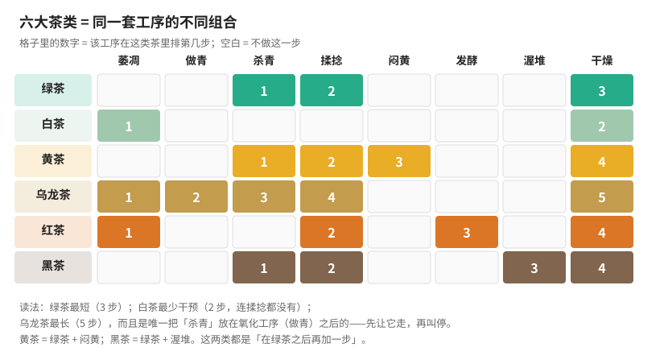

# 第二部分 · 六大茶类与工艺原理

> **这一部分要解决的问题**：为什么同一片叶子能做出六种完全不同的茶？
>
> 第一部分给了你框架——**工艺 = 定向改造成分**。这一部分把框架填满：
> 每一类茶具体改造了什么、靠哪道工序改造、参数错了会出什么缺陷。

## 从"框架"到"细节"

第一部分第 4 章那张"六大茶类 = 对酶的四种处理"总表，是本部分的**总纲**。
接下来八章，就是把那张表的每一行展开：

看这张图最该注意的不是"哪类茶做哪些工序"，而是**三个结构性事实**：

1. **绿茶最短（3 步），白茶最少干预（2 步，连揉捻都没有）**——少不等于简单，
   白茶恰恰因为能调的旋钮最少而最难控（第 7 章）。
2. **乌龙茶最长（5 步），而且是唯一把「杀青」放在氧化工序之后的**——
   先让它走一段，再叫停。这个"先放后收"是它成为技术顶点的原因（第 9 章）。
3. **黄茶 = 绿茶 + 闷黄；黑茶 = 绿茶 + 渥堆**——这两类都是"在绿茶之后再加一步"，
   只是一个浅尝辄止、一个充分尽致（第 8、11 章）。

## 本部分八章的顺序

按**氧化程度**从低到高排，最后处理不在这根轴上的黑茶与再加工茶：

| 章 | 主题 | 关键工序 | 一句话 |
|----|------|----------|--------|
| [第 5 章](05-classification.md) | 分类的逻辑 | — | 国标凭什么这么分，一张图看懂六类差别 |
| 第 6 章 | 绿茶 | 杀青 | 如何用高温"锁住"绿 |
| 第 7 章 | 白茶 | 萎凋 | 最少干预为什么最难控 |
| 第 8 章 | 黄茶 | 闷黄 | 一步之差与绿茶分家 |
| 第 9 章 | 乌龙茶 | 做青 + 焙火 | 半发酵的技术顶点 |
| 第 10 章 | 红茶 | 揉捻 + 发酵 | 茶黄素/茶红素/茶褐素的调控 |
| 第 11 章 | 黑茶与普洱 | 渥堆 / 陈化 | 微生物后发酵 |
| 第 12 章 | 再加工茶 | 窨制 / 紧压 | 花茶、紧压茶、抹茶 |
| 🛠 | 项目 P1 | — | 从工艺特征**反推**茶类与工艺缺陷 |

## 读这一部分的方式

1. **每章都回头对照那张工序矩阵**。你要建立的是"工序 → 成分变化 → 感官特征"的链条，
   而不是记住哪个茶叫什么名字。
2. **重点看"参数错了会怎样"**。每章都有缺陷成因表——这是第三部分（审评）的基础：
   审评的本质是**从感官反推工艺出了什么问题**。
3. **实操仍分两档**：🅐 无器具版（现在能做）/ 🅑 有条件版（备齐茶具茶样后再做）。

---

**开始**：[第 5 章 分类的逻辑：GB/T 30766 与一张工艺总图](05-classification.md)
