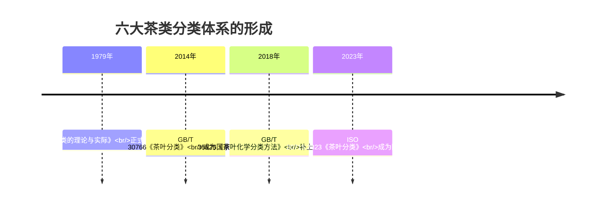
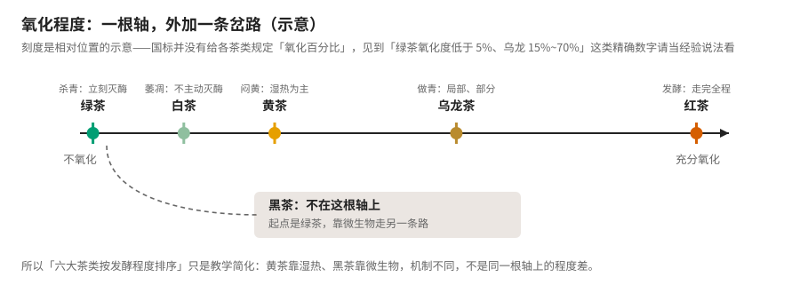
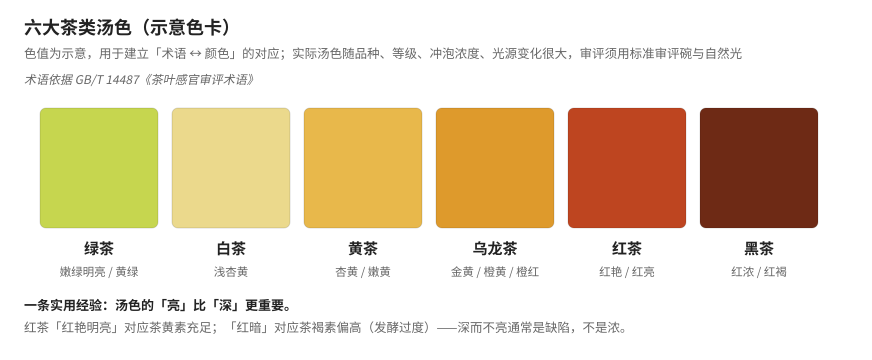
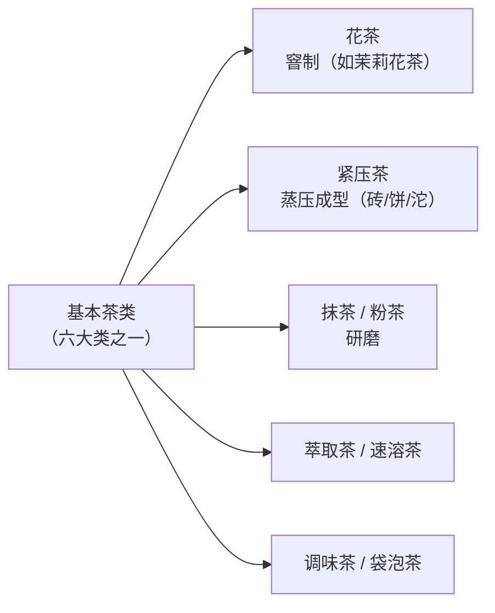
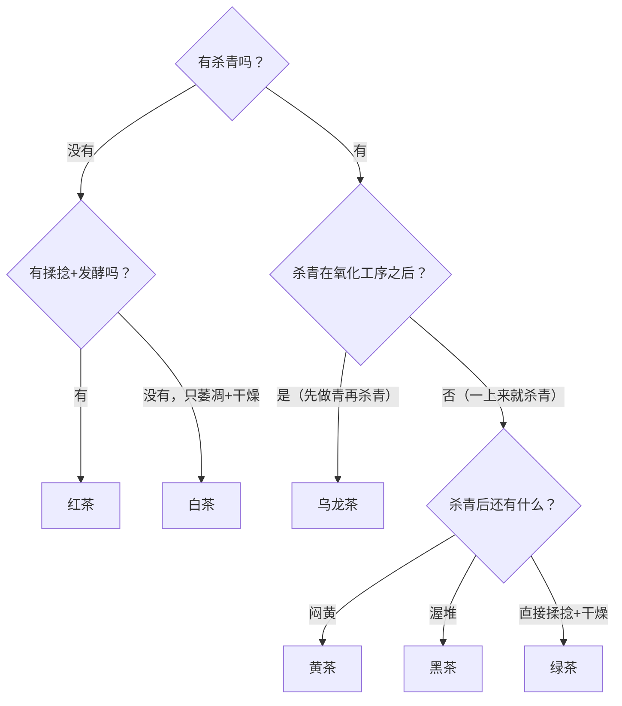

# 第 5 章 分类的逻辑：GB/T 30766 与一张工艺总图

> 本章目标：搞清楚六大茶类**凭什么这么分**——不是按颜色，不是按产地，也不完全是按"发酵程度"。
>
> 学完这一章，你应该能做到：听到一款没见过的茶，问三个问题就能把它归到某一类；
> 并且知道哪些常见的归类说法是**明确错误**的，哪些是**至今仍有争议**的。

## 5.1 分类原则：国标怎么说

**GB/T 30766《茶叶分类》**给出的分类原则是[^1]：

> **以加工工艺、产品特性为主，结合茶树品种、鲜叶原料、生产地域进行分类。**

这句话的信息量比看上去大，逐段拆：

| 分类依据 | 权重 | 说明 |
|----------|------|------|
| **加工工艺** | **主** | 走了哪些工序、顺序如何——这是第一决定因素 |
| **产品特性** | **主** | 成品的外形、汤色、香气、滋味、叶底 |
| 茶树品种 | 辅 | 如安吉白茶用白化品种，但它仍是绿茶 |
| 鲜叶原料 | 辅 | 嫩度、采摘标准（第 3 章） |
| 生产地域 | 辅 | 地理标志产品（如武夷岩茶、普洱茶） |

**关键推论**：**决定茶类的是工艺，不是名字、不是颜色、不是产地。**
这一条能一次性解决初学者最常踩的几个坑（见 5.7 节）。

标准把茶叶分为六类：**绿茶、红茶、黄茶、乌龙茶、白茶、黑茶**；
以基本茶类为原料再加工而成的，称为**再加工茶**。

## 5.2 六大茶类是怎么来的

这套分类不是自古就有，它有明确的作者和年份：

- **1979 年**，安徽农业大学**陈椽**教授在《茶叶分类的理论与实际》中正式提出六大茶类分类法，
  依据是**制造方法与茶多酚氧化程度**。
- **2023 年**，在 GB/T 30766 与 GB/T 35825 的基础上，由**宛晓春**教授牵头、
  联合印度、英国等国专家制定的 **ISO 20715:2023《茶叶分类》**颁布，
  同样按加工工艺和品质特征分六大类，并规定了**做形、闷黄、渥堆**等关键工序术语。

> **值得停一下**：一个中国学者在 1979 年提出的分类框架，2023 年成了国际标准。
> 这意味着你在这本书里学的六大茶类体系，现在是**全球通行的**，不是"中国特色说法"。

## 5.3 一张图看懂六类的差别

把国标给出的各类工艺流程排成矩阵，分野一目了然：

对应的文字版流程（国标表述）：

| 茶类 | 工艺流程 |
|------|----------|
| **绿茶** | 鲜叶 → **杀青** → 揉捻 → 干燥 |
| **白茶** | 鲜叶 → **萎凋** → 干燥 |
| **黄茶** | 鲜叶 → 杀青 → 揉捻 → **闷黄** → 干燥 |
| **乌龙茶** | 鲜叶 → 萎凋 → **做青** → 杀青 → 揉捻 → 干燥 |
| **红茶** | 鲜叶 → 萎凋 → 揉捻 → **发酵** → 干燥 |
| **黑茶** | 鲜叶 → 杀青 → 揉捻 → **渥堆** → 干燥 |

**加粗的就是各类的"关键工序"**——去掉它，这类茶就不成立了。
ISO 20715 之所以要专门规定"做形、闷黄、渥堆"这些术语，正是因为它们是分类的锚点。

### 三个结构性观察

1. **杀青的位置决定一切。** 绿、黄、黑茶的杀青在**最前面**（先灭酶，后面的变化都不靠酶了）；
   乌龙茶的杀青在**做青之后**（先让酶工作一段，再叫停）；红茶和白茶**根本没有杀青**
   （红茶靠干燥终止、白茶靠失水自然衰减）。
2. **黄茶和黑茶都是"绿茶 + 一步"。** 黄茶 = 绿茶 + 闷黄，黑茶 = 绿茶 + 渥堆。
   第 4 章说过：闷黄"浅尝即止"，渥堆"充分尽致"，两者机理同源而程度悬殊。
3. **白茶只有两步，是唯一不揉捻的。** 不揉捻意味着**细胞破损率极低**（第 4 章），
   所以它的氧化只能靠失水过程中细胞自然解体来推动——慢，且难控。

## 5.4 氧化程度：一根轴，外加一条岔路

"按发酵程度排序"是最流行的记忆法：绿茶 → 白茶 → 黄茶 → 乌龙茶 → 红茶。
**作为教学简化它是好用的**，但你必须知道它在哪里失真：

| 茶类 | 机制 | 在这根轴上吗 |
|------|------|-------------|
| 绿茶 → 乌龙 → 红茶 | 都是**酶促氧化**，只是程度不同 | ✅ 在 |
| 白茶 | 酶促氧化（缓慢）+ 湿热 | ✅ 基本在 |
| **黄茶** | **湿热作用为主**（±残余酶） | ⚠️ 勉强 |
| **黑茶** | **微生物作用** | ❌ **不在** |

所以严格说法是：**绿→白→黄→青→红 是一根轴；黑茶是从绿茶分出去的另一条岔路。**

> **⚠️ 一个要当心的数字陷阱**：你会看到"绿茶氧化度低于 5%、白茶 5%~10%、乌龙 15%~70%、
> 红茶 80% 以上"这类精确百分比。**国标并没有给各茶类规定氧化百分比**，
> 这些是行业经验说法，而且"氧化度"本身如何测定也没有统一方法。
> 记方向可以，别把它当指标引用。

## 5.5 汤色：把术语和颜色对上

分类学完，最快建立感性认识的方式是看汤色——它大致就是氧化程度轴的视觉版：

对应的审评术语（依据 **GB/T 14487《茶叶感官审评术语》**，第 15 章会系统讲）：

| 茶类 | 常用汤色术语 |
|------|-------------|
| 绿茶 | 嫩绿明亮、黄绿、绿黄 |
| 白茶 | 浅杏黄、杏黄 |
| 黄茶 | 杏黄、嫩黄 |
| 乌龙茶 | 金黄、橙黄、橙红 |
| 红茶 | 红艳、红亮 |
| 黑茶 | 红浓、红褐、褐红 |

> **一条现在就能用的经验**：**汤色的"亮"比"深"更重要。**
> 红茶"红艳明亮"对应茶黄素充足；"红暗"对应茶褐素偏高（发酵过度，见第 4 章）。
> **深而不亮通常是缺陷，不是浓。**

## 5.6 再加工茶

以六大基本茶类为原料再加工的，都叫**再加工茶**（第 12 章展开）：

**注意归属逻辑**：茉莉花茶的**茶坯**通常是烘青绿茶，所以它是"以绿茶为原料的再加工茶"，
不是第七个茶类。同理，普洱生茶饼是"紧压的晒青毛茶"——**紧压只是形状，不改变茶类归属**。

## 5.7 常见说法辨析

这一节值得反复读，几乎每条都是初学者会踩的坑。

| 说法 | 判定 | 说明 |
|------|------|------|
| **"安吉白茶是白茶"** | **❌ 错误** | 它是**绿茶**。名字里的"白"指的是**白化品种**（叶片返白），工艺走的是杀青→揉捻→干燥。**决定茶类的是工艺，不是名字** |
| **"大红袍是红茶"** | **❌ 错误** | 大红袍是**乌龙茶**（武夷岩茶）。同理"东方美人"也是乌龙茶 |
| **"君山银针是白茶"**（因为叫银针） | **❌ 错误** | 君山银针是**黄茶**；白毫银针才是白茶。名字像不代表同类 |
| "按颜色分类：绿茶是绿的、红茶是红的" | **❌ 不成立** | 分类依据是**加工工艺 + 产品特性**。而且英文里红茶叫 black tea、黑茶叫 dark tea——颜色命名本身就不自洽 |
| "六大茶类就是发酵程度从低到高" | **⚠️ 教学简化** | 绿→白→黄→青→红 大致成立；但黄茶靠**湿热**、黑茶靠**微生物**，机制不同，不是同一根轴上的程度差 |
| "绿茶是不发酵茶，所以没有任何变化" | **❌ 错误** | "不发酵"指**不进行酶促氧化**。杀青、干燥中的湿热作用、香气物质的转化都在发生——否则鲜叶就等于绿茶了 |
| "白茶工艺最简单，所以最好做" | **❌ 反了** | 只有两步意味着**能调的旋钮最少**，全靠温湿度和时间控制失水速率，容错率极低（第 7 章） |
| **"普洱生茶属于黑茶"** | **⚠️ 有争议** | GB/T 22111《地理标志产品 普洱茶》把普洱茶分为生茶与熟茶；而按 GB/T 30766 的工艺逻辑，**熟茶（渥堆）明确属黑茶**，**生茶（晒青毛茶紧压、未渥堆）在工艺上更接近晒青绿茶**。学界与行业至今表述不一，第 11 章专门处理 |
| "紧压茶是一个茶类" | **❌ 错误** | 紧压只是**形状**（再加工）。紧压的可以是黑茶、生普（晒青绿茶）、白茶、红茶 |
| "花茶是一个基本茶类" | **❌ 错误** | 花茶是**再加工茶**，茶坯通常是烘青绿茶 |

> **一条能一劳永逸的判断法**：遇到归类问题，不要看名字、颜色、产地，
> **问三个问题**——
> ① 有没有杀青？② 杀青在氧化工序之前还是之后？③ 有没有渥堆/闷黄？
> 5.8 节的实操就是练这个。

## 5.8 思考题

1. GB/T 30766 的分类原则里，"加工工艺、产品特性"是**主**，"茶树品种、鲜叶原料、生产地域"是**辅**。
   为什么必须是这个主次顺序？如果反过来会出什么问题？
2. 安吉白茶叫"白茶"却是绿茶，大红袍叫"红袍"却是乌龙茶。这两个例子共同说明了什么原则？
3. 看工序矩阵图：**杀青的位置**在六大茶类里有三种情况。分别是哪三种？各自的工艺意图是什么？
4. 为什么说"黄茶 = 绿茶 + 一步，黑茶也 = 绿茶 + 一步"，但这两类茶的差别却极大？
5. "六大茶类按发酵程度从低到高排序"这个记忆法，在哪两类茶上失真？为什么说黑茶"不在这根轴上"？
6. 白茶只有萎凋和干燥两道工序，而且**不揉捻**。结合第 4 章，说明"不揉捻"对氧化过程意味着什么，
   以及为什么这反而让白茶更难做。
7. 有人拿"绿茶氧化度低于 5%、乌龙茶 15%~70%"来论证茶类差别。这个论证的问题在哪？
8. （进阶）普洱生茶到底该归哪一类？请分别给出"归黑茶"和"归晒青绿茶"两种主张的依据，
   并说明这个争议**为什么难以靠工艺逻辑单独解决**。

> 📖 **参考答案**（想清楚再看）：[Q1](../../qa/05-classification-qa.md#q1) ·
> [Q2](../../qa/05-classification-qa.md#q2) · [Q3](../../qa/05-classification-qa.md#q3) ·
> [Q4](../../qa/05-classification-qa.md#q4) · [Q5](../../qa/05-classification-qa.md#q5) ·
> [Q6](../../qa/05-classification-qa.md#q6) · [Q7](../../qa/05-classification-qa.md#q7) ·
> [Q8](../../qa/05-classification-qa.md#q8)

## 5.9 本章实操

### 🅐 无器具版：三个问题归类法

找**五款**你完全不熟悉的茶（电商搜"茶叶"随便翻，越冷门越好），
只看商品页给的**工艺描述**（不看名字里的茶类词），用三个问题归类：

| 茶样 | ① 有杀青吗 | ② 杀青在氧化工序前/后 | ③ 有渥堆/闷黄吗 | 👉 我判断是 | 商家标的是 | 一致？ |
|------|-----------|----------------------|----------------|-----------|-----------|--------|
| 1 | | | | | | |
| 2 | | | | | | |
| 3 | | | | | | |
| 4 | | | | | | |
| 5 | | | | | | |

**判定树**（照着走）：

**注意**：如果商家的描述里连工艺都不写，那本身就是一条信息——
**说不清工艺的卖家，通常也说不清别的**。

### 🅐 无器具版加餐：给五个名字挑错

不看 5.7 节，判断下面五句话对错并说明理由：

1. 安吉白茶属于白茶。
2. 大红袍是红茶里的名品。
3. 茉莉花茶是第七大茶类。
4. 君山银针和白毫银针都是白茶。
5. 普洱茶饼因为紧压，所以属于紧压茶类。

### 🅑 有条件版：六大茶类汤色对照（备齐后再做）

**所需**：六大茶类各一款（不必名贵）；**同款白瓷杯 6 个**（审评碗最好）；秤；温度计；
自然光下的窗边台面。

| 变量 | 设定 |
|------|------|
| 投茶量 | 每杯 3 g（**必须相同**） |
| 水量 | 150 mL（**必须相同**） |
| 水温 | 统一沸水（此实验目的是看**茶类差异**，不是找最优冲泡） |
| 时间 | 统一 3 min |

**先预测再看**（这是关键，别倒过来）：

| 茶类 | 我预测的汤色 | 实际汤色 | 对应审评术语 | 亮 / 暗 |
|------|-------------|---------|-------------|---------|
| 绿茶 | | | | |
| 白茶 | | | | |
| 黄茶 | | | | |
| 乌龙茶 | | | | |
| 红茶 | | | | |
| 黑茶 | | | | |

**重点看两件事**：

1. **顺序对不对**——汤色应大致沿"绿黄 → 杏黄 → 橙黄 → 红 → 红褐"推进；
2. **亮度**——把六杯并排，判断哪杯"亮"、哪杯"暗"。
   **暗**往往指向氧化过度或储存问题，这是你第一次用眼睛做审评判断。

> 记录用[冲泡记录表](../../forms/brewing-log.md)。
> ⚠️ 统一用沸水会让绿茶偏苦——**这是故意的**，本实验控制变量优先于好喝。

## 5.10 本章主要参考

| 本章的哪个结论 | 来源 |
|----------------|------|
| GB/T 30766 分类原则原文、六类划分、再加工茶定义 | [GB/T 30766-2014 标准信息页](https://www.sdtdata.com/fx/fmoa/tsLibCard/148267.html)；[国家数字标准馆条目](https://www.ndls.org.cn/standard/detail/ac3fd7da09f4c63336143f7e1a95eab3) |
| 各茶类工艺流程（国标表述） | 同上 |
| 陈椽 1979《茶叶分类的理论与实际》提出六大茶类 | [中国茶叶分类（故宫博物院专题）](https://www.dpm.org.cn/subject_tea/single/detail/260827.html) |
| ISO 20715:2023 国际标准、宛晓春牵头、规定做形/闷黄/渥堆术语 | [我国六大茶类分类体系正式成为国际共识](https://www.guizhougreentea.com/news/1072.html) |
| 汤色审评术语归属 | GB/T 14487（[标准信息页](https://www.sdtdata.com/fx/fcv1/tsLibCard/167525.html)；[全文公开系统](https://openstd.samr.gov.cn/bzgk/std/newGbInfo?hcno=A9C52AF11B25093059BF9F4FDF3E4373)） |
| 配套标准 GB/T 35825《茶叶化学分类方法》、GH/T 1124《茶叶加工术语》 | 见上 GB/T 30766 相关条目 |

> **⚠️ 本章标注为存疑/不采信的内容**：
> ① **各茶类的"氧化度百分比"**（绿茶低于 5%、乌龙 15%~70% 等）——国标无此规定，
> 且"氧化度"缺乏统一测定方法，本书只用相对方向；
> ② **普洱生茶的茶类归属**——GB/T 22111 与 GB/T 30766 的工艺逻辑之间存在张力，
> 学界与行业表述不一，本书标为**有争议**，留待第 11 章展开。

---

[^1]: **GB/T 30766《茶叶分类》**：规定茶叶的术语和定义、分类原则和类别，
      由 TC339（全国茶叶标准化技术委员会）归口。编号与版本以
      [国标全文公开系统](https://openstd.samr.gov.cn)为准，本书正文只作索引，
      详见[国标与文献索引](../../standards.md)。
