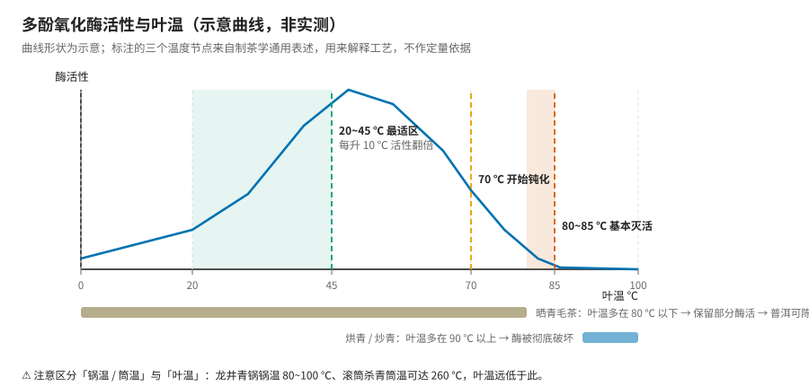
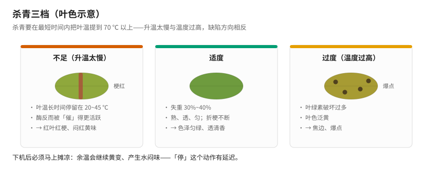
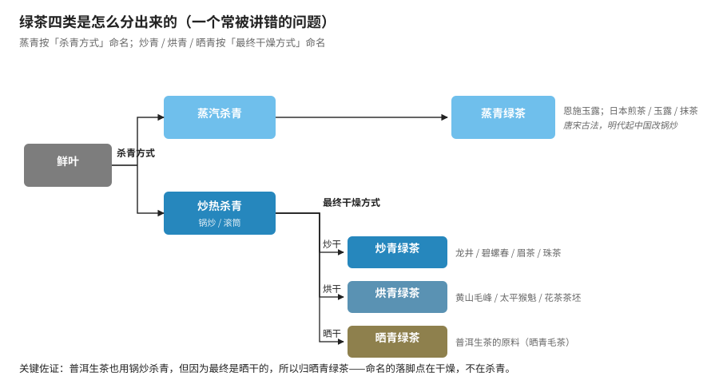
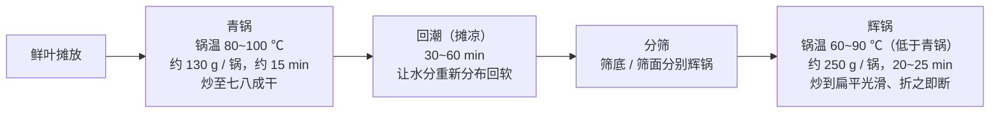

# 第 6 章 绿茶：杀青，如何"锁住"绿

> 本章目标：把六大茶类里最短的那条流程讲透——**鲜叶 → 杀青 → 揉捻 → 干燥**。
>
> 绿茶的全部技术难点集中在**第一步**。杀青这一道工序，要在几分钟内同时完成三件事，
> 而且这三件事彼此冲突。理解了这个冲突，你就理解了绿茶。
>
> 本章还会纠正一个流传极广的说法：**"炒青、烘青、晒青"指的其实不是杀青方式。**

## 6.1 绿茶要的是什么

绿茶是**唯一以"保住鲜叶原貌"为目标**的茶类。第 4 章说过，它的机制是"成分冻结"：
用高温让多酚氧化酶失活，把成分留在接近鲜叶的状态。

所以绿茶的品质上限**几乎完全由鲜叶决定**（第 1~3 章那三层：品种、环境、采摘），
工艺的作用是**别把它做坏**。这与乌龙茶、红茶完全相反——那两类的风味是工艺**创造**出来的。

> **一个直接推论**：绿茶是最"诚实"的茶类。原料差就是差，工艺救不回来。
> 这也是为什么名优绿茶极度依赖明前、高山、良种（第 2、3 章）。

## 6.2 杀青要同时干三件事——而它们互相冲突

| 目的 | 要求 | 与其他目的的冲突 |
|------|------|------------------|
| ① **钝化酶**（核心） | 叶温**尽快**升到 70 ℃ 以上 | 要求高温、快速 |
| ② **散失青气** | 挥发掉低沸点的青草气物质 | 需要一定时间和透气 |
| ③ **失水变软** | 失重 30%~40%，便于揉捻成型 | 需要时间；但失水太多会焦 |

**冲突在哪**：①要"快而猛"，②③要"有时间"。温度不够就红变，温度过高就焦边；
时间不够就有青气、揉不成条，时间太长就闷黄、失水过度。

**这就是为什么杀青被称为绿茶的"定生死"工序**——它没有安全区间，只有平衡点。

## 6.3 温度：为什么必须"快"

回到第 4 章那条曲线（这次它是主角）：

> **要在最短时间内把叶温提到 70 ℃ 以上。**

原因在第 4 章讲过，这里再强调一次，因为它反直觉：**升温过程本身会经过酶的最适区间**
（20~45 ℃，每升 10 ℃ 活性翻倍）。升得慢，等于**在你想灭酶之前先把它催活了**。

| 情况 | 后果 |
|------|------|
| 锅温太低 / 投叶太多 / 升温慢 | 叶子在酶活跃区停留过久 → **红叶红梗、闷红黄味** |
| 温度过高 | 叶绿素破坏过多 → 叶色泛黄，**焦边、爆点** |

### ⚠️ 一个必须分清的概念：锅温 ≠ 叶温

这是初学者读工艺参数时最容易搞错的地方：

| 参数 | 典型值 | 说明 |
|------|--------|------|
| **滚筒杀青的筒温** | 可达约 **260 ℃** | 这是**设备表面温度** |
| **龙井青锅的锅温** | **80~100 ℃** | 这是**锅面温度** |
| **目标叶温** | **>70 ℃，80~85 ℃ 灭酶** | 这才是**决定酶死活的温度** |

叶子在锅里是翻动的、含大量水分，蒸发吸热——**叶温远低于锅温**。
所以看到"260 ℃ 杀青"不要惊讶，也不要拿它去对照第 4 章的酶温度节点。

**杀青适度的判断**（感官指标，比温度计更实用）：

- 叶质柔软略带粘性，紧握成团稍有弹性；
- **嫩茎折而不断**；老叶熟而不焦；
- 表面失去光泽，略有清香；
- **失重 30%~40%**，达到"熟、透、匀"。

**下机后必须马上摊凉**（最好风扇吹凉）。否则余温继续推动黄变和湿热作用，产生**水闷味**——
第 4 章那条"停的动作有延迟"原则，在这里第一次落地。

## 6.4 炒青、烘青、晒青、蒸青：一个被普遍讲错的划分

**先说结论**：

> **蒸青**按**杀青方式**命名；**炒青 / 烘青 / 晒青**按**最终干燥方式**命名。

拆成两层看就清楚了：

**第一层，按杀青方式**——只有两种：

| 杀青方式 | 特点 |
|----------|------|
| **炒热杀青**（锅炒 / 滚筒） | 温度高，香气较好；明代起中国大规模采用 |
| **蒸汽杀青** | 水蒸气温度较低，香气较弱，但**保留绿色**、鲜感强 |

蒸汽杀青做出来的就是**蒸青绿茶**——这一类确实是按杀青方式命名的。

**第二层，炒热杀青的茶再按干燥方式分**：

| 最终干燥 | 类别 | 代表 |
|----------|------|------|
| 炒干 | **炒青绿茶** | 龙井、碧螺春、眉茶、珠茶 |
| 烘干 | **烘青绿茶** | 黄山毛峰、太平猴魁、六安瓜片；大部分作**花茶茶坯** |
| 晒干 | **晒青绿茶** | **普洱生茶的原料**（晒青毛茶） |

### 最有说服力的一个佐证

> **普洱生茶的原料也用锅炒杀青，但因为最终是晒干的，所以归晒青绿茶。**

如果"晒青"指的是杀青方式，这就说不通了——它明明是炒的。
**命名的落脚点在干燥，不在杀青。**

> **为什么容易混**：炒青类里**炒与干往往一体**——边炒、边做形、边干燥，
> 所以有人说"炒青是杀青和干燥的统一"。这是概念混淆的根源。
>
> **⚠️ 诚实说明**：这个"两层分类"的解释在教科书表述里通常写作
> "根据**杀青方式和干燥方式**的不同分为四类"，即两个标准合起来用。
> 本书采用两层拆解的讲法，因为它能解释晒青毛茶那个例子；
> 但如果你考试遇到"四类的划分依据"，标准答案是**杀青方式与干燥方式相结合**。

**还有一类别忘了**：市场上很多名优绿茶用**半烘炒**工艺——干燥时先炒后烘或先烘后炒，
兼顾成形与提香。

## 6.5 案例：西湖龙井的炒制

龙井是炒青绿茶里工艺最讲究的，值得作为标本拆一遍。

**主要工序**：鲜叶摊放 → **青锅** → 回潮 → 二青叶分筛 → **辉锅** → 分筛 → 挺长头 → 归堆 → 贮藏收灰。

| 工序 | 干什么 | 关键参数 |
|------|--------|----------|
| **青锅** | 杀青 + 初步成型 | 锅温 80~100 ℃；每锅鲜叶约 130 g；约 15 min；炒至七八成干；**压力先轻后重** |
| **回潮** | 让芽、茎、叶各部位**水分重新分布**回软 | 薄摊摊凉，30~60 min（一般控制在 1 h 内） |
| **辉锅** | 整形 + 干燥 | 锅温**低于青锅**；四锅青锅叶合一锅，约 250 g；20~25 min；成品含水降到 5%~7% |

**十大手法**：抓、抖、搭、拓、捺、推、扣、甩、磨、压（各家文献用字略有差异）。
几个要领：

- **抖**——把茶叶上下抖动均匀撒在锅中，使受热均匀、散发水分，起"抖齐、理条、起色"作用；
- **搭**——抖后反掌向下顺势朝锅底压去，**力度先轻后重**，主要用于青锅；
- **拓（抹）**——手贴茶、茶贴锅，沿锅壁把茶叶伏贴地拓上，反复使茶叶扁平；
- **压**——在抓、推、磨的同时加压，使茶更平实光滑，**只用于辉锅后半段**。

**两个"过早/过迟"**（青锅阶段）：

> **用力过早** → 挤出茶汁 → 茶色变暗发黑；
> **用力过迟** → 易产生茶末或形成"空壳燥"。
> 所以要**先轻后重**。

**要领一句话**：辉锅"**手不离茶，茶不离锅**"，炒到茸毛脱落、扁平光滑、茶香透出、折之即断。

> **⚠️ 一处数据打架**：辉锅锅温，主流资料给 **60~90 ℃**（且明确低于青锅），
> 但也有资料写 **150~180 ℃** 并称"低于青锅"——这与主流出入明显且自相矛盾。
> 本书采用 60~90 ℃ 一类的锅面实测值，并把这条分歧标出来提醒你：
> **工艺参数在网上抄来抄去，遇到互相矛盾的，优先信与机理自洽的那个。**

## 6.6 烘青与蒸青

### 烘青

杀青仍是**炒制**（锅炒或滚筒），区别在干燥用烘。典型分两段：

| 阶段 | 温度 | 目的 |
|------|------|------|
| **毛火** | 80~90 ℃ | 快速烘干，先把水分降下来 |
| **足火** | 70 ℃ | **低温慢烘**，激发清雅香气、减少青草气 |

**特征**：条索紧细显锋苗，色泽墨绿或翠绿；香气**清鲜带烘烤香**，滋味鲜醇回甘，汤色黄绿明亮。
与炒青相比**香气更沉稳但一般不及炒青高**——所以烘青毛茶精制后**大部分作花茶茶坯**
（香气不抢花香）。少数烘青名茶品质特优：黄山毛峰、太平猴魁、六安瓜片。

### 蒸青

**中国绿茶最早的制法**，唐宋主流；**明代起中国改用锅炒杀青**，蒸青在国内逐渐式微，
如今主要留存于**恩施玉露**等。而**日本自唐代传入后沿用至今**——煎茶、玉露、抹茶、番茶、茎茶
都是蒸青体系。

| 特征 | 表现 |
|------|------|
| 外形 | 紧细呈针状 |
| 色泽 | 鲜绿或深绿油润有光 |
| 汤色 | 澄清浅黄绿 |
| 香气滋味 | 有清香，滋味醇或略涩 |
| **短板** | 相比炒青**香气带青气、涩味重、不够鲜爽**——这正是中国明代改锅炒的原因 |

**"三绿"**：干茶色泽深绿、茶汤碧绿、叶底青绿——蒸汽杀青对绿色的保留优于炒制。

> **一个有意思的对照**：同样是绿茶，中国选择了**香**（锅炒，高温出香），
> 日本选择了**绿与鲜**（蒸汽，低温保色 + 遮阴提鲜，见第 1 章 1.5 节）。
> **这不是谁对谁错，是两种风味目标下的不同取舍。**

## 6.7 常见说法辨析

| 说法 | 判定 | 说明 |
|------|------|------|
| "炒青、烘青、晒青说的是杀青方式" | **❌ 错误** | 说的是**最终干燥方式**；只有蒸青按杀青方式命名。佐证：晒青毛茶也是锅炒杀青的 |
| "杀青就是把茶叶炒干" | **❌ 错误** | 杀青目的是**灭酶**，失重只有 30%~40%，远未干燥；干燥是后面的工序 |
| "杀青温度越高越好，反正要灭酶" | **❌ 错误** | 过高则叶绿素破坏过多、**焦边爆点**。要的是"**快速**到 70 ℃ 以上"，不是"越高越好" |
| "滚筒杀青 260 ℃，那叶子不就烧焦了" | **⚠️ 混淆概念** | 260 ℃ 是**筒温**（设备表面），叶片含水、翻动、蒸发吸热，**叶温远低于此** |
| "绿茶越绿越新鲜、品质越好" | **⚠️ 不可靠** | 色泽受杀青方式影响很大（蒸青比炒青绿得多）。而且**汤色的"亮"比"绿"更有判断价值**（第 5 章） |
| "普洱生茶不是绿茶" | **⚠️ 有争议** | 就工艺论，晒青毛茶属**晒青绿茶**；但成品普洱有后续陈化，归属存在争议（第 5、11 章） |
| "烘青比炒青低级，所以拿去做花茶" | **❌ 因果颠倒** | 烘青做花茶坯**恰恰因为它香气清雅不抢花香**，是匹配而非降级。烘青里也有黄山毛峰、太平猴魁这类名茶 |
| "蒸青是日本的工艺" | **❌ 错误** | 蒸青是**中国最早的制法**（唐宋主流），传入日本后被沿用；中国明代改锅炒 |

## 6.8 思考题

1. 杀青要同时完成三个目的，它们之间的冲突具体是什么？为什么说杀青"没有安全区间，只有平衡点"？
2. 为什么杀青必须"在最短时间内"把叶温提到 70 ℃ 以上？慢慢加热到同样温度，结果有什么不同？
3. "滚筒杀青筒温 260 ℃"和"叶温 80~85 ℃ 灭酶"这两个数字矛盾吗？请解释。
4. 炒青、烘青、晒青、蒸青四类，命名依据分别是什么？用**晒青毛茶**这个例子说明为什么不能一概而论。
5. 为什么大部分烘青毛茶被拿去做花茶茶坯？这是"降级使用"吗？
6. 龙井青锅阶段讲"用力先轻后重"。用力过早和过迟各会出什么问题？为什么？
7. 同样是绿茶，中国明代把蒸青改成了锅炒，日本却把蒸青沿用至今。两边各自优先了什么、放弃了什么？
8. 绿茶被称为"最诚实的茶类"，因为工艺救不回差原料。结合第 1~3 章，说明为什么绿茶的品质上限
   几乎完全由鲜叶决定，而乌龙茶不是这样。
9. （进阶）本章指出辉锅温度在不同资料里有 60~90 ℃ 与 150~180 ℃ 两种说法，且后者自相矛盾。
   如果你要判断哪个可信，可以用哪些**内部一致性**线索来推断？（提示：想想茶叶含水率、
   成品含水 5%~7%、以及"低于青锅"这个约束）

> 📖 **参考答案**（想清楚再看）：[Q1](../../qa/06-green-tea-qa.md#q1) ·
> [Q2](../../qa/06-green-tea-qa.md#q2) · [Q3](../../qa/06-green-tea-qa.md#q3) ·
> [Q4](../../qa/06-green-tea-qa.md#q4) · [Q5](../../qa/06-green-tea-qa.md#q5) ·
> [Q6](../../qa/06-green-tea-qa.md#q6) · [Q7](../../qa/06-green-tea-qa.md#q7) ·
> [Q8](../../qa/06-green-tea-qa.md#q8) · [Q9](../../qa/06-green-tea-qa.md#q9)

## 6.9 本章实操

### 🅐 无器具版：从干茶外形反推工艺

找**四款绿茶**的干茶图片（龙井、黄山毛峰、恩施玉露或日本煎茶、普洱生茶散料各一），填表：

| 观察项 | 龙井 | 黄山毛峰 | 蒸青（玉露/煎茶） | 晒青毛茶 |
|--------|------|----------|-------------------|----------|
| 外形（扁平/条索/针状/松散） | | | | |
| 色泽（墨绿/翠绿/深绿油润/灰绿） | | | | |
| 有无锋苗、茸毛 | | | | |
| 👉 推断最终干燥方式 | | | | |
| 👉 推断属于四类中的哪类 | | | | |
| 商家标注 | | | | |

**要点**：扁平光滑 → 炒制中反复"拓、压"（龙井）；紧细显锋苗 → 烘青；
针状挺直深绿油润 → 蒸青；粗松带梗、色泽偏暗 → 晒青毛茶。

### 🅐 无器具版加餐：给杀青缺陷找原因

下面是四条审评记录，请指出**最可能是杀青哪一步出的问题**：

1. "干茶有红梗红叶，汤色泛黄，有闷味。"
2. "叶底有焦边和黑色斑点，香气带火焦气。"
3. "香气有明显青草气，滋味生涩。"
4. "汤色黄暗，有水闷味，叶底不匀。"

（答案见[答案册 Q10 之后的补充](../../qa/06-green-tea-qa.md#practice)。）

### 🅑 有条件版：炒青 vs 烘青对照（备齐后再做）

**所需**：一款**炒青**绿茶（如龙井、碧螺春）与一款**烘青**绿茶（如黄山毛峰），
最好同产区同等级；两个同款玻璃杯或盖碗；秤；温度计。

| 变量 | 炒青 | 烘青 |
|------|------|------|
| 投茶量 / 水量 / 水温 / 时间 | 3 g / 150 mL / 85 ℃ / 2 min（**完全相同**） | 同左 |

| 观察项 | 炒青 | 烘青 | 是否符合本章预测？ |
|--------|------|------|--------------------|
| 干茶色泽与外形 | | | |
| **香气类型**（栗香/清香/烘烤香） | | | |
| **香气高低** | | | |
| 鲜爽度 | | | |
| 苦 / 涩（分开记，涩等 15 秒） | | | |
| 汤色（绿/黄绿/明亮度） | | | |
| 叶底色泽与完整度 | | | |

> **预期**：炒青香气更高（常带栗香）、滋味浓爽；烘青香气更沉稳清雅、条索更完整。
> **如果不符**，先检查两个样是不是同等级、同年份——**新鲜度对绿茶的影响极大**，
> 可能盖过工艺差异。记录用[冲泡记录表](../../forms/brewing-log.md)。

## 6.10 本章主要参考

| 本章的哪个结论 | 来源 |
|----------------|------|
| 杀青的三个目的、酶钝化温度节点、杀青适度判断（失重 30%~40%、熟透匀）、摊凉 | [绿茶杀青技术](https://baike.baidu.com/item/%E7%BB%BF%E8%8C%B6%E6%9D%80%E9%9D%92%E6%8A%80%E6%9C%AF/7573229)；[炒青](https://baike.baidu.com/item/%E7%82%92%E9%9D%92/917599)（与《制茶学》教材表述一致，交叉见第 4 章来源） |
| 四类划分：蒸青按杀青方式、其余按干燥方式；晒青毛茶佐证；半烘炒 | [绿茶的炒青、烘青、晒青、蒸青是按照什么来划分的？](https://zhuanlan.zhihu.com/p/28011040)；[绿茶四大类：炒青、烘青、晒青、蒸青如何划分](https://www.sohu.com/a/674111592_121467765)；[杀青、晒青、烘青、炒青、蒸青，你分得清吗？](https://k.sina.cn/article_6405516695_17dcc6d97001002y3z.html)（⚠️ 均为行业/自媒体资料，三源一致且与晒青毛茶实例自洽） |
| 烘青毛火 80~90 ℃ / 足火 70 ℃、滚筒杀青约 260 ℃、烘青作花茶坯 | [一文看懂绿茶炒青、烘青、晒青、蒸青的区别](https://zhuanlan.zhihu.com/p/1904614843346026658)（⚠️ 单一来源，标为行业经验值） |
| 蒸青历史（唐宋主流、明代改锅炒、日本沿用）、三绿、短板 | [炒青、烘青、晒青、蒸青分不清？](https://www.yinchaba.com/fenlei/lvcha/12389.html)；[绿茶四大类（知乎）](https://zhuanlan.zhihu.com/p/99505121) |
| 龙井工序、青锅/回潮/辉锅参数、十大手法、用力过早过迟 | [西湖龙井茶未解之谜七：传统炒制"非遗"工艺的"十大手法"](https://zhuanlan.zhihu.com/p/60333540)；[十大名茶——西湖龙井制作工艺](https://zhuanlan.zhihu.com/p/75030654)；[西湖龙井（维基百科）](https://zh.wikipedia.org/wiki/%E8%A5%BF%E6%B9%96%E9%BE%8D%E4%BA%95) |
| 绿茶分类（炒青/烘青/蒸青/晒青）的国标依据 | GB/T 14456.1（见[国标与文献索引](../../standards.md)） |

> **⚠️ 本章标注为存疑的内容**：
> ① **辉锅锅温**——主流 60~90 ℃ vs 个别资料 150~180 ℃，本书采前者并说明理由；
> ② **烘青毛火/足火温度、滚筒筒温 260 ℃**——仅见行业资料，标为经验值；
> ③ 四类划分的"两层拆解"讲法是本书为便于理解采用的，教科书标准表述为
> "按**杀青方式与干燥方式**分"，已在 6.4 节说明。
