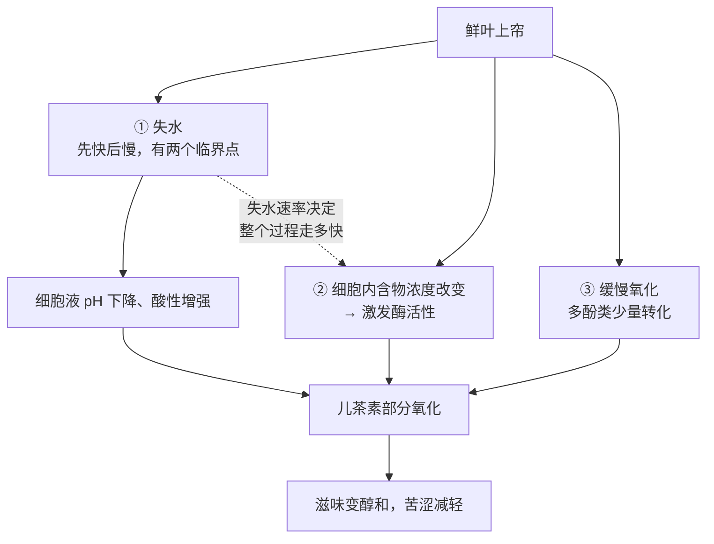

# 第 7 章 白茶：萎凋，最少干预为什么最难控

> 本章目标：讲透白茶**唯一**的核心工序——萎凋。
>
> 第 4 章已经把白茶的机制讲过一遍：不杀青、不揉捻，靠失水过程中细胞**缓慢自然解体**
> 带来的轻度氧化。那一章讲的是"为什么会这样"；这一章讲**怎么把它做好、做坏了是什么样**。
>
> 本章还会处理一句流传极广、听起来像古训的话——**"一年茶，三年药，七年宝"**——
> 它的真实出处和你以为的完全不同。

## 7.1 白茶为什么"旋钮最少"反而最难

第 4 章的六大茶类工序矩阵里，白茶只有两步：**萎凋 → 干燥**。
对照绿茶（杀青→揉捻→干燥）、乌龙茶（晒青→做青→杀青→揉捻→焙火），
白茶看起来是"最省事"的那一类。

但省掉的每一步，都是在**省掉一个你能主动干预的变量**：

| 别的茶类有、白茶没有的工序 | 它原本在干什么 | 白茶怎么办 |
|----|----|----|
| **杀青** | 主动叫停酶促氧化 | 没有"叫停"这个动作，**氧化程度完全交给萎凋的失水节奏** |
| **揉捻** | 主动破坏细胞、让酶与底物相遇、加速转化 | 没有人为加速，**只能等细胞随失水自然解体** |

〔推论直接可用〕**白茶的萎凋因此要同时承担两件别的茶类分两道工序做的事**：
既要让水分慢慢降下来（相当于"干燥"的前半段），又要在这个过程里
**自己控制氧化走到哪一步**（相当于"杀青时机"的选择，但没有刹车）。
慢了会过度氧化、走向发酵气；快了氧化不够、留下生青味。
**没有揉捻可以补救，也没有杀青可以叫停**——萎凋这一步走错，后面没有纠正的机会。

> **这就是本章标题的意思**：步骤最少 = 能调的旋钮最少 = 容错空间最小。

## 7.2 萎凋在干什么：三件同时发生的事

鲜叶一上萎凋帘，三件事同时开始，而且**互相牵动**：

**失水不是均匀的**。一项以福鼎大毫茶一芽一二叶为原料的温湿度调控研究，
测出萎凋失水存在**两个明显的临界点**：

> 萎凋减重率**到 40% 前**，失水速度较快；**40%~70%** 明显减慢；**70% 以后**，失水很慢。

这条曲线本身就在提醒一件事：**"萎凋快慢"不是一个单一的速度，
它在过程的不同阶段意味着不同的事**——前期失水快,主要是物理蒸发；
后期失水慢，剩下的时间更多花在**内含物质的转化**上，而不是单纯"等它干"。

## 7.3 温湿度：不是"越自然越好"，是一个区间

### 最适条件与可调节的空间

第 4 章已经给出过白茶萎凋的最适条件：**温度 20~30 ℃、相对湿度 60%~80%**，
温度与失水量正相关，提到 36~42 ℃ 可以把时间压缩到 3~6 h。
本章在这个基础上，把"调节这个区间会发生什么"讲清楚。

一项以福鼎大毫茶为原料、系统对照温度（25/30/35 ℃）与湿度
（RH 65%/75%/85%）组合的研究给出了更细的后果：

| 条件 | 失水速度 | 对品质的影响 |
|------|----------|----------------|
| **高温低湿**（35 ℃、RH 65%） | 过快 | **儿茶素含量较高、氨基酸含量较低**——转化来不及完成，白茶的品质特征不明显 |
| **高温高湿**（35 ℃、RH 85%） | 过慢 | **儿茶素类明显降低，氨基酸、咖啡碱含量增加**——但**容易产生"发酵香"，反而降低品质** |
| **中/中高温、中湿**（30~35 ℃、RH 75%）或**中低温**（25~30 ℃） | 适中 | 品质相对较好 |

> **一条反直觉的结论**：**失水太慢反而做不好白茶。**
> 直觉上"慢工出细活"，但高温高湿那一档恰恰是因为**走得太慢**，
> 多酚转化不受控地持续，滋味反而滑向"发酵香"——这已经偏离白茶该有的方向，
> 更接近工艺失控而不是"更细致"。

这与第 4 章讲过的三种萎凋方式实测结果（室内萎凋慢、湿度大，
成茶"尚绿带红叶、带青气"；萎凋槽萎凋湿度低、更快，成茶"色绿较活、无青气"）
是**同一条规律在两份独立研究里的体现**：**失水速率要落在一个区间内，
不是越慢越"自然"、越快越"到位"**。

### 咖啡碱、氨基酸：两条不同方向的曲线

萎凋对内含物质的改变不是单向的，三类主要成分走的是三条不同的曲线：

| 成分 | 萎凋中的变化方向 | 机制 |
|------|------------------|------|
| **氨基酸** | **持续上升** | 蛋白质在萎凋中水解，是白茶"鲜"味的直接来源；白茶游离氨基酸总量（5.97%~8.89%，因品种而异）在六大茶类里最高 |
| **咖啡碱** | **萎凋中先升后降**，自然萎凋过程中可增加约 **10.5%~12.5%**；干燥阶段因温度升高而有所下降 | 与嫩度正相关，白毫银针、白牡丹因原料更嫩而含量更高（白茶整体区间约 2.23%~4.94%） |
| **茶多酚（儿茶素）** | **下降** | 被多酚氧化酶部分催化氧化，这部分转化正是第 4 章"缓慢氧化"的具体体现 |

⚠️ 上面这组具体百分比**来自不同的检索来源**，本书只采信其中**方向一致**的部分
（氨基酸升、茶多酚降），咖啡碱升降的具体百分比与前述温湿度研究里
"高温高湿咖啡碱增加"的方向一致，但**本书未找到交叉验证两篇论文使用同一批次样品**，
按纪律只写方向，数字作为量级参考。

## 7.4 失水的判断节点：传统工艺的"读数法"

第 4 章已经给出过室内自然萎凋的三个传统判断节点（七成干、八成干、九成干），
这里把它们放回"失水有两个临界点"这条曲线里看，会发现它们对应得上：

| 传统节点 | 操作 | 大致对应失水曲线的位置 |
|----------|------|------------------------|
| **七成干** | 两筛并一筛；叶片不贴筛、毫色发白、叶色转灰绿或深绿、叶缘略卷、芽尖"**翘尾**"、清气消失 | 接近失水速度第一个临界点（减重率约 40%）之后，进入减速阶段 |
| **八成干** | 再两筛并一筛，堆成 10~15 cm 厚凹状继续萎凋 | 大致落在 40%~70% 这段"明显减慢"区间内 |
| **九成干** | 下筛，进入下一道工序 | 接近或超过 70% 这个第二临界点，失水已经很慢 |

> **这不是巧合**：传统经验里"并筛要等到什么程度"之所以能稳定传承下来，
> 正是因为它踩在了失水曲线**真实存在**的几个拐点上——
> 老师傅凭手感找到的节点，和实验室测出的失水曲线，描述的是同一件事。

**并筛本身也在加速转化**：并筛把萎凋叶堆厚，一方面让水分重新分布更均匀，
另一方面局部湿度与叶温上升，**促进多酚氧化酶的作用、去除青气、增加滋味的浓醇度**。
它和第 4 章讲过的龙井"回潮"类似——都是在中途"攒一下"再继续。

## 7.5 原料不同，萎凋也不同：银针、牡丹、寿眉

GB/T 22291《白茶》把白茶分为四类，核心区别在**原料**：

| 类别 | 原料要求 |
|------|----------|
| **白毫银针** | 大白茶或水仙茶树品种的**单芽** |
| **白牡丹** | 大白茶或水仙茶树品种的**一芽一、二叶** |
| **贡眉** | **群体种**（菜茶）茶树 |
| **寿眉** | 大白茶、水仙或群体种，**原料较粗老**（一芽三、四叶或叶片） |

⚠️ 2017 年修订的新版标准在旧版（白毫银针、白牡丹、贡眉三类）基础上
**单列了寿眉**，并增加了水浸出物指标；本书采现行 2017 版的四分类。

**原料差异直接决定萎凋的难度**：

- **白毫银针**是单芽，芽头肥壮紧实，含水量高、表面积与体积之比小，
  失水明显慢于叶片，所以**萎凋耗时普遍更长**，传统上也更依赖纯日光萎凋；
- **寿眉**原料是成熟叶片甚至带梗，梗叶比例高、含水量分布不均，
  需要更长时间才能让梗与叶**同步**失水、转化均匀——萎凋时间通常比银针、牡丹更长；
- 并筛环节的厚度与时长也要跟着原料形态调整：芽头紧实的银针与叶片松散的寿眉，
  **不能用同一套参数**。

> ⚠️ **本书未核到**三类原料萎凋时长的精确对比数字（多为行业资料里的定性描述，
> 没有检索到同一研究里的并列对照实验），这里只写方向性的结论，不写具体小时数。

## 7.6 新白茶与老白茶：这是什么变化，又不是什么变化

白茶圈最常被讨论的话题，是"存放"带来的变化。先把这件事拆成**能查证的部分**
和**不能查证的部分**。

### 能查证的部分：成分确实在变

一项针对白毫银针、白牡丹不同储存年份样品的代谢组学研究（发表于
*Journal of Agricultural and Food Chemistry*，2018）给出了方向明确的结论
（⚠️ 本书只见摘要，未见全文）：

> 长期储存（**4 年以上**）后，**黄烷-3-醇类、原花青素、茶黄素类、
> 黄酮醇-O-糖苷、黄酮-C-糖苷以及大部分氨基酸的含量都下降**；
> 同时，研究**在白茶中首次发现了 7 种新化合物**——
> 由茶氨酸与黄烷-3-醇反应生成的 **EPSF**（8-C N-乙基-2-吡咯烷酮取代黄烷-3-醇），
> 其含量**与储存时长呈正相关**，并通过体外反应与受控储存实验得到了验证。

研究者的结论是：**EPSF 可以作为判断白茶长期储存时长的标志化合物**。

〔推论〕**这条结论能站住的理由**：它不是"老茶喝起来更顺口"这种主观描述，
而是**找到了一类具体的、含量随时间单调变化的分子**，并且用了两条独立证据
互相印证（实际存茶的检测 + 受控条件下的加速老化反应）。

### 不能查证的部分："一年茶三年药七年宝"

这句话听起来像古代医书里的话，流传也极广。但查证下来是另一回事：

> **这句话查遍历代本草古籍都找不到出处**。有据可查的是：
> 它在 **2014 年以前**，福鼎白茶产业的宣传口号其实是**"一年茶，三年品，七年藏"**；
> 后来这句口号才逐渐被**"一年茶，三年药，七年宝"**替代，
> 是近十余年里白茶产业界为推广、塑造收藏价值而创作并流行开来的
> **现代营销宣传语**，并非古代典籍记载。

〔标签：不可证伪〕"三年药"这句话本身**没有给出任何可检验的判据**——
"药"在什么剂量、针对什么、怎么验证？它不像前面 EPSF 那条，
能指向一个具体可测的东西。**本书把它归为营销叙事，而不是研究结论。**

> **两者不要混在一起说**：
> - "白茶存放后某些成分会变化，且能被分子层面追踪" —— ✅ **有研究支持**；
> - "存放三年就是药、存放七年就是宝" —— ⚠️ **是营销话术，不是研究结论**。
>
> 前者是本章能负责任地转述的内容，后者属于下一节的辨析对象。

## 7.7 常见说法辨析

| 说法 | 判定 | 说明 |
|------|------|------|
| "白茶工艺最简单" | **❌ 错误** | 工序数最少，但**可调变量也最少**——没有杀青可以叫停氧化，没有揉捻可以加速转化，萎凋这一步做错了没有补救机会。步骤少不等于容错高 |
| "萎凋就是把茶叶晾干" | **❌ 错误** | 失水只是萎凋的**一部分**；同时发生的还有细胞内含物浓度改变、酶活性变化、多酚缓慢氧化——"晾干"只描述了物理过程，漏掉了化学转化 |
| "萎凋越慢、越自然，白茶越好" | **❌ 明确错误** | 实测：高温高湿条件下失水过慢，儿茶素明显降低、容易产生"发酵香"，**反而降低品质**。失水速率要落在合适区间，不是越慢越好 |
| "一年茶三年药七年宝是老祖宗传下来的说法" | **❌ 错误** | 查遍历代本草古籍找不到出处；是 2014 年前后由"一年茶三年品七年藏"演变而来的**白茶产业现代营销口号** |
| "白茶存放没有科学依据，都是炒作" | **⚠️ 不准确** | 具体成分变化**有研究支持**（茶多酚类下降、EPSF 类新物质随储存时长上升并可作标志物）；但"存放越久越好""药用价值"这类笼统说法**缺乏依据**。要把"成分确实在变"和"变得一定更好/有药效"分开看 |
| "白毫银针等级最高，寿眉最次" | **⚠️ 有争议** | 等级（原料嫩度、芽叶比例）确实有国标依据，但"等级高低"不等于"品质优劣"——不同品类适合不同的品饮目标与存放方式，这类评判超出本章讨论范围，留给第三部分审评体系细说 |
| "咖啡碱越高的白茶越伤胃/越提神" | **缺乏证据** | 本书未检索到针对白茶咖啡碱含量与具体生理效应的剂量对照研究；咖啡碱含量确实因原料嫩度而异（芽头更高），但由此推论到具体生理效应超出已核证据范围 |

## 7.8 思考题

1. 第 4 章说白茶"没有人为让酶与底物相遇的步骤"。结合本章 7.1 节，解释为什么这会让白茶的萎凋**没有补救机会**，而绿茶、乌龙茶出了偏差还能靠后续工序调整。
2. 萎凋失水存在"两个临界点"（减重率 40%、70%）。这条曲线和白茶传统的"七成干/八成干/九成干"判断节点是什么关系？
3. 为什么"高温高湿、失水过慢"反而会降低白茶品质？请用本章给出的机制回答，并说明它和"慢工出细活"这种直觉有什么冲突。
4. 萎凋中氨基酸持续上升、咖啡碱先升后降、茶多酚下降——这三条曲线分别对应什么机制？它们共同解释了白茶"鲜、醇、不苦涩"的哪些方面？
5. 白毫银针（单芽）与寿眉（成熟叶片带梗）在萎凋上会遇到什么不同的挑战？分别是什么原因造成的？
6. （进阶）第 7.6 节区分了"EPSF 研究"和"一年茶三年药七年宝"两类说法。请说明：一条能被称为"有研究支持的结论"，至少需要满足什么条件？用这两个例子对照着说。
7. 一款白茶审评记录写着"汤色偏红、带明显发酵香、滋味平淡"。结合本章的温湿度实测结果，最可能是萎凋阶段出了什么问题？

> 📖 **参考答案**（想清楚再看）：[Q1](../../qa/07-white-tea-qa.md#q1) ·
> [Q2](../../qa/07-white-tea-qa.md#q2) · [Q3](../../qa/07-white-tea-qa.md#q3) ·
> [Q4](../../qa/07-white-tea-qa.md#q4) · [Q5](../../qa/07-white-tea-qa.md#q5) ·
> [Q6](../../qa/07-white-tea-qa.md#q6) · [Q7](../../qa/07-white-tea-qa.md#q7)

## 7.9 本章实操

### 🅐 无器具版：从干茶外形判断原料等级

找白毫银针、白牡丹、寿眉三款白茶的干茶图片（或实物），填表：

| 观察项 | 白毫银针 | 白牡丹 | 寿眉 |
|--------|----------|--------|------|
| 芽/叶比例（纯芽 / 一芽一二叶 / 多为叶片带梗） | | | |
| 毫毛多少 | | | |
| 梗的比例与粗细 | | | |
| 👉 推断对照 GB/T 22291 属于哪一类 | | | |
| 商家标注 | | | |

**要点**：毫毛越多、梗越少、芽头越肥壮——越接近银针；叶片越大、梗越明显、
颜色越深——越接近寿眉。贡眉与寿眉的区别更细：贡眉芽头更饱满、白毫更多、
叶片略小、梗更细，但两者在市面上常被混用。

### 🅐 无器具版加餐：判断萎凋是否到位

下面是三条审评记录，请指出最可能是萎凋的哪一个环节出了问题：

1. "干茶带青草气，滋味生涩，叶底偏硬不展。"
2. "汤色偏深、带类似发酵的气味，滋味平淡发闷。"
3. "叶片局部发红、局部仍带青色，转化不均匀。"

（答案见[答案册](../../qa/07-white-tea-qa.md#practice)。）

### 🅑 有条件版：观察一次完整萎凋（备齐后再做）

**所需**：能买到白茶鲜叶或已萎凋到一半的半成品（多数家庭不具备，
可联系当地茶农或茶叶合作社；也可以用**新鲜茶树嫩叶**模拟观察萎凋的物理变化，
明确这不是在复现工艺，只是观察失水过程）；温湿度计；秤；记录表。

| 时间点 | 失重率（估算） | 叶色 | 叶缘状态 | 气味 | 手感 |
|--------|----------------|------|----------|------|------|
| 起始 | 0% | | | | |
| 约 4~6 h | | | | | |
| 约 12~24 h | | | | | |
| 约 30~40 h | | | | | |

**记录要点**：留意叶色从鲜绿到灰绿/深绿的变化、叶缘是否出现卷边、
清香是否逐渐消失。把观察结果与本章 7.4 节的三个传统节点对照。
结果记入[冲泡记录表](../../forms/brewing-log.md)或自建的观察表。

## 7.10 本章主要参考

| 本章的哪个结论 | 来源 |
|----------------|------|
| 白茶两步工序、不杀青不揉捻的机制、最适萎凋条件（20~30 ℃、RH 60%~80%）、三种萎凋方式实测对照、失水传统判断节点（七/八/九成干） | 第 4 章 4.8 节已核来源：[浙江"春雨2号"品种白茶加工工艺初探，《浙江大学学报（农业与生命科学版）》](https://html.rhhz.net/ZJDXXBNYYSMKXB/html/10468.htm)；[白茶常见的几种萎凋方式简述](https://blog.sina.com.cn/s/blog_4b4afbac0102yyf2.html) |
| 萎凋失水的两个临界点（减重率 40%、70%）、温湿度组合（25/30/35 ℃ × RH 65/75/85%）对儿茶素/氨基酸/咖啡碱的影响、"高温高湿产生发酵香"结论 | [环境温湿度调控对茶鲜叶萎凋失水及白茶品质的影响，《福建农业学报》](https://www.fjnyxb.cn/cn/article/id/e53fca79-5562-4ceb-b940-32fc4cead0bc) |
| 萎凋中氨基酸持续上升、白茶游离氨基酸总量 5.97%~8.89%（六大茶类最高）、咖啡碱萎凋中增加约 10.5%~12.5%、咖啡碱区间 2.23%~4.94% | 综合检索的白茶生化成分研究资料（⚠️ 具体百分比未找到与温湿度研究同批次的交叉验证，仅作方向与量级参考） |
| GB/T 22291《白茶》四分类（白毫银针/白牡丹/贡眉/寿眉）及原料要求、2017 版新增寿眉分类 | [GB/T 22291《白茶》标准信息](https://std.samr.gov.cn/gb/search/gbDetailed?id=71F772D75AFFD3A7E05397BE0A0AB82A)（见[国标与文献索引](../../standards.md)） |
| 白茶储存后黄烷-3-醇类等下降、EPSF 类新化合物随储存时长正相关、受控加速老化验证 | Dai et al., *Metabolomics Investigation Reveals That 8-C N-Ethyl-2-pyrrolidinone-Substituted Flavan-3-ols Are Potential Marker Compounds of Stored White Teas*, *Journal of Agricultural and Food Chemistry*, 2018, 66(27):7209-7218（⚠️ 本书只见摘要，未见全文） |
| "一年茶三年药七年宝"的出处考证（2014 年前为"一年茶三年品七年藏"，后演变为现行说法，属现代营销口号） | 公开考证资料交叉对照（⚠️ 自媒体与行业资料为主，但"查遍本草古籍无出处"这一否定性结论与多个独立信源一致） |

> **⚠️ 本章标注为存疑的内容**：
> ① 白毫银针、白牡丹、寿眉三类原料萎凋**时长**的精确对比数字——仅检索到定性描述，未找到并列对照实验，正文不写具体小时数；
> ② 咖啡碱、氨基酸的具体百分比数据来自**不同来源**，未核实是否同批次实验可比，仅采信变化方向；
> ③ EPSF 研究**本书仅见摘要**，未见全文方法与具体数据表，正文已标注。

> ⚖️ 本章不涉及任何健康功效或投资收藏建议，相关说法的证据状态见 7.6、7.7 节。
