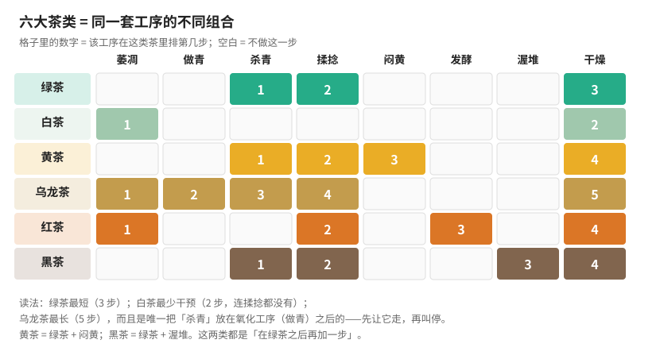
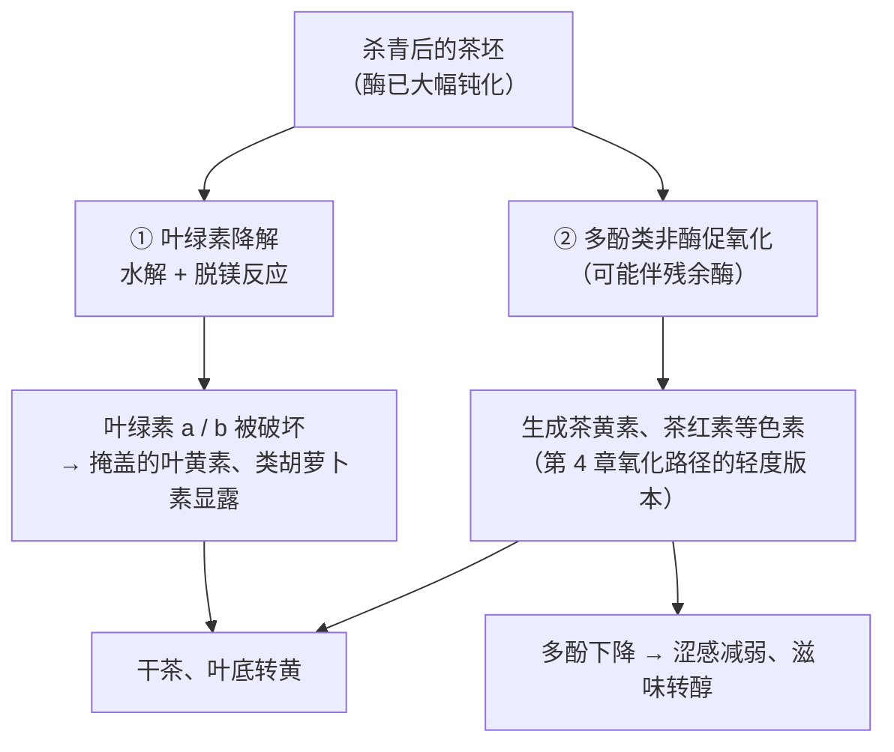
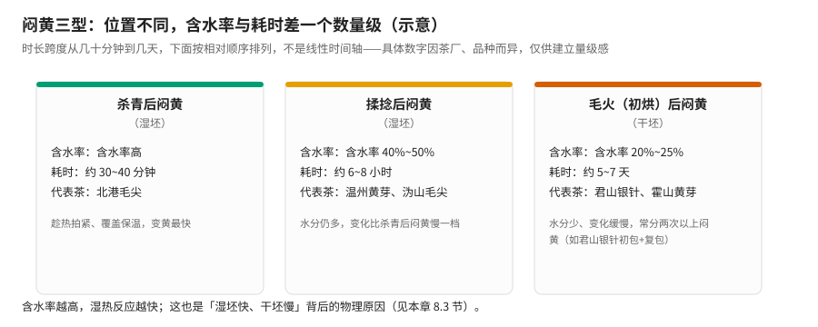
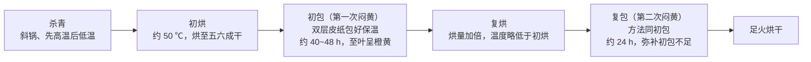

# 第 8 章 黄茶：闷黄，一步之差与绿茶分家

> 本章目标：讲透黄茶**唯一**的标志性工序——闷黄。
>
> 第 4 章已经把闷黄的机理讲过一遍：温和的湿热条件下，茶多酚轻度氧化、多糖部分水解，
> "黄变是表象，转味才是实质"。那一章讲的是"闷黄在化学上做了什么"；
> 这一章讲**闷黄具体怎么做、不同做法差在哪、为什么黄茶反而是产量最小的茶类**。

## 8.1 黄茶为什么是"绿茶 + 一步"，结果却差很多

回到第二部分导读那张工序矩阵：黄茶 = 杀青 → 揉捻 → **闷黄** → 干燥，
比绿茶（杀青 → 揉捻 → 干燥）只多了一步。

单看步骤数，黄茶和绿茶几乎是同一件事。但这"一步之差"带来的后果并不小：

| | 绿茶 | 黄茶 |
|---|------|------|
| 杀青之后 | 直接揉捻、干燥，**成分尽量留在接近鲜叶的状态** | 在某个环节插入**闷黄**，让湿热作用再推一把 |
| 叶绿素 | 基本保留（杀青灭酶即止） | **继续降解**（水解、脱镁），掩盖在下面的黄色色素显露 |
| 茶多酚 | 基本保留 | **轻度氧化**（第 4 章已讲） |
| 结果 | 清汤绿叶 | **黄汤黄叶**，滋味更醇和、青气更少 |

〔推论直接可用〕**闷黄是"克制版"的发酵**：它和黑茶渥堆一样，都以绿茶为起点，
只是闷黄"浅尝即止"、渥堆"充分尽致"（第 4 章已给出这个类比）。
正因为"浅尝即止"，闷黄对温度、含水率、时间的**容错区间很窄**——
多闷一点，黄茶就滑向发暗发闷；少闷一点，黄茶就退回绿茶。
这也是本章要讲的核心：**闷黄不是"再等一会儿"那么简单，是一组需要精确配合的参数**。

## 8.2 黄变的两条路径：不只是"轻度氧化"

第 4 章给出的共识是"茶多酚轻度氧化、多糖部分水解"，这里把"黄变"具体拆成两条
**同时发生**的路径：

**路径①（叶绿素降解）决定"看起来黄不黄"**：一项对市售黄茶的色差研究测得，
茶叶的**色度指标（Ps 值）与总叶绿素含量呈显著负相关**，
与**茶红素含量呈极显著正相关**——换句话说，**叶绿素降得越多、茶红素积累得越多，
外观色泽评分越高**，两条路径对"黄"这个视觉结果都有贡献，但统计上看叶绿素降解
（负相关）与茶红素生成（正相关）是两个独立起作用的变量。

**路径②（多酚氧化）决定"喝起来醇不醇"**：这也是第 4 章"转味才是实质"的具体落点——
多酚类氧化、水解后，苦涩减弱，氨基酸、可溶性糖相对占比上升，滋味变得甜醇。

> **一个容易被混淆的点**：黄茶的"黄"主要不是"晒黄了"或"氧化成了黄色"，
> 而是**本来就存在、被叶绿素遮住的黄色显露出来**，再叠加少量氧化色素。
> 这和红茶"氧化生成红色物质"的机制不同——红茶的红色是**新生成**的
> （儿茶素→邻醌→…→茶黄素→茶红素），黄茶的黄色有相当一部分是**揭示**出来的。

## 8.3 温度、含水率、时间：闷黄的三个旋钮

闷黄效果由温度、含水率（通气量）、时间三者共同决定，而且**三者互相牵动**——
提高任何一个都会加快变黄速度，但各自对品质成分的影响方向不完全一致。
这部分内容综合自一篇系统梳理闷黄影响因子的综述研究，并与具体实验论文交叉对照。

### 温度：不是越高越黄越好

| 温度区间 | 现象 | 代价 |
|----------|------|------|
| **约 20 ℃**（低温） | 汤色仍以**绿色为主**，接近绿茶特征；游离氨基酸积累量最高 | 黄变不充分 |
| **约 40~45 ℃**（中温） | 汤色转为**黄绿明亮**；可溶性糖积累量最高，有利于改善苦涩、提升甜感 | — |
| **约 60 ℃以上**（高温） | 汤色变为**黄亮**，但干茶色泽**暗褐、颜色过深**，叶底偏暗 | 叶绿素降解过快、多酚及呈味成分降解过多，滋味趋于淡薄 |

两项独立研究在"低温偏绿、中高温转黄"这个方向上互相印证：一项研究发现
**20 ℃ 闷黄条件下汤色仍以绿色为主，40 ℃ 和 60 ℃ 条件下汤色转为黄亮**；
另一项以市售茶样为对照、专门做色差建模的研究则发现，相对低温（**40~45 ℃**）
闷黄时干茶呈现嫩黄，**超过 50 ℃** 后干茶色泽转为暗褐、颜色过深、叶底偏暗——
两者都指向"温度过低黄变不够、温度过高色泽变差"这个**倒 U 形**结论，
只是具体的"过高"阈值（50 ℃ 还是 60 ℃）在不同研究里略有出入。

综述给出的建议区间是**闷黄温度控制在 20~40 ℃**；但另一篇专门做工艺优化的研究
给出的最佳组合里，叶温定在 **(45±2) ℃**——略高于综述建议的上限。
⚠️ **本书的处理**：这两个数字**不矛盾**，因为后一项研究同时把含水率、湿度、通气频率
作为联合变量一起优化，**单个参数的"最优值"离不开其他参数的组合**；
正文只引用"大致在 20~45 ℃ 这个区间，且不宜长时间停留在 50 ℃ 以上"这个方向性结论，
不把任何一个单点数字当作唯一正确答案。

**背后的机理**：温度升高，湿热反应速率加快——叶绿素降解快、多酚氧化快，
但**酯型儿茶素**（苦涩感强的 EGCG、ECG）在较高温度下水解、异构化得更快，
这对降低苦涩是好事；而**非酯型儿茶素、氨基酸、可溶性糖**这些鲜甜滋味的来源，
在温度过高时也会加速降解，反而让滋味变得单薄。
**这正是白茶那章讲过的同一条规律的翻版**：时间或温度拖得越久/越高，
不代表转化越"精细"，只代表某个方向走得更远——走过头就是缺陷。

### 含水率：决定反应速度的"量级开关"

这是闷黄里**影响最大**的变量，直接把闷黄分成两条路线（见下节）。
一项研究发现，闷黄含水率超过约 **60%** 时黄变速度最快，但容易产生**水闷味**；
含水率在约 **20%** 时黄变明显减慢，影响加工效率；
**含水率在 30%~40% 左右时，闷黄所制黄茶品质相对最佳**，口感更甜。
另一项工艺优化研究给出的最佳组合含水率是 **(37±3)%**，落在这个区间内，
两者方向一致。

### 时间：窗口存在，但不是越长越好

一项利用机器视觉连续跟踪闷黄过程中茶叶色泽变化（L、a、b 值）的研究发现：
**闷黄 12~18 小时内，叶片亮度（L）与黄值（b）持续上升、绿值（a）持续下降**，
是黄茶颜色形成的"有效窗口"；但**超过 24 小时后，茶叶颜色转向红棕色、失去光泽**，
同时氨基酸含量开始明显下降，部分氨基酸衍生物反而增多。
该研究据此认为**闷黄适宜时间在 18~24 小时**左右。

> ⚠️ **这个"18~24 小时"只是该研究样品条件下的结果，不是放之四海而皆准的数字**——
> 回看上一节"湿坯闷黄几十分钟到几小时、干坯闷黄数天"的跨度，
> 可见闷黄时长首先取决于**含水率**这个"量级开关"，温度与目标品质风格是第二层调节。
> 本书不把任何单一时长数字当作"标准答案"，只把"存在一个有效窗口、
> 过犹不及"这个方向性结论当作共识。

## 8.4 湿坯闷黄 vs 干坯闷黄：含水率差一个数量级，耗时也差一个数量级

含水率不同，闷黄时长可以从几十分钟拉到几天——这是黄茶工艺里**最大的一个分野**，
直接决定了后面要讲的"三型"划分。

| | 湿坯闷黄 | 干坯闷黄 |
|---|----------|----------|
| **时机** | 杀青或揉捻之后，**趁热**进行 | 初烘（毛火）之后进行 |
| **含水率** | 较高（约 40%~50%，高含水率可到 50% 以上） | 较低（约 20%~25%） |
| **反应速度** | 快 | 慢 |
| **典型耗时** | 几十分钟到 6~8 小时 | 数天（约 5~7 天） |
| **代表茶** | 北港毛尖（约 30~40 min）、温州黄芽 / 沩山毛尖（约 6~8 h） | 君山银针、霍山黄芽 |

GB/T 39592《黄茶加工技术规程》按黄茶的芽型 / 芽叶型 / 多叶型分别规定了不同的
闷黄工艺路线：**芽型**黄茶区分"湿坯闷黄"（杀青 → 闷黄 → 初烘或做形 → 干燥）与
"干坯闷黄"（杀青 → 做形和/或初烘 → 闷黄 → 干燥）；**芽叶型、多叶型**则区分
"先揉后闷"与"先闷后揉"两条路线——这说明闷黄在工序链条里的**具体插入位置**
本身就是一个可调的设计变量，不是固定在某一步。

> **一条实用的记忆方式**：**含水率越高，反应越快，但越容易"闷"出水闷味**；
> **含水率越低，反应越慢，但越能靠时间慢慢"磨"出细腻的转化**——
> 这和白茶萎凋"失水太慢反而做不好"的教训正好相反，因为驱动黄变的
> 不是失水这件事本身，而是**水分参与的湿热化学反应**，高含水率恰恰是反应更快的条件。

## 8.5 按闷黄位置分三类，及君山银针的案例

除了"湿坯 / 干坯"这条含水率的轴，黄茶还常按**闷黄发生在哪道工序之后**分三类：

| 类型 | 闷黄位置 | 代表茶 |
|------|----------|--------|
| **杀青后闷黄** | 杀青刚结束、趁热闷 | 北港毛尖 |
| **揉捻后闷黄** | 揉捻之后 | 温州黄芽、沩山毛尖 |
| **毛火（初烘）后闷黄** | 初烘之后，常分两次以上进行 | 君山银针、霍山黄芽 |

这个分类和上一节"湿坯 / 干坯"大体对应——越靠前的位置含水率越高、闷黄越快，
越靠后的位置含水率越低、闷黄越慢，但**不是严格的一一对应**（第 4 章已说过
"闷黄不是一道工序，而是一类手法"，具体名目有堆闷、包黄、渥闷、堆黄、摊黄等，
常常在不同工序**多次进行**）。

### 君山银针：一个"闷两次"的典型案例

君山银针是黄芽茶的代表，工艺上最突出的特点是**闷黄分两次做**（常被称为"初包"
"复包"）：

**为什么要闷两次**：一次闷黄很难把茶坯内外、不同部位的黄变程度闷得均匀，
"复包"的作用是**弥补初包的不足**，让黄变更彻底、更均匀。
这个"先闷一轮、晾一轮、再闷一轮"的结构，和白茶萎凋里"并筛"的逻辑有点像——
都是在中途"倒一下手"，让水分和转化重新分布均匀。

> ⚠️ **本书未核到**君山银针传统工艺"总耗时"的精确且来源一致的数字——
> 不同资料给出的总工时、初包复包具体小时数略有出入（例如初包 40~48 h
> 还是別的时长，各家描述不尽相同），这里只采信"**分两次闷黄、每次约一到两天**"
> 这个方向性描述，具体小时数不作为确定结论。

蒙顶黄芽则更进一步，有所谓"**三炒三闷**"的结构（杀青 → 初包 → 复炒 → 复包 →
三炒 → 堆积摊放 → 四炒 → 烘焙），同样是"闷黄 + 中途复炒"反复进行，
目的也是让黄变更充分均匀。⚠️ 具体各阶段闷黄时长（如初包 60~80 分钟、
堆积摊放 24~36 小时）本书**仅见单一行业资料转述**，未找到与学术论文交叉验证的数字，
这里只说明"多次闷黄、中间穿插复炒"这个结构性做法，不采信具体小时数作为定论。

## 8.6 原料分类：黄芽茶、黄小茶、黄大茶——以及黄大茶的"出格"之处

除了闷黄位置，黄茶还有一条按**原料嫩度**划分的传统谱系，和白茶的
银针 / 牡丹 / 寿眉结构很像：

| 类别 | 原料 | 代表 |
|------|------|------|
| **黄芽茶** | 单芽至一芽一叶初展 | 君山银针、蒙顶黄芽、霍山黄芽 |
| **黄小茶** | 细嫩芽叶 | 北港毛尖、沩山毛尖、温州黄汤（平阳黄汤） |
| **黄大茶** | 一芽二三叶甚至四五叶（夏秋茶） | 霍山黄大茶、广东大叶青 |

GB/T 21726《黄茶》的**官方**分类标准与此并不完全相同，是按原料和工艺分为
**芽型、芽叶型、多叶型、紧压型**四类——两套分类并行使用，划分逻辑接近
（芽型 ≈ 黄芽茶，多叶型 ≈ 黄大茶）但不是严格的一一对应，引用时要分清楚
是在说国标的官方四分类，还是业界常说的黄芽 / 黄小 / 黄大三分法。

### 黄大茶的"锅巴香"：跳出了"闷黄"这套精细平衡

黄大茶原料粗老（一芽四五叶的夏秋茶），工艺里除了闷黄，还有一道
**"拉老火"**——用明火高温快速烘焙，几秒钟翻动一次，来回走烘几十次，
焙到梗一折就断、口嚼酥脆、芽叶挂霜为适度。

这道高温烘焙带来的是黄大茶区别于黄芽茶、黄小茶的**标志性香气"锅巴香"**
（也叫老火香、高火香）。一项用顶空固相微萃取结合气相色谱-嗅闻-质谱联用
技术做的研究，直接对比了黄大茶与锅巴（做饭时的焦糊米饭锅底）的挥发性成分，
发现两者有多种共同的**吡嗪类化合物**（如 2-乙基-3,5-二甲基吡嗪、
2-乙基-5-甲基吡嗪、2,6-二乙基吡嗪），这类物质是**高温热反应（类似美拉德反应）**
的产物——也就是说，**黄大茶的"锅巴香"字面意义上就和真实锅巴的焦香来自同一类化学反应**。

> **这说明了什么**：黄芽茶、黄小茶的闷黄追求的是"甜醇"，核心是
> 8.3 节那种精细的湿热平衡；黄大茶走的是另一条路——**用粗老原料 + 高温烘焙**
> 主动引入焦糖化 / 美拉德反应香气，这已经**部分跳出了"闷黄"这套精细参数控制**，
> 更接近"用烘焙塑造风味"的逻辑。"黄茶都是靠闷黄取胜"这句话对黄大茶并不完全成立。

## 8.7 一个长期悬而未决的问题：微生物参与多少

第 4 章已经指出闷黄"是否含酶促作用"学界表述不一。这里补充一个相关但不同的问题：
**闷黄过程中滋生的微生物，到底起多大作用？**

闷黄堆积的环境（湿热、密闭）天然适合微生物生长。研究观察到黑曲霉、酵母菌
会随闷黄时间延长而**数量增加**，细菌则呈现先增后减的变化；微生物通过胞外酶
（如蔗糖酶、脂肪酶）理论上可以参与多酚类和多糖类物质的转化。

但**微生物的实际贡献大小目前没有定论**：有研究对比了"传统闷黄"（微生物自然滋生）
与"无菌闷黄"（人为抑制微生物）两种处理，发现虽然前者微生物含量远高于后者，
**但两种方式制成的茶在品质属性和整体感官上差异不明显**——这意味着至少在
该研究条件下，微生物对闷黄品质的贡献**不显著**。

> **本书的处理**：闷黄过程中确实会滋生微生物，但证据不支持"黄茶闷黄主要靠微生物"
> 这个说法——这与黑茶渥堆（第 4.9 节已讲，微生物是"最为关键、不可替代"的主角）
> 形成明确对比。闷黄的主导机制仍是**湿热作用（+可能的残余酶）**，
> 微生物更像是伴随出现的"旁观者"，具体作用大小**缺乏可靠数据**，
> 相关研究数量也还很少，仍是一个开放问题。

## 8.8 常见说法辨析

| 说法 | 判定 | 说明 |
|------|------|------|
| "黄茶只比绿茶多一道工序，差别不会太大" | **❌ 错误** | 工序数接近，但闷黄这"一步"引入了叶绿素降解和多酚氧化两条新路径，带来"黄汤黄叶"的质变，且容错区间很窄，8.1 节已说明 |
| "黄茶闷黄时间越长，黄变越充分，品质越好" | **❌ 明确错误** | 实测：闷黄超过约 24 小时后茶色转向红棕色、失去光泽，氨基酸等呈味成分下降，滋味变淡薄。存在一个有效窗口，不是越长越好 |
| "黄茶主要靠微生物发酵，和黑茶类似" | **❌ 错误** | 闷黄以湿热作用（±残余酶）为主；研究对比传统闷黄与无菌闷黄，品质差异不显著，微生物贡献不明确。真正"靠微生物"的是黑茶渥堆（第 4.9 节） |
| "君山银针是白茶"（因为叫"银针"） | **❌ 错误** | 君山银针是**黄茶**（黄芽茶代表），工艺含杀青、闷黄；白毫银针才是白茶，不杀青、不闷黄。第 5 章已指出这组易混淆名称 |
| "黄茶产量这么小，是因为工艺简单、不值钱" | **❌ 错误** | 恰恰相反：黄茶产量小的历史原因是计划经济时期为换取外汇，许多产区放弃了产量小的黄茶转产绿茶、红茶，部分传统工艺一度濒临失传；闷黄工艺本身并不简单（8.3~8.5 节） |
| "黄茶的黄色是氧化出来的新颜色，和红茶变红是一回事" | **⚠️ 不准确** | 黄茶的黄色有相当一部分是**叶绿素降解后显露**出本来存在的黄色色素，叠加少量多酚氧化产物；红茶的红色则主要是儿茶素氧化**新生成**的茶红素。机制有重叠但不是同一回事，8.2 节已说明 |
| "黄大茶的锅巴香是工艺缺陷，火候过了" | **⚠️ 不准确** | 锅巴香是黄大茶**刻意追求**的标志性风味，来自"拉老火"高温烘焙的美拉德反应，与黄芽茶、黄小茶的"甜醇"走的是不同风味路线，不是缺陷（8.6 节） |
| "黄茶闷黄温度越高，黄变越快越好" | **❌ 错误** | 温度过高（约 50~60 ℃ 以上）虽然黄变更快，但叶绿素降解过度、呈味成分降解过多，干茶色泽暗褐、滋味淡薄。存在一个大致 20~45 ℃ 的区间，过犹不及（8.3 节） |

## 8.9 思考题

1. 第 4 章说"黄茶 = 绿茶 + 一步"。结合本章 8.1、8.2 节，说明这"一步"具体往茶叶里加入了哪两条新的化学路径，分别对应"看起来黄"和"喝起来醇"中的哪一个。
2. 为什么说闷黄的含水率是一个"量级开关"？用湿坯闷黄和干坯闷黄的耗时对比说明。
3. 本章给出两项研究对"最佳闷黄温度"的描述略有差异（一个建议 20~40 ℃，一个给出 (45±2) ℃ 的最优组合）。这是不是意味着其中一个研究有问题？请说明本书是怎么处理这种差异的。
4. 闷黄"存在一个有效时间窗口"是什么意思？结合 8.3 节的机器视觉研究，解释为什么闷黄超过约 24 小时反而会变差。
5. 君山银针"闷两次"（初包 + 复包）而不是一次闷够，这种设计解决了什么问题？它和白茶萎凋里的"并筛"有什么相似之处？
6. 黄大茶的"锅巴香"和黄芽茶、黄小茶追求的"甜醇"是两种不同的风味路线。请说明这两种路线分别主要依赖本章讲的哪道工序，机理上有什么本质不同。
7. （进阶）本章 8.7 节指出"微生物在闷黄中的作用尚无定论"，而第 4.9 节说黑茶渥堆"微生物是最关键、不可替代的"。两类茶的加工环境（湿热、堆积）看起来很相似，为什么一个"微生物不显著"、一个"微生物主导"？请从温度、原料处理方式等角度推测可能的原因（允许合理推测，但要说明这是推测而不是已证实的结论）。

> 📖 **参考答案**（想清楚再看）：[Q1](../../qa/08-yellow-tea-qa.md#q1) ·
> [Q2](../../qa/08-yellow-tea-qa.md#q2) · [Q3](../../qa/08-yellow-tea-qa.md#q3) ·
> [Q4](../../qa/08-yellow-tea-qa.md#q4) · [Q5](../../qa/08-yellow-tea-qa.md#q5) ·
> [Q6](../../qa/08-yellow-tea-qa.md#q6) · [Q7](../../qa/08-yellow-tea-qa.md#q7)

## 8.10 本章实操

### 🅐 无器具版：从干茶与汤色反推闷黄方式

找黄芽茶（如君山银针或蒙顶黄芽）、黄小茶（如北港毛尖，若买不到可用描述代替）、
黄大茶（如霍山黄大茶）三类的干茶图片或描述，填表：

| 观察项 | 黄芽茶 | 黄小茶 | 黄大茶 |
|--------|--------|--------|--------|
| 原料嫩度（单芽 / 细嫩芽叶 / 一芽多叶） | | | |
| 干茶色泽（嫩黄 / 黄绿 / 褐黄带焦斑） | | | |
| 香气类型（清甜毫香 / 清高 / 焦香锅巴香） | | | |
| 👉 推断对照 GB/T 21726 属于哪一型（芽型/芽叶型/多叶型） | | | |
| 👉 推断闷黄可能偏"湿坯"还是"干坯" | | | |

**要点**：芽头肥壮、色泽嫩黄、香气清甜 → 多半是黄芽茶（芽型）；
条索较粗、带明显焦香或锅巴香 → 多半是黄大茶（多叶型），工艺上大概率经过"拉老火"。

### 🅐 无器具版加餐：给闷黄缺陷找原因

下面是三条审评记录，请指出最可能是闷黄哪个环节出了问题：

1. "干茶色泽偏绿，汤色黄绿，滋味接近绿茶，青气未完全去除。"
2. "干茶色泽暗褐，叶底发暗，滋味淡薄发闷。"
3. "汤色转向红棕色，茶叶失去光泽，滋味偏淡带涩。"

（答案见[答案册](../../qa/08-yellow-tea-qa.md#practice)。）

### 🅑 有条件版：黄茶与绿茶对照冲泡（备齐后再做）

**所需**：原料嫩度接近的一款黄茶（黄芽茶或黄小茶）与一款绿茶；盖碗；秤；
温度计；[冲泡记录表](../../forms/brewing-log.md)。

| 变量 | 黄茶 | 绿茶 |
|------|------|------|
| 投茶量 / 水量 / 水温 / 时间 | 3 g / 150 mL / 85 ℃ / 2 min（**完全相同**） | 同左 |

| 观察项 | 黄茶 | 绿茶 | 是否符合本章预测？ |
|--------|------|------|--------------------|
| 干茶色泽 | | | |
| 汤色（绿 / 黄绿 / 杏黄 / 嫩黄） | | | |
| 青气是否明显 | | | |
| 涩感（0-5，涩等 15 秒判断） | | | |
| 滋味是否更"醇和" | | | |
| 叶底色泽 | | | |

**预期**：同等嫩度下，黄茶汤色应比绿茶更偏黄，青气更弱，涩感更轻、滋味更醇和——
这正是闷黄这"一步"带来的差异。**如果感受不明显**，先检查两款茶的原料嫩度、
新鲜度是否接近（嫩度差异会盖过工艺差异，参考第 3 章），
以及这款黄茶的闷黄程度本身是否偏轻（北港毛尖这类闷黄时间很短的黄小茶，
与绿茶的差异本来就不如黄芽茶明显）。

## 8.11 本章主要参考

| 本章的哪个结论 | 来源 |
|----------------|------|
| 闷黄的实质、"黄变是表象、转味是实质"、三类闷黄位置划分、与渥堆的类比 | 第 4 章 4.8 节已核来源：[茶科普 \| 黄茶的"闷黄"作用是什么（澎湃·政务）](https://www.thepaper.cn/newsDetail_forward_14385848) |
| 闷黄温度（20~45 ℃ 区间，低温偏绿、高温色泽暗褐）、含水率（30%~40% 相对最优）、时间窗口、通氧量影响、微生物数量变化及"无菌闷黄与传统闷黄品质差异不显著"的研究 | 夏长杙、冉乾松、杨天根、翟精武、刘亚兵，《黄茶闷黄工艺影响因子及品质评价技术研究进展》，《沈阳农业大学学报》2024, 55(2): 247-256 |
| 叶温 (45±2) ℃、含水率 (37±3)%、湿度 (80±5)%、通气频率每 10 min 1 次的工艺优化组合 | 范方媛、杨晓蕾、龚淑英等，《闷黄工艺因子对黄茶品质及滋味化学组分的影响研究》，《茶叶科学》2019, 39(1): 63-73 |
| 外观色泽（Ps 值）与总叶绿素显著负相关（-0.500）、与茶红素极显著正相关（0.600）、40/60 ℃ 闷黄汤色转黄亮、20 ℃ 闷黄汤色仍偏绿（验证实验） | 王璟、高静、刘思彤等，《基于色差系统的黄茶外观色泽评价模型构建及其关键物质基础分析》，《食品科学》2017, 38(17): 145-150 |
| 闷黄 12~18 h 内 L、b 值上升、a 值下降，24 h 后转红棕色失光泽，氨基酸随之下降，18~24 h 为适宜闷黄时间 | WEI 等机器视觉跟踪闷黄过程的研究（转引自《沈阳农业大学学报》2024 综述） |
| 含水率超 60% 黄变最快但有水闷味、约 20% 黄变慢、30%~40% 品质相对最佳 | 刘晓等研究（转引自《沈阳农业大学学报》2024 综述） |
| 湿坯闷黄（约 40%~50% 含水率，几十分钟至 6~8 小时）与干坯闷黄（约 20%~25% 含水率，5~7 天）的划分、北港毛尖约 30~40 分钟、温州黄芽/沩山毛尖约 6~8 小时、君山银针/霍山黄芽约 5~7 天 | 综合检索的黄茶工艺资料（⚠️ 主要为百科/行业资料，方向与学术综述一致，具体小时数仅作量级参考） |
| GB/T 21726《黄茶》四分类（芽型/芽叶型/多叶型/紧压型）及原料要求 | [国标信息：GB/T 21726-2018《黄茶》](https://openstd.samr.gov.cn/bzgk/std/newGbInfo?hcno=E7979C96821E3A2F7C002F15565BA6A7)（见[国标与文献索引](../../standards.md)） |
| GB/T 39592《黄茶加工技术规程》按芽型"湿坯/干坯"、芽叶型与多叶型"先揉后闷/先闷后揉"分别规定闷黄工艺路线 | GB/T 39592-2020《黄茶加工技术规程》标准信息（见[国标与文献索引](../../standards.md)） |
| 黄芽茶/黄小茶/黄大茶传统三分法及代表茶 | 多个行业资料交叉对照（⚠️ 自媒体与百科资料为主，但分类方式与代表茶名称高度一致） |
| 君山银针初包/复包（双次闷黄）工艺流程 | 公开工艺资料交叉对照（⚠️ 具体小时数不同资料略有出入，正文已标注未核到精确一致数字） |
| 蒙顶黄芽"三炒三闷"工艺结构 | 公开工艺资料（⚠️ 单一行业来源，具体时长未交叉验证，正文仅采信结构性描述） |
| 黄大茶"锅巴香"关键呈香物质为吡嗪类化合物、与锅巴挥发性成分高度重叠 | 裴子莹、赫桂影、刘彧辰等，《黄大茶特征"锅巴香"的关键呈香物质鉴定》，《食品科学》2023, 44(12): 289-297 |
| 2023 年黄茶产量约 2.3 万吨、占全国茶叶总产量约 0.7%、50% 以上产自安徽、历史上因换汇需要产区转产的原因 | 中国茶叶流通协会《2023 年度中国茶叶产销形势报告》；行业资料交叉对照 |

> **⚠️ 本章标注为存疑的内容**：
> ① 闷黄"最佳温度"在不同研究里给出 20~40 ℃ 与 (45±2) ℃ 两种表述，
> 本书判断两者并不矛盾（后者是多变量联合优化的结果），但不把任一单点数字当作唯一答案；
> ② 君山银针、蒙顶黄芽等具体工艺的闷黄时长，各资料表述不完全一致，正文仅采信结构性描述；
> ③ 闷黄过程中微生物的实际贡献大小**缺乏定论**，相关研究数量少，本书明确标注为开放问题；
> ④ 黄茶产量占比的具体百分比，不同年份、不同统计口径（产量 vs 内销量）数字不同，
> 正文采用交叉一致的方向性结论（"黄茶是六大茶类中产量最小的一类"），不过度解读单一年份数字。
