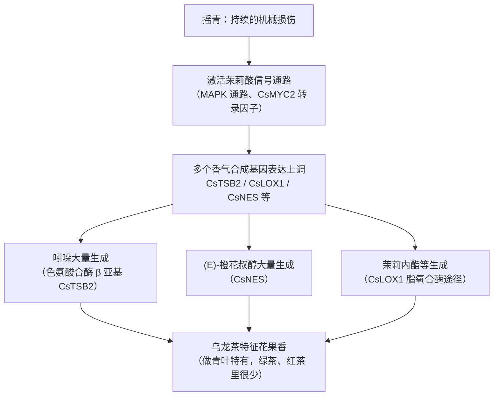
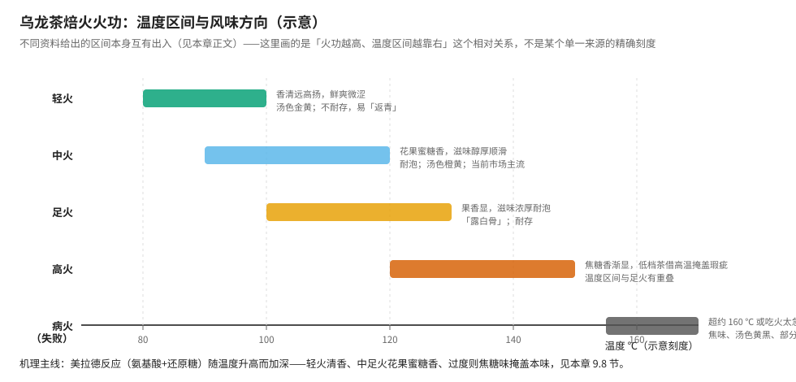

# 第 9 章 乌龙茶：做青与焙火，半发酵的技术顶点

> 本章目标：讲透乌龙茶**独有**的两道工序——做青（摇青 + 晾青）与焙火。
>
> 第二部分导读已经指出乌龙茶在工序矩阵里的特殊位置：**它是唯一把杀青放在氧化工序
> 之后的茶类**——先让酶促氧化走一段，再用杀青叫停，"先放后收"。
> 第 4 章讲过这件事"在干什么"（局部损伤、部分氧化）；这一章讲**怎么做、
> 做青闽北闽南广东台湾各地为什么做法不同、焙火又在做什么**。

## 9.1 为什么说乌龙茶是半发酵的技术顶点

回到第二部分导读的工序矩阵：乌龙茶 = 萎凋 → **做青** → 杀青 → 揉捻（包揉）→
干燥，常见做法里精制阶段还要再加一道**焙火**。六大茶类里它的工序链条最长，
而且结构上与其他五类都不一样：

| | 绿茶 | 红茶 | 乌龙茶 |
|---|------|------|--------|
| 氧化工序和杀青的先后 | 先杀青（不给氧化机会） | 没有杀青，发酵到底 | **先做青（氧化），再杀青（叫停）** |
| 氧化程度怎么定 | 不氧化 | 充分氧化 | **由制茶师在做青过程中动态决定**，没有固定终点 |
| 可调的"旋钮" | 杀青温度/时间 | 发酵温湿度/时间 | **做青的每一次摇青力度、次数、静置时长，都是独立的旋钮** |

〔推论直接可用〕**这正是乌龙茶被称为"技术顶点"的原因**：绿茶只需要在"何时叫停"
这一件事上做对；红茶只需要在"发酵到什么程度"这一件事上做对；
乌龙茶却要在做青的**每一次**摇青和静置之间，一边观察叶片的变化，
一边决定"现在该收还是该放"——而且这个过程会重复 5~10 次。
俗语"**看青做青，看天做青**"说的就是这件事：没有一张放之四海而皆准的参数表，
只有一套"观察 → 判断 → 调整"的流程。

## 9.2 做青是什么：摇青与晾青的交替

做青由**摇青**（机械力让叶片互相碰撞摩擦）与**晾青**（静置）反复交替组成，
闽南称"摇青"，潮汕称"浪青"，台湾称"室内搅拌"，说的是同一件事。

**摇青在做什么**：叶片在摇青机（或手工簸动）里不断碰撞、摩擦，造成叶**缘**细胞
组织受到机械损伤，细胞液与多酚氧化酶接触，引发局部酶促氧化。这个损伤**只发生在
叶缘**，叶片中央基本完好——这正是"绿叶红镶边"（又称"三红七绿"）的直接成因：
摇青次数越多、力度越大，叶缘受损、氧化变红的比例越高。

**晾青在做什么**：静置阶段，叶片内部的水分重新分布，同时氧化、水解等化学反应
持续进行，这是香气物质真正"生成"和"转化"的阶段，不是单纯的"等待"。

### 走水、还阳、退青：一组描述同一现象的经验术语

摇青会造成叶片**失水速度的局部差异**——叶片部分失水快，梗脉失水慢，
于是梗脉中的水分和可溶性物质向叶肉细胞**反向补充**，这个过程被称为**"走水"**。

静置时这个过程呈现出两个阶段：

| 阶段 | 现象 | 俗称 |
|------|------|------|
| 静置**前期** | 梗脉水分向叶肉渗透补充，叶片重新变得挺硬、光泽恢复、青气明显 | **"还阳"** |
| 静置**后期** | 水分蒸发大于补充，叶片转为萎软状态、光泽消失、青气减退、花香隐现 | **"退青"** |

> **一条实用的记忆方式**：还阳是"叶子看起来又精神了"，退青是"叶子开始显老实了、
> 同时开始香"。制茶师正是靠反复观察这组"还阳—退青"的循环，
> 判断该不该开始下一次摇青。**这不是玄学描述，是水分迁移这个物理过程的外部投影**——
> 和第 7 章白茶萎凋里"七成干/八成干/九成干"对应失水曲线拐点，是同一类经验-机理对应关系。

### 做青适度的标志

多份行业与学术资料对"做青适度"的描述高度一致，共同指向这几个信号：
叶缘呈**朱砂红**、叶片中央保持**黄绿色**、叶脉透明（灯光下呈淡黄色）、
叶片呈汤匙状卷起、手握有弹性感（"手握如棉"）、**青气消失、花果香显露**。

## 9.3 做青的生化机制：机械损伤如何变成香气

这是最近十几年乌龙茶研究里进展最快的一块，值得专门讲清楚——
机械损伤**不只是"把细胞弄破让酶接触底物"这么简单**，它还会触发一条
**植物应激信号通路**，主动合成一批原本不存在或含量很低的香气物质。

**关键证据**：一项发表于 *Journal of Agricultural and Food Chemistry* 的研究
直接证明了这条链路——研究者从茶树中克隆出色氨酸合酶 α 亚基（CsTSA）和三个
β 亚基（CsTSB），在大肠杆菌中重组表达后证实 CsTSA + CsTSB2 的组合能把
吲哚-3-甘油磷酸转化为**吲哚**；更关键的是，**CsTSB2 在乌龙茶摇青过程中高度表达**，
而用持续性机械损伤**模拟**摇青过程，同样能显著提高 CsTSB2 表达量和吲哚含量——
这是茶叶中吲哚形成机制**首次**被实验证实。同一研究还发现：红茶虽然也有揉捻这道
机械损伤工序，但红茶里吲哚含量远低于乌龙茶，稳定同位素标记实验表明
红茶揉捻导致的细胞破坏**不会**促进吲哚合成，反而是**终止**了吲哚合成——
换句话说，**同样是机械损伤，在不同茶类里触发的反应完全不同**，
这与氧化程度、酶活性保留程度等因素相关。

后续研究进一步发现，**低温和机械损伤的双重胁迫**对香气物质合成有协同效应，
其机制是双重胁迫共同提高了茉莉酸的含量及其合成基因、关键转录因子
**CsMYC2** 的表达水平——茉莉酸是植物应对机械损伤等胁迫的经典信号分子，
这条链路把"摇青"这个制茶动作和"植物受伤后启动防御反应"这个生物学机制
直接联系了起来。

一项 2025 年对武夷岩茶（肉桂、水仙、大红袍、白鸡冠四个品种）全工序代谢组学的
系统研究，用非靶向代谢检测对做青和焙火两道工序分别做了定量分析，印证了上述机制：
研究发现 **L-赖氨酸、L-色氨酸、吲哚和茉莉酸甲酯**等多种**植物抗逆响应成分**
参与了做青过程代谢物的介导调控，做青阶段生成的一系列挥发性化合物——
**(Z)-3-己烯-1-醇、(E)-橙花叔醇、苯乙醛、茉莉内酯、茉莉酸甲酯和吲哚**——
共同赋予了做青叶花香、果香兼具青香的气味特征。该研究还指出，
**做青工序和烘焙工序对差异代谢物数量和丰度的变化起主导驱动作用**，
而萎凋阶段的变化相对较小。

### 摇青程度如何影响具体成分：一项对照实验

一项以"春闺"品种闽北乌龙茶为对象、设置轻摇与重摇两组对照的研究给出了具体数据：

| 指标 | 轻摇处理 | 重摇处理 |
|------|----------|----------|
| 感官总分 | 90.6（外形紧结、花香显、滋味鲜爽） | 88.0（外形稍松、花香显、滋味浓醇） |
| 儿茶素总体 | **显著更高** | 更低（重摇导致细胞破损更多，酶促氧化更充分） |
| 酯型儿茶素（ECG/EGCG/EGCG3"Me） | 更高 | 分别低 35.12%、34.66%、38.21% |
| 茶氨酸、谷氨酸 | 更高 | 降低较多 |
| 挥发性酯类物质 | 较少 | **显著更丰富**（脂肪酸作为反应底物参与生成） |

> **这组数据直接支持一个结论**：**摇青程度本身就是一个可以定向调控风味的参数**——
> 轻摇倾向于保留鲜爽、收敛性强、花果香清扬的风格（闽南铁观音的清香型路线接近这个方向）；
> 重摇倾向于让滋味更浓醇、回甘更好、香气层次更丰富，但儿茶素和氨基酸这类
> "鲜爽原料"会消耗更多（闽北岩茶偏向这个方向）。这不是"谁更好"的问题，
> 是制茶师根据想要的风格**主动选择**的工艺参数。

## 9.4 看青做青、看天做青：没有标准参数表

正因为做青是动态判断的过程，不同资料给出的"摇青次数"和"总时长"存在不小的差异——
这不是资料互相矛盾，而是做青本身**高度依赖原料和环境**，不存在唯一的"标准值"。

| 资料 | 摇青次数 | 总时长 |
|------|----------|--------|
| 武夷岩茶传统手工做青（综合多份资料） | 5~10 次 | 约 6~12 小时 |
| 综合做青机做青（武夷岩茶） | 6~10 次 | 约 6~9 小时 |
| 武夷岩茶代谢组学研究实测 | 4 次 | 环境温度 22~25 ℃、相对湿度 74.2%~80.7% |
| 铁观音摇青 | 4~5 次 | — |

⚠️ **本书的处理**：这些数字之间的差异**不代表某个来源有错**，而是反映了
"看青做青"本身的弹性——原料嫩度、品种蜡质层厚薄（大红袍、肉桂蜡质层厚、耐摇，
水仙蜡质层薄、不耐摇，因而宜轻摇）、天气（晴朗北风天最利于做青，雨水青含水量大、
需要更长时间走水）都会改变实际需要的摇青次数和时长。正文只给出**方向性的量级**
（几次到十几次、几小时到十几小时），不把任何单一数字当作"标准答案"。

**摇青力度的递进规律**是各资料高度一致的共识：**前轻后重、前短后长**——
前期轻摇、勤摇（次数多但力度小），目的是促进走水；后期重摇（次数少但力度大、
转速更快），目的是促进红变和内含物转化。若整体摇青过重，红变过多，
香气浑浊、带发酵味；若整体摇青过轻，走水不完全，香气带青、滋味苦涩。

## 9.5 杀青与造型：叫停，以及塑形

### 杀青：比绿茶更微妙的"叫停"

做青适度后，用高温**快速钝化酶活性**，终止酶促氧化，这一步和绿茶杀青的
目标一致（第 6 章已讲过灭酶机理），但乌龙茶杀青的操作手法略有不同——
多份资料提到乌龙茶杀青"**宜先闷后扬，多闷少扬**"：因为做青叶纤维化、
角质化程度较高、导热性差，且含水量已经不多，闷炒能让蒸汽更快穿透叶片、
更快提升叶温。

⚠️ **乌龙茶杀青的具体锅温，本书未找到互相一致的数字**——不同资料分别给出
200~220 ℃、220~260 ℃、280~300 ℃ 等不同区间，差异明显，且都没有标注
是叶温还是锅温（回看第 6 章"锅温 ≠ 叶温"的提醒，这个区分同样适用于这里）。
本书只采信"杀青锅温明显高于绿茶典型锅温、目的仍是让叶温快速越过酶活性区间"
这个方向性结论，不采信任一单点温度数字。

### 揉捻与包揉：从"条形"到"颗粒形"再到"半球形"

乌龙茶因产区不同，最终外形差异很大——条形（如武夷岩茶）、卷曲颗粒形
（如铁观音、台湾高山茶）、半球形（如台湾冻顶乌龙），这个差异主要来自
**揉捻 / 包揉的轻重与次数**，不是品种本身决定的。

**揉捻**：杀青后趁热揉捻，使叶片初步卷曲成条。

**包揉**（闽南乌龙茶、台湾乌龙茶的特色塑形工序）：把揉捻初步成形的茶坯用方巾
包成球状，反复"揉、压、搓、抓"后解块、复烘，循环数次（常见说法是"三揉三焙"，
即揉捻 → 初焙 → 包揉 → 复焙 → 复包揉 → 足干这样的反复过程），
使茶条逐渐卷曲、紧结成颗粒状甚至半球状。

台湾冻顶乌龙更进一步，用"**热团揉**"工艺——趁热将茶叶包成圆球状，
用手工或布球揉捻机来回搓压，中途要摊开打散散热，反复多次，
最终形成紧结的半球形外观，这是冻顶乌龙区别于条形包种茶（如文山包种）
最直观的外形特征。

> ⚠️ **本书未核到**各类乌龙茶包揉具体次数、每次时长的精确且来源一致的数字
> （不同资料给出"数次到十几次"不等），这里只采信"反复多次、趁热操作、
> 中途需解块散热"这个结构性描述，不写具体次数。

## 9.6 四大产区做青工艺对比：闽北、闽南、广东、台湾

乌龙茶的四大产区——闽北（武夷岩茶为代表）、闽南（铁观音为代表）、
广东（凤凰单丛为代表）、台湾（高山茶/冻顶乌龙/文山包种为代表）——
在做青环节的具体做法上有明显差异，这些差异直接对应到最终的风味风格：

| 产区 | 代表茶 | 做青特点 | 风味取向 |
|------|--------|----------|----------|
| **闽北** | 武夷岩茶（肉桂、水仙、大红袍等） | 摇青次数较多、力度较大，综合做青机或手工多次交替 | 醇厚、岩韵显，花果蜜糖香偏浓郁 |
| **闽南** | 铁观音 | 摇青（4~5 次）配合"摇"与"摊"交替，清香型做法偏轻摇 | 兰花香显、滋味鲜爽（清香型）；传统浓香型则做青更重、经焙火转化 |
| **广东** | 凤凰单丛 | 晒青（利用光热促进内含物转化）+ 摇青 + 浪青反复，摇青手法"轻摇多次"，按单株香型调整 | 萜烯醇类主导的**十大香型**体系（黄枝香、蜜兰香、桂花香等），"茶中香水" |
| **台湾** | 冻顶乌龙、高山茶、文山包种 | 日光/加温萎凋程度较重，搅拌（浪菁/室内搅拌），现代多用**空调做青**精确控温控湿 | 轻中度发酵、清香高扬，冻顶乌龙另有"热团揉"塑形工序 |

### 做青之外，各产区还有一个共同机制：香气前体在萎凋/晒青阶段已经开始积累

凤凰单丛的研究给出了一个有意思的细节：**采摘时机本身就是工艺的一部分**——
鲜叶多选在晴天**下午**采摘，因为经过半天光合作用和蒸发，
鲜叶里**沉香醇、香叶醇等萜烯类香气前体物质已经呈线性增加**；
随后的**晒青**环节进一步促进水分蒸发、细胞基质浓度上升、酶活性增强，
鲜叶的青草木香成分在晒青阶段就开始消减，为后续做青阶段
罗勒烯、茉莉酮、橙花叔醇等花果香成分的进一步增多打下基础。

> **这说明了什么**："做青决定乌龙茶的香气"这句话只说对了一半——
> 做青确实是香气转化最密集的阶段，但**萎凋 / 晒青阶段已经在为做青准备原料**
> （香气前体物质的积累），不是做青"凭空"产生所有香气。这也解释了
> 为什么各产区对萎凋、晒青的具体操作（日光时长、翻动次数）同样很讲究，
> 不是可以随便跳过的前置步骤。

### 凤凰单丛的"十大香型"：萜烯醇类是主体

凤凰单丛因香型种类繁多被称为"茶中香水"，1996 年一项经典研究共鉴定出
**104 种芳香物质，以萜烯醇类为主**。不同香型对应不同的特征呈香物质，
例如蜜兰香型的主体呈香物质是橙花叔醇、β-紫罗酮、石竹烯；
芝兰香型是异丁香酚；黄枝香型是 α-杜松醇；桂花香型的主体呈香物质是
芳樟醇及其氧化物。⚠️ 这些"某香型 = 某化合物"的对应关系来自不同年代、
不同研究团队使用不同检测方法（SDE-GC/MS、SPME 等）得出的结果，
本书只引用其中被多次转述、方向一致的几组对应关系，不代表每种香型
都已经被单一化合物完全解释清楚。

### 关于"发酵程度百分比"：一个需要格外小心的数字

市面上流传着大量形如"轻发酵 10%~25%、中度发酵 25%~50%、重度发酵 50%~70%"
或"闽南铁观音发酵度 10%~20%、闽北武夷岩茶 20%~30%（或高达 50%）、
东方美人 60%~80%"这类具体百分比，而且**不同来源给出的具体区间互相不一致**
（例如武夷岩茶的发酵度，不同资料给出 20%~30%、20%~50%、"可高达 50%左右"
等不同说法）。

> ⚠️ **本书的处理**：这与第 5 章已经提醒过的"数字陷阱"是同一个问题——
> **国标并没有给各类乌龙茶规定"氧化度/发酵度"的百分比**，"氧化度"本身
> 应该如何定量测定目前也没有统一方法。这些百分比数字多来自茶商、
> 科普文章的经验性描述，彼此之间差异很大，**本书不采信任何一组具体数字**，
> 只保留"**闽南铁观音（尤其清香型）整体偏轻发酵，闽北武夷岩茶整体偏重发酵，
> 广东单丛与台湾乌龙跨度较大（从轻发酵的文山包种到重发酵的东方美人都有）**"
> 这个方向性、相对排序的结论。

## 9.7 焙火：走水焙与炖火，美拉德反应如何塑造风味

焙火（又称炖火、吃火）是乌龙茶**精制阶段**最后、也是最见功力的工序，
核心作用不是"把茶烤熟"，而是**用热化学反应继续塑造香气和滋味**。

### 两个阶段：走水焙（毛火）与炖火（吃火）

| 阶段 | 别称 | 目的 | 操作特点 |
|------|------|------|----------|
| **初制阶段的烘焙**（走水焙 / 抢水焙） | 毛火 | 继续破坏残留酶活性、蒸发水分、紧缩茶条 | 高温、快速、流水作业，温度明显高于后一阶段 |
| **精制阶段的炖火**（吃火 / 焙火功） | 炖火 | 脱水糖化（熟化）、异构化、氧化及后熟 | **低温、长时间**，是形成武夷岩茶特有风味的关键工序 |

传统炭焙的炖火强调**缓慢降温**：一种常见做法是高温水焙后加焙炖火，
又称"低温久烘"，时长可达约 8 小时，温度从约 80 ℃**逐渐降到**约 40 ℃，
这种缓慢降温被认为能提高耐泡度、醇和度、促进香气熟化、改善汤色；
也正因为需要凭经验持续判断降温节奏，"低温久烘"被认为是**最考验技艺**的环节。

### 核心机理：美拉德反应

焙火过程风味转化的化学基础是**氨基酸与还原糖在加热条件下的美拉德反应**，
生成吡嗪类等含氮杂环化合物——这类物质通常带有烘烤香、坚果香乃至焦糖香特征，
是中火、足火、高火乌龙茶呈现"烘烤香""焦糖香"的直接来源。

一项以四川乌龙茶为对象、系统设置焙火温度（70/90/110 ℃）与时间
（2.5/3.5/4.5 h）交叉组合的研究给出了具体数据：

- **90~110 ℃ 焙火可促进香气和滋味的发展**，最佳品质出现在 90 ℃ 焙火
  3.5~4.5 小时，或 110 ℃ 焙火 3.5 小时，表现为"花果香浓郁，滋味浓醇或浓厚"；
- **110 ℃ 焙火 4.5 小时则会产生焦气和苦味**，品质反而下降——
  这再次印证了本书反复强调的规律：**温度或时间过了头，不是"更浓郁"，
  而是滑向缺陷**；
- 焙火程度加重时，**氨基酸、可溶性糖、水浸出物、咖啡碱、茶多酚、儿茶素、
  茶黄素、茶红素都在下降**，唯独**茶褐素在上升**（升幅约 2.51%~9.35%）；
- 研究据此提出：**茶褐素增加量不宜超过约 8.97%**，可作为判断焙火是否适度的
  一个参考指标；氨基酸与可溶性糖的美拉德反应，正是生成"吡嗪、糠醛类"
  花果香、烘烤香物质的物质基础。

### 不同火功：温度区间本身众说纷纭，但相对关系一致

市面上对"轻火、中火、足火、高火"各自对应的温度区间，**不同资料给出的
具体数字差异很大**——有的说轻火 80~90 ℃、中火 90~100 ℃、足火 100~120 ℃；
也有资料把整体区间都往上平移，说轻火已经要到 100 ℃、足火要到 120~130 ℃
甚至更高。

> ⚠️ **本书的处理**：和 9.4 节"摇青次数"遇到的问题类似，这里的具体温度区间
> **本书不采信任何一组单点数字**作为确定结论，只保留下面这些**方向一致**
> 的结论：
> 1. **火功从轻到高，温度区间依次升高、持续时间也可能更长**；
> 2. **风味从"清香高扬"过渡到"花果蜜糖香"再到"果香浓厚"最后到"焦糖香"**，
>    对应美拉德反应程度的加深；
> 3. **轻火茶不耐存放，容易出现"返青"现象**（第 7 章已讲过"返青"概念，
>    这里是同一现象在乌龙茶上的体现：焙火不足、水分和部分生青物质未充分转化，
>    存放中容易重新显露出不愉悦的青涩感）；
> 4. **超过某个阈值（不同资料给出的病火温度多在约 150~160 ℃ 以上）或吃火过急**，
>    会出现"病火"——焦味、汤色黄黑、叶底部分或全部碳化，是明确的工艺缺陷，
>    不是"重火功"的正常表现。

## 9.8 常见说法辨析

| 说法 | 判定 | 说明 |
|------|------|------|
| "乌龙茶做青只是把茶叶摇一摇，比做红茶、绿茶简单" | **❌ 错误** | 做青要在 5~10 次摇青与晾青之间反复判断、动态调整力度与时长，是六大茶类里**可调变量最多、最依赖经验判断**的工序，没有固定参数表 |
| "乌龙茶做青的香气就是摇出来的，跟萎凋/晒青没关系" | **❌ 错误** | 凤凰单丛等研究表明，晒青阶段鲜叶内沉香醇、香叶醇等**香气前体物质已经开始积累**，做青是在这个基础上转化，不是凭空产生（9.6 节） |
| "摇青摇得越重，茶越好喝" | **❌ 错误** | 重摇虽能提升滋味浓醇度和香气层次，但会导致儿茶素、茶氨酸等鲜爽成分明显下降；轻摇、重摇对应不同的风味目标，不存在"摇得越重越好"（9.3 节对照实验） |
| "武夷岩茶发酵度就是 30%，这是定值" | **❌ 错误** | 国标没有规定各类乌龙茶的"发酵度"百分比，不同资料给出的具体数字互相矛盾（9.6 节），"氧化度"本身也缺乏统一测定方法 |
| "铁观音做得越清香，说明工艺越简单" | **❌ 因果颠倒** | 清香型铁观音是**轻摇、轻发酵**定向调控的结果，要精确控制摇青力度和次数，并不比浓香型（重摇+焙火）更"简单"，只是风味目标不同 |
| "焙火焙得越重，茶越好、越值钱" | **❌ 错误** | 足火、高火茶耐存、滋味浓厚，但超过适度界限会变成"病火"（焦味、碳化），且不同品种、不同品质定位该用哪种火功并不统一；轻火茶在某些品类里恰恰是**主流追求**的清香路线 |
| "轻火乌龙茶不耐放，一定是没做好" | **⚠️ 不准确** | 轻火茶确实容易"返青"，但这不是工艺缺陷，而是这类茶**本就定位为尽快喝完的清香路线**，需要冷藏、密封等针对性储存方式（见第 35 章），不能用"耐不耐放"去评判轻火茶的工艺水平 |
| "乌龙茶杀青温度 300 ℃，那茶叶不是烧焦了吗" | **⚠️ 混淆概念** | 这类数字多数指**锅温**而非**叶温**（与第 6 章"锅温≠叶温"同理），具体数值本书未找到互相一致的来源，不作为确定结论采信 |

## 9.9 思考题

1. 第二部分导读说乌龙茶是唯一"先放后收"的茶类。结合本章 9.1 节，说明这个"先放后收"具体体现在工序的哪个环节，以及它为什么让乌龙茶比绿茶、红茶更难标准化。
2. "还阳"和"退青"分别是什么现象？它们和白茶萎凋里"七成干/八成干/九成干"这组经验节点，在方法论上有什么共同点？
3. 结合 9.3 节的机理链条，解释"机械损伤"为什么不只是"把细胞弄破"，还能主动触发香气物质的生成。为什么同样是机械损伤，红茶揉捻不会产生大量吲哚？
4. 9.3 节的对照实验显示轻摇和重摇在儿茶素、茶氨酸、挥发性酯类上的变化方向相反。请用这组数据说明"闽南偏轻摇、闽北偏重摇"这个产区差异，分别对应什么风味取向。
5. 本章在"摇青次数""焙火温度区间""发酵度百分比"三处都明确标注了"不同资料数字不一致、本书不采信单点数字"。请说明这种处理方式符合本书查证纪律的哪几条，为什么不能"选一个看起来最权威的数字写上去"。
6. 焙火研究显示，焙火程度加重时氨基酸、茶多酚、儿茶素都在下降，唯独茶褐素在上升。请用美拉德反应和多酚转化两条机制，分别解释这两种相反的变化趋势。
7. （进阶）"轻火茶容易返青"和"白茶高温高湿萎凋容易产生发酵香"（第 7 章）是两个不同茶类里的现象。请说明它们背后是否是同一类"工艺没做到位，物质转化未完成"的问题，还是两种完全不同的机理。

> 📖 **参考答案**（想清楚再看）：[Q1](../../qa/09-oolong-tea-qa.md#q1) ·
> [Q2](../../qa/09-oolong-tea-qa.md#q2) · [Q3](../../qa/09-oolong-tea-qa.md#q3) ·
> [Q4](../../qa/09-oolong-tea-qa.md#q4) · [Q5](../../qa/09-oolong-tea-qa.md#q5) ·
> [Q6](../../qa/09-oolong-tea-qa.md#q6) · [Q7](../../qa/09-oolong-tea-qa.md#q7)

## 9.10 本章实操

### 🅐 无器具版：从干茶与叶底反推产区工艺

找武夷岩茶（肉桂或水仙）、铁观音（清香型）、凤凰单丛、台湾高山茶（或冻顶乌龙）
四类的干茶图片或描述，填表：

| 观察项 | 武夷岩茶 | 铁观音（清香型） | 凤凰单丛 | 台湾高山茶 |
|--------|----------|------------------|----------|------------|
| 外形（条形/卷曲颗粒/半球形） | | | | |
| 干茶色泽（乌褐/砂绿/黄褐带绿） | | | | |
| 香气类型（岩韵花果蜜糖香/兰花香/某单丛香型/清香高扬） | | | | |
| 👉 推断摇青偏轻还是偏重 | | | | |
| 👉 推断是否经过明显焙火 | | | | |

**要点**：条形、色泽偏深、焙火香明显 → 多半是闽北做法；卷曲颗粒、色泽翠绿、
兰花香清扬 → 多半是清香型铁观音（轻摇轻焙）；香型独特且多样 → 大概率是单丛；
半球形紧结或条形清香、少焙火 → 多半是台湾高山茶路线。

### 🅐 无器具版加餐：给做青缺陷找原因

下面是三条审评记录，请指出最可能是做青（或焙火）哪个环节出了问题：

1. "干茶带明显青草气，滋味苦涩，叶底发硬、看不出红镶边。"
2. "汤色浓、香气发闷带酵味，叶缘红变过多、近乎全叶发红。"
3. "干茶带焦味，汤色偏暗，叶底局部碳化。"

（答案见[答案册](../../qa/09-oolong-tea-qa.md#practice)。）

### 🅑 有条件版：同一产区、不同焙火程度对照冲泡（备齐后再做）

**所需**：同一款茶（如铁观音或武夷岩茶）的清香型（轻焙火）与浓香型/传统工艺
（重焙火）各一份；盖碗；秤；[冲泡记录表](../../forms/brewing-log.md)。

| 变量 | 清香型（轻焙火） | 浓香型（重焙火） |
|------|------------------|------------------|
| 投茶量 / 水量 / 水温 / 时间 | 5 g / 110 mL / 100 ℃ / 第一泡 10~15 s（**完全相同**） | 同左 |

| 观察项 | 清香型 | 浓香型 | 是否符合本章预测？ |
|--------|--------|--------|---------------------|
| 干茶色泽 | | | |
| 香气类型（花香/果香/焙火香） | | | |
| 汤色深浅 | | | |
| 滋味是否更醇厚/浓厚 | | | |
| 耐泡程度（第几泡明显变淡） | | | |

**预期**：清香型香气更高扬、滋味更鲜爽但不如浓香型耐泡；浓香型焙火香明显、
滋味更浓厚醇和、更耐泡。**如果感受不明显**，先检查两份茶是否为同一产区/品种，
以及冲泡参数是否严格一致——焙火差异在高水温、短时间的乌龙茶标准冲泡法下
最容易被喝出来。

## 9.11 本章主要参考

| 本章的哪个结论 | 来源 |
|----------------|------|
| 乌龙茶"先放后收"的工序结构、绿叶红边机制 | 第 4 章 4.8 节已核框架；GB/T 30357.1《乌龙茶 第1部分：基本要求》（见[国标与文献索引](../../standards.md)） |
| GB/T 35863《乌龙茶加工技术规范》萎凋参数（自然萎凋 3~6 h/失水率 10%~15%、日光萎凋 15~60 min）、精制工艺流程 | GB/T 35863-2018《乌龙茶加工技术规范》标准信息（见[国标与文献索引](../../standards.md)） |
| 做青机制（摇青损伤叶缘细胞、晾青内含物转化）、走水/还阳/退青现象 | 多份行业与学术资料交叉对照（武夷岩茶传统制作技艺相关资料、综合做青机工作原理资料） |
| 机械损伤诱导吲哚生成的分子机制（CsTSA/CsTSB2）、红茶揉捻不促进吲哚合成反而终止合成 | Zeng L. et al., *Formation of Volatile Tea Constituent Indole During the Oolong Tea Manufacturing Process*, *Journal of Agricultural and Food Chemistry*, 2016, 64(24): 5011-5019 |
| 低温与机械损伤协同诱导茉莉酸信号、CsMYC2 表达上调 | 中科院华南植物园团队后续研究（综述转引，曾兰亭等 2016-2019 系列工作） |
| 武夷岩茶做青/焙火代谢组学：L-赖氨酸/L-色氨酸/吲哚/茉莉酸甲酯参与做青调控、做青阶段生成的挥发性化合物清单、做青与烘焙是驱动代谢物变化的主导工序 | 陈林、宋振硕、项丽慧、张应根、陈键，《武夷岩茶加工过程代谢轮廓的动态变化规律》，《食品科学》2025, 46(18): 190-199 |
| 不同摇青程度（轻摇 vs 重摇）对感官品质、儿茶素/氨基酸/挥发性酯类的具体影响数据 | 占鑫怡、杨云、陈彬等，《不同摇青程度春闺闽北乌龙茶品质差异分析》，《食品工业科技》2023, 44(11): 271-279 |
| 焙火温度（70/90/110 ℃）×时间交叉实验、茶多酚等成分下降与茶褐素上升的具体数据、茶褐素增幅不宜超过约 8.97% | 罗学平、李丽霞、赵先明、敬廷桃，《不同焙火处理对四川乌龙茶香味与化学品质的影响》，《食品科学》2016, 37(17): 104-108 |
| 凤凰单丛晒青阶段香气前体积累、十大香型及对应萜烯醇类呈香物质 | 多份期刊与综述资料交叉对照（含 1996 年华南农业大学戴素贤团队关于凤凰单丛 104 种芳香物质的经典研究转引） |
| 包揉工艺（手工布巾包揉、踏包揉、机械包揉）、"三揉三焙"结构 | 行业资料交叉对照（⚠️ 具体次数与时长各资料不一致，正文仅采信结构性描述） |
| 台湾乌龙茶浪菁、空调做青、冻顶乌龙"热团揉"工艺 | 行业资料交叉对照 |
| GB/T 18745《地理标志产品 武夷岩茶》2006 版取消名岩区/丹岩区产区划分 | GB/T 18745-2006 标准信息（见[国标与文献索引](../../standards.md)） |

> **⚠️ 本章标注为存疑的内容**：
> ① 各产区摇青次数、总时长的具体数字——不同资料差异明显，正文只给方向性量级；
> ② 乌龙茶杀青的具体锅温——不同资料给出 200~300 ℃ 不等，且多数未区分锅温与叶温；
> ③ 各类乌龙茶"发酵度"百分比——国标无此规定，不同资料数字互相矛盾，本书不采信任一具体数字；
> ④ 焙火轻火/中火/足火/高火对应的具体温度区间——不同资料差异很大，9.7 节已详细说明处理方式；
> ⑤ 包揉具体次数与每次时长——仅见结构性描述，未核到精确且一致的数字。
