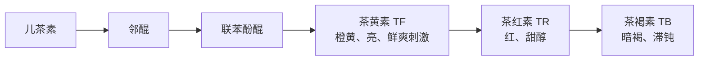
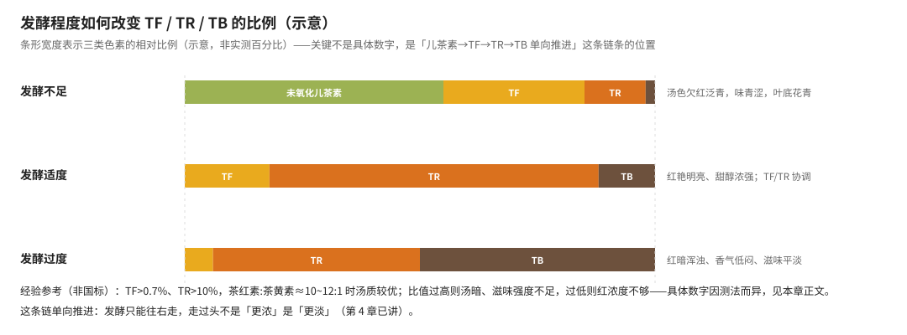
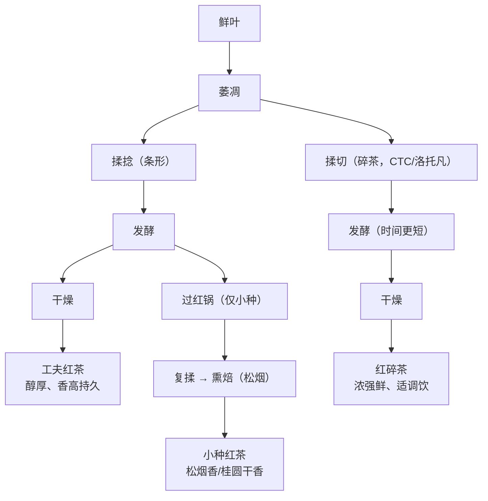

# 第 10 章 红茶：全发酵，茶黄素/茶红素/茶褐素的生成与汤色滋味

> 本章目标：讲透红茶**唯一**决定品质高下的化学体系——茶黄素（TF）、茶红素（TR）、
> 茶褐素（TB）三种色素的生成路径、比例关系，以及它们如何对应到你能喝到、看到的
> 汤色与滋味。
>
> 第 4 章已经把红茶发酵的条件（温度、湿度、时间、供氧）和"宁轻勿重"的原则讲过一遍，
> 第 1 章也已经把 TF/TR/TB 的典型区间和"哪个数字可信、哪个不可信"交代清楚。
> 这一章要做的是把这几块拼成一张完整的图，并且**具体展开**到工夫红茶、红碎茶、
> 小种红茶这几类细分工艺的差异上。

## 10.1 红茶是唯一的"全发酵"——这意味着什么

回到第 4 章的总表：红茶是六大茶类里**唯一**让酶促氧化"全程保持活跃、走到干燥才终止"
的茶类。绿茶一开始就灭酶，白茶靠失水自然衰减，乌龙茶"先放后收"，
黄茶靠湿热为主、闷黄浅尝辄止——只有红茶**不设限制地让儿茶素氧化链条走完整个过程**。

〔推论直接可用〕**这条链是单向推进的**（第 4 章已给出），所以红茶工艺的核心问题
从来不是"要不要发酵"，而是**"发酵到哪一步最合适、然后怎么在那一步精确叫停"**。
本章要讲的 TF/TR/TB 三者关系，就是把这条抽象的"链条位置"翻译成**具体可测、
可对应到感官的指标**。

## 10.2 茶黄素：红茶的"软黄金"

**茶黄素（Theaflavins, TF）**是儿茶素氧化链条上**第一个**生成的色素，
红茶中典型含量 **0.3%~1.5%**（第 1 章已给出，多个来源一致）。

### 生成机制：儿茶素需要"配对"氧化

茶黄素不是单一儿茶素氧化就能生成的，而是**成对的儿茶素**经多酚氧化酶催化、
各自被氧化为邻醌后**缩合**而成。关键在于儿茶素按 B 环结构分两类：

| 类型 | 成员 | 结构特点 |
|------|------|----------|
| **邻苯二酚型** | EC、ECG | B 环两个邻位羟基 |
| **连苯三酚型** | EGC、EGCG | B 环三个邻位羟基（多一个） |

**配对规则**：一个连苯三酚型 + 一个邻苯二酚型，氧化后缩合，才能形成具有
苯并卓酚酮结构的茶黄素类物质：

- **EGC + EC** → 茶黄素（TF，最基础的一种）
- **EGC + ECG** 或 **EC + EGCG** → 茶黄素单没食子酸酯
- **EGCG + ECG** → 茶黄素双没食子酸酯

> **一个容易被忽略的事实**：绿茶里含量最高的单体儿茶素是 EGCG，
> 但红茶里**检测不到多少 EGCG**——因为它在发酵中几乎都被用来配对氧化，
> 转化成了茶黄素没食子酸酯类物质，以及后面要讲的茶红素。
> **"红茶没有绿茶苦涩"，这是直接原因之一**：主要的苦涩来源之一（EGCG）被转化掉了。

### 茶黄素对品质的贡献

茶黄素呈**橙黄色**，是汤色"亮度"的主要决定因素——审评时对汤色明亮度的判断，
很大程度上就是在判断茶黄素含量。它同时带来**鲜爽感和刺激性**，
是红茶"浓、强、鲜"里"强"与"鲜"的主要来源。一项研究报道茶黄素与红茶茶汤
审评得分的相关系数可达约 **0.875**，与多个具体感官维度的相关系数在 0.89~0.91
之间。⚠️ 这个具体相关系数来自单一研究，本书只采信"茶黄素含量与汤质评分
正相关性很强"这个方向，不把 0.875 这个数字当作放之四海而皆准的常数。

## 10.3 茶红素：汤色"红度"的主体，但测不准

**茶红素（Thearubigins, TR）**由茶黄素**进一步氧化**而成，是红茶氧化产物里
**含量最高**的一类，呈红色，是红茶汤色"红度"的主体，滋味甜醇，
收敛性比茶黄素弱。

### 一个必须提前说清楚的问题：数字不可信

第 1 章已经指出这一点，这里再强调一次，因为理解这件事对读懂本章后面的内容很重要：

> **茶红素不是单一化合物**，而是一大类结构复杂、分子量差异极大的红褐色酚性
> 化合物的统称。不同研究用的提取和定量方法不同，报出来的含量区间差异极大——
> 5%~11%、6%~15%、5%~27% 都有人报道。**这不是哪个研究错了，是"茶红素"这个
> 概念本身的测定方法还没有统一标准**。

> ⚠️ **本书的处理**：凡涉及茶红素的具体百分比，一律不当作确定数字使用，
> 只讲它在氧化链条上的**位置**（在 TF 之后、TB 之前）和**方向性结论**
> （含量升降对汤色滋味的影响方向）。

### 茶红素对品质的贡献，以及"太多"和"太少"都不好

茶红素含量**太低**，汤色红浓度不够，滋味容易偏"青涩"（意味着发酵不足，
氧化链条还没走到足够靠后的位置）；茶红素含量**太高**（尤其相对于茶黄素）
又会导致茶汤发暗、滋味强度不够——这正是下一节要讲的"比例关系"问题。

## 10.4 茶褐素：深度氧化的终点，和品质的"负相关"

**茶褐素（Theabrownins, TB）**是茶黄素和茶红素经**深度氧化聚合**而成的高聚物，
含有多酚类、糖类、氨基酸等多种成分，是一类水溶性、非透析性的褐色物质，
红茶中典型 **4%~9%**（第 1 章已给出，多来源一致）。

**茶褐素是红茶品质的"负相关"因子**：一项研究报道茶褐素含量与红茶品质等级的
相关系数达到约 **-0.979**（含量越高，等级越低）。⚠️ 这个具体相关系数同样来自
单一研究，本书只采信"茶褐素含量与品质高度负相关"这个方向性结论。
茶褐素含量偏高，对应审评词"红暗""欠亮""味钝"，汤色发暗、滋味滞钝、
缺乏收敛性——这正是第 4 章讲过的"过度发酵不是更浓、是更淡"的物质基础。

**茶褐素的两个主要来源**：① 加工过程中茶黄素、茶红素的深度氧化聚合（发酵
过重、萎凋过度、高温缺氧环境都会加速这个过程）；② **储存过程中**，
茶黄素和茶红素会继续缓慢氧化聚合，所以红茶存放年份越久，茶黄素含量趋于下降，
茶红素、茶褐素趋于上升——这是一条独立于加工环节、在仓储阶段仍在持续的转化路径，
提醒我们"刚做好时测的 TF/TR/TB 比例"和"喝到嘴里时的比例"不一定相同。

## 10.5 三者的比例关系：一张图看懂"红而不暗"是怎么回事

把 10.2~10.4 节串起来，可以画出发酵程度如何推动三者比例变化：

| 发酵程度 | 主要成分 | 感官结果 |
|----------|----------|----------|
| **不足** | 残留大量未氧化儿茶素，TF 也不充分 | 汤色欠红泛青，味青涩，叶底花青 |
| **适度** | TF、TR 比例协调，TB 较少 | 红艳明亮、甜醇浓强 |
| **过度** | TR 继续深度氧化，TB 大量积累 | 红暗浑浊、香气低闷、滋味平淡 |

**一个流传较广的经验参考**（⚠️ 非国标，不同资料具体数字略有出入，仅供建立量级感）：

> 茶黄素与茶红素比例以约 **1:10~12** 为宜；或用综合指标
> **(10×TF + TR) / TB** 衡量，该比值越高，品质倾向越好。
> 茶红素相对茶黄素的比值**过高**，汤色偏暗、滋味强度不足；
> 比值**过低**，汤色亮度好但红浓度不够。

> ⚠️ **本书对这组数字的态度**：它们是茶叶生物化学领域**常被引用的经验关系**，
> 方向上和"TF 决定亮、TR 决定红、TB 拉低整体"这套机理完全自洽，
> 但由于前面讲过的"茶红素测不准"这个根本问题，**具体比例数字的精确性
> 本身是打折扣的**——读到"茶红素含量 15%"这类具体数字时，记住它的
> 可比性有限；但"TF、TR、TB 三者的相对关系决定红茶品质"这个结构性结论
> 是有共识的，值得记住。

一项以同产区不同发酵工艺制备的工夫红茶为对象的研究，给出了另一组视角的数据：
茶黄素和茶红素之和与茶褐素的比值**（TF+TR）/TB 约为 1.05~1.12** 时，
对应"滋味鲜醇、汤色红亮"的较优品质；另一项对比不同发酵方式的研究发现，
**变温发酵**（第 4 章已提到：前期 30 ℃ 高温快速激活酶活性，
后期 25 ℃ 低温让茶黄素持续积累）制得的古树红茶，茶黄素含量最高，
且综合指标 (10×TF+TR)/TB 也最高，对应汤色红亮、感官评分最高。
⚠️ 这两项研究使用的比值公式不同（一个是 (TF+TR)/TB，一个是 (10×TF+TR)/TB），
**本书不混用、不折算**，只分别引用各自的方向性结论。

## 10.6 三类红茶的工艺差异：工夫红茶、红碎茶、小种红茶

GB/T 13738《红茶》把红茶分为三个部分：红碎茶、工夫红茶、小种红茶，
对应三条不同的加工路线和三种不同的风味目标。

### 工夫红茶：条形，追求香气层次

工夫红茶是**中国特有**的红茶类型，走**萎凋 → 揉捻 → 发酵 → 干燥 → 精制**
这条传统路线，按品种分为**大叶工夫**（乔木或半乔木鲜叶，以滇红工夫、政和工夫
为代表）和**小叶工夫**（灌木型小叶种，以祁门工夫、宜红工夫为代表）。

**祁门红茶（祁红）**以"**祁门香**"闻名——内质香气浓郁高长，似蜜糖香又带兰花香，
与印度大吉岭、斯里兰卡乌伐季节茶并称"世界三大高香红茶"。
从香气化学角度看，祁红是以**香叶醇及其氧化物**为代表香型的红茶。
**滇红**以云南大叶种为原料，条索肥壮显金毫，香气高醇持久、滋味浓厚鲜爽，
风格上比祁红更"浓烈外放"。

> **祁红与滇红的对比，是一个很好的"品种决定风格"的案例**：同样是工夫红茶工艺，
> 小叶种（祁红）走精致持久的花果蜜香路线，大叶种（滇红）走浓郁高扬的
> 花果甜香路线——这和第 1、2 章讲过的"品种决定成分格局上限"是同一个道理。

### 红碎茶：揉切打碎，追求浓强鲜

红碎茶的目标是**最大化细胞破损率**，让茶黄素尽快、尽量多地生成——
第 4 章已经讲过这个权衡：细胞破损率极高带来茶黄素含量最高、滋味最"浓强鲜"，
但其他酶类活性随之降低、水解反应减弱，香气和甜度**明显不如**工夫红茶。

**CTC 工艺**（Crush压碎、Tear撕裂、Curl揉卷）是红碎茶的现代主流生产方式：
萎凋叶经转子揉切机（洛托凡，Rotorvane）初步破碎，再经多台 CTC 齿辊机
连续揉切（齿辊间隙约 0.10~0.15 mm，整个揉切过程仅需几分钟），
叶片表皮撕裂、组织破损、茶汁外溢并卷成颗粒。相比工夫红茶 2~3 小时的发酵时间
（第 4 章已给出），红碎茶因细胞破损更充分、反应更快，**发酵时间明显更短**
（常见做法是摊叶厚度 8~15 cm、发酵 30~90 分钟）。

> 红碎茶占国际茶叶贸易约九成份额，适合做袋泡茶，也是奶茶、柠檬茶等
> 调饮茶常用的基底——这与第 4 章讲过的"红碎茶天生适合加奶加糖（浓强、
> 需要被中和）"是同一个道理。

### 小种红茶：唯一带"过红锅"与熏焙工序的红茶

小种红茶是红茶里工艺最特别的一类，分**正山小种**（产自武夷山市星村镇桐木村
及武夷山自然保护区域内）和**烟小种**两类，核心区别在"过红锅"和熏焙这两道
**其他红茶都没有**的工序。

**过红锅**（小种红茶独有）：发酵适度后，把发酵叶投入约 200 ℃ 的锅中快速
翻炒约 1~2 分钟，目的是用高温**迅速终止发酵**（和绿茶杀青、乌龙茶杀青
的"叫停"逻辑一致），同时彻底散发青草气、激发高沸点的甜香果香。
这道工序对火候的要求极高——"**过长则失水过多容易产生焦叶，过短则达不到
提香效果**"，一度因为耗时费力而在部分产区被简化或省略，用滚筒杀青机
（温度约 120~150 ℃、耗时 1~2 分钟）替代，但这样做会**缺失松木烟火香的渗透**。

**熏焙**（烟小种特有）：过红锅、复揉之后，用当地马尾松枝燃烧产生的**松烟**
熏制茶坯，形成正山小种/烟小种标志性的**松烟香**，品质更高的还会要求带
"桂圆干香"。

⚠️ **本书未核到**过红锅前发酵时长、萎凋时长（12~20 小时）等参数与
工夫红茶、红碎茶之间是否存在系统性差异的交叉验证数据——不同资料给出的
具体小时数接近但未必完全一致，正文只采信"**过红锅是叫停发酵的手段，
其效果与杀青同理**"这个结构性结论。

### 金骏眉：小种红茶谱系上的工艺创新

金骏眉 2005 年由福建武夷山正山堂团队在**正山小种传统工艺基础上**创新而来，
原料改用小种茶树单芽（而非正山小种常用的较成熟芽叶），工艺上**省去了
松烟熏制**这一步，改为萎凋、摇青、发酵、炭焙，走"清饮"路线——
这与传统正山小种"必须带松烟香"的定位形成明确区分。

> **一条值得记住的产业史**：金骏眉的出现带动了"骏眉红茶"工艺体系在全国
> 多个产区的推广（如信阳红、普安红等地方红茶品牌均借鉴了类似工艺思路），
> 是近二十年中国红茶产业里一个有明确时间节点、有据可查的工艺创新案例，
> 不是"古法传承"。

## 10.7 回到第 4 章：几条已讲过的原则在这里如何落地

第 4 章已经给出了红茶发酵的条件表（温度 22~30 ℃、湿度 95% 以上、
工夫红茶 2~3 h / 红碎茶 30~90 min、供氧）和"宁轻勿重"的原则。
本章用 TF/TR/TB 的框架重新理解这些原则，会发现它们其实都在服务同一个目标：

- **变温发酵**（30 ℃ 1 h + 25 ℃ 2 h）之所以有效，是因为**前期高温**快速
  推动儿茶素氧化、生成茶黄素，**后期降温**则让反应速率放缓，
  给茶黄素一个"**稳定积累、不被迅速继续氧化成茶红素**"的窗口——
  这正是 10.5 节"变温发酵对应最高 TF、最高综合品质指标"那组数据的机制解释；
- **"宁轻勿重"**的本质，是因为干燥阶段的升温会让发酵"**延迟性地继续走**"——
  如果发酵本身已经推进到临界点，干燥时的温度会把它**继续推向 TB 积累**
  的方向，所以宁可在发酵阶段留一点"余地"，也不要让它冲过头；
- **高湿度（95%以上）**利于 PPO 活性、利于茶黄素形成积累，
  而湿度不足会让**非酶促氧化**（湿热作用）趁虚而入，把转化推向
  "汤色叶底变暗、滋味淡薄"的方向——这其实是茶褐素积累的另一条路径
  （不止是酶促氧化链条走到头，湿热这种非酶路径同样会消耗 TF/TR、
  生成暗色产物）。

## 10.8 常见说法辨析

| 说法 | 判定 | 说明 |
|------|------|------|
| "红茶越红越好" | **❌ 错误** | 汤色"红"主要来自茶红素，但红茶品质更看重"亮"而非"深"——茶黄素不足、茶褐素偏高同样会让汤色很"红"但发暗，这是缺陷而不是优点（10.2~10.4 节） |
| "茶红素含量越高，红茶品质越好" | **❌ 错误** | 茶红素相对茶黄素的比值过高，反而导致汤色发暗、滋味强度不足；品质好坏看的是 TF/TR/TB 三者**比例协调**，不是单看某一项含量（10.5 节） |
| "某款红茶测得茶红素含量 18%，比另一款 12% 的更好" | **❌ 不可靠** | 茶红素不是单一化合物，不同测定方法得出的数字可比性很差，不同研究报道的区间从 5% 到 27% 都有，拿这个数字横向比较没有意义（10.3 节） |
| "红碎茶比工夫红茶更高级，因为茶黄素含量更高" | **❌ 因果颠倒** | 红碎茶茶黄素含量确实最高，但香气和甜度明显不如工夫红茶（第 4 章已讲）；两者是不同的风味路线（浓强鲜 vs 香高醇），不是高低之分 |
| "正山小种和金骏眉都必须有松烟香" | **❌ 错误** | 正山小种传统上要求松烟香（尤其烟小种），但金骏眉是在正山小种工艺基础上的**创新品类**，刻意**省去**了熏烟工序，走清饮路线 |
| "红茶存放越久，茶黄素越多、越养生" | **❌ 方向错误** | 储存过程中茶黄素趋于**下降**，茶红素、茶褐素趋于**上升**（10.4 节）——这与普遍认知"越陈越好含某种成分越多"的直觉相反，具体到"养生"层面本书不做任何功效判断 |
| "茶褐素含量和红茶品质没关系，只是颜色深浅" | **❌ 错误** | 一项研究报道两者相关系数高达约 -0.979，茶褐素是红茶品质最核心的"负相关"指标之一；但⚠️这个具体系数来自单一研究，正文已标注不作为普适常数 |

## 10.9 思考题

1. 第 4 章说红茶是"六大茶类里唯一的全发酵"。结合本章 10.1 节的氧化链条图，解释"全发酵"具体指的是链条走到了哪一步（或者说没有被人为限制走到哪一步），这与绿茶、乌龙茶的区别具体在哪。
2. 为什么绿茶里含量很高的 EGCG，在红茶里几乎检测不到？请用茶黄素的生成机制（儿茶素配对氧化）回答。
3. 本章反复强调"茶红素的具体百分比不可信，只讲方向"。这是否意味着茶红素这个指标本身没有价值？请结合 10.3、10.5 节说明本书对它的态度。
4. 用 10.5 节的比例关系框架，解释"发酵不足"和"发酵过度"两种情况分别对应 TF/TR/TB 哪种组合，以及各自的感官表现。
5. 变温发酵（前期高温、后期降温）为什么能提升茶黄素的积累？请结合 10.7 节的解释，说明它和"宁轻勿重"原则是不是在解决同一个问题。
6. 红碎茶和工夫红茶在揉捻/揉切这一步的核心差异是什么？这个差异如何分别影响了茶黄素含量与香气/甜度，为什么说这是一个"权衡"而不是"谁更好"的问题？
7. 正山小种的"过红锅"工序和绿茶杀青、乌龙茶杀青在功能上有什么共同点？为什么本章把它称为红茶里"唯一一道主动叫停发酵"的工序？
8. （进阶）红茶在储存过程中茶黄素下降、茶红素和茶褐素上升，这条规律和加工阶段"发酵程度加深时 TF→TR→TB 单向推进"的规律是同一个机制吗？请说明两者的异同。

> 📖 **参考答案**（想清楚再看）：[Q1](../../qa/10-red-tea-qa.md#q1) ·
> [Q2](../../qa/10-red-tea-qa.md#q2) · [Q3](../../qa/10-red-tea-qa.md#q3) ·
> [Q4](../../qa/10-red-tea-qa.md#q4) · [Q5](../../qa/10-red-tea-qa.md#q5) ·
> [Q6](../../qa/10-red-tea-qa.md#q6) · [Q7](../../qa/10-red-tea-qa.md#q7) ·
> [Q8](../../qa/10-red-tea-qa.md#q8)

## 10.10 本章实操

### 🅐 无器具版：从汤色反推 TF/TR/TB 的大致比例

找三款红茶的汤色图片或实物（建议：一款工夫红茶、一款红碎茶/袋泡茶、
一款存放多年的红茶），对照审评，填表：

| 观察项 | 茶 A | 茶 B | 茶 C |
|--------|------|------|------|
| 汤色（橙黄/红艳明亮/红浓/红暗） | | | |
| 亮度（明亮 / 尚亮 / 欠亮发暗） | | | |
| 👉 推断 TF 是否充足（看亮度） | | | |
| 👉 推断 TB 是否偏高（看是否发暗） | | | |
| 商家标注（品类/年份） | | | |

**要点**：红艳明亮 → TF 充足、TB 不高，大概率发酵适度；红浓发暗、
不透亮 → 大概率 TB 偏高（发酵过度或存放较久）；橙黄偏浅、带青感 →
大概率发酵不足。

### 🅐 无器具版加餐：给红茶缺陷找原因

下面是三条审评记录，请指出最可能是本章讲的哪个环节出了问题：

1. "汤色浅橙黄，带青涩味，叶底花青不匀。"
2. "汤色红艳明亮，滋味浓强鲜爽，但香气明显不如同级工夫红茶高扬持久。"
3. "汤色红暗欠亮，滋味平淡发闷，叶底暗红不活。"

（答案见[答案册](../../qa/10-red-tea-qa.md#practice)。）

### 🅑 有条件版：工夫红茶 vs 红碎茶对照冲泡（备齐后再做）

**所需**：一款工夫红茶（如祁红或滇红）与一款红碎茶（如常见袋泡红茶）；
盖碗或审评杯；秤；[冲泡记录表](../../forms/brewing-log.md)。

| 变量 | 工夫红茶 | 红碎茶 |
|------|----------|--------|
| 投茶量 / 水量 / 水温 / 时间 | 3 g / 150 mL / 95~100 ℃ / 3~5 min（**完全相同**） | 同左 |

| 观察项 | 工夫红茶 | 红碎茶 | 是否符合本章预测？ |
|--------|----------|--------|---------------------|
| 汤色深浅与明亮度 | | | |
| 香气高扬程度 | | | |
| 滋味浓强度 | | | |
| 滋味甜度/香气层次 | | | |
| 加少量牛奶后口感变化 | | | |

**预期**：红碎茶汤色更浓、滋味更"浓强鲜"，加奶后依然能喝出茶味；
工夫红茶香气更高扬持久、滋味层次更丰富，但单纯比"浓强度"可能不如红碎茶。
**如果感受不明显**，先检查两款茶的等级、新鲜度、冲泡浓度是否匹配，
参考本章 10.6 节关于两种工艺风味目标本就不同的说明。

## 10.11 本章主要参考

| 本章的哪个结论 | 来源 |
|----------------|------|
| 红茶全发酵机制、氧化路径、发酵条件、揉捻与细胞破损率、"宁轻勿重" | 第 4 章 4.14 节已核来源：[红茶加工篇·发酵](https://zhuanlan.zhihu.com/p/59329474)等（详见第 4 章参考列表） |
| 茶黄素/茶红素/茶褐素典型区间（TF 0.3%~1.5%、TB 4%~9%）、茶红素区间不可信（5%~27% 跨度）、冷后浑色素构成 | 第 1 章 1.11 节已核来源（详见第 1 章参考列表） |
| 茶黄素生成机制（EGC/EC/ECG/EGCG 配对氧化规则）、EGCG 在红茶中几乎检测不到的原因 | 茶叶生物化学相关综述资料交叉对照（儿茶素 B 环结构分类、茶黄素缩合规则） |
| 茶黄素与品质相关系数约 0.875、与感官评分相关系数 0.89~0.91 | 茶黄素与红茶品质相关性研究资料（⚠️ 单一研究数字，仅作方向参考） |
| 茶褐素与品质负相关、相关系数约 -0.979、储存中 TF 下降/TR 与 TB 上升 | 茶色素与红茶品质关系综述资料（⚠️ 单一研究数字，仅作方向参考） |
| 茶黄素:茶红素≈1:10~12 经验关系、比值过高过低对汤色滋味的影响 | 茶色素比例与红茶品质关系资料交叉对照 |
| (TF+TR)/TB≈1.05~1.12 对应滋味鲜醇汤色红亮 | [不同发酵方式对古茶树鲜叶制备工夫红茶品质的影响，《中国酿造》](https://manu61.magtech.com.cn/zgnz/fileup/0254-5071/HTML/%E4%B8%AD%E5%9B%BD%E9%85%BF%E9%80%A0202310020.html)（第 4 章已引用同一研究的变温发酵部分） |
| GB/T 13738《红茶》三部分分类（红碎茶/工夫红茶/小种红茶）、正山小种产地与分类 | GB/T 13738.1/.2/.3 标准信息（见[国标与文献索引](../../standards.md)） |
| 工夫红茶大叶工夫/小叶工夫分类、祁红"祁门香"与香叶醇香型、滇红风味特点 | 多份行业与科普资料交叉对照 |
| CTC/洛托凡工艺流程、红碎茶揉切参数、发酵时间 30~90 分钟 | 多份行业资料与专利文献交叉对照（⚠️ 具体参数因设备、产区而异，正文仅采信结构性描述） |
| 正山小种"过红锅"工艺（约 200 ℃、1~2 分钟）、熏焙松烟香形成、工艺简化现状 | 多份行业资料交叉对照 |
| 金骏眉 2005 年创制历程、工艺特点（省去熏烟、改炭焙）、骏眉工艺全国推广 | 多份行业与媒体资料交叉对照（⚠️ 创制具体细节以多方一致转述为准） |

> **⚠️ 本章标注为存疑的内容**：
> ① 茶红素的具体百分比——测定方法未统一，不同来源差异巨大，全文不采信任何具体数字；
> ② 茶黄素/茶褐素与品质的相关系数（0.875、-0.979）——均来自单一研究，仅作方向参考；
> ③ 茶黄素:茶红素≈1:10~12、(TF+TR)/TB 的两种不同公式——本书不混用不折算，分别引用；
> ④ 小种红茶过红锅前后的具体时长参数、各产地萎凋小时数——未找到系统性交叉验证数据，
> 仅采信结构性描述（过红锅功能等同于杀青）。
