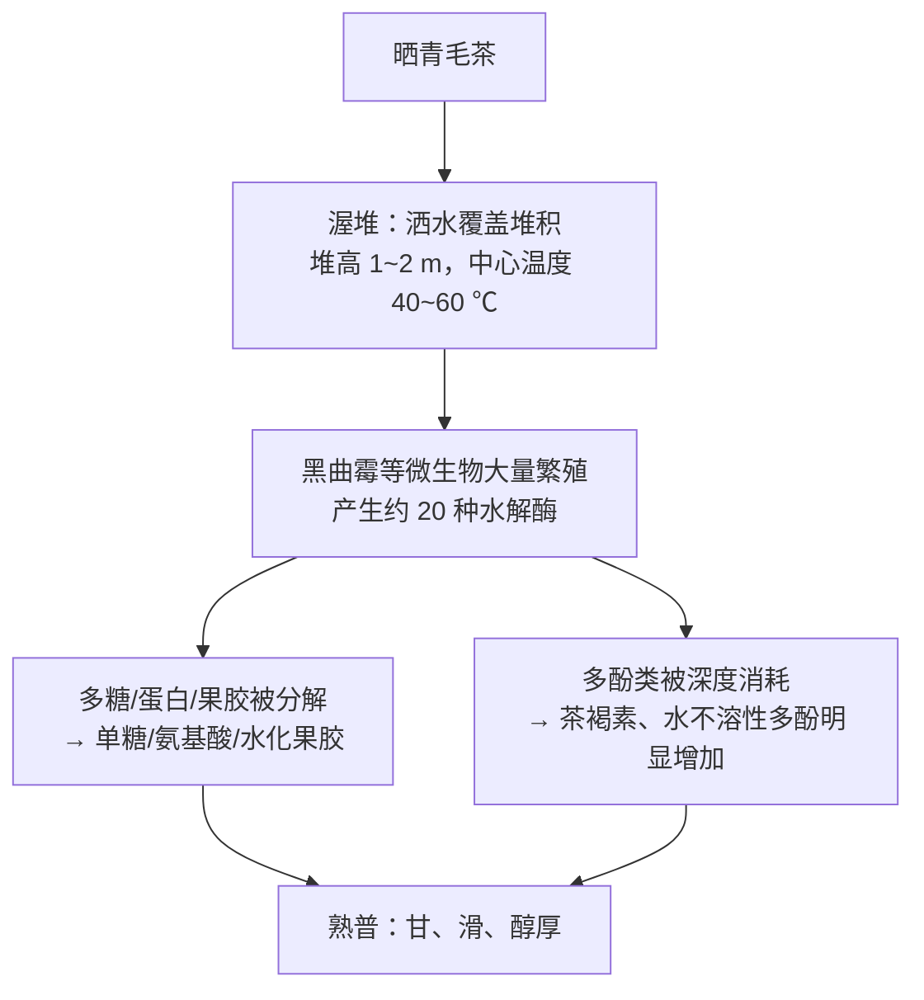
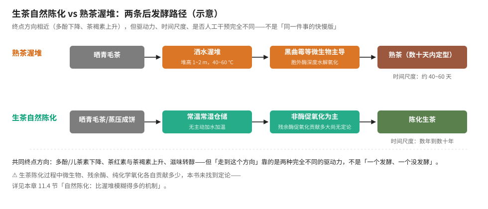

# 第 11 章 黑茶与普洱：微生物后发酵，渥堆熟茶 vs 自然陈化生茶

> 本章目标：讲透黑茶**唯一**依赖的转化主体——微生物，以及由此引出的两条
> 路径：熟茶的人工**渥堆**（快）与生茶的**自然陈化**（慢）。
>
> 第 4 章 4.9 节已经把渥堆的工艺概况、优势菌种、黑曲霉的水解酶体系讲过一遍，
> 第 5 章也已经指出"普洱生茶算不算黑茶"这个有争议的归类问题。
> 这一章要做的是：讲清两条路径在物质转化上具体差多少、把"越陈越香"这类
> 流传极广的说法按证据强度严格审视，以及六大茶类里黑茶内部差异为什么这么大。

## 11.1 黑茶为什么是"唯一真正的发酵"

回到第 4 章的框架：绿、白、黄、青、红五类茶的转化主体都是**茶叶自身的酶**
（或叠加湿热作用），只有黑茶的转化主体是**外来微生物及其胞外酶**——
这也是为什么第 4 章说"黑茶是六大茶类里唯一名副其实的'发酵'"
（茶行业早期把所有氧化都叫"发酵"是误称，第 4 章开篇已纠正过这个词）。

**这条链和红茶的氧化链条有本质区别**：红茶的茶黄素→茶红素→茶褐素是
**同一套底物（儿茶素）被同一类酶（多酚氧化酶）持续氧化**的结果；
黑茶渥堆则是**外来微生物引入了一整套新的酶系统**（胞内胞外水解酶、
氧化酶），把茶叶里几乎所有大分子物质都当作"食物"来分解——
这是第 4 章强调"主次关系"时说"微生物的参与起到了最为关键、不可替代的
作用"的原因：把微生物从这个系统里拿掉，渥堆根本无法发生。

## 11.2 黑茶内部差异极大：不是一种工艺，是一个类别

第 4 章已经用一张表说明"不同黑茶的优势菌不一样"——这件事值得在本章
展开，因为它直接决定了黑茶各品类风味差异的物质基础：

| 品类 | 优势菌 | 发酵方式特点 |
|------|--------|--------------|
| 茯砖、花砖、黑砖、青砖、沱茶、饼茶、紧茶 | **灰绿曲霉**占绝对优势 | — |
| 米砖 | **黑曲霉**占绝对优势 | — |
| 康砖、金尖、七子饼茶 | **青霉**占优势 | — |
| 六堡茶 | 青霉、灰绿曲霉及黑曲霉 | 传统"冷水渥堆"工艺 |

> 这是 1979 年浙江农业大学茶叶系对 5 省区 14 种压制茶的霉菌研究结果
> （第 4 章已引用），年代较早但结论至今仍被广泛引用。

### 茯砖茶的"金花"：唯一写进国标检测指标的菌种

茯砖茶有一道其他黑茶都没有的独特工序——**发花**：砖坯在适当温度（叶温
控制、含水量约 22%~25%）、湿度（发花初期与茂盛期约 75% 相对湿度）条件下
培养出**冠突散囊菌**（俗称"金花"），这是茯砖茶特有的优势菌，
整个发花过程一般持续 **15~20 天**。茯砖茶是**国标中唯一要求检测
"冠突散囊菌"这项指标**的黑茶品类。

传统上金花菌种主要依赖**环境自然接种**（历史上茯茶产地集中在陕西泾阳，
离开当地环境后金花密度明显降低），1958 年起逐步用烘房调控
温湿度实现机械化发花，近年研究团队（如湖南省茶业集团与湖南农业大学
合作团队）已把金花发花率提升到约 99.3%。

> ⚠️ **本书的处理**：冠突散囊菌被称为"益生菌"、能分泌多种酶类改善茶叶
> 风味，这是工艺与感官层面站得住的描述；但涉及到具体的**保健功效**
> （如"促进代谢""改善肠道"），本书按第 1 章"不做医疗建议"的原则，
> 只陈述其作为**风味物质转化媒介**的作用，不对健康功效做任何确定性陈述。

### 六堡茶的"农家传统工艺"与"现代工艺"：一个茶名下两种不同发酵路径

六堡茶内部还有一组值得专门指出的分野：**传统工艺**（又称农家茶，
延续 1958 年之前的"闷堆"方式，各家做法不一，被称为"一家一味，百家百味"，
发酵程度偏轻）与**现代工艺**（1958 年起定型的"冷水渥堆"，发酵程度更充分、
转化时间更短）。前者更接近晒青绿茶经轻度闷堆转化，后者是标准化的
人工渥堆工艺。六堡茶标志性的**槟榔香**，据国标定义为"贮存陈化后产生的
一种似槟榔的香气"，其形成**同时取决于原料、工艺和后期陈化**三个因素，
并非所有六堡茶都会出现——这提醒我们"某种茶一定有某种香气"这类描述
往往把**个别优质产品的特征当成了整个品类的必然属性**。

## 11.3 普洱茶：熟茶的渥堆与生茶的自然陈化

### GB/T 22111 怎么定义普洱茶

国标把普洱茶明确定义为：以**地理标志保护范围内**生长的**云南大叶种
晒青茶**为原料，并在**地理标志保护范围内**采用特定工艺加工而成的茶叶——
这意味着普洱茶的认定同时有**原料产地**和**加工产地**两重地理限制，
不是"云南大叶种晒青茶随便怎么加工都能叫普洱茶"。

国标把普洱茶分为两类：

| 类型 | 工艺 | 品质特征（国标表述） |
|------|------|----------------------|
| **普洱茶（生茶）** | 杀青 → 揉捻 → 日光干燥 → 蒸压成型 | 色泽墨绿、香气清纯持久、滋味浓厚回甘、汤色绿黄清亮、叶底肥厚黄绿 |
| **普洱茶（熟茶）** | 晒青毛茶 → **后发酵**（渥堆）→ 散茶或紧压茶 | 色泽红褐、汤色红浓明亮、香气陈香、滋味醇厚回甘、叶底红褐 |

> **回看第 5 章已经指出的张力**：按 GB/T 30766 的工艺逻辑，生茶（杀青→
> 揉捻→日光干燥）的工艺与晒青绿茶高度重合，**紧压只是形状**；
> 但 GB/T 22111 在产品标准层面把生茶直接纳入"普洱茶"名下。
> 第 5 章已把这个争议讲清楚、不替读者裁定——本章要做的是回到**机理**层面，
> 讲清楚生茶"放了很多年之后"到底发生了什么，这比纠结"它该叫什么"更有用。

### 熟茶渥堆：和第 4 章讲过的黑茶渥堆是同一件事

熟茶的渥堆工艺与第 4 章、本章 11.1 节讲的黑茶渥堆机理完全一致——
晒青毛茶洒水堆积、黑曲霉等微生物主导、多酚类剧烈下降、茶褐素明显增加。
**人工渥堆技术 1973 年由云南省茶叶公司组织昆明茶厂等单位技术人员
赴广州学习、结合本地气候条件改良（"冷水渥堆法"）后定型**，
1975 年前后正式批量投产，**公认 1973 年为"普洱熟茶元年"**。
这项技术的初衷很明确：**用人工方式把原本需要长期自然陈化才能达到的
转化效果，压缩到数十天内完成**。

> ⚠️ **本书未核到**渥堆具体天数的精确且来源一致的数字——不同资料给出
> 的渥堆周期（从出堆到定型）在"一个多月到两个多月"这个区间内，
> 具体因原料、气候、翻堆次数而异，正文只采信"数十天量级"这个方向。

### 生茶自然陈化：比渥堆模糊得多的机制

生茶（未渥堆的晒青毛茶紧压茶）在存放多年后，成分和感官特征会逐渐
从"接近晒青绿茶"向"接近普洱熟茶"的方向靠拢——这个过程被称为
**自然陈化**，机理上比渥堆复杂、也远没有渥堆研究得透彻。

**已有研究支持的转化方向**：

- **多酚类持续转化**：茶多酚在陈化过程中发生**氧化、聚合、缩合、水解**
  等一系列反应，儿茶素（EGCG、EGC、ECG、EC 等）含量随之下降；
- **没食子酸（GA）含量上升**：这是一条被多项研究独立观察到、机理也
  相对明确的变化——没食子酸的增加**可能来自两条途径**：
  一是儿茶素没食子酸酯（如 EGCG）在高温高湿条件下**直接水解**生成；
  二是微生物（渥堆研究中常提到曲霉等）分泌的**酯酶**把儿茶素没食子酸酯
  **加水分解**而来；
- **色素三件套继续演化**：儿茶素经氧化、缩合、降解，同样生成
  茶黄素、茶红素、茶褐素这一组色素，含量趋势上**茶红素、茶褐素增加，
  茶黄素相对减少**（与红茶储存中的趋势方向一致，第 10 章已讲过）；
- **香气物质定向变化**：有研究用气相色谱-质谱联用技术检测发现，
  具有"陈香"特征的物质（如雪松醇、雪松烯、β-愈创烯、α/β-紫罗酮、
  二氢猕猴桃内酯等）随陈化时间**显著增加**，而具有花香特征的物质
  （如芳樟醇、水杨酸甲酯、壬醛）则呈**降低**趋势——这是"陈香"
  这个感官描述目前能找到的、相对具体的物质基础。

**机理上仍然模糊、缺乏定论的部分**：

> ⚠️ **这是本章最需要诚实标注的地方**：生茶自然陈化过程中，
> ①**残余酶的酶促氧化**贡献多少、②**环境微生物**（茶饼表面及内部
> 并非完全无菌）贡献多少、③单纯的**非酶促化学氧化**（温度、湿度、
> 氧气驱动）贡献多少，这三者各自的权重**本书未找到有定论的研究**。
> 晒青毛茶因杀青温度较低（多在 80 ℃ 以下，第 4 章已讲）而保留部分
> 酶活性，这是生茶"可以长期转化"、区别于烘青/炒青绿茶的关键前提，
> 但"保留的这部分酶活性在数年陈化中到底还能起多大作用"，
> 以及"这个过程里微生物参与的实际程度"，都缺乏系统的定量研究—
> —这也是本章图示里特意把生茶陈化的驱动力标注为"非酶促氧化为主，
> 残余酶促氧化贡献多大尚无定论"的原因。

## 11.4 仓储：干仓、湿仓，一组缺乏统一标准的术语

普洱茶圈常说的"干仓""湿仓"，描述的是存放环境的湿度差异——
**干仓**通常指相对湿度较低（不同资料给出 20%~35%，或"低于 75%"等
不同界限）的存放环境，起源于云南本地气候干燥的存茶方式；
**湿仓**通常指相对湿度较高（70%~80%，或"85% 以上"等不同界限）的
存放环境，最初在香港地区流行（故也称"港仓"），后经茶叶贸易扩散到
广东等地。

> ⚠️ **本书的处理**：干仓与湿仓的**具体湿度界限，不同资料给出的数字
> 互相不一致**（低湿界限从 20% 到 35% 不等，高湿界限从 70% 到 85% 不等），
> 这不是哪个资料错了，而是说明**"干仓""湿仓"从一开始就不是一组有统一
> 量化定义的技术术语**，而是业界在实践中逐渐形成的**相对性描述**——
> 有研究者就直接指出这组概念"具有很强的地域相对性，缺乏统一客观标准"
> （例如同一款茶，在香港存茶人眼中是"尚未转化到位"，在西北干燥地区
> 茶友眼中却已经是"湿仓茶"）。本书不采信任何一组具体湿度数字作为
> "干仓/湿仓"的标准定义，只讲这组概念描述的**方向**（湿度越高、
> 转化相关的物质变化通常越快，但品质风险——发霉变质——也相应越高）。

**一个容易被忽略的逻辑问题**：市面上存在"纯干仓"的说法，
但普洱茶（无论生茶还是熟茶）的后续转化**本来就需要水分参与**——
完全没有湿度参与的"纯干"环境理论上无法支持任何转化，
这正是本章 11.3 节反复强调的——**转化需要水，但水多了又有风险**，
这个矛盾本身就是仓储这件事的核心难点，不存在"越干越好"或
"越湿越好"的简单答案。

## 11.5 黑茶与食品安全：黄曲霉毒素争议的来龙去脉

普洱茶"是否含黄曲霉毒素""是否致癌"是近十几年反复出现的争议话题，
值得按证据强度仔细梳理一遍，因为这正是本书"凡传说必辨析"原则
最该发挥作用的地方。

**争议的起源**：2010 年前后，有检测机构报告部分市售普洱茶样品中
检出黄曲霉毒素，由此引出"普洱茶致癌"的说法并广泛传播。

**关键的技术性反驳**：后续研究发现，早期一些检测方法（如某些高效
液相色谱法及改良法）会被**茶叶中的多酚类物质干扰**，对完全不含
黄曲霉毒素的纯茶多酚氧化产物、新鲜茶叶、玉米粉、黄豆粉等样品
都"检出"假阳性结果；而用**串联质谱法**复核，这些样品均未检出
黄曲霉毒素——这说明部分早期争议性报道，很可能是**检测方法的
局限性**导致的假阳性。

**大规模官方监测数据**：云南省相关部门 2013~2017 年连续对 119 个
普洱茶样品（含熟茶、生茶及其他类型）按国家食品污染物风险监测
标准方法检测黄曲霉毒素 B1，**全部样品均未检出**。

**机理层面的解释**：渥堆发酵的温度和营养基质条件本身就**不利于
黄曲霉生长**——黄曲霉偏好较高脂肪、蛋白质含量的基质，而茶叶
脂肪蛋白含量很低；同时第 4 章已经讲过渥堆优势菌**黑曲霉能够
抑制黄曲霉生长、并能一定程度降解黄曲霉毒素**。此前检出阳性结果
的样品，多指向**劣质、廉价、仓储环境不规范（尤其是潮湿仓储）**
的产品，而非正规工艺、正规仓储的普洱茶。

> **本书的判定**：把"普洱茶（正规工艺、正规仓储）含有危险水平的
> 黄曲霉毒素"当作普遍事实，证据强度是**缺乏证据、且与多项官方
> 监测数据相悖**；但"仓储环境不规范（尤其潮湿劣质仓储）的茶叶
> 存在霉变和毒素污染风险"是合理且有共识的提醒，**这不是普洱茶
> 独有的问题，是所有食品储存不当都会面临的通用风险**。

## 11.6 "越陈越香"：一句话，三种不同的证据状态

这是普洱茶圈流传最广、争议也最大的一句话，值得专门拆开看——
因为"越陈越香"实际上包含了**至少三个可以分开审视的子命题**，
它们的证据强度完全不同。

### 子命题一：存放过程中成分确实在变化——✅ 有共识

11.3 节已经列出多项研究支持的具体转化（没食子酸上升、儿茶素下降、
色素组成变化、陈香特征挥发物增加）。**这部分是可测量、可重复验证的**，
证据强度高。

### 子命题二："越陈"就一定"越香/越好"——❌ 缺乏证据、且逻辑上站不住

"成分在变化"不等于"变化的方向永远是朝着更好"。第 4、10 章反复强调的
"氧化链条单向推进、过度不是更浓是更淡"这条规律，在黑茶与普洱陈化上
同样适用——没有任何机理支持"转化可以无限持续、品质只会单调上升"，
茶褐素、非挥发性聚合物过度积累同样会导致滋味**滞钝、寡淡**，
仓储环境不当还会直接导致**霉变**（这是明确的品质劣变而非"陈化"）。
一个值得注意的事实是：这句话具体的**提出与推广时间点相对明确**
（2004 年前后，台湾茶人邓时海《普洱茶》一书与云南农大学者周红杰
《云南普洱茶》一书的出版，对这个概念的系统化、通俗化传播起到了
关键作用），**不是自古流传的定论**，而连提出者本人后来也澄清过：
"站在科学角度茶肯定不可能越陈越香，站在艺术层面它又确实存在"
——这个表态本身就说明"越陈越香"更接近一种**审美/市场叙事**，
而非一个有严格科学定论支撑的命题。

### 子命题三：具体多少年、什么条件下"最佳"——❌ 明确缺乏数据

目前没有任何系统研究能回答"陈化多少年品质达到峰值"这个问题——
不同原料、工艺、仓储条件下答案显然不同，而且**没有发表的长期
对照实验**能够给出确定答案。市面上流传的"十年""二十年""存放
越久越贵"等说法，**缺乏实验数据支撑**，更接近收藏品市场的
定价叙事，而非茶叶科学的结论。

> **本书的处理**：把"越陈越香"拆成三句话分别判定，
> 而不是笼统地说它"对"或"错"——这正是 CLAUDE.md 查证纪律
> "区分机理与说法、不含糊其辞"原则最典型的应用场景。

## 11.7 山头、年份：炒作与真实工艺差异如何区分

"山头茶"（如老班章、冰岛等）的价格在 2009 年前后开始快速攀升，
部分品类十余年间涨幅达到数百倍甚至上千倍。这其中既有**真实的
原料差异**（不同产区、不同树龄茶树的鲜叶成分确实存在差异，
第 2 章已讲过"山场"这类概念背后对应的是多个已知变量的组合），
也有**明确的市场炒作成分**（茶商互相抬价、资本控制茶山与茶厂、
在单一山头内部继续细分出"金班章""银班章"等概念层层加价）。

> ⚠️ **本书的态度**：区分"某产区的茶树确有其独特的成分/风味特征"
> （这是可以用机理解释、值得研究的事实）和"某山头的茶就应该值
> 这个价格、年年必涨"（这是市场行为和价格叙事，不是茶叶科学问题）
> 是两件完全不同的事。本书**不对任何具体山头、年份普洱的价格、
> 投资价值做任何判断**——这类内容超出"系统学茶"的范畴，
> 读者需要辨别时，应该区分"工艺与产地带来的真实品质差异"
> 和"被资本与概念包装放大的价格叙事"这两件事。

## 11.8 常见说法辨析

| 说法 | 判定 | 说明 |
|------|------|------|
| "黑茶都是一样的，渥堆就是渥堆" | **❌ 错误** | 不同黑茶优势菌不同（灰绿曲霉/黑曲霉/青霉），茯砖茶独有"发花"培养冠突散囊菌，六堡茶有传统闷堆与现代冷水渥堆之分，"黑茶"是工艺类别，内部差异极大（11.2 节） |
| "普洱生茶就是没发酵的普洱茶" | **⚠️ 不准确** | 生茶新制时确实接近晒青绿茶（未经微生物渥堆），但多年存放后会经历自然陈化这条独立的转化路径，不是简单的"没发酵"，归类本身学界也有争议（第 5 章已讲，第 11.3 节详述） |
| "普洱茶都含黄曲霉毒素，不能喝" | **❌ 错误** | 大规模官方监测（119 个样品）均未检出，部分早期争议报道源于检测方法受多酚干扰产生假阳性，渥堆环境和优势菌本身也不利于黄曲霉生长（11.5 节） |
| "越陈越香，存得越久越好" | **⚠️ 需要拆开看** | 成分确实在变化（✅ 有共识）；但"越陈一定越好"缺乏证据支持，且与氧化链条单向推进、过度转化导致滞钝的机理相悖（❌）；具体最佳年份更是缺乏数据（❌）。见 11.6 节完整拆解 |
| "纯干仓存放的普洱茶品质一定更好" | **⚠️ 有争议** | 干仓/湿仓本身缺乏统一量化标准，具有很强的地域相对性；且转化本来就需要一定水分参与，"越干越好"本身逻辑上存疑（11.4 节） |
| "老班章、冰岛这些山头茶贵是因为茶叶品质真的那么好" | **⚠️ 需要拆开看** | 不同产区茶树成分确有差异（这部分有机理支持）；但价格在 2009 年后的暴涨幅度（数百倍甚至上千倍）有明确的资本炒作、概念包装证据，不能把价格完全等同于品质差异（11.7 节） |
| "六堡茶一定有槟榔香，没有就是假的/次品" | **❌ 错误** | 国标定义槟榔香为"贮存陈化后产生的"，其形成同时取决于原料、工艺、后期陈化三个因素，并非所有六堡茶都会出现，不能作为真伪判断的唯一标准（11.2 节） |

## 11.9 思考题

1. 第 4 章说黑茶是"唯一真正的发酵"。结合本章 11.1 节，解释黑茶渥堆的转化链条和红茶的氧化链条（儿茶素→TF→TR→TB）在"谁是转化主体"这件事上有什么本质不同。
2. 为什么说"黑茶"是一个工艺类别，不是一种微生物过程？请用茯砖茶、六堡茶、米砖茶的优势菌差异具体说明。
3. GB/T 30766 的工艺逻辑和 GB/T 22111 的产品标准，对普洱生茶的归类给出了不同的答案。结合第 5 章已有的讨论和本章 11.3 节，说明为什么这个争议不容易靠"查更权威的标准"来解决。
4. 本章 11.3 节说生茶自然陈化"比渥堆模糊得多"。请列举哪些转化方向是有研究支持的（✅），哪些机制的具体贡献比例是缺乏定论的（⚠️），并说明为什么不能把两类内容混为一谈。
5. "越陈越香"这句话被拆成了三个子命题分别判定。请说明这三个子命题各自的证据强度，并解释"成分确实在变化"和"变化的方向一定是越来越好"为什么是两件不同的事。
6. 普洱茶黄曲霉毒素争议中，早期部分检测结果为什么会出现假阳性？这个案例对我们判断"某种食品被检出有害物质"这类新闻报道，有什么方法论上的启发？
7. （进阶）"干仓""湿仓"这组术语被本书认定为"缺乏统一量化标准"。请结合第 7 章白茶萎凋"七/八/九成干"、第 8 章闷黄"湿坯/干坯"这两组同样依赖经验判断的概念，比较它们和"干仓/湿仓"在"经验描述的可靠性"上有什么相同和不同。

> 📖 **参考答案**（想清楚再看）：[Q1](../../qa/11-dark-tea-qa.md#q1) ·
> [Q2](../../qa/11-dark-tea-qa.md#q2) · [Q3](../../qa/11-dark-tea-qa.md#q3) ·
> [Q4](../../qa/11-dark-tea-qa.md#q4) · [Q5](../../qa/11-dark-tea-qa.md#q5) ·
> [Q6](../../qa/11-dark-tea-qa.md#q6) · [Q7](../../qa/11-dark-tea-qa.md#q7)

## 11.10 本章实操

### 🅐 无器具版：区分"工艺事实"与"市场叙事"

找三条关于黑茶/普洱茶的网络说法（可以是购物页面文案、社交媒体帖子、
茶叶论坛发言），填表：

| 说法原文 | 这是工艺/机理陈述，还是市场/收藏叙事？ | 本章能否找到对应证据？ | 证据强度判定 |
|----------|----------------------------------------|------------------------|--------------|
| | | | |
| | | | |
| | | | |

**要点**：凡是涉及"越陈越值钱""某年份必涨""喝了能如何如何"的，
大概率是市场或健康叙事，需要单独核查，不能当作工艺结论直接采信；
凡是涉及"某工序如何改变了什么成分"的，可以对照本章或前面章节找证据。

### 🅐 无器具版加餐：给黑茶缺陷找原因

下面是两条审评/消费场景描述，请判断最可能的成因：

1. "一款熟茶，汤色浑浊发黑，带明显霉味和仓味，叶底糊烂。"
2. "一款存放多年的生茶饼，表面出现白色霜状物，饼身受潮松散。"

（答案见[答案册](../../qa/11-dark-tea-qa.md#practice)。）

### 🅑 有条件版：熟茶 vs 陈化生茶对照冲泡（备齐后再做）

**所需**：一款熟茶（渥堆）与一款有一定年份的生茶（自然陈化，年份越明确
越好）；盖碗或审评杯；秤；[冲泡记录表](../../forms/brewing-log.md)。

| 变量 | 熟茶 | 陈化生茶 |
|------|------|----------|
| 投茶量 / 水量 / 水温 / 时间 | 5 g / 110 mL / 100 ℃ / 第一泡洗茶后 10~15 s（**完全相同**） | 同左 |

| 观察项 | 熟茶 | 陈化生茶 | 是否符合本章预测？ |
|--------|------|----------|---------------------|
| 汤色（红浓/橙红/栗红等） | | | |
| 是否有陈香（木香/药香） | | | |
| 涩感强弱 | | | |
| 滋味是否醇厚顺滑 | | | |
| 叶底颜色与活力 | | | |

**预期**：熟茶因渥堆转化更彻底，汤色更红浓、涩感更弱、滋味更"甘滑醇厚"；
陈化生茶如果年份足够，也会呈现一定的陈香和醇厚感，但通常仍保留部分
苦涩底蕴，与全新生茶相比已有明显转化。**如果感受和预测不符**，
先核实两款茶各自的具体年份、仓储条件，而不是直接否定本章的机理——
仓储条件差异对结果的影响，往往比"陈化时间长短"本身更大。

## 11.11 本章主要参考

| 本章的哪个结论 | 来源 |
|----------------|------|
| 黑茶渥堆机理、优势菌种、黑曲霉水解酶体系、不同黑茶优势菌差异 | 第 4 章 4.9 节已核来源：[渥堆（维基百科）](https://zh.wikipedia.org/zh-hans/%E6%B8%A5%E5%A0%86)；[微生物多样性与普洱茶品质关系研究进展，《广东农业科学》](https://gdnykx.gdaas.cn/cn/article/pdf/preview/20142204.pdf) |
| 茯砖茶"发花"工艺、冠突散囊菌、含水率/湿度参数、发花周期 15~20 天 | 多份行业与科普资料交叉对照（含湖南省茶业集团、湖南农业大学团队发花率提升至 99.3% 的研究转述） |
| 六堡茶传统/现代工艺区别、1958 年冷水渥堆工艺定型、槟榔香的国标定义与形成条件 | 多份非遗与行业资料交叉对照 |
| GB/T 22111 普洱茶定义、生茶/熟茶工艺与品质特征、地理标志双重限定 | GB/T 22111-2008《地理标志产品 普洱茶》标准信息（见[国标与文献索引](../../standards.md)） |
| 普洱熟茶渥堆技术历史（1973 年昆明茶厂赴广州学习、"冷水渥堆法"改良、1975 年定型批量生产） | 多份行业史料交叉对照 |
| 普洱生茶陈化中没食子酸上升机制（儿茶素水解/微生物酯酶作用）、儿茶素持续下降、色素三件套演化方向 | 《普洱茶后发酵过程中多酚类成分生物转化的研究进展》，《食品科学》相关综述资料 |
| 陈香特征挥发物（雪松醇等）随陈化增加、花香特征物质（芳樟醇等）降低 | GC-MS 相关研究资料交叉转引 |
| 干仓/湿仓概念缺乏统一量化标准、地域相对性、2002 年周红杰等论文引入干湿仓概念 | 多份行业与学术资料交叉对照 |
| 黄曲霉毒素争议：早期检测方法受多酚干扰产生假阳性、云南省 2013~2017 年 119 样本官方监测全部未检出、黑曲霉抑制黄曲霉机制 | 云南农业大学相关验证研究、云南省食品安全风险监测数据、[普洱茶中是否有黄曲霉素和黄曲霉（界面新闻，引云南农大李亚莉团队）](https://www.jiemian.com/article/1375523.html)（第 4 章已引用同一来源） |
| "越陈越香"概念 2004 年前后由邓时海《普洱茶》、周红杰《云南普洱茶》系统化传播、邓时海本人后续澄清表态 | 多份普洱茶文化史资料交叉对照 |
| 老班章/冰岛山头茶价格暴涨数据与资本炒作证据链 | 多份财经与行业调查报道交叉对照（界面新闻、中证网、中新网等） |
| GB/T 32719 黑茶系列、GB/T 9833 紧压茶系列分部分构成 | GB/T 32719.1~.5、GB/T 9833.1~.9 标准信息（见[国标与文献索引](../../standards.md)） |

> **⚠️ 本章标注为存疑的内容**：
> ① 熟茶渥堆的精确天数——不同资料给出的区间在"一个多月到两个多月"不等，
> 仅采信"数十天量级"这个方向；
> ② 生茶自然陈化中残余酶促氧化、环境微生物、纯化学氧化三者各自的贡献比例——
> 未找到有定论的研究，本章明确标注为开放问题；
> ③ 干仓/湿仓的具体湿度界限——不同资料数字互相矛盾，不采信任何单一标准；
> ④ "越陈越香"的"最佳年份"——缺乏系统长期对照实验数据，不采信任何具体年份说法；
> ⑤ 山头茶的品质与价格关系——本书只呈现炒作的证据链，不对任何具体山头的
> 品质或投资价值做判断。
