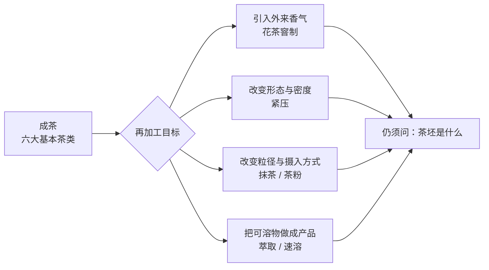
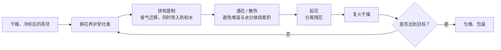

# 第 12 章 再加工茶：在成茶上再做一道工艺，改变香气、形态与饮用方式

> **本章问题**：茉莉花茶到底算绿茶还是花茶？茶饼压紧后为什么不等于“越陈越好”？
> 抹茶和把绿茶打成粉有什么边界？

前六类茶是在鲜叶阶段分出的：鲜叶经历哪一条工艺路径，决定它是绿、白、黄、乌龙、红还是黑茶。
**再加工茶**则从已经制成的茶叶出发，再增加一道目标明确的加工。GB/T 30766 对它的定义很简洁：
以茶叶为原料、采用特定工艺加工、供人饮用或食用的产品。[^classification]

这意味着再加工不是“第七种发酵”，也不自动代表品质更高；它解决的是另一类问题：把香气引入茶坯、改变运输与冲泡的形态，或把茶从“浸泡后弃叶”变成“连叶食用/饮用”。

## 12.1 先拆开两条信息：茶坯是什么，后来又做了什么

“茉莉绿茶”“紧压白茶”“抹茶”“速溶红茶”这些名称常把两层信息叠在一起。读包装或听介绍时，先拆成：

| 要问的层次 | 例子 | 它回答什么 |
|------------|------|------------|
| **茶坯 / 基础茶类** | 绿茶、白茶、乌龙茶、红茶 | 鲜叶阶段经历了什么决定性工艺，留下怎样的成分底子？ |
| **再加工动作** | 窨制、紧压、研磨、萃取 | 后来加入或改变了什么？目标是香气、形态，还是饮用方式？ |
| **最终产品** | 茉莉花茶、茶饼、抹茶、速溶茶 | 消费者实际拿到的是什么样的产品？ |

因此，“茉莉花茶算不算绿茶”不能只答“是”或“不是”。按最终产品分类，它是**花茶/再加工茶**；但它的茶坯常为绿茶，茶汤的苦涩、鲜爽和基础香气仍强烈受这层茶坯制约。把“产品分类”和“茶坯来源”混成一句话，是许多争论的起点。

## 12.2 花茶：不是把干花混进去，而是让茶坯经历一次受控的香气交换

花茶的核心动作叫[窨制](../../glossary.md#scenting)：让茶坯与能吐香的鲜花在合适条件下接触，再处理接触带来的水分与热量。以茉莉花茶为例，GB/T 22292 是现行产品标准；它不是“茶叶里看得见茉莉花越多越好”的标准。[^jasmine-standard]

### 一次窨制在做什么

工艺名称因产区和企业而异，但其逻辑可概括为：

这里最重要的不是背工序名，而是理解其中的矛盾：**花朵释放香气的条件，也会把水分和热带给茶坯；茶坯吸香后又必须恢复到稳定的干燥状态。** 所以“窨得更久/花放得更多”不是无代价的升级。水分散不出去，茶坯容易出现闷味、香气不鲜灵，储存稳定性也会变差。

研究者用 GC-MS 分析茉莉花茶与绿茶，确实找到了能区分二者的一组挥发物，如芳樟醇、乙酸苄酯、邻氨基苯甲酸甲酯、吲哚等；这说明“花香”并不只是主观联想，而有可测的化学基础。[^jasmine-aroma] 但这不等于可以用某一个化合物或“香得冲不冲”单独给花茶评级：茶坯本身、鲜花状态、窨制次数和复火都在共同塑造结果。

### “有花”与“窨花”不是一回事

有些产品把可食用花、香料、果粒与茶叶直接拼配；有些产品以鲜花窨制，成品再把花筛走；还有产品使用食用香精。它们的风味可以都很讨喜，但**工艺和标签信息不是同一件事**。

对消费者最实用的判断不是盯着“成品里有没有花瓣”，而是看配料表和执行标准，确认它写的是花茶、调味茶还是复合茶制品。香气强不自动说明窨制次数多，更不能凭肉眼判断是否添加香精；后者需要针对性检测，不能以“我闻起来像/不像”替代证据。

## 12.3 紧压茶：压的是形态，不会把茶压成另一个茶类

[紧压茶](../../glossary.md#compressed-tea)通常把筛分、拼配后的茶，经过汽蒸软化、压制成型、干燥，做成饼、砖、沱等形状。监管抽检细则也按这条工艺链描述紧压茶。[^compressed]

它最初解决的是体积、运输、储存和规格统一的问题；今天还会带来取茶、包装、陈化管理等使用差异。但**紧压是物理成型工艺**：一块饼茶在压制前是什么茶，压制后仍应追问其原料和基础加工路径，而不是把“饼”当成茶类。

| 观察到的事实 | 合理解释 | 不能直接推出的结论 |
|--------------|----------|----------------------|
| 同一原料压成紧压茶后，撬取和冲泡速度会受紧实度影响 | 水进入茶块内部的路径、解块程度改变 | “压得越紧一定越耐泡/越好” |
| 紧压茶常被用于需要存放的产品 | 形态便于流通和管理；原料与后续环境也很重要 | “只要压成饼就会越放越好” |
| 表里颜色、松紧或压纹不同 | 原料、压制和存放均可能参与 | 单凭外观就能断定年份或仓储好坏 |

第 11 章已经说明，某些黑茶和普洱的后续转化存在，但转化方向、速度和安全边界取决于原料、工艺和仓储。**压制既不是陈化的充分条件，也不是品质的证据。**

## 12.4 抹茶：重点不是“粉”，而是原料路线与整叶摄入

[抹茶](../../glossary.md#matcha)不是所有绿色粉末的统称。GB/T 34778 对其定义包含三个关键限制：覆盖栽培的鲜叶、蒸汽或热风杀青并干燥形成的叶片原料、再经研磨制成微粉。[^matcha-standard]

这条定义解释了它与普通“绿茶粉”的两个边界：

1. **原料路线不同**：抹茶对应覆盖栽培与特定的杀青、干燥路线；随手把一款炒青绿茶粉碎，不能因为颜色绿就自动等同于抹茶。
2. **摄入方式不同**：常规泡茶主要喝从叶片溶出的成分；抹茶悬浮于水中饮用，细粉与叶片不溶性组分也一同进入。这会改变口感、沉降行为和实际摄入的物质组成，却不等于“营养或健康效果必然更强”。

覆盖栽培为什么重要，第 2 章已经讲过：降低光照会改变叶绿素、氨基酸和多酚的相对格局。把抹茶说成“绿茶磨成粉”只说对了最后一步，漏掉了决定风味底子的原料和前段工艺。

## 12.5 萃取茶、速溶茶与调饮基底：把“泡茶”前移到工厂

[萃取茶 / 速溶茶](../../glossary.md#instant-tea)的基本思路不是把干茶磨碎，而是先用水从茶叶中浸提出可溶物，再经过过滤、澄清、浓缩与干燥等步骤，做成可复溶的产品。茶饮料也是类似地把萃取、稳定和包装前移，只是最终保留为液体。[^instant-tea]

这条路线的工程难点，恰好对应日常体验：茶汤一旦经加热、浓缩、冷却和长期储存，就要处理浑浊/沉淀、香气损失和“闷熟味”。这些不是“工业茶一定差”的证据，而是产品设计必须解决的稳定性问题；反过来，现泡叶茶的香气也不天然胜过所有萃取制品——两者在追求不同目标。

调饮基底还常涉及拼配：用不同茶坯把浓度、涩感、香气和成本调到目标区间。**拼配不等于掺假**；是否合规要看原料、标签和对应食品标准，不能仅以“不是单一产地/单一品种”作判断。

## 12.6 常见说法辨析

| 说法 | 判定 | 说明 |
|------|------|------|
| “茉莉花茶就是绿茶” | **⚠️ 只说了一半** | 终产品按分类是花茶/再加工茶；其常用茶坯确实为绿茶。应把“产品分类”与“茶坯来源”分开说（12.1、12.2 节）。 |
| “杯里花瓣越多，花茶越好” | **❌ 错误** | 窨制花茶的残花可被分离；成品花量不能代替对茶坯、香气鲜灵度和滋味协调性的审评。 |
| “紧压茶压得越紧，陈化越好” | **❌ 缺乏证据** | 紧压改变形态与冲泡路径；陈化还受原料、工艺、仓储共同制约，不能把压制程度当作单一因果。 |
| “抹茶就是任何绿茶磨成的粉” | **❌ 错误** | GB/T 34778 对原料栽培、杀青/干燥路线和研磨均有定义要求；一般绿茶粉与抹茶不是同义词。 |
| “速溶茶没有茶叶成分” | **❌ 错误** | 速溶茶是先萃取茶叶可溶物再制成可复溶产品；它和整叶冲泡的成分比例、香气与口感不同，不是“完全没有茶”。 |

## 12.7 思考题

1. 为什么说“茉莉花茶算不算绿茶”不是一个能只用“是/否”回答的问题？请用“茶坯”和“最终产品”两层信息作答。
2. 窨制为什么不能理解为“茶叶吸香，时间越长越好”？请说明鲜花同时带来的两个工艺变量，以及相应的控制动作。
3. 一块紧压白茶和散装白茶，哪些信息可能因紧压而改变，哪些信息不会因紧压本身而改变？
4. 请用“原料路线”和“摄入方式”两条线，分别说明抹茶与一般绿茶粉的边界。
5. 速溶茶与茶粉在“原料先经历了什么”上有什么本质区别？这会如何影响它们与现泡叶茶的比较方式？

> 📖 **参考答案**（想清楚再看）：[Q1](../../qa/12-reprocessed-tea-qa.md#q1) ·
> [Q2](../../qa/12-reprocessed-tea-qa.md#q2) · [Q3](../../qa/12-reprocessed-tea-qa.md#q3) ·
> [Q4](../../qa/12-reprocessed-tea-qa.md#q4) · [Q5](../../qa/12-reprocessed-tea-qa.md#q5)

## 12.8 本章实操

### 🅐 无器具版：拆一张包装上的“茶的身份”

找家中或电商页面上的两款再加工茶（如花茶、茶包、茶饼、抹茶粉、速溶茶），只依据包装可见信息填写：

| 产品 | 最终产品类型 | 能确认的茶坯 / 原料 | 再加工动作 | 还缺哪条关键信息？ |
|------|--------------|---------------------|------------|--------------------|
| | | | | |
| | | | | |

**检查问题**：名称里的“花”“饼”“粉”“速溶”告诉你的主要是茶坯，还是后来采取的加工动作？如果配料表无法确认，就在最后一栏明确写“无法确认”，不要脑补。

### 🅑 有条件版：比较“浸出液”与“连叶摄入”（备齐后再做）

**所需**：一款标示清楚的抹茶；一款绿茶；透明杯或盖碗；电子秤；温度计；[冲泡记录表](../../forms/brewing-log.md)。

> 安全提醒：按各产品包装的食用建议操作；若对咖啡因敏感、孕哺期或正服用药物，不把本练习当成健康建议。

| 对照项 | 抹茶 | 绿茶浸泡液 |
|--------|------|------------|
| 实际进入杯中的物质 | 粉末悬浮，饮用时连细粉一同摄入 | 主要是水浸出的可溶物，茶叶留在器中 |
| 静置后的外观 | 记录沉降、挂壁与颜色 | 记录是否澄清、叶片舒展情况 |
| 香气与滋味 | 记录鲜爽、颗粒感、苦涩 | 记录鲜爽、苦涩与回甘 |
| 不要据此断言 | “哪一种更健康” | “哪一种绝对更高级” |

**要点**：这个实验只让你感受“同为茶，载体和摄入方式不同”会怎样改变体验；它不能比较两种产品的健康效果，也不能控制品种、遮阴、杀青方式与投茶量等全部变量。

## 12.9 本章主要参考

| 本章的哪个结论 | 来源 |
|----------------|------|
| 再加工茶的定义、分类以加工工艺与产品特性为主 | [GB/T 30766-2014《茶叶分类》公开文本](https://img.antpedia.com/standard/files/pdfs_ora/CN-GB/c99/GB_T%2030766-2014_9507.pdf)；标准状态以[国家标准信息平台](https://openstd.samr.gov.cn/bzgk/std/newGbInfo?hcno=615F74395B8A284A4CE11040FB0AE80C)为准 |
| 茉莉花茶标准现行状态 | [GB/T 22292-2017《茉莉花茶》国家标准信息](https://openstd.samr.gov.cn/bzgk/std/newGbInfo?hcno=82002D9C6A164CDC8865DCCE5561E814) |
| 茉莉花茶窨制及特征香气物质 | [An 等，《茶叶科学》：茉莉花茶特征香气成分研究](https://www.tea-science.com/EN/10.13305/j.cnki.jts.2020.02.009)；[Ye 等，《茶叶科学》：窨制工艺对香气成分的影响](https://www.tea-science.com/EN/10.13305/j.cnki.jts.2006.01.011) |
| 紧压茶的抽检产品定义与工艺链 | [市场监管部门茶叶监督抽检细则](https://scjgj.cq.gov.cn/zz/bnq/zwgk/fdzdgknr_146781/jdjc_146793/spyp/jcjh/202311/W020231123556489714936.pdf) |
| 抹茶标准的状态与定义 | [GB/T 34778-2017《抹茶》国家标准信息](https://std.samr.gov.cn/gb/search/gbDetailed?id=71F772D82095D3A7E05397BE0A0AB82A)；[国家标准编制说明（列明现行产品标准）](https://std.samr.gov.cn/dcpspTools/gbPlan/download?path=%2Fzxd%2F2023002742%2F20_%E6%A0%87%E5%87%86%E8%B5%B7%E8%8D%89%2F20_DI_2023002742_%E6%8A%B9%E8%8C%B6%E7%94%9F%E4%BA%A7%E5%8A%A0%E5%B7%A5%E6%8A%80%E6%9C%AF%E8%A7%84%E7%A8%8B.pdf) |
| 萃取茶/茶饮料加工中的浑浊、沉淀与香气保持问题 | [尹军峰、林智，《茶叶科学》：国内外茶饮料加工技术研究进展](https://www.tea-science.com/CN/10.13305/j.cnki.jts.2002.01.002) |

[^classification]: GB/T 30766 的原文定义见本章主要参考。该标准以“再加工茶”覆盖的产品类型很广，本章只选择与后续学习直接相关的花茶、紧压、粉末/萃取路线展开。
[^jasmine-standard]: 标准编号、完整名称与版本登记见[国标与文献索引](../../standards.md)。
[^jasmine-aroma]: 这些是研究样品中识别出的特征挥发物，并非每一款花茶都必须有完全相同的组成或比例。
[^compressed]: 紧压茶产品还有 GB/T 9833 系列等具体标准；本章只讨论其共通的成型逻辑。
[^matcha-standard]: 标准正文与版本信息应以现行文本为准；本章不引入未经统一验证的遮阴天数、粒径等具体数值。
[^instant-tea]: 本节讨论的是工艺逻辑；不同产品是否另含糖、乳、香精或其他配料，应以包装配料表为准。
