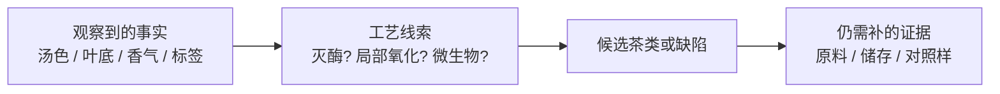

# 🛠 项目 P1 · 从工艺特征反推茶类与工艺缺陷

> **任务**：把第二部分的知识用于“从结果倒推过程”。
> 你不需要猜具体名茶，也不需要购买样品；你要交付的是一份有证据链的分类/缺陷判断，
> 并能诚实写出哪些信息不足以判断。

## P1.1 方法：每个判断必须分成三格



不要从“名字像不像”跳到结论。一个合格判断至少包括：**观察**（事实）、**推断**（候选）、
**不确定性**（还缺什么）。

## P1.2 🅐 无器具版：四张工艺侦探卡

对每张卡完成下表。答案在文末答案册；请先自己写。

### 卡 A

干茶翠绿，冲泡后汤色黄绿明亮，叶底嫩绿；香气清鲜但带明显青草气，入口鲜而涩，
第二泡后仍有生青味。

### 卡 B

条索乌褐，叶缘泛红、叶片中央仍偏绿；香气有花香和轻微焙火香，滋味醇厚回甘。

### 卡 C

汤色红浓但欠亮，香气低闷，入口不苦却发木、滋味平；叶底颜色暗褐，碎末较多。

### 卡 D

干茶带鲜灵花香，冲泡后花香清楚但叶底与茶汤仍有明显绿茶鲜爽；包装标示“茉莉花茶”。

| 卡片 | 观察事实（至少 3 条） | 最可能茶类/产品 | 推断的工艺线索 | 还缺什么才能更确定？ |
|------|------------------------|----------------|----------------|----------------------|
| A | | | | |
| B | | | | |
| C | | | | |
| D | | | | |

### 卡片加餐：把“缺陷”与“风格”分开

选 A、B、C 任意一张，分别写：

1. 哪个描述是**可能的工艺缺陷线索**？
2. 哪个描述可能只是**风格/原料差异**，不能单独判缺陷？
3. 你会追加观察哪一项来区分两者？

## P1.3 🅐 无器具版：读一张真实包装，不替营销文案补证据

找一张茶叶包装或电商详情页，填写：

| 原文信息 | 属于观察、可核对事实，还是营销说法？ | 能反推什么工艺？ | **不能**反推什么？ |
|----------|---------------------------------------|------------------|--------------------|
| 产品名称 | | | |
| 配料表 / 执行标准 | | | |
| 产地 / 品种 / 年份 | | | |
| “古树”“高山”“大师”“陈香”等词 | | | |

**判分原则**：写出“不知道”得分高于凭一个形容词补出完整故事。比如“高山”最多提示一个
生态代理变量，不能推出具体风味或价格合理性；“陈香”是感官声明，不等于仓储一定规范。

## P1.4 🅑 有条件版：双样对照，只改一个假设（备齐后再做）

**所需**：两款标签信息明确、茶类不同或加工差异明显的茶；两个相同盖碗/杯；秤；温度计；
[冲泡记录表](../../forms/brewing-log.md)。最好请同伴随机编号；没有同伴时也可做非盲对照，
但在记录中注明。

| 控制条件 | 两组必须相同 | 允许不同 |
|----------|--------------|----------|
| 器具、水、投茶量、水温、浸泡时间 | 是 | — |
| 茶样 | — | 只允许你要比较的茶类/工艺路线不同 |

| 项目 | 1 号 | 2 号 | 你用到的工艺线索 | 结论强度 |
|------|------|------|------------------|----------|
| 干茶形态、色泽 | | | | |
| 汤色 | | | | |
| 香气 | | | | |
| 滋味（苦、涩、鲜、醇分开） | | | | |
| 叶底 | | | | |
| 我猜测的工艺路径 | | | | |

**结论强度只选三档**：

- **强**：标签/包装事实与至少三项独立感官线索一致；
- **中**：两个感官线索一致，但没有生产信息或对照不足；
- **弱**：主要依赖单一感受或名称猜测。

一次猜对不证明你“会辨茶类”。这个练习的目标是训练你说清楚**我凭什么这么猜、哪里可能错**。

## P1.5 交付物：一页工艺推断报告

```
【P1 交付物】日期：________

样品/页面：____________________
我观察到的三条事实：1. ________ 2. ________ 3. ________
我推断的工艺路径：________________
我的候选茶类/产品：________________
支持该判断的证据：__________________
可能的替代解释：____________________
我仍需补的一个关键信息：____________
结论强度：强 / 中 / 弱
```

## P1.6 本项目依据

本项目不引入新数值或文献。分类、工艺和缺陷推断全部回链至第 5~12 章；
需要快速复习时使用[第二部分小结](summary.md)。
