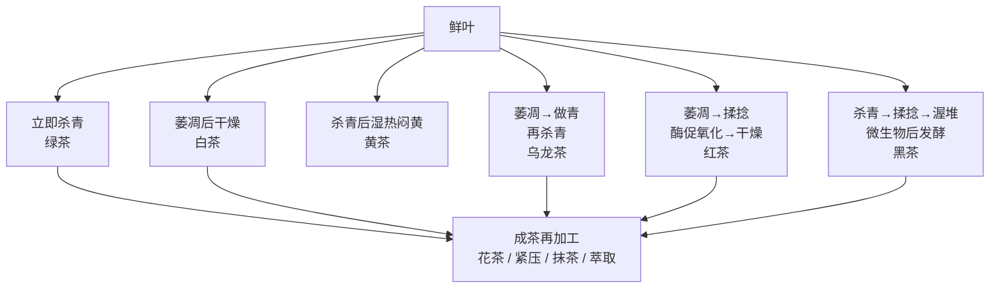

# 第二部分小结（速查）：从工艺反推茶类，再从缺陷反推工序

> 本页把第 5~12 章压成一张工艺地图。它不是新的知识来源；需要机理、参数边界或出处时，
> 回到对应原章。

## 1. 一张总图：先问“酶在什么时候被叫停”

**最短判断法**：

1. 鲜叶很早就高温灭酶，成品主要保留绿色鲜爽底子 → 先想绿茶；
2. 先让叶片缓慢失水、没有杀青 → 白茶；
3. 杀青后又有温湿条件下的“转黄、转醇” → 黄茶；
4. 叶缘局部氧化、中央仍绿，且随后杀青 → 乌龙茶；
5. 细胞充分破损后让自身酶促氧化走到底 → 红茶；
6. 有渥堆及微生物参与 → 黑茶；
7. 成茶再窨花、紧压、研磨或萃取 → 再加工茶；此时还要追问它原本是什么茶坯。

## 2. 各类茶的“工艺动作 → 成分走向 → 感官”

| 茶类 | 决定性动作 | 主导转化 | 常见感官走向 | 最容易误判的地方 |
|------|------------|----------|--------------|------------------|
| 绿茶 | 杀青 | PPO 快速失活 | 清香、鲜爽、绿汤/黄绿汤 | “绿”不是永远不变；杀青不足会青涩，过火会焦闷 |
| 白茶 | 萎凋、干燥 | 失水下的缓慢酶促/非酶变化 | 毫香、鲜醇、清甜 | 工序少不等于容易；原料均匀和失水节奏更难控 |
| 黄茶 | 杀青后闷黄 | 以湿热作用为主，可能有残余酶参与 | 黄汤黄叶、甜醇、青气减弱 | “黄”不是单靠叶绿素降解；重点是转味而非上色 |
| 乌龙茶 | 做青、杀青、焙火 | 叶缘局部酶促氧化 + 焙火热反应 | 花香、熟果香、岩韵/音韵等风格 | “半发酵百分比”无统一可比标尺 |
| 红茶 | 揉捻（切）、发酵、干燥 | 茶叶自身 PPO 驱动的充分氧化 | 红亮、甜醇、浓强鲜 | “发酵”不是微生物发酵；过度会暗而淡 |
| 黑茶 | 渥堆 / 发花 / 陈化 | 微生物及其胞外酶 + 湿热 | 陈醇、红褐、醇厚 | 黑茶内部的优势菌与路线并不相同；陈化不等于无限变好 |
| 再加工茶 | 窨制、紧压、研磨、萃取等 | 改香气、形态或载体 | 取决于茶坯及再加工目标 | 花茶、茶饼、抹茶不是新的“基础茶类” |

## 3. 缺陷反推：先分“原料、转化、干燥、仓储”四层

| 看到/喝到什么 | 优先回查哪一层 | 可能的工艺方向 | 不应草率下的结论 |
|----------------|------------------|----------------|--------------------|
| 青气重、涩而不化 | 转化 | 杀青不足、做青/发酵不足，或原料本就酚高 | 只凭“涩”断言是假茶/农残 |
| 焦味、火味、香低 | 干燥/焙火 | 温度过高、受热不匀、复火过度 | 所有焙火香都是缺陷 |
| 红暗、浑、滋味钝 | 转化 | 红茶氧化过度，或储存劣变 | 汤色越深品质越好 |
| 叶底花杂 | 原料 + 工艺 | 五分开不足、原料不匀，参数无法同时适配 | 单一环节必然能解释全部问题 |
| 水闷、霉味、仓味 | 仓储 / 水热控制 | 受潮、通风不当、渥堆或窨制水热失控 | 都可用“陈香”解释 |

> **诊断纪律**：感官现象通常只给出“候选原因”，不是诊断书。要结合干茶、叶底、
> 工艺信息、储存史与对照样一起判断；第三部分会把这套流程标准化。

## 4. 最容易混淆的六组概念

| 不要混同 | 区别 |
|----------|------|
| 酶促氧化 vs 微生物发酵 | 前者主要是茶叶自身 PPO；后者由微生物群落及胞外酶主导 |
| 杀青 vs 干燥 | 杀青的目标是灭酶；干燥的目标是降水分和稳定产品，可能兼有终止转化作用 |
| 黄茶闷黄 vs 黑茶渥堆 | 前者以温和湿热转味为主；后者是微生物后发酵体系 |
| 红茶“发酵” vs 黑茶“发酵” | 行业同词，机制不同，不能从名称推断有益菌或健康效果 |
| 茶坯 vs 最终产品 | 绿茶茶坯经窨制后是花茶；压成饼也不能只用形状判断基础茶类 |
| 成分变化 vs 品质一定提升 | 可测变化不自带价值判断；任何氧化、陈化和焙火都有适度区间 |

## 5. 证据强度：本部分带走的边界

**✅ 可作为工作结论**：六大基本茶类由决定性加工路线区分；杀青、萎凋、闷黄、做青、
红茶酶促氧化、黑茶微生物后发酵分别是理解工艺的核心钥匙；再加工茶从成茶出发。

**⚠️ 应保留条件**：具体温度、时长、次数、所谓“发酵度百分比”高度依赖品种、原料、
设备与产区，不能搬成通用配方；白茶/黄茶部分机制、普洱自然陈化的驱动力比例仍有争议。

**❌ 不成立**：“工序多就更高级”“发酵越深越浓”“越陈越好”“茶饼必然耐泡”“花越多
花茶越好”“抹茶就是绿茶粉”。

## 6. 接下来怎么用这张表

第三部分不再从“这是什么茶”出发，而从“我实际看见、闻到、喝到什么”出发，反向回到
本页的工艺链。现在最值得做的不是背完所有名茶，而是做一次
[项目 P1：从工艺特征反推茶类与工艺缺陷](project-P1-reverse-engineering.md)。
