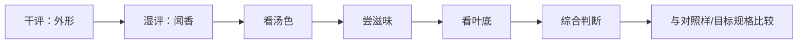

# 第 13 章 审评体系概览：把“我喜欢”与“样品表现”分开

> **本章问题**：既然味觉很主观，为什么还要做感官审评？标准方法在控制什么，又不控制什么？

茶叶感官审评不是假装消灭主观感受，而是给主观感受一个共同的实验条件。GB/T 23776 规定
审评以外形、汤色、香气、滋味、叶底为基本因子；GB/T 14487 提供相应术语。[^standards]
它们共同解决的问题是：让“这两个样品谁更符合某个质量要求”变成可以复查、对照和讨论的判断。

## 13.1 审评与日常喝茶：目的不同，参数就不该相同

| | 日常冲泡 | 感官审评 |
|---|----------|----------|
| 目的 | 让自己喝得舒服 | 放大样品间的可比差异 |
| 参数 | 随茶、器具和个人偏好调节 | 尽量按同一方法固定 |
| 输出 | “我今天喜欢这样喝” | 因子记录、评语、相对判断 |
| 能否直接代替对方 | 不能 | 也不能——审评结果仍需说明样品与条件 |

标准审评常会使用比日常更“苛刻”的浸泡条件。它不是在寻找最好喝的一泡，而是在增加信息量：
若茶在统一条件下仍能维持香气纯度、滋味协调和叶底完整，样品差异更容易显现。把审评法当成
家用最佳配方，或把家用偏好当成质量检验，都会混淆问题。

## 13.2 五因子不是五次打分，而是五份独立证据

| 因子 | 主要看什么 | 它最容易提供的线索 |
|------|------------|--------------------|
| 外形 | 形状、嫩度、色泽、整碎、净度 | 原料规格、整形与精制是否一致 |
| 汤色 | 色类、明暗、清浊 | 色素状态、悬浮物和转化/储存异常 |
| 香气 | 类型、浓度、纯度、持久性 | 品种/工艺特征及烟、焦、霉、馊等异常 |
| 滋味 | 浓淡、厚薄、醇涩、纯异、鲜钝 | 可溶物结构、协调性与工艺走向 |
| 叶底 | 嫩度、色泽、明暗、匀整 | 原料均匀性、工艺受热与转化程度 |

任何一个因子都不等于“真相”。例如汤色深既可能来自充分氧化，也可能来自过度转化或仓储；
只有和香气、滋味、叶底合看，推断才有强度。第二部分的“工艺反推”在这里进入标准流程。

## 13.3 为什么要密码编号和对样

人会被产地、价格、包装、品牌和“年份”影响预期。这不是品茶者不诚实，而是感知的正常机制。
所以比较审评时，应尽量：

1. **密码编号**：评审时不知道样品身份；
2. **随机呈样**：避免固定顺序让后样总被前样衬托；
3. **同条件制备**：同一水、器具、投茶量、浸泡时间和环境；
4. **对样**：不是从脑中找一个抽象的“好茶”，而是与已知目标样进行相对比较；
5. **先记后议**：每人先独立记录，再讨论，避免第一个人的措辞变成全组答案。

“盲评”只减少身份线索的影响，**不保证结论正确**。若样品、方法、人数或重复不足，盲评的
结果也只是有限条件下的一次观察；它比“看牌子先下结论”可靠，但不能自动变成科学定论。

## 13.4 从感觉到记录：先描述，后评价

新手最常见的记录是“好喝、香、顺”。它们可以保留在个人笔记里，但还不能帮别人复现。
先把一句总评拆开：

| 总评 | 拆成可记录的观察 | 暂时不要跳到的结论 |
|------|------------------|----------------------|
| “很香” | 花香/果香/火香？浓度如何？是否纯正、是否持久？ | 一定是高山、名山或高价茶 |
| “很顺” | 苦、涩、厚薄、刺激性、回甘分别如何？ | 一定是老茶或好仓储 |
| “颜色漂亮” | 色类、明暗、清浊、是否有悬浮物？ | 一定代表品质更高 |
| “叶底很好” | 嫩度、匀整、颜色一致性、是否焦斑/糊边？ | 一定没有拼配 |

记录顺序很重要：先写“看见/闻到/感到什么”，再写“我认为原因是什么”。这会把事实与推断
分离，让你以后能修改推断，却不丢失当时的观察。

## 13.5 常见说法辨析

| 说法 | 判定 | 说明 |
|------|------|------|
| “审评就是装专业，喝茶本来主观” | **❌ 错误** | 审评不否认偏好；它通过固定条件、术语和对照样，让不同人的判断可比较。 |
| “标准审评泡出来不好喝，说明标准没用” | **❌ 错误** | 它的目标是暴露差异和缺陷，不是提供个人最喜欢的一泡。 |
| “盲评结果一定客观” | **⚠️ 不充分** | 盲评减少身份偏差，但仍受样本量、方法、重复和评审训练限制。 |
| “一项指标好就说明茶好” | **❌ 错误** | 五因子是互补证据；单一汤色、香气或叶底都不能独立完成品质判断。 |

## 13.6 思考题

1. 为什么标准审评常不等于“最好喝的一泡”？
2. 五因子中，为什么任何一个因子都不能单独完成工艺判断？请举一个汤色的例子。
3. 密码编号、随机呈样、对样、先记后议，各自主要在减少哪一种误差？
4. 把“这茶很顺、很高级”改写成至少四条可复核的观察。

> 📖 **参考答案**（想清楚再看）：[Q1](../../qa/13-sensory-overview-qa.md#q1) · [Q2](../../qa/13-sensory-overview-qa.md#q2) · [Q3](../../qa/13-sensory-overview-qa.md#q3) · [Q4](../../qa/13-sensory-overview-qa.md#q4)

## 13.7 本章实操

### 🅐 无器具版：把一条“好喝”评论拆成证据

找一条茶评，把原文拆入下表。没有写到的格子就留空，不能替作者补写。

| 原话 | 其中的观察 | 其中的评价 | 缺少的审评条件/信息 |
|------|------------|------------|---------------------|
| | | | |

### 🅑 有条件版：一次最小双样盲评（备齐后再做）

**所需**：两款茶、两个相同器具、秤、温度计、同伴一名；可使用[冲泡记录表](../../forms/brewing-log.md)。
同伴将茶样编号为 1/2；你以相同参数冲泡，在揭晓前仅写五因子记录，不写“哪个贵/哪个更好”。

| 因子 | 1 号 | 2 号 | 我的观察事实 |
|------|------|------|--------------|
| 外形 | | | |
| 汤色 | | | |
| 香气 | | | |
| 滋味 | | | |
| 叶底 | | | |

揭晓后补写：我原先的猜测是否受包装、价格或产地故事影响？这不是考“猜中”，而是测量自己
哪些线索真能稳定使用。

## 13.8 本章主要参考

| 本章的哪个结论 | 来源 |
|----------------|------|
| 感官审评的五因子、初制/精制茶审评要素、术语使用 | [GB/T 23776-2018《茶叶感官审评方法》标准信息](https://std.samr.gov.cn/search/stdPage?q=GB%2FT23776)；标准文本的因子摘录见[公开转录](https://www.bzxz.net/bzxz/164615.html) |
| 审评术语标准的现行状态 | [GB/T 14487-2017《茶叶感官审评术语》国家标准信息](https://std.samr.gov.cn/gb/search/gbDetailed?id=JEMJWUvnPGg%3D&mode=p) |
| 五因子与香气、滋味直接影响品质的讨论 | [施兆鹏、孙红，《茶叶科学》：试论茶叶感官审评](https://www.tea-science.com/CN/10.13305/j.cnki.jts.1987.01.001) |

[^standards]: 标准编号、版本与适用范围见[国标与文献索引](../../standards.md)。
