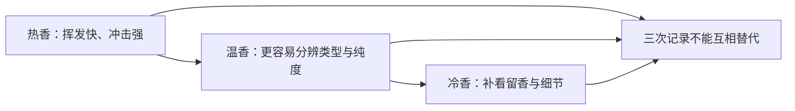

# 第 16 章 香气：类型、浓度、纯度、持久性是四个问题

> **本章问题**：闻到“花香”之后还要问什么？为什么香高不必然香好？

香气审评至少拆为**类型、浓度、纯度、持久性**。它们描述同一杯茶的不同维度：闻起来像什么、
有多明显、是否夹杂异气、能留多久。[^standard]

## 16.1 先按四维记录，不抢着猜产地

| 维度 | 要问什么 | 示例 | 常见误写 |
|------|----------|------|----------|
| 类型 | 像哪一类气息？ | 清香、花香、果香、甜香、火香、陈香 | 把“像兰花”直接写成产区证明 |
| 浓度 | 香气有多明显？ | 高、较高、尚高、低 | 只写“香” |
| 纯度 | 是否有异杂气？ | 纯正、较纯、带青气/焦气/烟气 | 香高就默认纯 |
| 持久性 | 热、温、冷后是否仍在？ | 热香高，温香仍显；冷后留香短 | 一次热闻代替全部判断 |

## 16.2 温度是“闻香的扫描器”

热闻容易捕捉高扬部分，但也容易让刺激性或火气遮住细节；温度下降后，类型和异气往往更清楚；
冷香不是“越冷越好”，而是为持久性提供补充证据。每次闻香都应写下温度状态，而非把三次感受
混成一个形容词。

## 16.3 香气从哪里来：四条来源线，不能互相替代

| 来源线 | 主要来自什么 | 例子 | 不能推出什么 |
|--------|--------------|------|--------------|
| 品种/鲜叶 | 遗传、生态、采摘带来的前体差异 | 清香、毫香的基础倾向 | 某香型只属于一个品种 |
| 工艺 | 萎凋、做青、氧化、焙火等生成或释放挥发物 | 花果香、甜香、火香 | 一个香词能锁定某道工序 |
| 再加工 | 窨制、拼配、萃取等 | 茉莉花香 | 花香强就说明窨制次数多 |
| 储存/劣变 | 氧化、吸附、微生物和环境带来的变化 | 陈香、仓味、霉味 | 所有陈香都代表好仓储 |

茉莉花茶的研究能检测到一组与茶坯不同的特征挥发物，说明窨制香气具有物质基础；但样品、
茶坯和工艺不同，不能用单一化合物或单一香词给所有花茶下结论。[^jasmine]

## 16.4 异气先描述，再找候选原因

| 异气线索 | 候选原因 | 还需检查 |
|----------|----------|----------|
| 青气 | 杀青、做青或发酵不足；原料/冲泡影响 | 叶底、滋味涩感、工艺信息 |
| 焦气/火气 | 受热过高、焙火过度 | 是否伴焦苦、焦斑、香低 |
| 烟气 | 熏焙风格或污染 | 产品类型、是否纯正协调 |
| 酸馊气 | 工艺或储存异常 | 滋味、叶底、受潮史 |
| 霉气/仓味 | 潮湿仓储或污染 | 汤色、叶底、包装完整性 |

候选原因不是诊断结论。审评词的作用是把异常暴露出来，后续仍要以多因子和样品信息交叉验证。

## 16.5 常见说法辨析

| 说法 | 判定 | 说明 |
|------|------|------|
| “香高就是好茶” | **❌ 错误** | 香气还须看纯度、协调性和持久性；刺鼻或异杂气可很高。 |
| “闻到兰花香就能判断品种/山场” | **❌ 缺乏证据** | 同一香感可由多种原料与工艺组合产生。 |
| “冷香强一定说明品质最好” | **⚠️ 不充分** | 冷香是持久性信息之一，仍需与其他因子合看。 |
| “陈香一定是好仓” | **❌ 错误** | 需同查纯度、仓味、霉气、汤色、叶底与储存信息。 |

## 16.6 思考题

1. 为什么“花香高”还不是完整审评结论？
2. 热香、温香、冷香各补充什么信息？
3. 闻到焦气后，为什么不能立刻断言“焙火过度”？
4. 用四维法改写“这款茉莉花茶很香”。

> 📖 **参考答案**（想清楚再看）：[Q1](../../qa/16-aroma-qa.md#q1) · [Q2](../../qa/16-aroma-qa.md#q2) · [Q3](../../qa/16-aroma-qa.md#q3) · [Q4](../../qa/16-aroma-qa.md#q4)

## 16.7 本章实操

### 🅐 无器具版：给一条香气描述补全四维

从商品页或茶评中找三条“香”描述，填写类型、浓度、纯度、持久性；原文没有的栏留空。

| 原文 | 类型 | 浓度 | 纯度 | 持久性 | 仍不能推出什么 |
|------|------|------|------|--------|----------------|
| | | | | | |
| | | | | | |

### 🅑 有条件版：三温闻香记录（备齐后再做）

**所需**：一款茶、带盖器具、白纸、计时工具。冲泡后在热、温、冷三个状态各闻一次，
不追求猜中“是什么香”，只写四维与是否出现异气。

| 状态 | 类型 | 浓度 | 纯度 | 持久性线索 | 不确定处 |
|------|------|------|------|------------|----------|
| 热 | | | | | |
| 温 | | | | | |
| 冷 | | | | | |

## 16.8 本章主要参考

| 本章的哪个结论 | 来源 |
|----------------|------|
| 香气审评的类型、浓度、纯度、持久性维度 | [GB/T 23776-2018 标准信息](https://std.samr.gov.cn/search/stdPage?q=GB%2FT23776)；[GB/T 14487-2017 标准信息](https://std.samr.gov.cn/gb/search/gbDetailed?id=JEMJWUvnPGg%3D&mode=p) |
| 茉莉花茶的特征香气成分 | [An 等，《茶叶科学》：茉莉花茶特征香气成分研究](https://www.tea-science.com/EN/10.13305/j.cnki.jts.2020.02.009) |

[^standard]: 标准编号与版本提示见[国标与文献索引](../../standards.md)。
[^jasmine]: 研究结果来自特定样品与检测方法，只支持“存在可测香气差异”，不支持跨产品的单一品质公式。
