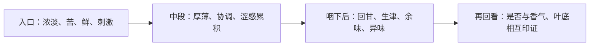

# 第 17 章 滋味：把浓淡、厚薄、苦涩、鲜钝拆开记录

> **本章问题**：为什么“苦”和“涩”不是一回事？“顺”“厚”“回甘”又分别在描述什么？

滋味审评常涉及浓淡、厚薄、醇涩、纯异和鲜钝。它们是感官维度，不是成分化验结果；
成分知识能帮助提出候选机制，却不能替代实际记录。[^standard]

## 17.1 一杯茶至少有五条并行的味觉/口腔线索

| 线索 | 你实际在记录什么 | 常见物质基础（仅作候选） | 不等于什么 |
|------|------------------|--------------------------|------------|
| 浓/淡 | 可感知滋味总体强度 | 水浸出物、投茶量、时间等共同影响 | 厚/薄、好/坏 |
| 厚/薄 | 口腔中的饱满、稠实或单薄感 | 可溶糖、果胶、多糖等可能参与 | 汤色深浅 |
| 苦 | 味觉，常即时出现 | 咖啡碱、酯型儿茶素等 | 涩 |
| 涩 | 收敛、发干等触觉，常延迟累积 | 多酚与唾液相互作用等 | 苦、品质一定差 |
| 鲜/钝 | 鲜爽活性或迟钝平滞感 | 氨基酸与多酚比例等 | 是否“加了鲜味剂” |

第 1 章已说明：苦与涩的感受通道不同。苦更像味觉信号；涩是口腔润滑降低后的收敛感，
往往在咽下后更明显。把两者合成“苦涩”会丢失诊断线索。

## 17.2 按时间记录，能少犯一半误判

| 时段 | 推荐问题 | 例子 |
|------|----------|------|
| 入口 | 有多浓？苦感是否立刻出现？ | “入口较浓，苦感中等” |
| 中段 | 是否饱满、醇和？涩感是否上升？ | “中段较厚，涩感在后段增强” |
| 咽下后 | 回甘/生津多久出现？是否有滞涩或异味？ | “咽下后回甘较快，涩感不滞留” |

回甘、生津是稳定存在的感官现象，但其生理机制并无统一定论；记录现象即可，不必把某种
单一机理当成事实。[^aftertaste]

## 17.3 “协调”是关系判断，不是无苦无涩

协调的意思不是把所有刺激降到零，而是各成分感受之间不互相打架。例如一款红茶可以有适度
苦感和收敛感，但若甜醇、香气与厚度能承接它，仍可能协调；反之，一杯完全不苦的茶也可能淡薄、
水感重而不协调。

| 观察 | 更稳妥的记录 | 不稳妥的跳跃 |
|------|--------------|--------------|
| 苦感存在但很快消退 | “苦感中等，消退快” | “苦所以品质差” |
| 涩感逐泡累积 | “涩感后段增强、滞留” | “一定农残” |
| 茶汤浓却单薄 | “浓度较高，厚度不足” | “浓=厚” |
| 清甜却滋味弱 | “清甜，整体偏淡” | “甜=醇厚” |

## 17.4 从滋味反推时，先排除冲泡变量

冲泡本身会改变茶汤的成分比例。高温、长时、细碎或紧压未充分解块，都可能改变苦涩、厚度和
浓淡。因此面对一杯“太苦/太涩”，诊断顺序应是：

1. 核对投茶量、水温、时间、器具与茶叶形态；
2. 再看样品香气、汤色、叶底是否也指向工艺或储存异常；
3. 有对照样再讨论原料或制茶问题。

这不是为样品找借口，而是避免把一个可控冲泡变量误判成不可逆的品质缺陷。

## 17.5 常见说法辨析

| 说法 | 判定 | 说明 |
|------|------|------|
| “苦涩是一种感受” | **❌ 不准确** | 苦是味觉，涩是收敛触觉；记录与成因都应分开。 |
| “不苦不涩就是好茶” | **❌ 错误** | 可能只是淡；协调性看多维关系，不是刺激归零。 |
| “回甘一定来自某一种成分” | **⚠️ 缺乏定论** | 现象可记录，具体机制仍有多种假说。 |
| “涩感就说明农残” | **❌ 错误** | 多酚、冲泡和工艺都可造成涩；农残判断需检验，不能靠口感。 |

## 17.6 思考题

1. 为什么苦和涩必须分开记录？
2. “浓而薄”和“淡而厚”分别可能是什么体验？
3. 为什么一杯“很顺”的茶仍需要记录苦、涩、厚度和余味？
4. 面对一杯过涩的茶，为什么先查冲泡变量而不是先判工艺失败？

> 📖 **参考答案**（想清楚再看）：[Q1](../../qa/17-taste-qa.md#q1) · [Q2](../../qa/17-taste-qa.md#q2) · [Q3](../../qa/17-taste-qa.md#q3) · [Q4](../../qa/17-taste-qa.md#q4)

## 17.7 本章实操

### 🅐 无器具版：拆解“顺口”

找一条写“顺口/醇厚/回甘”的茶评，按下表追问它究竟少写了什么。

| 原句 | 浓淡 | 厚薄 | 苦 | 涩 | 鲜钝 | 咽下后 | 缺失信息 |
|------|------|------|----|----|------|--------|----------|
| | | | | | | | |

### 🅑 有条件版：一杯茶的三段滋味图（备齐后再做）

**所需**：一款茶、计时工具、[冲泡记录表](../../forms/brewing-log.md)。按固定参数冲泡，
每一口只写入口/中段/咽下后三段，不给总分。第二次冲泡只改变一个变量（如时间），比较哪个
维度真正变化。

## 17.8 本章主要参考

| 本章的哪个结论 | 来源 |
|----------------|------|
| 滋味审评维度 | [GB/T 23776-2018 标准信息](https://std.samr.gov.cn/search/stdPage?q=GB%2FT23776)；[GB/T 14487-2017 标准信息](https://std.samr.gov.cn/gb/search/gbDetailed?id=JEMJWUvnPGg%3D&mode=p) |
| 苦、涩、成分与回甘机制边界 | [第 1 章：一片叶子里有什么](../01-foundation/01-leaf-chemistry.md)及其主要参考 |

[^standard]: 具体术语与标准版本见[国标与文献索引](../../standards.md)。
[^aftertaste]: 本书只把回甘/生津作为审评现象记录，不据此做医疗或生理功效承诺。
