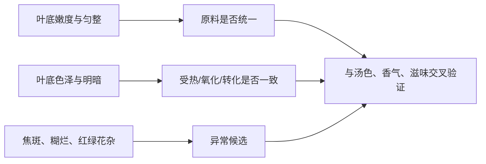

# 第 18 章 叶底与汤色：两项最不容易被一句文案带走的证据

> **本章问题**：为什么颜色不能只看“深不深”？叶底为什么常能推翻前面过快的判断？

汤色记录颜色种类、色度、明暗和清浊；叶底记录嫩度、色泽、明暗和匀整度。[^standard]
两者都不是“拍照打分”，而是用来交叉检验原料、工艺、冲泡与储存推断。

## 18.1 汤色：色类、亮度、清浊是三条轴

| 轴 | 记录问题 | 例子 | 不可替代的原因 |
|----|----------|------|----------------|
| 色类/色度 | 黄绿、橙黄、橙红、红褐？深浅如何？ | 橙红、色度较深 | 只说“红”信息不足 |
| 明暗 | 明亮、尚亮、暗？ | 红浓明亮 / 红暗 | 深不等于亮 |
| 清浊 | 清澈、欠清、有悬浮物？ | 橙黄清澈 | 亮不等于清 |

汤色变化的候选原因很多：茶类工艺、浸泡条件、细碎度、冷却析出、储存与污染都可能参与。
因此汤色是证据，不是最终判决。

## 18.2 叶底：把“经历过什么”留在叶片上

| 叶底观察 | 可以提出的候选 | 仍须避免的结论 |
|----------|----------------|----------------|
| 嫩度、大小不一 | 采摘/拼配/筛分不均 | 一定是掺假 |
| 红绿花杂 | 做青、氧化或原料均匀性不足的候选 | 仅凭颜色断言具体工序 |
| 焦斑/焦边 | 局部受热过强的候选 | 仅凭一片叶就定义整批茶 |
| 暗褐、糊烂、异味 | 过度转化或受潮劣变的候选 | 自动归因于“老茶” |
| 匀整、色泽协调 | 原料和工艺一致性的支持证据 | 一定是高等级或单一产地 |

## 18.3 观察顺序能降低预期污染

先完成干茶、香气、汤色和滋味的原始记录，再看叶底。这样叶底不是拿来“证明我早就猜对”，
而是一份独立证词：若它支持前面推断，结论变强；若相冲突，应保留冲突而不是删掉不合意的观察。

## 18.4 常见说法辨析

| 说法 | 判定 | 说明 |
|------|------|------|
| “汤色越深越好” | **❌ 错误** | 色度、明暗、清浊独立；深而暗浑可提示过度或异常。 |
| “叶底好看就肯定好喝” | **❌ 错误** | 叶底不能替代香气和滋味，但能提供独立证据。 |
| “叶底能一眼看出树龄和山头” | **❌ 缺乏证据** | 它更适合判断嫩度、均匀性和受热/转化的一致性。 |

## 18.5 思考题

1. 为什么“红浓”不能自动等于“红浓明亮”？
2. 前面闻到闷气、喝到平钝，叶底又暗褐不匀，这三条证据怎样共同改变判断？
3. 叶底匀整能支持什么，又不能支持什么？

> 📖 **参考答案**：[Q1](../../qa/18-liquor-leaf-qa.md#q1) · [Q2](../../qa/18-liquor-leaf-qa.md#q2) · [Q3](../../qa/18-liquor-leaf-qa.md#q3)

## 18.6 本章实操

### 🅐 无器具版：三轴改写

把一条“汤色漂亮、叶底好”的茶评，改写为色类/明暗/清浊和嫩度/色泽/匀整六格；没有信息就写无。

### 🅑 有条件版：白底叶底记录

同一款茶冲泡后，把叶底摊在白底器皿上，在自然稳定光线下记录。不要用滤镜或强色光；
第二次冲泡时保持茶样不变，只改冲泡时间，观察汤色与叶底分别发生什么变化。

## 18.7 本章主要参考

| 结论 | 来源 |
|------|------|
| 汤色、叶底审评要素 | [GB/T 23776-2018 标准信息](https://std.samr.gov.cn/search/stdPage?q=GB%2FT23776) |

[^standard]: 标准版本提示见[国标与文献索引](../../standards.md)。
