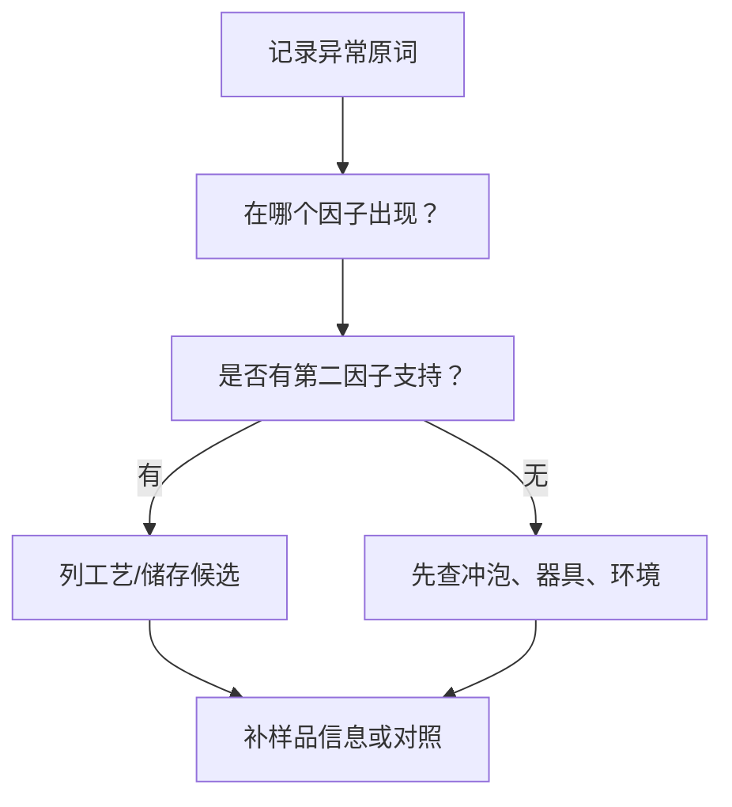

# 第 19 章 缺陷与劣变：把异常写出来，再找可检验的候选原因

> **本章问题**：烟焦、酸馊、陈霉、水闷、青气各提示什么？为什么不能凭一个词给茶定罪？

缺陷审评的目标不是给样品贴羞辱标签，而是让异常可被复查，并把排查范围收窄。首先写感官事实，
再列候选原因，最后写还需要什么证据。

## 19.1 五类高频异常

| 异常 | 感官线索 | 常见候选原因 | 需要交叉检查 |
|------|----------|--------------|--------------|
| 青气 | 生青、青叶感；常伴涩或转化不足感 | 杀青/做青/氧化不足，原料或冲泡影响 | 叶底、滋味、工艺信息 |
| 焦/烟 | 焦糊、烟熏、火气 | 受热过高、熏焙风格、外来污染 | 是否协调、是否有焦苦/焦斑、产品路线 |
| 酸馊 | 酸闷、馊气、不洁感 | 工艺水热失控、受潮、微生物异常 | 汤色、叶底、储存史 |
| 水闷 | 闷、熟、湿钝，香不鲜 | 含水/散热/干燥控制不当 | 是否伴霉气、叶底与包装状态 |
| 霉/仓 | 霉味、潮味、陈旧异味 | 潮湿仓储、污染、劣变 | 可见霉变、受潮、汤浊、叶底糊烂 |

“陈香”与“仓味”不能互相替代。前者是可能被接受的陈化香气描述；后者通常指不洁、潮湿或
令人不愉快的储存异气。实际判断仍须看纯度、协调性及是否有霉变线索。

## 19.2 缺陷排查的最小流程

一个实用例子：若只在杯盖热闻时有烟气，而滋味、叶底正常，先查器具残留或环境气味；若烟气
贯穿热香、温香、滋味并伴焦苦和焦斑，受热问题的候选才更强。

## 19.3 食品安全边界：审评不是检测

霉味、酸馊或异常仓味足以提示“停止把它当作正常风格赞美，并检查产品”；但感官审评不能判断
具体霉菌、毒素、农残或污染物含量。食品安全问题须依赖合规检测与监管标准，不能由“喝起来没事”
或“闻着像”取代。

## 19.4 常见说法辨析

| 说法 | 判定 | 说明 |
|------|------|------|
| “烟气一定是缺陷” | **⚠️ 需看产品与协调性** | 某些小种茶有熏焙路线；刺鼻、焦苦、掩盖主体香气则是异常线索。 |
| “仓味就是陈香” | **❌ 错误** | 二者的纯度、愉悦性和储存含义不同，不能互相洗白。 |
| “没有异味就绝对安全” | **❌ 错误** | 感官不能替代食品安全检验。 |
| “涩、苦、青气都说明农残” | **❌ 错误** | 它们有大量正常工艺/冲泡解释；农残需检测。 |

## 19.5 思考题

1. “烟气”何时可能是风格，何时更像缺陷线索？
2. 为什么仓味不能直接叫陈香？
3. 面对霉味，审评能做什么、不能做什么？

> 📖 **参考答案**：[Q1](../../qa/19-defects-qa.md#q1) · [Q2](../../qa/19-defects-qa.md#q2) · [Q3](../../qa/19-defects-qa.md#q3)

## 19.6 本章实操

### 🅐 无器具版：异常三栏表

找三条“翻车茶评”，把原词、候选原因、需要补的证据拆开。禁止把候选原因写成事实。

### 🅑 有条件版：器具空白对照

用同一器具先注入热水、闻杯盖与杯内，再冲泡茶样。若空杯已有异气，先清洁器具或更换器具，
不要把它记到茶样头上。

## 19.7 本章主要参考

| 结论 | 来源 |
|------|------|
| 审评术语与香气、滋味、叶底因子 | [GB/T 23776-2018](https://std.samr.gov.cn/search/stdPage?q=GB%2FT23776)；[GB/T 14487-2017](https://std.samr.gov.cn/gb/search/gbDetailed?id=JEMJWUvnPGg%3D&mode=p) |
| 黑茶/普洱陈化、仓储与食品安全边界 | [第 11 章 黑茶与普洱](../02-processing/11-dark-tea.md)及其主要参考 |
