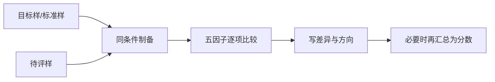

# 第 20 章 评分与对样：分数是比较工具，不是茶的永久身份证

> **本章问题**：为什么同一款茶能被不同人打出不同分数？怎样让分数至少能回到同一把尺上？

评分把五因子记录压缩为一个数，方便排序，却也会丢失信息。GB/T 23776 的关键不是“给所有茶找
绝对分”，而是在规定条件下以标准样或成交样为水平依据，做相对审评。[^standard]

## 20.1 分数前必须写清四件事

| 必须写明 | 否则分数缺什么 |
|----------|----------------|
| 样品身份与批次 | 不知道在给哪一批茶打分 |
| 冲泡/审评条件 | 无法重现茶汤 |
| 对照样或目标规格 | 不知道“高/低”相对谁 |
| 评审者与次数 | 不知道是一次感受还是稳定判断 |

同一茶样在不同水、器具、温度、评审者和目标规格下出现不同分数，并不必然代表谁错；
多数时候是比较坐标变了。

## 20.2 对样比“背标准分”更重要

对样训练的是相对敏感度：比目标样更高、较低、相近，究竟差在外形、香气、滋味还是叶底。
直接问“这茶值几分”会诱使人把个人偏好、品牌故事和价格混进同一个数字。

## 20.3 评分的三个使用边界

1. **先写评语，后给分**：若写不出五因子差异，数字没有可解释基础；
2. **同组内比，不跨宇宙比**：不同茶类、不同目标风格和不同冲泡协议的分数不宜直接排队；
3. **重复比单次更重要**：一次高分只能证明那次条件下的判断；重复一致才说明你有稳定标尺。

## 20.4 常见说法辨析

| 说法 | 判定 | 说明 |
|------|------|------|
| “90 分就是所有人都觉得好” | **❌ 错误** | 分数依赖样品、方法、对照、评审者与权重。 |
| “不打分就不专业” | **❌ 错误** | 结构化五因子评语本身可复核；分数是可选压缩工具。 |
| “标准样限制个人口味” | **❌ 错误** | 对样用于质量比较；个人偏好可另记，二者不冲突。 |

## 20.5 思考题

1. 为什么分数不是茶的永久属性？
2. 为什么应先写评语后给分？
3. 两款不同茶类都被打 90 分，为什么不宜直接说它们“同样好”？

> 📖 **参考答案**：[Q1](../../qa/20-scoring-reference-qa.md#q1) · [Q2](../../qa/20-scoring-reference-qa.md#q2) · [Q3](../../qa/20-scoring-reference-qa.md#q3)

## 20.6 本章实操

### 🅐 无器具版：给一张打分表补上下文

找任意评分表，检查它是否写明样品、条件、对样、评审者和次数；缺失项比最终总分更值得标出。

### 🅑 有条件版：三次二选一对样（备齐后再做）

**所需**：两款茶、同伴、相同器具。固定冲泡条件，让同伴随机编号，连续三次只回答
“与对样相比，哪一因子更高/更低/相近”，最后才尝试给分。目标不是三次猜中身份，而是评语稳定。

## 20.7 本章主要参考

| 结论 | 来源 |
|------|------|
| 对样、密码审评、五因子及评分方法 | [GB/T 23776-2018 标准信息](https://std.samr.gov.cn/search/stdPage?q=GB%2FT23776)；[公开转录](https://www.bzxz.net/bzxz/164615.html) |

[^standard]: 标准编号与版本提示见[国标与文献索引](../../standards.md)。
